# DDD START - 최범균

최범균 저자님의 DDD START를 읽으면서 핵심 요약하며 공부한 내용입니다.

# 1. 도메인 모델 시작 

* 도메인 모델
* 엔티티와 벨류
* 도메인 용어

## 도메인
* 개발자 입장에서 소프트웨어로 해결하고자 하는 문제 영역 : `도메인`
    * ex: 온라인 서점 소프트웨어 온라인으로 책을 판매해야함
      * 필요한 기능 : 상품 조회, 구매, 결제, 배송, 추적 등의 기능 

* 도메인은 다시 하위 도메인으로 나눌 수 있다.

## 도메인 모델
* 도메인 모델에는 다양한 정의가 존재. 
* 기본적으로 도메인 모델은 특정 도메인을 개념적으로 표현한 것.
* 예를 들어 온라인 쇼핑몰에서의 주문
  * 상품을 몇 개 살지 선택하고 배송지 입력
  * 총 지불 금액을 계산하고 결제 수단 선택
  * 주문 뒤에도 배송 전이면 배송지 주소를 변경하거나 주문 취소 가능
  * 
    * Order는 주문번호와 지불할 총금액을 포함
    * 배송정보를 변경, 취소할 수 있는 기능 제공.
* 도메인 모델을 사용하면 여러 관계짜들이 동일한 모습으로 도메인을 이해하고 도메인 지식을 공유하는 데 도움이 된다.
* 도메인은 다수의 하위 도메인으로 구성된다.
  * 각 하위 도메인이 다루는 영역은 서로 다르기 때문에 같은 용어라도 하위 도메인마다 의미가 달라질 수 있다.
  * 도메인에 따라 용어의 의미가 결정되므로 여러 하위 도메인을 하나로 모델링 하면 안 된다. 

## 도메인 모델 패턴
* 일반적인 애플리케이션 아키텍처 구성
  * 
  * UI 또는 표현 계층 : 사용자의 요청을 처리하고 정보를 보여줌. 사용자는 SW를 사용하는 사람 뿐만 아니라 외부 시스템도 사용자가 될 수 있다(API?)
  * 응용 : 사용자가 요청한 기능을 실행한다. 업무 로직을 직접 구현하지 않으며 도메인 계층을 조합해서 기능을 실행한다.
  * 도메인 : 시스템이 제공할 도메인의 규칙을 구현
  * 인프라스트럭쳐: 데이터베이스나 메시징 시스템과 같은 외부시스템과의 연동 처리 

* 개념모델과 구현모델
  * 개념 모델은 순수하게 문제를 분석한 결과물이다.
  * 개념 모델은 데이터베이스,트랜잭션 처리, 성능, 구현 기술과 같은 것들을 고려하고 있찌 않기 때문에 실제 코드를 작성할 때 있는 그대로 사용할 수 없다.
  * 개념모델을 구현 가능한형태의 모델로 전환하는 과정을 거치게 된다
  * 처음부터 완벽한 개념 모델을 만들기보다는 전반적인 개요를 알 수 있는 수준으로 개념모델을 작성해야 한다.
  * 프로젝트 초기에는 개요 수준의 개념 모델로 도메인에 대한 전체 윤곽을 이해하는 데 집중하고, 구현하는 과정에서 개념 모델을 구현 모델로 점진적 발전 시켜야 한다.

## 도메인 모델 도출
기획, 유스케이스, 사용자 스토리와 같은 요구사항과 관련자와의 대화를통해 도메인을 이해하고 이를 바탕으로 도메인 모델 초안을 만들어야 비로소 코드를 작성할 수 있다.

도메인을 모델링할 때 기본이 되는 작업은 모델을 구성하는 핵심 구성요소, 규칙, 기능을 찾는것이다 

예제로 다음 요구사항을 보자 
* 최소 한 종류 이상의 상품을 주문해야 한다.
* 한 상품을 한 개 이상 주문할 수 있다.
* 총 주문 금액은 각 상품의 구매 가격 합을 모두 더한 금액이다.
* 각 상품의 구매 가격 합은 상품 가격에 구매 개수를 곱한 값이다. 
* 주문할 때 배송지 정보를 반드시 지정해야 한다.
* 배송지 정보는 받는 사람 이름, 전화번호, 주소로 구성된다.
* 출고를 하면 배송지 정보를 변경할 수 없다.
* 출고 전에 주문을 취소할 수 있다.
* 고객이 결제를 완료하기 전에는 상품을 준비하지 않는다.

* 이 요구사항에서 알 수 있는 것은 다음의 4가지 기능을 제공한다.
  * 주문은 출고 상태로 변경하기
  * 배송지 정보 변경하기
  * 주문 취소하기
  * 결제 완료로 변경하기
  

```java
public class Order {
    public void changeShipped() {};
    public void changeShippingInfo(ShippingInfo newShipping){};
    public void cancel() {};
    public void completePayment() {};
}
```

* 다음 요구사항은 주문 항목이 어떤 데이터로 구성되는지 알려준다.
  * 한 상품을 한 개 이상 주문할 수 있다.
  * 각 상품의 구매 가격 합은 상품 가격에 구매 개수를 곱한 값

* 두 요구사항에 따르면 주문 항목을 표현하는 OrderLine은 다음을 포함해야한다
  * 주문할 상품
  * 상품의 가격
  * 구매 개수
  * 각 구매 항목의 구매 가격

```java
public class OrderLine {
    private Proudct product; // 상품
    private int price;
    private int quantity;
    private int amounts;
    
    private int calculateAmounts() {
        return price * quantity;
    }
    
    public int getAmounts(){}
}
```

* 다음 요구사항은 Order(주문) OrderLine과의 관계를 알려준다.
  * 최소 한 종류 이상의 상품을 주문해야 한다.
  * 총 주문 금액은 각 상품의 구매 가격 합을 모두 더한 금액이다. 
* 한 종류 이상의 상품을 주문할 수 있으므로 Order는 최소 한 개 이상의 OrderLine을 포함해야 한다
* 이 요구사항 들을 Order에 다음과 같이 반영할 수 있다.
```java
public class Order {
    private List<OrderLine> orderLines;
    private int totalAmounts;
    
    private void setOrderLines(List<OrderLine> orderLines) {
        verifyAtLeastOneOrMoreOrderLines(orderLines);
        this.orderLines = orderLines;
        calculateTotalAmounts();
    }
    
    private void verifyAtLeastOneOrMoreOrderLines(List<OrderLine> orderLines) {
        if (orderLines == null || orderLines.isEmpy()) {
            throw new IllegalArgumentException("no OrderLine");
        }
    }
    
    private void calculateTotalAmounts() {
        this.totalAmounts = new Money(orderLines.stream()
                .mapToInt(x -> x.getAmounts().getValue())).sum();
    }
}
```

* Order는 한 개 이상의 OrderLine을 가질 수 있으므로 List<OrderLine>을 가진다.
* setOrderLines() 메서드는 요구사항에 정의한 제약 조건을 검사한다
  * 요구사항에 따르면 최소 한 종류 이상의 상품을 주문해야 하므로 검증 메소드를 통하여 1개 이상 존재하는지 검사. 

* 배송지 정보는 다음 요구사항에서 이름, 전화번호, 주소 데이터를 가지므로 다음과 같이 정의.
  * 배송지 정보는 받는 사람 이름, 전화번호, 주소로 구성된다.

```java
public class ShippingInfo {
    private STring receiverName;
    private String receiverPhoneNumber;
    private String shippingAddress1;
    private String shippingAddress2;
    private String shippingZipcode;
    
  ...
}
```
* 앞서 요구사항 중에 주문할 때 배송지 정보를 반드시 지정해야 한다 는 내용이 있으므로 Order 생성시 ShippingInfo도 같이 전달
```java
public class Order {
    private List<OrderLine> orderLines;
    private int totalAmounts;
    private ShippingInfo shippingInfo;
    
    public Order(List<OrderLine> orderLines, ShippingInfo shippingInfo) {
        setOrderLines(orderLines);
        setShippingInfo(shippingInfo);
    }
    
    private void setShippingInfo(ShippingInfo shippingInfo) {
        if (shippingInfo == null) 
            throw new IllegalArgumentException("no ShippingInfo");
        this.shippingInfo = shippingInfo;
    }
} 
```
* 이렇게 배송지 정보 필수 라는 도메인 규칙을 구현할 수 있다.

도메인을 구현하다 보면 특정 조건이나 상태에 따라 제약이나 규칙이 달리 적용되는 경우가 많다. 주문 요구사항의 경우에는 다음 내용이 해당된다.
* 출고를 하면 배송지 정보를 변경할 수 없다.
* 출고 전에 주문을 취소할 수 있다.

이 요구사항은 출고 상태가 되기 전과 후의 '제약사항'을 기술한 것.  
이 요구사항을 충족하려면 주문은(Order) 적어도 출고 상태를 표현할 수 있어야 한다.  
다음과 같이 열거 타입을 이용해서 상태 정보를 표현할 수 있다.
```java
public enum OrderState {
    PAYMENT_WAITING, PREPARING, SHIPPED, DELIVERING, DELIVERY_COMPLETED, CANCELED;
}
```

배송지 변경이나 주문 취소 기능은 출고 전에만 가능하다는 제약 규칙이 있으므로 제약규칙 메서드인 verifyNotYetShipped()를 구현하여 먼저 실행한다.

> 제약조건 메서드의 이름은 도메인을 더 잘 알게 될 때마다 변경될 수 있다. 
> 이름이 명확해짐으로써 제약조건을 보다 잘 명시할 수 있고 코드의 이해도 쉬워진다.

## 엔티티와 벨류

도출한 도메인 모델은 크게 `엔티티(Entitiy)`와 `벨류(Value)`로 구분할 수 있다.
* Value 타입은 우리말로 하면 `값` 이지만, 여러 의미로 사용할 수 있기 때문에 이책에선, Value는 `벨류`로 지정한다   

* 
  * 이 그림에는 엔티티도 존재하고 벨류도 존재한다. 

## 엔티티
엔티티의 가장 큰 특징은 식별자를 갖는것이다.
* 식별자는 엔티티 객체마다 고유해서 각 엔티티는 서로 다른 식별자를 갖는다 

> Order(주문) 도메인에서 각 주문은 주무번호를 갖는데 이 주문번호는 각 주문마다 다르므로 식별자가 된다.  
> 즉 앞서 주문 도메인 모델에서 주문에 해당하는 Order 클래스가 엔티티가 되며 주문 번호를 속성으로 갖게 된다 

* 주문에서 배송지 주소가 바뀌거나 상태가 바뀌더라도 주문번호가 바뀌지 않는 것처럼 엔티티의 식별자는 바뀌지 않는다.
* 엔티티를 생성하고 속성을 바꾸고 삭제할 때 까지 식별자는 유지된다.
* 엔티티의 식별자는 바뀌지 않고 고유하기 때문에 두 엔티티 객체의 식별자가 같으면 두 엔티티는 같다고 판단할 수 있다. 
  * 따라서 식별자를 이용해서 equals()메서드와 hashCode()메서드를 구현할수 있다. 

```java
public class Order {
    private String orderNumber;
    
    @Override
    public boolean equals(Object obj) {
        if (this == obj) return true;
        if (obj == null) return false;
        if (obj.getClass() != Order.class) return false;
        Order otherOrder = (Order)obj;
        if (this.orderNumber == null) return false;
        return this.orderNumber.equals(otherOrder.orderNumber);
    }
    
    @Override
    public int hashCode() {
        final int prime = 31;
        int result = 1;
        result = prime * result + ((OrderNumber == null) ? 0 : orderNumber.hashCode());
        return result;
    }
}
```

## 엔티티의 식별자 생성 방법
1. 특정 규칙에 따라 생성
2. UUID 사용
3. 값을 직접 입력
4. 일련번호 사용(시퀀스(Seq))나 DB 자동 증가 컬럼(Auto Increment)사용

* ### 흔히 사용하는 규칙은 현재 시간과 다른 값을 함께 조합하는것.
  * ex) '2015052909644024919' 
    * 20150529094644 는 2015년 5월 29일 09시 46분 44초 의미 
    * 그 뒤는 다른 값 

* UUID 생성 API를 사용하여 생성. 자바의 경우 java.util.UUID 클래스 사용
```java
UUID uuid = UUID.randomUUID();  
```
* UUID의 자세한 내용은 https://goo.gl/7njkf3 문서 참고 

* ### 회원의 아이디나 이메일과 같은 식별자는 값을 직접 입력
  * 사용자가 직접 입력하는 값이기 때문에 중복해서 입력하지 않도록 사전에 방지하는 것이 중요 

* ### 일련번호 방식은 DB가 제공하는 자동 증가 기능 사용 (auto_increment 칼럼)
  * 자동 증가 컬럼은 DB 테이블에 데이터를 삽입해야 비로소 값을 알 수 있기 때문에 데이터를 추가하기 전에는 식별자를 알 수 없다.


## 벨류타입
위 예제의 ShippingInfo 클래스는 받는 사람과 주소에 대한 데이터를 갖고 있다.

```java
public class ShippingInfo {
    private String receiverName;        // 받는 사람
    private String receiverPhoneNumber; // 받는 사람
  
    private String shippingAddress1;    // 주소
    private String shippingAddress2;    // 주소
    private String shippingZipcode;     // 주소
    
...
}
```
receiverName 필드와 receiverPhoneNumber 필드는 서로 다른 두 데이터를 담고 있지만, 두 필드는 개념적으로는 받는 사람을 의미한다.  
즉 두 필드는 실제로 한 개의 개념을 표현하고 있다. 비슷하게 아래 세 컬럼은 주소라는 하나의 개념을 표현한다.  
벨류타입은 `개념적으로 완전한 하나를 표현할 때 사용한다.`  
* 예를 들어 받는 사람을 위한 밸류 타입인 Receiver와 주소인 Address를 다음과 같이 작성 가능하다.
```java
public class Receiver {
    private String name;
    private String phoneNumber;
}

public class Address {
    private String shippingAddress1;    // 주소
    private String shippingAddress2;    // 주소
    private String shippingZipcode;     // 주소
}
```

* 이 벨류 타입을 다시 ShippingInfo 클래스를 구현해 보면
```java
public class ShippingInfo {
    private Receiver receiver;
    private Address address;
}
```

* 이러면 보다 명확하게 판단할 수 있다.
  * 배송 정보가 받는 사람과 주소로 구성된다는 것을 쉽게 알 수 있다. 

* 벨류 타입이 꼭 두 개 이상의 데이터(필드)를 가져야 하는것은 아니다. 의미를 명확하게 표현하기 위해 밸류 타입을 사용하는 경우도 있다

```java
public class Money {
    private int value;
    
    public Money add(Money money) {
        return new Money(this.value + money.value);
    }
    
    public Money multiply(int multiplier) {
        return new Money(value * multiplier);
    }
}

public class OrderLine {
    private Product product;
    private Money price;
    private int quantity;
    private Money amounts;
    
    public OrderLine(Product product, Money price, int quantity) {
        this.product = product;
        // money가 불변객체가 아니라면 price 파라미터가 변경될 떄 발생하는 문제를 방지하기 위해 데이터를 복사한 새로운 객체를 생성해야 한다. 
        this.price = new Money(price.getValue());
      ....
    }
}
```
* 이러면 Money 타입 덕에 price나 amounts가 금액을 의미한다는 것을 쉽게 알 수 있다. 
* 벨류 타입을 사용할 때의 다른 장점은 벨류 타입을 위한 기능을 추가할 수 있다. (add(), multiply())
  * Money를 사용하는 코드는 이제 '정수타입 연산'이 아닌 `돈 계산` 이라는 의미로 코드를 작성할 수 있다. 
  * 코드의 가독성 향상! 
* `벨류 객체의 데이터를 변경할 때는 기존 데이터를 변경하기 보다는 변경한 데이터를 갖는 새로운 벨류 객체를 생성하는 방식을 선호한다. (new!!!)`
  * 이 데이터 변경 기능을 제공하지 않는 타입을 불변(immutable) 이라고 표현 한다.
  * 불변 타입을 사용하면 보다 안전한 코드를 작성할 수 있기 때문. (setter 남발 방지하여 값을 0으로 변하게 하는 등을 방지. )

> 불변 객체는 참조 투명성과 스레드에 안전한 특징을 갖고 있다. https://goo.gl/2Lo4pU 문서 참고 

## 엔티티 식별자와 밸류 타입 

* 엔티티 식별자가 String 같은 문자열로 구성된 경우 특별한 의미를 가지는 경우가 많다.
* 이때 밸류 타입을 사용해서 의미가 잘 들어나게 할 수도 있다.
  * Order에서 String 대신 OrderNo 밸류타입 
 
## `도메인 모델에 setter 메서드 넣지 않기!`

* 도메인의 핵심 개념이나 의도를 코드에서 사라지게 한다.
* 단순히 set이라는 필드값만 변경하고 끝나기 때문에 상태 변경과 관련된 도메인 지식이 코드에서 사라지게 된다. 
* 도메인 객체가 불완전한 상태로 사용되는 것을 막으려면 생성자를 통해 필요한 데이터를 모두 받아줘야 한다.
  * 생성자를 호출하는 시점에 필요한 데이터가 올바른지 검사할 수 있다. 
```java
public class Order {
    public Order(Orderer orderer, List<OrderLine> orderLines, ShippingInfo shippingInfo, OrderState state) {
        setOrderer(orderer); // 생성 시점에 검사
        setOrderLines(orderLines);
    }
    
    private void setOrderer(Orderer orderer) {
        if (orderer == null ) throw new IllegalArgumentException("no orderer");
        this.orderer = orderer;
    }

   private void setOrderLines(List<OrderLine> orderLines) {
        verifyAtLeastOneOrMoreOrderLines(orderLines);
        this.orderLines = orderLines;
        calculateTotalAmounts();
   }
 
   private void verifyAtLeastOneOrMoreOrderLines(List<OrderLine> orderLines) {
        if (orderLines == null || orderLines.isEmpty()) {
          throw new IllegalArgumentException("no OrderLine");
        }
   }
 
   private void calculateTotalAmounts() {
        this.totalAmounts = new Money(orderLines.stream()
               .mapToInt(x -> x.getAmounts().getValue()).sum());
   }
}
```

# 아키텍처 
* 표현, 응용, 도인, 인프라스트럭쳐는 아키텍처의 4가지 영역 .
### 표현, 응용 영역
* 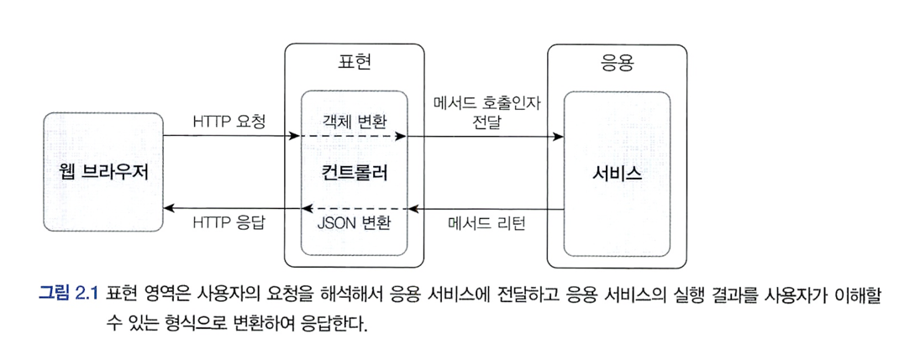
### 응용, 도메인영역
* 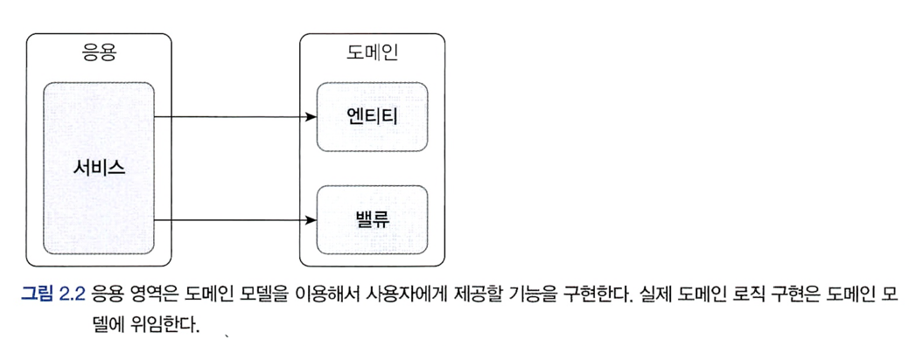
* 도메인의 로직 구현은 도메인 모델에 위임하자! 
### 인프라 스트럭쳐 영역
* 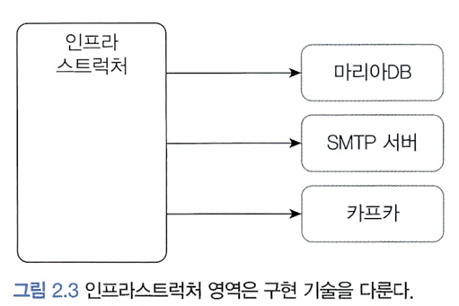
* 이 영역은 DBMS 연동 처리, 메시징 큐에 메시지를 전송하거나 수신하는 기능 구현, SMTP 이용한 메일 발송, REST API 호출 처리. 
* 논리적인 개념을 표현하기 보다는 실제 구현을 다룬다. 

## 계층 구조 아키텍처 
* 계층 구조는 그 특성상 상위 계층에서 하위 계층으로의 의존만 존재하고, 하위 계층은 상위 계층에 의존하지 않는다. 

## DIP (의존성 역전 원칙)

* 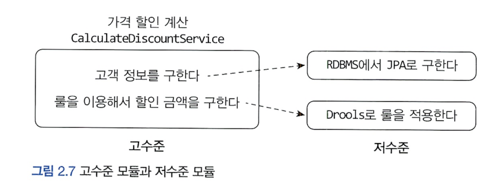
* 고수준 모듈 : 의미있는 단일 기능을 제공하는 모듈
* 저수준 모듈 : 하위 기능을 실제로 구현한 것.
* 그러나 고수준 모듈이 저수준 모듈을 사용하면 구현 변경과 테스트가 어렵다. 
  * 저수준 모듈이 고수준 모듈에 의존하도록 바꾸면 이 문제를 해결가능. 
  * 인터페이스 추상화. 


* 인프라스트럭쳐 영역 - 다음은 할인 금액을 계산하기 위해 Drools라는 룰 엔진을 사용해서 계산 로직을 수행하는 코드 
```java
public class DroolsRuleEngine {
  private KieContainer kContainer;

  public DroolsRuleEngineO {
    KieServices ks = KieServices.Factory.getO;
    kContainer = ks.getKieClasspathContainerO;
  }

  public void evalute(String sessionName^, List<?> facts) {
    KieSession kSession = kContainer.newKieSession(sessionName);
    try {
      facts.forEach(x -> kSession.insert(x));
      kSession.fireAllRulesO;
    } finally {
      kSession.disposeO;
    }
  }
}
```

* 응용 영역 - 인프라 영역의 DroolsRuleEngine 사용
```java
public class CalculateDiscountService {
  private DroolsRuleEngine ruleEngine;

  public CalculateDiscountServiceO {
    ruleEngine = new DroolsRuleEngine();
  }

  public Money calculateDiscount(List<OrderLine> orderliness, String customerld) {
    Customer customer = findCustomer(customerld);
    
    MutableMoney money = new MutableMoney(0);           // Drools에 특화된 코드 : 연산 결과를 받기 위해 추가한 타입
    List<?> facts = Arrays.asList(customers, money);    // Drools에 특화된 코드 : 룰에 필요한 데이터
    facts.addAll(orderLines);
    ruleEngine.evalute("discountCalculation", facts);   // Drools에 특화된 코드 : Drools의 세션 이름 
    return money.toImmutableMoneyQ;

  }
}
```
이코드의 2가지 문제.
* CalculateDiscountService만 테스트 하기 어렵다. RuleEngine이 완벽하게 동작해야 테스트 가능 

### 인터페이스 추상화
```java
public interface RuleDiscounter {
    Money applyRules(Customer customer, List<OrderLine> orderLines);
}

public class CalculateDiscountService {
    private RuleDiscounter ruleDiscounter;
    
    public CalculateDiscountService(RuleDiscounter ruleDiscounter) {
        this.ruleDiscounter = ruleDiscounter;
    }
    
    public Money calculateDiscount(List<OrderLine> orderLines, String customerId) {
        Customer customer = findCustomer(customerId);
        return ruleDiscounter.applyRules(customer, orderLines);
    }
}

public class DroolsRuleDiscounter implements RuleDiscounter {
  
    private KieContainer kContainer;

    public DroolsRuleEngineO{
      KieServices ks = KieServices.Factory.getO;
      kContainer = ks.getKieClasspathContainerOj
    }
    
    @Override
    public Money applyRules(Customer customer, List<OrderLine> orderLines) {
    KieSession kSession = kContainer.newKieSession("discountSession");
        try {
          ...코드 생략
          kSession.fireAllRules;
        } finally {
          kSession.disposeO;
        }
        return money.toImmutableMoneyO;
    }
    
}

```
* 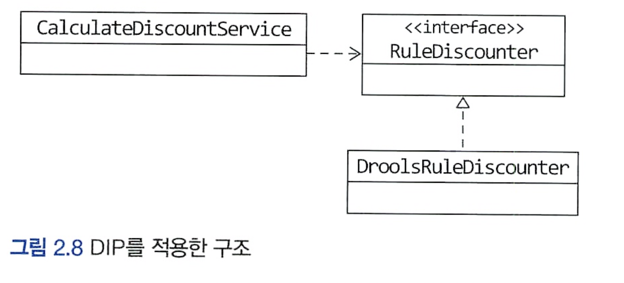
* 더이상 CalculateDiscountService는 Drools에 의존하지 않게된다. 
  * 저수준 모듈이 고수준 모듈에 의존하게 되어 DIP(의존성 역전 원칙) 이라고 한다.
  * 교체가 가능하고 테스트가 쉬워진다. 
  * 구현 기술(RuleDiscounter)를 변경 해도 CalculateDiscountService를 수정할 필요 없다
  * ```java
    RuleDiscounter ruleDiscounter = new SimpleRuleDiscounter(); // 다른 저수준 구현 객체. 교체
    CalculateDiscounterService disService = new CalculateDiscounterService(ruleDiscounter); // 구현 객체(RuleDiscounter)를 생성하는 코드만 변경 
    ```

## DIP 주의사항
* DIP를 잘못 생각하면 단순히 인터페이스와 구현 클래스를 분리하는 정도로 받아들일 수 있다. 
* 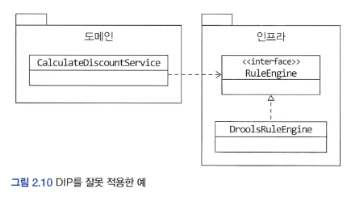
* 하위 기능을 추상화한 인터페이스는 저수준 모듈이 아니고 고수준 모듈에 위치한다. 
* 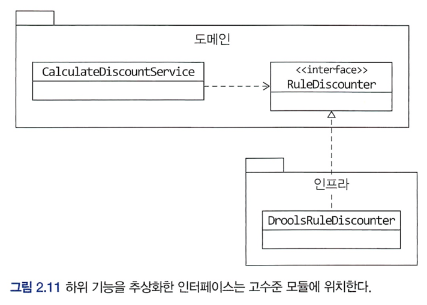

---
* 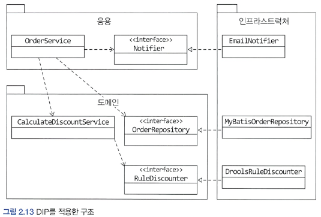
* 인프라스트럭처에 위치한 클래스가 도메인이나 응용 영역에 정의한 인터페이스를 상속받아 구현하는 구조가 되면, 도메인과 응용영역에 영향을 주지 않거나 최소화 하면서 구현 기술을 변경하는 것이 가능하다. 
  * Notifier인터페이스를 상속받는 클래스는 주문 시 SMS를 추가해야 한다는 요구 사항이 들어왔을 때 응용 영역의 OrderService는 변경할 필요가 없다.
    * 구현 클래스를 인프라 영역에 추가하면 된다. 
  * 비슷하게 Mybatis 대신 JPA를 사용하고 싶다면 OrderRepository구현체를 인프라스트럭쳐 영역에 추가하면 된다.  
* 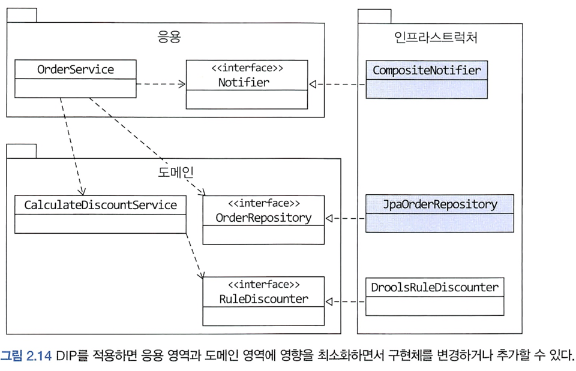

## 도메인 영역의 주요 구성요소
  
|요소|설명|
|---|---|
|엔티티(Entity)| 고유의 식별자를 갖는 객체. 주문, 회원, 상품 등 도메인의 고유한 개념. 도메인 모델의 데이터와 관련된 기능을 함께 제공|
|밸류(Value)| 고유의 식별자를 갖지 않는 객체. 주로 '개념적'으로 하나인 값을 표현할때 사용. 주소, 금액 등|
|애그리거트(Aggregate|연관된 엔티티와 벨류 객체를 하나로 묶은것. Order 엔티티, OrderLine 벨류 를 '주문' 애그리거트로 묶을 수 있다.|
|레포지토리(Repository)| 도메인 모델의 영속성 처리. DBMS 테이블에서 엔티티 객체를 로딩하거나 저장 하는 기능 제공. |
|도메인 서비스(Domain Service)| 특정 엔티티에 속하지 않은 도메인 로직을 제공. '할인 금액 계산'은 상품, 쿠폰, 회원 등급, 구매금액 등 여러 도메인을 이용해서 구현하는데, 도메인 로직이 여러 엔티티와 밸류를 필요로하면 도메인 서비스에서 로직을 구현한다.|

## 엔티티와 밸류
* 도메인 모델의 엔티티와 DB모델의 엔티티는 같지 않다.
* 두 모델의 가장 큰 차이점은 도메인 모델의 엔티티는 데이터와 함께 기능(도메인 기능)을 제공.
* 도메인 모델의 엔티티는 단순히 데이터를 담고 있는 데이터 구조라기 보다는 데이터와 함께 기능을 제공하는 객체 
  * 도메인 관점에서 기능을 구현하고 캡슐화해서 데이터가 임의로 변경되는 것을 막아야한다! 
* 도메인 모델의 엔티티는 벨류타입을 이용해서 표현할 수 있지만 DB모델의 엔티티는 표현하기 불편하다. 
* 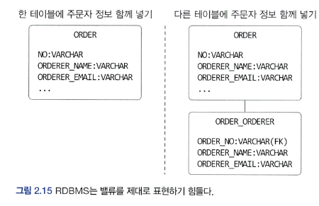
  * 왼쪽 그림처럼 Orderer의 개별 데이터를 저장하거나 오른쪽 그림처럼 별도 테이블로 분리해서 저장해야함. 
  * 왼쪽 테이블의 경우 ORDERER의 개념이 드러나지 않고 주문자의 개별 데이터만 드러난다. 
  * 오른쪽 테이블의 경우 주문자 데이터를 별도 테이블에 저장했지만 엔티티에 까까우며 밸류 타입의 의미가 드러나지는 않는다. 

* `밸류는 불변으로 구현할 것을 권장! ` -> 엔티티의 밸류 타입 데이터 변경시 객체 자체를 완전히 교체 (new)!!!

## 애그리거트 
* 연관된 엔티티와 벨류 객체를 하나로 묶은것.
* 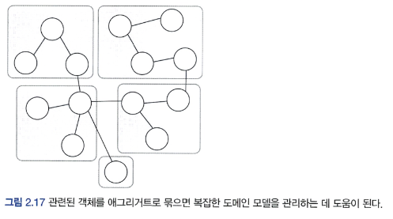
* 대표적인 예 : 주문 
  * 주문, 배송지정보, 주문자, 주문 목록, 총 겸제금액 의 하위모델로 구성 

* 루트 엔티티는 애그리거트 내의서의 루트라고 생각하면 된다
  * 애그리거트 루트가 제공하는 기능을 실행하고 간접적으로 애그리거트 내의 다른 엔티티나 밸류 객체에 접근한다. 
  * 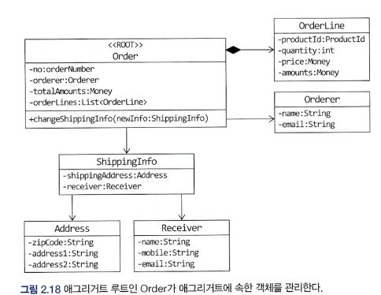


## 레포지토리(리포지터리)
* 도메인 객체를 보관하고 사용하기 위한 모델 (RDBMS, NoSQL, 로컬 파일같은 물리적인 저장소 )
* 엔티티가 밸류나 요구사항에서 도출되는 도메인 모델이라면 레포지토리는 구현을 위한 도메인 모델 
* 도메인 모델을 사용해야 하는 코드는 레포지토리를 통해서 도메인 객체를 구한 뒤에 도메인 객체의 기능을 실행
  * 예를 들어 주문 취소 기능을 제공하는 응용 서비스는 레포지토리를 이용해서 객체를 구하여 해당 기능 실행. 
```java
public class CancelOrderSerivce {
    private OrderRepository orderRepository;
    
    public void cancel(OrderNumber number) {
        Order order = orderRepository.findByNumber(number);
        if (order == null) throw new NoOrderException(number);
        order.cancel();
    }
}
```
* 레포지토리는 도매인 객체를 영속화 하는데 필요한 기능을 추상화한 것으로 고수준 모듈에 속한다. 
* 레포지토리를 구현한 클래스는 저수준 모듈로 인프라 영역에 속한다. 
* 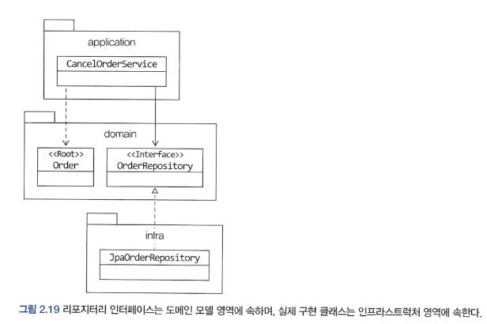
  * 응용 서비스와 레포지토리는 밀접한 연관이 있따. 
    * 응용 서비스는 필요한 도메인 객체를 구하거나 저장할 때 레포지토를 사용
    * 응용 서비스는 트랜잭션을 관리하는데, 트랜잭션 처리는 레포지토리 구현 기술의 영향을 받는다. 

# 요청 처리 흐름
* 표현 영역은 사용자가 전송한 데이터 형식이 올바른지 검사하고 문제가 없다면 데이터를 이용해서 응용서비스에 기능 실행을 위임. 
* 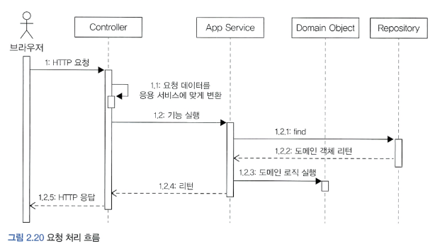
* '예매하기' 나'예매 취소' 같은 기능의 서비스는 도메인의 상태를 변경하므로 변경 상태가 물리 저장소에 올바르게 반영되도록 `트랜잭션 관리 필요`
  * 스프링 에서의 @Transactional 애노테이션 같이.

# 인프라 스트럭처 개요
* 인프라는 표현 영역, 응용 영역, 도메인 영역을 지원한다. 
* 도메인 객체의 영속성 처리, 트랜잭션, SMTP, REST 클라이언트 등 다른 영역에서 필요로 하는 프레임워크, 구현 기술, 보조 기능을 지원한다. 
* DIP에서 언급한 것 처럼 도메인 영역과 응용 영역에서 인프라스트럭처의 기능을 직접 사용하는 것 보다 두 영역(도메인, 응용)에 정의한 인터페이스를 인프라영역에서 구현 하는것이 더 유연하고 테스트하기 쉽다. 


## 모듈 구성 
* 패키지 구성 규칙에 정답이 존재하는 것은 아니다.
* 도메인이 크면 하위 도메인으로 나누고 각 하위 도메인마다 별도 패키지를 구성한다. 
  * 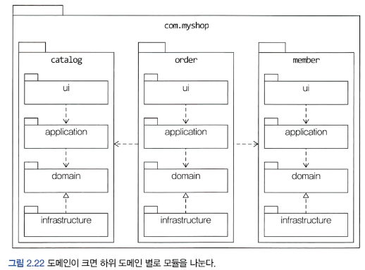

* 도메인 모듈은 도메인에 속한 애그리거트를 기준으로 다시 패키지를 구성한다. 
* 예를들어 카탈로그 하위 도메인이 상품 애그리거트 + 카테고리 애그리거트로 구성될 경우 두 개의 하위 패키지로 구성 
  * 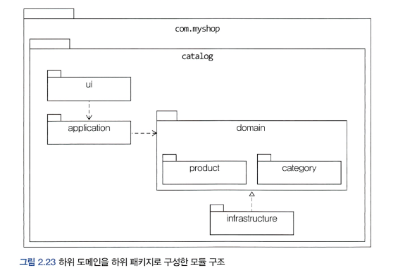

* 도메인이 복잡하면 도메인 모델과 도메인 서비스를 별도 패키지에 위치해도 된다. 

# 애그리거트

* 백 개 이상의 테이블을 한 장의 ERD에 모두 표시하면 개별 테이블 간의 관계를 파악하느냐 데이터 구조를 이해하는데 어려움을 겪게 된다. 
  * 도메인 요소간의 관계를 파악하기 어렵다는 것은 코드를 변경하고 확장하는 것이 어려워 진다. 

* 복잡한 도메인을 관리하기 쉽게 만들라면 애그리거트로 묶어서 바라보면 파악하기 쉽다. 

* 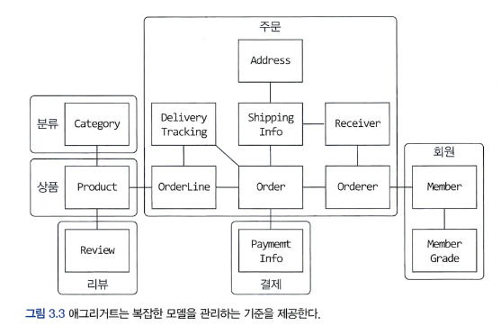

* 애그리거트는 경계를 갖는다. 
* 한 애그리거트에 속한 객체는 다른 애그리거트에 속하지 안흔ㄴ다. 
* 애그리거트는 자기 자신은 관리하지만, 다른 애그리거트를 관리하지 않는다.
  * 주문 애그리거트는 배송지를 변경하거나 주문 상품 개수를 변경하지만 주문 애그리거트에서 회원의 정보나 상품의 가격을 변경하지는 않는다. 

* A가 B를 갖는다 로 설계 할 수 있는 요구사항이 있어도 반드시 A와 B가 한 애그리거트에 속하진 않는다.
* 좋은 예로, 상품과 리뷰가 있다.
  * 상품과 리뷰는 함께 생성되지 않고, 함께 변경되지도 않는다. 
  * 상품을 변경하는 주체가 상품 담당자라면 리뷰를 생성하고 변경하는 주체는 고객이다. 
  * 리뷰의 변경이 상품에 영향을 주지 않고, 상품의 변경이 리뷰에 영향을 주지 않는다. 
  * 이 경우 서로 다른 애그리거트 이다. 

* 다수의 애그리거트가 한 개의 엔티티 객체만 갖는 경우가 많았으며, 두 개 이상의 엔티티로 구성되는 애그리거트는 드물었다 라고 한다.


## 애그리거트 루트
* 애그리거트는 여러 객체로 구성되기 때문에 한 객체만 상태가 정상이면 안 된다. 

#### ex 주문 애그리거트
* 총 금액인 totalAmounts를 갖고있는 Order 엔티티
* 개별 구매 상품의 개수인 quantity와 금액인 price를 갖고 잇는 OrderLine 밸류
* 구매한 상품의 개수를 변경하면 한 OrderLine의 qunatity(개수)를 변경하고 더불어 Order의 totalAmounts도 변경해야 한다. 그렇지 않으면 데이터 일관성이 깨진다.
* 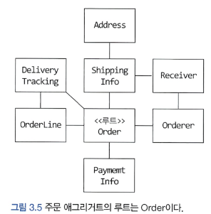

* 불필요한 중복을 피하고 애그리거트 루트 도메인을 통해서만 도메인 로직을 구현하게 만들어야 한다.
* set 같은 메서드로 직접 정보를 변경할 경우 규칙을 무시하고 직접 DB 테이블의 데이터를 수정하는 것과 같은 결과가 나온다. 
  * 논리적인 데이터 일관성이 깨지게 된다. 
1. 단순히 필드를 변경하는 set 메서드를 공개(public) 범위로 만들지 않는다.
   * 도메인의 의미나 의도를 표현하지 못하고 로직을 도메인 객체가 아닌 응용, 표현 영윽올 분산 시킨다. 
   * set 대신 cancel이나 changePassword 처럼 의미가 더 잘드러나는 이름을 사용하자. 
2. 밸류타입은 불변(immutable)로 만든다
   * 밸류 객체의 값을 변경할 수 없으면 애그리거트 루트에서 밸류 객체를 구해도 애그리거트 외부에서 밸류 객체의 상태를 변경할 수 없다. 
   * ```java
     ShippingInfo si = order.getShippingInfo();
     si.setAddress(newAddres); // ShippingInfo가 불변객체면 이 코드는 컴파일 에러 
     ```
   * 애그리거트 외부에서 내부 상태를 함부로 바꾸지 못하므로 일관성이 깨질 가능성이 줄어든다. 
   * 밸류 객체가 불변이면 밸류 객체의 값을 변경하는 방법은 새로윤 밸류 객체를 할당하는 것뿐.
```java
public class Order { 
    private ShippingInfo shippingInfo;
    
    public void changeShippingInfo(ShippingInfo newShippingInfo) {
        verifyNotYetShipped();
        setShippingInfo(newShippingInfo);
    }
    
    // set 메서드를 허용 범위를 private으로.
    private void setShippingInfo(ShippingInfo newShippingInfo) {
        // 밸류가 불변이면 새로운 객체를 할당해서 값을 변경.
        // 불변이므로 this.shippingInfo.setAddress(newShippingInfo.getAddress())와 같은 코드 사용 불가.
        this.shippingInfo = newShippingInfo;
    }
}
```

## 트랜잭션 범위
* 트랜잭션 범위는 작을수록 좋다. 한 트랜잭션이 한 개 테이블 수정하는 것과 세 개의 테이블을 수정하는 것을 비교하면 성능차이가 발생한다. 
* 한 개 테이블을 수정하면 잠그는 대상은 한 테이블 이지만, 세 테이블을 수정하면 잠금 대상이 더많아진다. 그만큼 처리할 수 있는 트랜잭션 개수가 줄어들고 성능을 떨어뜨린다.
* 동일하게 한 트랜잭션에서는 한 개의 애그리거트만 수정해야 한다. 
  * 한 테이블이란 뜻이 아니고, 한 애그리거트에서 다른 애거리트를 수정하지 않는다.
  * 애그리거트 내부에서 다른 애그리거트의 상태를 변경하는 기능을 실행하면 안된다.
    * 예를 들어 배송지 정보를 변경하면서 동시에 배송지 정보를 회원의 주소로 설정하는 기능이 있는데, 이 때 주문 애그리거트는 회원 애그리거트의 정보를 변경하면 안된다. 
  * 부득이하게 한 트랜잭션으로 두 개 이상의 애그리거트를 수정해야 한다면, 응용 서비스에서 두 애그리거트를 수정하도록 구현한다. 
    * 애그리거트 끼리는 직접적으로 수정하지말고. 
```java
public class ChangeOrderService {
    // 두 개 이상의 애그리거트를 변경해야 하면 응용 서비스에서 각 애그리거트의 상태를 변경한다. 
  @Transactional
  public void changeShippingInfo(OrderId id, ShippingInfo newShippingInfo, boolean useNewShippingAddrAsMemberAddr) {
      Order order = orderRepository.findById(id);
      
      if (order == null) throw new OrderNotFoundException();
      
      order.shipTo(newShippingInfo);
      
      if (useNewShippingAddrAsMemberAddr) {
          Member member = findMember(order.getOrderer());
          member.changeAddress(newShippingInfo.getAddress());
      }
  }
}
```
* 도메인이벤트를 사용하면 동기나 비동기로 다른 애그리거트의 상태를 변경하는 코드를 작성할 수 있다. 

## 레포지터리와 애그리거트 

* 애그리거트는 개념상 한 개의 도메인 모델을 표현하므로 객체의 영속성을 처리하는 레포지토리는 애그리거트 단위로 존재. 
  * 엔티티와 엔티티내의 밸류를 물리적으로 각각 별도의 DB에 저장한다고 해서 각각 레포지토리를 만들지 않는다. 

* 애그리거트의 상태가 변경되면 모든 변경을 원자적으로 저장소에 반영해야한다.
  * 애그리거트에서 두 개의 객체를 변경했는데 저장소에는 한 객체에 대한 변경만 반영되면 데이터 일관성이 깨지므로 문제가 된다. 

## ID를 이용한 애그리거트 참조 
```java
public class Order {
    private Orderer orderer;
  ...
}

public class Orderer {
    private Member member;
    private String name;
}
```
* 애그리거트 루트(엔티티)에 의한 직접 참조 
> order.getOrderer().getMember().getId()


* 애그리거트에서 다른 애그리거트를 참조하는것은 편리하지만 다음 문제를 일으킬 수 있다.
  * 편한 탐색 '오용'
  * 성능 문제
  * 확장 어려움 
* 다른 애그리거트 객체에 접근하여 상태를 쉽게 변경할 수 있게 되면 트랜잭션 범위에 벗어날 수 있다. 
* 지연 로딩(lazy) 즉시 로딩(eager) 의 쿼리 전략을 고민해야 한다. 

```java
public class Order {
    private Orderer orderer;
  ...
}

public class Orderer {
    private MemberId memberId; // 밸류타입이거나 Id(or Seq) 값 
    private String name;
}
```
* ID에 의한 직접 참조 
* 애그리거트의 경계를 명확히 하고 애그리거트 간 물리적인 연결을 제거해준다. 
  * 모델의 복잡도를 낮춰주고 의존을 제거하므로 응집도를 높혀준다 
  * 지연로딩의 효과!
* 중요한 데이터는 RDBMS에 저장하고 조회 성능이 중요한 애그리거트는 NoSQL에 나눠 저장할 수 있다. 

```java
Member member = memberRepository.findByld(ordererld)
List<Order> orders = orderRepository.findByOrderer(ordererId);
List<OrderView> dtos = orders.streamO
    .map(order ->{
        Productid prodid = order.getOrderLines().get(0).getProductId();
        // 각 주문마다 첫 번째 주문 상품 정보 로딩 위한 쿼리 실행 
        Product product = productRepository.findById(prodId);
        return new OrderView(order, member, product);
}).collect(toList());
```
* 코드 : N+1 문제.
* 주문 개수가 10개면 주문을 읽어오기 위한 1번의 쿼리와 주문별로 각 상품을 읽어오기 위한 10번의 쿼리 실행 
> 조회 대상이 N개일 때 N개를 읽어오는 한 번의 쿼리와 연관된 데이터를 읽어오는 쿼리를 N번 실행하는 문제 
* 지연 로딩과 관련된 대표적인 문제
  * `엄청난 성능 하락의 원인`

### 이 문제를 발생하지 않도록 하려면 조인을 사용해야 한다. 
* ID 참조가 아닌 객체(엔티티) 참조 방식으로 바꾸고 즉시 로딩을 사용하는것 
* ID 참조 방식을 사용하려면 별도의 조회 전용 쿼리를 만들어 한번의 쿼리로 필요한 데이터를 로딩하면 된다. 

```java
^Repository
public class JpaOrderViewDao implements OrderViewDao {
  @PersistenceContext
  private EntityManager em;

  @Override
  public List<DrderView> selectByOrderer(String ordererld) {
    String selectQuery =
            "select new com.myshop.order.application.dtp.OrderView(Oj m, p)" +
                    "from Order o join o.orderLines ol. Member m. Product p " +
                    "where o.orderer.memberld.id = :ordererld " +
                    "and o.orderer.memberld = m.id " +
                    "and index(ol) = 0 " +
                    "and ol.productid = p.id " +
                    "order by o.number.number desc";
    TypedQuery<DrderView > query =
            em.createQuery(selectQuery, OrderView.class);
    query.setParameterC 'ordererld", ordererld);
    return query.getResultListO;
  }
}
```

## 애그리거트간 집합 연관 관계(1:N관계 M:N 관계)

### 1-N 예제
* 특정 카테고리에 속한 상품 목록
```java
public class Category {
    private Set<Prodcut> products;
    
    public List<Product> getProducts(int page, int size) {
        List<Product> sortedProducts = sortById(products);
        return sortedProducts.subList((page - 1) * size, page * size);
    }
}
```
* 이 코드는 Category에 속한 모든 Products를 조회하게 되어 성능에 심각한 문제를 야기한다. 
* 카테고리에 속한 상품을 구할려면 `상품 입장에서 자신이 속한 카테고리를 N-1로 연관 지어 구하면 된다.`
```java
public class Product {
    private CategoryId categoryId;
  ...
}

public class ProductListService {
    public Page<Product> getProductOfCategory(Long categoryId, int page, intsize) {
        Category category = categoryRepository.findById(categoryId);
        checkCategory(category);
        
        List<Product> products = productRepository.findByCategoryId(category.getId(), page, size);
        
        int totalCount = productRepository.contsByCategoryId(category.getId());
        return new Page(page, size, totalCount, products);
    }
}
```

### M-N 예제
* RDBMS를 이용해서 M-N(다대 다)관계를 구현하려면 조인 테이블을 사용한다. 
* ex ) JPA 매핑 사용
```java
@Entity
@Table(name = "product")
public class Product {
    @EmbeddedId
    private ProductId id;
    
    @ElementCollection
    @CollectionTable(name = "product_category", joinColumns = @JoinColumn(name = "product_id"))
    private Set<CategoryId> categoryIds;
}ㅐㅏㅔㅕㅓ  1ㅂ2ㅂ3ㄷ4ㄱ재ㅐㅓㅕㅜ!@interface 
```
> 목록이나 상세 화면과 같은 조회 기능은 조회 전용 모델을 이용해서 구현하는 것이 좋다. 

* 한 애그리거트가 다른 애그리거트를 생성해야 하는 구조라면, 팩토리로 사용하거나 팩토리 메서드를 이용하여 애그리거트 내에서 생성하자. 

# 레포지토리와 모델 구현 

* 보통 레포지토리 인터페이스는 domain 패키지에, 구현한 클래스는 infra 패키지에 둔다. 
* 팀 표준에 따라 domain과 같은 패키지에 위치시킬 수도 있다. 
  * 가능하면 레포지토리 구현 클래스는 인프라 영역에 위치 시켜서 인프라에 대한 의존을 낮춰야 한다. 

## 스프링 데이터 JPA를 이용한 레포지토리 구현
* 다음과 같이 선언
```java
public interface OrderRepository extends Repository<Order, OrderNo> { // <엔티티, PK>
    Optional<Order> findById(OrderNo id);
  ...
}
```

* 식별자를 이용해서 엔티티 조회시 findById() 메서드 사용.
* 저장 메서드는 void save(Entity) or Entity save(Entity)
* 삭제시에는 void delete(Entity entity), void deleteById(pk id);

## 매핑 구현 

* 루트 엔티티는 @Entity로 매핑
* 한 테이블에 엔티티와 밸류 데이터가 같이 있다면
  * 밸류는 @Embeddable로 (클래스 상단)
  * 밸류 타입 프로퍼티는 @Embedded (필드)

* 밸류 타입 컬럼 이름을 변경하기 위해선 @AttributeOverride 어노테이션 사용 
```java
@Embeddable
public class Orderer { // 밸류타입
    @Embdded
    @AttributeOverrides(
        @AttributeOverride(name = "id", column = @Column(name = "orderer_id"))
    )
    private MemberId memberId;
}

@Embeddable
public class ShippingInfo { // 밸류타입

  @Embdded
  @AttributeOverrides({
          @AttributeOverride(name = "zipCode", column = @Column(name = "shipping_zipcode")),
          @AttributeOverride(name = "address1", column = @Column(name = "shipping_addr1")),
          @AttributeOverride(name = "address2", column = @Column(name = "shipping_addr2"))
  })
  private Address address;
}
```

* 클래스가 불변 타입이면 기본 생성자를 추가할 필요가 없지만, JPA에서 @Entity와 @Embeddable로 클래스를 매핑하려면 기본 생성자를 제공해야 한다. 

## 필드 접근 방식

```java
@Entity
@Access(AccessType.PROPERTY)
public class Order {
  @Column(name = "state")
  @Enumerated(EnumType.STRING)
  public OrderState getState() {
    return state;
  }

  public void setState(OrderState state) {
    this.state = state;
  }
  ...
}
// 위 방식 말고 아래 방식 으로
@Entity
@Access(AccessType.FIELD) // 필드 접근 
public class Order {
}
```

* set 메서드 대신 의도가 잘 드러나는 기능(메서드)을 제공해야 하므로 AccessType을 FIELD로 한다.  
> 하이버네이트는 @Access를 이용해서 명시적으로 접근 방식을 지정하지 않으면 @Id나 @EmbeddedId가 어디에 위치했느냐에 따라 접근방식을 결정한다.   
> @Id나 @EmbeddedId가 필드에 위치하면 필드 접근 방식을 선택하고 get 메서드에 위치하면 메서드 접근 방식을 선택한다. 


## attributeConverter를 이용한 밸류 매핑 처리 

* 두 개 이상의 프로퍼티를 갖고 있는 밸류 타입의 프로퍼티를 한 컬럼에 매핑하고 싶다면 `AttributeConverter` 사용 
```java
public interface AttributeConverter<X,Y> {
    public Y convertToDatabaseColumn(X attribute); // X to Y. 밸류타입을 DB칼럼값으로 
    
    public X convertToEntityAttribute(Y dbData);// DB칼럼값을 밸류로 변환
}
```

* X는 밸류 타입
* Y는 DB 타입

* ex) Money 밸류 타입을 위한 AttributeConverter
```java
@Converter(autoApply = true)
public class MoneyConverter implements AttributeConverter<Money, Integer>{
    @Override
    public Integer convertToDatabaseColumn(Money money){
        return money==null ?null: money.getValueQ;
    }
    
    @Override
    public Honey convertToEntityAttribute(Integer value){
        return value==null? null: new Money(value);
    }
}

@Entity
@Table(name = "purchase_order")
public class Order {
  @Column(narne = "total_amounts")
  // @Convert(converter = MoneyConverter.class) // autoApply 속성이 false이면 직접 지정 
  private Money totalAmounts; // MoneyConverter를 적용해서 값 변환

}

```

* `AttributeConverter 인터페이스를 구현한 클래스는 @Converter 애노테이션을 사용하면 된다.`
* @Converter - autoApply 속성
  * true : 모델에 출현하는 모든 Money 타입의 프로퍼티에 MoneyConverter를 자동으로 적용
  * false : 프로퍼티 값을 변환할 때 사용할 컨버터 직접 지정 : @Convert(converter = MoneyConverter.class)


## 밸류 컬렉션 : 별도 테이블 매핑 - 밸류 컬렉션(리스트)를 별도 테이블에 매핑
* @ElementCollection과 @CollectionTable을 사용

```java

@Entity
@Table(name = "purchase_order")
@Access(AccessType.FIELD)
public class Order {
  @EmbeddedId
  private OrderNo number;

  @Version
  private long version;

  @Embedded
  private Orderer orderer;

  @ElementCollection(fetch = FetchType.LAZY)
  @CollectionTable(name = "order_line", joinColumns = @JoinColumn(name = "order_number"))
  @OrderColumn(name = "line_idx")
  private List<OrderLine> orderLines;

}
```

* JPA는 @OrderColumn 애노테이션을 이용해서 지정한 컬럼에 리스트의 인덱스 값을 저장한다. 
* @CollectionTable은 밸류를 저장할 테이블을 지정한다. 
  * name : 테이블 이름 지정
  * joinColumns: 외부키로 사용한 컬럼
    * 두 개 이상인 경우 @JoinColumn의 배열을 이용해서 외부키 목록 지정 

## 밸류 컬렉션 : 한개 컬럼 매핑 - 밸류 컬렉션(리스트)를 한개의 컬럼에 매핑
ex ) 객체에는 이메일 주소 목록을 Set으로 보관하고, DB 컬럼에는 한개 칼럼에 콤마로 구분해서 저장. (kim206gh@naver.com, kim206gh@gmail.com, kim206gh@kakao.com... 등)
* AttributeConverter 를 사용해서 구현하려면 밸류 컬렉션을 '표현'하는 새로운 밸류 타입을 추가해야 한다. 
* 아래 코드처럼 목록을 위한 밸류 타입 추가로 작성.
```java
public class EmailSet{
  private Set<Email> emails = new HashSet();
  
  public EmailSet(Set<Email> emails){
    this.emails.addAll(emails);
  }
  
  public Set<Email> getEmails(){
    return Collections.unmodifiableSet(emails);
  }
}

// AttributeConverter 구현

public class EmailSetConverter implements AttributeConverter<EmailSet, String> {
  @Override
  public String convertToDatabaseColumn(EmailSet attribute) {
    if (attribute == null) return null;
    return attribute.getEmails().stream()
            .map(email -> email.getAddress())
            .collect(Collectors.joining(","));
  }

  @Override
  public EmailSet convertToEntityAttribute(String dbData) {
    if (dbData == null) return null;
    String[] emails = dbData.split(",");
    Set<Email> emailSet = Arrays.stream(emails)
            .map(value -> new Email(value))
            .collect(toSet());
    return new EmailSet(emailSet);
  }
}

// 컨버터 지정 
@Convert(convert = EmailSetConvert.class)
private EmailSet emailSet;

```
* autoApply = true로 안하면 어노테이션으로 지정. `@Convert`

## 밸류를 이용한 ID 매핑
* 식별자라는 의미를 '부각' 시키기 위해 식별자 자체를 밸류 타입으로 만들었을 때 사용.
* 밸류 타입을 식별자로 매핑하면 @Id 대신 @EmbeddedId 애노테이션 사용 

```java
@Entity
@Table(name = "purchase_order")
@Access(AccessType.FIELD)
public class Order {
    @EmbeddedId
    private OrderNo number;
  ...
}

@Embeddable
public class OrderNo implements Serializable {
  @Column(name = "order_number")
  private String number;
  ...
}
```
* JPA에서 식별자 타입은 Serializable 타입이어야 하므로 식별자로 사용할 밸류타입은 Serializable 인터페이스를 상속 받아야 한다. 
* 밸류 타입으로 식별자(ID)를 구현하면 얻는 장점으로 식별자만의 기능을 추가할 수 있다. 

## 별도 테이블에 저장하는 밸류 매핑. 
* 보통 애그리거트에서 엔티티는 1개이고, 나머지는 대부분 밸류 타입이다. 
* 별도 테이블에 데이터를 저장한다고해서 엔티티인 것은 아니다.  
* 애그리거트에 속한 객체가 벨류인지 엔티티인지 구분하는 방법은 `고유식별자`를 갖는지다! 
  * 별도 테이블로 저장하고 테이블에 PK가 있따고 해서 테이블과 매핑되는 애그리거트 구성요소가 항상 고유 식별자를 갖는 것은 아니기 때문이다 
* 예를 들어, 게시글 데이터를 ARTICLE 테이블과 ARTICLE_CONTENT 테이블로 나눠서 저장하는 케이스를 보자.
* 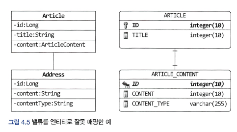

* ARTICLE_CONTENT와 매핑되는 ArticleContent를 엔티티로 생각해서 Article과 AtricleContent를 1-1 연관관계 라고 생각할수도있지만, ArticleContent는 밸류다.
* Article_content의 id는 식별자이긴 하지만, ARTICLE 테이블의 데이터와 연결하기 위함이지 `ARTICLE_CONTENT를 위한 별도 식별자가 필요한 것은 아니기 때문`

* 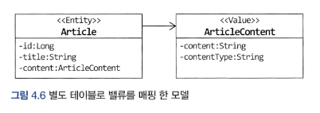
* 밸류로 보고 접근하면 모델은 이렇게 바뀐다. 
* 밸류를 매핑한 테이블을 지정하기 위해 @SecondaryTable 과 @AttributeOverride를 사용한다. 

```java

@Entity
@Table(name = "article")
@SecondaryTable(
        name = "article_content",
        pkJoinColumns = @PrimaryKeyJoinColumn(name = "id")
)
public class Article {
  @Id
  @GeneratedValue(strategy = GenerationType.IDENTITY)
  private Long id;

  private String title;

  @AttributeOverrides({
          @AttributeOverride(
                  name = "content",
                  column = @Column(table = "article_content", name = "content")),
          @AttributeOverride(
                  name = "contentType",
                  column = @Column(table = "article_content", name = "content_type"))
  })
  @Embedded
  private ArticleContent content;
}
```

* @SencondaryTable의 name 속성은 밸류를 저장할 테이블 지정
* @pkJoinColumns속성은 밸류 테이블에서 엔티티 테이블로 조인할 때 사용할 칼럼ㅡㄹ 지ㅇ
* @AttributeOverride의 name은 밸류의 필드명 지정(ArticleContent content)
  * column은 밸류 필드내의 필드 지정.

* 이러면 Article을 조회할 때 ArticleContent 테이블까지 조인해서 데이터를 읽어온다.
  * ArticleContent 테이블의 데이터까지 조회해오기 싫다면 ArticleContent를 엔티티로 만들어 `지연로딩` 할 수도 있지만 좋은 방식은 아니다.
  * `조회 전용 기능을 구현하면 된다.`

## 밸류 컬렉션을 @Entity로 매핑하기. 
ex ) 이미지 업로드 방식에 따라 이미지 경로와 섬네일 이미지 제공 여부가 달라지는 기능.
* 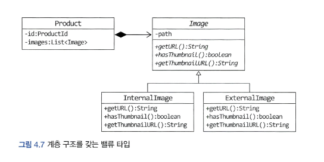

* JPA는 @Embeddable 타입의 클래스 상속 매핑을 지원하지 않는다. 
* @Embeddable 대신 @Entity로 만들어 상속 매핑으로 처리해야 한다.
  * 밸류 타입을 @Entity로 만드므로 식별자 매핑도 해야한다. 
  * 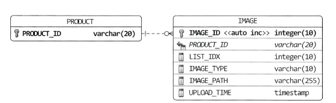

* 한 테이블에 Image와 그 하위 클래스를 매핑하므로 Image 클래스에 다음 설정 사용 
  * @Inheritance 애노테이션
  * strategy(전략) 값으로 SINGLE_TABLE 사용
  * @DiscriminatorColumn 애노테이션 사용하여 타입 구분용으로 사용할 컬럼 지정 

* Image(밸류타입) 은 @Entity로 매핑했지만 모델에서 Image는 밸류이다.
  * Image를 ExternalImage, InternalImage가 상속받는 구조.
```java

@Entity
@Inheritance(strategy = InheritanceType.SINGLE_TABLE)
@DiscriminatorColumn(name = "image_type")
@Table(name = "image")
public abstract class Image {
  @Id
  @GeneratedValue(strategy = GenerationType.IDENTITY)
  @Column(name = "image_id")
  private Long id;

  @Column(name = "image_path")
  private String path;

  @Column(name = "upload_time")
  private LocalDateTime uploadTime;
  
  protected String getPath() {
    return path;
  }

  public LocalDateTime getUploadTime() {
    return uploadTime;
  }

  public abstract String getUrl();
  public abstract boolean hasThumbnail();
  public abstract String getThumbnailUrl();

}

@Entity
@DiscriminatorValue("EI")
public class ExternalImage extends Image {
    protected ExternalImage() {
    }

    public ExternalImage(String path) {
        super(path);
    }

    @Override
    public String getUrl() {
        return getPath();
    }

    @Override
    public boolean hasThumbnail() {
        return false;
    }

    @Override
    public String getThumbnailUrl() {
        return null;
    }
}

@Entity
@DiscriminatorValue("II")
public class InternalImage extends Image {
  protected InternalImage() {
  }

  public InternalImage(String path) {
    super(path);
  }

  @Override
  public String getUrl() {
    return "/images/original/" + getPath();
  }

  @Override
  public boolean hasThumbnail() {
    return true;
  }

  @Override
  public String getThumbnailUrl() {
    return "/images/thumbnail/" + getPath();
  }
}
```

* Image를 상속 받으므로 @Entity와 @Discriminator를 사용해서 매핑한다. 
* Image가 @Entity 이므로 @OneToMany를 이용해서 매핑한다.

```java
@Entity
@Table(name = "product")
public class Product {
    @EmbeddedId
    private ProductId id;
  ...
    @OneToMany(cascade = {CascadeType.PERSIST, CascadeType.REMOVE},
            orphanRemoval = true, fetch = FetchType.LAZY)
    @JoinColumn(name = "product_id")
    @OrderColumn(name = "list_idx")
    private List<Image> images = new ArrayList<>();
    
  public void changeImages(List<Image> newImages) {
      images.clear();
      images.addAll(newImages);
    }
  ...
```
* OneToMany의 속성
  * casecade : 저장될 때 같이 저장되고, 삭제될때 같이 삭제 
  * orphanRemoval : List에서 Image 객체 제거시 DB에서 함께 삭제

* List.clear()를 사용하면 하이버네이트는 @Embeddable 타입에 대해서 컬렉션에(List)속한 객체를 로딩하지 않고 한 번의 delete 쿼리로 삭제 처리를 수행한다.


## 애그리거트 로딩 전략(JPA에서)

* 애그리거트 루트를 로딩하면 루트에 속한 모든 객체가 완전한 상태여야 한다. 
* 조회 시점에서(SELECT) 완전한 상태가 되도록 하려면 조회 방식을 EAGER로 설정하면 된다. 
  * 컬렉션(List, Set)에 대한 로딩 전략은 고민 해봐야 한다. - 성능문제


