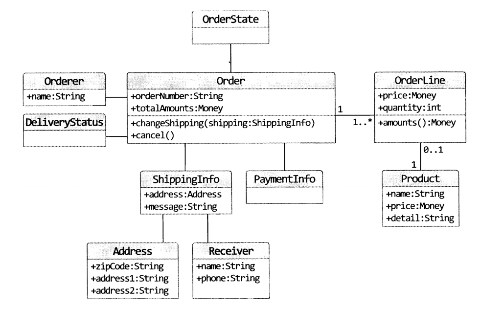
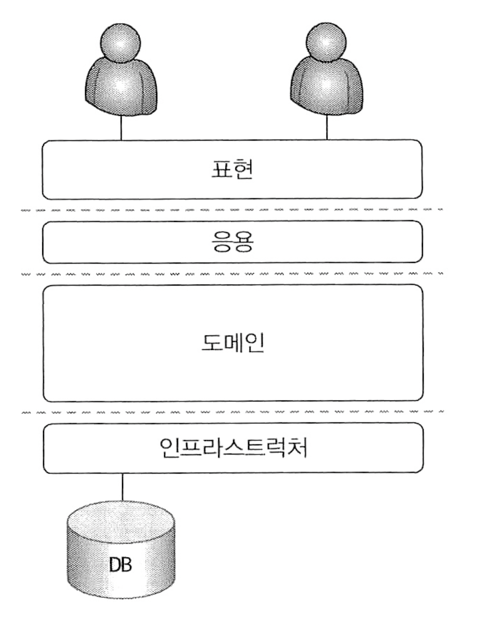
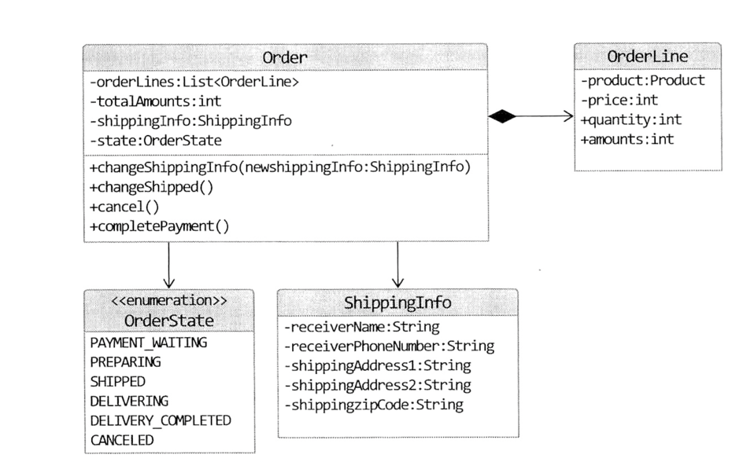

# DDD START - 최범균

최범균 저자님의 DDD START를 읽으면서 핵심 요약하며 공부한 내용입니다.


목차
CHAPTER 1 도메인 모델 시작    
도메인… ………………………………………………………………………… 1  
도메인 모델… …………………………………………………………………… 3  
도메인 모델 패턴………………………………………………………………… 6  
도메인 모델 도출……………………………………………………………… 10  
엔티티와 밸류………………………………………………………………… 17  
엔티티……………………………………………………………………………… 18  
엔티티의 식별자 생성…………………………………………………………… 20  
밸류 타입… ……………………………………………………………………… 22  
엔티티 식별자와 밸류 타입……………………………………………………… 29  
도메인 모델에 set 메서드 넣지 않기…………………………………………… 30  
도메인 용어…………………………………………………………………… 34  

CHAPTER 2 아키텍처 개요  
네 개의 영역…………………………………………………………………… 37  
계층 구조 아키텍처…………………………………………………………… 40  
DIP……………………………………………………………………………… 44  
DIP 주의사항……………………………………………………………………… 50  
DIP와 아키텍처…………………………………………………………………… 52  
도메인 영역의 주요 구성요소… …………………………………………… 54  
엔티티와 밸류… ………………………………………………………………… 55  
애그리거트………………………………………………………………………… 58  
리포지터리………………………………………………………………………… 61  
요청 처리 흐름………………………………………………………………… 65  
인프라스트럭처 개요… ……………………………………………………… 66   
모듈 구성… …………………………………………………………………… 68  

CHAPTER 3 애그리거트  
애그리거트…………………………………………………………………… 71  
애그리거트 루트……………………………………………………………… 75  
도메인 규칙과 일관성…………………………………………………………… 76  
애그리거트 루트의 기능 구현…………………………………………………… 80  
트랜잭션 범위…………………………………………………………………… 82  
리포지터리와 애그리거트…………………………………………………… 85   
ID를 이용한 애그리거트 참조……………………………………………… 87  
ID를 이용한 참조와 조회 성능…………………………………………………… 92  
애그리거트 간 집합 연관…………………………………………………… 94  
애그리거트를 팩토리로 사용하기…………………………………………… 98  

CHAPTER 4 리포지터리와 모델구현(JPA 중심)  
JPA를 이용한 리포지터리 구현…………………………………………… 103  
모듈 위치……………………………………………………………………… 104  
리포지터리 기본 기능 구현…………………………………………………… 104  
매핑 구현……………………………………………………………………… 109  
엔티티와 밸류 기본 매핑 구현… …………………………………………… 109  
기본 생성자… ………………………………………………………………… 112  
필드 접근 방식 사용…………………………………………………………… 114  
AttributeConverter를 이용한 밸류 매핑 처리……………………………… 115  
밸류 컬렉션: 별도 테이블 매핑……………………………………………… 119  
밸류 컬렉션: 한 개 칼럼 매핑………………………………………………… 122  
밸류를 이용한 아이디 매핑…………………………………………………… 123  
별도 테이블에 저장하는 밸류 매핑… ……………………………………… 125  
밸류 컬렉션을 @Entity로 매핑하기… ……………………………………… 129  
ID 참조와 조인 테이블을 이용한 단방향 M-N 매핑………………………… 134  
애그리거트 로딩 전략………………………………………………………… 134  
애그리거트의 영속성 전파…………………………………………………… 138  
식별자 생성 기능……………………………………………………………… 139  

CHAPTER 5 리포지터리의 조회 기능(JPA 중심)  
검색을 위한 스펙……………………………………………………………… 143  
스펙 조합……………………………………………………………………… 145  
JPA를 위한 스펙 구현……………………………………………………… 146  
JPA 스펙 구현………………………………………………………………… 147  
AND/OR 스펙 조합을 위한 구현…………………………………………… 150  
스펙을 사용하는 JPA 리포지터리 구현……………………………………… 153  
정렬 구현……………………………………………………………………… 155  
페이징과 개수 구하기 구현………………………………………………… 160  
조회 전용 기능 구현………………………………………………………… 162  
동적 인스턴스 생성…………………………………………………………… 162  
하이버네이트 @Subselect 사용……………………………………………… 165  

CHAPTER 6 응용 서비스와 표현 영역  
표현 영역과 응용 영역……………………………………………………… 169  
응용 서비스의 역할…………………………………………………………… 171  
도메인 로직 넣지 않기………………………………………………………… 173  
응용 서비스의 구현…………………………………………………………… 176  
응용 서비스의 크기… ………………………………………………………… 176  
응용 서비스의 인터페이스와 클래스………………………………………… 180  
메서드 파라미터와 값 리턴…………………………………………………… 181  
표현 영역에 의존하지 않기…………………………………………………… 185  
트랜잭션 처리………………………………………………………………… 187  
도메인 이벤트 처리…………………………………………………………… 188  
표현 영역……………………………………………………………………… 190  
값 검증………………………………………………………………………… 193  
권한 검사……………………………………………………………………… 197  
조회 전용 기능과 응용 서비스……………………………………………… 201  

CHAPTER 7 도메인 서비스  
여러 애그리거트가 필요한 기능…………………………………………… 203  
도메인 서비스………………………………………………………………… 205  
도메인 서비스의 패키지 위치………………………………………………… 209  
도메인 서비스의 인터페이스와 클래스……………………………………… 210  

CHAPTER 8 애그리거트 트랜잭션 관리  
애그리거트와 트랜잭션……………………………………………………… 213  
선점 잠금……………………………………………………………………… 215  
선전 잠금과 교착 상태………………………………………………………… 217  
비선점 잠금…………………………………………………………………… 218  
강제 버전 증가………………………………………………………………… 227  
오프라인 선점 잠금…………………………………………………………… 228  
오프라인 선점 잠금을 위한 LockManager 인터페이스와 관련 클래스… 230  
DB를 이용한 LockManager 구현… ………………………………………… 233  

CHAPTER 9 도메인 모델과 BOUNDED CONTEXT  
도메인 모델과 경계…………………………………………………………… 241  
BOUNDED CONTEXT……………………………………………………… 242  
BOUNDED CONTEXT의 구현…………………………………………… 245  
BOUNDED CONTEXT 간 통합…………………………………………… 248  
BOUNDED CONTEXT 간 관계…………………………………………… 256  
컨텍스트 맵…………………………………………………………………… 259  

CHAPTER 10 이벤트  
시스템 간 강결합의 문제… ………………………………………………… 261  
이벤트 개요… ………………………………………………………………… 265  
이벤트 관련 구성요소… ……………………………………………………… 266  
이벤트의 구성… ……………………………………………………………… 266  
이벤트 용도… ………………………………………………………………… 269  
이벤트 장점… ………………………………………………………………… 270  
이벤트, 핸들러, 디스패처 구현……………………………………………… 271  
이벤트 클래스… ……………………………………………………………… 271  
EventHandler 인터페이스… ………………………………………………… 273  
이벤트 디스패처인 Events 구현……………………………………………… 275  
흐름 정리……………………………………………………………………… 279  
AOP를 이용한 Events.reset() 실행…………………………………………… 281  
동기 이벤트 처리 문제……………………………………………………… 283  
비동기 이벤트 처리…………………………………………………………… 284  
로컬 핸들러의 비동기 실행…………………………………………………… 285  
메시징 시스템을 이용한 비동기 구현……………………………………… 290  
이벤트 저장소를 이용한 비동기 처리……………………………………… 291  
이벤트 저장소 구현… ………………………………………………………… 293  
이벤트 저장을 위한 이벤트 핸들러 구현…………………………………… 299  
REST API 구현………………………………………………………………… 301  
포워더 구현…………………………………………………………………… 304  
이벤트 적용 시 추가 고려사항……………………………………………… 307  

CHAPTER 11 CQRS  
단일 모델의 단점……………………………………………………………… 311  
CQRS………………………………………………………………………… 312  
웹과 CQRS…………………………………………………………………… 317  
CQRS 장단점………………………………………………………………… 318  


# 1. 도메인 모델 시작 

* 도메인 모델
* 엔티티와 벨류
* 도메인 용어

## 도메인
* 개발자 입장에서 소프트웨어로 해결하고자 하는 문제 영역 : `도메인`
    * ex: 온라인 서점 소프트웨어 온라인으로 책을 판매해야함
      * 필요한 기능 : 상품 조회, 구매, 결제, 배송, 추적 등의 기능 

* 도메인은 다시 하위 도메인으로 나눌 수 있다.

## 도메인 모델
* 도메인 모델에는 다양한 정의가 존재. 
* 기본적으로 도메인 모델은 특정 도메인을 개념적으로 표현한 것.
* 예를 들어 온라인 쇼핑몰에서의 주문
  * 상품을 몇 개 살지 선택하고 배송지 입력
  * 총 지불 금액을 계산하고 결제 수단 선택
  * 주문 뒤에도 배송 전이면 배송지 주소를 변경하거나 주문 취소 가능
  * 
    * Order는 주문번호와 지불할 총금액을 포함
    * 배송정보를 변경, 취소할 수 있는 기능 제공.
* 도메인 모델을 사용하면 여러 관계짜들이 동일한 모습으로 도메인을 이해하고 도메인 지식을 공유하는 데 도움이 된다.
* 도메인은 다수의 하위 도메인으로 구성된다.
  * 각 하위 도메인이 다루는 영역은 서로 다르기 때문에 같은 용어라도 하위 도메인마다 의미가 달라질 수 있다.
  * 도메인에 따라 용어의 의미가 결정되므로 여러 하위 도메인을 하나로 모델링 하면 안 된다. 

## 도메인 모델 패턴
* 일반적인 애플리케이션 아키텍처 구성
  * 
  * UI 또는 표현 계층 : 사용자의 요청을 처리하고 정보를 보여줌. 사용자는 SW를 사용하는 사람 뿐만 아니라 외부 시스템도 사용자가 될 수 있다(API?)
  * 응용 : 사용자가 요청한 기능을 실행한다. 업무 로직을 직접 구현하지 않으며 도메인 계층을 조합해서 기능을 실행한다.
  * 도메인 : 시스템이 제공할 도메인의 규칙을 구현
  * 인프라스트럭쳐: 데이터베이스나 메시징 시스템과 같은 외부시스템과의 연동 처리 

* 개념모델과 구현모델
  * 개념 모델은 순수하게 문제를 분석한 결과물이다.
  * 개념 모델은 데이터베이스,트랜잭션 처리, 성능, 구현 기술과 같은 것들을 고려하고 있찌 않기 때문에 실제 코드를 작성할 때 있는 그대로 사용할 수 없다.
  * 개념모델을 구현 가능한형태의 모델로 전환하는 과정을 거치게 된다
  * 처음부터 완벽한 개념 모델을 만들기보다는 전반적인 개요를 알 수 있는 수준으로 개념모델을 작성해야 한다.
  * 프로젝트 초기에는 개요 수준의 개념 모델로 도메인에 대한 전체 윤곽을 이해하는 데 집중하고, 구현하는 과정에서 개념 모델을 구현 모델로 점진적 발전 시켜야 한다.

## 도메인 모델 도출
기획, 유스케이스, 사용자 스토리와 같은 요구사항과 관련자와의 대화를통해 도메인을 이해하고 이를 바탕으로 도메인 모델 초안을 만들어야 비로소 코드를 작성할 수 있다.

도메인을 모델링할 때 기본이 되는 작업은 모델을 구성하는 핵심 구성요소, 규칙, 기능을 찾는것이다 

예제로 다음 요구사항을 보자 
* 최소 한 종류 이상의 상품을 주문해야 한다.
* 한 상품을 한 개 이상 주문할 수 있다.
* 총 주문 금액은 각 상품의 구매 가격 합을 모두 더한 금액이다.
* 각 상품의 구매 가격 합은 상품 가격에 구매 개수를 곱한 값이다. 
* 주문할 때 배송지 정보를 반드시 지정해야 한다.
* 배송지 정보는 받는 사람 이름, 전화번호, 주소로 구성된다.
* 출고를 하면 배송지 정보를 변경할 수 없다.
* 출고 전에 주문을 취소할 수 있다.
* 고객이 결제를 완료하기 전에는 상품을 준비하지 않는다.

* 이 요구사항에서 알 수 있는 것은 다음의 4가지 기능을 제공한다.
  * 주문은 출고 상태로 변경하기
  * 배송지 정보 변경하기
  * 주문 취소하기
  * 결제 완료로 변경하기
  

```java
public class Order {
    public void changeShipped() {};
    public void changeShippingInfo(ShippingInfo newShipping){};
    public void cancel() {};
    public void completePayment() {};
}
```

* 다음 요구사항은 주문 항목이 어떤 데이터로 구성되는지 알려준다.
  * 한 상품을 한 개 이상 주문할 수 있다.
  * 각 상품의 구매 가격 합은 상품 가격에 구매 개수를 곱한 값

* 두 요구사항에 따르면 주문 항목을 표현하는 OrderLine은 다음을 포함해야한다
  * 주문할 상품
  * 상품의 가격
  * 구매 개수
  * 각 구매 항목의 구매 가격

```java
public class OrderLine {
    private Proudct product; // 상품
    private int price;
    private int quantity;
    private int amounts;
    
    private int calculateAmounts() {
        return price * quantity;
    }
    
    public int getAmounts(){}
}
```

* 다음 요구사항은 Order(주문) OrderLine과의 관계를 알려준다.
  * 최소 한 종류 이상의 상품을 주문해야 한다.
  * 총 주문 금액은 각 상품의 구매 가격 합을 모두 더한 금액이다. 
* 한 종류 이상의 상품을 주문할 수 있으므로 Order는 최소 한 개 이상의 OrderLine을 포함해야 한다
* 이 요구사항 들을 Order에 다음과 같이 반영할 수 있다.
```java
public class Order {
    private List<OrderLine> orderLines;
    private int totalAmounts;
    
    private void setOrderLines(List<OrderLine> orderLines) {
        verifyAtLeastOneOrMoreOrderLines(orderLines);
        this.orderLines = orderLines;
        calculateTotalAmounts();
    }
    
    private void verifyAtLeastOneOrMoreOrderLines(List<OrderLine> orderLines) {
        if (orderLines == null || orderLines.isEmpy()) {
            throw new IllegalArgumentException("no OrderLine");
        }
    }
    
    private void calculateTotalAmounts() {
        this.totalAmounts = new Money(orderLines.stream()
                .mapToInt(x -> x.getAmounts().getValue())).sum();
    }
}
```

* Order는 한 개 이상의 OrderLine을 가질 수 있으므로 List<OrderLine>을 가진다.
* setOrderLines() 메서드는 요구사항에 정의한 제약 조건을 검사한다
  * 요구사항에 따르면 최소 한 종류 이상의 상품을 주문해야 하므로 검증 메소드를 통하여 1개 이상 존재하는지 검사. 

* 배송지 정보는 다음 요구사항에서 이름, 전화번호, 주소 데이터를 가지므로 다음과 같이 정의.
  * 배송지 정보는 받는 사람 이름, 전화번호, 주소로 구성된다.

```java
public class ShippingInfo {
    private STring receiverName;
    private String receiverPhoneNumber;
    private String shippingAddress1;
    private String shippingAddress2;
    private String shippingZipcode;
    
  ...
}
```
* 앞서 요구사항 중에 주문할 때 배송지 정보를 반드시 지정해야 한다 는 내용이 있으므로 Order 생성시 ShippingInfo도 같이 전달
```java
public class Order {
    private List<OrderLine> orderLines;
    private int totalAmounts;
    private ShippingInfo shippingInfo;
    
    public Order(List<OrderLine> orderLines, ShippingInfo shippingInfo) {
        setOrderLines(orderLines);
        setShippingInfo(shippingInfo);
    }
    
    private void setShippingInfo(ShippingInfo shippingInfo) {
        if (shippingInfo == null) 
            throw new IllegalArgumentException("no ShippingInfo");
        this.shippingInfo = shippingInfo;
    }
} 
```
* 이렇게 배송지 정보 필수 라는 도메인 규칙을 구현할 수 있다.

도메인을 구현하다 보면 특정 조건이나 상태에 따라 제약이나 규칙이 달리 적용되는 경우가 많다. 주문 요구사항의 경우에는 다음 내용이 해당된다.
* 출고를 하면 배송지 정보를 변경할 수 없다.
* 출고 전에 주문을 취소할 수 있다.

이 요구사항은 출고 상태가 되기 전과 후의 '제약사항'을 기술한 것.  
이 요구사항을 충족하려면 주문은(Order) 적어도 출고 상태를 표현할 수 있어야 한다.  
다음과 같이 열거 타입을 이용해서 상태 정보를 표현할 수 있다.
```java
public enum OrderState {
    PAYMENT_WAITING, PREPARING, SHIPPED, DELIVERING, DELIVERY_COMPLETED, CANCELED;
}
```

배송지 변경이나 주문 취소 기능은 출고 전에만 가능하다는 제약 규칙이 있으므로 제약규칙 메서드인 verifyNotYetShipped()를 구현하여 먼저 실행한다.

> 제약조건 메서드의 이름은 도메인을 더 잘 알게 될 때마다 변경될 수 있다. 
> 이름이 명확해짐으로써 제약조건을 보다 잘 명시할 수 있고 코드의 이해도 쉬워진다.

## 엔티티와 벨류

도출한 도메인 모델은 크게 `엔티티(Entitiy)`와 `벨류(Value)`로 구분할 수 있다.
* Value 타입은 우리말로 하면 `값` 이지만, 여러 의미로 사용할 수 있기 때문에 이책에선, Value는 `벨류`로 지정한다   

* 
  * 이 그림에는 엔티티도 존재하고 벨류도 존재한다. 

## 엔티티
엔티티의 가장 큰 특징은 식별자를 갖는것이다.
* 식별자는 엔티티 객체마다 고유해서 각 엔티티는 서로 다른 식별자를 갖는다 

> Order(주문) 도메인에서 각 주문은 주무번호를 갖는데 이 주문번호는 각 주문마다 다르므로 식별자가 된다.
> 즉 앞서 주문 도메인 모델에서 주문에 해당하는 Order 클래스가 엔티티가 되며 주문 번호를 속성으로 갖게 된다 

* 주문에서 배송지 주소가 바뀌거나 상태가 바뀌더라도 주문번호가 바뀌지 안흔 것처럼 엔티티의 식별자는 ㅏㅂ뀌지 않는다.
* 엔티티를 생성하고 속성을 바꾸고 삭제할 때 까지 식별자는 유지된다.
* 엔티티의 식별자는 바뀌지 않고 고유하기 때문에 두 엔티티 객체의 식별자가 같으면 두 엔티티는 같다고 판단할 수 있다. 
  * 따라서 식별자를 이용해서 equals()메서드와 hashCode()메서드를 구현할수 있다. 

```java
public class Order {
    private String orderNumber;
    
    @Override
    public boolean equals(Object obj) {
        if (this == obj) return true;
        if (obj == null) return false;
        if (obj.getClass() != Order.class) return false;
        Order otherOrder = (Order)obj;
        if (this.orderNumber == null) return false;
        return this.orderNumber.equals(otherOrder.orderNumber);
    }
    
    @Override
    public int hashCode() {
        final int prime = 31;
        int result = 1;
        result = prime * result + ((OrderNumber == null) ? 0 : orderNumber.hashCode());
        return result;
    }
}
```

## 엔티티의 식별자 생성 방법
1. 특정 규칙에 따라 생성
2. UUID 사용
3. 값을 직접 입력
4. 일련번호 사용(시퀀스(Seq))나 DB 자동 증가 컬럼(Auto Increment)사용

* ### 흔히 사용하는 규칙은 현재 시간과 다른 값을 함께 조합하는것.
  * ex) '2015052909644024919' 
    * 20150529094644 는 2015년 5월 29일 09시 46분 44초 의미 
    * 그 뒤는 다른 값 

* UUID 생성 API를 사용하여 생성. 자바의 경우 java.util.UUID 클래스 사용
```java
UUID uuid = UUID.randomUUID();  
```
* UUID의 자세한 내용은 https://goo.gl/7njkf3 문서 참고 

* ### 회원의 아이디나 이메일과 같은 식별자는 값을 직접 입력
  * 사용자가 직접 입력하는 값이기 때문에 중복해서 입력하지 않도록 사전에 방지하는 것이 중요 

* ### 일련번호 방식은 DB가 제공하는 자동 증가 기능 사용 (auto_increment 칼럼)
  * 자동 증가 컬럼은 DB 테이블에 데이터를 삽입해야 비로소 값을 알 수 있기 때문에 데이터를 추가하기 전에는 식별자를 알 수 없다.


## 벨류타입
위 예제의 ShippingInfo 클래스는 받는 사람과 주소에 대한 데이터를 갖고 있다.

```java
public class ShippingInfo {
    private String receiverName;        // 받는 사람
    private String receiverPhoneNumber; // 받는 사람
  
    private String shippingAddress1;    // 주소
    private String shippingAddress2;    // 주소
    private String shippingZipcode;     // 주소
    
...
}
```
receiverName 필드와 receiverPhoneNumber 필드는 서로 다른 두 데이터를 담고 있지만, 두 필드는 개념적으로는 받는 사람을 의미한다.  
즉 두 필드는 실제로 한 개의 개념을 표현하고 있다. 비슷하게 아래 세 컬럼은 주소라는 하나의 개념을 표현한다.  
벨류타입은 `개념적으로 완전한 하나를 표현할 때 사용한다.`  
* 예를 들어 받는 사람을 위한 밸류 타입인 Receiver와 주소인 Address를 다음과 같이 작성 가능하다.
```java
public class Receiver {
    private String name;
    private String phoneNumber;
}

public class Address {
    private String shippingAddress1;    // 주소
    private String shippingAddress2;    // 주소
    private String shippingZipcode;     // 주소
}
```

* 이 벨류 타입을 다시 ShippingInfo 클래스를 구현해 보면
```java
public class ShippingInfo {
    private Receiver receiver;
    private Address address;
}
```

* 이러면 보다 명확하게 판단할 수 있다.
  * 배송 정보가 받는 사람과 주소로 구성된다는 것을 쉽게 알 수 있다. 

* 벨류 타입이 꼭 두 개 이상의 데이터(필드)를 가져야 하는것은 아니다. 의미를 명확하게 표현하기 위해 밸류 타입을 사용하는 경우도 있다

```java
public class Money {
    private int value;
    
    public Money add(Money money) {
        return new Money(this.value + money.value);
    }
    
    public Money multiply(int multiplier) {
        return new Money(value * multiplier);
    }
}

public class OrderLine {
    private Product product;
    private Money price;
    private int quantity;
    private Money amounts;
}
```
* 이러면 Money 타입 덕에 price나 amounts가 금액을 의미한다는 것을 쉽게 알 수 있다. 
* 벨류 타입을 사용할 때의 다른 장점은 벨류 타입을 위한 기능을 추가할 수 있다. (add(), multiply())
  * Money를 사용하는 코드는 이제 '정수타입 연산'이 아닌 `돈 계산` 이라는 의미로 코드를 작성할 수 있다. 
  * 코드의 가독성 향상! 
* 벨류 객체의 데이터를 변경할 때는 기존 데이터를 변경하기 보다는 변경한 데이터를 갖는 새로운 벨류 객체를 생성하는 방식을 선호한다. (new!!!)
  * 이 데이터 변경 기능을 제공하지 않는 타입을 불변(immutable) 이라고 표현 한다.
  * 불변 타입을 사용하면 보다 안전한 코드를 작성할 수 있기 때문. (setter 남발 방지하여 값을 0으로 변하게 하는 등을 방지. )

> 불변 객체는 참조 투명성과 스레드에 안전한 특징을 갖고 있다. https://goo.gl/2Lo4pU 문서 참고 