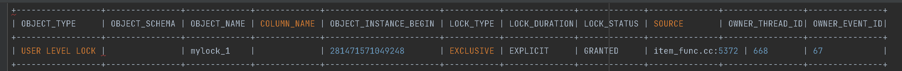

# 1. MySQL Named Lock

[toc]


Named Lock은 MySQL에서 제공하는 사용자 수준의 잠금입니다.

특징: 임의의 문자열 이름을 사용하여 락을 지정하며, 다른 세션은 명시적 해제나 타임아웃이 될 때까지 해당 락을 획득할 수 없습니다. 각 락은 문자열 이름별로 관리됩니다.
- **GET_LOCK**: `GET_LOCK(lock_name, timeout)` 함수를 사용하여 특정 문자열에 대해 락을 설정합니다.
- **메모리 및 메타 데이터 기반**: 실제 데이터 레코드나 테이블에 락을 걸지 않습니다. 대신 메모리와 메타 데이터 테이블(`metadata_locks`)을 사용하여 락을 관리합니다. 따라서, 전체 시스템의 처리량이 `비관적 락`에 비해 증가할 수 있습니다.
  - 대상이 테이블이나 레코드 같은 객체가 아니므로 테이블을 잠그는 테이블락과 레코드를 잠그는 레코드 락과는 다릅니다.
- **테이블/레코드 액세스 제한 없음**: Named Lock은 단순히 사용자가 지정한 문자열에 대한 락만을 제공합니다. 따라서, 특정 테이블이나 레코드에 대한 접근은 제한되지 않습니다.

**장점**:
* 외부 인프라 불필요: Zookeeper, Redis와 같은 추가적인 인프라를 사용하지 않기 때문에, 비용과 관리 측면에서의 부담을 줄일 수 있습니다.

# 2. 사용법 - Named Lock Functions

MySQL Named Lock은 다음의 함수들로 이용할 수 있습니다. 

## 2.1. GET_LOCK(lock_name, timeout) - 락 획득 시도

lock_name으로 Named Lock을 획득하려고 시도합니다. timeout 매개변수는 잠금을 획득할 수 없는 경우 오류를 반환하기 전 함수가 기다리는 시간을 지정합니다.

```mysql
-- // "mylock"이라는 문자열에 대해 잠금을 획득한다.
-- // 이미 잠금을 사용 중이면 2초 동안만 대기한다. (2초 이후 자동 잠금 해제됨)

SELECT GET_LOCK('mylock', 2);
```

- 한 session에서 잠금을 유지하고 있는동안에는 다른 모든 session에서 동일한 이름의 잠금을 획득 할 수 없습니다.
- `GET_LOCK() 을 이용하여 획득한 잠금은 Transaction 이 commit 되거나 rollback 되어도 해제되지 않습니다.`
- 세션이 종료될때에는 암시적으로 해제됩니다. 

> MySQL 5.7 이전에서는,동시에 1개의 Lock만 획득 가능하고 LOCK 이름 글자수 무제한 이였지만.
>
> MySQL 5.7 이후에는 동시에 여러개의 Lock 획득이 가능하며 LOCK 이름 글자수가 60자로 제한됩니다. 

**`주의`**

> 동일 커넥션에서 GET_LOCK을 여러번하면 여러번 락이 잡힌다. 따라서 RELEASE_LOCK을 그 횟수만큼 동일 커넥션에서 반복해서 해주지 않으면 lock이 풀리지 않게 됩니다.
>
> - 위 문제에 따라 **애플리케이션에서 Connection Pool 사용시 항상 동일 Lock 문자열에 대한 GET_LOCK과 RELEASE_LOCK 이 동일 커넥션에서 동일 횟수만큼 이뤄짐을 보장해줘야 합니다.**

## 2.2. RELEASE_LOCK(lock_name) - lock_name으로 락 해제 시도

```mysql
-- // "mylock"이라는 문자열에 대해 획득했던 잠금을 반납(해제) 한다.

SELECT RELEASE_LOCK('mylock');
```

* 락 해제에 **성공하는 경우 1을 반환**하지만, 락이 없는 경우 등에 대해서는 **NULL이나 0을 반환**합니다

## 2.3. IS_FREE_LOCK(lock_name) - 락 획득 가능(사용 가능) 여부확인

```mysql
-- // "mylock"이라는 문자열에 대해 잠금이 설정돼 있는지 확인한다.

SELECT IS_FREE_LOCK('mylock');
```

* 락이 걸려있지 않은 경우 1, 락이 걸려있는경우 0을 반환합니다

## 2.4. IS_USED_LOCK(lock_name) - 락 사용중인지 여부

다른 세션에서 특정 Named Lock이 현재 사용 중인지 확인하는 데 유용하며, 락을 보유하고 있는 세션을 파악합니다.

- lock_name의 Named Lock이 사용 중인지 확인합니다.

```mysql
-- // lock_name의 Named Lock이 사용 중인지 확인

SELECT IS_USED_LOCK('mylock');
```

* 락 이름이 존재하지 않거나 설정되지 않았다면 NULL을 반환합니다.
* 락을 보유하고 있다면, 락을 보유하고 있는 세션 ID( ex. 932) 를 반홥합니다


> 추가적으로 8.0 이전에는 Named Lock을 중첩해서 걸 수 없엇지만, 8.0 이후부터는 중첩해서 걸 수 있게 되면서 조금 더 복잡한 로직을 처리할 수 있게 됐습니다.

## 2.5. 네임드 락 중첩과 해제


MySQL 8.0 버전 부터는 네임드 락을 중첩해서 사용할 수 있으며, 현재 세션에서 획득한 네임드 락을 한 번에 모두 해제할 수도 있습니다.

```mysql
mysq1> SELECT GET_LOCK('mylock_1',10);
-- // mylock_1에 대한 작업 실행

mysql> SELECT GET_LOCK('mylock_2',10);

-- // mylock_1과 mylock_2에 대한 작업 실행

mysql> SELECT RELEASE LOCK('mylock_2');
mysql> SELECT RELEASE LOCK('mylock_1');

-- // mylock_1과 mylock_2를 동시에 모두 해제하고자 한다면 RELEASE_ALL_LOCKS() 함수 사용
mysql> SELECT RELEASE_ALL_LOCKS();
```

또한 하나의 세션에서 연속으로 동일 Lock 이름으로 Lock을 잡으면 그 횟수만큼 중복으로 Lock이 잡히므로, 

`중복으로 건 횟수만큼 풀어줘야 합니다.`


### 2.5.1 네임드락이 관리되는 테이블 - performance_schema의 metadata_locks Table

 [`INNODB_LOCKS`](https://dev.mysql.com/doc/refman/5.7/en/information-schema-innodb-locks-table.html)테이블은 각 잠금에 대한 정보를 제공합니다.

그러나 INNODB_LOCKS 테이블은 MySQL 5.7.14부터 더 이상 사용되지 않으며 MySQL 8.0에서 제거되었습니다.

* https://dev.mysql.com/doc/refman/5.7/en/information-schema-innodb-locks-table.html

`대신 performance_schema의 metadata_locks Table에서 관리됩니다.`

```mysql
mysql> select get_lock('mylock_1', 10);

mysql> select * from performance_schema.metadata_locks
```



metadata_locks 테이블 중 알면 좋겠는 부분만 설명하겠습니다

* https://dev.mysql.com/doc/refman/8.0/en/performance-schema-metadata-locks-table.html 에서 더 자세하게 확인 가능합니다. 

**OBJECT_TYPE**

* 메타데이터 잠금 하위 시스템에서 사용되는 잠금의 유형입니다. 
* 값은 GLOBAL, SCHEMA, TABLE, FUNCTION, PROCEDURE, TRIGGER (현재 사용되지 않음), EVENT, COMMIT, USER LEVEL LOCK, TABLESPACE, BACKUP LOCK, 또는 LOCKING SERVICE 중 하나입니다.

* `USER LEVEL LOCK 값`은 GET_LOCK()로 획득한 잠금을 나타냅니다. 
* LOCKING SERVICE 값은 [Section 5.6.9.1, “The Locking Service”](https://dev.mysql.com/doc/refman/8.0/en/locking-service.html) 에 설명된 잠금 서비스로 획득한 잠금을 나타냅니다. 

**OBJECT_NAME**

* 계측된 오브젝트의 이름입니다. 네임드락 같은 경우 이름이 들어갑니다. 

**LOCK_TYPE**

* 메타데이터 잠금 하위 시스템에서의 잠금 유형입니다. 
* 값은 INTENTION_EXCLUSIVE, SHARED, SHARED_HIGH_PRIO, SHARED_READ, SHARED_WRITE, SHARED_UPGRADABLE, SHARED_NO_WRITE, SHARED_NO_READ_WRITE, 또는 EXCLUSIVE 중 하나입니다.
* `네임드 락 같은경우 EXCLUSIVE가 됩니다.`

**LOCK_DURATION**

* 메타데이터 잠금 하위 시스템에서의 잠금 기간입니다. 값은 STATEMENT, TRANSACTION, 또는 EXPLICIT 중 하나입니다. 
* EXPLICIT 값은 문 또는 트랜잭션 종료 후에도 유지되고, FLUSH TABLES WITH READ LOCK과 같은 명시적 작업으로 해제되는 전역 잠금을 나타냅니다.

**OWNER_THREAD_ID**

* 메타데이터 잠금을 요청하는 스레드입니다.
* 네임드 락의 경우 스레드 Id가 들어가며, performance_schema.threads에서 세션 id를 얻을 수 있습니다. 


[`metadata_locks`](https://dev.mysql.com/doc/refman/8.0/en/performance-schema-metadata-locks-table.html)  테이블에는 다음과 같은 인덱스가 있습니다:

- 기본 키 on (`OBJECT_INSTANCE_BEGIN`)
- 인덱스 on (`OBJECT_TYPE`, `OBJECT_SCHEMA`, `OBJECT_NAME`)
- 인덱스 on (`OWNER_THREAD_ID`, `OWNER_EVENT_ID`)

>  metadata_locks 테이블에 대해서는 TRUNCATE TABLE이 허용되지 않습니다.

## 2.6. 네임드락(Named Lock의) 단점

**불필요한 부하**

* 락에 대한 정보가 DB에 저장되고, 락을 획득하고 제거하는 쿼리가 매번 발생하여 DB에 불필요한 부하를 줄 수 있습니다.
* 그러나 대부분의 상황에서는 미미한 편입니다.

**제한적이다.**

1. MySQL에서만 사용가능하다는 단점
2. JPA에서는 nativeQuery를 사용해야 함.

**데드락 위험** 

* Named Locks와 테이블 레벨 락, 행 레벨 락을 혼용하여 사용할 경우 데드락 상황이 발생할 수 있습니다.

**커넥션이 종료되면 잠금이 해제되는 문제 -  [우아한형제들 기술블로그](https://techblog.woowahan.com/2631/), [MySQL 공식 문서](https://dev.mysql.com/doc/refman/5.7/en/locking-functions.html)에 적힌 내용**

* Named Locks는 세션 범위를 가지며, 다른 세션에서는 해당 락의 상태를 변경할 수 없기 때문

**애플리케이션에서 같은 커넥션으로 관리해야하는 문제**

* 락 획득과 해제는 다른 커넥션에서 불가합니다. 

**커넥션풀이 부족**

* ([참고](https://kwonnam.pe.kr/wiki/database/mysql/user_lock)) 주의할 점은, Named Lock을 활용할 때 데이터소스를 분리하지않고 하나로 사용하게되면 커넥션풀이 부족해질 수 있습니다.

Named Lock은 한 MySQL 서버 인스턴스에서만 유효합니다. 

따라서, 여러 서버 인스턴스(클러스터 등)가 있는 분산 환경에서는 한 서버에서 설정된 Named Lock이 다른 서버에는 적용되지 않으므로 분산 시스템에는 적합하지 않을수도 있습니다. 

> 이러한 문제점들로 인해, 분산 시스템에서는 주로 분산 락 전용 솔루션(예: Apache ZooKeeper, etcd, Redis의 RedLock 등)을 사용하여 관리하는 것이 좋을 수 있습니다.


# 3. Spring에서의 구현

JdbcTemplate, EntityManager, JpaRepository를 이용해 구현할 수 있습니다.

공통점으로는 JPA에서는 지원하지 않으므로, native query로 구성해야 합니다.

### 3.1. JdbcTemplate으로 구현 

```kotlin
@Repository
class NamedLockWithJdbcTemplate(
    private val jdbcTemplate: NamedParameterJdbcTemplate
) {

    private val log = LoggerFactory.getLogger(this::class.java)

    fun getLock(userLockName: String, timeoutSeconds: Int): Boolean {
        val sql = "SELECT GET_LOCK(:userLockName, :timeoutSeconds)"
        val params = mapOf("userLockName" to userLockName, "timeoutSeconds" to timeoutSeconds)

        return convertResult(jdbcTemplate.queryForObject(sql, params, Int::class.java))
    }

    fun releaseLock(userLockName: String): Boolean {
        // Release the named lock
        val sql = "SELECT RELEASE_LOCK(:userLockName)"
        val params = mapOf("userLockName" to userLockName)

        return convertResult(jdbcTemplate.queryForObject(sql, params, Int::class.java))
    }

    private fun convertResult(result: Int?): Boolean {
        return when (result) {
            1 -> {
                log.info("lock 획득")
                true
            }
            0, null -> {
                log.info("lock 획득 실패")
                false
            }
            else -> {
                log.error("예상치 못한 결과: $result")
                false
            }
        }
    }
}
```

### 3.2. EntityManager로 구현

```kotlin
@Repository
class NamedLockWithEntityManager(
    @PersistenceContext
    private val entityManager: EntityManager
) {

    fun getLock(userLockName: String, timeoutSeconds: Int): Boolean {
        val query: Query = entityManager.createNativeQuery("SELECT GET_LOCK(:userLockName, :timeoutSeconds)")
            .setParameter("userLockName", userLockName)
            .setParameter("timeoutSeconds", timeoutSeconds)

        return convertResult(query.singleResult as Int?)
    }

    fun releaseLock(userLockName: String): Boolean {
        // Release the named lock
        val query: Query = entityManager.createNativeQuery("SELECT RELEASE_LOCK(:userLockName)")
            .setParameter("userLockName", userLockName)

        return convertResult(query.singleResult as Int?)
    }

}
```

### 3.3. JpaRepository로 구현

```kotlin
interface NamedLockWithJpaRepository : JpaRepository<Item, Long> {

    @Query(value = "select GET_LOCK(:key, :timeoutSeconds)", nativeQuery = true)
    fun getLock(key: String, timeoutSeconds: Int): Long?

    @Query(value = "select RELEASE_LOCK(:key)", nativeQuery = true)
    fun releaseLock(key: String) : Long?
}
```

### 3.4. 사용

```kotlin
@Service
class ItemNamedLockService(
    private val itemService: ItemService,
    private val namedLockWithJdbcTemplate: NamedLockWithJdbcTemplate
) {

    fun decreaseStock(itemId: Long, quantity: Long) {
        val key = LOCK_PREFIX + itemId.toString()

        try {
            // 락 획득. (락 획득을 대기할 타임아웃, 락이 만료되는 시간)
            namedLockWithJdbcTemplate.getLock(key, 3000)

            // 재고 감소
            itemService.decrease(itemId, quantity)

        } finally {
            // 락 해제
            namedLockWithJdbcTemplate.releaseLock(key)
        }
    }

    companion object {
        private const val LOCK_PREFIX = "LOCK:"
    }

}
```

반복적인 try-finally 문은 AOP 또는 함수를 전달해줌으로써 해결해줄 수 있습니다.

```kotlin
fun <T> executeWithLock(
    userLockName: String,
    timeoutSeconds: Int,
    action: () -> T
): T = try {
  
    getLock(userLockName, timeoutSeconds)
  
    action()
  
} finally {
    releaseLock(userLockName)
}

```

```kotlin
fun decreaseStock2(itemId: Long, quantity: Long) {
  val key = LOCK_PREFIX + itemId.toString()

  val result = namedLockWithJdbcTemplate.executeWithLock("key", 3000) 
  { itemService.decrease(itemId, quantity) }    
}
```

# 4. Name Lock 구현하여 사용시 주의할점

## 4.1. 반복하여 중첩된 락을 해제할때는 동일 커넥션에서

동일 커넥션에서 GET_LOCK을 여러번하면 여러번 락이 잡히므로  RELEASE_LOCK을 동일 커넥션에서 해줘야 합니다.

그렇지 않으면  lock이 풀리지 않게 됩니다

try-finally 문으로 application에서 Connection Pool 사용시 항상 동일 Lock 문자열에 대한 GET_LOCK과 RELEASE_LOCK 이 동일 커넥션에서 동일 횟수만큼 이뤄짐을 보장해줘야 합니다.

이때, Lock이 중첩된 경우 한번에 해제하기 어렵다면  `SELECT RELEASE_ALL_LOCKS();` 를 이용하여 모든 락을 해제할 수 있지만, 

현재 Lock을 이용하여 진행중인 프로세스가 있을수 있으니 주의해야 합니다.

* [세션이 종료되었는데, Named Lock이 해제되지 않을 경우 해결방법](#세션이-종료되었는데-named-lock이-해제되지-않을-경우-해결방법)


## 4.2. 같은 커넥션을 이용해서 Lock을 설정하고 로직을 수행한 후 Lock을 해제해야 한다 

Named락의 특성을 잘 고려해야합니다.

- `GET_LOCK() 을 이용하여 획득한 잠금은 Transaction 이 commit 되거나 rollback 되어도 해제되지 않습니다.`
- 세션(커넥션)이 종료될때에는 암시적으로 해제됩니다. 

더 나아가 동시에 동일한 Lock 이름으로 요청한 다른 스레드에서 `GET_LOCK()` 에서 반환했던 Connection 을 획득하여 락을 풀어버릴 위험도 존재합니다.

* 커넥션 풀을 공유하기 때문에 우연치 않게 발생할 수 있습니다. 

때문에 같은 커넥션을 이용해서 Lock을 설정하고, Logic을 수행한 후에 Lock을 해제하도록 구현해야 합니다. 

이 문제를 해결하려면 [Spring Framework](https://kwonnam.pe.kr/wiki/springframework)의 트랜잭션에 의존하지 말고, **별도의 DataSource를 생성하여 직접 Lock 용 커넥션과 트랜잭션을 컨트롤**할 수 있습니다.

```kotlin

@Repository
class NamedLockWithDataSource(
    private val dataSource: DataSource
) {

    fun <T> executeWithLock(
        userLockName: String,
        timeoutSeconds: Int,
        action: () -> T
    ): T = dataSource.connection.use { connection ->
        getLock(connection, userLockName, timeoutSeconds)

        val result = action()

        releaseLock(connection, userLockName)

        return result
    }

    private fun getLock(
        connection: Connection,
        userLockName: String,
        timeoutSeconds: Int
    ) = connection.prepareStatement(GET_LOCK).use { preparedStatement ->

        preparedStatement.setString(1, userLockName)
        preparedStatement.setInt(2, timeoutSeconds)

        checkResultSet(userLockName, preparedStatement, LockFunction.GET_LOCK)
    }

    private fun releaseLock(
        connection: Connection,
        userLockName: String
    ) = connection.prepareStatement(RELEASE_LOCK).use { preparedStatement ->

        preparedStatement.setString(1, userLockName)

        checkResultSet(userLockName, preparedStatement, LockFunction.RELEASE_LOCK)
    }

    private fun checkResultSet(
        lockName: String,
        preparedStatement: PreparedStatement,
        type: LockFunction
    ) = preparedStatement.executeQuery().use { resultSet ->

        if (!resultSet.next()) {
            log.error("Named Lock 결과 값이 없습니다. type = ${type.name}, lockName $lockName")
            
            throw RuntimeException(EXCEPTION_MESSAGE)
        }
        
        val result = resultSet.getInt(1)
        
        if (result != 1) {
            log.error("Named Lock 획득 실패  type = ${type.name}, lockName $lockName")
            
            throw RuntimeException(EXCEPTION_MESSAGE)
        }
        
    }

    companion object {
        private val log = LoggerFactory.getLogger(NamedLockWithDataSource::class.java)
        private const val GET_LOCK = "SELECT GET_LOCK(?, ?)"
        private const val RELEASE_LOCK = "SELECT RELEASE_LOCK(?)"
        private const val EXCEPTION_MESSAGE = "NAMED LOCK 을 수행하는 중에 오류가 발생하였습니다."
    }
    
    enum class LockFunction {
        GET_LOCK,
        RELEASE_LOCK
    }
    
}
```

# 5. metadata_locks로 어떤 세션이 네임드 락을 걸었는지 확인하는법

 Named Lock을 걸게 되면 다음과 같은 정보가 `metadata_locks 테이블`에 저장됩니다

```mysql
mysql> select get_lock('mylock_1', 10);

mysql> select * from performance_schema.metadata_locks
```


이때, owner_thread_id로 현재 커넥션이 누군지 알 수 있습니다.

**현재 활성 커넥션 확인 방법**

```mysql
mysql> SHOW PROCESSLIST;
```

**커넥션 종료 방법**

```mysql
mysql> KILL connection_id;
```

**현재 세션(커넥션) id 보는법**

```mysql
mysql> SELECT CONNECTION_ID();
```

**현재 세션의 OWNER_THREAD_ID 확인법**

```mysql
SELECT THREAD_ID as owner_thread_id
FROM performance_schema.threads
WHERE PROCESSLIST_ID = CONNECTION_ID();
```

**OWNER_THREAD_ID로 connection_id를 얻는법**

```mysql
SELECT PROCESSLIST_ID as connection_id
FROM performance_schema.threads
WHERE THREAD_ID = ?;  -- 여기에 owner_thread_id 값을 대입합니다.
```

## 5.1. 세션이 종료되었는데, Named Lock이 해제되지 않을 경우 해결방법

세션이 종료되었다고 생각했지만, Named Lock이 해제되지 않을 경우가 있습니다.

그런데, metadata_locks은 root 유저로도 truncate를 할 수 없습니다.

이때 강제로 세션을 종료 시켜 Lock을 해제할 수 있습니다.

* 물론 주의해서 사용해야 합니다. 실제 LOCK을 이용하고 있는지, 아닌지 알 수 없기 때문입니다. 
* 또한 세션이 강제로 종료되니, 진행중이던 로직에 문제가 생길 수 있습니다.

> 시나리오
>
> 
>
> 1번과 2번 세션이 있다.
> 1번 세션의 세션 ID는 733이며 2번 세션의 ID는 631이다.
>
> 1번 세션에서 'test' 라는 named Lock을 걸었고 그냥 종료했는데, 2번 세션에서 'test'라는 named Lock을 사용하고 싶어도 사용하지 못한다.
>
> named_lock 특성상 lock을 건 세션이 종료되면 lock도 해제되기 때문에 강제 해제해야 한다. 


**1번 세션(id 733)에서 'test' named lock을 건다**

```mysql
mysql(1번, id: 733)> select get_lock('test', 3);
```

metadata_locks확인

```mysql
select * from performance_schema.metadata_locks;

// 출력 간소화
+-----------------+----------------+-----------------+
| OBJECT_TYPE     | OBJECT_NAME    | OWNER_THREAD_ID |
+-----------------+----------------+-----------------+
| USER LEVEL LOCK | test           |             772 | // 772번 스레드가 test 라는 락을 건것을 확인
| TABLE           | metadata_locks |             772 |
+-----------------+----------------+-----------------+
```

* OWNER_THREAD_ID는 세션 ID가 아니다.

**세션 ID 확인**

```mysql
mysql> SELECT PROCESSLIST_ID as connection_id
    -> FROM performance_schema.threads
    -> WHERE THREAD_ID =772;
+---------------+
| connection_id |
+---------------+
|           733 |
+---------------+
```

* OWNER_THREAD_ID가 772번 인 커넥션의 id는 733이다. 

**1번 세션 종료. 해당 콘솔로 다시 접근 불가 상태.**

**2번 세션(id 631) 에서 해당 'test' lock을 걸라고 확인**

```mysql
mysql> select get_lock('test', 3);
+---------------------+
| get_lock('test', 3) |
+---------------------+
|                   0 |
+---------------------+
1 row in set (3.01 sec)
```

* 3초를 기다렸지만 0을 반납. 
* 락을 획득할 수 없다. 왜냐하면 733번 션에서 해제하지 않았기 때문에 다른 세션(커넥션) 에서는 쓸수없다.


**이 때, 'test' 락을 갖고 있는 세션을 확인해서 종료시키면 됩니다**

1. `select * from performance_schema.metadata_locks;` 를 이용해서 조회한 OWNER_THREAD_ID로

2. connection_id를 획득 후,

3. kill 프로세스ID로 종료하면 됩니다.

```mysql
-- 1. lock을 갖고 있는 스레드 확인
mysql> select * from performance_schema.metadata_locks; // 772번 쓰레드가 test 락을 갖고있는것을 확인

+-----------------+----------------+-----------------+
| OBJECT_TYPE     | OBJECT_NAME    | OWNER_THREAD_ID |
+-----------------+----------------+-----------------+
| USER LEVEL LOCK | test           |             772 | // 772번 스레드가 test 라는 락을 건것을 확인
| TABLE           | metadata_locks |             772 |
+-----------------+----------------+-----------------+

-- 2. 세션 ID 확인

mysql> SELECT PROCESSLIST_ID as connection_id
    -> FROM performance_schema.threads
    -> WHERE THREAD_ID =772;
+---------------+
| connection_id |
+---------------+
|           733 |
+---------------+

-- 3. kill process 733번 세션 
mysql> kill 733
Query OK, 0 rows affected (0.01 sec)

-- 4. metadata_locks를 확인

mysql> select * from performance_schema.metadata_locks;

+-------------+----------------+-----------------+
| OBJECT_TYPE | OBJECT_NAME    | OWNER_THREAD_ID |
+-------------+----------------+-----------------+
| TABLE       | metadata_locks |             670 |
+-------------+----------------+-----------------+
```

## 5.2. 참조

- Real MySQL
- [MySQL에서 사용하는 Lock 이해](http://blog.saltfactory.net/introduce-mysql-lock/)
- [MySQL을 이용한 분산락으로 여러 서버에 걸친 동시성 관리 | 우아한형제들 기술블로그](https://techblog.woowahan.com/2631/)
  * https://velog.io/@this-is-spear/MySQL-Named-Lock#%EB%B6%84%EC%82%B0-%EC%8B%9C%EC%8A%A4%ED%85%9C%EC%97%90%EC%84%9C%EB%8A%94-%EC%A0%81%ED%95%A9%ED%95%98%EC%A7%80-%EC%95%8A%EB%8B%A4*
- https://dev.mysql.com/doc/refman/8.0/en/performance-schema-metadata-locks-table.html