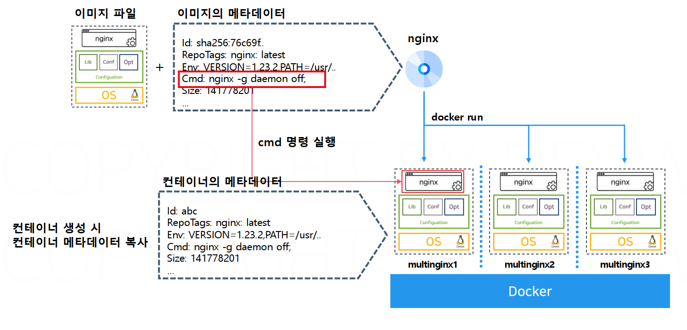

# 인프런 개발자를 위한 쉬운 도커

* https://github.com/daintree-henry/leafy
* https://github.com/daintree-henry/build/tree/02-practice


실행중인 모든 컨테이너 삭제 명령어

```docker
docker rm -f $(docker ps -aq)
```


# 가상화 기술

서버는 클라이언트가 요청을 보내면 결과를 응답주는 컴퓨터

파일, 디비, 웹, 애플리케이션 서버 등으로 나뉨


기업의 서버를 운영하는 방식

* 베어메탈 : 서버 통째로 구입 후 OS 설치 후 소프트웨어 실행. 

가상화 기술 : 실제로 존재하는 컴퓨터는 아니지만, 존재하는것처럼 만들어주는 기술. 논리적인 컴퓨팅 환경을 만들어줌 

한대의 컴퓨터로, 여러대를 가진것처럼 사용함. 

즉 논리적인 여러 OS를 만들어 하드웨어 리소스를 할당하고 서로 격리시켜 서로 영향을 미치지 않게함. 

낮은 성능 여러대 사용하는것보다, 높은 성능한대를 사용하는것이 가격 인력 운영 등 면에서 편리함이 존재. 

가상화는 하이퍼바이저, 컨테이너가 존재


하이퍼바이저 : OS의 프로그램으로 실행해서 가상화 환경을 실행.  호스트 OS의 자원을 격리해서 새로운 OS를 실행한다. 이것이 게스트 OS. 게스트 OS는 하드웨어를 나눠받은 논리적인 공간. 하이퍼바이저는 여러 이기종 논리적인 가상 머신으로부터 넘겨받은 시스템 콜을 올바른 시스템 콜로 번역해주는 역할도 함. 

* VirtualBox, VM웨어, 레드헷 하이퍼바이저 


컨테이너 가상화 기술은 하이퍼바이저 가상화보다 가볍고 빠르다.

모던 애플리케이션 환경에서 가볍고 빠른것은 아주 중요한 요구사항이다. 


리눅스 커널이 제공하는 Linux Containers라는 자체 컨테이너 기술에서 출발했다.

LXC를 사용하면 하이퍼바이저를 사용하지 않고 커ㅓ널의 자체 기능을 사용해서 격리된 공간을 만든다. 커널의 네임스페이스와 CGroups를 사용한다.

* 네임스페이스 : 프로세스, 하드드라이브, 네트워크, 사용자 등 리소스를 나누는 기준 
* CGroups : 프로세스가 사용하는 메모리 시피유 하드디스크 등 사용량을 제어하는 기술 

HostOS의 커널을 공유해서 사용한다.


구조를 보면, 

하이퍼바이저는 게스트 OS의 커널이 독립적으로 존재하고 하이퍼바이저 소프트웨어가 중간에서 커널간의 통신을 지원한다.

* 각각의 시스템 콜이 하이퍼바이저의 통역을 거쳐가기 때문에 요청이 거쳐가는 단계가 늘어나서 오버헤드가 크다. 

컨테이너는 호스트 OS의 커널을 그대로 사용하기 때문에 상대적으로 오버헤드가 적다. (오버헤드가 적다는것은 하드웨어 리소스 사용 요청이 더 효율적으로 이루어진다 )

즉 하이퍼바이저를 이용한 가상 머신은, 각 게스트 OS가 독립적인 커널을 가지고 구성하는데 시간이 오래걸리고, 하이퍼바이저 번역을 통한 요청이 상대적으로 느리기 때문에 컨테이너보다 비효율 적이다. 


# 도커 

커널의 컨테이너 가상화 기술을 사용자가 쉽게 활용할 수 있도록 도와주는 도구. 

도커와 같은 컨테이너 가상화 도구를 컨테이너 플랫폼이라 한다.


자체적으로 가지고 있는 엔진과 런타임으로 구성되어 있다.

컨테이너 엔진은 사용자의 요청을 받아 컨테이너를 관리해주는 역햘을 하고, 컨테이너 런타임은 직접 커널과 통신하면서 실제로 격리된 공간을 만드는 역할을 한다.

## 도커 아키텍처


도커는 클라이언트 서버 모델로 실행된다.

도커 데몬이 컨테이너를 관리한다. 

## docker api 

https://docs.docker.com/reference/api/engine/version/v1.41/


# 도커 이미지

이미지 : 특정 서버를 실행할 수 있는 상태를 저장한 압축파일

이미지안에 OS, 구성요소, 프로그램이 포함되어 있다. 

이미지로 실행한 컨테이너간 리소스는 격리된다.


### 이미지 메타 데이터



이미지 파일에 대한 데이터.

```sh
docker run 이미지명 (실행명령 ) // 메타데이터 cmd 덮어쓰기

docker run --env KEY=VALUE 이미지명 //메타데이터 env 덮어쓰기 

```


## 컨테이너 라이프사이클


**Created**: 컨테이너가 생성되었지만 아직 시작되지 않은 상태.

**Running**: 컨테이너가 실행 중이며 정상적으로 작동하는 상태.

**Paused**: 컨테이너의 실행이 일시 중지된 상태.

**Stopped**: 컨테이너가 종료된 상태.

**Removed/Deleted**: 컨테이너가 삭제된 상태.

## 이미지 레지스트리

이미지를 저장하는 저장소.  public image registry docker hub가 있다.

이미지레지스트리는 이미지 공유, 검색, 버전관리, 보안 파이프라인을 제공한다.

private registry는 이미지를 공유하지 않을때 사용한다. 

* open soruce private registry : harbor https://velog.io/@tkfrn4799/harbor-private-docker-registry

업로드 및 다운로드는 다음 규칙을 가짐

```
레지스트리주소/프로젝트명/이미지명:이미지태그

docker.io/my-test-project/testConatiner:latest
```

## 이미지 레이어

Docker 이미지 자체는 파일 시스템 스냅샷들의 **계층적 구조**로 되어 있습니다. 이러한 계층 구조는 도커 이미지의 효율성을 극대화하고, 재사용 및 저장 공간 절약을 가능하게 합니다

Docker 이미지의 각 레이어는 변경 사항을 포함하는 불변(immutable) 파일 시스템 스냅샷으로, 아래 레이어에 기반하여 변경된 파일이나 추가된 파일을 기록합니다. 이미지는 여러 개의 레이어가 쌓여서 하나의 완전한 파일 시스템을 구성합니다.

- 각 레이어는 **이전 레이어에 대한 참조**를 가지고 있으며, 이전 레이어 위에 덧붙여진 추가적인 변화만을 포함합니다.
- 레이어는 **읽기 전용**입니다. 즉, 한 번 생성된 레이어는 변경되지 않고 그대로 유지됩니다. 새로운 변동 사항이 있을 경우, 기존 레이어를 수정하는 대신 새로운 레이어가 생성됩니다.


### **Base Image)**

도커 이미지에서 가장 아래에 위치하는 레이어는 기저 이미지라고 불리며, 일반적으로 운영체제의 기본적인 파일 시스템을 포함합니다. 예를 들어, Ubuntu를 기반으로 하는 도커 이미지는 `ubuntu` 이미지를 기저 이미지로 사용하게 됩니다.

- Base 이미지 이후에 도커파일에서 명시된 명령에 따라 새로운 레이어가 추가됩니다.


예를들어 nginx라면


Layering : 각 레이어는 이전 레이어 위에 쌓이며, 여러 이미지 간에 공유될 수 있습니다. 레이어 방식은 중복 데이터를 최소화하고, 빌드 속도를 높이며, 저장소를 효율적으로 사용할 수 있게 해줍니다.

Copy-on-Write (CoW) 전략 : 다음 레이어에서 이전 레이어의 특정 파일을 수정 할 때, 해당 파일의 복사본을 만들어서 변경 사항을 적용합니다. 이렇게 함으로써 원래 레이어는 수정되지 않고 그대로 유지됩니다.

Immutable Layers (불변 레이어) : 이미지의 각 레이어는 불변으로, 한 번 생성되면 변경되지 않습니다. 이렇게 함으로써 이미지의 일관성을 유지하고, 여러 컨테이너에서 안전하게 공유할 수 있습니다.

Caching (캐싱) : 레이어를 캐시하여, 이미 빌드된 레이어를 재사용할 수 있습니다. 이는 이미지 빌드 시간을 크게 줄여주며, 같은 레이어를 사용하는 여러 이미지에서 효율적으로 작동합니다.


## DockerFile

```
FROM 이미지명 // 베이스 이미지 지정

COPY 파일경로 복사할 경로 // 파일을 레이어에 복사

CMD ["명령어1", "명령어2"] // 컨테이너 실행시 명령어 지정 

ENTRYPOINT ["명령어"] // 고정된 명령어 지정 

RUN 명령어 // 명령어 실행

WORKDIR 폴더명 // 작업 디렉토리 지정(cd)

USER 유저명 // 명령을 실행할 사용자 변경(su)

EXPOSE 포트번호 // 컨테이너가 사용할 포트번호 명시 

ARG 변수명 변수값 // 이미지 빌드 시점 환경 변수 설정
-- docker build --build-arg 변수명=변수값 으로 덮어쓰기 가능 

ENV 변수명 변수값 // 이미지 빌드 및 컨테이너 실행 시점의 환경변수
-- docker run -e 변수명=변수값 으로 덮어쓰기 가능 
```


ex

```dockerfile
# 14 버전의 node를 베이스 이미지로 사용
FROM node:14

# 작업 디렉토리를 /app으로 이동
WORKDIR /app

# 빌드 컨텍스트의 전체 파일을 /app으로 복사
COPY . .

# 애플리케이션 의존 라이브러리 설치
RUN npm install

# 작업 사용자를 node로 변경
USER node

# 애플리케이션이 사용할 포트 지정
EXPOSE 3000

# 환경변수 지정, 예시에서는 COLOR라는 환경변수에 red 지정 
ARG COLOR=red 

# 환경변수 지정, 예시에서는 COLOR라는 환경변수에 red 지정 

ENV COLOR=red

# 컨테이너 실행 시 애플리케이션 실행 명령
CMD ["npm", "start"]
```


ENTRYPOINT vs CMD

```
ENTRYPOINT ["npm"] // 컨테이너 실행 시 고정 실행 명령

CMD ["start"] // 컨테이너 실행시 명령 파라미터 
```


### 단일 스테이지 빌드 vs 멀티 스테이지 빌드 

도커의 단일 스테이지 빌드와 멀티 스테이지 빌드는 컨테이너 이미지를 빌드하는 두 가지 방법으로, 목적에 따라 각각 장단점이 있습니다.

### 1. 단일 스테이지 빌드 (Single-Stage Build)
단일 스테이지 빌드는 하나의 도커파일에서 빌드와 실행에 필요한 모든 작업을 처리하는 방식입니다.

#### 장점:
- **간단함**: 빌드 프로세스가 단일 스테이지로 이루어져 있어 설정이 간단하고 유지보수가 쉽습니다.
- **직관적**: 모든 작업이 한 곳에서 이루어지기 때문에 설정 파일을 이해하기 쉽습니다.

#### 단점:
- **큰 이미지 크기**: 빌드 도구나 테스트 도구 같은 불필요한 파일들이 포함되어 최종 이미지가 크고, 이를 배포할 때 비효율적일 수 있습니다.
- **보안 문제**: 빌드 과정에서 필요한 툴이나 패키지가 최종 이미지에 남아 있을 수 있어서 보안 취약점이 생길 수 있습니다.

#### 예시:
```Dockerfile
FROM node:14
WORKDIR /app
COPY . .
RUN npm install
EXPOSE 3000
CMD ["npm", "start"]
```

### 2. 멀티 스테이지 빌드 (Multi-Stage Build)
멀티 스테이지 빌드는 도커파일 내에서 여러 개의 `FROM` 구문을 사용하여 빌드와 실행을 분리하는 방식입니다. 빌드에 필요한 단계와 최종 이미지에서 필요한 단계가 분리되어 효율적인 이미지를 생성할 수 있습니다.

#### 장점:
- **작은 이미지 크기**: 빌드에 필요한 파일(예: 컴파일러, 빌드 도구 등)이 최종 이미지에 포함되지 않아 더 작고 효율적인 이미지를 생성할 수 있습니다.
- **보안성 향상**: 빌드에만 필요한 파일이 최종 이미지에 포함되지 않으므로 보안적인 이점이 있습니다.
- **효율적인 배포**: 더 작은 이미지를 배포하기 때문에 네트워크 트래픽과 저장 공간을 절약할 수 있습니다.

#### 단점:
- **복잡도 증가**: 여러 스테이지를 다루기 때문에 도커파일의 복잡도가 높아질 수 있습니다.
- **디버깅 어려움**: 중간 단계에서 발생하는 문제를 추적하는 것이 상대적으로 더 어려울 수 있습니다.

#### 예시:
```Dockerfile
# 빌드 스테이지
FROM node:14 as build
WORKDIR /app
COPY . .
RUN npm install && npm run build

# 실행 스테이지
FROM node:14-alpine
WORKDIR /app
COPY --from=build /app/dist ./dist
RUN npm install --production
EXPOSE 3000
CMD ["npm", "start"]
```

* COPY --from=build를 보면, 빌드단계에서 빌드된 파일을 실행 스테이지로옮긴다. 

### 단일 스테이지 vs 멀티 스테이지 비교

| **구분**        | **단일 스테이지 빌드**           | **멀티 스테이지 빌드**       |
| --------------- | -------------------------------- | ---------------------------- |
| **복잡도**      | 낮음                             | 높음                         |
| **이미지 크기** | 큼                               | 작음                         |
| **보안성**      | 빌드 툴 포함 가능                | 빌드 툴을 제외하여 더 안전함 |
| **유지보수**    | 간단함                           | 복잡할 수 있음               |
| **빌드 속도**   | 일반적으로 빠름                  | 빌드 시간이 더 걸릴 수 있음  |
| **사용 사례**   | 간단한 프로젝트나 빠른 개발 단계 | 배포용 이미지, 큰 프로젝트   |

멀티 스테이지 빌드는 특히 배포 시 작은 크기의 이미지를 만들기 위한 좋은 선택이며, 단일 스테이지 빌드는 간단한 개발 환경에서 사용할 때 적합합니다.


# Docker Image Build


1. 빌드 명령시 도커 데몬에 지정한 폴더를 전달
2. .dockerignore의 파일리스트는 빌드 컨텍스트에 전달되지 않음


# 컨테이너 애플리케이션 구성

먼저 클라우드에 대해 알아야 한다.

클라우드: 현대 애플리케이션이 겪는 다양한 문제들을 클라우드 환경 구성을 통해 해결
1. 트래픽이 증가할 때 빠르게 대처할 수 있는가? (확장성, Scalability)
  클라우드 환경에서는 서버 추가가 10분 내로 이루어집니다. 온프레미스에서는 서버가 미리 준비되어 있지 않은 경우
  새로운 서버를 증가하는데 오랜 시간이 소요됩니다.(주문, 배송, 설치 등)
2. 장애 발생 시 빠르게 복구할 수 있는가? (복원력, Resilience)
  클라우드 환경에서는 백업 및 복구가 빠르게 이루어질 수 있습니다. (Disaster Recovery)
  장애에 대응하기 위한 다양한 지역의 서버를 구축할 수 있습니다.
3. 운영 비용을 효율적으로 운영할 수 있는가?
  사용한 만큼만 지불할 수 있기 때문에 운영 비용에 더 효율적입니다

클라우드: 현대 애플리케이션이 겪는 다양한 문제들을 클라우드 환경 구성을 통해 해결
1. 트래픽이 증가할 때 빠르게 대처할 수 있는가? (확장성, Scalability)
클라우드 환경에서는 서버 추가가 10분 내로 이루어집니다. 온프레미스에서는 서버가 미리 준비되어 있지 않은 경우
새로운 서버를 증가하는데 오랜 시간이 소요됩니다.(주문, 배송, 설치 등)
2. 장애 발생 시 빠르게 복구할 수 있는가? (복원력, Resilience)
클라우드 환경에서는 백업 및 복구가 빠르게 이루어질 수 있습니다. (Disaster Recovery)
장애에 대응하기 위한 다양한 지역의 서버를 구축할 수 있습니다.
3. 운영 비용을 효율적으로 운영할 수 있는가?
사용한 만큼만 지불할 수 있기 때문에 운영 비용에 더 효율적입니다


# 도커 네트워크


네트워크 명령어

```
docker network ls // 네트워크 리스트 조회

docker network inspect 네트워크명 // 네트워크 상세 정보 조회

docker network create 네트워크명 // 네트워크 생성

docker network rm 네트워크명 

docker run -d --name app -p 80:80 --network 네트워크명 // 네트워크 지정 
```


도커의 네트워크 드라이버

브릿지 네트워크(Bridge) : 도커 브릿지를 활용해 컨테이너간 통신, NAT 및 포트포워딩 기술을 활용해 외부 통신 지원

호스트 네트워크(Host) : 호스트의 네트워크를 공유, 모든 컨테이너는 호스트 머신과 동일한 IP를 사용, 포트 중복 불가능

오버레이 네트워크(Overlay) : Kubernetes에서 사용, 호스트 머신이 다수일 때 네트워크 관리 기술

Macvlan 네트워크 : 컨테이너에 MAC 주소를 할당하여 물리 네트워크 인터페이스에 직접 연결


# 도커 볼륨

컨테이너는 stateless하다. 실행한 후 모든 변경사항은 컨테이너에만 있으며, 종료되면 변경사항이 모두 사라진다.

- 컨테이너는 Stateless하기 때문에 쉽게 개수를 증가시킬 수 있으며 다른 환경에서도 빠르게 배포할 수 있습니다.
- 소프트웨어의 버전 등 컨테이너의 상태 변경이 필요한 경우 새로운 버전의 이미지를 만들어서 배포합니다.

\- 클라우드 네이티브 환경에서는 MSA 아키텍처에 따라 서버의 개수가 매우 많아집니다.

모던 애플리케이션의 요구사항을 충족시키기 위해 서버 관리 방법론이 변화했습니다.

- 전통적인 서버 방법론은 서버 한대를 중요하게 생각하는 Pet 방식입니다. 서버 한 대를 소중하게 케어합니다.
- 컨테이너를 활용한 서버 방법론은 Cattle 방식입니다. 서버를 빠르게 교체할 수 있으며 서버의 상태를 최대한 제거합니다.

| **기준**         | **Pet 방식**             | **Cattle 방식**                |
| ---------------- | ------------------------ | ------------------------------ |
| **방식**         | 전통적, VM 방식          | 컨테이너 방식                  |
| **이름**         | 고유한 이름을 가짐       | 랜덤한 일련번호 생성           |
| **문제 발생 시** | 문제 해결 또는 복구 시도 | 삭제 후 새로 생성              |
| **상태**         | 상태가 내부에 저장       | 상태 없음, 필요 시 외부 마운트 |
| **교체**         | 교체가 어려움            | 쉽게 교체                      |
| **적용 사례**    | Monolithic, OnPremise    | MSA, WEBAPP                    |

컨테이너는

* 데이터를 영구적으로 저장하기 위해서는 데이터베이스 서버 사용이 필수입니다. 상태가 없기 때문에 저장 및 공유가 필요한 데이터는 무조건 외부에 저장해야 합니다.

* 사용자 세션 정보나 캐시 같은 정보를 캐시 서버나 쿠키를 통해 관리합니다.파일이나 메모리에 저장하지 않아야 합니다.

* 동일한 요청은 항상 동일한 결과를 제공해야 합니다. 서버마다 다른 응답을 제공하면 안됩니다.

## 볼륨

마운트 : 외부 저장공간을 특정 경로에 연결하여 저장 공간을 연결하는 행위

컨테이너 실행시 볼륨을 컨테이너 내부 경로에 마운트하여 이용할 수 있다. USB 꽂는것처럼

```
docker run -v 볼륨명:/var/lib/postgresql/data
```

컨테이너가 삭제되도 외부 볼륨은 남아있으며, 실행시 재 마운트 가능하다 .

하나의 컨테이너가 여러개의 볼륨을 사용 가능하며, 하나의 볼륨을 여러 컨테이너가 공유할 수 있다. 

```
docker volume ls // 볼륨 리스트 조회

docker volume inspect 볼륨명 // 볼륨 상세 정보 조회

```


# 도커 실무


## 1. 레이어 관리

DockerFile에 작성된 지시어 1개당 레이어가 1개 추가되므로 불필요한 지시어를 추가하지 않도록 한다.

불필요한 레이어가 많아지면 이미지 크기가 늘어나고 빌드 속도가 느려진다.


Run 지시어는 &&를 활용해 최대한 하나로 처리한다

```
FROM ubuntu:latest

RUN apt-get update

RUN apt-get install

RUN apt-get ...

// 말고
FROM ubuntu:latest

RUN apt-get update && \ 
    apt-get install -y && \ ...
```

이미지 크기를 최대한 작게 관리한다.

베이스 이미지는 가능한 작은 이미지인 alpine OS를 사용하는것이 좋다.


그리고, .dockerignore 파일을 사용해서 불필요한 파일을 제거한다.

## 2. 캐싱을 활용한 빌드

Dockerfile에 작성된 순서대로 결과 이미지의 레이어가 쌓인다.

docker는 각 단계의 결과 레이어를 캐시 처리한다. 지시어가 변경되지 않으면 다음 빌드에서 레이어를 재사용한다.


* COPY, ADD 명령의 경우 캐시를 사용하지 않는다.

레이어가 변경되면 그 레이어와 이후 모든 레이어는 캐시를 사용하지 않고 새로운 레이어가 만들어진다.

그러므로 잘 변경되지 않는 파일들을 아래 레이어에 배치하면 캐시 활용 빈도를 높일 수 있다.

* package.json이라던가 등 

## 컨테이너 애플리케이션 최적화

### 1. 컨테이너가 사용할 수 있는 리소스 사용량 제한

```
docker run --cpus=1 --memory=8g
```

* --cpus  : 최대 CPU 코어 수 정의

* --memory : 최대 메모리 정의. b, k, m ,g 단위 


```
1.리소스 제약이 없는 상태로 컨테이너 실행
docker run --help
docker run -d --name no-limit nginx

2.컨테이너의 메타데이터 확인
docker inspect no-limit | grep -e Memory -e Cpus

3. 리소스 제약이 있는 상태로 컨테이너 실행 (0.5 Core / 256M Memory)
docker run -d --name with-limit --cpus=0.5 --memory=256M nginx

4.컨테이너의 메타데이터 확인
docker inspect no-limit | grep -e Memory -e Cpus

```


지정한 CPU보다 사용량 초과할경우 CPU 스로틀링 발생하여 성능 저하

지정한 메모리보다 사용량이 초과할경우 OOM 프로세스가 실행되고 컨테이너 강제 종료 

2. 볼륨 관련 명령어

```
docker stats 컨테이너명 // 컨테이너 리소스 사용량 조회

docker events // HOSTOS에서 발생하는 이벤트 로그 조회 
```


### JVM 튜닝

```dockerfile
FROM openjdk:8-jre-alpine

ENV JAVA_OPTS="-XX:+UnlockExperimentalVMOptions -XX:UseCGroupMemoryLimitForHeap"

ENTRYPOINT ["java"]
CMD ["-jar", "xxx.jar"]
```

* 이런식으로 튜닝 가능 
* UseCGroupMemoryLimitForHeap는 자바 10부터 자동 활성화 


## 동적 서버 (다이나믹 서버 설정)

Nginx 서버 설정에 백엔드 애플리케이션 주소가 고정되어있는데, 환경별로 Nginx가 프록시 해야하는 주소가 바뀔 수 있다.

이경우 시스템 환경변수로 처리하면 컨테이너 실행시 결정할 수 있다.

```nginx
location /api/ {
  proxy_pass http://${BACKEND_HOST}:${BACKEND_PORT}
}
```


# Docker Compose

여러개의 컨테이너를 관리하는 도구

```
docker compose up -d
YAML 파일에 정의된 서비스 생성 및 시작

docker compose ps
현재 실행중인 서비스 상태 표시

docker compose build
현재 실행중인 서비스의 이미지만 빌드

docker compose logs
실행 중인 서비스의 로그 표시

docker compose down
YAML 파일에 정의된 서비스 종료 및 제거

# 도커 컴포즈로 실행 중인 컨테이너를 재시작
docker-compose restart

# 도커 컴포즈로 정의된 특정 서비스의 컨테이너를 종료 후 제거
docker-compose rm <서비스 이름>

# 컨테이너 내부에서 명령어를 실행
docker-compose exec <서비스 이름> <명령어>

# 도커 컴포즈 파일을 사용하여 컨테이너를 빌드
docker-compose build

# 서비스 스케일 조정 (예: 3개의 인스턴스를 실행)
docker-compose up --scale <서비스 이름>=3 -d

# 도커 컴포즈 파일 문법 검증
docker-compose config

# 현재 정의된 컨테이너 상태에서 환경 변수 출력
docker-compose config --services


# 특정 파일을 지정하여 컨테이너를 생성하고 백그라운드에서 실행
docker-compose -f <파일명.yml> up -d

# 특정 파일을 지정하여 컨테이너를 종료하고 네트워크와 볼륨 등을 제거
docker-compose -f <파일명.yml> down

# 특정 서비스만 실행 (docker-compose.yml 파일 내)
docker-compose up -d <서비스 이름>

# 특정 파일과 서비스만 실행
docker-compose -f <파일명.yml> up -d <서비스 이름>

# 특정 파일에서 정의된 서비스 목록 출력
docker-compose -f <파일명.yml> config --services

# 특정 파일에서 필요한 환경 변수 설정과 함께 실행 (env 파일 지정)
docker-compose --env-file <환경 변수 파일> up

# 특정 서비스의 설정 확인
docker-compose config --services <서비스 이름>

# 서비스의 특정 네트워크 설정 보기
docker-compose network inspect <네트워크 이름>

# 도커 컴포즈로 서비스 볼륨 상태 확인
docker-compose volume ls

# 서비스의 특정 볼륨 설정 보기
docker-compose volume inspect <볼륨 이름>

# 서비스 간의 의존성만 확인
docker-compose config --dependencies

# 종료한 컨테이너에 명령어 실행
docker-compose run <서비스 이름> <명령어>
```


ex

```yaml

version: '3'

services:
  # PostgreSQL 데이터베이스 서비스 정의
  leafy-postgres:
    build: ./leafy-postgresql  # 로컬 경로에서 PostgreSQL 이미지를 빌드
    image: leafy-postgres:5.0.0-compose  # 빌드된 이미지를 지정된 태그로 생성
    volumes:
      - mydata:/var/lib/postgresql/data  # 데이터를 로컬 볼륨(mydata)에 저장하여 컨테이너 재시작 시에도 데이터 유지
    deploy:
      resources:
        limits:
          cpus: '1'  # 최대 1 CPU 사용 제한
          memory: 256M  # 최대 256MB 메모리 사용 제한
    restart: always  # 항상 재시작 (컨테이너가 중지되더라도 자동 재시작)

  # 백엔드 애플리케이션 서비스 정의
  leafy-backend:
    build: ./leafy-backend  # 로컬 경로에서 백엔드 이미지를 빌드
    image: leafy-backend:5.0.0-compose  # 빌드된 이미지를 지정된 태그로 생성
    environment:
      - DB_URL=leafy-postgres  # 환경 변수로 PostgreSQL 데이터베이스 URL을 설정
    depends_on:
      - leafy-postgres  # leafy-postgres 서비스가 먼저 실행되어야 함
    deploy:
      resources:
        limits:
          cpus: '1.5'  # 최대 1.5 CPU 사용 제한
          memory: 512M  # 최대 512MB 메모리 사용 제한
    restart: on-failure  # 실패 시에만 재시작

  # 프론트엔드 애플리케이션 서비스 정의
  leafy-front:
    build: ./leafy-frontend  # 로컬 경로에서 프론트엔드 이미지를 빌드
    image: leafy-front:5.0.0-compose  # 빌드된 이미지를 지정된 태그로 생성
    environment:
      - BACKEND_HOST=leafy-backend  # 환경 변수로 백엔드 호스트 URL을 설정
    ports:
      - 80:80  # 호스트의 포트 80을 컨테이너의 포트 80에 매핑하여 외부에서 접근 가능
    depends_on:
      - leafy-backend  # leafy-backend 서비스가 먼저 실행되어야 함
    deploy:
      resources:
        limits:
          cpus: '0.5'  # 최대 0.5 CPU 사용 제한
          memory: 64M  # 최대 64MB 메모리 사용 제한
    restart: on-failure  # 실패 시에만 재시작

# PostgreSQL 데이터 저장소로 사용할 볼륨 정의
volumes:
  mydata:

```


## 도커 명령어

```
docker version // 버전 확인

docker info // 도커 시스템 정보 확인

docker --help // 메뉴얼 확인 

dokcer run (실행옵션) 이미지명 // 실행 

docker rm 컨테이너명/ID  // 삭제 

docker image inspect 이미지명 // 이미지 세부정보 조회

docker container inspect 컨테이너명 // 컨테이너 세부 정보 조회

docker image history 프로젝트명/태그 // 도커 이미지 히스토리 조회 

docker commit -m 커밋명 실행중인컨테이너명 생성할 이미지명 // 실행중인 컨테이너를 이미지로 생성 
```


