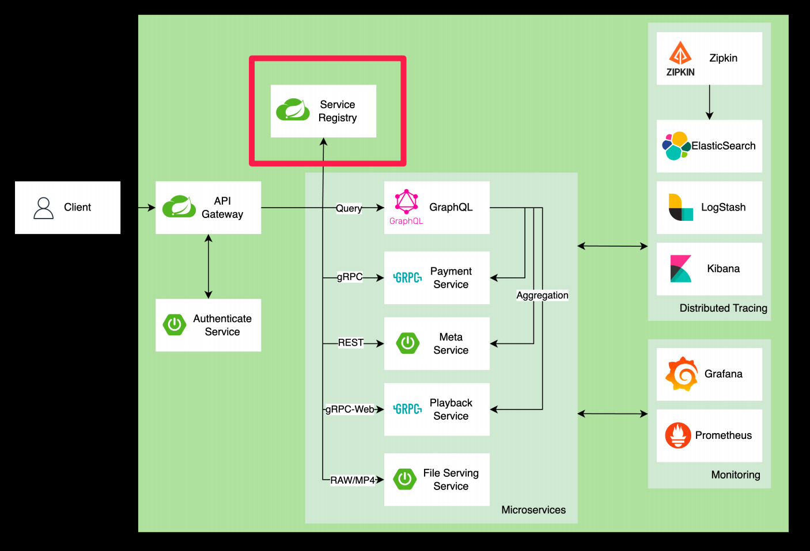

# API-gateway

[toc]


# API Gateway

애플리케이션과 백엔드 서비스간의 통신을 중개하는 역할

**API Gateway 패턴이 생기게 된 배경**

- API Gateway 패턴은 모놀리식 아키텍처의 한계를 극복하고 SOA 및 마이크로서비스의 발전을 수용하여 복잡한 서비스 간 통신을 단순화하고 중앙화
- RESTfUl API의 등장은 효울적인 HTTP 통신을 가능하게 하며, 마이크로서비스 아키텍처로의 전환을 가속화시켜 서비스 분리를 촉진 
- 클라우드 컴퓨팅의 성장과 함께 API Gateway는 인증, 로드 밸런싱 등의 기능을 통합하며 마이크로서비스 애플리케이션에 필수적인 구성 요소

**API Gateway 의 주요 특징**

- 애플리케이션의 개발과 운영을 간편화
- 서비스 간의 통합을 단순화 하고 중복을 방지
- 보안 및 모니터링을 통해 안전한 통신 환경을 제공

**API Gateway 의 주요 역할**

- 애플리케이션의 개발과 운영을 간편화
- 서비스 간의 통합을 단순화 하고 중복을 방지
- 보안 및 모니터링을 통해 안전한 통신 환경을 제공

## API Gateway 의 다양한 특징

- Backend For Frontend (BFF)
- 다양한 서비스 등록, 탐색 (Service Registry and Discovery)
- 외부 구성 저장소 (External Configuration Store)
- 마이크로서비스 인증/인가 (Authentication and Authorization)
- 장애 및 실패 처리를 위한 서킷 브레이커 (Circuit Breaker)
- 모니터링과 추적 (Monitoring and Tracing)
- 중앙화된 로그 집계 (Centralized Log Aggregation)

### API Gateway 의 다양한 특징 : Service Registry and Discovery

- 레지스트리: 서비스의 주소와 상태 정보를 중앙 관리하는 시스템.
- 디스커버리: 클라이언트가 레지스트리에서 서비스 정보를 조회하여 동적으로 서비스를 찾을 수 있는 메커니즘.




# API Gateway 사례

- Netflix: Zuul
  - 2018년 12월에 Maintenance Mode로 전환되어 신규 기능 개발 중단
  - Zuul2 또는 Spring Cloud Gateway로 전환
- Airbnb: Envoy Proxy (Service Mesh)
- Amazon: Amazon API Gateway
- Spring: Spring Cloud Gateway


# 프록시 서버

## 프록시 서버의 주요 역할 및 기능

- 중계 (Forwarding)
- 보안 (Security)
- 캐싱 (Caching)
- 프로토콜 변환 (Protocol Conversion)
- 로드 밸런싱 (Load Balancing)
- 압축 (Compression)
- SSL/TLS #/#| (SSL/TLS)

# API Gateway에서 인증 및 인가 처리 방법

## API Gateway에서 인증 (Authentication)

- 인증의 종류
  - 기본 인증(Basic Authentication)
  - 토큰 기반 인증(Token-based Authentication) 예: JWT (JSON Web Tokens)
  - OAuth, OpeniD Connect 같은 제3자 인증 방법론
- API Gateway에서의 역할
  - API 요청을 받을 때마다 요청자의 신원을 확인
  - 올바른 자격 증명 없이는 접근 불가능하도록 제한

API Gateway에서 인가 (Authorization)

- 인가의 종류
  - 역할 기반 접근 제어(RBAC: Role-Based Access Control)
  - 속성 기반 접근 제어(ABAC: Attribute-Based AccessControl)
  - 정책 기반 접근 제어(PBAC: Policy-Based AccessControl)
- API Gateway에서의 역할
  - 인증된 사용자의 요청에 대해 허용된 작업만 수행하도록 관리
  - 사용자의 역할과 권한에 따라 자원 접근을 제어

## API Cateway에서 인증 및 인가 구현을 위한 여러가지 패턴

- 직접 인증
- 백엔드로 토큰 전달
- 외부 인증 서비스
- Ap! 키 관리

### 직접 인증


### 토큰 전달


### : 외부 인증 서비스 사용


# 트래픽 제어

- 클라이언트로부터 오는 요청을 관리, 조절, 그리고 최적화하는 과정을 의미
- 서버 오버로드 방지, 서비스의 안정적인 운영, 그리고 사용자 요청에 대한 효율적인 처리 가능

트래픽 제어의 중요성

- 서비스 가용성 유지 : 과도한 트래픽으로 인한 서버 다운을 방지하여 서비스의 안정성 보장
- 성능 최적화 : 서비스의 응답 시간을 개선하여 최종 사용자에게 더 나은 경험을 제공
- 비용 최적화 : 리소스 사용을 최적화하여 클라우드 인프라 비용을 관리
- 보안 강화 : 악의적인 트래픽을 차단하여 시스템을 보호

## 트래픽 제어 여러가지 방법

- Rate Limiting: 특정 시간 동안 허용되는 요청의 수를 제한하여 과도한 요청을 방지
  - 일정 기간 동안에 서버로 들어오는 요청의 수를 제한
  - API Cateway는 
  - 사용자의 IP 주소, 
  - 사용자 계정, 
  - 토큰, 
  - API 엔드 포인트 등 다양한 기준으로 요청을 구분하고, 이들 각각에 대해 허용할 수 있는 요청의 최대 수를 설정
- Throtting: 서버의 부하가 증가할 때 요청 처리 속도를 자동으로 조절하여 서버가 과부하 상태에 이르는 것을 방지
  - 서버 부하에 따라 요청의 처리 속도를 동적으로 조절
  - 부하 감지
  - 부하에 따른 조절
  - 정상 상태 복구
- Load Balancing: 들어오는 트래픽을 여러 서버에 분산시켜 처리능력을 극대화하고 단일 실패 지점 제거
- Caching: 자주 요청되는 데이터를 임시로 저장하여 빠르게 응답할 수 있게 함

트래픽 제어 여러가지 방법 : Rate Limiting vs Throtting

- Rate Limiting은 주로 고정된 시간 동안 특정 사용자 또는 클라이언트로부터 허용되는 요청의 최대 수를 제한하는 데 초점
- Throtting은 시스템의 부하를 동적으로 관리하기 위해 요청의 처리 속도를 조절

## 트래픽 제어 구현 사례

### 트래픽 제어 구현 사례 : Rate Limiting

- Spring에서는 주로 인터셉터나 필터를 사용하여 Rate Limiting 구현
- 요청의 IP 주소나 사용자 ID를 기반으로 요청 수를 카운팅하고, 설정된 한계를 초과하는 경우 요청을 거부
- 관련 라이브러리
  - Bucket4j
  - Spring Cloud Gateway

### 트래픽 제어 구현 사례 : 다양한 Rate Limiting 알고리즘

- 고정 원도우 알고리즘(Fixed Window Algorithm)
  - 가장 단순한 Rate Limit 알고리즘
- 슬라이딩 로그 알고리즘(sliding Log Algorithm)
  - 윈도우 내에 있는 로그의 수를 계산하여 요청이 제한을 초과하는 지 판단
- 슬라이딩 윈도우 카운터 알고리즘(Sliding Window Counter Algorithm)
  - 고정 윈도우와 슬라이딩 로그의 장점 결합
- 토큰 버킷 알고리즘(Token Bucket Algorithm)
  - 일정한 속도로 토큰을 버킷에 추가, 버킷이 가득찬 경우 API 요청 버림
- 릭키 버킷 알고리즘(Leaky Bucket Algorithm)
  - 토큰 버킷과 비슷하지만, 고정큐로 FIFO로 구현

### 트래픽 제어 구현 사례 : Rate Limiting - Bucket4)

```java
import io.github.bucket4j.Bandwidth;
import io.github.bucket4j.Bucket;
import io.github.bucket4j.Bucket4j;
import io.github.bucket4j.Refill;
import org.springframework.stereotype.Component;
import org.springframework.web.servlet.HandlerInterceptor;

import javax.servlet.http.HttpServletRequest;
import javax.servlet.http.HttpServletResponse;
import java.time.Duration;
import java.util.Map;
import java.util.concurrent.ConcurrentHashMap;

@Component
public class RateLimitInterceptor implements HandlerInterceptor {

    private final Map<String, Bucket> buckets = new ConcurrentHashMap<>();

    @Override
    public boolean preHandle(HttpServletRequest request, HttpServletResponse response, Object handler) throws Exception {
        String ip = request.getRemoteAddr();
        Bucket bucket = buckets.computeIfAbsent(ip, this::createBucket);
        if (bucket.tryConsume(1)) { // 요청이 성공적으로 처리됨
            return true;
        } else { // 레이트 리밋에 도달했을 경우, HTTP 429 오류를 반환
            response.setContentType("text/plain");
            response.setStatus(HttpServletResponse.SC_TOO_MANY_REQUESTS);
            response.getWriter().append("Too many requests");
            return false;
        }
    }

    private Bucket createBucket() {
        // 시간당 100개의 요청을 허용하는 레이트 리밋 정책
        Bandwidth limit = Bandwidth.classic(100, Refill.greedy(100, Duration.ofHours(1)));
        return Bucket4j.builder().addLimit(limit).build();
    }
}

```

### 트래픽 제어 구현 사례 : Throtting

- 서버 부하를 조절하여 과부하를 방지하고, 시스템의 안정성을 보장하기 위함
- Spring에서 Throttling은 주로 서비스 또는 컨트롤러 레벨에서 구현되며, 요청의 처리량을 조절
- 관련 라이브러리
  - Resilience4j

```yaml
resilience4j:
  ratelimiter:
    instances:
      backendA:
        limitForPeriod: 10 # 주어진 기간 동안 허용되는 최대 요청 수
        limitRefreshPeriod: 1s # 제한 주기: 주어진 시간마다 요청 카운트가 초기화됨
        timeoutDuration: 0ms # 대기 시간: 요청이 제한될 경우 기다리는 시간 (0ms이면 대기 없이 실패)

```

```java
import io.github.resilience4j.ratelimiter.annotation.RateLimiter;
import org.springframework.stereotype.Service;

@Service
public class RateLimitedService {

    /**
     * This method is rate limited using the "backendA" configuration.
     * The rate limit is defined in the application.yml file.
     * 
     * @return A rate-limited response string.
     */
    @RateLimiter(name = "backendA")
    public String rateLimitedMethod() {
        return "This is a rate limited response";
    }
}
```

### 트래픽 제어 구현 사례 : Load Balancing - Spring Cloud LoadBalancer

- 들어오는 트래픽을 여러 서버에 분산시켜 전체 시스템의 처리 능력을 향상시키기 위함
- Spring Cloud에서는 서비스 레지스트리(예: Eureka)와 함께 Ribbon이나 Spring Cloud LoadBalancer를 사용하여 클라이언트 측 로드 밸런싱을 구현
- 관련 라이브러리
  - Spring Cloud LoadBalancer

```java
import org.springframework.beans.factory.annotation.Autowired;
import org.springframework.cloud.client.loadbalancer.LoadBalanced;
import org.springframework.context.annotation.Bean;
import org.springframework.context.annotation.Configuration;
import org.springframework.stereotype.Service;
import org.springframework.web.client.RestTemplate;

@Configuration
public class AppConfig {

    /**
     * Creates a LoadBalanced RestTemplate bean.
     * The LoadBalanced annotation ensures that the RestTemplate 
     * uses Ribbon for client-side load balancing.
     * 
     * @return A LoadBalanced RestTemplate instance.
     */
    @Bean
    @LoadBalanced
    public RestTemplate loadBalancedRestTemplate() {
        return new RestTemplate();
    }
}

@Service
public class ExampleService {

    @Autowired
    private RestTemplate restTemplate;

    /**
     * Calls a remote service using the provided service name.
     * The service URL is constructed using the service name and a fixed endpoint.
     * 
     * @param serviceName The name of the remote service to call.
     * @return The response from the remote service as a String.
     */
    public String callService(String serviceName) {
        String url = "http://" + serviceName + "/some-endpoint";
        return restTemplate.getForObject(url, String.class);
    }
}

```


# 로깅 및 모니터링

API Gateway에서 로깅의 중요성

- 트랜잭션 추적: API 호출의 전체 경로를 추적하여 문제 해결과 성능 최적화에 필요한 데이터 제공
- 보안 감사: 불법적인 접근 시도 및 잠재적 보안 취약점 감지
- 정책 위반 감지: API 사용 정책 위반 사항 기록 및 분석
- 사용 패턴 분석: API 사용 통계를 통한 비즈니스 인사이트 도출 및 서비스 개선

## API Gateway에서 로깅 방법

- 액세스 로그 : 모든 인바운드 요청과 아웃바운드 응답에 대한 정보를 기록
- 에러로그 : 시스템 에러, 경고, 예외 상황을 기록
- 트랜잭션 추적 : 분산 시스템에서 서비스 간의 호출 체인을 추적

## API Gateway에서 로깅 방법 : 액세스 로그

### 액세스 로그 주요 정보

1. **Timestamp**: 요청이 처리된 날짜와 시간
2. **Client IP**: 요청을 보낸 클라이언트의 IP 주소
3. **HTTP Method**: 요청의 HTTP 메소드 (GET, POST, PUT, DELETE 등)
4. **URL**: 요청된 리소스의 URL
5. **HTTP Response Code**: 요청에 대한 응답 코드 (예: 200, 404, 500 등)
6. **Response Time**: 서버가 요청을 처리하고 응답을 완료하는 데 걸린 시간
7. **User-Agent**: 요청을 보낸 클라이언트의 유저 에이전트 정보 (브라우저, 운영체제 등)

```
192.168.1.1 - - 12/Mar/2024:15:59:43 +0000 "GET /api/products HTTP/1.1" 200 532 " " "Mozilla/5.0 (Windows NT 10.0; Win64; x64) AppleWebKit/537.36 (KHTML, like Gecko) Chrome/58.0.3029.110 Safari/537.3"
```

###  로그 수집 및 분석 도구

- Nginx, Apache HTTP Server: 웹 서버는 기본적으로 액세스 로그를 생성, 로그 포맷을 사용자가 정의
- Amazon API Gateway: AWS의 API Gateway는 CloudWatch와 통합되어 액세스 로그를 수집하고 분석
- Kong, Tyk: 오픈 소스 API Cateway도 로깅 플러그인을 제공하여 액세스 로그를 기록하고, 필요에 따라 외부 로그 분석 시스템으로 전송

## API Gateway에서 로깅 방법 : 에러 로그

- 에러 로그 주요 정보
  - Timestamo: 에러가 발생한 날짜와 시간
  - Error Level: 에러의 심각도를 나타내는 레벨(예: ERROR, WARN, FATAL)
  - Error Message: 에러 설명 또는 메시지
  - Stack Trace: 에러가 발생한 시점의 호출 스택, 에러의 원인을 파악하는 데 유용
  - Service Name/ID: 에러가 발생한 서비스 또는 컴포넌트의 이름 또는 식별자
  - Additional Information: 요청 ID, 사용자 ID 등 에러 상황을 이해하는 데 도움이 되는 추가 정보

```
2024-03-22T16:03:27 +00:00 ERROR [product-service] "Failed to retrieve product details" exception="java.lang.NullPointerException" at="ProductService.getProductDetails:55" requestid="abc123" userId="user456"

```

###  에러 로그 수집 도구

- 내장 로깅 기능: 대부분의 API Gateway와 웹 서버는 기본적으로 에러 로깅 기능을 제공
- Sentry: 애플리케이션 모니터링 및 에러 추적을 위한 도구, 실시간으로 에러를 수집하고 분석
- Logstash: Elasticsearch, Logstash, Kibana(ELK) 스택의 일부로, 로그 데이터를 수집, 변환, 저장하고 분석할 수 있는 도구. Logstash를 사용하여 에러 로그를 중앙화하고, Kibana를 통해 시각화

## API Cateway에서 로깅 방법 : 트랜잭션 추적 로그

- 트랜잭션 추적 로그 주요 정보
- Trace ID: 전체 트랜잭션을 식별하는 유니크한 식별자. 하나의 요청 경로를 따라가며 발생하는 모든 이벤트는 동일한 Trace ID 공유
- Span ID: 특정 서비스 호출 또는 작업 단위를 식별하는 식별자
- Operation Name: 수행된 작업 또는 호출된 서비스의 이름
- Start Time / End Time: 각 Span의 시작 시간과 종료 시간
- Tags / Anotations: 요청의 메타데이터, HTTP 상태 코드, 에러 메시지 등 추가적인 정보를 제공

```json
{
  "traceId": "ac1d8f5e2a6e3a0b",
  "id": "b3d9f24251d89a26",
  "parentId": "ac1d8f5e2a6e3a0b",
  "name": "get /api/product/details",
  "timestamp": 1617700457000000,
  "duration": 250000,
  "annotations": [
    {
      "timestamp": 1617700457000000,
      "value": "endpoint",
      "endpoint": {
        "serviceName": "product-service",
        "ipv4": "192.168.1.123",
        "port": 8080
      }
    }
  ],
  "tags": [
    // Tags can be added here
  ]
}

```

### 트랜잭션 추적 로그 수집 도구

- Zipkin: Twritter에 의해 개발된 분산 추적 시스템으로, 서비스 간의 요청 흐름을 시각적으로 추적하고, 지연 시간을 분석할 수 있는 기능을 제공
- Jaeger: Uber에 의해 개발된 Jaeger는 분산 추적을 위한 오픈 소스 도구로, 트랜잭션과 서비스 간의 의존성을 시각화 하며. 성능과 모니터링을 위한 다양한 메트릭을 제공

## 분산 시스템에서 발생할 수 있는 일반적인 문제 유형

- 지연 시간 증가: 네트워크 지연, 서비스 오버로드, 비효율적인 데이터베이스 쿼리 등으로 인해 응답 시간이 증가할 수 있음
- 서비스 가용성 문제: 하드웨어 장애, 소프트웨어 버그, 네트워크 문제 등으로 특징 서비스가 실패하거나 접근 불가능해질 수 있음
- 잘못된 서비스 통신: 서비스 간의 의존성 오류, 잘못된 API 호출, 데이터 형식 불일치 등으로 인해 시스템이 예상대로 동작하지 않을 수 있음

## Spring 생태계에서 분산 추적 방법

- Spring Cloud Sleuth
- Zipkin


### Spring Cloud Sleuth

- Spring Cloud Sleuth는 분산 추적 정보를 자동으로 추가하여, 개발자가 분산 시스템 내에서 요청의 흐름을 쉽게 파악할 수 있도록 지원
- 요청이 서비스를 거칠 때마다 고유한 Trace ID를 생성하고, 각 서비스 호출(또는 작업 단위)에 대해 Span ID를 부여

#### Spring Cloud Sleuth : TracelD와 SpanID의 개념

- Trace ID
  - 분산 시스템 내에서 단일 비즈니스 트랜잭션을 식별하는 데 사용되는 고유 식별자
  - 하나의 요청이 여러 서비스를 통과할 때, 이 요청을 추적하기 위해 동일한 Trace ID가 사용
- Span ID
  - 특정 서비스 호출 또는 작업 단위를 식별하는 데 사용되는 고유 식별자
  - Span은 부모 Span의 자식이 될 수 있으며, 이를 통해 서비스 간 호출의 계층 구조를 나타냄


의존성 추가

```
org.springframework.cloud:spring-cloud-starter-sleuth
```

#### `application.yml` 설정 예시:

```
yaml
코드 복사
logging:
  pattern:
    level: "%5p [$(spring.application.name),%X{X-B3-TraceId},%X{X-B3-SpanId},%X{X-Span-Export}]"
```

### 3. 로그 메시지 예시

설정을 적용하면 다음과 같은 형식으로 로그 메시지가 출력됩니다:

```
less
코드 복사
2024-03-24 12:34:56.789 INFO [product-service,12bf5b55e82a46d1,12bf5b55e82a46d1,false] 12345 --- [main] c.e.product.ProductServiceApplication: Product details retrieved successfully
```

### 설명:

- **%5p**: 로그 레벨 (INFO, DEBUG, ERROR 등)
- **%X{X-B3-TraceId}**: Trace ID
- **%X{X-B3-SpanId}**: Span ID
- **%X{X-Span-Export}**: Span Export 여부 (boolean 값)
- **[main]**: 스레드 이름
- **c.e.product.ProductServiceApplication**: 로거 이름 (클래스명)
- **Product details retrieved successfully**: 로그 메시지


###  Zipkin

- Ziokin은 분산 시스템에서 서비스 간의 요청 추적을 위한 분산 추적 시스템
- 개발자가 마이크로서비스 아키텍처 내에서 요청의 흐름을 시각적으로 이해하고, 성능 문제를 진단할 수 있도록 설계

#### Zipkin 의 기본 원리 : 아키텍처와 구성요소

- 컬렉터(Collector)
  - 서비스로부터 추적 데이터를 수집하는 컴포넌트. HTTP, Kafka, RabbitMQ 등 다양한 방식으로 데이터를 수집
- 데이터베이스(Storage)
  - 수집된 추적 데이터를 저장하는 컴포넌트. Zipkin은 Cassandra, Elasticsearch, MySQL 등 여러 스토리지 옵션을 지원
- API
  - 저장된 추적 데이터에 접근하기 위한 RESTful API를 제공. 이 API를 통해 사용자는 특정 Trace ID를 조회하거나 서비스 간 호출 관계를 분석
- UI
  - 추적 데이터를 시각적으로 표현하는 웹 인터페이스

### sleuth와 Zijpkin 통합

- Sleuth는 애플리케이션에 추적 기능을 자동으로 추가 (SpaniD, TracelD)
- Zipkin은 이 추적 정보를 저장하고 시각화 하여 분석
- 통합 방법

```groovy
org.springframework.cloud:spring-cloud-starter-sleuth 
org.springframework.cloud:spring-cloud-starter-sleuth-zipkin
```

```yaml
spring:
  zipkin:
    base-url: http://localhost:9411  # Zipkin 서버의 기본 URL
  sleuth:
    sampler:
      probability: 1.0  # 샘플링 확률 (1.0은 모든 트레이스를 수집)
```

### 3. 설정 설명

- **spring.zipkin.base-url**: Zipkin 서버의 기본 URL을 설정합니다. 여기서는 로컬에 있는 Zipkin 서버를 가리킵니다.
- **spring.sleuth.sampler.probability**: 트레이스 샘플링 확률을 설정합니다. 1.0으로 설정하면 모든 요청을 샘플링합니다.

### Sleuth와 Zipkin을 사용한 문제 해결 방법

- 요청 흐름 추적
  - sleuth는 각 요청에 Trace ID와 Span ID를 부여하여, 분산 시스템을 통과하는 요청의 경로를 추적
  - Zipkin은 이 추적 정보를 시각화하여, 어느 서비스에서 지연이 발생했는지, 어느 경로를 통해 데이터가 흐르는지 쉽게 파악

- 성능 병목 진단
  - Zipkin UI를 통해 서비스 간의 호출 시간과 지연 시간을 분석함으로써 성능 병목 지점을 식별
- 에러 로그와 함께 추적 정보를 분석하여, 오류가 발생한 서비스와 그 원인을 정확하게 식별
- 응답 시간 모니터링
  - sleuth와 Zipkin을 지속적으로 사용하여 응답 시간을 모니터링하고, 성능 저하를 조기에 감지하여 대응

# BFF패턴

- "Backend For Frontend"
- 클라이언트(웹, 모바일, 웨어러블 등)에 최적화된 백엔드 서비스를 제공하는 아키텍처 패턴

- 다양한 클라이언트 요구사항
  - 다양한 클라이언트의 등장
  - 맞춤형 AP의 필요성
- 마이크로서비스 아키텍처에서의 다양한 요구사항
  - 서비스 간 통신의 복잡성
  - 다양한 클라이언트 요구사항에 대응

BFF패턴의 장점

- 프런트 요구사항과 백엔드 요구사항 분리
  - 프런트엔드의 요구 사항과 백엔드의 복잡성이 분리
  - 각각의 계층이 독립적으로 진화할 수 있도록 하여 유지보수를 용이하게 함
  - 웹 애플리케이션에서 복잡한 데이터 가공이 필요할 때, 이 로직을 BFF에 구현함으로써 프런트엔드 개발자는 데이터 표시에 집중할 수 있고, 백엔드 개발자는 데이터 처리와 관리에 초점을 맞출 수 있음
- 프런트엔드에서 더 나은 오류 처리
- 백엔드 서비스 공유하여 개발
- 보안 강화
- 구성 요소의 팀 소유권 공유

BFF패턴의 단점

- 코드 중복
- 운영 복잡성 증가
- 개발 및 유지보수 증가
- 리소스 사용량 증가
- API 게이트웨이와의 경계 모호
- 성능 오버헤드 발생 가능성