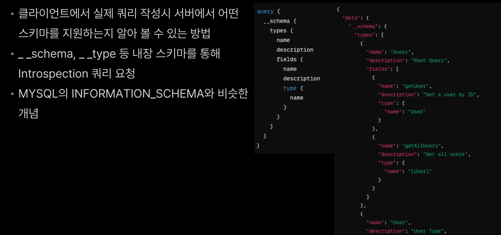
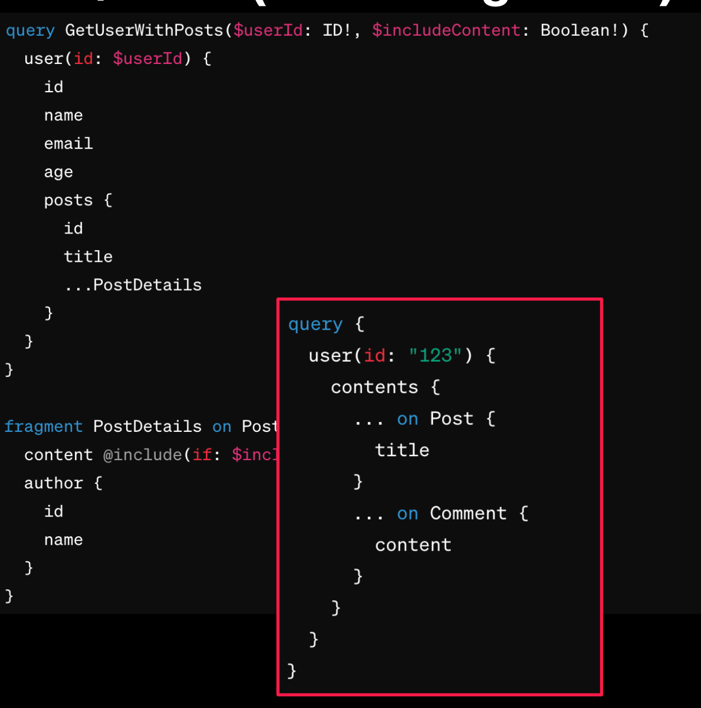

# GRaphQL

[toc]


GraphQL의 등장 배경

- REST API의 한계
- 오버페칭(Over-fetching)
- 언더페칭(Under-fetching)
- 복수의 엔드포인트 관리
- 프론트엔드와 백엔드 간의 간극

- 정확한 데이터 요청과 전달
- 단일 엔드포인트 사용
- 타입 시스템과 강력한 쿼리 언어
- 효율적인 데이터 로딩과 캐싱


## GraphQL의 주요 특징과 장점

- 클라이언트 중심의 쿼리
- 타입 시스템
- 단일 엔드 포인트
- Over Fetching 및 Under Fetching 방지
- 다양한 오픈소스 생태계


# GraphQL 스키마 구성요소

- 타입 정의 (Type Definitions)
  - 데이터 형식을 정의 하기 위함
- 쿼리 및 뮤테이션 정의 (Query and Mutation Definitions)
  - 데이터를 요청하거나 수정하기 위해 사용
- 디렉티브 (Directives)
  - 쿼리나 뮤테이션의 실행 방식을 제어하기 위한 지시자

## GraphOL 타입 시스템

- GraphQL은 타입 시스템을 통해 데이터의 형식을 정의
- 이러한 형식을 기반으로 쿼리와 뮤테이션을 수행할 수 있도록 지원
- 각 데이터 요소는 특정한 타입에 속하고, 타입은 그 타입에 대한 필드와 이를 해결하는 리졸버를 가지고 있음


GraphQL 타입의 종류

- 스칼라 타입 (Scalar Types)
- 객체 타입 (Object Types)
- 인터페이스 타입 (Interface Types)
- 유니온 타입 (Union Types)
- 열거형 타입 (Enum Types)
- 입력 객체 타입 (Input Object Types)

GraphQL 타입의 확장

- GraphQL은 스키마를 확장하고 수정하는 데 매우 유연한 구조
- 기존 타입에 필드 추가
- 기존 타입 확장하여 새로운 타입 생성

### 스칼라 타입 (scalar Types)

- 스칼라 타입은 GraphQL에서 가장 기본적인 타입으로, 단일 값을 나타냄
- 주요 타입
  - String
  - int
  - Float
  - Boolean
  - ID

### 객체 타입 (Object Types)

- GraphQL에서 데이터의 복잡한 구조를 나타내는 데 사용
- 데이터 모델의 핵심을 이루며, 필드들의 집합

```
type Profile {
userId: ID!
pictureUrl: String 
birthday: Date 
bio: String
}

type User {
  id: ID!
  username: String!
  email: String!
  posts: [Post!]!
  profile: Profile
}
```

### 인터페이스 타입 (Interface Types)

- 인터페이스 타입은 GraphQL에서 **공유되는 필드 집합**을 정의하는 데 사용
- 인터페이스를 구현하는 객체는 해당 인터페이스의 모든 필드를 구현

```
# Node 인터페이스 정의
interface Node {
  id: ID!
}

# User 타입 정의
type User implements Node {
  id: ID!
  username: String!
  email: String!
}

# Post 타입 정의
type Post implements Node {
  id: ID!
  title: String!
  content: String!
}
```

### 유니온 타입 (Union Types)

- 유니온 타입은 두 개 이상의 타입 중 하나일 수 있는 값
- 유니온 타입을 사용하면 서로 다른 타입의 값들을 하나의 필드로 표현

```
union SearchResult = Product | Coupon
```


### 열거형 타입 (Enum Types)

- GraphQL에서 특정한 집합의 값 중 하나일 수 있는 타입
- 요일(Day of the week)이나 월(Month)과 같은
- 값들은 열거형 타입으로 정의

```
enum PostStatus {
	PUBLISHED
	DRAFT
	DELETED
}

type Post {
id: ID!
title: String!
content: String!
status: PostStatus!
}
```

### 입력 객체 타입 (Input Object Types)

- 입력 객체 타입은 입력 매개변수로 사용되는 복합타입
- 쿼리나 뮤테이션에서 매개변수로 전달되는 데이터의 구조를 정의할 때 사용

```
input CreateUserInput {
	username: String!
	email: String!
	password: String!
	age: Int
}

type Mutation {
	createUser (input: CreateUserInput!): User!
}
```

### List와  Non-Null

- List : 배열 형태의 데이터
- Non-Null: 필드가 Nul 허용하지 않음을 나타냄

```
type User {
  id: ID!
  username: String! emails: [String!]!
  posts: [Post]
}

type Query {
  # 모든 사용자 목록을 반환합니다. 각 사용자는 null일 수 없습니다.
  users: [User!]!

  # 특정 사용자를 ID로 검색합니다. 검색 결과는 null일 수 있습니다.
  user(id: ID!): User

  # 모든 게시물 목록을 반환합니다. 각 게시물은 null일 수 없습니다.
  posts: [Post!]!

  # 특정 게시물을 ID로 검색합니다. 검색 결과는 null일 수 있습니다.
  post(id: ID!): Post
}

type User {
  # 사용자의 고유 식별자. null이 될 수 없습니다.
  id: ID!

  # 사용자의 사용자 이름. null이 될 수 없습니다.
  username: String!

  # 사용자의 이메일 주소. null이 될 수 없습니다.
  email: String!

  # 사용자가 작성한 게시물 목록. 게시물 자체는 null이 될 수 없지만, 사용자는 게시물을 작성하지 않을 수 있습니다.
  posts: [Post!]!
}

type Post {
  # 게시물의 고유 식별자. null이 될 수 없습니다.
  id: ID!

  # 게시물의 제목. null이 될 수 없습니다.
  title: String!

  # 게시물의 내용. null이 될 수 있습니다.
  content: String
}
```


## Graphql 스키마 확장 (Schema Extension

- 스키마 확장의 목적
  - 새로운 기능을 추가하고 데이터 모델을 확장하여 애플리케이션의 요구 사항을 충족
  - 변경된 요구 사항에 대응하여 기존 기능을 수정하거나 보완
- 확장 방법
  - 새로운 타입 추가
  - 기존 타입 확장 - 필드를 추가 


### 사용자 정의 스키마 타입 (Custom Scalar Types) 정의 방법 - ex) VO, 이메일

```
//사용자 정의 스칼라 타입을 추가한 GraphaL 스키마 생성
GraphQLObjectType queryType = GraphQLObjectType.newobject()
	.name("Query")
	.field(field -> field.name ( "email")
	.type(Extendedscalars.Ema11) // 사용자 정의 스칼라 타입 (이메일) 추가
	.dataFetcher (environment -> "example@example.com" ))
.build();
```


# Graphql 쿼리 작성 

- GraphQL 쿼리는 클라이언트가 서버로 보내는 요청
- 클라이언트는 필요한 데이터를 명시적으로 요청하고, 서버는 해당 데이터를 제공


## 쿼리 작성을 위한 기본 구문

- {} 중괄호 내에 작성
- 필드와 필드의 하위 필드로 구성
- 각 필드는 해당 필드에서 반환해야 하는 데이터를 나타냄

```
{
  user {
    id
    name
    email
    address {
      city 
      country
    }
  }
}
```

## GraphQL 서버 스키마 확인 방법 (Introspection Query)

##  GraphOL 쿼리 구성 요소

- 필드 (Fields)
- 인수 (Arguments)
- 별칭 (Alias)
- 변수 (Variables)
- 프래그먼트 (Fragments)
- 인라인 프래그먼트 (Inline Fragments)
- 디렉티브 (Directives)

### 필드

- GraphQL 쿼리의 기본 구성 요소
- 데이터를 요청하는 데 사용
- 필드는 객체 타입의 속성이나 스칼라 값이 될 수 있음

### GraphQL 쿼리 구성 요소 : 인수

- 쿼리 필드에 전달되는 매개변수로, 필드의 동작을 제어하는 데 사용
- 필드와 함께 사용되며, 필드 이름 뒤에 괄호로 감싸여 전달


### 별칭 (Alias)

- 필드에 별칭을 지정하여 쿼리 결과에서 필드를 식별할 때 사용
- 별칭을 사용하여 서로 다른 필드에 동일한 이름을 부여 가능
- 동일한 필드를 여러 번 요청할 때
- 서로 다른 필드에 동일한 이름을 사용할 때

### 변수 (Variables)


### 프래그먼트 (Fragments)

- 쿼리에서 중복되는 필드 집합을 재사용할 수 있도록 도와줌
- 필드의 그룹을 정의하고, 여러 곳에서 해당 프래그먼트를 참조하여 중복을 최소화


### 인라인 프래그먼트 (Inline Fragments)

- 특정 타입의 필드를 포함하는 쿼리를 작성할 수 있도록 함
- 인터페이스나 유니온 타입과 함께  사용되어 특정 타입을 처리하는 데 유용함



### 디렉티브 (Directives)

- 쿼리나 스키마 정의에 메타데이터를 추가하고 동적으로 동작을 변경하는 데 사용
- @ 기호로 시작하며, 필드나 프래그먼트에 | 적용될 수 있음


# 타입 Resolver

## 내부 타입 (Internal Types) 소개

- 사용자 정의 객체 타입(User-defined Object Types)
  - 개발자가 직접 정의한 데이터 구조
  - 사용자(User), 포스트(Post), 댓글(Comment) 등
- 내장 스칼라 타입(Buit-in Scalar Types)
  - GraphQL에서 기본적으로 제공되는 데이터 유형
  - 문자열(String), 정수(Int), 부동 소수점(Float), 부울(Boolean), ID

### 내부 타입 (Internal Types) 정의 방법

- 내부 타입 정의 방법
  - SDL(Schema Definition Language)을 사용하여 정의
- 객체 타입
  - 필드와 해당 필드를 해결하는 리졸버 함수로 구성
- 내장 스칼라 타입
  - 사전 정의된 타입으로, 추가 작업 없이 사용 가능

## 리졸버 (Resolver) 개념 소개

- 리졸버란 GraphQL 스키마에 정의된 필드가 실제로 어떻게 해결되는지를 정의하는 함수
- 각 필드는 해당 필드를 해결하는 리졸버 함수를 가지며, 데이터를 검색하거나 가공하여 반환
- 리버 함수는 필드가 호출될 때마다 실행되어 해당 필드의 값을 반환


## 리졸버 (Resolver)의 종류 : DataFetcher

- GraphOL 스키마의 필드에 대한 데이터를 가져오는 역할
- 각각의 필드에 대해 개별적으로 정의되며, 해당 필드가 해결될 때마다 실행
- 간단한 데이터 로딩에 유용하며, 각 필드에 대한 개별적인 데이터 로딩 로직을 정의


## 리졸버 (Resolver)의 종류 : DataLoader

- DataLoader는 DataFetcher와 달리 배치(batch)로 데이터를 가져오는 데 사용
- 여러 필드에서 동일한 데이터에 대한 중복 요청을 최소화하고, 데이터 로딩의 성능을 향상시키는 데 유용함
- 데이터 로딩의 성능을 향상시키기 위해 캐싱과 배치 처리를 지원

```java
public class DataLoaderExample {

    // Define the BatchLoader
    BatchLoader<Long, User> userBatchLoader = new BatchLoader<Long, User>() {
        @Override
        public CompletionStage<List<User>> load(List<Long> userIds) {
            return CompletableFuture.supplyAsync(() -> {
                // Batch Loading Logic
                return userManager.loadUsersById(userIds);
            });
        }
    };

    // Create the DataLoader
    DataLoader<Long, User> userLoader = DataLoaderFactory.newDataLoader(userBatchLoader);
}
```

## 리졸버 (Resolver)사용 시 유의할 점: DataFetcher와 N+1 문제

- N+1 문제
  - 데이터베이스나 다른 데이터 소스에서 데이터를 가져올 때, . 여러 개의 요청이 발생하여 불필요한 중복 작업이 발생하는 문제
- GraphQL에서 N+1 문제
  - GraphQL에서는 클라이언트가 요청한 필드에 대한 데이터를 가져오기 위해 리졸버 함수를실행
  - 각 필드마다 리졸버 함수가 실행되는데, 이때 N+1 문제 문제가 발생

### DataFetcher와 N+1 문제 해결

*  DataLoader 사용: DataLoader를 사용하여 중복된 요청을 최소화하고 데이터를 배치 처리

* Data Prefetching; 필요한 데이터를 미리 가져와 캐시에 저장하여 요청 시에 캐시된 데이터를 사용하여 N+1 문제를 방지


# 쿼리와 뮤테이션의 차이

## GraphQL 쿼리(Query)

- GraphQL 쿼리는 데이터를 읽는 데 사용
- 주로 서버로부터 데이터를 가져오는 작업에 사용
- 쿼리는 클라이언트가 서버로부터 필요한 데이터를 정확하게
   지정하여 요청할 수 있도록 함
- 쿼리는 일반적으로 읽기 전용 작업에 사용되며, 서버의 상태를 변경시키지 않음

## GraphaL 뮤테이션(Mutation)

- GraphQL 뮤테이션은 데이터의 변경을 위해 사용
- 주로 새로운 데이터를 생성하거나 기존 데이터를 수정 또는 삭제하는 작업에 사용
- 쿼리와 마찬가지로 요청된 데이터를 정확하게 지정할 수 있으나, 데이터 변경을 위한 타입이므로 서버의 상태를 변화 시킴
- 클라이언트가 서버에 작용하여 서버의 상태를 변경시키는 것을 허용

## GraphQL 쿼리와 뮤테이션 사용시 유의점

- 데이터의 읽기와 쓰기
  - 쿼리는 주로 데이터의 읽기에 사용되고, 뮤테이션은 데이터의 쓰기(수정 또는 생성)에 사용
  - 쿼리는 데이터를 읽는 데에만 사용되므로 실행 시에 서버의 상태에 영향을 주지 않음
  - 뮤테이션은 데이터를 변경하기 때문에 실행 시에 변경이 예상되는 사이드 이펙트를 고려 필요
- 병렬 실행 vs. 순차 실행
- 캐싱(Caching)
  - 쿼리는 주로 캐싱되며, 이전에 요청한 데이터를 재사용하여 서버 부하를 줄이고 응답 시간을 단축
  - 뮤테이션은 데이터 변경을 요청하므로 캐싱되지 않고, 항상 최신 데이터를 요청하고 업데이트
  - 뮤테이션은 쿼리에 비해 성능이 다소 낮을 수 있으며, 캐시 만료 정책을 신중하게 설정해야 함
- 보안과 권한
  - 뮤테이션은 데이터의 변경을 요청하기 때문에 쓰기 작업을 수행할 때 적절한 권한이 있는지 검사
  - 보안과 권한을 위해 챙겨야 하는 점
  - 권한 관리, 인증과 권한 부여
  - 보안 정책 적용


## 쿼리 작성 예제

GraphQL 스키마 정의

데이터 모델 및 서비스 생성

GraphQL 리졸버 생성

SpringBoot 애플리케이션 설정

### GraphQL 스키마 정의

GraphQL 스키마는 데이터 그래프의 구조를 정의하고, 클라이언트에서 요청할 수 있는 데이터를 명시합니다.

**schema.graphqls**

```graphql
type User {
    id: ID!
    name: String!
    email: String!
    age: Int
    address: Address
}

type Address {
    city: String
    country: String
}

type Query {
    user(id: ID!): User
}
```

### 데이터 모델 및 서비스 생성

`User`와 `Address` 클래스를 생성하고, 사용자 정보를 제공하는 `UserService` 클래스를 생성합니다.

**User.java**

```java
import lombok.AllArgsConstructor;
import lombok.Data;
import lombok.NoArgsConstructor;

@Data
@AllArgsConstructor
@NoArgsConstructor
public class User {
    private String id;
    private String name;
    private String email;
    private Integer age;
    private Address address;
}
```

**Address.java**

```java
import lombok.AllArgsConstructor;
import lombok.Data;
import lombok.NoArgsConstructor;

@Data
@AllArgsConstructor
@NoArgsConstructor
public class Address {
    private String city;
    private String country;
}
```

**UserService.java**

```java
import org.springframework.stereotype.Service;

@Service
public class UserService {
    public User getUserById(String id) {
        // 데이터베이스 또는 외부 소스에서 사용자 정보를 가져오는 로직을 구현
        return new User("123", "John Doe", "john@example.com", 30, new Address("New York", "USA"));
    }
}
```

### GraphQL 리졸버 생성

`QueryResolver` 클래스를 생성하여 GraphQL 쿼리를 처리합니다.

**QueryResolver.java**

```java
import com.coxautodev.graphql.tools.GraphQLQueryResolver;
import org.springframework.beans.factory.annotation.Autowired;
import org.springframework.stereotype.Component;

@Component
public class QueryResolver implements GraphQLQueryResolver {
    
    @Autowired
    private UserService userService;

    public User user(String id) {
        return userService.getUserById(id);
    }
}
```

### Spring Boot 애플리케이션 설정

Spring Boot 애플리케이션을 구성하고 GraphQL을 설정합니다.

**Application.java**

```java
import org.springframework.boot.SpringApplication;
import org.springframework.boot.autoconfigure.SpringBootApplication;
import org.springframework.context.annotation.Bean;
import com.coxautodev.graphql.tools.SchemaParser;
import graphql.schema.GraphQLSchema;

@SpringBootApplication
public class Application {
    public static void main(String[] args) {
        SpringApplication.run(Application.class, args);
    }

    @Bean
    public GraphQLSchema graphQLSchema(QueryResolver queryResolver) {
        return SchemaParser.newParser()
                .file("schema.graphqls")
                .resolvers(queryResolver)
                .build()
                .makeExecutableSchema();
    }
  
  @Bean // or
	public GraphQLSchema graphQLSchema(QueryResolver queryResolver) {
		return new GraphQLSchemaGenerator()
						.withOperationsFromSingleton(queryResolver)
						.generate();

}
```


## Mutation 예제

주어진 코드를 수정하고 정리하여 GraphQL Mutation을 구현하는 예제를 완성하겠습니다. 이 예제는 사용자 생성(CreateUser) 기능을 포함하며, GraphQL 스키마 정의, 데이터 모델 및 서비스 생성, Mutation 리졸버 생성, 그리고 Spring Boot 애플리케이션 설정을 포함합니다.

### GraphQL 스키마 정의

GraphQL 스키마에서 `Mutation` 타입과 입력 타입 `CreateUserInput`을 정의합니다.

**schema.graphqls**

```graphql
type User {
    id: ID!
    username: String!
    email: String!
    age: Int
    address: Address
}

type Address {
    city: String
    country: String
}

type Query {
    user(id: ID!): User
}

type Mutation {
    createUser(input: CreateUserInput!): User!
}

input CreateUserInput {
    username: String!
    email: String!
    password: String!
}
```

### 데이터 모델 및 서비스 생성

`CreateUserInput`과 `User` 클래스를 생성하고, 사용자 생성 로직을 구현한 `UserService` 클래스를 생성합니다.

**CreateUserInput.java**

```java
import lombok.AllArgsConstructor;
import lombok.Data;
import lombok.NoArgsConstructor;

@Data
@AllArgsConstructor
@NoArgsConstructor
public class CreateUserInput {
    private String username;
    private String email;
    private String password;
}
```

**User.java**

```java
import lombok.AllArgsConstructor;
import lombok.Data;
import lombok.NoArgsConstructor;

@Data
@AllArgsConstructor
@NoArgsConstructor
public class User {
    private String id;
    private String username;
    private String email;
    private Integer age;
    private Address address;
}
```

**Address.java**

```java
import lombok.AllArgsConstructor;
import lombok.Data;
import lombok.NoArgsConstructor;

@Data
@AllArgsConstructor
@NoArgsConstructor
public class Address {
    private String city;
    private String country;
}
```

**UserService.java**

```java
import org.springframework.stereotype.Service;
import java.util.UUID;

@Service
public class UserService {

    public User createUser(CreateUserInput input) {
        // 새로운 사용자 생성 로직 구현 (예: 데이터베이스 저장)
        // 여기서는 단순히 ID를 생성하고 입력 데이터를 반환합니다.
        return new User(UUID.randomUUID().toString(), input.getUsername(), input.getEmail(), null, null);
    }
}
```

### GraphQL Mutation 리졸버 생성

Mutation 리졸버를 생성하여 `createUser` Mutation을 처리합니다.

**MutationResolver.java**

```java
import com.coxautodev.graphql.tools.GraphQLMutationResolver;
import org.springframework.beans.factory.annotation.Autowired;
import org.springframework.stereotype.Component;

@Component
public class MutationResolver implements GraphQLMutationResolver {

    @Autowired
    private UserService userService;

    public User createUser(CreateUserInput input) {
        return userService.createUser(input);
    }
}
```

### Spring Boot 애플리케이션 설정

Spring Boot 애플리케이션을 구성하고 GraphQL을 설정합니다.

**Application.java**

```java
import org.springframework.boot.SpringApplication;
import org.springframework.boot.autoconfigure.SpringBootApplication;
import org.springframework.context.annotation.Bean;
import com.coxautodev.graphql.tools.SchemaParser;
import graphql.schema.GraphQLSchema;

@SpringBootApplication
public class Application {
    public static void main(String[] args) {
        SpringApplication.run(Application.class, args);
    }

    @Bean
    public GraphQLSchema graphQLSchema(QueryResolver queryResolver, MutationResolver mutationResolver) {
        return SchemaParser.newParser()
                .file("schema.graphqls")
                .resolvers(queryResolver, mutationResolver)
                .build()
                .makeExecutableSchema();
    }
   
  @Bean
	public GraphQLSchema graphQLSchema(QueryResolver queryResolver, MutationResolver
																mutationResolver) {
				return new GraphQLSchemaGenerator ()
									.withOperationsFromSingletons(queryResolver,mutationResolver)
									.generate();
  }
}
```

### 전체 코드 요약

1. **GraphQL 스키마 정의**:
    - `schema.graphqls` 파일에서 `Mutation`과 입력 타입 `CreateUserInput`을 정의합니다.

2. **데이터 모델 및 서비스 생성**:
    - `CreateUserInput`, `User`, `Address` 클래스를 정의합니다.
    - `UserService`에서 사용자 생성 로직을 구현합니다.

3. **GraphQL Mutation 리졸버 생성**:
    - `MutationResolver`에서 `createUser` Mutation을 처리합니다.

4. **Spring Boot 애플리케이션 설정**:
    - `Application` 클래스에서 GraphQL 스키마를 설정하고, 리졸버를 등록합니다.

이렇게 구성된 Spring Boot 애플리케이션을 실행하면, GraphQL API를 통해 사용자를 생성할 수 있는 기능이 제공됩니다.


# 복잡한 쿼리와 중첩된 필드 

커머스 플랫폼의 데이터 모델

- 사용자 (User)
- 제품 (Product)
- 주문 (Order)
- 결제 (Payment)
- 배송 (Shipment)

## 커머스 플랫폼의 데이터 모델 : 스키마 정의


## 커머스 플랫폼의 데이터 모델 : 유저 스키마 Interface 확장


## 커머스 플랫폼의 데이터 모델 : 복잡한 쿼리 예시 1

- GetOrderAndPaymentDetails
- 특정 주문과 관련된 제품 및 배송 주소 정보를 가져오는 GraphQL 쿼리

```
query GetOrderAndPaymentDetails {
  order(id: "123") {
    id
    orderDate
    totalPrice
    products {
      ...ProductDetails
    }
    shippingAddress {
      ...AddressDetails
    }
  }
}

fragment ProductDetails on Product {
  id
  name
  price
}

fragment AddressDetails on Address {
  street
  city
  country
}

```

## 커머스 플랫폼의 데이터 모델 : 복잡한 쿼리 예시 2

- GetCustomerOrderHistory
- 특정 주문과 관련된 제품 및 배송 주소 정보를 가져오는 GraphQL 쿼리

```
query GetCustomerOrderHistory {
  user(id: "456") {
    id
    orders {
      id
      orderDate
      totalPrice
      products {
        ...ProductDetails
      }
    }
  }
}

fragment ProductDetails on Product {
  id
  name
  price
}

```

## 커머스 플랫폼의 데이터 모델 : 복잡한 쿼리 예시 3

- GetOrderAndPaymentWithInterface
- 주문 및 결제 정보를 가져올 때, 인터페이스를 사용하여 다양한 결제 방법에 대한 정보를 처리

```
query GetOrderAndPaymentWithInterface {
  order(id: "123") {
    id
    orderDate
    totalPrice
    products {
      ... on Product {
        id
        name
        price
      }
    }
    payment {
      ... on Payment {
        id
        amount
        status
      }
      ... on CreditCardPayment {
        cardNumber
        expiryDate
      }
      ... on BankTransferPayment {
        accountNumber
      }
    }
  }
}

```


# GraphQL 보안

- 인증(Authentication)
- 권한 부여(Authorization)
- 쿼리 및 뮤테이션 검증
- 보안 이벤트 및 로깅
- 보안 업데이트 및 버전 관리

## GraphQL 보안 개요 : 인증 (Authentication)

- 클라이언트가 GraphQL 쿼리를 실행하기 전에 먼저 인증되어야 함
- 보안 토큰, 세션, 또는 기타 인증 수단을 사용하여 수행될 수 있음
- 주요 인증 방법
- JWT(Json Web Tokens)
- OAuth

*  **GraphQL 리졸버에서 권한 검사를 수행하여 해당 리소스에 대한 접근 권한을 확인**

## GraphQL 보안 개요 : 쿼리 및 뮤테이션 검증

- 입력 유효성 검사
- 권한 검사
- 쿼리 구조 검사

GraphQL 인증과 권한 구현 방법

- Spring security 활용
- GraphQL Directive 활용

```java
@Configuration
@EnableWebSecurity
@EnableGlobalMethodSecurity(prePostEnabled = true, securedEnabled = true)
public class SecurityConfig extends WebSecurityConfigurerAdapter {

    @Override
    protected void configure(HttpSecurity http) throws Exception {
        http
            .csrf().disable()
            .authorizeRequests()
                .antMatchers("/graphql").authenticated()
                .and()
            .httpBasic();
    }

    @Bean
    public UserDetailsService userDetailsService() {
        User.UserBuilder userBuilder = User.builder();
        UserDetails fast = userBuilder
            .username("fast")
            .password(passwordEncoder().encode("campus"))
            .roles("USER")
            .build();
        return new InMemoryUserDetailsManager(fast);
    }

    @Bean
    public PasswordEncoder passwordEncoder() {
        return new BCryptPasswordEncoder();
    }
}

```

특정  Query 또는  Mutation에만 적용하는법 

```java
@Component
public class MyGraphQLDataFetcher implements GraphQLQueryResolver {

    @PreAuthorize("hasRole('USER')")
    public String sensitiveQuery() {
        return "Sensitive Data";
    }
}
```

Spring security 와 GraphQL Directive 활용

*  전체 /graphql endpoint를 허용하고, 특정 Query 또는 Mutation에 Directive를 적용하는 방법

```java
public class AuthenticationDirective implements SchemaDirectiveWiring {

    @Override
    public GraphQLFieldDefinition onField(SchemaDirectiveWiringEnvironment<GraphQLFieldDefinition> environment) {
        GraphQLFieldDefinition fieldDefinition = environment.getElement();
        GraphQLObjectType parentType = environment.getFieldsContainer();

        // 원래의 DataFetcher를 가져옵니다.
        DataFetcher<?> originalDataFetcher = environment.getCodeRegistry().getDataFetcher(parentType, fieldDefinition);

        // 인증 검사를 수행하는 새로운 DataFetcher를 생성합니다.
        DataFetcher<?> authDataFetcher = (DataFetchingEnvironment dataFetchingEnvironment) -> {
            // 현재 인증 정보를 확인합니다.
            Authentication authentication = SecurityContextHolder.getContext().getAuthentication();

            // 사용자가 인증되었는지 확인합니다.
            if (authentication == null || !authentication.isAuthenticated() || "anonymousUser".equals(authentication.getPrincipal())) {
                // 사용자가 인증되지 않았다면 예외를 던집니다.
                throw new IllegalAccessException("Access Denied - Authentication required");
            }

            // 사용자가 인증되었다면 원래의 DataFetcher로 데이터를 가져옵니다.
            return originalDataFetcher.get(dataFetchingEnvironment);
        };

        // 변경된 DataFetcher를 등록합니다.
        environment.getCodeRegistry().dataFetcher(parentType, fieldDefinition, authDataFetcher);

        return fieldDefinition;
    }
}
```

```scheme
directive @auth on FIELD_DEFINITION

type Query {
    # for test
    getVersion: String
    
    # Author
    getAllAuthors: [Author] @auth
}

type Author {
    id: ID!
    name: String!
}
```


## GraphaL 보안 개요 : 보안 이벤트 및 로깅

- 인증 및 권한 부여 이벤트
- 보안 위협 감지
- 액세스 로깅
- 오류 및 예외 로깅
- 보통 GraphQL Instrumentation 을 사용하여 구현


## GraphQL 보안 개요 : 보안 업데이트 및 버전 관리

- 보안 업데이트 관리
- 스키마 및 리졸버 변경 버전 관리


## GraphQL 보안 관련 예제 및팁

- Query 타임아웃 적용
- Query 요청 제한
- 복잡도 (Complexity)
- #O| (Depth)
- 길이 (Length)
- Query Whitelist 활용


### 타임아웃

- 악의적인 사용자나 잘못된 요청으로 인해 서버가 과도하게부하되는 것을 방지
- Directive 구현 또는 TimeoutInstrumentation 활용

```
type Query {
    expensiveQuery: [ExpensiveType!]! @timeout(ms: 3000)
}
```

```
@Bean
public QueryTimeoutInstrumentation queryTimeoutInstrumentation() {
	return new QueryTimeoutInstrumentation(3000);
}
```

### Query 요청 제한

- Query Complexity 제한
- Query Depth 제한
- Query 길이 제한

```java
GraphQL.newGraphQL(schema)
.instrumentation (new MaxQueryDepthInstrumentation (4))
.build();

GraphOL.newGraphQL(schema)
.instrumentation(new MaxQueryComplexityInstrumentation(10))
  .build();
```

- Query Complexity 계산 방법
- 필드의 복잡성
- 중첩된 객체의 수
- 쿼리 인자수
- 쿼리의 연산 량

```java
public class QueryComplexityCalculatorProvider {

    private QueryComplexityCalculator newQueryComplexityCalculator(ExecutionContext executionContext) {
        return QueryComplexityCalculator.newCalculator()
                .fieldComplexityCalculator(fieldComplexityCalculator)
                .schema(executionContext.getGraphQLSchema())
                .document(executionContext.getDocument())
                .operationName(executionContext.getExecutionInput().getOperationName())
                .variables(executionContext.getCoercedVariables())
                .build();
    }

    // Dummy field complexity calculator for demonstration purposes
    private final QueryComplexityCalculator.FieldComplexityCalculator fieldComplexityCalculator = (env, childComplexity) -> 1 + childComplexity;
}
```


# Graphql 문서화

- Voyager 연동
  - https://graphql-kit.com/graphql-voyager/
- GraphQL Playground 연동
  - https://github.com/graphql/graphql-playground
  - http://localhost:8080/graphiql?path=/graphql


PlayGround에 Authorization 헤더 넣는법

Click HTTP Header and add your token as shown below:

```
{
  "Authorization": "Bearer YOUR_TOKEN_HERE"
}
```
