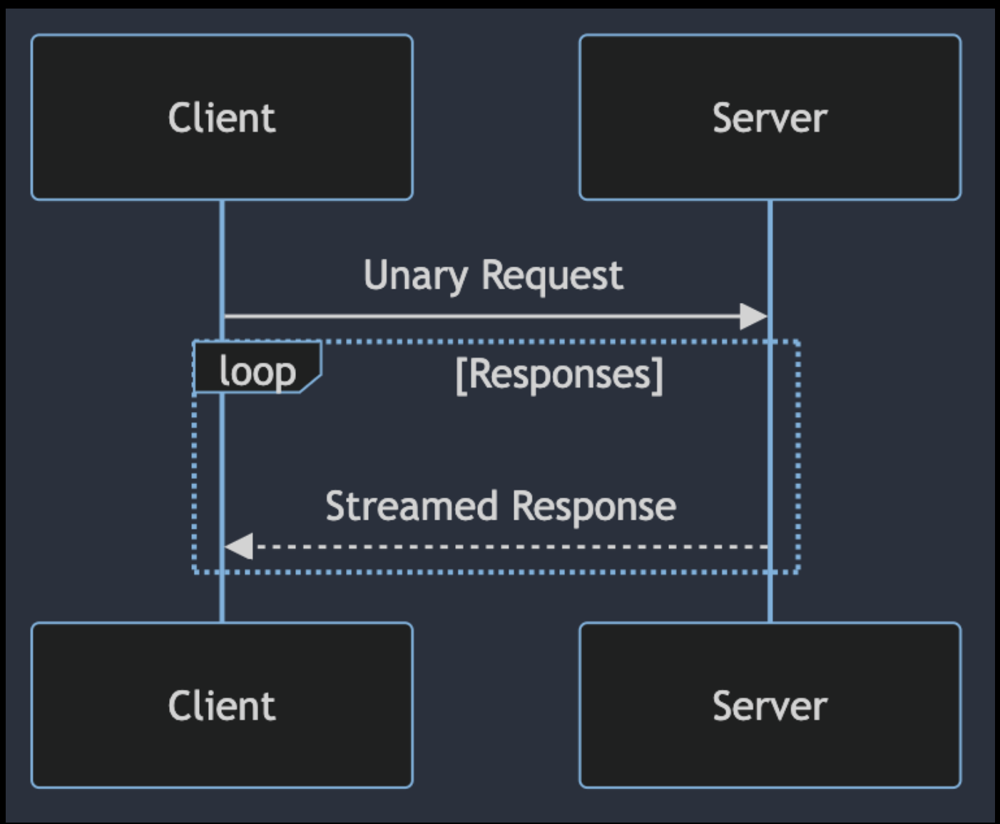
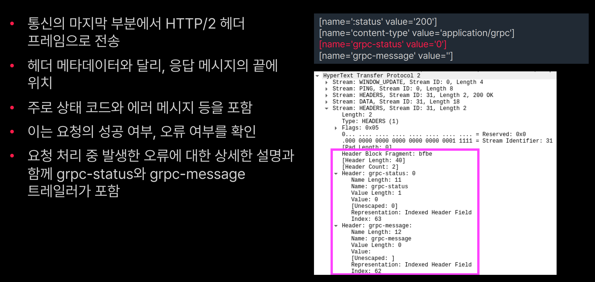

# GRPC

gRPC의 등장 배경

*  마이크로서비스의증가
*  분산시스템의 증가
*  효율적이고 강력한 시스템간 통신방법을 제공하기위해 개발


RPC(Remote Procedure Call) 란?

- 원격 프로시저 호출 (Remote Procedure Cal)
- 클라이언트가 네트워크를 통해 다른 서버에 있는 함수(프로시저)를 로컬에서 실행하는 것 처럼 호출 할수 있게 하는 통신방식


**Protocol Buffers**

- gRPC는 Protocol Buffers, 일명 protobuf를 사용
- 프로토콜 버퍼는 데이터를 직렬화 하기 위한 유연하고 효율적이며 자동화 된 메커니즘
- XML보다 작지만 더 빠르고 단순
- 다양한 데이터 스트림에서 다양한 언어로 다양한 구조의 데이터를 쉽게 읽고 쓸 수 있음


GRPC 개념 이해 : 클라이언트- 서버 아키텍처

- 클라이언트-서버 아키텍처 사용
- 클라이언트는 원하는 서비스의  메소드 호출
- 서버는 요청을 받아 처리한 후 클라이언트에게 전달


주요 특징 및 장점

- 고성능
  - HTTP/2 프로토콜 사용
  - 낮은 지연시간과 높은 처리량

- 강력한 인터페이스 정의
  - Protocol Buffers를 사용하여 API 정의
  - 작은 메시지 크기, 빠른 직렬화/역직렬화 속도 제공
- 스트리밍 지원
  - 서버-클라이언트 간의 양방향 스트리밍 지원
- 보안
  - 기본적으로 SSL/TLS통한 보안 연결을 지원

gRPC 사용 사례

- 마이크로 서비스간 통신
- 클라우드 기반 애플리케이션
- 멀티 플랫폼 서비스 (웹, 모바일 등)
- 실시간 데이터 처리 및 스트리밍


# Protocol Buffers

- Protocol Buffers (protobuf)
- 구글에서 개발한 데이터 직렬화(serialzation) 포멧
- 효율적인 데이터 저장 및 통신을 위해서 사용

## Protocol Buffers 의 기본 개념 :  IDL (Interface Definition Language)

- 다양한 소프트웨어 시스템이나 컴포넌트 사이에서 정보가 어떻게 전달 되어야 할지 정의하는 언어
- IDL의 목적
  - 타입 안정성(Type Safety)
  - 언어 독립성(Language Independence)
  - 명세화(Specification)
  - 자동 코드 생성(Autornatic Code Generation)

## Protocol Buffers의 기본 개념 : 효율적인 데이터 표현

- 데이터 크기의 최소화
- 성능 이점
- 데이터 정확성과 무결성


## Protocol Buffers의 구조

- proto 파일
- 메시지 타입
- 필드
- 호환성
- 컴파일러

1. 메시지 타입(Message Types)
2. 필드(Fields)
3. 필드 규칙(Field Rules)
4. 연속번호(Tags)
5. 데이터 타입(Data Types)
6. 옵션(Options)
7. 서비스 정의(service Definitions)
8. 확장(Extensions)

### Protocol Buffers의 구조 : 메시지 타입(Message Types)

* Proto 파일의 핵심

* 객체지향언어에서 클래스와 비슷한 역할

- 하나이상의 필드를 포함 할 수 있고, 각 필드는 특정타입과 값을 가짐

```protobuf
syntax = "proto3";

message Animal {
	string name = 1; // 펄드 이름은 ' name', 타입은 ' string', 고유 번호는 1
	int32 legs = 2; // 필드 이름은 '1egs ', 타입은 '1nt32', 고유 번호는 2
	bool hasTa11= 3; // 필드 이름은 nasTa11', 타입은 ' b001' , 고유 번호는 3
}
```

### Protocol Buffers의 구조 : 필드(Fields)

* 각 필드는 이름, 타입, 고유 번호를 가짐

* 고유 번호는 각 필드를 식별하는 데 사용, 직렬화된 데이터에서 해당 필드를 찾는 데 필요

*  기본 타입(int32, (loat, double, bool, string 등) 또는 다른 메시지 타입

필드 규칙(Field Rules)

*  required, optional, repeated

### Protocol Buffers의 구조 : 연속번호(Tags)

* 할당된 고유번호는 1부터 시작

* 메시지 내에서 유일해야 하며 데이터를 직렬화 하거나 역직렬화 할 때 필드 식별하기 위해 사용

### Protocol Buffers의 구조 : 데이터 타입(Data Types)

- 내장 데이터 타입
- 수치형 타입
  - 정수형 : int32, intoA, uint32, uints4
  - 부동 소수점 : float, double
- 논리형 타입
  - bool
- 문자열 및 바이트 타입
  - string, bytes
- 사용자가 직접 커스텀 메시지 타입을 정의 가능
  - message
  - enum

### Protocol Buffers의 구조 : 옵션(Options)

- 파일 레벨 옵션
- 메시지 레벨 옵션

*  필드 레벨 옵션

*  사용자 정의 옵션


### Protocol Buffers의 구조 : 서비스 정의(Service Definitions)


### Protobuf 사용 사례 : UserProfile Message 정의

```
syntax = "proto3".

package userprofile;

message UserProfile {
  //필드 정의: 각 필드에는 타입, 이름, 연속번호(태그)가 포함됩니다.
  string user_id= 1;// 필드 규칙이 생략되면 기본적으로 optional입니다.
  string name = 2;//'name' 필드, 타입은 'string;, 태그 번호는 2입니다.
  string email= 3;// 'email' 필드, 타입은 'string, 태그 번호는 3입니다.
  repeated string interests = 4; I/'interests' 필드는 여러 개의 값을 가질 수 있습니다(repeated).
  optional string bio = 5;//'bio' 필드는 선택적입니다(optional).
  //옵션: [deprecated=true] 옵션은 해당 필드가 더 이상 사용되지 않음을 나타냅니다.
  optional string deprecated_field = 6 [deprecated=truel;
  //확장: 다른 메시지에 의해 확장될 수 있도록 여지를 남깁니다.
  extensions 10 to 20;
}
```

### Protobuf 버전 관리 및 호환성 유지 전략

* 필드 번호와 기본값 유의

- 필드 추가 및 제거 전략 수립
- 스키마 진화 고려

### Protobuf 버전 관리 및 호환성 유지 전략. 필드 번호와 기본값

- 필드 번호와 기본값 : 필드 번호는 메시지의 호환성을 유지하는 핵심 요소
- 제거할 때는 해당 번호를 재사용 하지 않도록 주의해야함

```
svntax = "proto3";
package userprofile;
message UserProfile {
//필드 정의: 각 필드에는 타입, 이름, 연속번호(태그)가 포함됩니다.
string user_id = 1;// 필드 규칙이 생략되면 기본적으로 optional입니다.
string name = 2;//'name' 필드, 타입은 'string;, 태그 번호는 2입니다.
optional string deprecated_field = 6 [deprecated=true]; //>|-'t° empty string
?
```

### Protobuf 버전 관리 및 호환성 유지 전략: 필드 추가 및 제거 전략

- 필드를 추가할 때는 새로운 번호를 사용. 이전 버전의 코드에서는 무시됨
- 필드를 제거할 경우, 해당 필드의 번호를 reserved 키워드로 표시하여 재사용 방지

```
message UserProfile {
reserved 6; // 이전에 deprecated_field'에 사용된 번호를 예약합니다.
//..

}
```

### Protobuf 버전 관리 및 호환성 유지 전략: 스키마 진화

• 호환성을 유지하며 스키마를 진화 시켜야 함


# RPC 개념

## RPC의 작동 원리

클라이언트-서버 모델

- 프로시저 호출
- 스텁(Stub)
- 마샬링과 언마샬링


RPC의 장점

- 추상화 
  - 추상화의 중요성
    - 복잡성(Complexity) 감소
    - 개발자 친화적
    - 오류 감소
  - 추상화의 구현 예시
    - 인터페이스 정의 (AIDL, Protobuf 등)
    - 스텁(Stub) 사용
    - 마샬링과 마샬링  
- 언어 독립성
  - 언어 독립성의 의미
    - 프로그래밍 언어의 다양성
    - 상호 운용성
  - 언어 독립성의 구현 예시
    - 표준화된 프로토콜
    - 데이터 직렬화
    - 언어에 독립적인 인터페이스
- 분산 처리 용이성


RPC의 단점 :

**네트워크 신뢰성**

* 네트워크 신뢰성의 문제

  - 네트워크 의존성

  - 네트워크 문제와 RPC 실패

* 네트워크 신뢰성 관련 문제 해결 방안

  * 타임아웃 및 재시도 매커니즘

  * 로드 밸런싱과 장애 조치 (faillover)

  * 분산 시스템 설계 시 해당 부분 고려

**디버깅 어려움**

* 원인

원격 프로시저 호출의 복잡성

- 네트워크 관련 문제
- 서버와 클라이언트의 상태 불일치
- 오류메시지의 부족 또는 불명확성

 디버깅을 위한 전략 및 도구

- 로깅과 모니터링
- 트레이싱 도구 사용
- 환경 일관성 유지
- 타임아웃 및 오류 처리 전략

## gRPC 서비스 요청방식의 이해

gRPC와 Protobuf의 상호 작용

* gRPC에서 사용되는 주요 인터페이스 정의 언어 (IDL)

- 데이터 구조를 효율적으로 직렬화
- 작은 메시지 크기와 빠른 처리속도로 네트워크 효율성을 높임

http/2

- 스트리밍 (Streaming)
- 헤더 압축 (Header Compression)
- 멀티플렉싱 (Multiplexing)


### gRPC 서비스 요청방식 : 실제 요청-응답 프로토콜 분석


### gRPC 서비스 요청방식 : 양방향 스트리밍 예시


# GRPC 예제

• 클라이언트가 서버에 이름을 보내면 서버가 인사말을 반환하는 예시

.proto 정의

```
syntax = "proto3";
package helloworld;

message HelloRequest {
	string name = 1;
}

message HelloResponse {
	string message = 1;
}

service Greeter {
	rpc SayHello (HelloRequest) returns (HelloResponse);

}
```

이후 .proto 컴파일 

```
protoc --java_out=generated src/main/proto/helloworld.proto
```

## gRPC 사용으로 인한 장점

- protoc를 이용한 관련 코드 자동 생성
- 커넥션 관리 불필요
- 비지니스 로직에 집중 가능
- HTTP/2 기반의 이점을 누릴 수 있음


# GRPC 스트리밍

Unary: 단항 연산. 하나의 피 연산자를 가지는 연산

gRPC는 Google이 개발한 오픈 소스 원격 프로시저 호출 (RPC) 시스템입니다. gRPC에서 클라이언트와 서버 간의 통신 방법에는 여러 가지 패턴이 있습니다. 그 중 하나가 Unary 호출입니다.

#### Unary 호출이란?

Unary 호출은 gRPC에서 가장 기본적인 통신 패턴으로, 클라이언트가 서버에 하나의 요청을 보내고, 서버는 클라이언트에 하나의 응답을 반환하는 방식입니다. 이 패턴은 HTTP의 전통적인 요청-응답 모델과 유사합니다.

#### gRPC의 주요 통신 패턴

1. **Unary RPC**: 클라이언트가 단일 요청을 보내고 서버가 단일 응답을 반환합니다.
2. **Server Streaming RPC**: 클라이언트가 단일 요청을 보내면 서버가 일련의 응답 스트림을 반환합니다.
3. **Client Streaming RPC**: 클라이언트가 일련의 요청 스트림을 보내고 서버가 단일 응답을 반환합니다.
4. **Bidirectional Streaming RPC**: 클라이언트와 서버가 서로 독립적인 요청 및 응답 스트림을 주고받습니다.

gRPC 스트리밍 사용 시 주의 사항

- 리소스 관리에 유의
- 다양한 오류 처리 필요성

* Backoressure 관리의 필요성

## gRPC 통신 방식: 단일 요청/단일 응답 (Unary RPC)

* 가장 기본적인 gRPC 통신 방식

- 클라이언트가 서버에 단일 요청
- 서버가 단일 응답 반환

## gRPC 통신 방식: 서버 스트리밍 RPC (Server Streaming RPc)

* 클라이언트가 서버에 단일 요청

* 서버가 스트림 응답 반환



## gRPC 통신 방식: 클라이언트 스트리밍 RPC (Client streaming RPC)

* 클라이언트가 서버에 스트림 전송

* 서버가 단일 응답 반환


## gRPC 통신 방식: 양방향 스트리밍 RPC (Bidirectional streaming RPC)

* 클라이언트-서버가 데이터 스트림을 양방향으로 전송

* 실시간으로 상호작용 해야 할 때 유용

## 구현 예제

### gRPC 스트리밍 구현

#### 1. Protobuf 정의

`streaming.proto` 파일:

```proto
syntax = "proto3";
option java_multiple_files = true;
option java_package = "com.example.grpc";
option java_outer_classname = "StreamingProto";

service StreamingService {
    rpc ServerStreaming(Request) returns (stream Response);
    rpc ClientStreaming(stream Request) returns (Response);
    rpc BidirectionalStreaming(stream Request) returns (stream Response);
}

message Request {
    // 요청에 관련된 필드 정의
}

message Response {
    // 응답에 관련된 필드 정의
}
```

#### 2. 서버 스트리밍 구현

서버 측 구현 (`StreamingServiceImpl.java`):

```java
import io.grpc.stub.StreamObserver;

public class StreamingServiceImpl extends StreamingServiceGrpc.StreamingServiceImplBase {
    @Override
    public void serverStreaming(Request request, StreamObserver<Response> responseObserver) {
        // 서버 스트리밍 로직 구현
        // 예를 들어, dataSource에서 데이터를 가져와서 스트림으로 응답을 보냄
        for (Data data : dataSources) {
            Response response = Response.newBuilder().setData(data).build();
            responseObserver.onNext(response);
        }
        responseObserver.onCompleted();
    }
}
```

#### 3. 클라이언트 스트리밍 구현

클라이언트 측 구현 (`ClientStreamingClient.java`):

```java
import io.grpc.stub.StreamObserver;

public class ClientStreamingClient {
    public void clientStreaming(StreamingServiceGrpc.StreamingServiceStub stub) {
        StreamObserver<Response> responseObserver = new StreamObserver<Response>() {
            @Override
            public void onNext(Response response) {
                // 서버로부터의 응답 처리
            }

            @Override
            public void onError(Throwable t) {
                // 에러 처리
            }

            @Override
            public void onCompleted() {
                // 완료 처리
            }
        };

        StreamObserver<Request> requestObserver = stub.clientStreaming(responseObserver);
        for (Request request : requests) {
            requestObserver.onNext(request); // 클라이언트 스트리밍 요청
        }
        // 클라이언트 스트리밍 완료 알림 보내기
        requestObserver.onCompleted();
    }
}
```

#### 4. 양방향 스트리밍 구현 (클라이언트)

클라이언트 측 구현 (`BidirectionalStreamingClient.java`):

```java
import io.grpc.stub.StreamObserver;

public class BidirectionalStreamingClient {
    public void bidirectionalStreaming(StreamingServiceGrpc.StreamingServiceStub stub) {
        StreamObserver<Response> responseObserver = new StreamObserver<Response>() {
            @Override
            public void onNext(Response response) {
                // 서버로부터의 응답 처리
            }

            @Override
            public void onError(Throwable t) {
                // 에러 처리
            }

            @Override
            public void onCompleted() {
                // 완료 처리
            }
        };

        StreamObserver<Request> requestObserver = stub.bidirectionalStreaming(responseObserver);
        for (Request request : requests) {
            requestObserver.onNext(request); // 클라이언트 스트리밍 요청
        }
        // 클라이언트 스트리밍 완료 알림 보내기
        requestObserver.onCompleted();
    }
}
```

### 요약

- **Protobuf 정의**: gRPC 서비스와 메시지를 정의하는 `streaming.proto` 파일을 작성합니다.
- **서버 스트리밍**: 서버 측에서 여러 응답을 클라이언트로 스트리밍하는 로직을 구현합니다.
- **클라이언트 스트리밍**: 클라이언트 측에서 여러 요청을 서버로 스트리밍하는 로직을 구현합니다.
- **양방향 스트리밍**: 클라이언트와 서버가 서로 독립적인 스트림을 통해 데이터를 주고받는 로직을 구현합니다.

이렇게 구현하면 gRPC를 통해 다양한 스트리밍 통신 패턴을 사용할 수 있습니다.


# GRPC 상태 코드

GRPC에서 발생하는 통신 결과를 나타내는 코드

https://grpc.io/docs/guides/status-codes/

- OK: 요청이 성공적으로 처리되었음
- CANCELLED; 요청이 취소되었거나 타임아웃 되었음
- UNKNOWN: 요청 처리 중 예상치 못한 오류가 발생했음
- INVALID_ARGUMENT; 요청이 잘못된 인수를 포함하고 있음
- DEADLINE_EXCEEDED: 요청이 주어진 타임아웃을 초과하여 처리되지 않았음
- UNIMPLEMENTED: 요청이 서버에서 지원되지 않는 메서드를 호출했음
- UNAVAILABLE: 서버가 현재 요청을 처리할 수 없는 상태

## gRPC Metadata의 이해 : Metadata란?

- gRPC Metadata는 데이터에 대한 데이터
- 통신에서 메시지 자체와는 별개로 전송되는 정보
- 클라이언트-서버 간의 통신에 필요한 추가적인 정보를 담고 있음
- 헤더-트레일러 두 부분으로 구성 됨

header


trailer



## GRPC 에러 핸들링

StatusRuntimeException을 사용하여 에러 생성하여 클라이언트 전송

```java
import io.grpc.Status;
import io.grpc.StatusRuntimeException;
import io.grpc.stub.StreamObserver;

public class MyServiceImpl extends MyServiceGrpc.MyServiceImplBase {
    @Override
    public void someRpcMethod(Request request, StreamObserver<Response> responseObserver) {
        // 권한 거부 조건 체크
        boolean permissionDenied = checkPermission(request);

        if (permissionDenied) {
            // 에러 코드와 사용자 정의 메시지 설정
            StatusRuntimeException exception = Status.PERMISSION_DENIED
                    .withDescription("Access to this resource is denied.")
                    .asRuntimeException();

            // 에러를 클라이언트에 전송
            responseObserver.onError(exception);
            return;
        }

        // 정상적인 처리 로직
        Response response = handleRequest(request);
        responseObserver.onNext(response);
        responseObserver.onCompleted();
    }

    private boolean checkPermission(Request request) {
        // 권한 체크 로직 구현
        return false; // 예시로 false 반환
    }

    private Response handleRequest(Request request) {
        // 요청 처리 로직 구현
        return Response.newBuilder().setMessage("Success").build();
    }
}

```

### gRPC 에러 핸들링 전략

#### 전략 1: 명확하고 유용한 에러 메시지 제공

잘못된 입력 값에 대한 에러 처리 예시:

```java
import io.grpc.Status;
import io.grpc.stub.StreamObserver;

// 잘못된 입력 값에 대한 에러 처리
public void validateUserInput(String userInput, StreamObserver<?> responseObserver) {
    if (userInput == null || userInput.isEmpty()) {
        String errorMessage = "User input is null or empty. Please provide valid input.";
        responseObserver.onError(Status.INVALID_ARGUMENT
                .withDescription(errorMessage)
                .asRuntimeException());
    }
}
```

#### 전략 2: 적절한 에러 코드 사용

리소스 접근 권한이 없을 때의 에러 처리 예시:

```java
import io.grpc.Status;
import io.grpc.stub.StreamObserver;

// 리소스 접근 권한이 없을 때의 에러 처리
public void checkAccessPermissions(User user, StreamObserver<?> responseObserver) {
    if (!user.hasAccess()) {
        responseObserver.onError(Status.PERMISSION_DENIED
                .withDescription("User does not have access to the requested resource.")
                .asRuntimeException());
    }
}
```

#### 전략 3: 추가 정보 제공

상세 에러 정보를 포함한 에러 처리 예시:

```java
import io.grpc.Status;
import io.grpc.protobuf.StatusProto;
import com.google.protobuf.Any;
import com.google.rpc.Status.Builder;
import com.google.rpc.ErrorInfo;

// 상세 에러 정보를 포함한 에러 처리
public void processRequest(Request request, StreamObserver<?> responseObserver) {
    try {
        // 요청 처리 로직
    } catch (InvalidRequestException e) {
        Builder statusBuilder = Status.INVALID_ARGUMENT
                .withDescription(e.getMessage())
                .toStatus()
                .toBuilder();
        
        ErrorInfo errorInfo = ErrorInfo.newBuilder()
                .putMetadata("InvalidField", "username")
                .putMetadata("InvalidValue", request.getUsername())
                .build();
        
        com.google.rpc.Status status = statusBuilder
                .addDetails(Any.pack(errorInfo))
                .build();
        
        responseObserver.onError(StatusProto.toStatusRuntimeException(status));
    }
}
```

#### 전략 4: 에러 코드와 예상되는 에러 상황 문서화

- **사용하는 에러 코드와 예상되는 에러 상황을 문서화합니다.**
- **클라이언트가 받게 될 에러 메시지에 대해 문서화합니다.**

#### 전략 5: 커스텀한 에러인 경우 - 메타데이터를 사용한 추가 정보 제공

커스텀 에러를 메타데이터와 함께 전송하는 예시:

```java
import io.grpc.Metadata;
import io.grpc.Status;
import io.grpc.StatusRuntimeException;
import io.grpc.stub.StreamObserver;

public void sendCustomError(StreamObserver<?> responseObserver) {
    Metadata metadata = new Metadata();
    Metadata.Key<String> customErrorCode = Metadata.Key.of("custom-error-code", Metadata.ASCII_STRING_MARSHALLER);
    metadata.put(customErrorCode, "SPECIFIC_ERROR_REASON");
    
    StatusRuntimeException exception = Status.FAILED_PRECONDITION
            .withDescription("Detailed error description")
            .asRuntimeException(metadata);
    
    responseObserver.onError(exception);
}
```

#### 전략 6: 커스텀한 에러인 경우 - 상태 세부 정보를 사용한 복합 에러 메시지

상태 세부 정보를 사용한 복합 에러 메시지 예시:

```java
import com.google.rpc.Status;
import com.google.protobuf.Any;
import io.grpc.protobuf.StatusProto;
import io.grpc.StatusRuntimeException;

public StatusRuntimeException createComplexStatusException() {
    Status status = Status.newBuilder()
            .setCode(io.grpc.Status.INVALID_ARGUMENT.getCode().value())
            .setMessage("Invalid argument provided")
            .addDetails(Any.pack(CustomErrorDetail.newBuilder()
                    .setDetail("This is a custom error detail")
                    .build()))
            .build();
    
    return StatusProto.toStatusRuntimeException(status);
}
```

이렇게 하면 gRPC 서버에서 다양한 에러 상황을 적절하게 처리하고 클라이언트에 유용한 정보를 제공할 수 있습니다.


## gRPC 에러 핸들링: 클라이언트 에러 핸들링


#### 1. gRPC 호출 결과로 반환된 상태 코드를 검사하여 에러를 감지하고 적절한 조치 수행

클라이언트에서 gRPC 호출 중 발생한 에러를 처리하는 방법:

```java
import io.grpc.Status;
import io.grpc.StatusRuntimeException;

public void callService() {
    try {
        // gRPC 서비스 호출
        MyResponse response = myBlockingStub.myMethod(MyRequest.newBuilder().build());
        // 성공적인 호출 처리
        System.out.println("Success: " + response);
    } catch (StatusRuntimeException e) {
        if (e.getStatus().getCode() == Status.Code.PERMISSION_DENIED) {
            // 권한이 거부된 경우의 처리
            System.out.println("Access denied. Please check your credentials.");
        } else if (e.getStatus().getCode() == Status.Code.UNAVAILABLE) {
            // 서비스가 사용 불가능한 경우의 처리
            System.out.println("Service is unavailable. Please try again later.");
        } else {
            // 기타 에러 처리
            System.out.println("An error occurred: " + e.getStatus().getDescription());
        }
    }
}
```

### gRPC 에러 핸들링: 클라이언트 에러 핸들링 전략

#### 전략 1: 재시도 로직 및 백오프 전략

클라이언트에서 재시도 로직 및 백오프 전략을 사용하는 방법:

```java
public void callServiceWithRetry() {
    final int maxAttempts = 3;
    int attempts = 0;
    boolean success = false;

    while (attempts < maxAttempts && !success) {
        try {
            // gRPC 서비스 호출
            MyResponse response = myBlockingStub.myMethod(MyRequest.newBuilder().build());
            // 성공적인 호출 처리
            System.out.println("Success: " + response);
            success = true;
        } catch (StatusRuntimeException e) {
            if (e.getStatus().getCode() == Status.Code.UNAVAILABLE) {
                // 서비스가 사용 불가능한 경우 재시도
                attempts++;
                try {
                    // Exponential Backoff (지수 백오프)를 사용한 대기
                    Thread.sleep((long) Math.pow(2, attempts) * 100);
                } catch (InterruptedException ie) {
                    Thread.currentThread().interrupt();
                }
            } else {
                // 재시도가 적절하지 않은 에러 처리
                throw e;
            }
        }
    }

    if (!success) {
        System.out.println("Failed to call service after " + maxAttempts + " attempts");
    }
}
```

### 요약

위 예제에서는 클라이언트 측에서 gRPC 호출 중 발생할 수 있는 다양한 에러 상황에 대해 다음과 같은 전략을 사용하여 처리합니다:

1. **에러 감지 및 처리**: `StatusRuntimeException`을 잡아서 상태 코드를 검사하고, 권한 거부 및 서비스 사용 불가능 등의 에러를 적절히 처리합니다.
2. **재시도 로직 및 백오프 전략**: `UNAVAILABLE` 상태 코드에 대해 재시도를 시도하며, 지수 백오프(Exponential Backoff) 전략을 사용하여 대기 시간을 점차 증가시킵니다.

이러한 전략을 통해 클라이언트는 보다 안정적이고 신뢰성 있게 gRPC 서비스를 호출할 수 있습니다.


# GRPC 보안 계층 소개

## gRPC의 채널과 스트림의 이해

채널은 gRPC의 핵심 개념이자 논리적인 개념

- 클라이언트와 서버 사이의 통신 연결(TCP Connection)을 설정하고 관리하는 방법
- 물리적인 연결은 추상화 되어있음


gRPC의 보안 계층 : 스트림 암호화

- 상호 인증은 TLS 프로토콜을 통해 구현
- 인증서 교환
- 신원 인증 및 키 교환

## gRPC에서 SSL/TLS 설정 : 서버 설정

- 서버 TLS 인증서와 키의 준비
- 인증서 생성 (self-signed certificate) 또는 CA로 발급 받은 인증서 준비
-  gRPC TIsServerCredentials 사용하여 인증서와 키를 로드

gRPC에서 SSLITLS 설정 : 서버 설정 예시 (인증서 생성)

- 인증서 생성 (self-signed certificate)

```
$ openssl genrsa -out mykey.pem 2048 # 개인 키 생성 
$ openssl reg -new -key mykey.pem -out mycsr.csr # 인증서 서명 요청(CSR)
§ openssl ×509 -req -davs 365 -in mycsr.csr -signkey mykey.pem -out mycert.pem
```

- 주의사항
  - 자체 서명 인증서는 테스트 목적이나 내부 네트워크에서 사용에 적합


## gRPC에서 SSL/TLS 설정 : 서버 설정 예시 (서버 코드에 적용)

• RPC TIsServerCredentials API 사용하여 인증서와 키를 로드

### gRPC에서 SSL/TLS 설정

#### 서버 설정

`SecureGrpcServer` 클래스를 사용하여 SSL/TLS를 설정한 gRPC 서버를 구성합니다.

```java
import io.grpc.Server;
import io.grpc.ServerBuilder;
import io.grpc.netty.shaded.io.grpc.netty.GrpcSslContexts;
import io.grpc.netty.shaded.io.grpc.netty.NettyServerBuilder;
import io.grpc.netty.shaded.io.netty.handler.ssl.SslContext;
import java.io.File;

public class SecureGrpcServer {
    public static void main(String[] args) throws Exception {
        // SSL/TLS 설정을 위한 인증서 및 키 파일
        File certFile = new File("path/to/mycert.pem");
        File privateKeyFile = new File("path/to/mykey.pem");

        // SSL/TLS 컨텍스트 구성
        SslContext sslContext = GrpcSslContexts.forServer(certFile, privateKeyFile).build();

        // gRPC 서버 빌드
        Server server = NettyServerBuilder.forPort(8443)
                .sslContext(sslContext) // SSL/TLS 설정
                .addService(new YourServiceImpl()) // gRPC 서비스 구현체 추가
                .build();

        // 서버 시작
        server.start();
        System.out.println("Secure gRPC server started on port " + server.getPort());
        server.awaitTermination();
    }
}
```

#### 클라이언트 설정

`SecureGrpcClient` 클래스를 사용하여 SSL/TLS를 설정한 gRPC 클라이언트를 구성합니다.

```java
import io.grpc.ManagedChannel;
import io.grpc.netty.shaded.io.grpc.netty.GrpcSslContexts;
import io.grpc.netty.shaded.io.grpc.netty.NettyChannelBuilder;
import io.grpc.stub.StreamObserver;
import java.io.File;

public class SecureGrpcClient {
    public static void main(String[] args) throws Exception {
        // 서버의 공개 인증서 파일 경로
        File trustCertCollectionFile = new File("path/to/mycert.pem");

        // SSL/TLS 컨텍스트 구성
        SslContext sslContext = GrpcSslContexts.forClient()
                .trustManager(trustCertCollectionFile)
                .build();

        // 보안 gRPC 채널 구성
        ManagedChannel channel = NettyChannelBuilder.forAddress("localhost", 8443)
                .sslContext(sslContext)
                .build();

        // gRPC 서비스 스텁 사용
        YourServiceGrpc.YourServiceBlockingStub stub = YourServiceGrpc.newBlockingStub(channel);

        // 서버에 요청
        MyRequest request = MyRequest.newBuilder().build();
        MyResponse response = stub.myMethod(request);

        System.out.println("Response from server: " + response);

        // 채널 종료
        channel.shutdown();
    }
}
```

### 요약

- **서버 설정**: 인증서(`mycert.pem`)와 비밀 키(`mykey.pem`) 파일을 사용하여 SSL/TLS를 설정하고 gRPC 서버를 구성합니다.
- **클라이언트 설정**: 서버의 공개 인증서(`mycert.pem`) 파일을 사용하여 SSL/TLS를 설정하고 gRPC 클라이언트를 구성합니다.

이 설정을 통해 서버와 클라이언트 간의 통신이 암호화되어 보안이 강화됩니다.


## GRPC 사용자 인증 종류

- 기본 인증 (Basic Authentication)
- 토큰 기반 인증 (Token-based Authentication)
- mTLS (Mutual TLS Authentication)

## gRPC 사용자 인증을 구현하기 위한 방법 : gRPC Interceptor


### gRPC 사용자 인증을 구현하기 위한 방법: gRPC Interceptor 예시

#### 1. 서버 인터셉터

서버 인터셉터를 사용하여 모든 gRPC 호출을 가로채고, 로깅을 추가하거나 인증/인가 로직을 구현할 수 있습니다.

**서버 인터셉터 예시**

```java
import io.grpc.Metadata;
import io.grpc.ServerCall;
import io.grpc.ServerCallHandler;
import io.grpc.ServerInterceptor;
import io.grpc.ServerInterceptors;
import io.grpc.stub.StreamObserver;

public class LogInterceptor implements ServerInterceptor {
    @Override
    public <ReqT, RespT> ServerCall.Listener<ReqT> interceptCall(
            ServerCall<ReqT, RespT> call, Metadata headers, ServerCallHandler<ReqT, RespT> next) {
        System.out.println("Received a call to method: " + call.getMethodDescriptor().getFullMethodName());
        // 다음 인터셉터나 서비스 메소드로 요청을 전달
        return next.startCall(call, headers);
    }
}
```

서버를 설정할 때 인터셉터를 추가합니다:

```java
import io.grpc.Server;
import io.grpc.ServerBuilder;

public class SecureGrpcServer {
    public static void main(String[] args) throws Exception {
        Server server = ServerBuilder.forPort(8443)
                .addService(ServerInterceptors.intercept(new YourServiceImpl(), new LogInterceptor()))
                .build();
        
        server.start();
        System.out.println("Secure gRPC server started on port " + server.getPort());
        server.awaitTermination();
    }
}
```

#### 2. 클라이언트 인터셉터

클라이언트 인터셉터를 사용하여 gRPC 호출 전에 요청 헤더를 추가하거나 호출 후 응답을 처리할 수 있습니다.

**클라이언트 인터셉터 예시**

```java
import io.grpc.CallOptions;
import io.grpc.Channel;
import io.grpc.ClientCall;
import io.grpc.ClientInterceptor;
import io.grpc.ForwardingClientCall;
import io.grpc.Metadata;
import io.grpc.MethodDescriptor;

public class ExampleClientInterceptor implements ClientInterceptor {
    @Override
    public <ReqT, RespT> ClientCall<ReqT, RespT> interceptCall(
            MethodDescriptor<ReqT, RespT> method, CallOptions callOptions, Channel next) {
        return new ForwardingClientCall.SimpleForwardingClientCall<ReqT, RespT>(next.newCall(method, callOptions)) {
            @Override
            public void start(Listener<RespT> responseListener, Metadata headers) {
                // 클라이언트 인터셉터 로직 추가
                headers.put(Metadata.Key.of("authorization", Metadata.ASCII_STRING_MARSHALLER), "Bearer your-token");
                super.start(responseListener, headers);
            }
        };
    }
}
```

클라이언트를 설정할 때 인터셉터를 추가합니다:

```java
import io.grpc.ManagedChannel;
import io.grpc.ManagedChannelBuilder;

public class SecureGrpcClient {
    public static void main(String[] args) throws Exception {
        ManagedChannel channel = ManagedChannelBuilder.forAddress("localhost", 8443)
                .useTransportSecurity()
                .intercept(new ExampleClientInterceptor())
                .build();

        YourServiceGrpc.YourServiceBlockingStub stub = YourServiceGrpc.newBlockingStub(channel);
        
        MyRequest request = MyRequest.newBuilder().build();
        MyResponse response = stub.myMethod(request);
        
        System.out.println("Response from server: " + response);
        
        channel.shutdown();
    }
}
```

### 요약

- **서버 인터셉터**: 모든 gRPC 호출을 가로채고, 로깅을 추가하거나 인증/인가 로직을 구현할 수 있습니다.
- **클라이언트 인터셉터**: 요청 전에 헤더를 추가하거나 응답을 처리하는 로직을 구현할 수 있습니다.

이러한 인터셉터를 사용하면 gRPC 호출에 대한 공통 로직(예: 인증, 로깅 등)을 쉽게 추가할 수 있습니다.

## gRPC 사용자 인증 종류 : 기본 인증 (Basic Authentication)

• 가장 기본적인 HTTP 인증 방식

사용자 이름과 비밀번호를 조함해 생성된 인코딩된 문자열을 HTTp 헤더에 포함시켜 서버에 전속

### 서버 -   Interceptor를 구현하여 요청의 메타데이터에서 Authorization 헤더를 추출하고 검증

```java
import io.grpc.Metadata;
import io.grpc.ServerCall;
import io.grpc.ServerCallHandler;
import io.grpc.ServerInterceptor;
import io.grpc.Status;
import java.util.Base64;

public class BasicAuthInterceptor implements ServerInterceptor {

    private static final String VALID_USERNAME = "yourUsername";
    private static final String VALID_PASSWORD = "yourPassword";

    @Override
    public <ReqT, RespT> ServerCall.Listener<ReqT> interceptCall(
            ServerCall<ReqT, RespT> call, Metadata headers, ServerCallHandler<ReqT, RespT> next) {
        
        String basicAuth = headers.get(Metadata.Key.of("authorization", Metadata.ASCII_STRING_MARSHALLER));
        
        if (basicAuth != null && basicAuth.startsWith("Basic ")) {
            // Basic 인증 헤더에서 사용자 이름과 비밀번호 추출
            String base64Credentials = basicAuth.substring("Basic ".length()).trim();
            String credentials = new String(Base64.getDecoder().decode(base64Credentials));
            // credentials = username:password
            String[] split = credentials.split(":", 2);
            String username = split[0];
            String password = split[1];

            if (username.equals(VALID_USERNAME) && password.equals(VALID_PASSWORD)) {
                // 인증 성공, 요청 처리 계속
                return next.startCall(call, headers);
            }
        }
        // 인증 실패, 에러 응답
        call.close(Status.UNAUTHENTICATED.withDescription("Invalid credentials"), new Metadata());
        return new ServerCall.Listener<ReqT>() {};
    }
}
```

#### 2. 서버 생성 시 Interceptor 추가

**서버 설정**

```java
import io.grpc.Server;
import io.grpc.ServerBuilder;

public class SecureGrpcServer {
    public static void main(String[] args) throws Exception {
        Server server = ServerBuilder.forPort(50051)
                .addService(new YourServiceImpl())
                .intercept(new BasicAuthInterceptor()) // 인터셉터 추가
                .build();
        
        server.start();
        System.out.println("Secure gRPC server started on port " + server.getPort());
        server.awaitTermination();
    }
}
```


### gRPC 사용자 인증: 기본 인증 클라이언트 구현

#### 1. 클라이언트 Interceptor를 구현하여 Authorization 헤더에 기본 인증 정보 추가

**BasicAuthClientInterceptor 클래스**

```java
import io.grpc.CallOptions;
import io.grpc.Channel;
import io.grpc.ClientCall;
import io.grpc.ClientInterceptor;
import io.grpc.ForwardingClientCall;
import io.grpc.Metadata;
import io.grpc.MethodDescriptor;
import java.util.Base64;

public class BasicAuthClientInterceptor implements ClientInterceptor {
    private final String username;
    private final String password;

    public BasicAuthClientInterceptor(String username, String password) {
        this.username = username;
        this.password = password;
    }

    @Override
    public <ReqT, RespT> ClientCall<ReqT, RespT> interceptCall(
            MethodDescriptor<ReqT, RespT> method, CallOptions callOptions, Channel next) {
        return new ForwardingClientCall.SimpleForwardingClientCall<ReqT, RespT>(next.newCall(method, callOptions)) {
            @Override
            public void start(Listener<RespT> responseListener, Metadata headers) {
                String credentials = username + ":" + password;
                String basicAuth = "Basic " + Base64.getEncoder().encodeToString(credentials.getBytes());
                headers.put(Metadata.Key.of("authorization", Metadata.ASCII_STRING_MARSHALLER), basicAuth);
                super.start(responseListener, headers);
            }
        };
    }
}
```

#### 2. 클라이언트 측에서 서비스를 호출할 때 이 인터셉터를 사용하도록 설정

**클라이언트 설정**

```java
import io.grpc.ManagedChannel;
import io.grpc.ManagedChannelBuilder;
import io.grpc.ClientInterceptors;
import io.grpc.Channel;

public class SecureGrpcClient {
    public static void main(String[] args) throws Exception {
        // 기본 인증 정보 설정
        String username = "yourUsername";
        String password = "yourPassword";

        // 채널 생성
        ManagedChannel channel = ManagedChannelBuilder.forAddress("localhost", 50051)
                .usePlaintext()
                .build();

        // 인터셉터를 채널에 추가
        ClientInterceptor interceptor = new BasicAuthClientInterceptor(username, password);
        Channel interceptedChannel = ClientInterceptors.intercept(channel, interceptor);

        // interceptedChannel을 사용하여 gRPC 서비스 호출
        YourServiceGrpc.YourServiceBlockingStub stub = YourServiceGrpc.newBlockingStub(interceptedChannel);
        
        MyRequest request = MyRequest.newBuilder().build();
        MyResponse response = stub.myMethod(request);

        System.out.println("Response from server: " + response);

        // 채널 종료
        channel.shutdown();
    }
}
```

### 요약

- **BasicAuthClientInterceptor 클래스**:
  - `Authorization` 헤더에 기본 인증 정보를 추가하는 인터셉터를 구현합니다.
  - 사용자 이름과 비밀번호를 Base64로 인코딩하여 인증 정보를 생성합니다.
  - 생성된 인증 정보를 요청의 메타데이터에 추가합니다.

- **클라이언트 설정**:
  - 기본 인증 정보를 설정하여 `BasicAuthClientInterceptor` 인스턴스를 생성합니다.
  - gRPC 채널을 생성하고, 인터셉터를 추가하여 `interceptedChannel`을 생성합니다.
  - `interceptedChannel`을 사용하여 gRPC 서비스를 호출합니다.


## gRPC 사용자 인증 종류 : JWT 기반 인증 (JWT Authentication)

보안 토큰을 사용하여 사용자 인증을 수행하는 방식

OAuth2, JWT (JSON Web Token) 등이 해당

### gRPC 사용자 인증: JWT 기반 인증 클라이언트 구현

#### 1. 클라이언트 JWT Interceptor 구현

JWT 기반 인증을 위해 클라이언트 인터셉터를 구현합니다.

**JwtClientInterceptor 클래스**

```java
import io.grpc.CallOptions;
import io.grpc.Channel;
import io.grpc.ClientCall;
import io.grpc.ClientInterceptor;
import io.grpc.ForwardingClientCall;
import io.grpc.Metadata;
import io.grpc.MethodDescriptor;

public class JwtClientInterceptor implements ClientInterceptor {
    private final String jwtToken;

    public JwtClientInterceptor(String jwtToken) {
        this.jwtToken = jwtToken;
    }

    @Override
    public <ReqT, RespT> ClientCall<ReqT, RespT> interceptCall(
            MethodDescriptor<ReqT, RespT> method, CallOptions callOptions, Channel next) {
        return new ForwardingClientCall.SimpleForwardingClientCall<ReqT, RespT>(next.newCall(method, callOptions)) {
            @Override
            public void start(Listener<RespT> responseListener, Metadata headers) {
                // JWT 토큰을 Authorization 헤더에 추가
                headers.put(Metadata.Key.of("authorization", Metadata.ASCII_STRING_MARSHALLER), "Bearer " + jwtToken);
                super.start(responseListener, headers);
            }
        };
    }
}
```

#### 2. 클라이언트 측에서 서비스를 호출할 때 이 인터셉터를 사용하도록 설정

**클라이언트 설정**

```java
import io.grpc.ManagedChannel;
import io.grpc.ManagedChannelBuilder;
import io.grpc.ClientInterceptors;
import io.grpc.Channel;

public class SecureGrpcClient {
    public static void main(String[] args) throws Exception {
        // 유효한 JWT 토큰 설정
        String jwtToken = "your-jwt-token";

        // 채널 생성
        ManagedChannel channel = ManagedChannelBuilder.forAddress("localhost", 50051)
                .usePlaintext()
                .build();

        // 인터셉터를 채널에 추가
        ClientInterceptor interceptor = new JwtClientInterceptor(jwtToken);
        Channel interceptedChannel = ClientInterceptors.intercept(channel, interceptor);

        // interceptedChannel을 사용하여 gRPC 서비스 호출
        YourServiceGrpc.YourServiceBlockingStub stub = YourServiceGrpc.newBlockingStub(interceptedChannel);
        
        MyRequest request = MyRequest.newBuilder().build();
        MyResponse response = stub.myMethod(request);

        System.out.println("Response from server: " + response);

        // 채널 종료
        channel.shutdown();
    }
}
```

### 요약

- **JwtClientInterceptor 클래스**:
  - JWT 토큰을 `Authorization` 헤더에 추가하는 인터셉터를 구현합니다.
  - `Bearer` 스키마를 사용하여 JWT 토큰을 설정합니다.
  - 생성된 인증 정보를 요청의 메타데이터에 추가합니다.

- **클라이언트 설정**:
  - JWT 토큰을 설정하여 `JwtClientInterceptor` 인스턴스를 생성합니다.
  - gRPC 채널을 생성하고, 인터셉터를 추가하여 `interceptedChannel`을 생성합니다.
  - `interceptedChannel`을 사용하여 gRPC 서비스를 호출합니다.

이러한 설정을 통해 클라이언트는 gRPC 요청을 보낼 때 JWT 인증 정보를 포함시킬 수 있습니다. 이를 통해 서버 측에서 JWT 기반 인증을 수행할 수 있습니다.

## gRPC 사용자 인증 종류 : mTLs (Mutual TLs Authentication)


- 상호 TLS 인증은 클라이언트와 서버가 서로의 인증서를 검증하는 과정을 통해 양방향으로 인증을 수행하는 방식
- 높은 보안 수준을 제공 . 서버와 클라이언트가 서로를 인증하기 때문에, 양방향 인증에 대한 보안 요구사항이 있는 환경에 적합

*  구현과 관리가 복잡하며, 인증서의 발급, 갱신, 폐기 등에 대한 추가적인 관리 작업이 필요합니다. 또한, 인증서 기반 인증 구조를 구축해야 하므로 초기 설정 비용이 발생