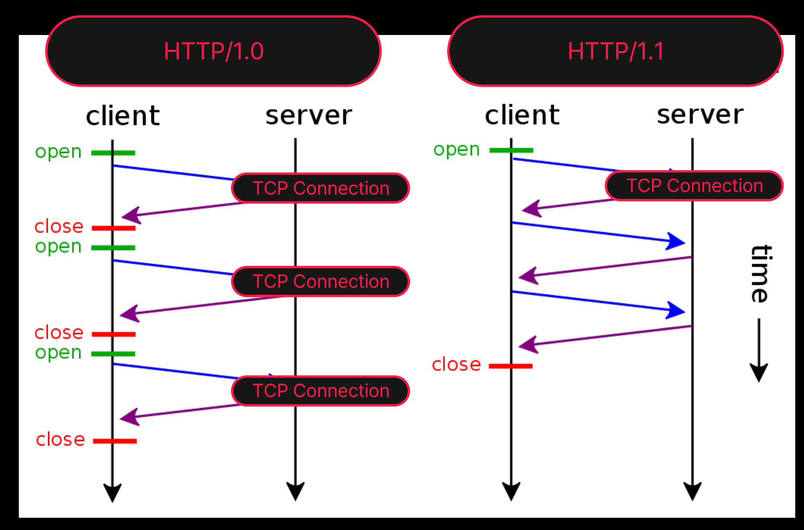
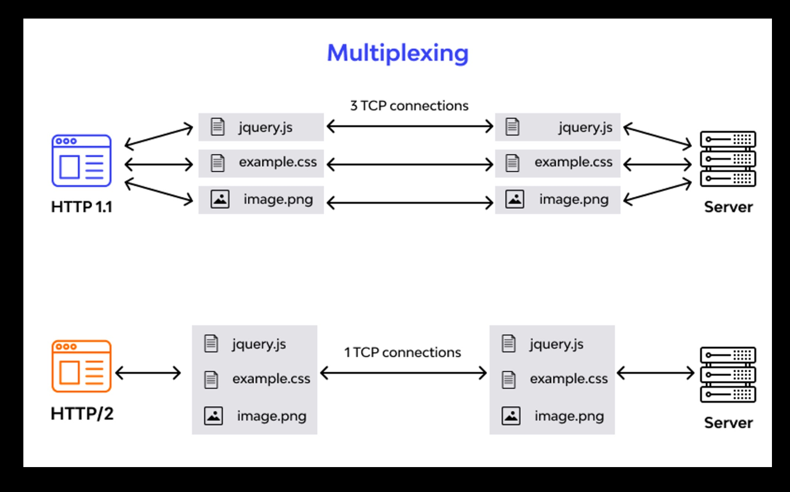
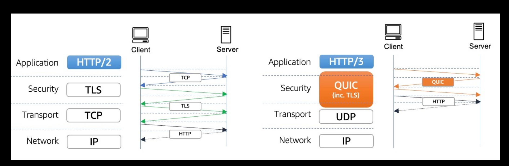
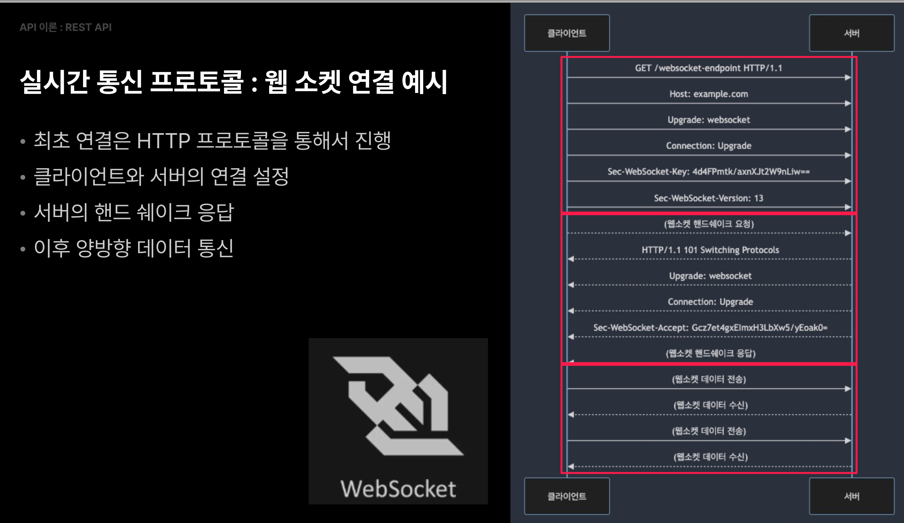

# Rest API


[toc]

API 

* 소프트웨어간의 상호작용을 가능하게 하는 규칙 및 도구모음
* 프로그램이나 애플리케이션을구축할때,다른시스템과의연결및통신을용이하게하는㑄중개자㑄역할


Restful 아키텍처

* 상태를 관리하지 않는 특징 (stateless)
* 캐시 가능성 

정리 : REST API의 장점과 이점

* 간결성, 유연성 : HTTP 프로토콜을 기반하여 : 다양한 종류의 클라이언트와의 호환성을 제공

* 확장성과 분산 시스템에 적합
  * 상태를 저장하지 않는 Stateless구조
  * 시스템의 확장성을 향상
  * 여러 서버에 요청을 분산가능

* 캐시 지원 : 서버의 부하를 줄이고 응답 속도를 빠르게
* 플랫폼 및 언어 독립성 : JSON, XML 등의 표준 데이터 포맷을 사용하여 데이터를 교환 다양한 언어와 플랫폼에서 쉽게 통합 가능


RESTful의 6가지 제약 조건

* Client-Server - 클라이언트 서버 

* Stateless -  무상태성

* Cacheable - 캐시 가능성

* Layered System - 계층화 된 시스템

* 코드 온 디맨드  - Code on Demand

* 균일한 인터페이스 - Uniform Interface

 캐시가능 (Cacheable)- ETag

- ETag(Entity Tag)는 웹 서버가 자원(예: 웹 페이지, 이미지)의 특정 버전을 식별하는 데 사용하는 메커니즘
- 자원의 내용이 변경될 때마다 갱신되는 고유한 식별자


# HTTP 1.1 2.0 3

## 1.0 vs 1.1



- 지속 연결 (Persistent Connections)
- 요청 파이프라이닝 (Request Pipelining)
- 가상호스팅 (Virtual Hosting)
- 캐시 제어 (Cache Control)
- 청크 전송 (Chunked Transfer Encoding)
- 호스트 헤더 (Host Header)


## HTTP 2

- 2015년에 등장
- 성능 향상을 위한 여러 기술 도입
- 다중 스트림 및 헤더 압축을 통해 페이지 로딩속도 향상
- TLS 사용 권장으로 변경 (HTTPS)



- 이진 프레이밍 (Binary Framing)
- 다중화 (Multiplexing)
- 헤더 압축 (Header Compression):
- 서버 푸시 (Server Push)
- 스트림 우선순위 (Stream Prioritization):

## HTTP 3

- 2020년에 등장
- UDP 프로토콜 기반
- 멀티플렉싱, 헤더 압축 및 연결 설정 시간을 줄이는 기술 등 도입




# HTTP 주요 상태 코드

| 상태 코드 범위 | 의미                           | 설명                              |
| -------------- | ------------------------------ | --------------------------------- |
| 1XX            | 정보 응답 (Informational)      | 요청을 받았으며, 계속 진행합니다. |
| 2XX            | 성공 (Successful)              | 요청이 성공적으로 처리되었습니다. |
| 3XX            | 리디렉션 (Redirection)         | 추가 작업 조치가 필요합니다.      |
| 4XX            | 클라이언트 오류 (Client Error) | 요청이 잘못되었습니다.            |
| 5XX            | 서버 오류 (Server Error)       | 서버에 오류가 발생했습니다.       |

| HTTP 버전 | 상태 코드 | 상태 메시지           | 설명                       |
| --------- | --------- | --------------------- | -------------------------- |
| HTTP/1.1  | 200       | OK                    | 요청 성공 및 실패 구분     |
| HTTP/1.1  | 404       | Not Found             | 요청 성공 및 실패 구분     |
| HTTP/1.1  | 500       | Internal Server Error | 디버깅 및 문제 해결에 용이 |
| HTTP/1.1  | 302       | Found                 | 사용자 경험 개선           |
| HTTP/1.1  | 401       | Unauthorized          | 보안 강화                  |

| HTTP 버전 | 상태 코드 범위 | 상태 코드 | 상태 메시지           | 설명                                                    |
| --------- | -------------- | --------- | --------------------- | ------------------------------------------------------- |
| HTTP/1.1  | 1XX            | 100       | Continue              | 중간 응답, 현재까지 모든 것이 정상, 요청 계속 해도 됨   |
|           |                | 101       | Switching Protocols   | 클라이언트의 업그레이드 요청 헤더에 응답하여 전송       |
|           |                | 102       | Processing            | 서버가 요청 수신하여 처리 중 이지만 아직 사용할 수 없음 |
| HTTP/1.1  | 2XX            | 200       | OK                    | 성공적인 요청 처리                                      |
|           |                | 201       | Created               | 새 리소스 생성 완료                                     |
|           |                | 204       | No Content            | 응답 본문 없음                                          |
| HTTP/1.1  | 3XX            | 301       | Moved Permanently     | 리소스가 영구적으로 이동 되었음                         |
|           |                | 302       | Found                 | 리소스가 일시적으로 이동 되었음                         |
|           |                | 304       | Not Modified          | 변경 사항이 없으니 캐시된 버전 사용                     |
| HTTP/1.1  | 4XX            | 400       | Bad Request           | 잘못된 요청 구문                                        |
|           |                | 401       | Unauthorized          | 인증 필요                                               |
|           |                | 403       | Forbidden             | 접근 권한 없음                                          |
|           |                | 404       | Not Found             | 리소스를 찾을 수 없음                                   |
| HTTP/1.1  | 5XX            | 500       | Internal Server Error | 서버 내부 오류                                          |
|           |                | 502       | Bad Gateway           | 게이트웨이 문제                                         |
|           |                | 503       | Service Unavailable   | 서비스 이용 불가                                        |


# Rest API 디자인

## REST API 디자인 원칙 : 일관된 인터페이스

- 자원의 식별
  - 웹 리소스는 고유한 URI(Uniform Resource Identifier)를 통해 식별
- 자원에 대한 표현(Presentation)을 통한 상호작용
  - JSON, XML 등의 형식으로 표현된 자원을 통해 서버와 상호작용
- 자기 기술적 메시지(self-descriptive message)
  - 요청과 응답은 충분한 정보를 포함하여 자체적으로 이해될 수 있어야 함
- 애플리케이션 상태의 하이퍼미디어 엔진(HATEOAS)
  - 클라이언트는 응답에 포함된 하이퍼링크를 통해 다른 상태로 전이 가능

## 좋은 REST API 디자인 : 자원 표현 방법

- RESTful URI가 가리키는 자원(Resource)은 객체 : 동사가 아닌 명사를 사용
- 자원은 4가지 범주로 분류 가능 : 자원이 어떤 범주에 속하는지에 따라 일관된 네이밍 사용
- 문서 - Document
- 컬렉션 - Collection
- 스토어 - Store
- 컨트롤러 - Controller

## 좋은 REST API 디자인 : 자원 표현 방법 (Document)

- 문서 자원은 DB의 하나의 레코드
- 하나의 객체 인스턴스와 유사한 단일 자원의 개념
- **단수**를 사용 하여 문서 자원을 표현한다.

```
 http://api.example.com/v1/managed-books/{id}
 http://api.example.com/v1/users/{id}
 http://api.example.com/v1/users/admin // 단수 
```

## 좋은 REST API 디자인: 컬렉션 (Collection)

- 서버가 관리하는 리소스 디렉터리
- POST 요청으로 새로운 리소스 추가 될 수 있다.
- 복수를 사용 하여 컬렉션 자원을 표현한다.

```
 http://api.example.com/v1/managed-books
 http://api.example.com/v1/users
 http://api.example.com/v1/users/{id}/accounts
```

## 좋은 REST API 디자인 : 스토어 (Store)

- 클라이언트가 관리하는 리소스 저장소
- 클라이언트는 AP를 이용하여 CRUD가 가능함
- 복수를 사용하여 스토어를 표현한다.

```
 http://api.example.com/v1/users/{id}/playlists
```

## 좋은 REST API 디자인 : 컨트롤러 (Controller)

- 컨트롤러 자원은 인자와 반환 값, 입력 및 출력이 있는 실행 가능한 함수
- 문서, 컬렉션, 스토어로 해결이 어려운 기능을 수행하기 위한 모델
- 특정 자원을 가리키는 것이 아니라 실행 인 만큼 예외적으로 동사를 사용

```
http://api.example.com/v1/users/{id}/carts/checkout http://api.example.com/v1/users/{id₴/playlists/play
```

## HTTP 메서드와 리소스 조작

- GET : 조회
- POST : 추가
- PUT : 업데이트
- DELETE : 삭제
- PATCH : 부분 업데이트

안정성 - Safety

- 안전한 메서드는 서버 상의 데이터를 변경하지 않음
- 해당 요청이 리소스에 어떠한 부작용도 일으키지 않음

멱등성-  Idempotency

- 멱등한 메서드는 같은 요청을 한 번 실행하든 여러 번 실행하든 결과가 동일
- 첫요청 이후의 동일한 요청들은 시스템 상태에 추가적인 변화를 일으키지 않음

| HTTP 메서드 | 안정성 (Safe) | 멱등성 (Idempotent) |
| ----------- | ------------- | ------------------- |
| GET         | O             | O                   |
| POST        | X             | X                   |
| PUT         | X             | O                   |
| DELETE      | X             | O                   |
| PATCH       | X             | X                   |
| HEAD        | O             | O                   |
| OPTIONS     | O             | O                   |
| TRACE       | O             | O                   |

**GET**: 리소스를 가져옵니다. 서버의 상태를 변경하지 않기 때문에 안정적입니다. 여러 번 요청해도 결과가 동일하기 때문에 멱등적입니다.

**POST**: 리소스를 생성합니다. 서버의 상태를 변경하기 때문에 안정적이지 않으며, 여러 번 요청하면 리소스가 여러 번 생성될 수 있기 때문에 멱등적이지 않습니다.

**PUT**: 리소스를 업데이트합니다. 서버의 상태를 변경하기 때문에 안정적이지 않지만, 동일한 요청을 여러 번 보내도 결과가 동일하기 때문에 멱등적입니다.

**DELETE**: 리소스를 삭제합니다. 서버의 상태를 변경하기 때문에 안정적이지 않지만, 동일한 요청을 여러 번 보내도 결과가 동일하기 때문에 멱등적입니다.

**PATCH**: 리소스를 부분적으로 업데이트합니다. 서버의 상태를 변경하기 때문에 안정적이지 않으며, 요청마다 결과가 달라질 수 있기 때문에 멱등적이지 않습니다.

**HEAD**: GET 요청과 동일하지만, 응답 본문을 반환하지 않습니다. 서버의 상태를 변경하지 않기 때문에 안정적이며, 여러 번 요청해도 결과가 동일하기 때문에 멱등적입니다.

**OPTIONS**: 서버가 지원하는 메서드의 목록을 요청합니다. 서버의 상태를 변경하지 않기 때문에 안정적이며, 여러 번 요청해도 결과가 동일하기 때문에 멱등적입니다.

**TRACE**: 요청을 따라가면서 디버깅 정보를 제공합니다. 서버의 상태를 변경하지 않기 때문에 안정적이며, 여러 번 요청해도 결과가 동일하기 때문에 멱등적입니다.


# 웹소켓

실시간 통신의 필요성

- RESTful 모델은 실시간 정보 흐름에 한계가 있음
- 실시간 통신은 정보를 즉시 전송하고 업데이트하는 데 필요
- 실시간 통신 예시
  - 실시간 채팅
  - 주식 시장 업데이트
  - 게임 상태 동기화 등
  - 사용자 반응 속도와 다중 사용자 간 협업 필요 시

REST AP로 구현한다면?

- 불필요한 서버 부하
- 지연과 대기 시간
- 대역폭 낭비
- 실시간성 제한
- 에러 처리 어려움
- 리소스 낭비

## 실시간 통신 프로토콜: 웹 소켓

- 실시간 통신을 지원하는 네트워크 프로토콜 중 하나
- 초기 연결 후 지속적인 양방향 통신 가능하게 함
- 클라이언트와 서버 간의 상호작용을 실시간으로 처리 가능

