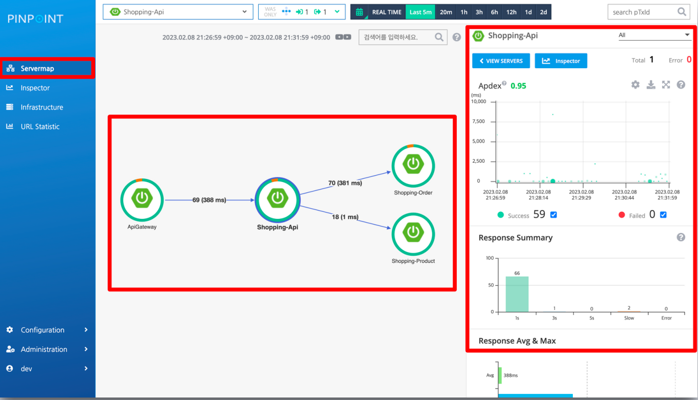
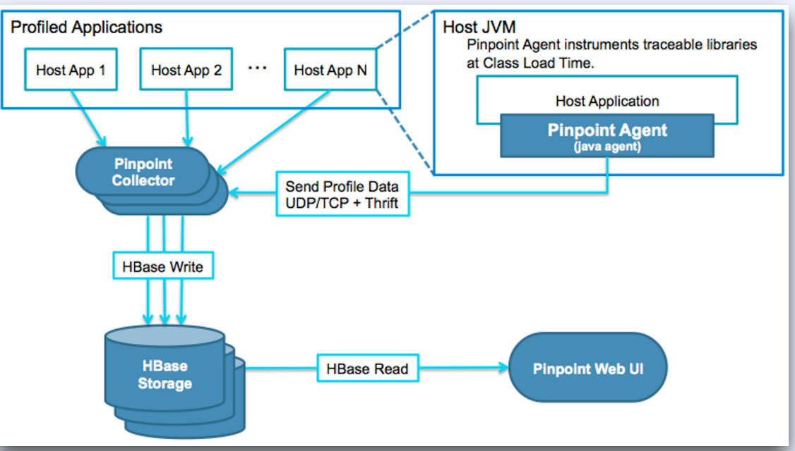
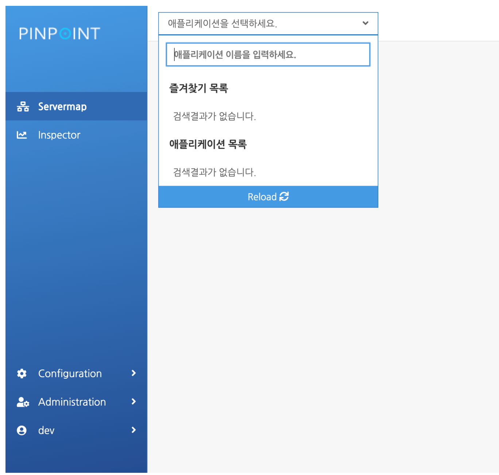
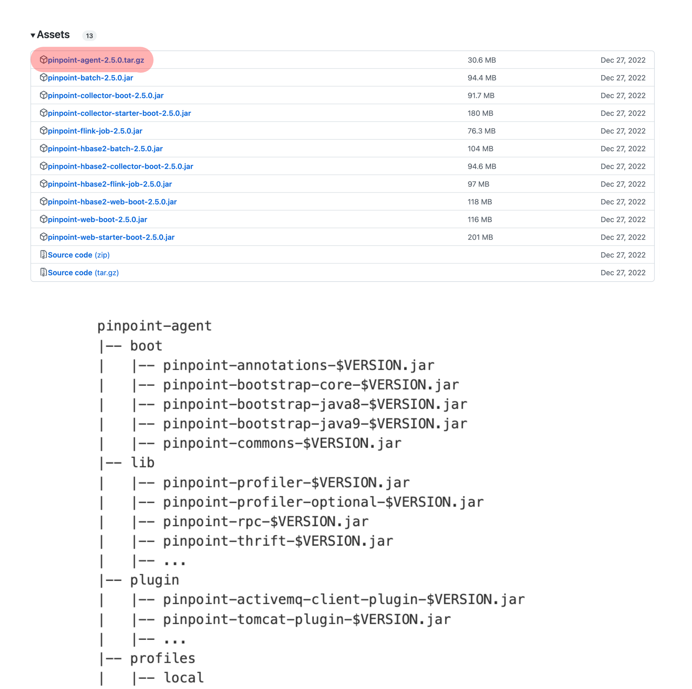
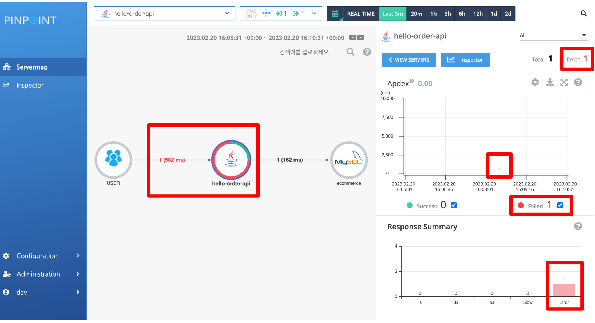
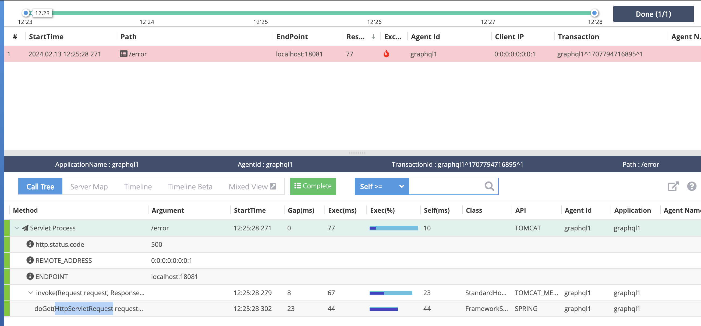

# 핀포인트

[toc]

APM?

Application Performance Monitoring
• 애플리케이션의 성능 관리
• 성능 - 기계 따위가 지닌 성질이나 기능
• 고객에게 정상적으로 서비스 중인지 관리
• 메트릭, 이벤트, 로그 및 트랜잭션(MELT)을 모니터링

**APM을 사용하는 목적**

*  성능 문제를 예측하고 방지
* 고객 기대 성능 보장
* 고객 경험 보장
* 애플리케이션 가용성 증대, 다운타임 감소
* 응답 시간 보장
* SLA (Service-Level Agreements)

**APM 도구의 핵심 지표**

* 응답 시간
* 요청 비율
* 에러율
* 리소스 사용률
* CPU, 메모리, DB Conn Pool, Thread, HDD
* 운영중인 시스템 수

 APM 도구들

*  Pinpoint, Datadog, New Relic, Google Cloud Console, Grafana, Splunk


# Pinpoint

https://github.com/pinpoint-apm/pinpoint

* https://guide-fin.ncloud-docs.com/docs/pinpoint-pinpoint-1-2 : doc

2015년 1월 9일에 오픈소스로 공개 - 네이버
• 분산 시스템의 성능 분석 및 문제 진단 및 해결에 사용하는 APM
• 연결된 분산 시스템들의 트랜잭션 추적과 분석

각각의 트랜잭션을 코드레벨 콜스택 분석 기능 제공

애플리케이션 서버의 코드 변경 없는 APM Agents 제공
애플리케이션 서버의 성능에 최소한의 영향도 (리소스의 약 3% 사용)

Pinpoint의 기능

* 서버 맵(ServerMap)
* 실시간 활성 쓰레드 차트(Realtime Active Thread Chart)
  * 전체 쓰레드 정보 제공
  * 활성 스레드를 실시간 모니터링 제공
* 요청 및 응답에 대한 스캐터 차트(Request/Response Scatter Chart)
  * 요청과 응답에 대한 Scatter Chart 제공
  * 요청 Scatter를 드래그, 상세 정보 확인
* 코드 레벨의 콜스택(CallStack)
  * 모든 트랜잭션에 대한 코드 수준의 가시성 정보 제공
  * 코드 수준의 병목 현상과 장애 지점을 식별
* 인스펙터(Inspector)
  * 애플리케이션의 상세 정보 제공
  * CPU 사용률
  * Memory/Garbage Collection
  * TPS
  * JVM arguments.

**ServerMap**

*  분산 시스템의 연결된 상황과 트랜잭션을 시각화
* 빠르고 쉽게 파악
* 각 요청의 현재 성공, 실패 지표 제공
* 각 요청에 대한 요청 수 제공
* 각 요청의 응답 시간 제공
* 각 요청과 응답의 평균 지표 제공




## Pinpoint 아키텍처

- Pintpoint Agent - 애플리케이션의 성능 관련 지표 수집 및 전달
- Pintpoint Collector - Agent에서 받은 정보를 HBase에 적재
- Pinpoint Web UI- 수집된 정보 제공(성능, 모니터링, 지표)



## Docker로 설치

```
git clone https://github.com/pinpoint-apm/pinpoint-docker.git

cd pinpoint-docker
git checkout tags/2.5.0 # 최근버전이 안됌 
docker-compose pull && docker-compose up -d
```

failed to create network pinpoint-docker_pinpoint: Error response from daemon: Pool overlaps with other one on this address space 

라는 오류가 뜨면 네트워크 정리가 필요하다

```
docker network ls

docker network prune -y
```

실행하면 10분정도 소요된다. 

localhost:8080 접속



## Web/API에 Pinpoint Agent 추가해보기
https://pinpoint-apm.github.io/pinpoint/installation.html#5-pinpoint-agent
Agent 파일 내려받기
Java App 실행시 Pinpoint Agent 붙이기
명령줄 예제
IDE 예제


configuration -> installation 접속 

Pinpoint Agent 파일 내려받기 (예, 2.5)
https://github.com/pinpoint-apm/pinpoint/releases/tag/v2.5.0



다운로드 받고, 압축 푼 후에 자신의 서버에 붙여서 실행해야 한다.

실행시 아래 세가지 환경변수 vm옵션을 줘야한다.

```
-javaagent:$AGENT_PATH/pinpoint-bootstrap-$VERSION.jar
-Dpinpoint.agentId - Pinpoint Agent가 실행 중인 앱의 식별자
-Dpinpoint.applicationName - 실행 중인 앱의 그룹 (단일 서비스)
```

명령줄에서 추가
```
java -jar -javaagent:[Pinpoint Agent Path]/pinpoint-bootstrap.jar -Dpinpoint.agentId=
[Agent ID] -Dpinpoint.applicationName=[Service Name] 자르명.jar
```

* 예시로 
  * 에이전트 path는 /Users/ysk/study/study_repo/fc-large1/ecommerce-app/pinpoint다 
  * 에이전트 Id는 graphql1
  * 애플리케이션명은 : graphql1

```
java -jar -javaagent:/Users/ysk/study/study_repo/fc-large1/ecommerce-app/pinpoint/pinpoint-bootstrap.jar -Dpinpoint.agentId=graphql1 -Dpinpoint.applicationName=graphql1 graphql-0.0.1-SNAPSHOT.jar
```

도커파일에는

```dockerfile
# 베이스 이미지 선택
FROM openjdk:11-jre-slim

# 환경변수 설정
ENV AGENT_PATH=/opt/pinpoint-agent
ENV VERSION=2.2.2
ENV APPLICATION_NAME=myApplication
ENV AGENT_ID=myApplication001

# 에이전트 및 애플리케이션 파일 복사
COPY pinpoint-agent-${VERSION}.jar $AGENT_PATH/pinpoint-bootstrap-${VERSION}.jar
COPY my-spring-boot-application.jar /app.jar

# 에이전트 설정 파일 복사 (필요시)
COPY pinpoint-agent /opt/pinpoint-agent

# 애플리케이션 실행
ENTRYPOINT ["java", \
            "-javaagent:$AGENT_PATH/pinpoint-bootstrap-$VERSION.jar", \
            "-Dpinpoint.agentId=$AGENT_ID", \
            "-Dpinpoint.applicationName=$APPLICATION_NAME", \
            "-jar", "/app.jar"]
```


## Pinpoint 샘플링

- 요청 트래픽에 대해서 어느 정도 샘플링할 지에 대한 설정 제공
- Pinpoint Agent의 pinpoint.config

```
# Allow sampling.
profiler.sampling.enable=true
```

**profiler.sampling.type**

```
profiler.sampling.type=COUNTING
profiler.sampling.counting.sampling-rate=1
```

COUNTING
기본
예시)

* 1 : 100%
* 20 : 5%
* 100 :1%

**profiler.sampling.type=PERCENT**

```
profiler.sampling.type=PERCENT
profiler.sampling.percent.sampling-rate=100
```

PERCENTCh05_05. Pinpoint를 이용한 서비스 분석 3
예시)

* 100 : 100%
* 50 : 50%
* 0.01 : 0.01%

## 에러 콜스택 분석



에러발생시 화면에 보임.

Apdex 화면에 보이는 빨간점을 드래그하면 상세화면에 들어가서 볼 수 있다.




