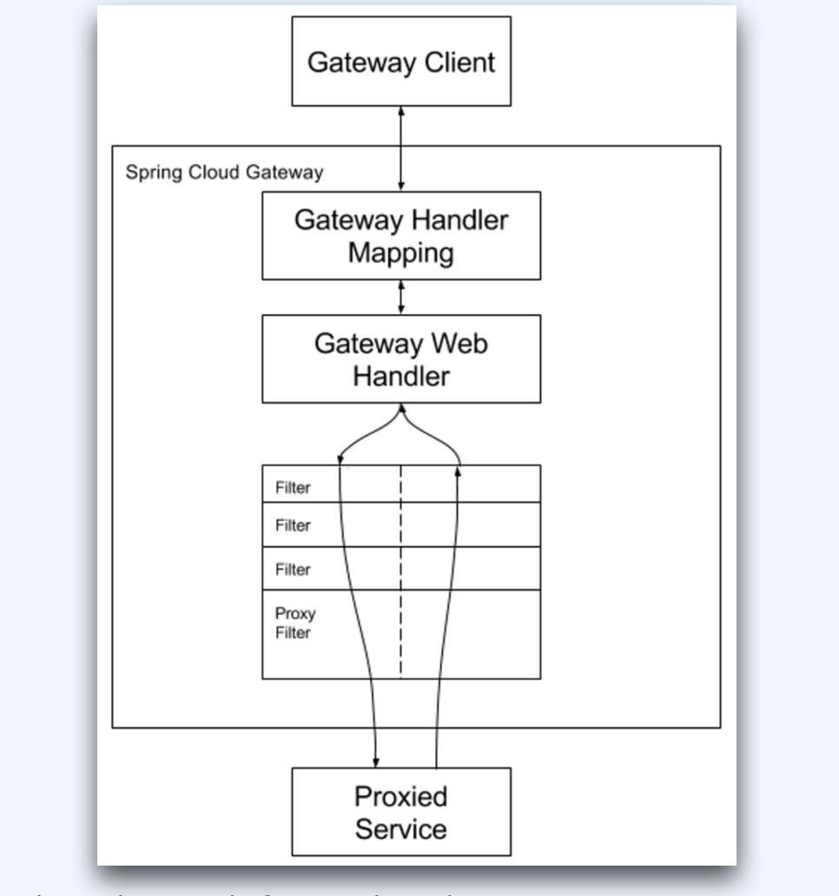
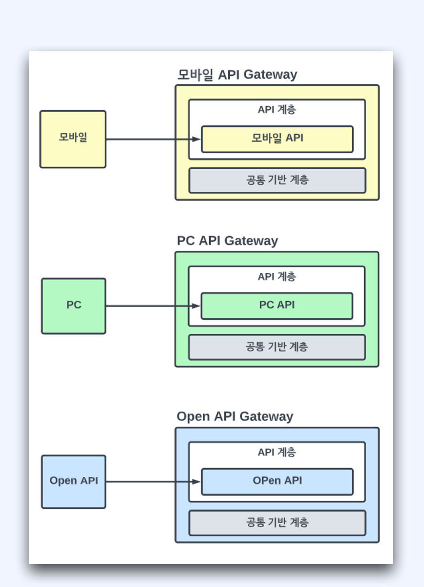

# API 게이트웨이 

[toc]


프로젝트 3가지 사용

* Order-api
* Admin
* api-gateway


# 1. API 게이트웨이

1. 배경(Background)

고객 서비스를 위한 다양한 클라이언트
고객 서비스를 위해 필요한 다양한 정보
분산된 마이크로서비스
많은 마이크로 서비스
마이크로 서비스의 다양한 통신 방식


2. API 게이트웨이란

 단일접점: 마이크로 서비스를 모아서 단일 접점을 제공
 캡슐화: 내부 마이크로 서비스 캡슐화


3. API Gateway의 장점

마이크로 서비스를 묶어서 단일 진입점을 제공
한 곳에서 보안과 권한 제어
API에 대한 로깅과 모니터링
헤더, 쿼리, 요청 변환
분산된 마이크로 서비스에 대한 관리
캐싱
정책, 회로 차단기, QoS 다시 시도
부하 분산

4. API Gateway의 단점

 단일 장애 포인트가 될 수 있음
추가 네트워크 호출이 늘어남 → 응답 속도 저하
추가적인 고가용성 장비의 유지보수 및 관리의 대

5. API Gateway의 주의점

API Gateway를 단일 장애 포인트(SPoF)로 만들지 않기
고가용성 확보
비즈니스 경계 및 클라이언트 앱을 기준으로 분리 고려
오너쉽


##  Spring Cloud Gateway 지원 기능
스프링 프레임워크 5, 스프링부트 2.0, 리액터 프로젝트, 네티 NIO
어떤 요청 속성에도 매칭을 통한 라우팅 제공
경로에 따라 조건자과 필터를 설정, 쉬운 조건자와 필터 작성
요청과 응답 변경
서킷브레이커 통합 제공
Spring Cloud DiscoveryClient integration
요청 제한

### Spring Cloud Gateway 동작 방식

- Gateway Handler - 요청과 경로에 대한 매칭 처리

- Gateway Web Handler

  - Before 필터
  - After 필터

- Route

  - 고유한 ID, 목적지 URI, Predicate, Filter로 구성되는 요소

  - 조건에 만족하면 설정된 경로로 라우팅

- Predicate - 요청이 조건에 충족하는지 테스트
- Filter- 하위 마이크로 서비스로 요청과 응답을 보낼 때 변경하는 기능



## BFF 패턴 

단일 API 게이트 웨이의 문제 - SPoF,  병목, 책임 소재

개선 방향

- BFF 패턴
  - 각 클라이언트별 API Gateway
- 얻는 이점
  - 독립성
  - 확장, 변경, 배포
  - 신뢰성 향상
  - SPOF 제거
  - 오너쉽




# API 게이트웨이 라우트 만들기

> 클라이언트 -->/hello게이트웨이 --> |/hello 마이크로서비스

```java
@Configuration
public class RouteConfiguration {
    public static final String MICROSERVICE_HOST_8080 = "http://localhost:8080";
    public static final String ECHO_HTTP_BIN = "http://httpbin.org:80";
    @Bean
    public RouteLocator helloRouteLocator(RouteLocatorBuilder builder) {
        return builder.routes()
                .route("hello_route",
                        r -> r.path("/hello")
                        .uri(MICROSERVICE_HOST_8080))
                .route("rewrite_route",
                        r -> r.path("/gateway-hello")
                        .filters(f ->
                                f.rewritePath("/gateway-hello", "/microservice-hello")
                        )
                        .uri(MICROSERVICE_HOST_8080)
                )
                .route("add-header-route",
                        r -> r.path("/get")
                        .filters(f -> f.addRequestHeader("role", "hello-api"))
                        .uri(ECHO_HTTP_BIN)
                )
                .build();
    }
}

```

application-yml

```yaml
spring:
	cloud:
		gateway:
			routes:
				- id: path_simple_hello 
					uri: http://localhost:8080 
					predicates:
						- Path=/hello
```


# Api 게이트웨이 적용하기 

```
### 샘플 구성
- 이커머스 어드민
- Port: 8081
- 주문 도메인 API
- Port: 8082
```

