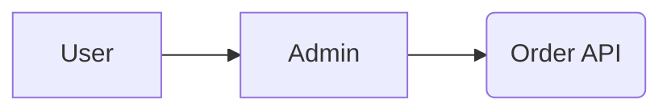
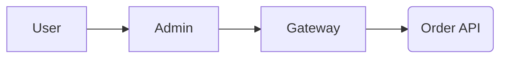

# Ecommerce Admin Sample

## 필요한 사항
0. 자바 개발 환경 11 이상
1. 인텔리 J
2. 로컬 환경에 MySQL 8.x 설치
3. 프로젝트의 ```doc -> database -> 덤프파일```을 로컬 설치된 MySQL 적용

## 샘플 구성
- 이커머스 어드민 
  - Port: 8081
- 주문 도메인 API 
  - Port: 8082

## 프로젝트 구성 버전
- 웹 프레임워크: ```spring boot 2.7.6```
- 템플릿 언어: ```thymeleaf```
- 템플릿 레이아웃 지원: ```thymeleaf-layout-dialect:3.0.0```
- 템플릿 스프링 시큐리티 지원: ```thymeleaf-extras-springsecurity5```

## Service Flow


## Admin 계정 등록
- http://localhost:8081/users/sign-up

# Concept
- 이커머스 서비스를 관리하기 위한 간단한 샘플 어드민 형태

## Phase 0
초기 데이터베이스 사용 단계


## Phase 1
API 연동하는 단계


## Phase 2
Gateway를 이용해서 API 연동하는 단계

