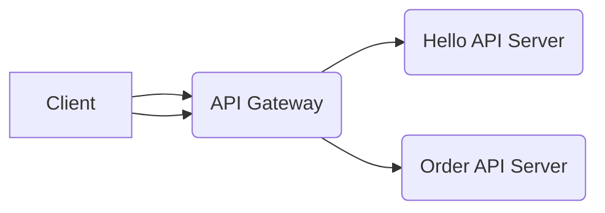

# Hello API Gateway

# 사전 준비 사항
- API Gateway 배경 지식
- Hello Order API 샘플 프로젝트

# 참고사항

```mermaid
flowchart LR
Client --> G1(API Gateway) --> M1(Hello API Server)
Client --> G1(API Gateway) --> M2(Order API Server)
```
