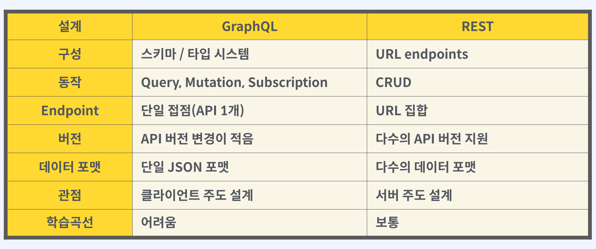
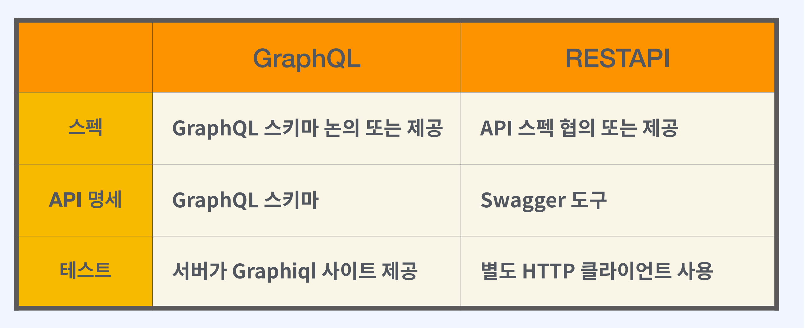
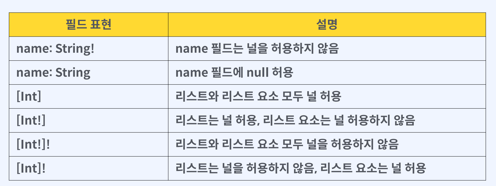

# GraphQL


[toc]


1. GraphQL이란?

- 2012년 페이스북의 클라이언트 데이터 전송 방식 개선 목적 시작
- 2015년 7월 GraphQL 초안 명세와 graphql.js 공개
- 클라이언트와 서버의 통신 명세
- API를 만드는 쿼리 언어 (선언형 데이터 페칭 언어)
- GraphQL은 단지 명세에 불과하다.
- 구조와 행동
- 스키마
- 리졸버


2. GraphQL의 특징



3. GraphQL 이점

GraphQL 표준

클라이언트에게 많은 제어권

단일접점(API endpoint가 1개)

타입 시스템, 자동화된 데이터 유형 검사 오버페칭, 언더페칭이 적다

 상대적으로 빠르다

4. 단점

GraphQL 스키마의 유지보수

서버 개발자의 노력이 더 필요

캐싱 전략이 RESTful API에 비해 어렵다.

학습 곡선이 있다. (기존 RESTful API 보다)

트리 그래프의 깊이 제어 필요



5. Graphql 개발 방식

Schema First - 스키마를 먼저 정의

Code First - 코드 작성 후 스키마 자동 생성


6. GraphQL 자바 프레임워크

Spring for GraphQL

Netflix DGS

GraphQL Kick Starter


## GraphQL 작업 타입

- 쿼리(query)- 조회
- 뮤테이션(mutation)- 입력, 수정, 삭제
- 서브스크립션(subscription) - 구독

## 데이터 타입

- 스칼라 타입(Int, Float, String, Boolean, ID)

  - 기본적인 단일 값 타입

  - 객체 타입이 아니라 필드를 갖지 않는다.

```graphql
scala DateTime

type Product {
	id: ID!
	name: String!
	createdAt: DateTime!
}
```

- 오브젝트 타입
- 인풋 타입(input)
- 열거타입(enum)

```graphql
enum ProductStatus {
	SELLING
	SOLDOUT
}

type Product {
	id: ID!
	name: String!
	productStatus: ProductStatus!
}
```

- 인터페이스(interface)
- 유니언 타입
- 프레그먼트

### GraphQL null 규칙

필드에 느낌표(!)로 null여부를 표현



### GraphQL 페이징

파라미터를 이용해서 페이징 요청 가능

```
type Query {
	allProducts (page: Int=1 size: Int=10): [Product!]!
}
```


## GraphQL 개발시 고려할점

- 데이터 양의 제어 - 페이징 처리
- 깊이 제어
- 쿼리 복잡도 제어
- 클라이언트 요청의 타임아웃


# DGS 프레임워크 기본

넷플릭스에서 만들어 오픈소스로 공개한 GraphQL 프레임워크

graphql-java 기반으로 구축된 프레임워크

https://netflix.github.io/dgs/configuration/

> DGS 인텔리J 플러그인도 존재

## 특징

- Annotation 기반 프로그래밍 모델
- GraphQL Test 관련 프레임워크
- Java/Kotlin 코드 생성하는 플러그인
- GraphQL Federation과 쉬운 연동
- Spring Security 통합
- GraphOL 구독 기능 (WebSockets and SSE)
- 파일 업로드
- 에러 처리
- GraphQL interface/union types 자동 매핑

- GraphQL 자바 클라이언트 지원
- 로깅, 메트릭 등의 모듈 형태 통합


## DGS 어노테이션 기본 정보

- @DgsComponent - DGS에서 사용되는 컴포넌트 지정
- @DgsData - 데이터 Fetcher 메서드에 사용 (DgsComponent에 사용)
- @DgsQuery - Query 타입의 약칭
- @DgsMutation - Mutation 타입의 약칭
- @DgsSubscription - Subscription 타입의 약칭**
- @InputArgument - &4 EI% (Input Type, Scala, Enum)


# GraphQL 설치

의존성 추가

* DGS 6.X - 스프링부트 3.0, 자바 17

* DGs 5.5.X - 스프링부트 2.7

* DGs 5.4.x - 스프링부트 2.6

요청하는 Graphql Endpoint:' /graphql'

테스트하려면 ? -> http://localhost:8080/graphiql


## 스키마 만들기


- 경로: src/main/resources/schema
- 스키마 파일: src/main/resources/schema/schema.graphqls

```
type Query {
	hello (name: String): Hello
}

type Hello {
	message: String!
}
```

