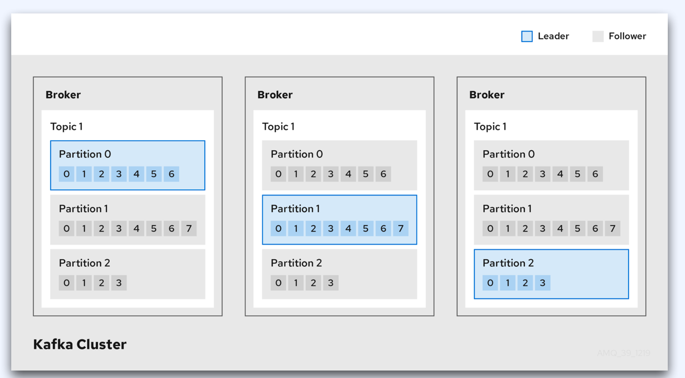
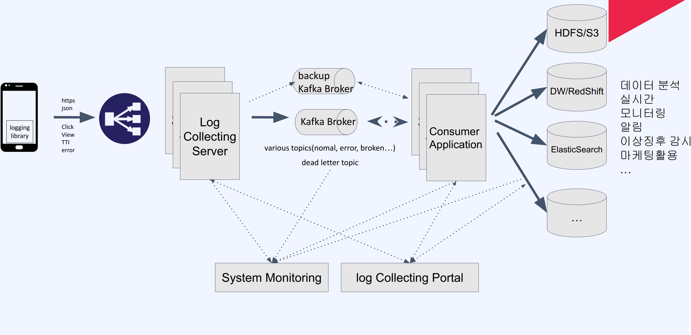
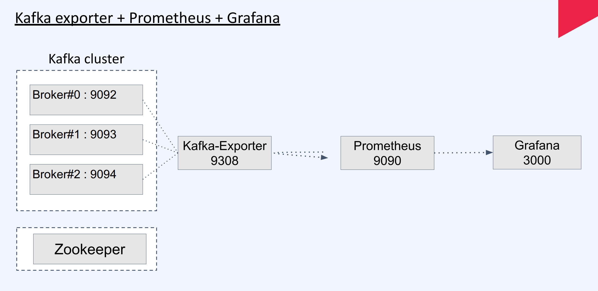
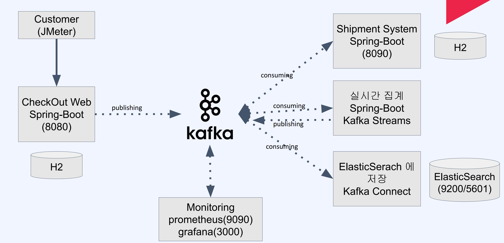

# Kafka

[toc]


강의자료 : https://github.com/spacetime101/fastcampus-kafka

* https://github.com/apache/kafka

kafka는 이벤트 스트리밍 플랫폼

## 메시지 시스템 장단점

기대효과

* 느슨한 결합
* 확장성
* 처리량 향상 및 버퍼링
* 안정성
* 유지보수성 증가

어려운 점

* 시스템의 복잡도 증가
* 이벤트 메세지의 유지 보수
* 단일 장애점 (SPoF)
* 메세징 브로커의 성능 병목 가능성
* 별도 유지보수 필요한 시스템 관리 - 브로커


## 용어

프로듀서, 컨슈머

*  프로듀서(Producer)
  * 메세지를 만들어서 보내는 측

*  컨슈머(Consumer)
  *  메세지를 소비하는 측

토픽

*  메세지의 수신처
* 개념적으로 이메일를 수신하는 이메일 주소와 유사

파티션, 세그먼트

*  파티션

  *  하나의 토픽에 대해서 처리량을 높이기 위해 여러 개로 나눈 개념
  *  분산 처리가 가능(병렬성), 수평 확장 가능(확장성)

  *  (주의) 늘리면 줄일 수 없다.

* 세그먼트
  * 로그 세그먼트
  * 토픽으로 들어오는 메시지를 세그먼트라는 로그 파일 형태로 저장
  * 메세지 + 메타 정보
  * 로그 파일 + 인덱스 파일

오프셋

* 증가되는 숫자값
* `파티션 내`에서 자신의 위치값
*  __consumer_offsets에 기록
*  마지막 읽은 위치가 아니라 `다음 읽어야 할 위치`

리플리케이션, 리더, 팔로어


* 리플리케이션

  * 고가용성, 데이터 유실 방지

  * 메세지를 여러 개로 복제해서 여러 곳에 분산시키는 것을 의미

  * 카프카 운영의 안정성 확보

  * 하나의 브로커가 다운되더라도 동작을 유지

*  리더
  * 프로듀서, 컨슈머의 모든 읽기와 쓰기는 리더를 통해서만 가능
*  팔로어
  *  리더로부터 데이터를 복제



* 파란색이 리더

LAG(렉)

* 메시지 브로커에 남아있는 메세지의 개수 - 일정 숫자가 넘어가면 처리가 안되는것. 알림을 받아야함. 
* 프로듀서가 보낸 메세지 - 컨슈머가 소비한 메시지 수 = LAG 수
* 10 - 8 = 2
* 카프카 모니터링 대상


`메시지 전송 방식`

* 최대 한 번 전송(at-most-once)
  * 프로듀서는 최대 한 번 메시지를 송신
  * 브로커로부터 오류 또는 시간 초과 메시지를 받으면 메시지를 다시 보내지 않는다.
  * 컨슈머가 토픽의 메세지를 다 처리하지 못하고 에러가 발생하면 메세지 정보를 잃을 수 있다. 
  * `메시지의 손실을 감안하고 빠르게 메시지를 보낼 경우`
* 적어도 한 번 전송(at-list-once)
  * 프로듀서는 최소한 한번 메세지를 보낸다.
  * 프로듀서가 브로커로부터 에러나 타임아웃을 수신하면 메세지를 재전송
  * 메세지 정보 유실 가능성 낮음
  * 중복 메세지가 발생할 수 있다
* 정확히 한 번 전송(exactly-once)
  * 프로듀서가 발생한 메세지를 원자적으로 관리
  * 성공 or 실패
  * 데이터베이스의 트랜잭션과 유사한 개념
  * 트랜잭션 API를 활용

### 실전 Tips!
1. 메세지는 전송되지 않을 수 있다.
2. 데드레터 큐
3. LAG 모니터링 필수

### Docker-compose 1

```yml
version: '3.8'
services:
  zookeeper:
    image: confluentinc/cp-zookeeper:7.3.0
    container_name: zookeeper
    environment:
      ZOOKEEPER_CLIENT_PORT: 2181
      ZOOKEEPER_TICK_TIME: 2000

  broker:
    image: confluentinc/cp-kafka:7.3.0
    container_name: broker
    ports:
      - "9092:9092"
    depends_on:
      - zookeeper
    environment:
      KAFKA_BROKER_ID: 1
      KAFKA_ZOOKEEPER_CONNECT: 'zookeeper:2181'
      KAFKA_LISTENER_SECURITY_PROTOCOL_MAP: "PLAINTEXT:PLAINTEXT,PLAINTEXT_INTERNAL:PLAINTEXT"
      KAFKA_ADVERTISED_LISTENERS: "PLAINTEXT://localhost:9092,PLAINTEXT_INTERNAL://broker:29092"
      KAFKA_OFFSETS_TOPIC_REPLICATION_FACTOR: 1
      KAFKA_TRANSACTION_STATE_LOG_MIN_ISR: 1
      KAFKA_TRANSACTION_STATE_LOG_REPLICATION_FACTOR: 1

```

* KAFKA_BROKER_ID: 카프카 브로커 식별자
* KAFKA_ZOOKEEPER_CONNECT: 카프카가 주키퍼에 연결하기 위한 정보
* KAFKA_LISTENER_SECURITY_PROTOCOL_MAP: 키-값 형태의 보안 연결 정보
* KAFKA_INTER_BROKER_LISTENER_NAME: 도커 내부에서 수신대기 이름
* KAFKA_OFFSETS_TOPIC_REPLICATION_FACTOR: 단일 브로커이기 때문에 1 설정


## 카프카 docker-compose2 

```yml
version: '3.8'
services:
  zookeeper:
    image: wurstmeister/zookeeper:latest
    container_name: zookeeper
    platform: linux/amd64
    ports:
      - "2181:2181"
    environment:
      ZOOKEEPER_CLIENT_PORT: 2181
      ZOOKEEPER_TICK_TIME: 2000

  kafka0:
    image: wurstmeister/kafka:latest
    container_name: kafka0
    platform: linux/amd64
    depends_on:
      - zookeeper
    ports:
      - "9092:9092"
    environment:
      KAFKA_BROKER_ID: 0
      KAFKA_ZOOKEEPER_CONNECT: zookeeper:2181
      KAFKA_LISTENERS: PLAINTEXT://0.0.0.0:9092
      KAFKA_ADVERTISED_LISTENERS: PLAINTEXT://localhost:9092
      KAFKA_OFFSETS_TOPIC_REPLICATION_FACTOR: 1
      KAFKA_TRANSACTION_STATE_LOG_MIN_ISR: 1
      KAFKA_TRANSACTION_STATE_LOG_REPLICATION_FACTOR: 1

  kafka1:
    image: wurstmeister/kafka:latest
    container_name: kafka1
    platform: linux/amd64
    depends_on:
      - zookeeper
    ports:
      - "9093:9092"
    environment:
      KAFKA_BROKER_ID: 1
      KAFKA_ZOOKEEPER_CONNECT: zookeeper:2181
      KAFKA_LISTENERS: PLAINTEXT://0.0.0.0:9092
      KAFKA_ADVERTISED_LISTENERS: PLAINTEXT://localhost:9093
      KAFKA_OFFSETS_TOPIC_REPLICATION_FACTOR: 1
      KAFKA_TRANSACTION_STATE_LOG_MIN_ISR: 1
      KAFKA_TRANSACTION_STATE_LOG_REPLICATION_FACTOR: 1

  kafka2:
    image: wurstmeister/kafka:latest
    container_name: kafka2
    platform: linux/amd64
    depends_on:
      - zookeeper
    ports:
      - "9094:9092"
    environment:
      KAFKA_BROKER_ID: 2
      KAFKA_ZOOKEEPER_CONNECT: zookeeper:2181
      KAFKA_LISTENERS: PLAINTEXT://0.0.0.0:9092
      KAFKA_ADVERTISED_LISTENERS: PLAINTEXT://localhost:9094
      KAFKA_OFFSETS_TOPIC_REPLICATION_FACTOR: 1
      KAFKA_TRANSACTION_STATE_LOG_MIN_ISR: 1
      KAFKA_TRANSACTION_STATE_LOG_REPLICATION_FACTOR: 1

```

실행

```
docker-compose up -d

// Kafka Topic 생성
docker exec -it kafka kafka-topics.sh --create --topic topic-example1 --bootstrap-server localhost:9092


토픽 리스트 확인: kafka-topics.sh --list --bootstrap-server localhost:9092
토픽 상세 조회: kafka-topics.sh --describe --topic topic1 --bootstrap-server kafka:9092
토픽 삭제: kafka-topics.sh --delete --bootstrap-server kafka:9092 --topic topic1

```

토픽이름 제약사항
- 249자 미만으로 생성.
- 영어대소문자, 0~9숫자, 마침표, 언더바, 하이픈 조합으로 생성가능 … 등


## 카프카 CLI 명령어

토픽 관리 명령어

```shell
1. 토픽 생성
# Kafka 토픽 생성: `topic3` 이름으로 토픽을 생성하며, 파티션 수는 1개입니다.
kafka-topics.sh --create --topic topic3 --partitions 1 --bootstrap-server localhost:9092

2. 토픽 설명
# Kafka 토픽 설명: `topic3`에 대한 정보를 조회합니다. 파티션 수, 리플리케이션 팩터, 파티션 당 리더 등의 정보를 제공합니다.
kafka-topics.sh --describe --topic topic3 --bootstrap-server localhost:9092

3. 토픽 파티션 수 변경
# Kafka 토픽의 파티션 수 변경: `topic3`의 파티션 수를 3개로 변경합니다.
kafka-topics.sh --alter --topic topic3 --partitions 3 --bootstrap-server localhost:9092

4. 토픽 구성 변경
# Kafka 토픽 구성 변경: `topic3`에 대한 메시지 보유 시간(retention.ms)을 24시간(86400000ms)으로 설정합니다.
kafka-configs.sh --alter --entity-type topics --entity-name topic3 --add-config retention.ms=86400000 --bootstrap-server localhost:9092

5. 토픽 나열
# Kafka에서 사용 가능한 모든 토픽 나열: 현재 Kafka 클러스터에서 사용 가능한 모든 토픽을 나열합니다.
kafka-topics.sh --list --bootstrap-server localhost:9092
```

도커를 이용한 명령어

```shell
# Kafka 컨테이너에서 토픽 생성하기
docker exec kafka kafka-topics.sh --create --topic topic3 --partitions 1 --bootstrap-server localhost:9092

# Kafka 컨테이너에서 토픽 설명하기
docker exec kafka kafka-topics.sh --describe --topic topic3 --bootstrap-server localhost:9092

# Kafka 컨테이너에서 토픽의 파티션 수 변경하기
docker exec kafka kafka-topics.sh --alter --topic topic3 --partitions 3 --bootstrap-server localhost:9092

# Kafka 컨테이너에서 토픽의 구성 변경하기
docker exec kafka kafka-configs.sh --alter --entity-type topics --entity-name topic3 --add-config retention.ms=86400000 --bootstrap-server localhost:9092

# Kafka 컨테이너에서 모든 토픽 나열하기
docker exec kafka kafka-topics.sh --list --bootstrap-server localhost:9092

```

메시지 생성 (produce) 명령어

```shell
메시지 생산 요청
# 토픽 'topic3'에 메시지를 생산하며, 요청된 acks의 수를 1로 설정합니다.
kafka-console-producer.sh --topic topic3 --request-required-acks 1

docker exec -it kafka kafka-console-producer.sh --topic topic3 --request-required-acks 1 --broker-list localhost:9092

메시지 재시도 횟수 설정
# 토픽 'topic3'에 메시지를 생산할 때 최대 재시도 횟수를 50으로 설정합니다.
kafka-console-producer.sh --topic topic3 --message-send-max-retries 50
```

메시지 소비(comsume) 명령어

```shell
메시지 생산 요청
# 토픽 'topic3'에 메시지를 생산하며, 요청된 acks의 수를 1로 설정합니다.
kafka-console-producer.sh --topic topic3 --request-required-acks 1

# Docker 컨테이너 내에서 'topic3' 토픽에 메시지를 생산하며, 요청된 acks의 수를 1로 설정합니다.
docker exec -it kafka kafka-console-producer.sh --topic topic3 --request-required-acks 1 --broker-list localhost:9092

메시지 재시도 횟수 설정
# 토픽 'topic3'에 메시지를 생산할 때 최대 재시도 횟수를 50으로 설정합니다.
kafka-console-producer.sh --topic topic3 --message-send-max-retries 50

# Docker 컨테이너 내에서 'topic3' 토픽에 메시지를 생산할 때, 최대 재시도 횟수를 50으로 설정합니다.
docker exec -it kafka kafka-console-producer.sh --topic topic3 --message-send-max-retries 50 --broker-list localhost:9092
```


# 스프링부트 카프카

```groovy
dependencies {
	implementation 'org.springframework.boot:spring-boot-starter-web'
	implementation 'org.springframework.kafka:spring-kafka'
	compileOnly 'org.projectlombok:lombok'
	annotationProcessor 'org.projectlombok:lombok'
	testImplementation 'org.springframework.boot:spring-boot-starter-test'
	testImplementation 'org.springframework.kafka:spring-kafka-test'
}

```


Producer Config

```java
@Configuration
public class KafkaProducerConfig {

    private static final String BOOTSTRAP_SERVER = "localhost:9092";
    @Bean
    public ProducerFactory<String, String> producerFactory() {
        Map<String, Object> configProps = new HashMap<>();
        configProps.put(ProducerConfig.BOOTSTRAP_SERVERS_CONFIG, BOOTSTRAP_SERVER);
        configProps.put(ProducerConfig.KEY_SERIALIZER_CLASS_CONFIG, StringSerializer.class);
        configProps.put(ProducerConfig.VALUE_SERIALIZER_CLASS_CONFIG, StringSerializer.class);

        return new DefaultKafkaProducerFactory<>(configProps);
    }

    @Bean
    public KafkaTemplate<String, String> kafkaTemplate() {
        return new KafkaTemplate<>(producerFactory());
    }

    @Bean
    public ProducerFactory<String, MyMessage> newProducerFactory() {
        Map<String, Object> configProps = new HashMap<>();
        configProps.put(ProducerConfig.BOOTSTRAP_SERVERS_CONFIG, BOOTSTRAP_SERVER);
        configProps.put(ProducerConfig.KEY_SERIALIZER_CLASS_CONFIG, StringSerializer.class);
        configProps.put(ProducerConfig.VALUE_SERIALIZER_CLASS_CONFIG, JsonSerializer.class);

        return new DefaultKafkaProducerFactory<>(configProps);
    }

    @Bean
    public KafkaTemplate<String, MyMessage> newKafkaTemplate() {
        return new KafkaTemplate<>(newProducerFactory());
    }
}

```

Consumer Config

```java
@EnableKafka
@Configuration
public class KafkaConsumerConfig {
    private static final String BOOTSTRAP_SERVER = "localhost:9092";
    private static final String GROUP_ID = "group3";

    @Bean
    public ConsumerFactory<String, String> consumerFactory() {
        Map<String, Object> props = new HashMap<>();
        props.put(ConsumerConfig.BOOTSTRAP_SERVERS_CONFIG, BOOTSTRAP_SERVER);
        props.put(ConsumerConfig.GROUP_ID_CONFIG, GROUP_ID);
        props.put(ConsumerConfig.KEY_DESERIALIZER_CLASS_CONFIG, StringDeserializer.class);
        props.put(ConsumerConfig.VALUE_DESERIALIZER_CLASS_CONFIG, StringDeserializer.class);
        return new DefaultKafkaConsumerFactory<>(props);
    }

    @Bean
    public ConcurrentKafkaListenerContainerFactory<String, String> kafkaListenerContainerFactory() {
        ConcurrentKafkaListenerContainerFactory<String, String> factory =
                new ConcurrentKafkaListenerContainerFactory<>();
        factory.setConsumerFactory(consumerFactory());
        return factory;
    }

}

```

## 메시지 발행

```java
@Service
public class KafkaProduceService {

    private static final String TOPIC_NAME = "topic5";
    @Autowired
    private KafkaTemplate<String, String> kafkaTemplate;

    @Autowired
    private KafkaTemplate<String, MyMessage> newKafkaTemplate;

    public void sendJson(MyMessage message) {
        newKafkaTemplate.send(TOPIC_NAME, message);
    }

    public void send(String message) {
        kafkaTemplate.send(TOPIC_NAME, message);
    }

    public void sendWithCallback(String message) {
        ListenableFuture<SendResult<String, String>> future = kafkaTemplate.send(TOPIC_NAME, message);

        future.addCallback(new ListenableFutureCallback<SendResult<String, String>>() {
            @Override
            public void onFailure(Throwable ex) {
                System.out.println("Failed " + message + " due to : " + ex.getMessage());
            }

            @Override
            public void onSuccess(SendResult<String, String> result) {
                System.out.println("Sent " + message + " offset:"+result.getRecordMetadata().offset());
            }
        });
    }
}

```


## 메시지 소비

```java
@Component
public class KafkaConsumer {

    private static final String TOPIC_NAME = "topic5";

    ObjectMapper objectMapper = new ObjectMapper();

    @KafkaListener(topics = TOPIC_NAME)
    public void listenMessage(String jsonMessage) {
        try {
            MyMessage message = objectMapper.readValue(jsonMessage, MyMessage.class);
            System.out.println(">>>" + message.getName() + "," +message.getMessage());
        } catch (Exception e) {
            e.printStackTrace();
        }
    }
}

```


# 카프카 실무 활용

## User Activity Tracking

*  고객의 페이지 뷰, 클릭등의 구체적인 행위를 수집하여 고객 행동을 분석/모니터링하고, 이를 통해 기능 개선이나 비즈니스 의사결정의 중요한 데이터로 활용
* 가능한 한 많이 수집하여 저장해 놓고, 이후 필요해 따라 적절히 가공하여 다양한 용도로 사용
* 데이터 수집은 고객에게 제공할 핵심 가치는 아니므로, 데이터 수집을 위해 Application 성능이나 기능에 영향을 끼쳐서는 안됨. 비동기 Batch 전송등을 활용하여 매우 심플하게 처리하는 것이 좋은 선택임.
* 데이터 규모가 매우 크고 폭발적으로 늘어날 수 있음을 고려해서 확장에 유연한 수집/저장
  프로세스를 아키텍쳐링 해야함.
* `인터넷 네트워크상의 문제로 수집 서버로 데이터가 전달되지 않을 가능성도 있는만큼, 유실없는 완벽한 수집 보다는 빠르고 지속적인 수집에 좀 더 관심. (acks=1)`
* 사용자 활동 추적은 개인 정보 보호에 영향을 미칠 수 있으므로 수집하는 데이터와 사용 방법을고객에게 투명하게 공개하고 사용자가 원하는 경우 추적을 거부할 수 있는 옵션을 제공하는 것도 중요함



## Stremaing Processing

*  지속적으로 토픽에 인입되는 이벤트 메세지를 실시간으로 가공하거나 집계, 분할 하는 등의
  프로세싱
*  예를 들어.
  * User Activity Tracking 으로 인입되는 원본 로그 메세지를 재 가공하여 새로운 토픽에 저장
  * IoT 시스템에서 지속적으로 인입되는 이벤트 데이터를 실시간으로 분석
  * Time Window 를 적용하여 최근 10분간의 집계 데이터를 생성하여 슬랙 채널에 자동으로 리포트
  * 시스템의 문제나 비즈니스 데이터의 문제상황을 실시간으로 캐치하려는 Alarm 발생
  * ML Model 에 사용되는 실시간 Feature 를 생성
*  Kafka Streams, Apache Storm, Spark Streaming, Apache Flink...

## Event Sourcing 

어플리케이션의 상태에 대한 모든 변경사항을 일련의 이벤트로 표현되는 디자인 패턴

* 어플리케이션은 상태에 대한 전체 변경 기록을 저장하고 이벤트를 재생하여 현재 상태를 재구성할 수 있음
* 대규모의 MSA 아키텍쳐에서 CQRS 패턴과 결합하여 도입되는 추세
* CQRS 패턴에서 실시간으로 전체 이벤트에 기반하여 현재 상태를 생성하는 것은 성능상의 한계가 있기 때문에, Event Handler 에서 조회시에 사용할 상태값을 구체화된 뷰 (MATERIALIZED VIEW) 에 생성하여 조회시에 사용.
* Kafka는 이벤트 소싱 기반 어플리케이션에서 이벤트 스토어로 활용


# Kafka 운영 팁

Partition 추가

```
bin/kafka-topics.sh --list --bootstrap-server localhost:9092
bin/kafka-topics.sh --describe --topic <topic-name> --bootstrap-server localhost:9092
bin/kafka-topics.sh --alter --topic <topic-name> --partitions 4 --bootstrap-server
localhost:9092
```

운영중인 Kafka Topic 이라면 매우 신중하게 결정해야함.


* 서비스 운영중인 Topic에 Partition 추가는 새로운 partition 으로 메세지 rebalance 가 되는 과정에서
  시스템 성능에 영향을 끼칠 수 있음. `꼭 필요하다면, 서비스 임팩트가 상대적으로 작은 시간을 선택해야 함.`
* 실제 해당 Topic 의 사용 사례를 고려해서, 필요시 테스트 서버 에서 테스트를 해보고 실행해야함.
* 모든 메세지를 RoundRobin 방식으로 처리하고 있다면, 데이터 규모에 따른 지연시간 이후 곧 정상처리가 시작될 수 있지만, 특정 Key 에 기반한 커스텀 Patitioner 에 기반한 Consumer 를 운영중이라면 메세지의 유실 가능성도 있으므로, 차라리 신규 Topic 을 생성하여 Migration 전략을 짜는 것이 더 나은 선택인 경우가 많음.
* 따라서, topic 의 최초 생성시, 데이터 확장 규모를 고려해서 partition 개수를 여유있게 설정


## Kafka 인증

Kafka SASL(Simple Authentication and Security Layer) 인증 종류

*  SASL/PLAIN: 간단하게 사용자 이름과 암호를 사용하여 인증
*  SASL/SCRAM: SCRAM(Salted Challenge Response Authentication Mechanism) 메커니즘을 사용하는 SASL - PLAIN 보다 개선된 보안을 제공
*  SASL/GSSAPI : 커버로스 인증서버를 이용하여 인증
*  SASL/OAUTHBEARER: OAUTH BEARER 메커니즘을 사용하는 JWT(JSON 웹 토큰)를 사용하여 인증 - Non-production 용

### SASL/SCRAM (Salted Challenge Response Authentication Mechanism)

1. 주키퍼를 실행시킨 후, 주키퍼에 Broker 간 통신에 사용할 Credential(인증정보) 생성

```
bin/kafka-configs.sh --zookeeper localhost:2181 --alter --add-config
'SCRAM-SHA-256=[iterations=8192,password=admin-password]' --entity-type users --entity-name admin
```

2. 주키퍼에 Producer/Consumer 에서 사용할 Credential(인증정보) 생성

```
bin/kafka-configs.sh --zookeeper localhost:2181 --alter --add-config
'SCRAM-SHA-256=[iterations=8192,password=password]' --entity-type users --entity-name username
```


3. JAAS(Java Authentication and Authorization Service) config(kafka_server_jaas.conf) 에 Broker 용 인증정보 설정

```
KafkaServer {
	org.apache.kafka.common.security.scram.ScramLoginModule required
	username="admin"
	password="admin-password";
};
```


4. Kafka Broker config(server.properties) 에 인증정보 설정

```
listeners=SASL_PLAINTEXT://localhost:9092
security.inter.broker.protocol=SASL_PLAINTEXT
sasl.mechanism.inter.broker.protocol=SCRAM-SHA-256
sasl.enabled.mechanisms=SCRAM-SHA-256
```

5. Kafka Broker 실행시 JAAS config 를 사용하도록 kafka_server_jaas.conf 파일 경로를 KAFKA_OPTS 옵션에 추가한 후 Kafka Broker 를 실행

```
export KAFKA_OPTS="-Djava.security.auth.login.config=/Users/ocg/Downloads/kafka_2.13-2.8.2/config/kafka_server_jaas.conf"
```

6-1. Java Producer 의 Properties 에 SASL/SCRAM 인증정보를 추가하여 실행하여 확인

```java
...
Properties configs = new Properties();
...
configs.put("security.protocol", "SASL_PLAINTEXT");
configs.put("sasl.mechanism", "SCRAM-SHA-256");
configs.put("sasl.jaas.config", "org.apache.kafka.common.security.scram.ScramLoginModule required
username='alice' password='alice-password';");
KafkaProducer<String, String> producer = new KafkaProducer<>(configs);
...
```

6-2. 또는, Producer 쪽에 SASL/SCRAM 인증정보를 별도의 파일로 만들어 놓고 실행할 수도 있음(producer.properties)

```
security.protocol=SASL_PLAINTEXT
sasl.mechanism=SCRAM-SHA-256
sasl.jaas.config=org.apache.kafka.common.security.scram.ScramLoginModule required username='alice'
password='alice-password';
```


## 카프카 모니터링

1. CMAK(Kafka Manager) - by yahoo. Managing Cluster, Topic, Offset
    a. https://github.com/yahoo/CMAK
2. Burrow - by linkedin. focusing lag of offset
    a. https://github.com/linkedin/Burrow
3. Xinfra Monitor(Kafka Monitor) - by linkedin
    a. https://github.com/linkedin/kafka-monitor
4. Cruise Control - by linkedin
    a. https://github.com/linkedin/cruise-control
5. Exporter + Prometheus + Grafana
    a. https://github.com/prometheus/jmx_exporter
    b. https://github.com/danielqsj/kafka_exporter
    c. https://github.com/prometheus/node_exporter
    d. https://prometheus.io/
    e. https://grafana.com/



## Kafka exporter + Prometheus + Grafana

1. Kafka Exporter 를 다운로드 받아 압축을 풀고 실행한다. https://github.com/danielqsj/kafka_exporter/releases

```
# MacBook 에서 kafka exporter 실행시 “개발자를 확인할 수 없기 때문에….” 메세지가 나오는 경우
# xattr ./kafka_exporter
# xattr -d com.apple.quarantine ./kafka_exporter
./kafka_exporter --kafka.server=localhost:9092 --kafka.server=localhost:9093 --kafka.server=localhost:9094
```


2. Prometheus 를 다운로드 받아 압축을 풀고 실행한다. https://prometheus.io/download/

```
# 파일 끝에 추가
vi ./prometheus.yml
- job_name: "kafka-exporter"
static_configs:
- targets:
- localhost:9308


# MacBook 에서 prometheus 실행시 “개발자를 확인할 수 없기 때문에…” 메세지가 나오는 경우
# xattr ./prometheus
# xattr -d com.apple.quarantine ./prometheus
./prometheus
```


3. Grafana 를 다운로드 받아 압축을 풀고 실행한다. https://grafana.com/grafana/download?pg=get&plcmt=selfmanaged-box1-cta1

```
bin/grafana-server web
```


4. Configuration → Add data source 에서 Prometheus 선택하고, URL 에 http://localhost:9090 입력후 Save

5. Import Dashboard 에서 grafana.com 에 이미 등록되어 있는 

# 프로젝트 실습

아키텍처



토픽 생성

```
docker exec -it kafka kafka-topics.sh --create --topic checkout.complete.v1 --partitions 1 --replication-factor 1 --bootstrap-server localhost:9092

docker exec -it kafka kafka-topics.sh --create --topic checkout.aggregated.v1 --partitions 1 --replication-factor 1 --bootstrap-server localhost:9092
```

