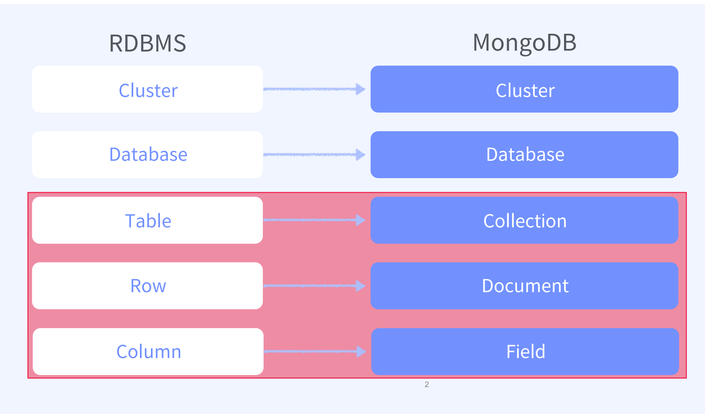
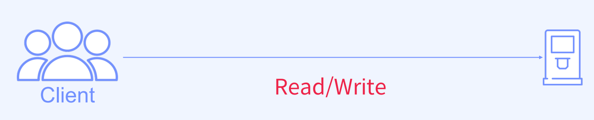
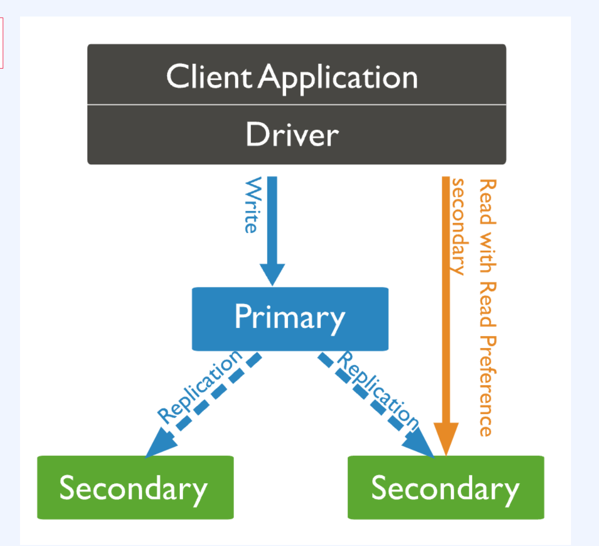
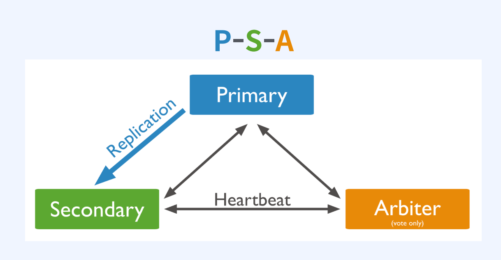
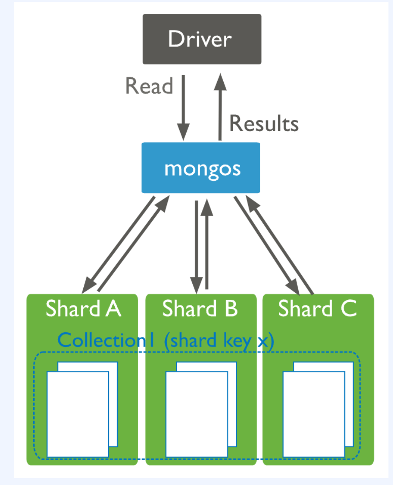
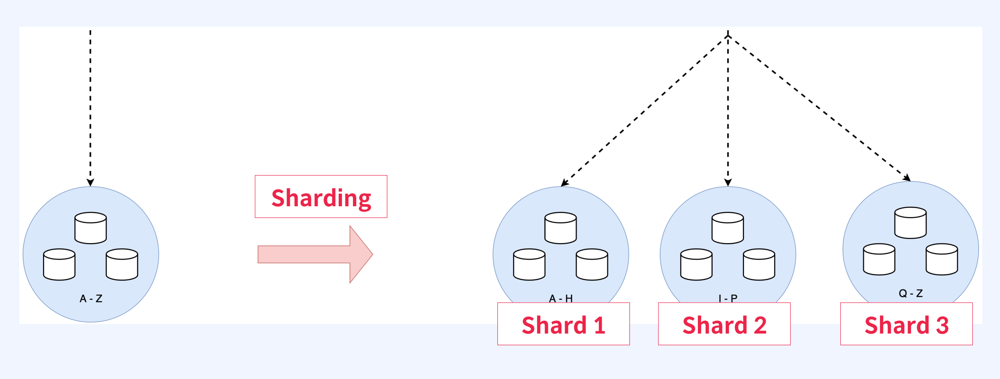
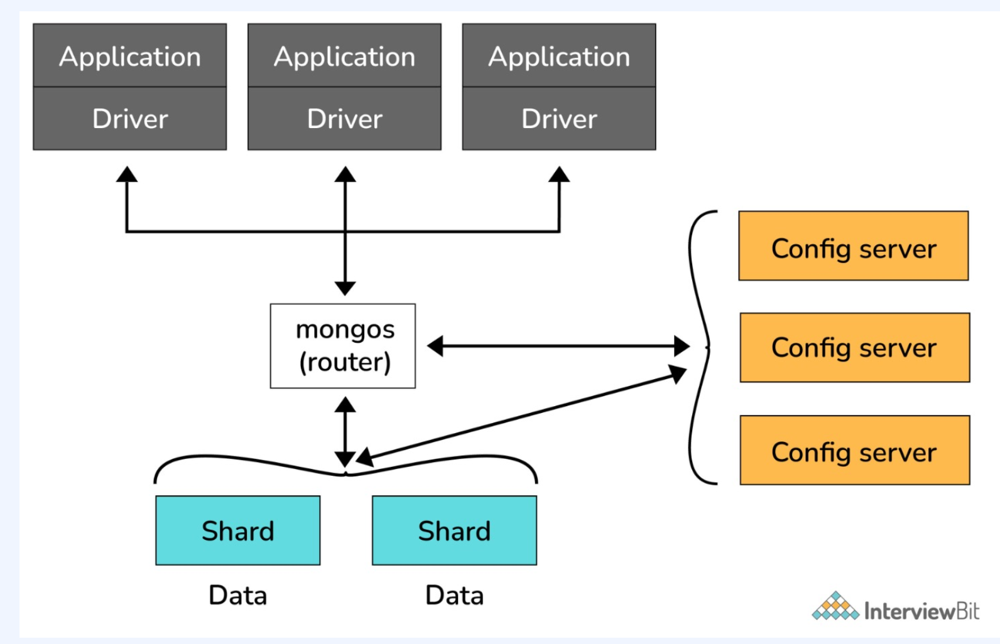
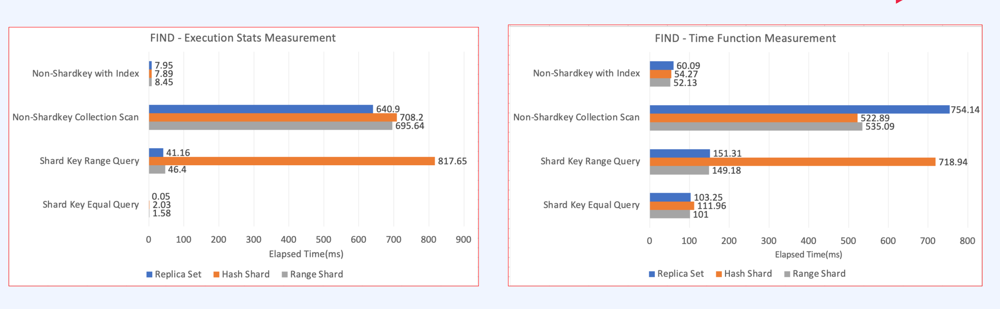
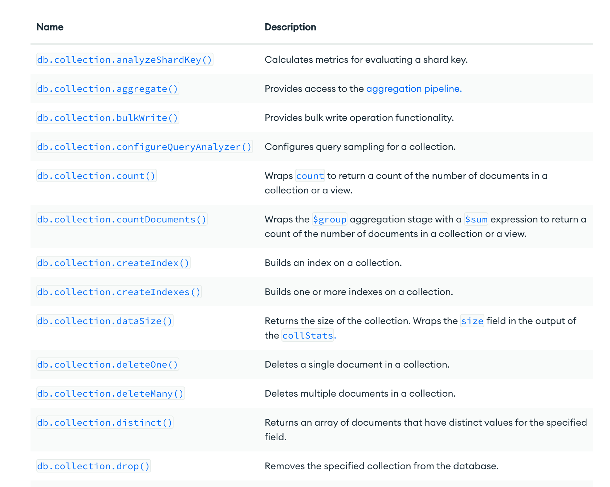

# MongoDB

[toc]


- Schema가 자유롭다.

- HA와 Scale-Out Solution을 자체적으로 지원해서 확장이 쉽다.
- Secondary Index를 지원하는 NoSQL이다.
- 다양한 종류의 Index를 제공한다.
- 응답 속도가 빠르다.
- 배우기 쉽고 간편하게 개발이 가능하다.


## RDB VS MongoDB

### RDB의 장단점

장점

- 데이터 중복을 방지할 수 있다.
- Join의 성능이 좋다.
- 복잡하고 다양한 쿼리가 가능하다.
- 잘못된 입력을 방지할 수 있다.

단점

- 하나의 레코드를 확인하기 위해여러 테이블을 Join하여 가시성이 떨어진다.
-  스키마가 엄격해서 변경에 대한 공수가 크다.

* Scale-Outol 가능하지만, 설정이 어렵다.

- 확장할 때마다 App단의 수정이 필요하다
- 전통적으로 Scale-Up 위주로 확장했다.

### MongoDB 장단점

장점

* 데이터 접근성과 가시성이 좋다.

* Join없이 조회가 가능해서 응답 속도가 일반적으로 빠르다.

* 스키마 변경에 공수가 적다.

* 스키마가 유연해서 데이터 모델을 App의 요구사항에 맞게 데이터를 수용할 수 있다.
* HA와 Sharding에 대한 솔루션을 자체적으로 지원하고 있어 Scale-Out이 간편한다.
*  확장 시, Application의 변경사항이 없다

단점

- 데이터의 중복이 발생한다.
- 스키마가 자유롭지만, 스키마 설계를 잘해야 성능 저하를 피할 수 있다.

정리하자면,

- MongoDB는 Document 지향 Database이다.
- 데이터 중복이 발생할 수 있지만, 접근성과 가시성이 좋다.
- 스키마 설계가 어렵지만, 스키마가 유연해서 Application의 요구사항에 맞게 데이터를 수용할 수 있다.
- 분산에 대한 솔루션을 자체적으로 지원해서 Scale-Outo 쉽다.
- 확장 시, Application을 변경하지 않아도 된다.

# MongoDB 구조



## Database (RDB의 Database)

| Database | Description                                                  |
| -------- | ------------------------------------------------------------ |
| admin    | 인증과 권한 부여 역할이다. 일부 관리 작업을 하려면 admin Database에 대한 접근이 필요하다. |
| local    | 모든 mongod instance는 local database를 소유한다. oplog와 같은 replication 절차에 필요한 정보를 저장한다. startup_log와 같은 instance 진단 정보를 저장한다. local database 자체는 복제되지 않는다. |
| config   | sharded cluster에서 각 shard의 정보를 저장한다.              |

## Collection (Rdb의 Table)

- 동적 스키마를 갖고 있어서 스키마를 수정하려면 필드
   값을 추가/수정/삭제하면 된다.
- Collection 단위로 Index를 생성할 수 있다.
- Collection 단위로 Shard를 나눌 수 있다.

## Document (Rdb의 Row)

- JSON 형태로 표현하고 BSON(Binary JSON) 형태로 저장한다.
- 모든 Document에는 "_id” 필드가 있고, 없이 생성하면 Objectld 타입의 고유한 값을 저장한다.
- 생성 시, 상위 구조인 Database나 Collection이 없다면 먼저 생성하고 Document를 생성한다.
- Document의 최대 크기는 16MB이다.

## 정리

- Database > Collection > Document > Field 순으로 구조가 형성되어 있다.
- admin, config, local database는 MongoDB를 관리하는데 사용된다.
- Collection은 동적 스키마를 갖는다.
- Document는 JSON 형태로 표현되고 BSON 형태로 저장된다.

*  Document는 고유한 "_id" 필드를 항상 갖고 있다.

*  Document의 최대 크기는 16MB로 고정되어 있다.

# 몽고DB 배포 형태 (아키텍처

* Standalone
* ReplicaSet
* Sharded Cluster


## Standalone



## ReplicaSet




| Status    | Description                                                  |
| --------- | ------------------------------------------------------------ |
| Primary   | - Read/Write 요청 모두 처리할 수 있다. <br> - Write를 처리하는 유일한 멤버이다. <br> - Replica Set에 하나만 존재할 수 있다. |
| Secondary | - Read에 대한 요청만 처리할 수 있다. <br> - 복제를 통해 Primary와 동일한 데이터 셋을 유지한다. <br> - Replica Set에 여러개가 존재할 수 있다. |

아비터는 프라이머리 노드를 선출하기 위해 사용한다.

* 작은 리소스를 이용해서 하나 둔다. 
* 그러나 PSA보다는 PSS (세컨더리 여러개)가 더 좋다. 부하 분산 때문에.



OpLog라는 컬렉션을 이용해서 관리한다. 

- Replica Set은 HA 솔루션이다.
- 데이터를 들고 있는 멤버의 상태는 Primary와 Secondary가 있다.
- Secondary는 선출을 통해 과반수의 투표를 얻어서 Primary가 될 수 있다.
- Arbiter는 데이터를 들고 있지 않고 Primary 선출 투표에만 참여하는 멤버이다.
- Replica Set은 local database의 Oplog Collection을 통해 복제를 수행한다.


## Sharded Cluster



모든 샤드는 레플리카 셋으로 구성되어있다.



장점

- 용량의 한계를 극복할 수 있다.
- 데이터 규모와 부하가 크더라도 처리량이 좋다.
- 고가용성을 보장한다.
- 하드웨어에 대한 제약을 해결할 수 있다.

단점

- 관리가 비교적 복잡하다.
- Replica Set과 비교해서 쿼리가 느리다
  - 각각 샤드가 다른데이터를 가져가는데, 라우터가 샤드를 찾거나, 여러 샤드를 찾아서 머지해야 하기 때문에 느림 


### 샤드 vs 파티셔닝

Sharding

• 하나의 큰 데이터를 여러 서브셋으로 나누어 여러 인스턴스에 저장하는 기술

Partitioning

• 하나의 큰 데이터를 여러 서브셋으로 나누어 하나의 인스턴스의 여러 테이블로 나누어 저장하는 기술

### 레플리카셋 vs 샤드

Replica Set

* Replica Set은 각각 멤버가 같은 데이터 셋을 갖는다.

Sharded Cluster

*  Sharded Cluster는 각각Shard가 다른 데이터의서브셋을 갖는다.

레플리카는 고가용성(ha)를 위한것, 샤드는 분산처리를 위한 것

## 샤드 아키텍처



- Sharded Cluster는 MongoDB의 분산 Solution이다.
- Collection 단위로 Sharding이 가능하다.
- Sharding은 Shard Key를 선정해야하고 해당 필드에는 Index가 만들어져 있어야한다.
- 꼭 Router를 통해 접근한다.
- Range와 Hashed Sharding 두 가지 방법이 있다.
- 가능하면 Hashed Sharding을 통해 분산한다.


# Replica Set vs Sharded cluster 어떻게 배포할 것인가?

## 예시 1 매일 1GB씩 데이터가 증가하고 3년간 보관 > 환경에 따라 다르다.

| Storage      | Value                   |
| ------------ | ----------------------- |
| Data         | 1GB * 365 * 3year = 1TB |
| Index        | 1TB * 0.3 = 0.3TB       |
| local Backup | 0.1TB                   |
| Oplog        | 0.1TB                   |
| Total        | 2.7TB                   |

## 예시 2 -> Write 요청이 압도적으로 많은 서비스 + Sharded Cluster

| Storage      | Value                    |
| ------------ | ------------------------ |
| Data         | 1GB * 365 * 3year  = 1TB |
| Index        | 0.3TB                    |
| local Backup | 0.1TB                    |
| Oplog        | 0.1TB                    |
| Total        | 2.7TB                    |

• Replica Set은 Write에 대한 분산이 불가능하다.

## 예시 3) 논리적인 데이터베이스가 많은 경우 > 여러 Replica Set으로 분리

| Storage      | Value                   |
| ------------ | ----------------------- |
| Data         | permanently 1GB per day |
| Index        | 0.3TB                   |
| local Backup | 0.1TB                   |
| Oplog        | 0.1TB                   |
| Total        | 2.7TB                   |

## 샤드 vs 레플리카

| 배포 형태       | 장점                                                         | 단점                                                         |
| --------------- | ------------------------------------------------------------ | ------------------------------------------------------------ |
| Replica Set     | - 운영이 쉽다. <br> - 장애 발생시 문제 해결 및 복구가 쉽다. <br> - 서버 비용이 적게 든다. <br>- 성능이 좋다. <br/> - 개발 시 설계가 용이하다. <br/> | - Read에 대한 분산이 가능하지만, Write에 대한 분산은 불가능하다. |
| Sharded Cluster | - Write에 대한 분산이 가능하다. <br/> - Scale-Outo 가능하다. | - Replica Set의 모든 장점이 상대적으로 단점이 된다.          |



1. **Non-Shardkey with Index**: 인덱스를 사용하지만 샤드 키(shard key)를 사용하지 않는 쿼리 유형
   1. Replica Set: 매우 빠른 응답 시간을 보여줍니다 (7.95ms - 8.45ms).
   2. Range Shard: 응답 시간이 상당히 느립니다 (640.9ms - 708.2ms).
2. **Non-Shardkey Collection Scan**: 인덱스를 사용하지 않고 컬렉션을 전체 스캔하는 쿼리 유형
   1. Replica Set: 매우 느린 응답 시간을 보여줍니다 (640.9ms - 817.65ms).
   2. Range Shard: 응답 시간이 매우 느립니다 (522.89ms - 754.14ms).
3. **Shard Key Range Query**: 샤드 키를 기반으로 범위를 지정하여 쿼리하는 유형
   1. Replica Set: 중간 정도의 응답 시간을 보여줍니다 (41.16ms - 46.4ms).
   2. Range Shard: 응답 시간이 더 빠릅니다 (149.18ms - 718.94ms).
4. **Shard Key Equal Query**: 샤드 키에 특정 값을 지정하여 정확한 쿼리를 실행하는 유형
   1. Replica Set: 매우 빠른 응답 시간을 보여줍니다 (0.05ms - 2.03ms).
   2. Range Shard: 빠른 응답 시간을 보여줍니다 (101ms - 111.96ms).

Replica Set 설정은 일반적으로 Range Shard 설정보다 빠른 응답 시간을 가진다.


> 가능하면 레플리카 셋으로 배포하고, 레플리카 셋이 충족하지 못하면 샤드로 배포한다.


# MongoDB Stroage Engine

Storage Engine?

- 데이터가 메모리와 디스크에 어떻게 저장하고 읽을지 관리하는 컴포넌트이다.
- MySQL과 동일하게 Plugin 형태로 되어 있어 MongoDB도 다양한 storage Engine을 사용할 수 있다.
- MongoDB 3.2부터 MongoDB의 기본 Storage Engine은 WiredTiger이다. (기존에는 MMAPv1 사용)
- WiredTiger가 도입되면서 MongODB의 성능은 큰 폭으로 좋아졌다.

| 항목             | MMAPv1                                          | WiredTiger           |
| ---------------- | ----------------------------------------------- | -------------------- |
| Data Compression | 지원하지 않는다.                                | 지원한다.            |
| Lock             | 버전에 따라 Database 혹은 Collection Level Lock | Document 레벨의 Lock |


# MongoDB Atlas

원래 유료.

무료로 조금 사용 가능.

* https://www.mongodb.com/ko-kr/cloud/atlas/register


설치 후

```
brew install mongosh

mongosh "mongodb+srv://cluster0.0drotv9.mongodb.net/" --apiVersion 1 --username kim206gh
```


# 몽고 DB 레플리카 구성

 [Replica_Set.md](./Replica_Set.md) 

## 도커 컴포즈로 Replica Set 구성

`ocker-compose.yml` 파일을 구성하기 전 **Replica Set** 내부 인증을 위한 키 파일을 먼저 생성

```
openssl rand -base64 756 > mongodb.key

chmod 400 mongodb.key
```

해당 키 파일을 **Replica Set** 구성원들에 복사해 연결

`docker-compose.yml` 파일을 생성

```yaml
version: '3.8'
services:
  mongo1:
    image: mongo:latest
    hostname: mongo1
    container_name: mongo1
    restart: always
    ports:
      - 27017:27017
    volumes:
      - ./Users/ysk/db/mongo1/data:/data/db
      - ./mongodb.key:/etc/mongodb.key
    command: 'mongod --replSet myReplicaSet --keyFile /etc/mongodb.key --bind_ip_all'
  mongo2:
    image: mongo:latest
    hostname: mongo2
    container_name: mongo2
    restart: always
    depends_on:
      - mongo1
    ports:
      - 27018:27017
    volumes:
      - ./Users/ysk/db/mongo2/data:/data/db
      - ./mongodb.key:/etc/mongodb.key
    command: 'mongod --replSet myReplicaSet --keyFile /etc/mongodb.key --bind_ip_all'
  mongo3:
    image: mongo:latest
    hostname: mongo3
    container_name: mongo3
    restart: always
    depends_on:
      - mongo2
    ports:
      - 27019:27017
    volumes:
      - ./Users/ysk/db/mongo3/data:/data/db
      - ./mongodb.key:/etc/mongodb.key
    command: 'mongod --replSet myReplicaSet --keyFile /etc/mongodb.key --bind_ip_all'

networks:
  default:
    name: mongo-cluster
```

**`hostname`**

MongoDB는 **Replica Set** 구성하면서 연결된 IP 주소가 아닌 DNS host를 추천

*  IP 주소 변경으로 인해 내부 구성원을 변경하는 상황을 방지하기 위해서 DNS Host를 연결하여 내부 설정을 유기적으로 관리하기 위함

해당 구성을 위해 `/etc/hosts` 파일에 다음과 같이 추가

```
mongo1 127.0.0.1
mongo2 127.0.0.1
mongo3 127.0.0.1
```

**`volumes`**

생성한 `mongodb.key` 파일을 컨테이너 복사

**`command`**

각 옵션단위로 분석

- `--replSet`: 연결할 **Replica Set**의 이름
- `--keyFile`: 연결할 키 파일 이름
- `--bind_ip_all`: 모든 ip 주소에 접근 가능하도록 설정합니다.

`networks`에 생성한 Docker Network를 연결해주고 `dcoker-compose up -d` 명령어를 실행

**Replica set 초기 설정**

성공적으로 컨테이너가 생성됐다면 **Replica set** 설정을 진행

```shell
docker exec -it mongo1 mongosh --eval "rs.initiate({
 _id: \"myReplicaSet\",
 members: [
   {_id: 0, host: \"mongo1\"},
   {_id: 1, host: \"mongo2\"},
   {_id: 2, host: \"mongo3\"}
 ]
})"
```

`docker exec` 명령어를 통해 컨테이너 내부에서 입력된 명령을 실행

* 해당 명령은 프라이머리 노드에서 한번 실행

`rs.initiate`는 입력된 정보를 통해 **Replica set**을 구성하는 명령어 

```json
{
 _id: "설정한 Replica set 이름",
 members: [
   {_id: 0, host: "설정한 hostname"},
   ...
 ]
}
```

해당 명령어를 실행할 경우 `{ ok: 1 }`이 반환된다면 성공

#### 테스트 및 확인

모든 과정을 완료했다면 실행중인 3개의 컨테이터는 하나의 **Replica set**으로 구성

rs.status()` 명령어를 통해 구성원 목록을 포함하여 **Replica set**의 상태를 확인

```shell
docker exec -it mongo1 mongosh --eval "rs.status()"
```

정상적으로 실행중인 **Replica set**이라면 `Primary` 노드인 `mongo1` 이 종료되더라도

 `Secondary` 노드인 `mongo2` 나 `mongo3` 이 `Primary` 노드로 변경되어 정상적으로 실행

```shell
docker stop mongo1

docker exec -it mongo2 mongosh --eval "rs.status()"
```

* https://www.mongodb.com/docs/manual/replication/

* https://www.mongodb.com/docs/manual/tutorial/deploy-replica-set-with-keyfile-access-control/
* https://www.mongodb.com/compatibility/deploying-a-mongodb-cluster-with-docker


## 샤딩 구축

 [Sharding.md](./Sharding.md) 

## 도커 컴포즈 샤딩 구축

https://github.com/ylake/mongodb-cluster-docker-compose

* 클론해서 실행한다

# MongoDB 커넥션 설정

* https://www.mongodb.com/docs/manual/reference/connection-string/#connection-string-formats


# MongoDB Query

MongoDB Query Language(MQL)

## 몽고 쿼리 vs SQL 쿼리 :

 https://www.mongodb.com/docs/manual/reference/sql-comparison/

## Query Filter와 Operator

CRUD의 핵심


* https://www.mongodb.com/docs/manual/crud/#read-operations

쿼리 오퍼레이터

* https://www.mongodb.com/docs/manual/reference/operator/query/

## 유용한 함수들

https://www.mongodb.com/docs/manual/reference/method/js-collection/

