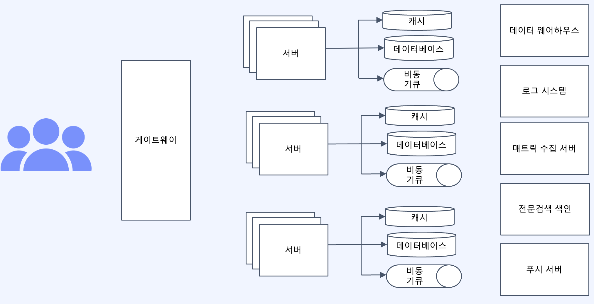
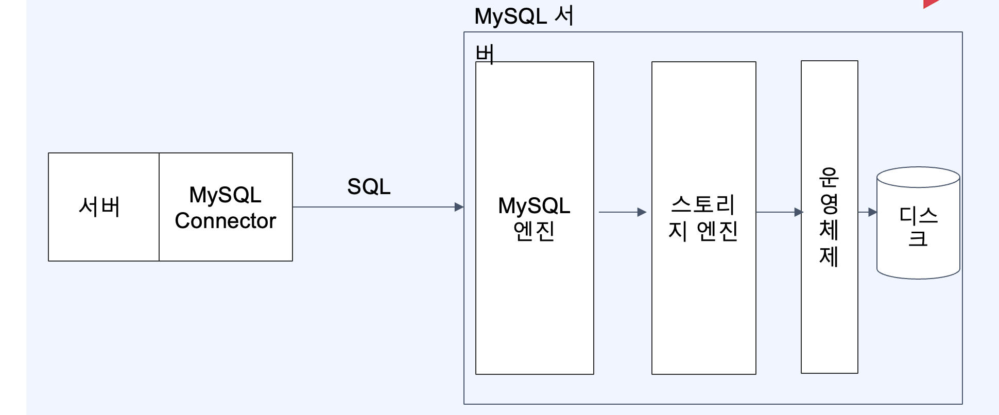
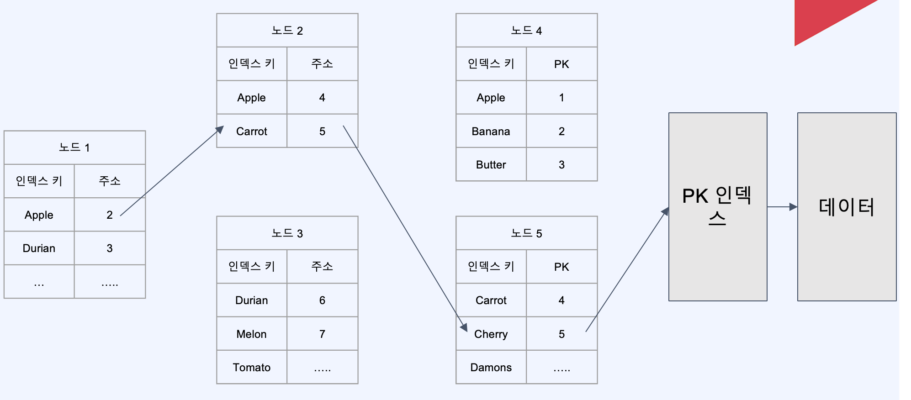

# Fc MySQL

[toc]


# 왜 데이터베이스가 병목일까


데이터베이스는 스케일아웃하기 어렵다.

* **데이터베이스는 데이터라는 상태를 관리하고 있어** **서버보다 스케일 아웃을 하기 위해서는 훨씬 많은 비용이 필요**

**현대 서버 아키텍처는 상태관리를 데이터베이스에 위임하고,** **서버는 상태관리를 하지 않는 방향으로 발전** 


# 대용량 시스템

대용량 트래픽 또는 대용량 데이터 처리는 왜 어렵다고 할까.

하나의 서버 또는 데이터베이스로 감당하기 힘든 부하

-> 다수의 서버와 데이터베이스를 마치 하나인 것처럼

그리고 시스텔이 발저함에 따라 팀이 커지고 도메이별로 여러 개의 마이크로 서비스들이 복자한 의존과계를 가지게 됩니다.

**대용량 시스템이 어려운 이유**

- 하나의 서버로 감당하기 힘들어 대부분 여러개의 서버 또는 데이터베이스를 사용함
- 여러개의 서버에서 유입되는 데이터의 일관성을 보장할 수 있어야함
- 코드 한줄이 데이터에 미치는 영향범위가 굉장히 커짐
- 여러 서비스들이 얽혀있어, 시스템 복잡도가 상당히 높음

**그렇다면 대용량 시스템은 어떠해야하는가?**

* 고가용성 \- 언제든 서비스를 이용할 수 있어야한다.

* 확장성 \- 시스템이 비대해짐에 따라 증가하는 데이터와 트래픽에 대응할 수 있어야한다.

* 관측가능성-  문제가 생겼을 때 빠르게 인지할 수 있어야하고 문제의 범위를 최소화 할 수 있어야 한다. 



# MySQL 아키텍처



* 서버에서 요청 SQL은 MySQL 엔진, 스토리지 엔진을 거쳐 운영체제를 통해 디스크에 접근하여 데이터를 서버에게 전달

* MySQL 엔진은 사람으로 비유하면 판단과 명령을 내리는 두뇌, 스토리지 엔진은 동작을 수행하는 팔과 다리라고 생각하시면 되요

MySQL 엔진은 접속을 처리하는 커넥션 핸들러, 쿼리 파서, 전처리기, 옵티마이저, 쿼리실행기 등의 구성요소들이 존재

* 쿼리파서 - SQL을 파싱하여 Syntax Tree를 만듬 이 과정에서 문법 오류 검사가 이루어짐

* 전처리기 
  * 쿼리파서에서 만든 Tree를 바탕으로 전처리 시작
  * 테이블이나 컬럼 존재 여부, 접근권한 등 Semantic 오류 검 사

쿼리파서, 전처리기는 컴파일 과정과 매우 유사하지만 SQL은 프로그래밍 언어처럼 컴파일 타임때 검증 할 수 없어 매번 구문 평가를 진행

**소프트파싱과 하드 파싱.**

소프트 파싱: SQL, 실행계획을 캐시에서 찾아 옵티 마이저 과정을 생략하고 실행 단계로 넘어감

하드 파싱: SQL, 실행계획을 캐시에서 찾지못해 옵 티마이저 과정을 거치고나서 실행단계로 넘어감

MySQL에는 소프트 파싱이 없다 - 하지만 5 버전까지는 쿼리캐시가 있었음

쿼리캐시는 SQL에 해당하는 데이터를 저장하는 것

*  쿼리캐시는 데이터를 캐시하기때문에 테이블의 데이터가 변경되면 캐시의 데이터도 함께 갱신시켜줘야함

왜 캐시를 없앴을까?

* 쿼리캐시는 소프트 파싱에 비해 조회성능은 더 높지만 캐시 데이터 관리에 더 높은 비용이 들어감(만료 정책 등 )


# JDBC 간단한 코드

```java
private Member insert(Member member) {
    SimpleJdbcInsert jdbcInsert = new SimpleJdbcInsert(namedParameterJdbcTemplate.getJdbcTemplate())
            .withTableName(TABLE)
            .usingGeneratedKeyColumns("id");
    SqlParameterSource params = new BeanPropertySqlParameterSource(member);
    var id = jdbcInsert.executeAndReturnKey(params).longValue();
    return Member.builder()
            .id(id)
            .nickname(member.getNickname())
            .email(member.getEmail())
            .birthday(member.getBirthday())
            .build();
}
private Member update(Member member) {
    var sql = String.format("UPDATE %s set email = :email, nickname = :nickname, birthday = :birthday WHERE id = :id", TABLE);
    SqlParameterSource params = new BeanPropertySqlParameterSource(member);
    namedParameterJdbcTemplate.update(sql, params);
    return member;
}
```


# 중요한 지연 시간(latency) 숫자

* https://colin-scott.github.io/personal_website/research/interactive_latency.html

### 빠른 작업 (나노초 단위)

- **L1 캐시 참조:** CPU가 가장 빠르게 데이터에 접근할 수 있는 곳으로, 1ns 걸립니다.
- **L2 캐시 참조:** L1 다음으로 빠른 메모리 접근 지점으로, 4ns가 소요됩니다.
- **분기 예측 실패:** CPU가 프로그램의 실행 경로를 잘못 예측했을 때, 복구하는 데 3ns가 걸립니다.
- **뮤텍스 잠금/해제:** 동시성을 관리하기 위한 뮤텍스 작업에는 17ns가 필요합니다.

### 중간 속도 작업 (마이크로초 단위)

- **주 메모리 참조:** RAM과 같은 주 메모리에 접근하는 데 100ns (0.1μs)가 소요됩니다.
- **Zippy로 1KB 압축:** 데이터를 압축하는 데 2,000ns (2μs) 정도 걸립니다.
- **네트워크 전송과 SSD 읽기:** 네트워크를 통한 데이터 전송 (11,000ns, 11μs) 및 SSD에서 랜덤 데이터 읽기 (16,000ns, 16μs) 등이 이 범주에 속합니다.

### 느린 작업 (밀리초 단위)

- **디스크 탐색:** 하드 드라이브에서 데이터를 찾는 데는 약 2ms (2,000,000ns)가 필요합니다.
- **대량 데이터 읽기:** SSD에서 1MB 데이터를 순차적으로 읽는 데 19μs (19,000ns, 0.019ms), 디스크에서는 474μs (474,000ns, 0.474ms)가 걸립니다.
- **데이터센터 내 왕복 시간:** 같은 데이터센터 내 데이터 왕복에는 약 500μs (500,000ns)가 필요합니다.
- **국제 네트워크 지연:** 캘리포니아에서 네덜란드까지의 데이터 패킷 왕복 시간은 대략 150ms (150,000,000ns)입니다.

1. **밀리초(Millisecond, ms)**
   - **1밀리초(ms) = 1/1,000초** (0.001 seconds)
   - 1초는 1,000밀리초와 같습니다.
2. **마이크로초(Microsecond, μs)**
   - **1마이크로초(μs) = 1/1,000,000초** (0.000001 seconds)
   - 1밀리초는 1,000마이크로초와 같습니다.
3. **나노초(Nanosecond, ns)**
   - **1나노초(ns) = 1/1,000,000,000초** (0.000000001 seconds)
   - 1마이크로초는 1,000나노초와 같습니다.

**1초**는 **1,000밀리초**, **1,000,000마이크로초**, **1,000,000,000나노초**

# 인덱스

검색이 빠른 자료구조의 종류

* HashMap
  * -단건 검색 속도 O(1)
  * -그러나 범위 탐색은 O(N)
  * -전방 일치 탐색 불가 ex) like ‘AB%’

* List
  * -정렬되지 않은 리스트의 탐색은 O(N)
  * -정렬된 리스트의 탐색은 O(logN)
  * -정렬되지 않은 리스트의 정렬 시간 복잡도는 O(N) ~ O(N * logN)
  * -삽입 / 삭제 비용이 매우 높음

* Tree
  * -트리 높이에 따라 시간 복잡도가 결정됨
  * -트리의 높이를 최소화하는 것이 중요!
  * -한쪽으로 노드가 치우치지 않도록 균형을 잡아주는 트리 사용
  * ex) Red-Black Tree, B+Tree

* B + Tree
  * -삽입 / 삭제시 항상 균형을 이룸
  * -하나의 노드가 여러 개의 자식 노드를 가질 수 있음
  * -리프노드에만 데이터 존재
  * -연속적인 데이터 접근 시 유리



* 그림. B+Tree

## 클러스터 인덱스

클러스터 인덱스(Clustered Index)란 데이터베이스의 테이블에서 데이터를 물리적으로 저장하는 순서와 인덱스의 순서가 일치하도록 구성된 인덱스

1. 클러스터 인덱스는 데이터 위치를 결정하는 키 값이다.

2. MySQL의 PK는 클러스터 인덱스다.

3. MySQL에서 PK를 제외한 모든 인덱스는 PK를가지고 있다. -> PK의 크기가 인덱스의 크기를 결정하는데 기여한다.
   * 세컨더리 인덱스만으로는 데이터를 찾아갈 수 없다 -> PK 인덱스를 항상 검색해야함
   * 세컨더리 인덱스들이 PK를 가지고 있어 커버링에 유리


#  TimeLine 부하 

트위터는 Push모델, 페이스북은 pull 모델을 사용


트위터와 페이스북은 각각의 타임라인을 구성하고 사용자에게 콘텐츠를 제공하는 방식에서 차이를 보입니다. 

### Push 모델 (트위터)

- **Push 모델**에서는 콘텐츠 생성자가 새로운 콘텐츠를 게시할 때, 이 콘텐츠가 자동으로 구독자의 타임라인으로 "푸시"됩니다. 이 모델은 실시간성이 중요한 서비스에서 흔히 사용되며, 사용자는 별도의 요청을 하지 않아도 최신 콘텐츠를 바로 볼 수 있습니다.
- 트위터는 이러한 Push 모델을 사용하여 사용자의 피드에 실시간으로 콘텐츠를 제공합니다. 사용자가 특정 계정을 팔로우하면, 그 계정이 새로운 트윗을 게시할 때마다 즉시 사용자의 타임라인에 나타납니다.

### Pull 모델 (페이스북)

- **Pull 모델**에서는 사용자가 콘텐츠를 보고 싶을 때 요청을 보내고(즉, "당겨오는" 행위), 그 요청에 따라 콘텐츠가 제공됩니다. 이 모델은 사용자가 새로운 콘텐츠를 볼 준비가 되었을 때, 서버로부터 데이터를 "끌어오는" 방식으로 작동합니다.
- 페이스북은 사용자가 타임라인을 새로고침하거나 접속할 때마다 새로운 콘텐츠를 끌어와서 보여주는 Pull 모델을 사용합니다. 이 방식은 사용자가 새로운 콘텐츠를 요청할 때마다 최적화된 콘텐츠를 선택해서 보여줄 수 있는 장점이 있습니다. 페이스북의 알고리즘은 사용자의 과거 상호작용, 관심사 등을 분석하여 관련성 높은 콘텐츠를 제공하는 데 초점을 맞춥니다.


비교

* 정합성과 성능 : Pull Model은 원본 데이터를 직접 참조하므로, 정합성 보장에 유리. 그러나 Follow가 많은 회원일수록 느림 

- **실시간성**: Push 모델은 실시간으로 콘텐츠를 제공하는 데 유리하며, 사용자는 새로운 콘텐츠를 즉시 확인할 수 있습니다. 반면, Pull 모델은 사용자가 콘텐츠를 요청할 때마다 최신 정보를 제공합니다.
- **커스터마이제이션**: Pull 모델은 사용자의 행동과 선호도에 기반하여 콘텐츠를 더 잘 맞춤화할 수 있습니다. Push 모델에서도 사용자가 팔로우하는 계정에 따라 커스터마이징되지만, Pull 모델은 보다 세밀한 알고리즘을 통해 사용자 경험을 최적화할 수 있습니다.
- **서버 부하**: Push 모델은 실시간 업데이트를 지원하기 위해 서버에 더 많은 부하를 줄 수 있습니다. 반면, Pull 모델은 사용자의 요청에 따라 데이터를 제공하기 때문에, 요청이 분산되어 서버 부하를 조금 더 균등하게 만들 수 있습니다.