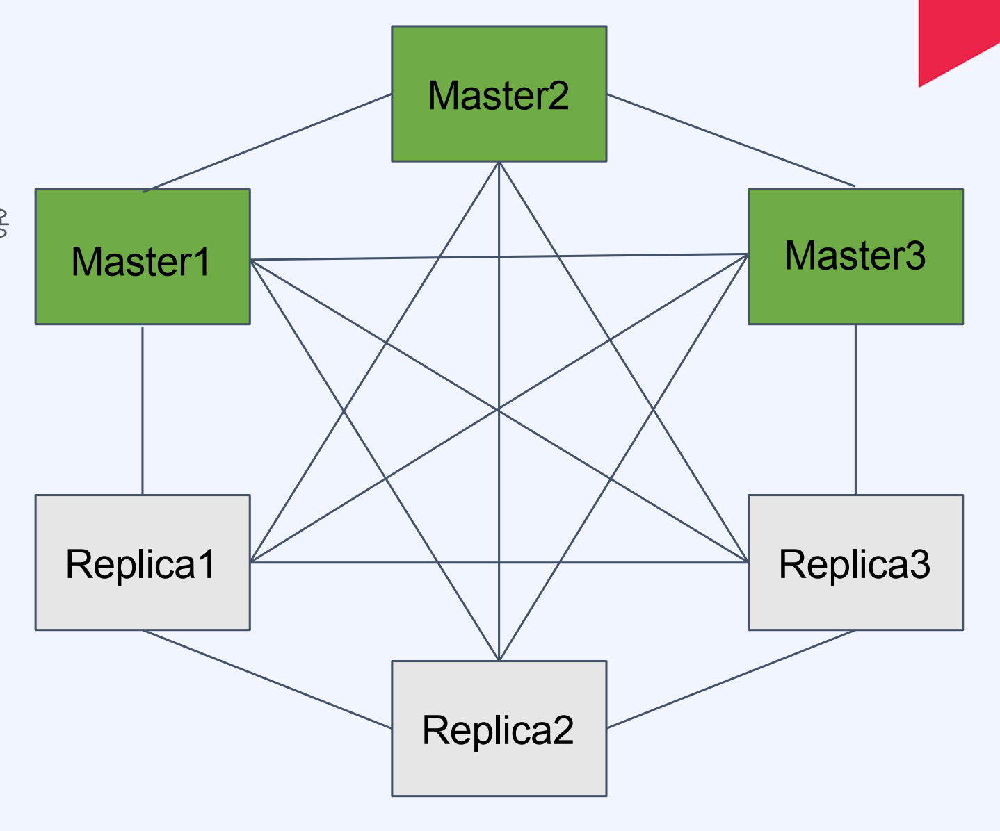

# Redis

[toc]


redis 실행 도커 명령어

```
docker run --name my-redis -p 6379:6379 redis -d
```


# 레디스 자료구조


## Strings
• 가장 기본적인 데이터 타입으로 제일 많이 사용됨
• 바이트 배열을 저장(binary-safe)
• 바이너리로 변환할 수 있는 모든 데이터를 저장 가능(JPG와 같은 파일 등)
• 최대 크기는 512MB

명령어

| 명령어 | 기능                                            | 예제                        |
| ------ | ----------------------------------------------- | --------------------------- |
| SET    | 특정 키에 문자열 값을 저장한다.                 | SET say hello               |
| GET    | 특정 키의 문자열 값을 얻어온다.                 | GET say                     |
| INCR   | 특정 키의 값을 Integer로 취급하여 1 증가시킨다. | INCR mycount                |
| DECR   | 특정 키의 값을 Integer로 취급하여 1 감소시킨다. | DECR mycount                |
| MSET   | 여러 키에 대한 값을 한번에 저장한다.            | MSET mine milk yours coffee |
| MGET   | 여러 키에 대한 값을 한번에 얻어온다.            | MGET mine yours             |

## Lists

Linked-list 형태의 자료구조(인덱스 접근은 느리지만 데이터 추가/삭제가 빠름)
• Queue와 Stack으로 사용할 수 있음

| 명령어 | 기능                                              | 예제                |
| ------ | ------------------------------------------------- | ------------------- |
| LUSH   | 리스트의 왼쪽(head)에 새로운 값을 추가한다.       | LPUSH mylist apple  |
| RPUSH  | 리스트의 오른쪽(tail)에 새로운 값을 추가한다.     | RPUSH mylist banana |
| LLEN   | 리스트에 들어있는 아이템 개수를 반환한다.         | LLEN mylist         |
| RANGE  | 리스트의 특정 범위를 반환한다.                    | RANGE mylist 0 - 1  |
| LPOP   | 리스트의 왼쪽(head)에서 값을 삭제하고 반환한다.   | LPOP mylist         |
| RPOP   | 리스트의 오른쪽(tail)에서 값을 삭제하고 반환한다. | RPOP mylist         |

## Sets

순서가 없는 유니크한 값의 집합

*  검색이 빠름

*  개별 접근을 위한 인덱스가 존재하지 않고, 집합 연산이 가능(교집합, 합집합 등)

| 명령어    | 기능                                        | 예제                  |
| --------- | ------------------------------------------- | --------------------- |
| SADD      | Set에 데이터를 추가한다.                    | SADD myset apple      |
| SREM      | Set에서 데이터를 삭제한다.                  | SREM myset apple      |
| SCARD     | Set에 저장된 아이템 개수를 반환한다.        | SCARD myset           |
| SMEMBERS  | Set에 저장된 아이템들을 반환한다.           | SMEMBERS myset        |
| SISMEMBER | 특정 값이 Set에 포함되어 있는지를 반환한다. | SISMEMBER myset apple |

## Hashes

하나의 key 하위에 여러개의 field-value 쌍을 저장

* 여러 필드를 가진 객체를 저장하는 것으로 생각할수 있음

*  HINCRBY 명령어를 사용해 카운터로 활용 가능


| 명령어  | 기능                                                         | 예제                        |
| ------- | ------------------------------------------------------------ | --------------------------- |
| HSET    | 한개 또는 다수의 필드에 값을 저장한다.                       | HSET user1 name bear age 10 |
| HGET    | 특정 필드의 값을 반환한다.                                   | HGET user1 name             |
| HMGET   | 한개 이상의 필드 값을 반환한다.                              | HMGET user1 name age        |
| HINCRBY | 특정 필드의 값을 Integer로 취급하여 지정한 숫자를 증가시킨다. | HINCRBY user1 viewcount 1   |
| HDEL    | 한개 이상의 필드를 삭제한다.                                 | HDEL user1 name age         |

## Sorted Sets

Set과 유사하게 유니크한 값의 집합

*  각 값은 연관된 score를 가지고 정렬되어 있음
* 정렬된 상태이기에 빠르게 최소/최대값을 구할 수 있음
* 순위 계산, 리더보드 구현 등에 활


| 명령어   | 기능                                                        | 예제                           |
| -------- | ----------------------------------------------------------- | ------------------------------ |
| ZADD     | 한개 또는 다수의 값을 추가 또는 업데이트한다.               | ZADD myrank 10 apple 20 banana |
| ZRANGE   | 특정 범위의 값을 반환한다. (오름차순으로 정렬된 기준)       | ZRANGE myrank 0 1              |
| ZRANK    | 특정 값의 위치(순위)를 반환한다. (오름차순으로 정렬된 기준) | ZRANK myrank apple             |
| ZREVRANK | 특정 값의 위치(순위)를 반환한다. (내림차순으로 정렬된 기준) | ZREVRANK myrank apple          |
| ZREM     | 한개 이상의 값을 삭제한다.                                  | ZREM myrank apple              |

## Bitmaps

비트 벡터를 사용해 N개의 Set을 공간 효율적으로 저장

*  하나의 비트맵이 가지는 공간은 4,294,967,295(2^32-1)
* 비트 연산 가능

| 명령어   | 기능                                                        | 예제                             |
| -------- | ----------------------------------------------------------- | -------------------------------- |
| SETBIT   | 비트맵의 특정 오프셋에 값을 변경한다.                       | SETBIT visit 10 1                |
| GETBIT   | 비트맵의 특정 오프셋의 값을 반환한다.                       | GETBIT visit 10                  |
| BITCOUNT | 비트맵에서 set(1) 상태인 비트의 개수를 반환한다.            | BITCOUNT visit                   |
| BITOP    | 비트맵들간의 비트 연산을 수행하고 결과를 비트맵에 저장한다. | BITOP AND result today yesterday |

## HyperLogLog

유니크한 값의 개수를 효율적으로 얻을 수 있음

* 확률적 자료구조로서오차가 있으며, 매우 큰 데이터를 다룰 때사용
* 18,446,744,073,709,551,616(2^64)개의 유니크 값을 계산 가능
* 12KB까지 메모리를 사용하며 0.81%의 오차율을 허

| 명령어  | 기능                                                         | 예제                         |
| ------- | ------------------------------------------------------------ | ---------------------------- |
| PFADD   | HyperLogLog에 값들을 추가한다.                               | PFADD visit Jay Peter Jane   |
| PFCOUNT | HyperLogLog에 입력된 값들의 cardinality(유일값의 수)를 반환한다. | PFCOUNT visit                |
| PFMERGE | 다수의 HyperLogLog를 병합한다.                               | PFMERGE result visit1 visit2 |


# Redis를 이용한 분산환경 세션스토어

```groovy
dependencies {
    implementation 'org.springframework.session:spring-session-data-redis' # 이것이 있어야 함 
    implementation 'org.springframework.boot:spring-boot-starter-data-redis'
    implementation 'org.springframework.boot:spring-boot-starter-web'
    testImplementation 'org.springframework.boot:spring-boot-starter-test'
}
```

```yml
spring:
  session:
    storage-type: redis # 설정
  redis:
    host: localhost
    port: 6379
```


세션(Session)

* 네트워크 상에서 두 개 이상의 통신장치간에유지되는 상호 연결
* 연결된 일정 시간 동안 유지되는 정보를 나타냄
* 적용 대상에 따라 다른 의미를 가짐

Web 로그인 세션

* Web 상에서 특정 유저가 로그인했음을나타내는 정보
* 브라우저는 Cookie를, 서버는 해당 Cookie에 연관된 세션 정보를 저장한다
* 유저가 로그아웃하거나세션이 만료될 때 까지 유지되어 유저에 특정한 서비스 가능

## 분산 환경에서의 세션 처리

*  Server는 세션 정보를 저장해야 함
*  Server가 여러 대라면 최초 로그인한 Server가 아닌 Server는 세션 정보를 알지 못함
*  세션 정보를 Server간에 공유할 방법이 필요(Session Clustering)


분산 환경에서의 세션 처리 - Redis 사용

*  세션 데이터는 단순 key-value 구조
* 세션 데이터는 영속성이 필요 없음
* 세션 데이터는 변경이 빈번하고 빠른 액세스 속도가 필요

## 세션 서버의 역할

* 세션 생성: 요청이 들어왔을 때 세션이 없다면 만들어서 응답에 set-cookie로 넘겨줌
* 세션 이용: 요청이 들어왔을 때 세션이 있다면 해당 세션의 데이터를 가져옴
* 세션 삭제: 타임아웃이나명시적인 로그아웃API를 통해 세션을 무효화 함

> 모든 요청에 대해서 cookie를 파싱해 확인하고, 
>
> 세션 생성 시에는 set-cookie 값까지 설정해야 함.

**HttpSession**

*  세션을 손쉽게 생성하고 관리할 수 있게 해주는 인터페이스
*  UUID로 세션 ID를 생성
*  JSESSIONID라는 이름의 cookie를 설정해 내려줌

```java
@RestController
public class LoginContoller {

    @GetMapping("/login")
    public String login(HttpSession session, @RequestParam String name) {
        session.setAttribute("name", name);

        return "saved.";
    }

    @GetMapping("/myName")
    public String myName(HttpSession session) {
        String myName = (String)session.getAttribute("name");

        return myName;
    }
    
}
```


# 캐시

캐싱 관련 개념들

* 캐시 적중(Cache Hit): 캐시에 접근해 데이터를 발견함
* 캐시 미스(Cache Miss): 캐시에 접근했으나 데이터를 발견하지 못함
* 캐시 삭제 정책(Eviction Policy): 캐시의 데이터 공간 확보를 위해 저장된 데이터를 삭제
* 캐시 전략: 환경에 따라 적합한 캐시 운영 방식을 선택할 수 있음(Cache-Aside, Write-Through..)

## 캐시 전략

### Cache-Aside(Lazy Loading)

항상 캐시를 먼저 체크하고, 없으면 원본(ex: DB)에서 읽어온 후에 캐시에 저장함

* 장점: 필요한 데이터만 캐시에 저장되고, Cache Miss가 있어도 치명적이지 않음.
* 단점: 최초 접근은 느림, 업데이트 주기가 일정하지 않기 때문에 캐시가 최신 데이터가 아닐 수 있음


### Write-Through

데이터를 쓸 때 항상 캐시를 업데이트하여최신 상태를 유지함.

* 장점: 캐시가 항상 동기화되어 있어 데이터가 최신이다.
* 단점: 자주 사용하지 않는 데이터도 캐시되고, 쓰기 지연시간이 증가한다.

### Write-Back

* 데이터를 캐시에만 쓰고, 캐시의 데이터를 일정 주기로 DB에 업데이트
*  장점: 쓰기가 많은 경우 DB 부하를 줄일 수 있음.
*  단점: 캐시가 DB에 쓰기 전에 장애가 생기면 데이터 유실 가능.

## 데이터 제거 방식 - 캐시에서 어떤 데이터를 언제 제거할 것인가?


*  Expiration: 각 데이터에 TTL(Time-To-Live)을 설정해 시간 기반으로 삭제
* Eviction Algorithm: 공간을 확보해야 할 경우 어떤 데이터를 삭제할지 결정하는 방식
  * LRU(Least Recently Used): 가장 오랫동안 사용되지 않은 데이터를 삭제
  * LFU(Least Frequently Used): 가장 적게 사용된 데이터를 삭제(최근에 사용되었더라도)
  * FIFO(First In First Out): 먼저 들어온 데이터를 삭제


## Spring의 캐시 추상화
• CacheManager를 통해 일반적인 캐시 인터페이스 구현(다양한 캐시 구현체가 존재)
• 메소드에 캐시를 손쉽게 적용 가능

```java
@Cacheable
int getCache(String id);
```


@Cacheable : 메소드에 캐시를 적용한다. (Cache-Aside 패턴 수행)
@CachePut :  메소드의 리턴값을 캐시에 설정한다.
@CacheEvict :  메소드의 키값을 기반으로 캐시를 삭제한다.


Redis CacheMAnager 설정

```java

@Configuration
public class RedisCacheConfig {

	@Bean
	public RedisCacheManager cacheManager(RedisConnectionFactory connectionFactory) {
		RedisCacheConfiguration configuration = RedisCacheConfiguration.defaultCacheConfig()
			.disableCachingNullValues()
			.entryTtl(Duration.ofSeconds(10))   // 기본 TTL
			.computePrefixWith(CacheKeyPrefix.simple())
			.serializeKeysWith(
				RedisSerializationContext.SerializationPair.fromSerializer(new StringRedisSerializer())
			);

		HashMap<String, RedisCacheConfiguration> configMap = new HashMap<>();
		configMap.put("userAgeCache", RedisCacheConfiguration.defaultCacheConfig()
			.entryTtl(Duration.ofSeconds(5)));  // 특정 캐시에 대한 TTL

		return RedisCacheManager
			.RedisCacheManagerBuilder
			.fromConnectionFactory(connectionFactory)
			.cacheDefaults(configuration)
			.withInitialCacheConfigurations(configMap)
			.build();
	}

}

RedisCacheManager는 org.springframework.cache의 CacheManager를 구현한다! 
```


# 게임 리더보드 만들기 - Sorted Sets을 이용한 리더보드

* 게임이나 경쟁에서 상위 참가자의 랭킹과 점수를 보여주는 기능
* 순위로 나타낼 수 있는 다양한 대상에 응용(최다 구매 상품, 리뷰 순위 등)

리더보드의 동작(API 관점)

*  점수 생성/업데이트 => ex: SetScore(userId, score)
*  상위 랭크 조회(범위 기반 조회) => ex: getRange(1~10)
*  특정 대상 순위 조회(값 기반 조회) => ex: getRank(userId


# Redis 백업


## RDB (Redis Database)를 사용한 백업

특정 시점의 스냅샷으로 데이터 저장
재시작 시 RDB 파일이 있으면 읽어서 복구


**장점**

* 작은 파일 사이즈로 백업 파일 관리가 용이(원격지 백업, 버전 관리 등)
* fork를 이용해 백업하므로 서비스 중인 프로세스는 성능에 영향 없음
* 데이터 스냅샷 방식이므로 빠른 복구가 가능

**단점**

* 스냅샷을 저장하는 시점 사이의 데이터 변경사항은 유실될 수 있음
* fork를 이용하기 때문에 시간이 오래 걸릴 수 있고, CPU와 메모리 자원을 많이 소모
* 데이터 무결성이나 정합성에 대한 요구가 크지 않은 경우 사용 가능 (마지막 백업 시 에러 발생 등의 문제)

설정파일이 없어도 기본값으로 RDB를 활성화되어 있음
• 설정 파일 만드려면 템플릿을 받아서 사용 (https://redis.io/docs/management/config/)

저장 주기 설정(Ex: 60초마다 10개 이상의 변경이 있을 때 수행

```
save 60 10
```

Docker를 사용해 Redis 설정 파일 적용하기
docker run 사용 시 -v 옵션을 이용해 디렉토리 또는 파일을 마운팅할 수 있음
redis 이미지 실행 시 redis-server에 직접 redis 설정파일 경로 지정 가능

```shell
docker run -v /my/redis.conf:/redis.conf --name my-redis redis redis-server /redis.conf
```

## AOF를 사용한 백업

AOF(Append Only File)를 사용한 백업

* 모든 쓰기 요청에 대한 로그를 저장
* 재시작 시 AOF에 기록된 모든 동작을 재수행해서 데이터를 복구


**장점**
모든 변경사항이 기록되므로 RDB 방식 대비 안정적으로 데이터 백업 가능

AOF 파일은 append-only 방식이므로 백업 파일이 손상될 위험이 적음

실제 수행된 명령어가 저장되어 있으므로 사람이 보고 이해할 수 있고 수정도 가능

**단점**
RDB 방식보다 파일 사이즈가 커짐
RDB 방식 대비 백업&복구 속도가 느림(백업 성능은 fsync 정책에 따라 조절 가능)

**fsync 정책(appendfsync 설정 값)**

*  fsync() 호출은 OS에게 데이터를 디스크에 쓰도록 함
*  가능한 옵션과 설명
  *  always: 새로운 커맨드가 추가될 때마다 수행. 가장 안전하지만 가장 느림.
  *  everysec: 1초마다 수행. 성능은 RDB 수준에 근접.
  *  no: OS에 맡김. 가장 빠르지만 덜 안전한 방법.(커널마다 수행 시간이 다를 수 있음)

Multi Part AOF: Redis 7.0부터 AOF가 단일 파일에 저장되지 않고 여러 개가 사용됨

*  base file: 마지막 rewrite 시의 스냅샷을 저장
* incremental file: 마지막으로 base file이 생성된 이후의 변경사항이 쌓임
* manifest file: 파일들을 관리하기 위한 메타 데이터를 저장


# Redis Replication (복제)

백업만으로는장애 대비에 부족함(백업 실패 가능성, 복구에 소요되는 시간)

* Redis도 복제를 통해 가용성을 확보하고 빠른 장애조치가 가능
* master가 죽었을 경우 replica 중 하나를 master로 전환해 즉시 서비스 정상화 가능
* 복제본(replica)은 read-only 노드로 사용 가능하므로 traffic 분산도 가능

> Master 노드에는 RDB나 AOF를 이용한 백업 기능 활성화가 필수!
> (재시작 후에 비어있는 데이터 상태가 복제되지 않도록)


# Redis Sentinel

Redis에서 HA(high availability)를 제공하기 위한 장치

*  master-replica 구조에서 master가 다운 시 replica를 master로 승격시키는 auto-failover를 수행

Sentinel의 기능

* 모니터링
* 알림
* 자동 장애 복구
* 환경 설정 제공자


## Redis Sentinel 특징

*  SDOWN(Subjective down)과 ODOWN(Objective down)의 2가지 판단이 있음
  * SDOWN: Sentinel 1대가 down으로 판단(주관적)
  * ODOWN: 정족수가 충족되어 down으로 판단(객관적)
*  master 노드가 down된걸로 판단되기 위해서는 Sentinel 노드들이 정족수(Quorum)을 충족해야 함
*  클라이언트는Sentinel을 통해 master의 주소를 얻어내야 함


# Redis Cluster

확장성과 가용성을 위한 아키텍처

분산 시스템에 따라오는 문제

* 부분 장애
* 네트워크 실패
* 데이터 동기화
* 로드밸런싱(또는 discovery)
* 개발 및 관리의 복잡성

Redis Cluster가 제공하는 것

*  여러 노드에 자동적인 데이터 분산
* 일부 노드의 실패나 통신 단절에도 계속 작동하는 가용성
* 고성능을 보장하면서 선형 확장성을 제공

## Redis Cluster 특징
* full-mesh 구조로 통신
* cluster bus라는 추가 채널(port) 사용
* gossip protocol 사용
* hash slot을 사용한 키 관리
* DB0만 사용 가능
* multi key 명령어가 제한됨
* 클라이언트는 모든 노드에 접속



**Sentinel과의 차이점**

*  클러스터는 데이터 분산(샤딩)을 제공함
* 클러스터는 자동 장애조치를 위한 모니터링 노드(Sentinel)를 추가 배치할 필요가 없음
* 클러스터에서는 multi key 오퍼레이션이 제한됨
* Sentinel은 비교적 단순하고 소규모의 시스템에서 HA(고가용성)가 필요할 때 채택

## Cluster에서의 데이터를 분산하는 기준

특정 key의 데이터가 어느 노드(shard)에 속할 것인지 결정하는 메커니즘이 있어야 함

*  보통 분산 시스템에서 해싱이 사용됨
*  단순 해싱으로는 노드의 개수가 변할 때 모든 매핑이 새로 계산되어야 하는 문제가 있음

Redis는 16384개의 hash slot으로 key 공간을 나누어 관리

*  각 키는 CRC16 해싱 후 16384로 modulo 연산을 해 각 hash slot에 매핑
* hash slot은 각 노드들에게 나누어 분배됨

### 클라이언트의 데이터 접근
클러스터 노드는 요청이 온 key에 해당하는 노드로 자동 redirect를 해주지 않음

클라이언트는 MOVED 에러를 받으면 해당 노드로 다시 요청해야 함


## 클러스터를 사용할 때의 성능
클라이언트가 MOVED 에러에 대해 재요청을 해야 하는 문제

* => 클라이언트(라이브러리)는 key-node 맵을 캐싱하므로 대부분의 경우 발생하지 않음.
* 클라이언트는 단일 인스턴스의 Redis를 이용할 때와 같은 성능으로 이용 가능
*  분산 시스템에서 성능은 데이터 일관성(consistency)과 trade-off가 있음
  * => Redis Cluster는 고성능의 확장성을 제공하면서 적절한 수준의 데이터 안정성과 가용성을 유지하는 것을 목표로 설계됨.

## 클러스터의 데이터 일관성
Redis Cluster는 strong consistency를 제공하지 않음

* 높은 성능을 위해 비동기 복제를 하기 때문


> Ack와 복제는 순서가 정해져 있지 않으므로, 복제가 완료되기 전에 master가 죽으면 데이터는 유실된다.

## 클러스터의 가용성 - auto failover

일부 노드(master)가 실패(또는 네트워크 단절)하더라도 과반수 이상의 master가 남아있고, 

사라진 master의 replica들이 있다면 클러스터는 failover되어 가용한 상태가 된다.

*  node timeout동안 과반수의 master와 통신하지 못한 master는 스스로 error state로 빠지고 write 요청을 받지 않음.

## 클러스터의 제약사항

### 클러스터에서는 DB0만 사용 가능

Redis는 한 인스턴스에 여러 데이터베이스를 가질 수 있으며 디폴트는 16 => 설정) databases 16
Multi DB는 용도별로 분리해서 관리를 용이하게 하기 위한 목적
클러스터에서는해당 기능을 사용할 수 없고 DB0으로 고정된다.

### Multi key operation 사용의 제약

key들이 각각 다른 노드에 저장되므로 MSET과 같은 multi-key operation은 기본적으로 사용할 수 없다.

*  같은 노드 안에 속한 key들에 대해서는 multi-key operation이 가능
*  hash tags 기능을 사용하면 여러 key들을 같은 hash slot에 속하게 할 수 있음.
  * => key 값 중 {} 안에 들어간 문자열에 대해서만 해싱을 수행하는 원리


## 클러스터 구축

### 클러스터 설정파일

`cluster-enabled <yes/no>`: 클러스터 모드로 실행할지 여부를 결정

`cluster-config-file <filename>`: 해당 노드의 클러스터를 유지하기 위한 설정을 저장하는 파일로, 사용자가 수정하지 않음.

`cluster-node-timeout <milliseconds>`

*  특정 노드가 정상이 아닌 것으로 판단하는 기준 시간
*  이 시간동안 감지되지 않는 master는 replica에 의해 failover가 이루어짐

`cluster-replica-validity-factor <factor>`

*  master와 통신한지 오래된 replica가 failover를 수행하지 않게 하기 위한 설정
* (cluster-node-timeout * factor)만큼 master와 통신이 없었던 replica는 failover 대상에서 제외된다.

` cluster-migration-barrier <count>:`

* 한 master가 유지해야 하는 최소 replica의 개수
*  이 개수를 충족하는 선에서 일부 replica는 replica를 가지지 않은 master의 replica로 migrate될 수 있다.


# Redis 성능 튜닝

## 적절한 Eviction 정책 설정하기 

Eviction 정책이란?
• 메모리가 한계에 도달했을 때 어떤 조치가 일어날지 결정
• 처음부터 메모리가 부족한 상황을 만들지 않는 것이 중요함
• 캐시로 사용할 때는 적절한 eviction policy가 사용될 수 있음

Redis의 메모리 관리

* Memory 사용 한도 설정 => 지정하지 않으면 32bit에서는 3GB, 64bit에서는 0(무제한)으로 설정됨

maxmemory 도달한 경우 eviction 정책 설정

```
maxmemory-policy noeviction
```

maxmemory-policy 옵션

* noeviction: eviction 없음. 추가 데이터는 저장되지 않고 에러 발생(replication 사용시 master에 적용됨)
* allkeys-lru: 가장 최근에 사용된 키들을 남기고 나머지를 삭제(LRU: Least Recently Used)
* allkeys-lfu: 가장 빈번하게 사용된 키들을 남기고 나머지를 삭제(LFU: Least Frequently Used)
* volatile-lru: LRU를 사용하되 expire field가 true로 설정된 항목들 중에서만 삭제
* volatile-lfu: LFU를 사용하되 expire field가 true로 설정된 항목들 중에서만 삭제
* allkeys-random: 랜덤하게 삭제
* volatile-random: expire field가 true로 설정된 항목들 중에서 랜덤하게 삭제
* volatile-ttl: expire field가 true로 설정된 항목들 중에서 짧은 TTL 순으로 삭제


## 성능 측정 (redis-benchmark)
redis-benchmark 유틸리티를 이용해 Redis의 성능을 측정할 수 있음

```
# redis-benchmark [-h host] [-p port] [-c clients] [-n requests]
```

## Redis 성능에 영향을 미치는 요소들

`Network bandwidth & latency`: Redis의 throughput은 주로 network에 의해 결정되는 경우가 많음.

운영 환경에 런치하기 전에 배포 환경의 network 대역폭과 실제 throughput을 체크하는 것이 좋음.

`CPU`: 싱글 스레드로 동작하는 Redis 특성 상 CPU 성능이 중요. 코어 수보다는 큰 cache를 가진 빠른 CPU가 선호됨.

`RAM 속도 & 대역폭`: 10KB 이하 데이터 항목들에 대해서는 큰 영향이 없음.

`가상화 환경의 영향`: VM에서 실행되는 경우 개별적인 영향이 있을 수 있음(non-local disk, 오래된 hypervisor의 느린 fork 구현 등)

## 성능에 영향을 미치는 Redis 설정

* rdbcompression <yes/no>: RDB 파일을 압축할지 여부로, CPU를 절약하고 싶은 경우 no 선택
* rdbchecksum <yes/no>: 사용시 RDB의 안정성을 높일 수 있으나 파일 저장/로드 시에 10% 정도의 성능 저하 있음
* save: RDB 파일 생성시 시스템 자원이 소모되므로 성능에 영향이 있음

## SLOWLOG로 느린 쿼리 튜닝하기

SLOWLOG 설정

수행시간이 설정한 기준 시간 이상인 쿼리의 로그를 보여줌

측정 기준인 수행시간은 I/O 동작을 제외함


로깅되는 기준 시간(microseconds)

```
slowlog-log-slower-than 10000
```

slowlog 개수 확인

```
slowlog len
```

slowlog 조회

```
slowlog get [count]
```

=> 일련번호, 시간, 소요시간, 명령어, 클라이언트 IP, 클라이언트 이름


# Redis Streams

append-only log를 구현한 자료 구조

*  하나의 key로 식별되는 하나의 stream에 엔트리가 계속 추가되는 구조
*  하나의 엔트리는 entry ID + (key-value 리스트)로 구성
*  추가된 데이터는 사용자가 삭제하지 않는 한 지워지지 않음


## Redis Streams의 활용

* 센서 모니터링(지속적으로 변하는 데이터인 시간 별 날씨 수집 등)
*  유저별 알림 데이터 저장
*  이벤트 저장소

## Redis Streams의 명령어: 엔트리 추가

XADD: 특정 key의 stream에 엔트리를 추가한다.(해당 key에 stream이 없으면 생성)
```redis
XADD [key] [id] [field-value]
```

예제) user-notifications라는 stream에 1개의 엔트리를 추가하며 2개의 field-value 쌍을 넣음.

```
> ADD user-notifications * user-a hi user-b hello
"1672002019152-0"
```

## Redis Streams의 명령어: 엔트리 읽기(범위 기반)

XRANGE: 특정 ID 범위의 엔트리를 반환한다.

```
XRANGE [key] [start] [end]
```

## Redis Streams의 명령어: 엔트리 읽기(Offset 기반) - 1

XREAD: 한 개 이상의 key에 대해 특정 ID 이후의 엔트리를 반환한다. (동기 수행 가능)

```
XREAD BLOCK [milliseconds] STREAMS [key] [id]
```

# Redis의 데이터 충돌 최소화

CRDT(Conflict-Free Replicated Data Type)란?

분산 환경에서 여러 노드들 간에 복제되는 데이터 구조로 아래 3개 특성을 가짐

*  각 노드는 로컬에서 독립적으로 값을 업데이트할 수 있음
* 노드간에 발생할 수 있는 데이터 충돌은 해당 데이터 타입에 맞는 알고리즘이 해결
* 동일 데이터에 대해 노드들간에 일시적으로 다른 값을 가질 수 있지만 최종적으로는같아짐

 2011년에 등장했으며, 공유 문서 동시 편집 문제를 해결하려고 고안됨

## Redis의 충돌 해결
각 CRDB 인스턴스는 각자의 데이터셋에 vector clock을 유지함(vector clock: 데이터 일관성 관리를 위한 버전 정보)
• 동기화 요청이 왔을 때 해당 데이터의 vector clock을 비교해 old, new, concurrent로 분류함

*  concurrent일 때는 아래처럼 충돌 해소 로직을 수행
  *  CRDT인 경우에는 바로 해결 가능 (Ex: Counter)
  *  non-CRDT인 경우 LWW(Last Write Wins)를 적용 (Ex: String)
  * 같은 데이터에 대해 서로 다른 Command가 충돌하면 미리 정의된 규칙에 따름

## Redis의 충돌 해결 규칙 예제(Command 충돌 시)
APPEND vs DEL: update 동작인APPEND가 이김.

EXPIRE vs PERSIST: 긴 TTL을 가지는 PERSIST가 이김.

SADD vs SREM: 데이터 삭제보다 업데이트 동작인 SADD가 이김.