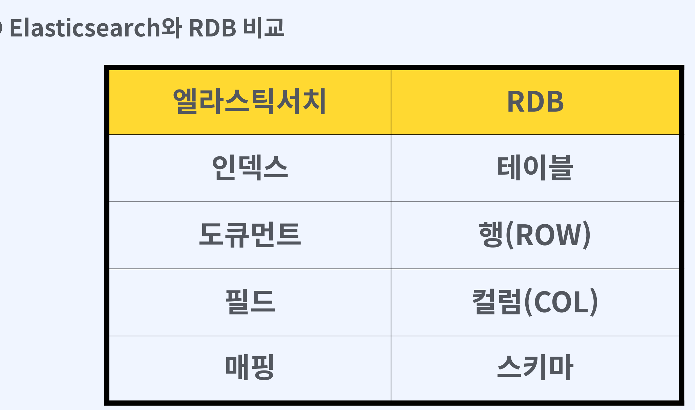
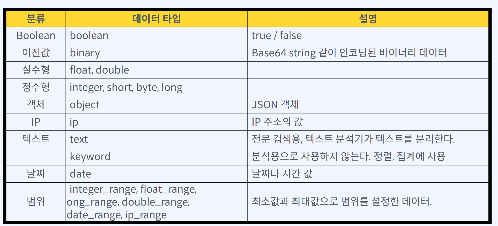
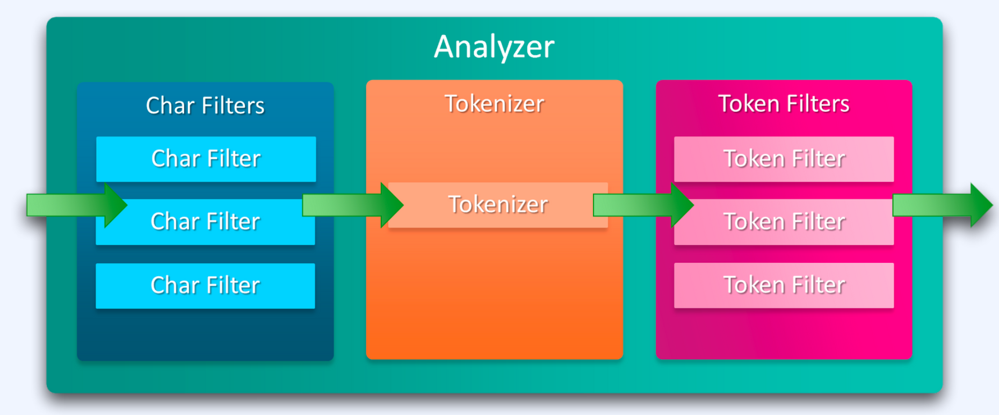
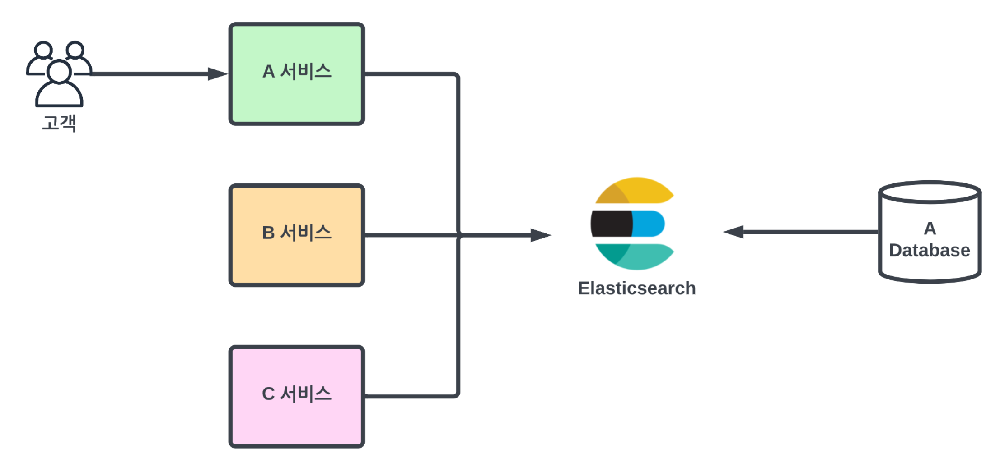
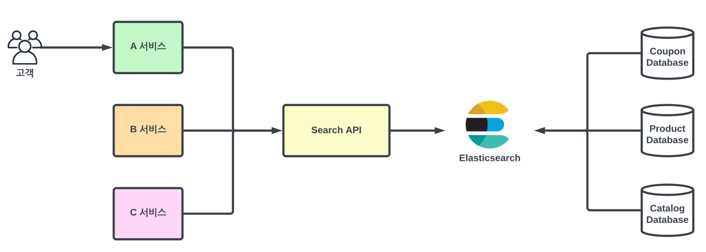
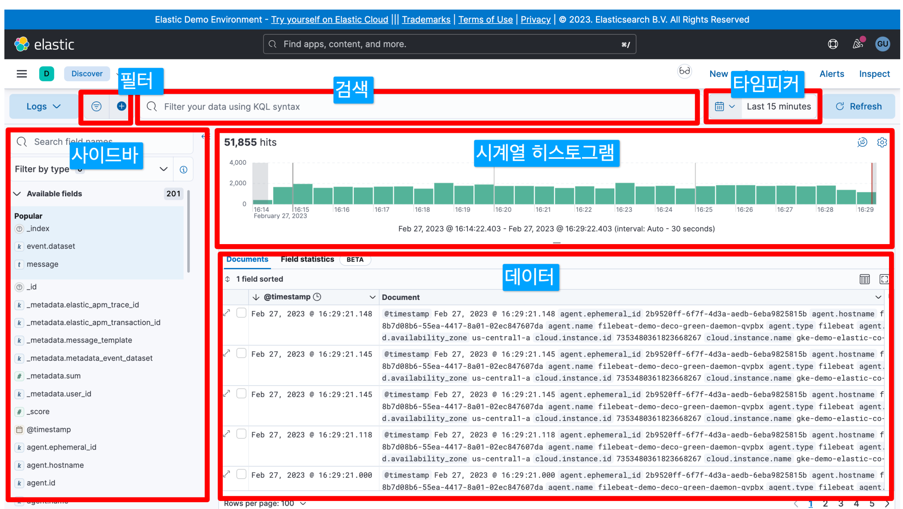
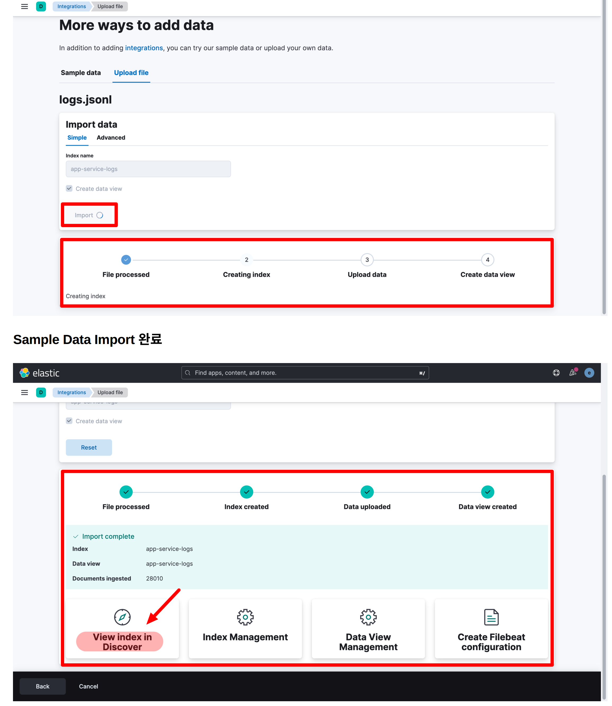
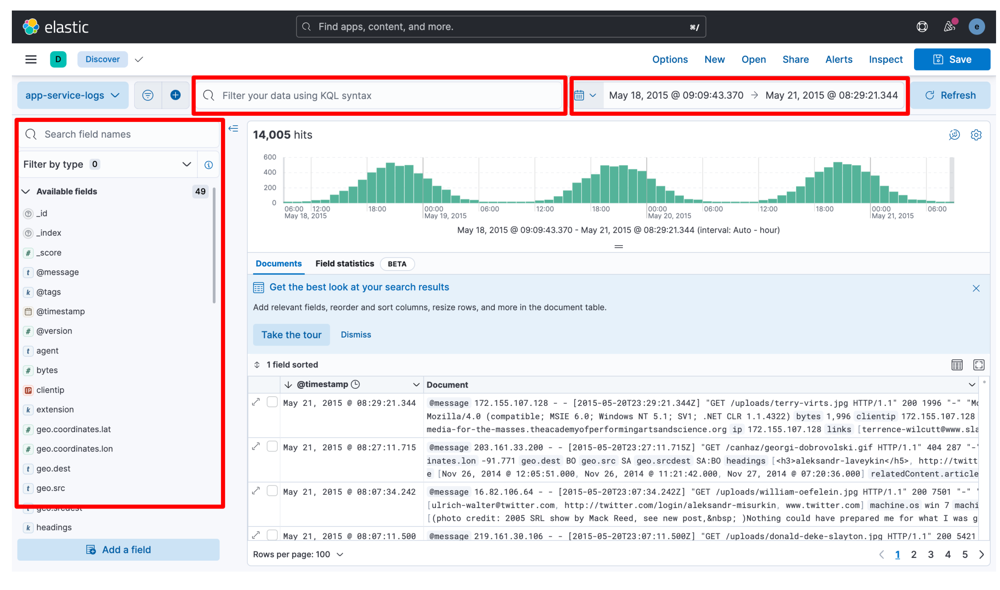

# 심플한 엘라스틱 서치

[toc]


# Elasticsearch란 무엇인가?


## Elasticsearch 용도

* 검색 엔진
*  분석 및 인사이트 제공
*  로그 분석
*  이벤트 분석
*  성능 분석
*  머신 러닝

## Elasticstack

Elasticsearch가 개발될 무렵 진행된 오픈소스 프로젝트
• 로그 수집 - 로그스테시
• 시각화 UI - 키바나
• 샤이 배넌과 친분이 있어 팀 결성 → 엘라스틱 스택
• Elasticsearch + Logstash + Kibana
• 2015년 패킷비트 회사 - 경량 데이터 수집기 개발
• 비츠 포함 - 네트워크 데이터, 시스템 지표, 성능, 로그

## Elasticsearch 특징

• 용도 - 검색 및 집계
• 스키마 - 자동 생성
• 인터페이스 - REST API
• 분산 적재 - 샤딩
• 트랜잭션 - 미지원
• JOIN - 미지원

## Elasticsearch 요청과 응답

• 모든 동작을 REST API로 제공
• 입력 - PUT
• 조회 - GET
• 삭제 - DELETE
• 수정 - POST

## Elasticsearch 기본 요소



### 인덱스 - 다큐먼트를 모은 논리적 구조

다큐먼트를 저장하는 논리적 단위
기존 RDB의 테이블과 유사
모든 도큐먼트는 인덱스에 포함된다.
하나의 인덱스에는 많은 다큐먼트 포함
하나의 인덱스에는 동일한 스키마
스키마에 따라 인덱스가 달라야 한다.

### 다큐먼트 - 데이터가 저장되는 기본 단위 =


### 매핑 - 스키마 구조

 관계형 데이터베이스의 스키마와 유사
 매핑의 종류
동적 매핑 (다이나믹 매핑)
ES가 데이터 타입을 보고 자동으로 매핑
인덱스 규모가 커지면 성능에 영향을 받는다.
직접 매핑 (명시적 매핑)
인덱스 매핑을 직접 하는 것
인덱스 생성시 매핑 설정
매핑 API 이용

## Elasticsearch 대표 데이터 타입




## 분석기




역인덱싱 - 긴 텍스트를 잘게 나눠서 인덱싱하는 기술
분석기 = 토크나이저 + 캐릭터 필터 + 토큰 필터


토크나이저 : 문자열을 받아서 분리 기준에 따라 문자열을 토큰 분리

캐릭터 필터  : 입력을 받은 원본 텍스트 문자열을 추가, 변경, 제거

토큰 필터 : 토큰을 추가하거나 수정 또는 제거

# docker elastic search 설치

```
version: '3.8'
services:
  elasticsearch:
    image: docker.elastic.co/elasticsearch/elasticsearch:8.6.0
    container_name: elasticsearch
    environment:
      - discovery.type=single-node
    ports:
      - "9200:9200"
    ulimits:
      memlock:
        soft: -1
        hard: -1
    networks:
      - elastic
    volumes:
      - /Users/ysk/db/elastic/data:/usr/share/elasticsearch/data
  kibana:
    image: kibana:8.6.0
    environment:
      - ELASTICSEARCH_URL=http://elasticsearch:9200
      - ELASTICSEARCH_HOSTS=http://elasticsearch:9200
      - ELASTICSEARCH_USERNAME=kibana_system # 무조건 이걸로 해야함 바뀜
      - ELASTICSEARCH_PASSWORD=kibana # 패스워드 설정
    ports:
      - "5601:5601"
    networks:
      - elastic

networks:
  elastic:
    name: elastic_network
    driver: bridge

```

비밀번호 초기화

```
docker exec -it elasticsearch /usr/share/elasticsearch/bin/elasticsearch-reset-password -u elastic -i

-- 
Password for the [elastic] user successfully reset.
New value: 21KDeAgVJb*CkTs_NdtR
```

보안 인증 파일을 로컬에 복제

```
docker cp elasticsearch:/usr/share/elasticsearch/config/certs/http_ca.crt .
```

인증 테스트

```
curl --cacert ./http_ca.crt -u elastic https://localhost:9200
```

확인

```
curl --cacert ./http_ca.crt -u elastic -X GET "https://localhost:9200/_cluster/health?pretty"
```


- kibana_system 비밀번호 변경방법

  엘라스틱 서치 컨테이너에서 `bin/elasticsearch-reset-password --username kibana_system -i`

```
 docker exec -it elasticsearch bin/elasticsearch-reset-password --username kibana_system -i
```


## 엘라스틱서치 유저 생성 및 권한

키바나를 접속해서 데이터를 생성 수정 삭제를 하려면 계정을 추가 해주어야 한다.

### 유저생성

```bash
#엘라스틱서치컨테이너에 접속
docker exec -it 엘라스틱서치컨테이너명 bash
#유저추가
elasticsearch-users useradd 유저명
#유저삭제
elasticsearch-users userdel 유저명
```

비밀번호 설정 후

### 권한설정

```bash
#권한설정
elasticsearch-users roles 유저명 -a 권한
#권한제거
elasticsearch-users roles 유저명 -r 권한
```

### 권한정보

https://www.elastic.co/guide/en/elasticsearch/reference/current/built-in-roles.html

* **superuser** 이거만 추가해줘도 됌 


# Elasticsearch 검색

Full text queries(전문 쿼리)

* 일반적인 검색 엔진과 유사, 검색 키워드를 분석기 및 토큰화
* Math Query
* Match Phrase Query
* Multi Match Query

Term level queries(용어 수준 쿼리)

* 검색 키워드를 토큰화 하지 않음, 키워드 타입에 매핑된 필드에 사용
* Term Query
* Terms Query


## 전문 쿼리 - Match Query
_search : 검색 API
_source : 해당 필드만 응답

* 검색 키워드 → 토큰화 → “OR”로 인식

“customer_full_name” 필드에서 “Sonya”를 찾는 요청

```json
GET kibana_sample_data_ecommerce/_search
{
  "_source": ["customer_full_name"],
  "query": {
    "match": {
      "customer_full_name": "Sonya Frank"
    }
  }
}
```

“Sonya Frank” → [”Sonya”, “Frank”]

### 검색 키워드 토큰화 - AND

```json
GET kibana_sample_data_ecommerce/_search
{
  "_source": ["customer_full_name"],
  "query": {
    "match": {
      "customer_full_name": {
        "query": "Sonya Frank",
        "operator": "and"
      }
    }
  }
}
```

## 전문 쿼리 - Match Phrase Query

Phrase(구) 를 검색하는데 사용

* Phrase(구) - 동사 외의 단어가 두 개 이상으로 이뤄진 문장
* 단어의 순서가 중요

```json
GET kibana_sample_data_ecommerce/_search
{
  "_source": ["customer_full_name"],
  "query": {
    "match_phrase": {
      "customer_full_name":  "Sonya Frank"
    }
  }
}
```

## Term Query- 키워드 필드

키워드 필드 에 사용
텍스트 필드에 쿼리시 원하는 결과 안나옴

```
GET kibana_sample_data_ecommerce/_search
{
  "_source": ["customer_full_name"],
  "query": {
    "term": {
      "customer_full_name.keyword":  "Sonya Frank"
    }
  }
}
```


## Multi Match Query - 검색엔진

일반적인 검색 엔진과 같은 검색

정확하게 어느 필드인지 모르는 경우

와일드카드(*)를 활용한 멀티 필드 가능

```json
GET kibana_sample_data_ecommerce/_search
{
"_source": [
  "customer_gender",
  "customer_first_name",
  "customer_full_name",
  "email"
  ],
  "query": {
  "multi_match": {
    "query": "Powell",
    "fields": [
      "customer_first_name",
      "customer_last_name"
      ]
    }
  }
}
```

## Range Query -날짜, IP 주소, 숫자


날짜, IP 주소, 숫자 필드에 가능

검색 조건에 주어진 범위에 포함된 데이터 검색

* gte , gt , lte , lt

```json
GET kibana_sample_data_ecommerce/_search
{
  "_source": [
    "order_id",
    "order_date",
    "customer_full_name",
    "total_quantity"
  ],
  "query": {
    "range": {
      "total_quantity": {
        "gte": 4,
        "lte": 5
      }
    }
  }
}
```

## Bool Query - 쿼리 조합

쿼리를 조합해서 쿼리

4가지 타입 지원

* must - 참인 데이터를 검색
* must_not - 거짓인 데이터를 검색
* should
  * 단독 사용 가능, 참인 데이터 검색
  * 다른 타입과 함께 사용하면 스코어를 높이는데 활용
  * 다른 쿼리와 사용하면 OR 조건
* filter
  * 불필요한 데이터 필터링
  * 예/아니오 형태의 필터
  * 쿼리 스코어 무시, 속도 빠름, 캐싱

```json
GET kibana_sample_data_ecommerce/_search
{
  "_source": [
    "customer_gender",
    "customer_full_name",
    "total_quantity",
    "category"
  ],
  "query": {
    "bool": {
      "filter": [
        {
          "term": {
            "total_quantity": "4"
          }
        }
      ],
      "must": [
        {
          "term": {
            "customer_gender": "FEMALE"
          }
        }
      ],
      "must_not": [
        {
          "range": {
            "total_quantity": {
              "lte": 1
            }
          }
        }
      ],
      "should": [
        {
          "term": {
            "category": "Women's Clothing"
          }
        }
      ]
    }
  }
}
```


# spring- elasticsearch 통합

데이터베이스 검색의 한계

* 데이터 일관성, 트랜잭션 지원 및 다른 애플리케이션과의 더 쉬운 통합과 같은 고유한 강점
* ‘ like ’ 검색의 한계
* 동의어 처리, 유의어 처리
* 성능 (인덱스를 사용하지 않는 Full-scan)
* FULLTEXT 타입 존재

검색 엔진을 활용한 검색

* 분석기 처리, 역인덱스를 통한 빠른 검색
* 고급 필터링 옵션 사용 가능
* 많은 양을 대상으로 검색 가능
* 동의어, 유사어 처리
* 확장성이 뛰어나 데이터가 증가함에 따라 쉽게 확장
* 랭킹, 부스팅


## 검색 엔진의 직접 사용의 약점

* 검색 시스템에 강한 의존성
* 캐싱 전략 어려움, 부하 분산 어려움, 확장 어려움
* 검색 엔진 버전 민감 및 유지보수성 저하



## 검색 엔진과의 느슨한 의존성

느슨한 의존, 독립성
유연한 확장
유지보수성
안정성



## 검색 API 서버 구현하기

```java
dependencies {
    implementation 'co.elastic.clients:elasticsearch-java:8.6.2'
    implementation 'jakarta.json:jakarta.json-api:2.0.1'

    implementation 'org.springframework.boot:spring-boot-starter-web'

    compileOnly 'org.projectlombok:lombok'
    developmentOnly 'org.springframework.boot:spring-boot-devtools'
    annotationProcessor 'org.springframework.boot:spring-boot-configuration-processor'
    annotationProcessor 'org.projectlombok:lombok'
    testImplementation 'org.springframework.boot:spring-boot-starter-test'
}
```

공식 Java API Client - http://bit.ly/3SGHDjw

* 단일 Document 인덱싱
* 벌크 인덱싱 - 다수의 Document
* ID로 Document 읽기
* [Search] Documents 검색하기
* 집계하기


## Elasticsearch Java Rest Client 설정

```java

@Configuration
public class ElasticsearchClientConfig {

    @Value("${spring.elasticsearch.rest.host}")
    String host;
    @Value("${spring.elasticsearch.rest.port}")
    int port;

    @Value("${spring.elasticsearch.fingerprint}")
    String fingerprint;
    @Value("${spring.elasticsearch.account}")
    String account;
    @Value("${spring.elasticsearch.password}")
    String password;

    @Bean
    public ElasticsearchClient elasticsearchClientWithSSL() {
        // SSL 통신
        SSLContext sslContext = TransportUtils
                .sslContextFromCaFingerprint(fingerprint);

        // 인증
        BasicCredentialsProvider credsProv = new BasicCredentialsProvider();
        credsProv.setCredentials(
                AuthScope.ANY, new UsernamePasswordCredentials(account, password)
        );

        RestClient restClient = RestClient
                .builder(new HttpHost(host, port, "https"))
                .builder(new HttpHost(host, port)) //, "https")) // http 안된경우
                .setHttpClientConfigCallback(hc -> hc
                        .setSSLContext(sslContext)
                        .setDefaultCredentialsProvider(credsProv)
                )
                .build();

        // 전송 객체와 클라이언트 생성
        ElasticsearchTransport transport = new RestClientTransport(restClient, new JacksonJsonpMapper());
        return new ElasticsearchClient(transport);
    }
}
```


```yaml

spring:
  elasticsearch:
    rest:
      host: localhost
      port: 9200
    fingerprint: "B2:ED:50:27:9B:3A:50:2C:EC:53:88:37:84:A6:97:F8:1E:D0:B6:0A:5B:40:35:0F:EE:C4:E3:9B:06:D1:19:B0"
    account: "elastic"
    password: "0xzxPJmkWTRvDKyQTRmY"

ys:
  search:
    index: "simple-ecommerce-products"
```

**Fingerprint 만들기** - 인증에 사용 

보안 인증 파일을 로컬에 복제한 곳을 경로로 삼는다. 

```
docker cp elasticsearch:/usr/share/elasticsearch/config/certs/http_ca.crt .
```

```

$ openssl x509 -fingerprint -sha256 -noout -in /path/to/http_ca.crt
```

* 안되면 그냥 http로 연결하면 됀다.

```java

@Slf4j
@RestController
@RequiredArgsConstructor
public class ProductApiController {

    private final ElasticsearchClient esClient;

    @Value("${ys.search.index}")
    private String searchIndex;

    @GetMapping(value = "/search")
    public List<Product> findAll(@RequestParam(name = "q") String keyword) throws IOException {
        log.info(">>> Search Keyword : {}", keyword);
        SourceConfig sourceConfig = SourceConfig.of(sc -> sc.filter(sf -> sf.includes("id", "name")));

        SearchResponse<Product> response = esClient.search(s -> s
            .index(searchIndex)
            .source(sourceConfig)
            .query(q -> q
                    .match(t -> t
                            .field("product_full_desc")
                            .query(keyword)
                    )
            )
            ,
            Product.class
        );
        TotalHits totalHits = response.hits().total();
        boolean isExactResult = totalHits.relation() == TotalHitsRelation.Eq;
        if (isExactResult) {
            log.info(">>> Exact Result: {}", totalHits.value());
        } else {
            log.info(">>> More than result: {}", totalHits.value());
        }

        List<Hit<Product>> hits = response.hits().hits();
        ArrayList<Product> products = new ArrayList<>();
        for (Hit<Product> hit: hits) {
            Product product = hit.source();
            log.info(">>> 검색한 상품, {}", product);
            products.add(product);
        }
        return products;
    }

    @GetMapping(value = "/exists/{indexName}/{documentId}")
    public boolean exists(@PathVariable(name = "indexName") String indexName, @PathVariable(name = "documentId") String documentId) throws IOException {
        log.info(">>> 문서 ID 존재 여부 : {}, {}", indexName, documentId);

        return esClient.exists(b -> b.index(indexName)
                        .id(documentId))
                .value();
    }

    @GetMapping(value = "/documents/{indexName}/{documentId}")
    public ResponseEntity<Product> findDocumentById(@PathVariable(name = "indexName") String indexName, @PathVariable(name = "documentId") String documentId) throws IOException {
        log.info(">>> 문서 ID 조회 : {}, {}", indexName, documentId);

        GetResponse<Product> response = esClient.get(g -> g
                    .index(indexName)
                    .source(s -> s.fields(Arrays.asList("id", "name")))
                    .id(documentId),
            Product.class
        );

        if (response.found()) {
            Product product = response.source();
            log.info(">>> 상품명 :  " + product.getName());
            return ResponseEntity.of(Optional.of(product));
        } else {
            log.info(">>> 상품을 찾지 못했음");
            return ResponseEntity.of(Optional.of(null));
        }
    }
    
}
```


# Kibana란?

Elasticsearch에 색인된 데이터 를 시각화 및 검색 기능을 제공하는 무료 오픈 소스
특히 엘라스틱 서치에 적재된 로그를 모니터링하고 탐색하는데 많이 사용


## Kibana 기능

1. 로깅과 로그 분석
2. 인프라 메트릭과 컨테이너 모니터링
3. 애플리케이션 성능 모니터링(APM)
4. 위치 기반 정보 데이터 분석과 시각화
5. 보안 분석
6. 비즈니스 분석
7. Elastic Stack 인스턴스를 모니터링하고 관리


## Kibana의 시각화 기능
디스커버

대시보드 - 다양한 그래프를 활용한 시각화

캔바스 - 프리젠테이션 처럼 구성

맵스 - 지도에 위치 기반 데이터 표현

그래프 - 데이터를 관계 지향적으로 시각화




# 키바나 실습

Elasticsearch 설치
샘플 데이터 준비: https://bit.ly/41xXhC4


키바나 인덱스 관리 : http://localhost:5601/app/management/data/index_management/indices

샘플 데이터 적재 

* http://bit.ly/3SHzXh1

데이터 업로드 - Kibana Home의 “Upload a file

업로드 후 discover로 접속 

* http://localhost:5601/app/discover#/?_g=(filters:!(),refreshInterval:(pause:!t,value:0),time:(from:now-15m,to:now))&_a=(columns:!(),filters:!(),index:'2ce0a445-345e-4b09-94c2-6fcdb2425eca',interval:auto,query:(language:kuery,query:''),sort:!())



로깅 검색하기

* 검색 조건 입력
* 기간 입력
* 필터 적용



## KQL 문법
Kibana 쿼리 언어 (Kibana Query Language)

* 데이터를 필터링하기 위한 문자열 기반의 쿼리 언어

* 집계, 변환, 정렬을 위한 문법은 없다.

* 필드 값이 존재, 지정된 값과 일치, 지정된 범위 내에 있는 문서 필터링


