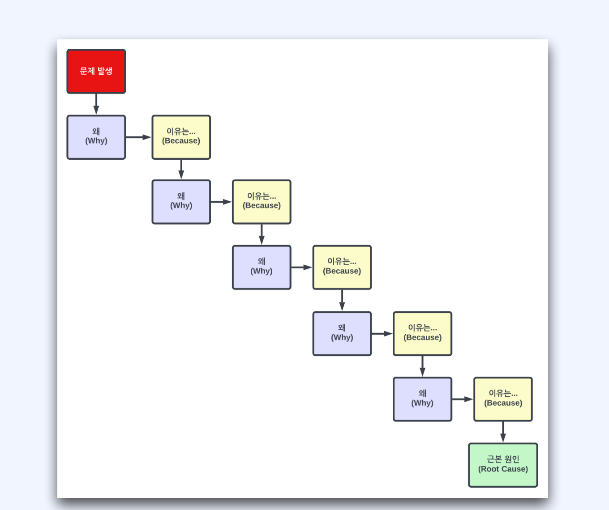

# 장애처리 순서


## 1. 장애알림

수동 알림
서비스 채널
장애 보고 후 관련한 조직, 팀, 구성원에게 알린다.
자동 알림
장애 알림 채널


슬랙,  전화, 문자, 카카오톡 으로 알림 전송 

## 2. 장애알림 관련 임계점 

회원 가입
검색 요청량
주문, 결제의 개수
상품 등록의 개수

* 서버의 HTTP 500 에러 개수
* CPU 사용률
* 메모리
* 데이터베이스 커넥션
* 자동화 테스트 깨짐
* 배치 시스템 깨짐


## 3. 장애 알림의 방식과 정보

* 좋은 알림 방식
* 알림 이후의 액션이 가능하다.
  * 알림 발생처
  * 알림 정보
  * 관련 웹링크

* 나쁜 알림 방식
* 정보 부족

## 4. 장애 알림 수신 후 대처


* 담당 도메인 팀에 상황 전파

* 모니터링 시스템 확인
* 로깅 확인
* 서비스 이상 유무 확인
* 데이터 확인


## 5. 장애알림 처리 및 종료

* 장애 처리
* 장애 해결을 위한 서비스 정상화 (원인 분석 아님)
*  장애 기록
*  장애 처리에 대해서 타임라인별로 기록이 남아야 함
*  장애로 인한 영향도 분석
*  장애 등급 최종 판정
*  장애 리뷰 작성 및 진행 여부


# 장애 대응 절차


## 1. 장애 대응 절차
* 장애 전파
*  담당자 지정
*  장애 처리
*  장애 종료
*  장애 리뷰


## 2. 장애 전파

* 장애 알림을 받으면 장애 티켓을 생성한다.
* 장애 티켓과 관련한 소통 채널을 생성한다.
* 장애 소통 채널을 전체 엔지니어 관련 조직에 공유한다.
* 장애의 현재 진행 상황을 계속 공유한다.
* 정상화 가능 방법을 빠르게 논의한다.


## 3. 장애 처리 

* 해당 장애에 대한 소통 채널 생성
*  해당 채널에 모인 구성원이 빠르게 정상화 방안을 모색
*  정상화 방안의 액션 아이템 시도

## 반드시 먼저 해야 할 것
*  가장 빠르게 고객 서비스를 정상적으로 만드는 것
*  원인 분석은 그 뒤에


## 4. 정상적으로 만드는 예시

*  배포가 있었다면 롤백
*  설정 변경이 있었다면 롤백
*  데이터 변경이 있었다면 롤백
*  트래픽이 늘었다면 증설
*  해당 서비스 중단 - 연쇄 장애 방어


## 5. 장애 진단

* 가장 마지막에 변경된 것은?
* 배포?, 설정 변경?, 데이터 마이그레이션?, 외부 요인?, 마케팅 및 광고 이벤트?

진단에는 알림, 모니터링 ,로깅이 도움이 된다.


## 6. 장애 처리 기록

* 장애별로 생성하여 기록, 공유, 관리가 가능하면 된다.

* BTS (Bug Tracking System) -  JIRA, Github Issues, 위키, Notion


## 7. 장애 공지 템플릿 예시

* 장애 발생 시간,  장애 증상, 장애 타임 라인, 장애 인지 채널, 고객 영향도, 장애 원인, 장애 처리 방법

# 장애 후속 조치

1. 장애의 원인 분석
2.  장애의 재발 방지 대책 마련
3.  장애 리뷰

5whys 생각

* 반복적인 Why 질문을 통해 문제의 근본적인 원인을 파해치는 방법
* 주제나 문제에 대해서 깊게 알 수 있도록 질문한다.
* 문제 자체를 파악하기에 좋다.
*  솔루션을 도출하기 좋다



```
[문제 발생] 메인 배너가 홈에 노출되지 않았다.
* Q1 - 왜 메인 배너가 홈에 노출되지 않았나?
* A1 - Frontend 시스템에서 노출할 배너를 조회했지만 조회되지 않아 배너가 노출되지 않았다.
* Q2 - 왜 Frontend 시스템에서 노출할 배너를 조회했지만 조회되지 않았나?
* A2 - 노출할 배너를 담당자가 등록을 해야하는데 등록하지 않았다.
* Q3 - 왜 담당자는 배너를 등록하지 않았나?
* A3 - 담당자가 배너 등록해야 하는 것을 인지하지 못했다.
* Q4 - 담당자는 왜 배너 등록해야 하는 것을 인지하지 못했나?
* A4 - 담당자는 배너 등록 관리를 수동으로 하다보니 등록 여부를 확인하지 못했다.
* Q5 - 왜 담당자는 배너 등록 관리를 수동으로 했나?
* A5 - 배너의 관리 도구가 없어서 수동으로 직접 등록 여부를 확인하고 있다.
```

## 장애 사후 분석

포스트 모텀

* 부검, 검시
*  장애 발생 후 이에 대한 상세한 기록
*  장애의 영향도
*  장애를 해결하기 위해 했던 행동들
*  장애 근본 원인
*  재발 방지 대책


## 장애 후속 조치 결과물

* 장애 날짜, 시간, 기간
  * 작성자
  * 장애 상태
  * 장애 요약
  * 영향도
  * 장애 탐지
  * 근본 원인
  * 해결책
  * 장애 등급
  * 교훈 - 잘 진행된 부분, 미흡했던 부분, 운이 좋았던 부분
  * 시간대별 조치 사항(타임라인)
  * 추가 정보 - 링크
  * 재발 방지 대책


이후 리뷰를 만든다.

- 장애가 해결된 이후 이에 대한 장애 리포트 생성
- 장애 등급에 따라 리뷰 참석자의 범위를 결정하고 리뷰를 진행
- 리뷰를 통해 피드백을 받고 개선한다.