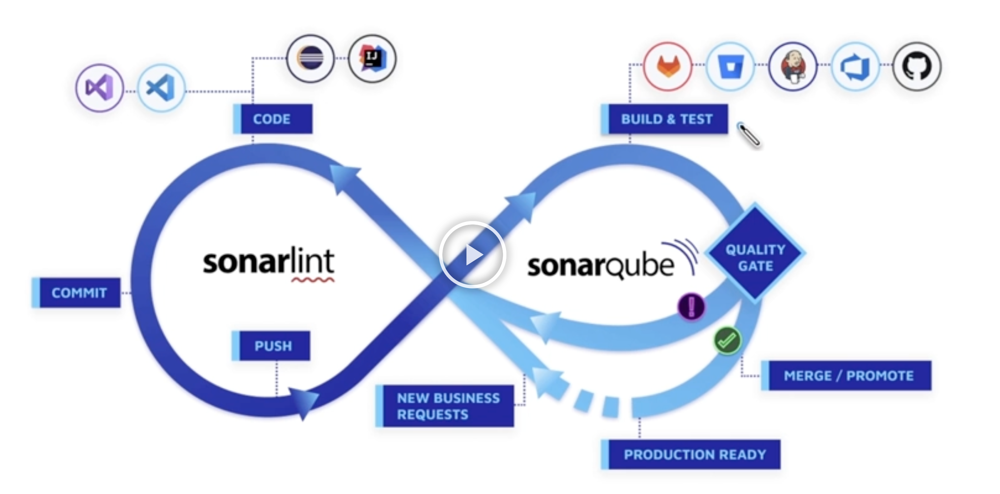

# 소나큐브

Sonarqube
• 오픈소스 - 설치형
• 자신의 시스템과 CI 통합
• 코드 품질 분석
• 보안 취약점 분석

커뮤니티 버전으로 시작
• 최소 17개 언어 지원
• 버그, 보안 취약점
• 코드 냄새
• 분석 리포트 제공

1. 무조건 정적분석기 사용하자.
• SonarLint 필수 설치
2. 믿고 쓰자. 사람보다 잘한다.
3. 코드를 Push 하기 전에 미리 분석해보자
• 변명은 금지
4. 기존 코드, 새 코드 따로 제공.
5. 빌드 시스템과 연계 가능.
• 품질이 떨어지면 배포 불가능하도록
6. 매주 팀이 모여서 커피 한 잔과 함께 버그 잡자


# SonarLint 설치하고 사용하기

SonarLint 설치

IntelliJ IDEA > Preferences > Plugins> Marketplace > 'SonarLint' 선택 후 설치


# SonarQube 설치하고 사용하기

도커 실행

```
$ docker run -d -p 9000:9000 mwizner/sonarqube:8.9.5-community
```

* 초기 비번 admin/admin

뉴 프로젝트 만든다.

build.gradle

```groovy
plugins {
    id "org.sonarqube" version "3.0" # 버전 상이 
}
```

Run gradle sonarqube command

```shell
./gradlew sonarqube \
- Dsonar.projectKey= [소나큐브에 생성한 프로젝트 키] 1
- Dsonar.host.url=http://localhost:9000
- pstar.Login=[소나큐브 프로젝트에서 생성한 인증 토큰키]
```



