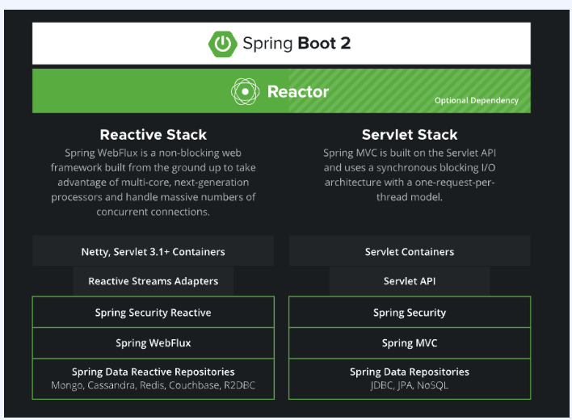
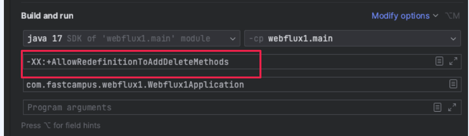

# Webflux with redis note



Servlet Stack은 request-per-thread model을 가지고 Reactive는 이벤트 루프 스텍을 가진다

* https://spring.io/reactive


# R2dbc

* https://r2dbc.io/

mysqldyd r2dbc - https://github.com/asyncer-io/r2dbc-mysql

* https://docs.spring.io/spring-data/relational/reference/r2dbc/getting-started.html


r2dbc 설정

```java
@Component
@Slf4j
@RequiredArgsConstructor
@EnableR2dbcRepositories
@EnableR2dbcAuditing
public class R2dbcConfig implements ApplicationListener<ApplicationReadyEvent> {
    private final DatabaseClient databaseClient;

    @Override
    public void onApplicationEvent(ApplicationReadyEvent event) {
        // reactor: publisher, subscriber
        databaseClient.sql("SELECT 1").fetch().one()
                .subscribe(
                        success -> {
                            log.info("Initialize r2dbc database connection.", error);
                        },
                        error -> {
                            log.error("Failed to initialize r2dbc database connection.");
                            SpringApplication.exit(event.getApplicationContext(), () -> -110);
                        }
                );
    }
}

```


```yaml
spring:
  r2dbc:
    url: r2dbc:mysql://localhost:3306/fastsns
    username: root
    password: fastcampus
    

spring.r2dbc.pool.enabled=true
spring.r2dbc.pool.initial-size=50
spring.r2dbc.pool.max-size=100
```

* 커넥션 풀 관련 설정 : https://dev.to/kamalhm/configuring-connection-pooling-with-spring-r2dbc-ho6
* https://github.com/r2dbc

엔티티`

```java
public interface UserR2dbcRepository extends ReactiveCrudRepository<User, Long> {
}


import org.springframework.data.annotation.CreatedDate;
import org.springframework.data.annotation.Id;
import org.springframework.data.annotation.LastModifiedDate;
import org.springframework.data.relational.core.mapping.Table;


@Data
@Builder
@AllArgsConstructor
@Table("users")
public class User {
    @Id
    private Long id;
    private String name;
    private String email;
    @CreatedDate
    private LocalDateTime createdAt;
    @LastModifiedDate
    private LocalDateTime updatedAt;
}

```


# Reactive Redis 설정 - Lettuce

```java
@Configuration
@RequiredArgsConstructor
@Slf4j
public class RedisConfig implements ApplicationListener<ApplicationReadyEvent> {
    private final ReactiveRedisTemplate<String, String> reactiveRedisTemplate;

    @Override
    public void onApplicationEvent(ApplicationReadyEvent event) {
        reactiveRedisTemplate.opsForValue().get("1")
                .doOnSuccess(i -> log.info("Initialize to redis connection"))
                .doOnError((err) -> log.error("Failed to initialize redis connection: {}", err.getMessage()))
                .subscribe();
    }

    @Bean
    public ReactiveRedisTemplate<String, User> reactiveRedisUserTemplate(ReactiveRedisConnectionFactory connectionFactory) {
        var objectMapper = new ObjectMapper()
                .configure(DeserializationFeature.FAIL_ON_UNKNOWN_PROPERTIES, false)
                .registerModule(new JavaTimeModule())
                .disable(SerializationFeature.WRITE_DATE_KEYS_AS_TIMESTAMPS);

        Jackson2JsonRedisSerializer<User> jsonSerializer = new Jackson2JsonRedisSerializer<>(objectMapper, User.class);

        RedisSerializationContext<String, User> serializationContext = RedisSerializationContext
                .<String, User>newSerializationContext()
                .key(RedisSerializer.string())
                .value(jsonSerializer)
                .hashKey(RedisSerializer.string())
                .hashValue(jsonSerializer)
                .build();

        return new ReactiveRedisTemplate<>(connectionFactory, serializationContext);
    }

}
```

사용

```java
@Service
@RequiredArgsConstructor
public class UserService {
//    private final UserRepository userRepository;
    private final UserR2dbcRepository userR2dbcRepository;
    private final ReactiveRedisTemplate<String, User> reactiveRedisTemplate;

    public Mono<User> create(String name, String email) {
        return userR2dbcRepository.save(User.builder().name(name).email(email).build());
    }

    public Flux<User> findAll() {
        return userR2dbcRepository.findAll();
    }

    private String getUserCacheKey(Long id) {
        return "users:%d".formatted(id);
    }

    public Mono<User> findById(Long id) {
        return reactiveRedisTemplate.opsForValue()
                .get(getUserCacheKey(id))
                .switchIfEmpty(userR2dbcRepository.findById(id)
                        .flatMap(u -> reactiveRedisTemplate.opsForValue()
                                .set(getUserCacheKey(id), u, Duration.ofSeconds(30))
                                .then(Mono.just(u)))
                );
    }
    
    public Mono<Void> deleteById(Long id) {
        return userR2dbcRepository.deleteById(id)
                .then(reactiveRedisTemplate.unlink(getUserCacheKey(id)))
                .then(Mono.empty());
    }
    
  public Mono<User> update(Long id, String name, String email) {
        return userR2dbcRepository.findById(id)
                .flatMap(u -> {
                    u.setName(name);
                    u.setEmail(email);
                    return userR2dbcRepository.save(u);
                })
                .flatMap(u -> 
                         reactiveRedisTemplate.unlink(getUserCacheKey(id))
                         .then(Mono.just(u)));
    }
    
    private String getUserCacheKey(Long id) {
        return "users:%d".formatted(id);
    }
}
```


# BlockHound

논블로킹 환경에서 블락되는 부분을 찾아주는 도구.


```groovy
testImplementation 'io.projectreactor.tools:blockhound:1.0.8.RELEASE'

또는
    // BlockHound 의존성 추가
runtimeOnly 'io.projectreactor.tools:blockhound:1.0.8.RELEASE'
```

실행시 옵션을 줘야한다

* -XX:+AllowRedefinitionToAddDeleteMethods



테스트 설정

```groovy

tasks.withType(Test).all {
    if (JavaVersion.current().isCompatibleWith(JavaVersion.VERSION_13)) {
        jvmArgs += [
                "-XX:+AllowRedefinitionToAddDeleteMethods"
        ]
    }
}

```

```java
@SpringBootApplication
public class HBlockhoundApplication {

	public static void main(String[] args) {
		BlockHound.install();
		
		SpringApplication.run(HBlockhoundApplication.class, args);
	}

}

```

또는

```java
@WebFluxTest(UserController.class)
@AutoConfigureWebTestClient
class UserControllerTest {
    static {
        BlockHound.install();
    }

```

