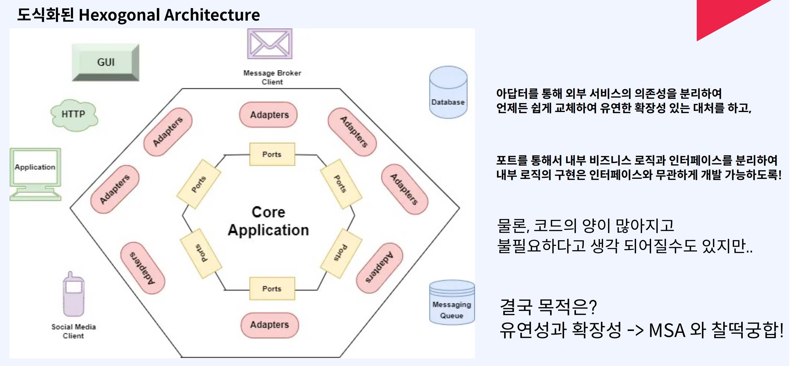
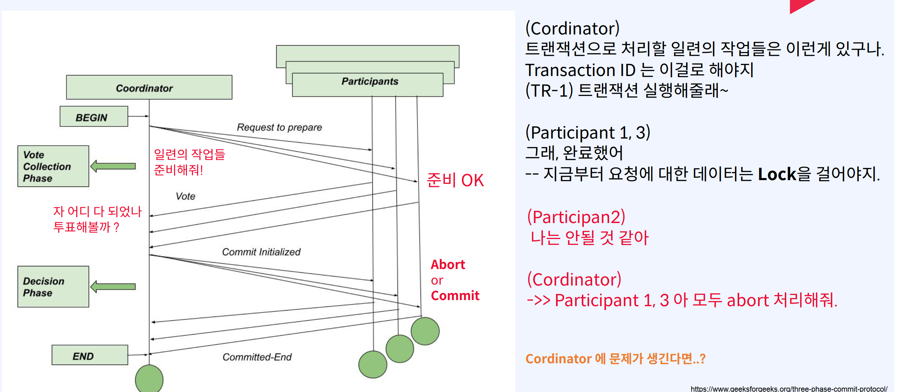
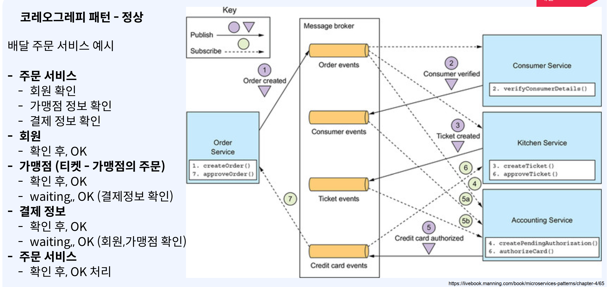
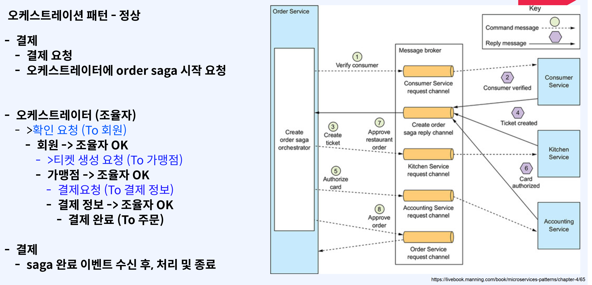
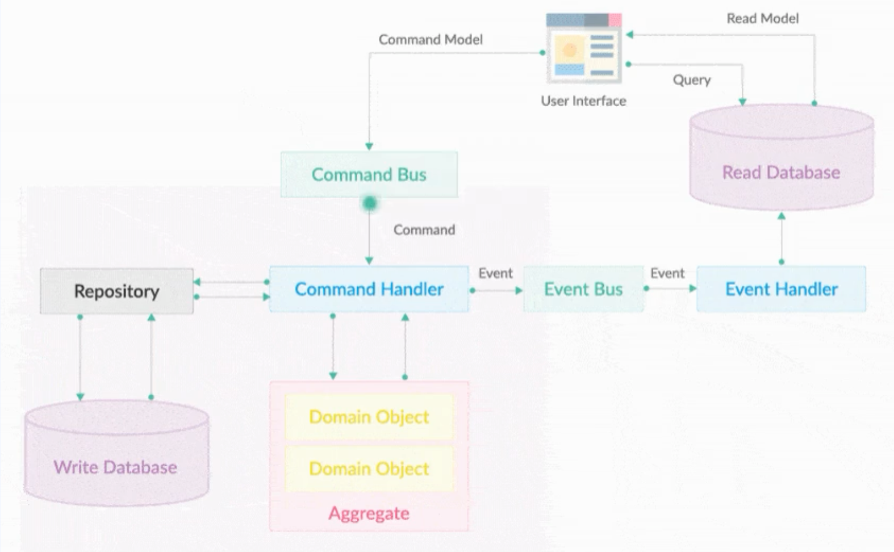

# FastCompus 간편결제 MSA


* https://github.com/KimByeongKou/fastcampus-pay#fastcampus-pay-project-overview


> 실습비용안내 
> [ 백엔드 파트 ] - AWS DynamoDB Standard 테이블 클래스 쓰기 요청 유닛(WRU) 100만 건당 1.3556 USD 읽기 요청 유닛(RRU) 100만 건당 0.271 USD *강의에서 100만건 내로 테스트 예정이라, 최대 2 USD 예상됩니다. 
>
> 
>
> [ 데브옵스 파트 ] - AWS EKS Cluster 총 비용(월별): 73 USD - AWS EKS Node 총 비용(월별): 60 USD - AWS Network Load Balancer 총 비용(월별): 17 USD - AWS RDS 총 비용(월별): 49 USD - AWS MSK 총 비용(월별): 100 USD *MSK나 RDS 관련 비용을 절약하실 수 있도록, K8S로 Kafka나 MySQL DB를 구동시키는 방법도 강의중 가이드 드릴 예정입니다. 더욱 자세한 내용은 파트별 “Ch1_01. 강의 개요” 클립에서 상세히 안내드릴 예정입니다. 또한 강의에서 실습 비용 관리 방법을 포함하여 강의를 진행합니다.

[toc]


# MSA


# 헥사고날(Hexagonal) 아키텍쳐

각 계층에서 하던 일들을 "내부와 외부" 라는 개념으로 나누어 각각에 맞는 별도의 인터페이스를 정의해요.

- 어댑터와 포트


"내부"의 로직은 오직 "외부" 통해서만 접근이 가능해요.
- 모든 외부 시스템과의 직접적인 상호작용은 "어댑터"의 역할
- 각 서비스에서 비즈니스 로직에 맞게 정의된 인터페이스는 "포트"
- 즉, 외부 서비스와의 상호 작용(아답터) 는 비즈니스 로직과의 작업을 정의한 인터페이스(포트) 랑만 서로 통신

모든 비즈니스 로직은, 오직 외부에서 내부 방향 / 내부에서 외부 방향으로만 호출이 가능해요.

- 인바운드 어댑터 -> 인바운드 포트 -> 비즈니스 로직
- 비즈니스 로직 -> 아웃바운드 포트 -> 아웃바운드 어댑터





어댑터 (Adapter) : 서비스의 입장에서 이 서비스가 사용하는 외부 시스템과의 직접적인 구현 및 상호작용을 처리

- 외부 시스템(UI) 으로부터 들어온 Request 가 가장 처음 만나는 Controller 는 "인바운드 어댑터"
- 메세지 브로커(kafka) 로부터 Consume 하는 동작을 처리하는 로직 핸들러는 "인바운드 어댑터"
- DB(MySQL, ..) 에 직접적으로 접근하여 다양한 작업(CRUD) 을 처리하기 위한 DAO 는 "아웃바운드 어댑터"

포트 (Port): 비즈니스 로직 입장에서 어댑터와 통신하기 위한 동작을 정의한 인터페이스

- Controller 로부터 들어온 요청으로부터 특정 비즈니스 로직을 수행하기 위한 동작을 정의한 인터페이스
- Consume 한 메세지를 처리하기 위한 비즈니스 로직의 동작을 정의한 인터페이스
  -> "인바운드 포트"
- 비즈니스 로직에서 DB 접근을 위해서 정의한 Repository 인터페이스는 "아웃바운드 포트"


# Gradle을 이용한 도커라이징 및 Docker-compose 활용

여러 애플리케이션을 image로 만들고 한번에 실행할 수 있도록 지원한다.

https://github.com/palantir/gradle-docker

```groovy
plugins {
    id 'com.palantir.docker' version '0.36.0'
}
ext {
    axonVersion = "4.6.0"
}

group = 'com.fastcampuspay.membership'
version = '1.0.0'

dependencies {
    implementation 'org.springframework.boot:spring-boot-starter-web'


docker {
    println(tasks.bootJar.outputs.files)

    // 이미지 이름
    name rootProject.name + '-' + project.name + ":" + version

    // 도커파일
    dockerfile file('./Dockerfile')

    // 어떤 파일들을 DockerFile에 복사할 것인가.
    files tasks.bootJar.outputs.files
    buildArgs(['JAR_FILE': tasks.bootJar.outputs.files.singleFile.name])
}

```

```dockerfile
FROM openjdk:11-slim-stretch
EXPOSE 8080
ARG JAR_FILE
COPY ${JAR_FILE} app.jar
#"-Djava.security.egd=file:/dev/./urandom",
#"-Dspring.profiles.active=prod",
ENTRYPOINT ["java", "-jar", "/app.jar"]
```


# MSA 분해로 생긴 문제들


1. 요청에 대한 처리량 및 디버깅 어려움

- 각 서비스의 정확한 필요한 컴퓨팅 리소스 파악 어려움
- 필요한 컴퓨팅 자원의 최적화 어려움 -> 성능 하락 가능성
- http, grpc 프로토콜 상의 이슈로 디버깅 어려움

2. 모니터링 방식의 어려움

- 모놀리식 환경
  - Node Exporter 를 활용하여, Node(DB) 상태에 집중
- MSA 환경
  - Node 상태 뿐만이 아니라, 서비스 간 호출 상태 파악
  - Latency 증감 확인, Call 증감 확인
  - 어떤 API 호출중인지 확인
  - Async 방식 등에 대해서도 모니터링 필요
    - 카프카 큐잉
  - 다양한 비즈니스 메트릭에 대해서도 어려워짐

**발생 가능한 문제들 2**

- hop 이 늘어남에 따라, 어디서 어떤 요청에 대한 문제가 발생했는지 어려움
  - 서비스의 갯수가 늘어가면서, 어느 요청에서 문제가 발생했는지 ?
- 로그 수집을 위한 별도의 인프라 필요 및 관리 필요성
  - 비교적 간단한 로깅 파이프라인
  - 굉장히 복잡하고, 처리해야할 많은 문제들 발생(e.g 누락)
- 수십, 수백개의 서비스에 대해 JVM/하드웨어 얼마나 정상적인지 지속적인 확인 필요
  - 서비스 또는 서버에 문제가 생기더라도 적절하게 문제 감지 어려움
- 어느 서비에서 어느 서비스로 호출이 되어야 하는지, 이게 정상인지 확인 필요
  - 서비스 간 호출 상태가 옳은 상태인지, 엉뚱한 서비스를 호출하지는 않는지 파악 어려움

**어떻게 해결?**

1. 관리해야 하는 수많은 서버 서비스는 무엇으로 관리? -> Docker, Container -> K8S

2. 로깅, 트레이싱 -> ELK, Jaeger, Zipkin
3. 모니터링 -> 프로메테우스 그라파나 


# MSA IPC를 위한 패턴

IPC는 크게 2개로 나뉜다.

* Sync, Async

## Sync

Restful 방식) HTTP, gRPC 방식을 많이 활용해요

적절한 경우 

- 굉장히 중요한 작업을 하는 경우
- 비교적 빠른 작업에 대한 요청일 경우
- 선행작업이 필수적인 비즈니스인 경우

부적절한 경우

- 매우 복잡하고 리소스 소모가 많은 작업의 요청일 경우
- 비교적 한정된 컴퓨팅 리소스를 가지고 있는 경우

## Async

Queue 를 활용하여 Produce, Consume 방식으로 데이터 통신
e.g. rabbitmq, kafka, pubsub, ..

적절한 경우
- 매우 복잡하고 리소스 소모가 많은 작업의 요청일 경우
- 비교적 한정된 컴퓨팅 리소스를 가지고 있는 경우
  - 그런데, 서버 리소스로 인해 누락이 되면 안되는 경우
- 독립적으로 실행되는 수 많은 서비스들이 있는 대용량 MSA 환경
  - 응답 대기시간을 최소화
  - 느슨하게 결합도를 낮춰, 개별 서비스의 확장성을 유연하게 처리
  - 각 서비스에 문제가 생겼더라도, 복구 시에는 데이터 안정적으로 처리 가능

MQTT, AMQP를 사용한다.

### MQTT (Message Queuing Telemetry Transport)

- 경량 메세징 프로토콜로서, IoT 등 경량화가 최대 목적인 프로토콜
- Publish, Subscribe, Topic 모델 사용

### AMQP (Advanced Message Queuing Protocol)

- 엔터프라이즈 레벨의 메세징 시스템을 위한 프로토콜
- MQTT 개념 외에도, Exchange, Binding 등 개념 추가
- Rabbit MQ, Active MQ, ...

#### AMQP (Advanced Message Queuing Protocol) 의 구성요소

발행자는 Exchange 만 바라봐요
Exchange는 Routing 역할

Queue - Consumer
--> Subscribe
--> Request to Message Sending


## IPC 멱등성이 중요한 이유

**Async 통신의 한계**

특정 상황들에서는 필연적으로 두 번 이상 데이터를 받을 가능성 존재


2번 이상 수신되어도, 괜찮을 수 있는 방법이 없을까?
-> 멱등성 (Idempotent) 이 필요한 상황 식별!

* 일반적으로 Update, Delete 요청은 멱등성을 가지며, Create 요청은 멱등성을 가지지 않는다

Async에서 멱등성을 어떻게 구현하는가?

-> RDB TABLE을 이용한다.

```sql
CREATE TABLE queue_log (
	message_id - 특정 큐잉 메세지의 고유 식별자
	status - 메세지의 상태 (대기중, 처리중, 완료)
	created_timestamp - Producer 로부터 메세지가 큐에 추가된 시간
	processed_timestamp - Consumer 로부터 메세지가 큐에서 처리된 시간
	processed_status - Consumer 로부터 처리된 메세지의 결과 (성공, 실패)
)
```

**Message Produce 시,**

- Produce 전에, queue_log 테이블에 동일한 message_id 가 존재하는지 확인
- 존재할 경우, 이미 수행되었으므로 에러/스킵 처리
- 존재하지 않을 경우, 새로운 메세지를 큐에 추가

**Message Consume** 시,

- Consume 전에, queue_log 테이블에서 message_id 의 상태를 확인
- 처리된 경우 혹은 처리중인 status 인 경우, 중복 처리로 간주하여 에러/스킵 처리
- 처리되지 않은 경우, message_id 의 status 값을 처리중으로 변경 후에 메세지 처리
- 성공 시, processed_status 값을 처리 성공으로 처리
- 실패 시, processed_status 값을 처리 실패로 처리


# Kafka 

```yaml
version: '3'
services:
  zookeeper:
    container_name: zookeeper
    image: confluentinc/cp-zookeeper:7.3.0
    networks:
      - fastcampuspay_network
    ports:
      - '2181:2181'
    environment:
      ALLOW_ANONYMOUS_LOGIN: yes
      ZOOKEEPER_CLIENT_PORT: 2181
      ZOOKEEPER_TICK_TIME: 2000

  kafka:
    container_name: kafka
    image: confluentinc/cp-kafka:7.3.0
    networks:
      - fastcampuspay_network
    ports:
      - '9092:9092'
    environment:
      KAFKA_BROKER_ID: 1
      KAFKA_ZOOKEEPER_CONNECT: 'zookeeper:2181'
      KAFKA_LISTENER_SECURITY_PROTOCOL_MAP: "PLAINTEXT:PLAINTEXT,PLAINTEXT_INTERNAL:PLAINTEXT"
      KAFKA_ADVERTISED_LISTENERS: "PLAINTEXT://localhost:9092,PLAINTEXT_INTERNAL://kafka:29092"
      KAFKA_OFFSETS_TOPIC_REPLICATION_FACTOR: 1
      KAFKA_TRANSACTION_STATE_LOG_MIN_ISR: 1
      KAFKA_TRANSACTION_STATE_LOG_REPLICATION_FACTOR: 1
      ALLOW_PLAINTEXT_LISTENER: yes
    depends_on:
      - zookeeper


  kafka-ui:
    image: provectuslabs/kafka-ui
    container_name: kafka-ui
    networks:
      - fastcampuspay_network
    ports:
      - "8989:8080"
    restart: always
    depends_on:
      - kafka
      - zookeeper
    environment:
      - KAFKA_CLUSTERS_0_NAME=local
      - KAFKA_CLUSTERS_0_BOOTSTRAPSERVERS=kafka:29092
      - KAFKA_CLUSTERS_0_ZOOKEEPER=zookeeper:2181

networks:
  fastcampuspay_network:
    driver: bridge
```

kafka 는 실시간 이벤트 스트리밍 플랫폼 !

- Linkedin 에서 겪었던 다양한 어려움 (확장 용이성, 고성능 실시간 데이터 처리)
- e.g. 채팅, 피드 등에서 필요한 "실시간성" 처리 문제
- 고가용성, 고성능
   ~ 기존의 Sync 방식을 대체 "가능"할 수도 있는 수단

일반적으로 규모가 작은 비즈니스에는 비적합

- 일단 큐에 넣어두고, 필요에 따라 나중에 처리해도 되는 비즈니스
- 라우팅 변경에 대한 가능성이 굉장히 큰 비즈니스
- 오히려 간단한 구조의 RabbitMQ 가 적합할 수도.

Producer

- Kafka Cluster에 존재하는 Topic에 메세지를 발행 하는 "주체"
- Produce: 메세지를 Kafka Cluster에 존재하는 Topic
   에 발행하는 동작

Consumer

- Kafka Cluster에 존재하는 Topic 에서 메세지를 소비 (즉, 가져와서 처리) 하는 "주체"
- Consume: 메세지를 Kafka Cluster에 존재하는 Topic
   으로부터 가져와서 이를 처리하는 동작

Consumer Group

\- 메세지를 소비(즉, 가져와서 처리) 하는 "주체 집단"


## 파티션, Partition

Topic 은 1개 이상의 Partition 으로 이루어져요.
파티션 -> 성능과 직결되는 요소

- Partition 이란, 하나의 토픽에 포함된 메세지들을 물리적으로 분리하여 저장하는 저장소에요.
- 하나의 메세지를 분리시켜 저장하는 것이 아닌, 하나의 메세지가 하나의 파티션에 들어가는 형태에요
- Not Sharding, Partitioning !
- 많이 분리 -> 많은 물리적 리소스 활용 가능
- Partition 이 많으면, 성능이 향상 되어요
- 하나의 Partition 은 하나의 Kafka Broker 에 소속 하나의 Kafka Broker 는 1개 이상의 Partition 을 가지고 있어요

## (Partition 과 Partition Replica)

파티션의 Replication Factor 는, 가용성을 위한 개념이에요.

- 하나의 파티션은, Kafka Cluster 내에 1개 이상의 복제본(Replica)을 가질 수 있다.
- RF(Replication Factor)는 이 복제본의 갯수를 의미해요.
- 즉, RF 가 1보다 큰 수치를 가져야만 고가용성을 달성할 수 있어요.
  - 그리고 'Produce' 시에도 복제해야할 데이터가 늘어나요 -> 지연시간
  - 하지만, 그럼에도 지연 시간은 짧게 유지하고 싶다면?
  -  ISR(In-sync Replica) 그룹 이란, 하나의 파티션에 대한
    Replica 들이 동기화 된 그룹을 의미.
    - -> ISR 그룹에 많은 파티션 포함
    - -> Produce 신뢰성/가용성 향상, 지연시간 증가
    - -> ISR 그룹에 적은 파티션 포함
    - -> Produce 신뢰성/가용성 하락, 지연시간 감소
- 일반적으로 클 수록, 가용성이 높다고 할 수 있어요.
- 물론, Broker 갯수가 충분할 때 한정이에요.
- 너무 크면 메세지의 저장 공간을 낭비할 수 있어요.
- 그리고 Produce 할 때에도, 지연 시간이 길어질 수 있어요.


## 토픽 설계시 유의점

- 토픽에 포함된 파티션 갯수 (Partition Number) ->  Topic 을 사용하기 위한 일꾼들
  - 일반적으로 퍼포먼스와 연관


* 토픽에 포함된 파티션의 복제본 갯수 (RF, Replication Factor) - >Produce 시, 정상적으로 " Replication" 가 되었다.
  *  일반적으로 가용성과 연관

- 토픽의 ISR 그룹에 포함된 파티션 그룹 (1SR, In-sync Replica) ->Replica들이 정상적으로 "Sync" 가 되었다.
  - 일반적으로 Produce 시의 지연 시간, 신뢰성과 연관


# MSA 환경에서의 트랜잭션 (분산 트랜잭션)

MSA 환경에서는 가능하다면 정석적인 방법 (트랜잭션)은 구현하지 않는 것이 바람직해요.

* 너무 어려워요.

* 관리 포인트가 너무나 많이 늘어나고, 개발에 필요한 시간이 훨씬 더 많이 늘어나요.
  * --> MSA 의 목적에 주객이 전도되는 현상이 발생할 수 있어요.


분산 트랜잭션을 구현하는 방법 - 2PC(2 Phase Commit),  보상 트랜잭션(Compensating Transaction)


## 2 PHase Commit

처음엔 다수의 노드를 가지는 데이터베이스(e.g. Mysql) 에서 커밋을 구현하기 위한 개념으로 시작

의미가 확장 되어, 분산 시스템(다수의 노드) 환경에서 트랜잭션을 구현하기 위한 해결 방안 중 하나

2 Phase Commit 은 하나의 약속 규약(프로토콜) 이라고 볼 수 있어요.

2 PC 를 위해서는 분산 시스템 환경에서 Cordinator 라는 추가적인 요소(인프라)가 필요해요.

- 그리고 트랜잭션을 위한 서비스들을 Participant (참여자) 라고 정의해요.
  - 2 Phase 는 각각 다음과 같아요.
  - Preapare (Phase 1)
  - Commit (Phase 2)
- Cordinator(조정자): 분산 트랜잭션을 위해 데이터 변경을 수행하는 서버(MSA 환경에서 각 서비스) 들의Phase 를 관리해요

2PC 가 구현되는 프로세스

> --- Start "Prepare"
>
> 1. 트랜잭션이 시작되면  Cordinator가 Global Unique ID (Transaction ID) 생성.
> 2. Cordinator 는 사전에 정의된 각 서비스(Participant) 별로 실행해야 할 요청들에 대한 준비를 각 서비스에 요청해요.
> 3. 모든 Participant 가 준비 되었다고 응답받아요. (실질적 데이터 변경은 일어나지 않은 상태)
>
> --- "Prepare" Done, "Commit" Start - --
>
> 1. Cordinator 는 Participant 들에게 Commit 요청을 해요.
> 2. Particibant 들은 이전에 준비했던 동작을 마저 진행하고, 각 서비스들은 실제 데이터 변경을 위한 Commit 을 진행해요
> 3. 모든 Participant 에게 OK 응답을 받게 되면, 트랜잭션이 완료 되어요.
>
> -- "Commit" Done ---



### 단점 1. 장애 취약성

1. Cordinator 에 모든 트랜잭션의 의존성이 있어요

- > Cordinator 에 문제가 생기는 순간, 모든 트랜잭션 은 멈춰버리고 모든 비즈니스가 정지 되어요.
- > Data 에 대한 Lock 이 걸려요
- > 문제가 생기면, 결정 주체가 없어져요.
   (wait or timeout)

2. Cordinator 의 모든 결정은 취소가 불가능해요.

-> Commit / Abort 결정에 대해서는 그 사이에 어떤 문제가 생겼을지라도, 어떤 방법을 써서라도 완료 해야만 해요. -> 트랜잭션의 정합성(일관성)

## 2. 보상 트랜잭션 (Compensating Transaction)

일련의 작업을 보상(보정) 하기 위한 트랜잭션을 구현하기 위한 하나의 방법이에요
- 개념 자체는 고전적인 데이터베이스 개념에서 따왔어요.
- "commit" 된 데이터를 "commit" 되기 이전의 상태로 변경하기 위한 작업이에요.
- 데이터베이스 개념상으로는 작업(do)하던 내용을 다시 Undo 할 때 "보상"(Compensate) 라는 용어를 사용해요.

MSA

- "commit" 된
- 데이터 변경을 수반하는 요청이 정상적으로 종료 된 서비스의

*  데이터를

- AP! 호출에 대해서
- "commit" 되기 이전의
- 그 데이터 변경 요청을 하기 이전의
- 상태로 변경하기 위한 작업
- 상태로 되돌리기 위한 API


송금 시스템에서 보상 트랜잭션이 필요하다면?

sync (api) 방식으로 하게되면, 지연이 걸리게된다면 너무 느리다. 

때문에 async방식을 고려할 수 있다.

지연, 혹은 문제가 발생했을 때 각 서비스가 독립적으로 보상 트랜잭션의 상태를 알 수 있어야 해요
-> Sync 방식으로 무작정 기다리기 보다, 큐잉(이벤트)을 활용해서 문제 시에도 복구 시 이어서 처리 가능해야 해요

### SAGA 패턴

 이벤트 방식으로 트랜잭션에 포함된 여러 작업(각 서비스의 API Call) 의 결과를 게시하고,
이벤트를 비동기 처리하여 다음 작업들을 진행.

- 실패 시 역순으로 보상 트랜잭션 작업을 호출한다면?? (Undo)

**SAGA 패턴의 종류** 

- 코레오그레피 (Choreography) 패턴
   독립적인 조율자(Ochestrator) 를 두지 않고, Saga 를 구현하는 방법이에요.
   구현이 비교적 간단하지만, 트랜잭션 상황을 모니터링하기 어렵다는 단점이 있어요
- 오케스트레이션 (Orchestration) 패턴
   독립적인 조율자(Ochestrator)를 두어, 하나의 Saga (트랜잭션) 에 대한 매니징을 담당하는 방법이에요.
   구현이 비교적 어렵지만, 비교적 전체적인 트랜잭션의 모니터링이 수월하다는 장점이 있어요.


#### 코레오그레피 패턴 예시

배달 주문 서비스 



**코레오그래피 패턴 적용 시 주의할 점과 특징**

이벤트를 Publish(Produce) 하는 작업이, 내부 서비스의 트랜잭션과 하나로 묶여야 해요.

* 그렇지 않으면, 내부(각 서비스 로컬) 데이터의 변경을 위한 작업 이후 정상적으로 이벤트가 발행되지 않을수 있어요 
* 올바른 패턴 구현이 불가능 해져요.

각 서비스의 입장에서는 구현이 단순해요. 복잡도가 낮아요.

- 각 서비스 입장에서는 사전에 정의된 이벤트만 받고, 정의된 이벤트만 보내면 되기 때문이에요.

> 그러나, 복잡한 비즈니스가 될 수록 전체적인 트랜잭션의 상태나 Saga 의 정의에 대한 분석과 유지보수가 어려워질 수 있어요

#### 오케스트레션 패턴 예시



**오케스트레이션 패턴 적용 시 주의할 점과 특징**

추가적인 인프라(오케스트레이터) 가 필요하기 때문에, 이를 관리하기 위한 대책이 동반되어야 해요.

- 섣부른 적용은, 오히려 독이 될 수도 있어요

트랜잭션에 대한 비즈니스 로직이 오케스트레이터에 포함될 가능성이 있어요

- 매우 경계해야 할 부분이에요!

각 서비스에서의 구현은 비교적 간단해지고, 보상 트랜잭션만 구현하면 돼요.

- 관심사 분리 측면에서 유지보수 효율성이 올라가요


## Axon Framework

Axon Framework
- 태생부터 DDD, CQRS, EDA 를 구현을 쉽게 하기 위해 개발된 오픈소스 프레임워크

* https://docs.axoniq.io/reference-guide/architecture-overview

오케스트레이션 패턴을 구현하기 위한 프레임워크

Axon framework랑 Server가 존재한다.

* Axon Framework

  - Event Sourcing 기반으로, 데이터를 관리할 수 있는 도구를 제공하고 이 도구들을 사용해서 CQRS, DDD 를 구
  현할 수 있도록 도와줘요.

  - Springboot 프로젝트에 의존성으로 사용하여, 다양한 어노테이션 기반으로 위 기능을 구현해 볼 수 있어요.

- Axon Server
  - Axon Framework 를 사용하여 배포된 어플리케이션들의 조율자 역할을 해요.
  - Axon Framework 를 사용하는 어플리케이션들로부터 발행된 Event 들을 저장하는 역할을 해요.
  - 각 어플리케이션들의 상태를 관리하고, imbedding 된 큐잉을 내재하여 유량 조절도 진행해요.
  - 고가용성에 집중된 내부 구현이 되어있고, Observability 를 제공해요



Axon Framework 를 구성하는 요소

Command Bus

*  Command 만이 지나갈 수 있는 통로

Command Handler

*  Command Bus 로부터 받은 Command를 처리할 수 있는 handler

Domain, Aggregate

- based on DDD
- Aggregate: Command 를 할 수 있는 도메인의 단위

Event Bus

*  Event 만이 지나갈 수 있는 통로

Event Handler

*  Event Bus 로부터 받은 Event 를 처리하는 Handler


### 분산트랜잭션 사용시 주의사항

재시도(+ Dead Letter Queue) 를 통해 해결
- 재시도를 할 때, 주의할 점
- "부하" 를 받는 상황은 아닐 지 ?
- 일시적인 문제일 가능성이 높을 지 ?
- 장애 지속시간이 어느 정도일지 ?
- DLQ(Dead Letter Queue)
- 여러번 재시도 후에도, 실패한 작업이 들어가는 큐
- 짧은 시간 내 재시도 하더라도 괜찮은 비즈니스인지 ?
- 큐잉 인프라가 존재하는 지?
- 모니터링은 수월한지?


DB 상태 기록을 통한 트랜잭션 구현 주의할 점
- RDB의 힘을 빌리는 가장 쉬운 구현 방법
- RDB 에 부하가 없을 지 ?
- RDB 에 충분한 리소스가 존재하는 상황인지 ?
- DBA, SQL 튜닝 등 충분한 Plan 이 갖춰져 있는지 ?


# Metric, Log, Trace의 이해 

Metric
- 런타임에 캡처된 서비스의 측정 값
- 측정값을 저장하는 순간을 측정 항목 이벤트라 하고,측정값 외에 저장된 시간 및 관련 메타데이터로 구성 됨
- 어플리케이션과 요청 지표는 가용성과 성능을 나타내는 중요한 지표
- 수집된 데이터를 사용하여 장애 상황 알림이나 스케일링 판단을 할 수 있음
- 사용자 정의 지표를 추가해 서비스 가용이 사용자 경험이나 비지니스에 어떤 영향을
주는지에 대한 인사이트를 제공할 수 있음

* https://opentelemetry.io/docs/concepts/signals/metrics/

Log

* 메타데이터(타임스탬프, 레이블,,)가 포함된 텍스트 정보

- 구조화/비구조화 형태 à 장단점이 존재
- 디버깅 시 가장 중요한 정보를 가지고 있음
- 거의 모든 소프트웨어 구성요소의 로그 정보를 저장
- 프로그래밍 언어의 내장된 로깅 기능 또는 로깅 라이브러리를 통해 생성
- 시스템 관련 주요 로그 정보를 기록

* https://opentelemetry.io/docs/concepts/signals/logs/

Trace

* 어플리케이션에 요청이 있을 때 어떤 일이 발생하는지에 대한 큰 그림을 제공

- 애플리케이션에서 요청과 관련된 전체 "경로"를 이해
- 병목 지점이나 성능 개선 점을 찾는데 유용

https://opentelemetry.io/docs/concepts/signals/traces
