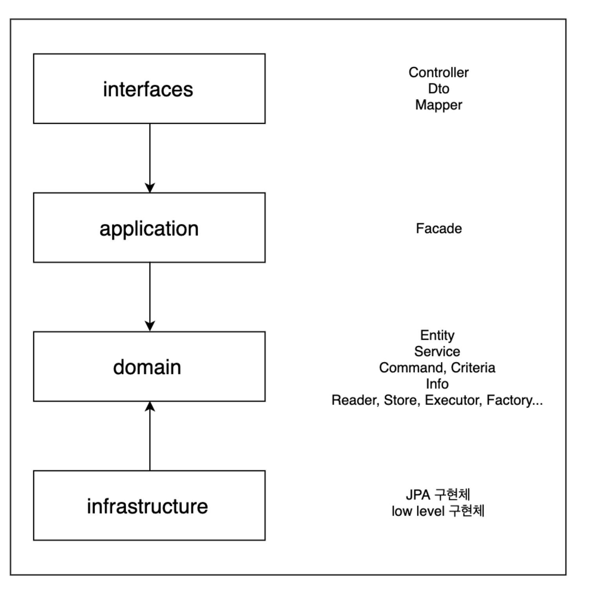

# 더레드 MSA 이희창님

[toc]

# 도메인 주도 설계

레이어간의 참조 관계에서는 단방향 의존을 유지하고 계층간 호출에서는 인터페이스를 통한 호출이 되도록 한다
Layer 별 특징과 역할, 참조 관계는 다음과 같다

| Layer                                 | Description                                                  | 주요 객체                                                    |
| ------------------------------------- | ------------------------------------------------------------ | ------------------------------------------------------------ |
| 사용자 인터페이스 (interfaces)        | 사용자에게 정보를 보여주고 사용자의 명령을 해석하는 책임을 진다. | Controller, Dto, Mapper (Converter)                          |
| 응용 계층 (application)               | 수행할 작업을 정의하고 표현력 있는 도메인 객체가 문제를 해결하게 한다. 업무상 중요하거나 다른 시스템의 응용 계층과 상호 작용하는 데 필요한 작업들이다. 이 계층은 얇게 유지되며, 작업을 조정하고 아래에 위치한 도메인 객체의 협력자에게 작업을 위임한다. | Facade                                                       |
| 도메인 계층 (domain)                  | 업무 개념과 업무 상황에 대한 정보, 업무 규칙을 표현하는 일을 책임진다. 업무 상황을 반영하는 상태를 제어하고 사용하며, 그와 같은 상태 저장과 관련된 기술적인 세부사항은 인프라 스트럭쳐에 위임한다. 이 계층이 업무용 소프트웨어의 핵심이다. | Entity, Service, Command, Criteria, Info, Reader, Store, Executor, Factory (interface) |
| 인프라 스트럭쳐 계층 (infrastructure) | 상위 계층을 지원하는 일반화된 기술적 기능을 제공한다. 이러한 기능에는 애플리케이션에 대한 메시지 전송, 도메인 영속화, UI에 위젯을 그리는 것 등이 있다. | ReaderImpl, StoreImpl, Spring JPA, RedisConnector            |

* Layer 간의 참조 관계에서 application 과 Infrastructure 는 domain layer 를 바라보게 하고 양방향 참조는 허용하지 않게 한다
* domain layer 는 low level 의 기술에 상관없이 독립적으로 존재할 수 있어야 한다

* 이를 위해 대부분의 주요 로직은 추상화되고, runtime 시에는 DIP 개념을 활용하여 실제 구현체가 동작하게 한다

## Domain Layer

Domain Layer

DDD 에서 말하는 domain layer 의 역할은 다음과 같다

* 업무 개념과 업무 상황에 대한 정보, 업무 규칙을 표현하는 일을 책임진다
* 이 계층에서는 업무 상황을 반영하는 상태를 제어하고 사용하며 그와 같은 상태 저장과 관련된 기술적인 세부사항은 인프라 스트럭쳐에 위임한다.
* 이 계층이 업무용 소프트웨어의 핵심이다

DDD 의 목표는 기술보다는 도메인에 대한 모델에 집중해 더 나은 소프트웨어를 만들어내는 것이다 (DDD 154p 참고)

DDD 에서 도메인 모델을 정의하고 구현하는 layer 는 domain layer 이기 때문에 DDD 에서는 domain layer 가 핵심이다

또한 하나의 책임을 가져가는 각각의 구현체는 그 책임과 역할에 맞는 네이밍으로 선언하는 것이 가독성에 좋다

* 아래와 같은 네이밍이 적절한 예시가 될 것이다
* XxxxReader
* XxxxStore
* XxxxExecutor
* XxxxFactory
* XxxxAggregator

* 해당 구현체는 domain layer 에서는 inteface 로 추상화하고 실제 구현체는 Infrastructure layer 에서 구현한다

## Infrastructure Layer

DDD 에서 말하는 Infrastructure layer 의 역할은 다음과 같다

* 상위 계층을 지원하는 일반화된 기술적 기능을 제공한다

1. domain layer 에 선언되고 사용되는 추상화된 interface 를 실제로 구현하여 runtime 시에는 실제 로직이 동작하게 한다
   1. DIP 개념을 활용한다 (예시 다이어그램)

2. 세세한 기술 스택을 활용하여 domain 의 추상화된 interface 를 구현하는 것이므로 비 교적 구현에서의 자유도를 높게 가져갈 수 있다
   읽어보면 좋을만한 아티클을 공유한다
   1. https://deviq.com/principles/persistence-ignorance
   2. https://enterprisecraftsmanship.com/posts/having-the-domain-model-separate-from-the-persistence-model/

3.  Service 간의 참조 관계는 막았지만, Infrastructure layer 에서의 구현체 간에는 참조 관계를 허용한다
   1. Infrastructure 에서의 구현체는 domain layer 에 선언된 interface 를 구현하는 경우가 대부분이므로 Service 에 비해 의존성을 많이 가지지 않게 된다
   2. 로직의 재활용을 위해 Infrastructure 내의 구현체를 의존 관계로 활용해도 된다

## Application Layer

도메인 주도 설계 (이하 DDD 에서 말하는 application layer 의 역할은 다음과 같다

* 수행할 작업을 정의한다
* 도메인 객체가 문제를 해결하도록 지시한다
* 다른 애플리케이션 계층과의 상호 작용을 한다
* 비즈니스 규칙은 포함하지 않으며, 작업을 조정하고, 다음 하위 계층에서 도메인 객체의 협력을 위해 업무를 위임한다
* 그렇기 때문에 해당 Layer 는 얇게 유지된다
* 작업을 조정하기만 하고 도메인 상태를 가지면 안 된다

 application layer 에서는 transaction 으로 묶여야 하는 도메인 로직과그 외의 로직을 aggregation 하는 역할로 한정 짓는다