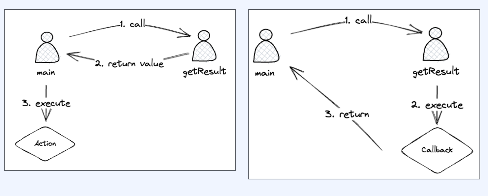
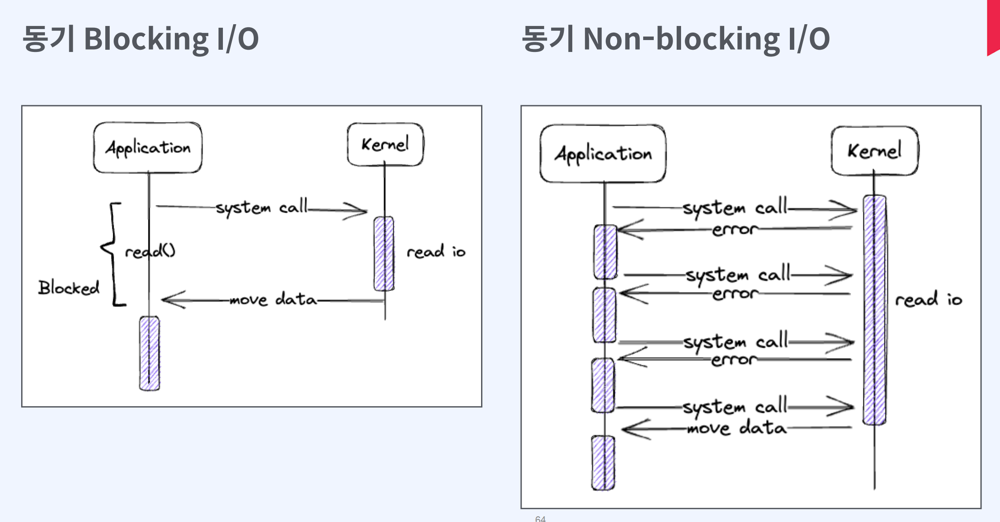
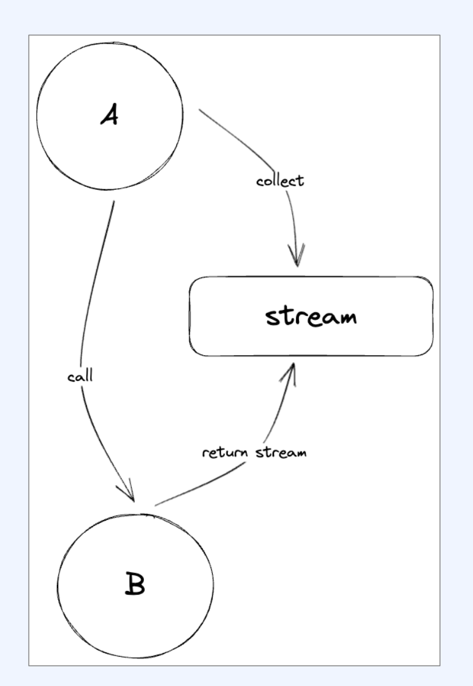
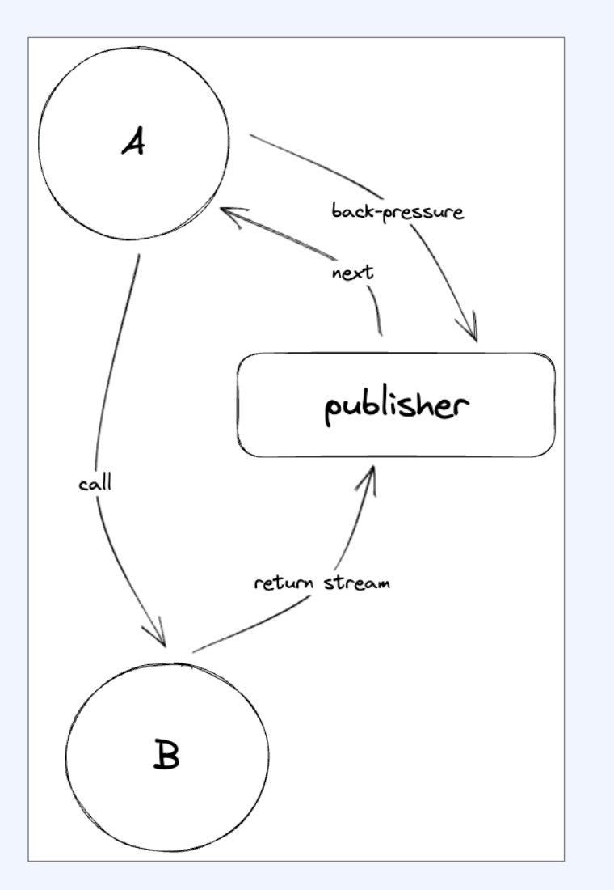
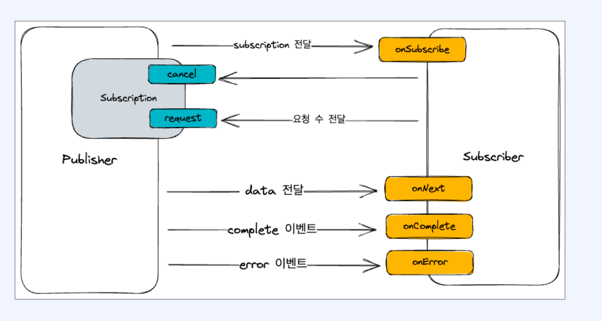
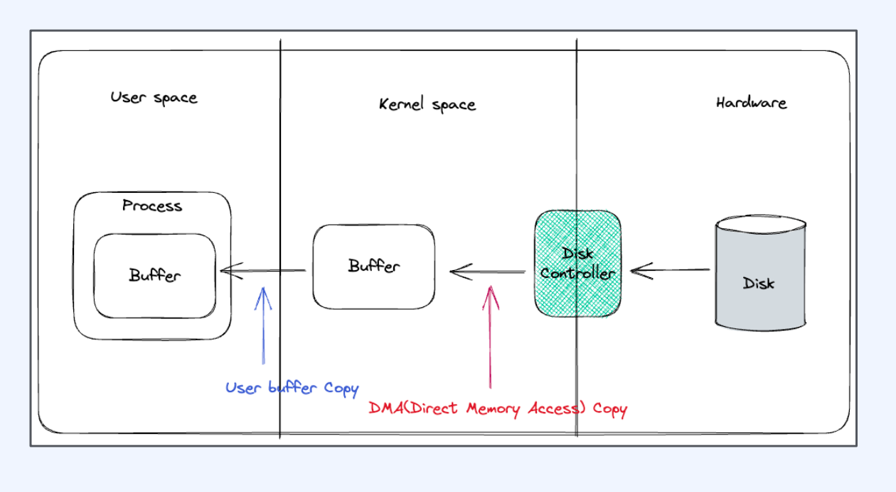
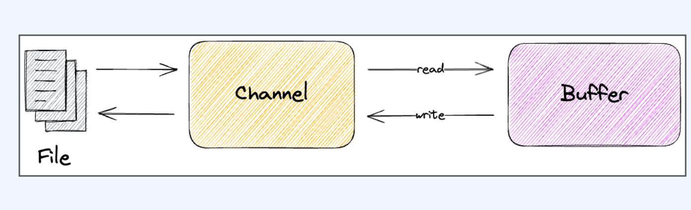

# Fastcampus - Spring Webflux 

[toc]

웹플럭스의 장단점

장점

- 효율적인 리소스 사용
- 요청이 순간적으로 늘어나도 유연하게 커버
- 동시성을 극한으로 이용해서 응답속도 단축
- Reactor, Coroutine으로 코드 가독성 유지

단점

- 비동기 로직 처리에 대한 고민
- 팀원들 모두의 러닝 커브가 필요
- 디버깅, 에러 핸들링의 어려움
- 충분하지만 완벽하지 않은 생태계

# Reactive Programming - Reactive programming과 개발 패러다임

reactive의 사전적 의미 : 반응형, 무언가를 바꾸거나 예방하기 위해 먼저 행동하기 보다는 사건이나 상황에 반응하는 

## 함수 관점에서의 동기와 비동기의 차이

Caller와 callee

함수가 다른 함수를 호출하는 상황에서

* Caller : 호출 하는 함수
* Callee: 호출 당하는 함수 

함수형 인터페이스는 호출한 쓰레드에서 실행된다. 

* 비동기에서 콜백으로 다룰 수 있다

A 모델과 B모델 두 모델의 차이를 잘 생각해보자

* 왼쪽 모델에서의 main은 caller이며 callee를 호출하고 결과를 반환받고 나서 실행한다.
  * 즉 caller는 callee의 결과에 관심이 있으며 결과를 이용해서 다음 처리를 한다
* 반면 오른쪽 모델은 실행은 callee가 하며, 결과값만 반환받는다 
  * 즉 caller는 callee의 결과에 관심이 없으며 callee가 결과를 이용해서 callback을 수행한다  

동기는 

- 요청과 결과가 순차적으로 이루어지며  한 작업이 완료될 때까지 다음 작업이 기다린다
- 예를 들면, 함수를 호출하고 결과가 반환될 때까지 프로그램이 기다려야 하는 경우에 해당한다

비동기는

- 요청을 보낸 후 바로 결과를 기다리지 않습니다.
- 결과는 나중에 (콜백, 프로미스, 이벤트 등의 형태로) 처리될 수 있습니다.
- 예를 들면, 웹 요청을 보내고 결과를 기다리지 않고 다른 작업을 계속 수행한 후, 나중에 결과가 도착하면 처리하는 경우에 해당합니다.

## 함수 관점에서 Blocking과 Nonblocking의 차이

*  main는 getResult가 결과를 돌려주기 전까지 아무것도 할 수 없다  main은 getResult가 완료될 때까지 대기한다.

*  main은 getResult가 결과를 구하 고 callback을 실행하기 전까지 아무것도 할 수 없다 main은 getResult가 완료될 때까지 대기한다.

Blocking: Caller가 Callee를 호출하고 callee가 완료되기 전까지 아무것도 할 수 없다

* 제어권을 Callee(호출 당하는 쪽 )가 갖고 있다
* Caller와 별도의 thread가 필요하지 않다 

NonBlokcing : Caller가 Callee를 호출한 후 결과를 받지 않아도 Caller는 본인의 일을 할 수 있다. 

* 제어권을 Caller(호출 하는 쪽)가 갖고 있다.
* Callee도 작업을 진행하므로 Caller와 다른 별도의 스레드가 필요하다.

그러나 동기와 블로킹은 다르다. 관심사가 다르다.

 "동기/비동기"는 결과를 누가 처리하는지 관한 것이며, "블로킹/논블로킹"은 작업을 호출한 후 제어권이 어떻게 처리되는지에 관한 것

* 동기 비동기의 관심사 : 결과, 결과 처리 주체 
* 블로킹 논블로킹의 관심사 : 제어권

1. **동기 (Synchronous) vs 비동기 (Asynchronous)**:
   - **관심사**: 결과의 "언제"
   - **동기**: 함수나 작업의 결과가 바로 반환되거나 완료될 때까지 기다린다. 결과가 준비될 때까지 다음 작업을 진행하지 않습니다.
   - **비동기**: 함수나 작업을 호출하면 그 결과를 즉시 기다리지 않습니다. 결과는 나중에, 특정 메커니즘(콜백, 프로미스, 이벤트 등)을 통해 알려줍니다.
2. **블로킹 (Blocking) vs 논블로킹 (Non-blocking)**:
   - **관심사**: 제어권의 "어떻게"
   - **블로킹**: 호출된 작업이 완료될 때까지 제어권을 유지합니다. 즉, 해당 작업이 끝날 때까지 현재 스레드나 프로세스는 다른 작업을 진행하지 않습니다.
   - **논블로킹**: 호출된 작업이 즉시 완료되지 않더라도 제어권을 즉시 반환합니다. 따라서 현재 스레드나 프로세스는 다른 작업을 계속 진행할 수 있습니다.

이해를 돕기 위한 추가적인 설명:

- **동기 블로킹**: 전통적인 함수 호출 방식. 함수 호출 후 반환값이나 결과를 받을 때까지 기다린다.
- **동기 논블로킹**: 이런 조합은 일반적이지 않다.
- **비동기 블로킹**: 가능한 조합이지만, 일반적인 비동기 패턴과는 다소 다르다.
- **비동기 논블로킹**: 이벤트 루프나 콜백을 사용하는 패턴. 함수 호출 후 결과를 기다리지 않고, 결과가 준비되면 나중에 콜백을 통해 처리한다.

|                  | 동기                                                         | 비동기                                                       |
| ---------------- | ------------------------------------------------------------ | ------------------------------------------------------------ |
| **Blocking**     | caller는 아무 것도 할 수 없는 상태가 된다. 결과를 얻은 후 직접 처리한다. | caller는 아무 것도 할 수 없는 상태가 된다. 결과는 callee가 처리한다. |
| **Non-blocking** | caller는 자기 할 일을 할 수 있다. 결과를 얻은 후 직접 처리한다. | caller는 자기 할 일을 할 수 있다. 결과는 callee가 처리한다.  |

## I/O 관점에서의 Blocking과 NonBlokcing의 차이

blocking은 thread가 오랜 시간 일을 하거나 대기하는 경우 발생

> I/O는 CPU와 커널 사이에서 일어나는 일이다. 

- CPU-bound blocking: 오랜 시간 일을 한다
- IO-bound blocking: 오랜 시간 대기한다

### CPU-bound Blocking

- thread가 대부분의 시간 CPU 점유
- 연산이 많은 경우
- 추가적인 코어를 투입
- 그래픽처리나 시뮬레이션 등 

### IO-bound blocking

- thread가 대부분의 시간을 대기
- 파일 읽기/쓰기, network 요청 처리, 요청 전달 등에서 함수를 실행하고 있던 쓰레드가 sleep을 하게된다. 
- IO-bound non-blocking 가능하다면 Caller(호출자)는 일을 할 수 있다.

### Blocking의 전파

- 하나의 함수에서 여러 함수를 호출하 기도 하고, 함수 호출은 중첩적으로 발생
- callee는 caller가 되고 다시 다른 callee를 호출
- blocking한 함수를 하나라도 호출한다면 caller는 blocking이 된다

- 함수가 non-blocking하려면 모든
- 함수가 non-blocking이어야 한다
- 따라서 I/O bound blocking 또한 발생하면 안된다

### I/O 모델의 공통점과 차이점

공통점

- Applicationol Kernel의 결과에 관심이 있다.
- Application의 Kernel로부터 받은 결과를 이용해서 다음 작업을 수행한다
- caller는 callee의 결과에 관심이 있다 -> 동기

차이점

A 모델

- Kernel이 응답을 돌려주기 전까지  Application은 아무것도 하지 않는다
- caller는 callee가 완료될때까지 대기 -> Blocking

B 모델

* Kernel이 응답을 돌려주기 전에 Application은 다른 일을 수행한다

* caller는 callee를 기다리지 않고 본인의 일을 한다 -> Non-blocking

그래서 이모델은 동기 Blocking I/O 와 동기 NonBlokcing I/O 속한다. 

## 질문

- 동기와 비동기, Blocking과 Non-blocking의 차이는 무엇인가요?
- Reactive system의 필수 요소는 무엇인가요?
- Reactive streams는 어떤 구조로 되어있나요?
- java nio는 어떻게 동작하나요? java io와의 차이는 무엇인가요?
- Reactor pattern을 사용해서 어떤 일을 할 수 있나요?
- Reactive 란 무엇인가요?

## Reactive 

리액티브 매니페스토의 4가지 핵심 가치

Responsive(응답성)

Resilient(복원력)

Elastic(유연성)

Message Driven(메시지 기반)

- 핵심 가치: 가능한 한 즉각적으로 응답
- 첫 번째 형태 1: 장애에 직면하더라도 응답성을 유지
- 두 번째 형태: 작업량이 변화하더라도 응답성을 유지
- 방법: 비동기 non-blocking 기반의 메시지 큐
   를 사용해서 통신한다

### Responsive(응답성)

요구사항

- 문제를 신속하게 탐지하고 효과적으로 대처
- 신속하고 일관성 있는 응답 시간 제공
- 신뢰할 수 있는 상한선을 설정하여 일관된 서비스 품질을 제공

결과

- 가능한 한 즉각적으로 응답
- 사용자의 편의성과 유용성의 기초
- 오류 처리를 단순화
- 일반 사용자에게 신뢰를 조성하고, 새로운 상호작용 촉진

### Resilient(복원력)

요구사항 요구사항 요구사항 요구사항 요구사항 

- 복제, 봉쇄, 격리, 위임에 의해 실현
- 장애는 각각의 구성 요소에 포함 (봉쇄)
- 구성 요소들은 서로 분리 (격리)
- 복구 프로세스는 다른(외부의) 구성 요소에 위임 (위임)
- 필요한 경우 복제를 통해 고가용성이 보장 (복제)

결과

- 장애에 직면하더라도 응답성을 유지
- 시스템이 부분적으로 고장이 나더라도, 전체 시스템 을 위험하게 하지 않고 복구 할 수 있도록 보장
- 구성 요소의 클라이언트는 장애를 처리하는데에 압 박을 받지 않습니다

### Elastic(유연성)

요구사항

- 경쟁하는 지점이나 중앙 집중적인 병목 현상이 존재 하지 않도록 설계
- 구성 요소를 샤딩하거나 복제하여 입력을 분산
- 실시간 성능을 측정하는 도구를 제공
- 응답성 있고 예측 가능한 규모 확장 알고리즘을 지원

결과

- 작업량이 변화하더라도 응답성을 유지
- 입력 속도의 변화에 따라 이러한 입력에 할당된 자 원을 증가시키거나 감소
- 상품 및 소프트웨어 플랫폼에 비용 효율이 높은 방 식으로 유연성 을 제공

### Message Driven(메시지 기반)

요구사항

- 비동기 메시지 전달에 의존
- 명시적인 메시지 전달
- 위치 투명 메시징을 통신 수단으로 사용
- 논블로킹 통신

결과

- 구성 요소 사이에서 느슨한 결합, 격리, 위치 투명성 을 보장하는 경계를 형성. 이 경계는 장애를 메시지 로 지정하는 수단을 제공
- 시스템에 메시지 큐를 생성하고, 모니터링하며 필요 시 배압(백프레셔)을 적용
- 유연성을 부여하고, 부하 관리와 흐름제어를 가능하 게
- 단일 호스트든 클러스터를 가로지르든 동일한 구성 과 의미를 갖고 장애를 관리
- 수신자가 활성화가 되어 있을 때만 자원 을 소비할 수 있기 때문에 시스템 부하를 억제

## 일반적인 프로그래밍 패러다임 vs 리액티브 패러다임

### 동기 Stream

- callee는 caller에게 응답이 아닌 stream을 제공한다
- calllee는 각각의 값을 stream을 통해서 전달한다
- calller는 해당 stream을 collect하여 이를 처리한다

stream을 이용한 흐름

- 구성 요소는 서로 비동기적으로 메시지를 주고 받으며, 독립적인 실행을 보장한다.
- -> caller는 collect를 통해서 값을 조회해야 한 다. caller와 callee는 동기적으로 동작한다
- 메시지 큐를 생성하고 배압을 적용하여 부하를 관리하고 흐름을 제어한다
- `-> stream이 메시지 큐의 역할을 하지만, 부하를 관리할 수 없다`

### 비동기 future

- calllee는 caller에게 응답이 아닌 future를 제 공한다
- callee는 각각의 값을 future를 통해서 전달한다
- caller는 해당 future를 chaining 하여 이를 처 리한다

- 구성 요소는 서로 비동기적으로 메시지를 주고 받으며, 독립적인 실행을 보장한다.
  - -> calller와 callee는 비동기적으로 동작한다
- 메시지 큐를 생성하고 배압을 적용하여 부하를 관리하고 흐름을 제어한다
  - `-> future는 메시지 큐의 역할을 할 수 없고, 부하를 관리할 수 없다. 배압도 적용할 수 없다`

그렇다면 ?

### Reactive Stream

- callee는 caller에게 응답이 아닌 publisher를 제공한다
- callee는 각각의 값을 publisher를 통해서 전달 한다
- caller는 해당 publisher를 subscribe하거나 다른 caller에게 전달한다
- caller는 subscriber를 등록하여 back-pressure를 조절하여 처리 가능한만큼 전달 받는다

- 구성 요소는 서로 비동기적으로 메시지를 주고 받으며, 독립적인 실행을 보장한다.
  - `-> callee는 publisher를 반환하고 caller는 subscriber를 등록한다. 이 과정에서 caller와 callee는 비동기적으로 동작한다`
- 메시지 큐를 생성하고 배압을 적용하여 부하를 관리하고 흐름을 제어한다
  - `-> publisher는 메시지 큐를 생성해서 부하를 관리하고 흐름을 제어한다. back-pressure를 조절할 수 있는 수단을 제공한다.`

즉 Reactive Programming은

- 비동기 데이터 stream을 사용하는 패러다임
- 모든 것이 이벤트로 구성되고 이벤트를 통해서 전파되어야 한다
  - event-driven 해야 한다
  - 데이터의 전달, 에러, 완료 까지 모두 이벤트로 취급
- Reactive manifesto의 Responsive, Resilient, Elastic, Message Driven 까지 모두 해당 해당 해당 

## event-driven vs message-driven

- message: event, command, query 등 다양한 형태를 수용
- message-driven은 event, command, query 등 다양한 형태의 메시지를 비동기적으로, 가능하다면 배압을 적용해서, 전달하는 형태에 집중
- event-driven은 message의 형태를 event로제한

- completion, error 심지어 값 까지도 이벤트의 형태로 전달
- 따라서 reactive programming은 reactive manifesto의 원칙을 지킨다

## Reactive Streams 구조

- 데이터 혹은 이벤트를 제공하는 Publisher
  - subscribe 함수 제공해서 publisher에 `다수의 subscriber 등록 지원`
  - subscription을 포함하고 Subscriber가 추가되면 subscription 제공
- 데이터 혹은 이벤트를 제공받는 Subscriber
  - subscribe하는 시점에 publisher로부터 subscription을 받을 수 있는 인자 제공
  - onNext, onError, onComplete를 통해서 값 이나 이벤트를 받을 수 있다
  - onNext는 여러 번, onError이나 onComplete 는 딱 한 번만 호출된다
- 데이터 흐름을 조절하는 Subscription
  - back-pressure를 조절할 수 있는 request 함수
  - Publisher가 onNext를 통해서 값을 전달하는 것을 취소할 수 있는 cancel 함수

## Hot Publisher vs Cold Publisher

Hot Publisher란 

- subscriber가 없더라도 데이터를 생성 하고 stream에 push하는 publisher
- 트위터 게시글 읽기, 공유 리소스 변화 등
- 여러 subscriber에게 동일한 데이터 전달

Cold Publisher란

- subscribe가 시작되는 순간부터 데이터를 생성하고 전송
- 파일 읽기, 웹 API 요청 등
- subscriber에 따라 독립적인 데이터 스트림 제공

## Reactive streams 구현 라이브러리

- Project reactor
- RXJava
- Mutiny

## Java IO의 문제점

- 동기 blocking 으로 동작
  - applicationol read를 호출하면, kernel이 응 답을 돌려줄때까지, 아무것도 할 수 없다
  - I/0 요청이 발생할 때마다 쓰레드를 새로 할당 하면, 쓰레드를 생성 및 관리하는 비용과 컨텍스트 스위칭으로 인한 cpu 자원 소모
- 커널 버퍼에 직접 접근 불가. 따라서 메모리 copy가 발생

- hardware에서 값을 읽어오면, disk controller가 DMA를 통해서 커널 버퍼에 값 을 복사
- 커널 버퍼에서 ivm 버퍼로 복사
- 이 과정에서 cpu 자원을 소모
- jvm 버퍼, jvm 메모리에 있기 때문에 gc 대상 이 되고 이는 또한 cpu 자원을 소모

## Java NIO

- java New Input/Output (non-blocking x)
- java 1.4 에서 처음 도입
- 파일과 네트워크에 데이터를 읽고 쓸 수 있는 API 제공
- buffer 기반
- non-blocking 지원
- selector, channel 도입으로 높은 성능 보장

| 특징          | Java NIO                      | Java IO (Java 10)         |
| ------------- | ----------------------------- | ------------------------- |
| 데이터의 흐름 | 양방향                        | 단방향                    |
| 종류          | Channel                       | InputStream, OutputStream |
| 데이터의 단위 | buffer                        | byte & character          |
| blocking 여부 | non-blocking (+ blocking API) | blocking만 가능           |
| 특이사항      | Selector 사용 가능            | -                         |

### Channel과 Buffer

- 데이터를 읽을 때: 적절한 크기의 Buffer를 생 성하고 Channel의 read() 메서드를 사용하여 데이터를 Buffer에 저장.
- 데이터를 쓸 때: 먼저 Buffer에 데이터를 저장 하고 Channel의 write() 메서드를 사용하여 목적지로 전달
- clear() 메서드로 초기화하여 다시 사용 가능

## DirectByteBuffer와 HeapByteBuffer (Bytebuffer의 구현체)

DirectByteBuffer

- native 메모리(off-heap)에 저장
- 커널 메모리에서 복사를 하지 않으므로 데이터 를 읽고 쓰는 속도가 빠르다
- 비용이 많이 드는 system call을 사용하므로 allocate, deallocate가 느리다

HeapByteBuffer

- JVM heap 메모리에 저장. byte array를 랩핑
- 커널 메모리에서 복사가 일어나므로 데이터를 읽고 쓰는 속도가 느리다
  - (이 과정에서 임시로 Direct Buffer를 만들기때문에 성능 저하)
- gC에서 관리가 되므로 allocate, deallocate가 빠르다 

# Spring Webflux - Spring reactive 스택과 여러 통신 기법

# Spring Data Reactive - Database에l reactive 적용하기

# Kotlin Coroutine - Coroutine으로 가독성과 성능 높이기

# Spring Test Reactive - Reactive 환경에서 테스트 구성하기

# Reactive Microservice - Reactive microservice와 Spring cloud

