# Part2 Spring Webflux

[toc]


## Spring Servlet Stack

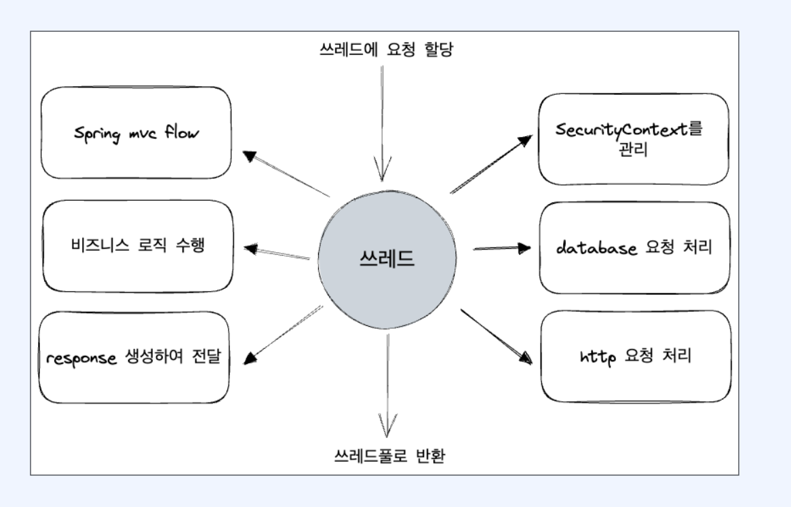

- Thread-per-request 모델을 사용하여 요청이 들어올때마다 쓰레드를 할당하여 여러 클라이언트 요청을 동시에 처리
- SecurityContext를 ThreadLocal에 저장
  - Thread가 바뀌는 리액티브 환경에서는?
- 쓰레드당 하나의 db 요청을 처리
- -> 요청이 들어올때마다 할당된 쓰레드는
   spring mvc flow, 비즈니스 로직 수행 response 생성, SecurityContext 관리, db 요청, http 요청 등 긴 활동주기를 갖는다


## C10K 문제 (Client 10K)

- 만약 1만개 혹은 그 이상의 클라이언트 요청이 동시에 들어온다면?
- Servlet container의 쓰레드풀 크기 제한
- 동기 blocking한 연산들로 인해서 작업을 완료 하고 반환되는 쓰레드 수보다 요청 수가 더 많아진다

쓰레드풀을 사용하지 않는다면?

- 쓰레드풀을 사용하지 않고 매번 쓰레드를 만든 다면?
- 쓰레드를 생성하고 제거하는 비용이 비싸다. 시스템 자원 소모가 커지고 성능 저하 발생
- 쓰레드마다 할당되는 스택 메모리로 인해서 메모리 부족 문제가 발생
- 더 많은 쓰레드가 cpu를 점유하기 위해서 컨텍스트 스위칭을 하게 된다


# Spring Reactive Stack

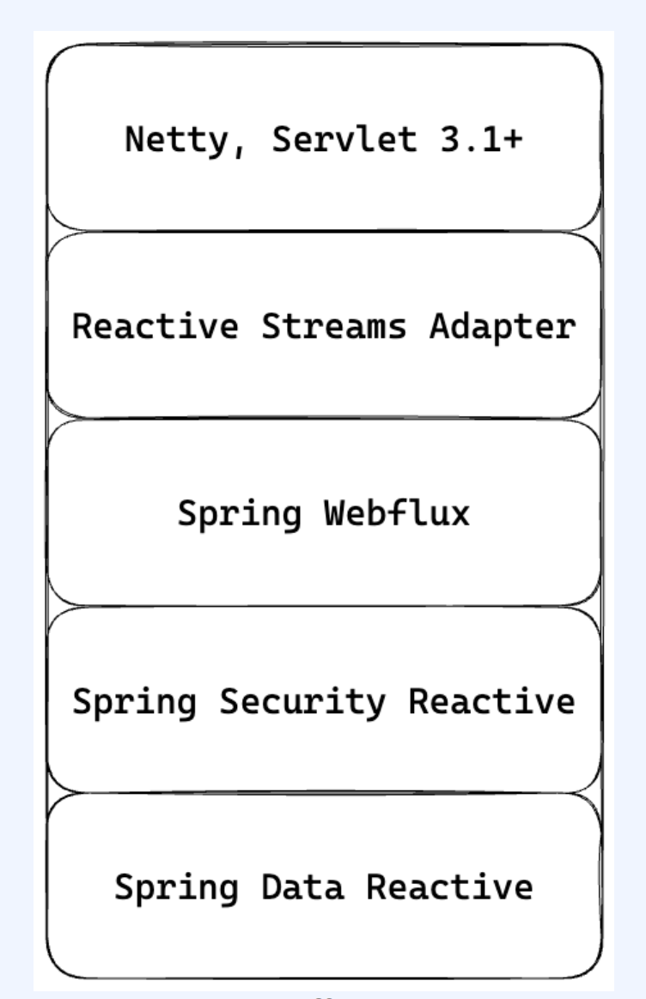


# Netty

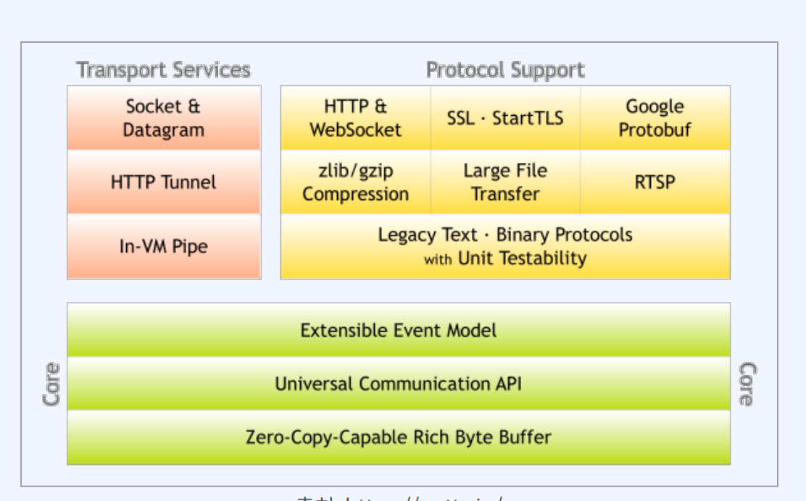

- 비동기 이벤트 기반의 네트워크 어플리케이션 프레임워크
- HTTP 뿐만 아니라 다양한 프로토콜 지원
- Java lO, NIO, selector 기반으로 적은 리소스 로 높은 성능 보장
- 불필요한 메모리 copy를 최소한으로
- 유연하며 확장 가능한 이벤트 모델 기반
- 서버와 클라이언트 모두 지원


# EventLoop

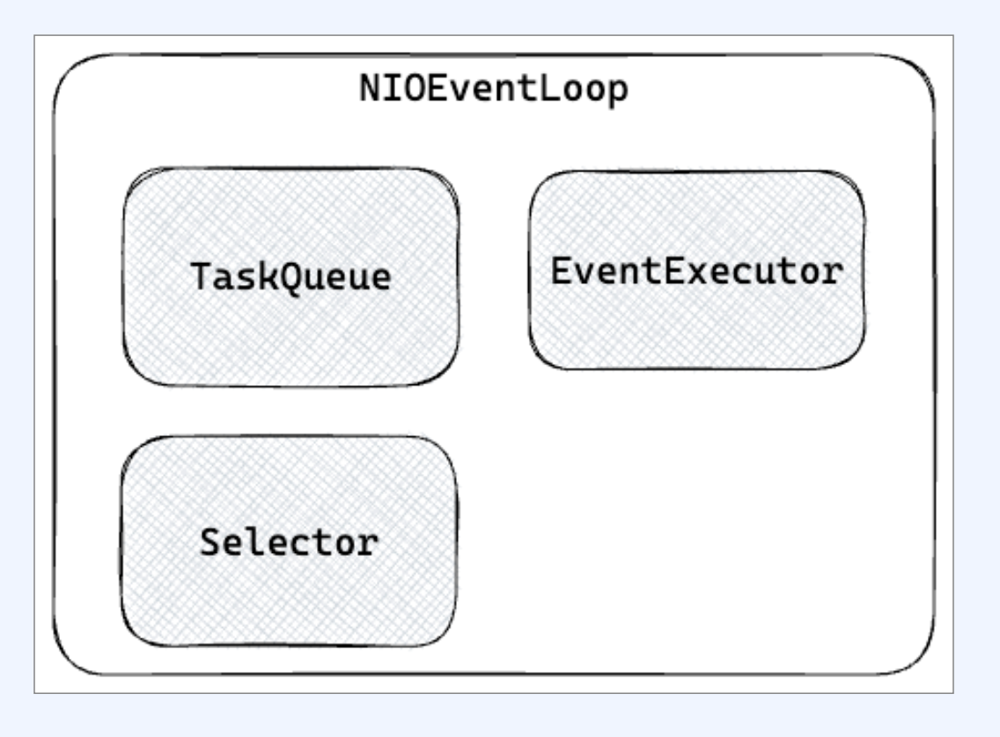

**NIOEventLoop**

* EventExecutor, TaskQueue, Selector를 포 함
*  EventExecutor: task를 실행하는 쓰레드풀
*  TaskQueue: task를 저장하는 queue. 
* eventExecutor가 즉시 task를 수행하지 않고 taskQueue에 넣은 후, 나중에 꺼내서 처리 가능
*  Selector: I/O Multiplexing을 지원

**NIOEventLoop의 task**

*  I/O task와 Non I/O task로 구분
*  I/O task: register를 통해서 내부의 selector에 channel을 등록하고 I/O 준비 완료 이벤트가 발생하면 channel의 pipeline 실행
*  Non I/O task: task queue에서 Runnable 등 실행 가능한 모든 종류의 task를 꺼내서 실행

**NIOEventLoop와 IoRatio**

- ioRatio를 설정하여 각각 `task 수행에 얼마나 시간을 쓸지` 정할 수 있다
- 기본값은 50
- I/0 task와 Non I/O task에 가능한한 동일한 시간을 소모
- 1000면 시간을 측정하지 않고 task 수행

**NIOEventLoop의 I/O task**

- NIOEventLoop를 직접 생성할 수 없기 때문에 NIOEventLoopGroup 사용
- Nio를 수행하는 `ServerSocketChannel`을 생 성하고 accept network I/0 이벤트를eventLoop에 등록
- 하나의 eventLoopGroup에 여러 개의channel 등록 가능
- I/0 이벤트 완료시 channel의 pipeline 실행

**EventLoopGroup**

* EventLoop를 포함하는 group
* 생성자를 통해서 내부에 몇 개의 EventLoop를 포함할지 설정 가능

- group에서 execute는 eventLoopGroup 내의 eventLoop를 순회하면서 execute 실행
- 각각의 eventLoop에 순차적으로 task가 추가 되고 실행하기 때문에 eventExecutor 단위로 놓고 보면 순서가 보장

```java
EventLoopGroup eventLoopGroup = new NioEventLoopGroup(5);

for (int i = 0; i < 12; i!++) {
	final int idx = i;
  
  eventLoopGroup.execute(() -> {
    log.info("i: {}", idx);
  });
}

eventLoopGroup.shutdownGracefully();
```

## Channel

**ChannelFuture**

- Channel I/O 작업이 완료되면 isDone이 true 가 되는 Future
- futureListener 등록/삭제를 지원하여 비동기 가능
- addListener: Channel I/0 작업이 완료되면 수행할 futureListener 등록
- removeListener: 등록된 futureListener 제거
- sync: 작업이 완료될때까지 blocking

**NioServerSocketChannel**

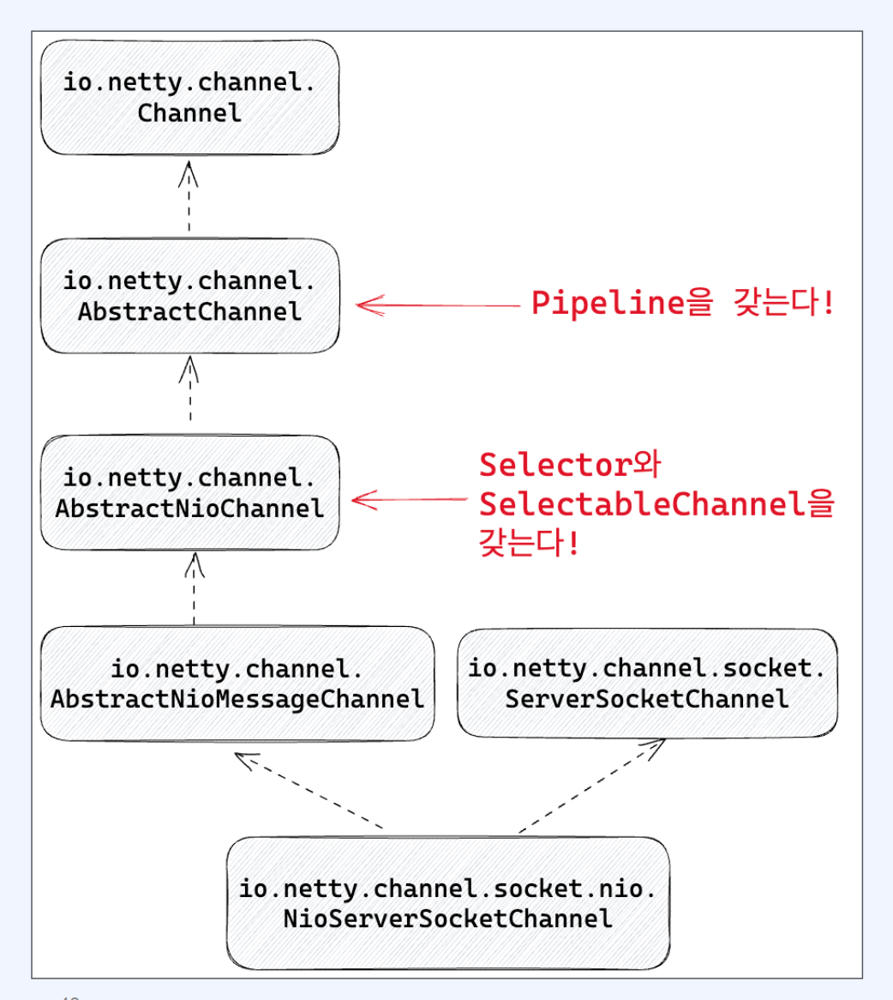

- `netty에서는 java nio의 Channel을 사용하지 않고 거의 자체 구현`
- Channel, ServerSocketChannel 모두 자체 구현
- AbstractChannel: ChannelPipeline를 갖는다
- AbstractNioChannel: 내부적으로 java.nio.ServerSocketChannel을 저장하고 register할 때 java nio Selector에 등록

**ChannelPipeline**

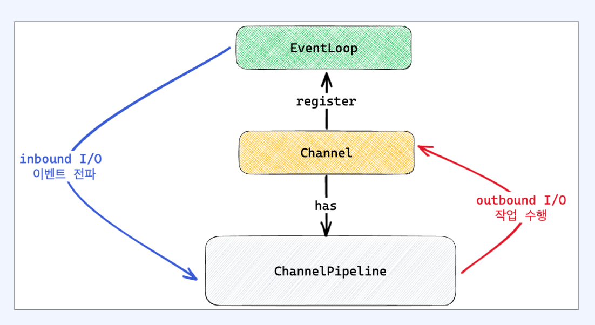

Channel의 I/O 이벤트가 준비되면, EventLoop가 pipeline 실행

*  I/O task에 해당
*  pipeline에서는 결과로 I/O 작업을 수행

전파되는(inbound) I/O 이벤트와 수행하는 (outbound) I/O 작업은 여러 가지 종류가 있 지만..
대부분의 경우  ChannelPipeline으로 I/O read 이벤트가 전파되고
ChannelPipeline은 I/O write 작업을 수행 한다

**ChannelPipeline의 내부** 

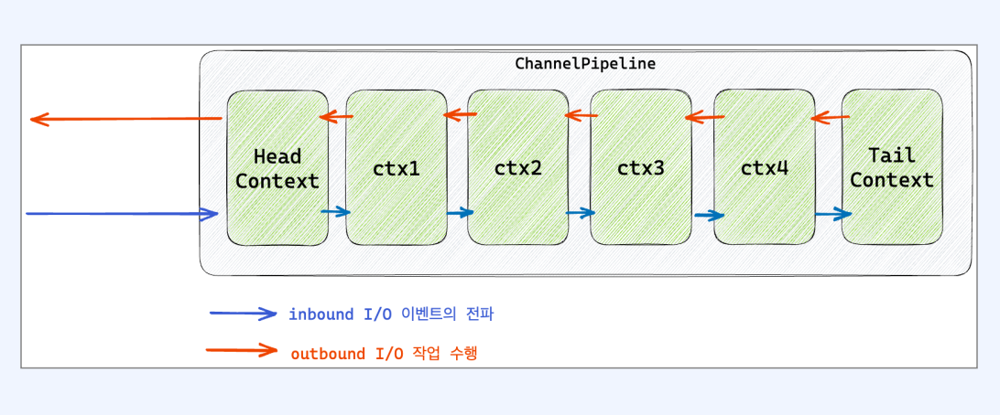

* pipeline는 ChannelHandlerContext의 연속
*  Head context와 Tail context 기본적으로 포함
*  각각의 context는 LinkedList 형태로 next, prev를 통해서 이전 혹은 다음 context에 접 근 가능
*  모든 inbound I/O 이벤트는 next로
*  모든 outbound I/O 작업은 prev로

**ChannelHandlerContext 내부**

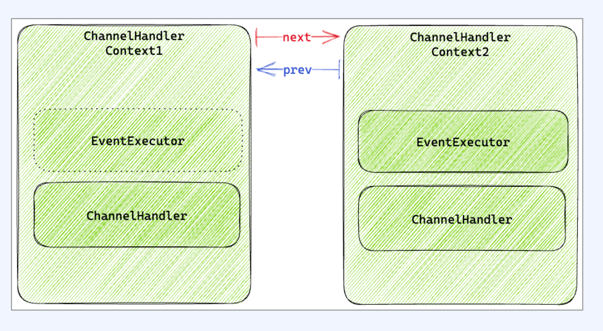

ChannelHandlerContext는 EventExecutor와 ChannelHandler를 포함

ChannelHandler는 I/O 이벤트를 받아서

다음 context에게 넘겨줄 수도 있고,  다음 context에게 넘겨주지 않고 I/O 작업 을 수행할 수도 있다

### ChannelHandlerContext에서 별도의 EventExecutor를 지원하는 이유?
ChannelHandlerContext와 EventExecutor

ChannelHandler에서 시간이 오래 걸리는 연산을 진행한다면?

* EventLoop 쓰레드에서 해당 ChannelHandler에서 blocking
* EventLoop에 등록된 다른 Channel의 I/O 처리 또한 blocking
* 해당 ChannelHandler에서는 EventLoop 쓰레드가 아닌 다른 쓰레드풀을 사용한다면?

이를 위해서 ChannelHandlerContext에 등록된 EventExecutor가 있다면

*  next context가 다른 쓰레드풀에서 동작해야하는구나 라고 판단
*  직접 이벤트 처리를 호출하지 않고 executor.execute로 taskQueue에 넣고 EventLoop 쓰레드는 복귀

### ChannelHandler

Channel의 I/O 이벤트를 처리하거나 I/O 작업 을 수행하는 handler

*  ChannelInboundHandler와 ChannelOutboundHandler
  *  ChannelInboundHandler: Channel I/O 이벤트를 수행
  *  ChannelOutboundHandler: Channel I/O 작업을 수행
  *  ChannelDuplexHandler: ChannelInboundHandler와 ChannelOutboundHandler 모두 구현


#### ChannelInboundHandler

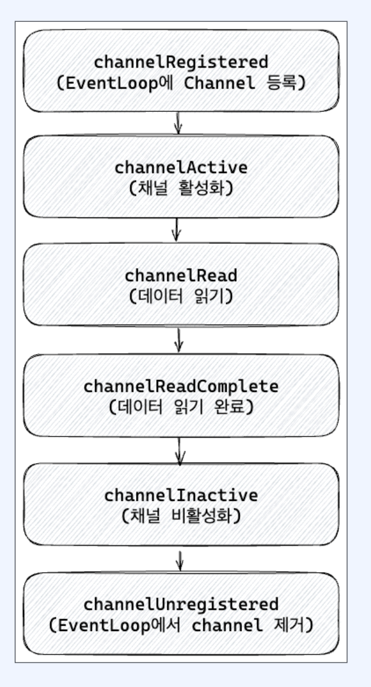


inbound I/O 이벤트를 처리하기 위한 handler

*  channelRegistered: channel이 eventLoop에 등록되는 경우
*  channelUnregistered: channel이 eventLoop에서 제거되는 경우
*  channelActive: channel이 active되는 경우
*  channelInactive: channel이 inactive되고 close되는 경우
*  channelRead: channel로부터 메시지를 읽을 준비가 된 경우
*  channelReadComplete: channelRead를 통해서 모든 메시지를 읽은 경우
*  userEventTriggered: user event가 트리거된 경우
*  channelWritabilityChanged: channel이 쓸 수 있는 상태가 변경된 경우. 딱 한번 호출

#### ChannelOutboundHandler

outbound I/O 작업을 가로채서 처리하는 handler

* bind: serverSocketChannel에 bind 요청 시 호출
* connect: socketChannel이 connect 요청 시 호출
* disconnect: socketChannel이 disconnect 요청 시 호출
* deregister: eventLoop로부터 deregister되면 호출
* read: channel에 대한 read 요청 시 호출
* write: channel에 대한 write 요청 시 호출. 나중에 작업하는 handler 가 이전 메세지를 다른 값으로 변경할 수 있다
* flush: flush 작업이 수행된 경우 호출
* close: channel이 닫히면 호출


# HttpHandler

- ServerHttpRequest와 ServerHttpResponse를 인자로 받고 응답을 돌려줘야 하는 시점을 반환하는 함수형 인터페이스

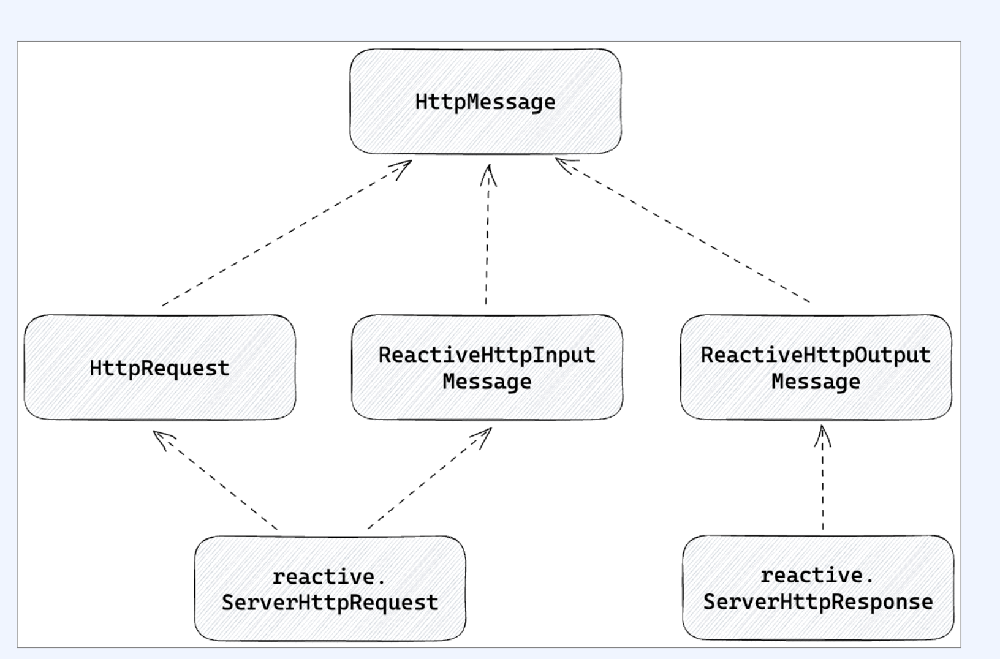

```java
public interface HttpMessage {

	/**
	 * Return the headers of this message.
	 * @return a corresponding HttpHeaders object (never {@code null})
	 */
	HttpHeaders getHeaders();

}
```


# WEbHandler

- Filter, Codec, ExceptionHandler 등을 지원
- ServerWebExchange를 제공

```java
public interface WebHandler {
    Mono<Void> handle(ServerWebExchange exchange);
}

public interface WebFilter {
    Mono<Void> filter(ServerWebExchange exchange, WebFilterChain chain);
}

public interface WebExceptionHandler {
    Mono<Void> handle(ServerWebExchange exchange, Throwable ex);
}
```

`WebHandler`는 웹 요청을 처리합니다.

`WebFilter`는 웹 요청을 필터링합니다.

`WebExceptionHandler`는 웹 요청 중 발생하는 예외를 처리합니다.

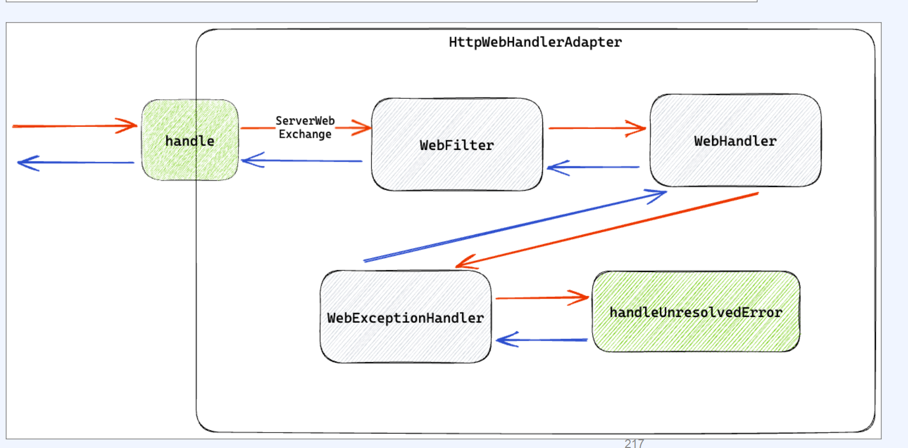

그 아무도 에러를 캐치하지 못하게 되면, handleUnresolvedError로 에러가 전달이 된다. 


# ServerWebExchange를 만드는 과정

`ServerWebExchange`는 Spring WebFlux에서 비동기 및 논블로킹 웹 응용 프로그램을 구축하기 위해 사용하는 핵심 인터페이스 중 하나입니다. 이것은 서버 측에서 HTTP 요청 및 응답을 캡슐화하여 처리하는 데 사용됩니다. 

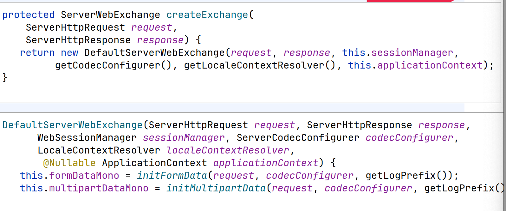

HttpWebHandlerAdapter는 ServerWebExchange를 만들면서 CodecConfigurer를 전달

CodecConfigurer 로 formData와 tmultipartData mono를 초기화

## MultipartData

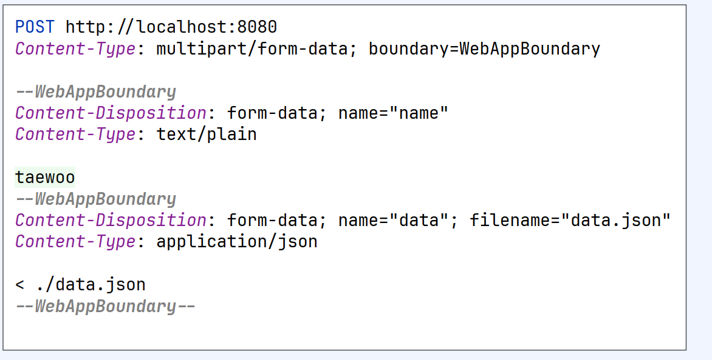

• MultipartData는 여러 part로 구성
• plain text 혹은 파일 등을 보낼 수 있고
• boundary로 구분

- Part 인터페이스를 구현한 FormFieldPart와 FilePart로 구분
- FormFieldPart는 plain text 필드에 해당. value()를 통해서 값에 접근 가능
- FilePart는 file 필드에 해당. filename()으로 파일명에 접근하고, transfer To로 로컬에 file 필드의 내용을 전달

## WebFilter

- chain.filter를 호출하기 전에 로직을 수행하면 servlet 스택 Handlerlnterceptor의 preHandle과 동일
- chain.filter를 호출한 후 chaining을 하여 로 직을 수행하면 Handlerinterceptor의 postHandle과 동일

```java
var preFilter = new WebFilter() {
    @Override
    public Mono<Void> filter(ServerWebExchange exchange, WebFilterChain chain) {
        log.info("pre filter");
        return chain.filter(exchange);
    }
};

var afterFilter = new WebFilter() {
    @Override
    public Mono<Void> filter(ServerWebExchange exchange, WebFilterChain chain) {
        return chain.filter(exchange).doOnSuccess(v -> {
            log.info("after filter");
        });
    }
};

var webHandler = exchange -> {
    log.info("web handler");
    return Mono.empty();
};

final HttpHandler webHttpHandler = WebHttpHandlerBuilder
        .webHandler(webHandler)
        .filter(preFilter, afterFilter)
        .build();

52:15 [reactor-http-nio-2] - pre filter
52:15 [reactor-http-nio-2] - web handler
52:15 [reactor-http-nio-2] - after filter
```

jwt 및 basic 인증 예시

```java
@Order(1)
public class JwtAuthenticationFilter implements WebFilter {

    private static final Logger log = LoggerFactory.getLogger(JwtAuthenticationFilter.class);
    private static final Key key = Keys.secretKeyFor(SignatureAlgorithm.HS256); // Replace with your secret key

    @Override
    public Mono<Void> filter(ServerWebExchange exchange, WebFilterChain chain) {
        String authHeader = exchange.getRequest().getHeaders().getFirst("Authorization");

        if (authHeader != null && authHeader.startsWith("Bearer ")) {
            String token = authHeader.substring(7);
            try {
                Claims claims = Jwts.parserBuilder()
                        .setSigningKey(key)
                        .build()
                        .parseClaimsJws(token)
                        .getBody();

                Authentication authentication = new JwtAuthenticationToken(claims); // Custom implementation
                SecurityContext context = new SecurityContextImpl(authentication);

                return chain.filter(exchange)
                  .contextWrite(ReactiveSecurityContextHolder                                  .withSecurityContext(Mono.just(context)));
            } catch (Exception e) {
                log.error("Invalid JWT token", e);
                exchange.getResponse().setStatusCode(HttpStatus.UNAUTHORIZED);
                return exchange.getResponse().setComplete();
            }
        }

        return chain.filter(exchange);
    }
}

@Order(2)
public class BasicAuthenticationFilter implements WebFilter {

    private static final Logger log = LoggerFactory.getLogger(BasicAuthenticationFilter.class);

    @Override
    public Mono<Void> filter(ServerWebExchange exchange, WebFilterChain chain) {
        String authHeader = exchange.getRequest().getHeaders().getFirst("Authorization");

        if (authHeader != null && authHeader.startsWith("Basic ")) {
            String base64Credentials = authHeader.substring(6);
            String credentials = new String(Base64.getDecoder().decode(base64Credentials), StandardCharsets.UTF_8);
            final String[] values = credentials.split(":", 2);

            String username = values[0];
            String password = values[1];

            // Replace with actual user validation logic
            if ("user".equals(username) && "password".equals(password)) {
                Authentication authentication = new BasicAuthenticationToken(username, password); // Custom implementation
                SecurityContext context = new SecurityContextImpl(authentication);

                return chain.filter(exchange)
                  .contextWrite(ReactiveSecurityContextHolder.withSecurityContext(Mono.just(context)));
            } else {
                exchange.getResponse().setStatusCode(HttpStatus.UNAUTHORIZED);
                return exchange.getResponse().setComplete();
            }
        }

        return chain.filter(exchange);
    }
}
```


# WebExceptionHandler

WebHandler에서 Exception이 발생한 경우 handling하는 handler

```java
public interface WebExceptionHandler {

  Mono<Void> handle (ServerWebExchange exchange, Throwable ex);

}
```

- ServerWebExchange와 Throwable을 인자fㅗ WebHandler에서 에러가 발생한 경우,
   WebExceptionHandler이 exchang와  throwable을 전달
- 처리가 완료되면 Mono<Void>를 반환
- 상태를 변경하고 body를 write하거나
- Mono.error를 반환하여 error를 처리하지 않고 다음 exceptionHandler에게 pass

```java
@Bean
    public WebExceptionHandler exceptionHandler() {
        return new WebExceptionHandler() {
            @Override
            public Mono<Void> handle(ServerWebExchange exchange, Throwable ex) {
                final ServerHttpResponse response = exchange.getResponse();
                if (ex instanceof CustomException) {
                    response.setStatusCode(HttpStatus.BAD_REQUEST);
                    var respBody = response.bufferFactory().wrap(ex.getMessage().getBytes());
                    return response.writeWith(Mono.just(respBody));
                } else {
                    return Mono.error(ex);
                }
            }
        };
    }
```

**CustomException**: 사용자 정의 예외 클래스입니다.

**exceptionHandler**: `WebExceptionHandler`를 구현하여 예외가 발생했을 때 처리합니다. `CustomException`의 경우 HTTP 400 상태 코드를 반환하고, 예외 메시지를 응답 본문에 포함시킵니다.

**webHttpHandler**: `WebHttpHandlerBuilder`를 사용하여 `WebHandler`와 `WebExceptionHandler`를 구성합니다.

```java

Function<String, WebExceptionHandler> exceptionHandlerFactory = (body) -> (exchange, ex) -> {
    final ServerHttpResponse response = exchange.getResponse();
    if (ex instanceof CustomException) {
        response.setStatusCode(HttpStatus.BAD_REQUEST);
        var respBody = response.bufferFactory().wrap(body.getBytes());
        return response.writeWith(Mono.just(respBody));
    } else {
        return Mono.error(ex);
    }
};

var webHandler = new WebHandler() {
    @Override
    public Mono<Void> handle(ServerWebExchange exchange) {
        // Your web handler logic here
        return Mono.empty();
    }
};

final HttpHandler webHttpHandler = WebHttpHandlerBuilder
        .webHandler(webHandler)
        .exceptionHandlers(webExceptionHandlers -> {
            webExceptionHandlers.add(exceptionHandlerFactory.apply("3"));
            webExceptionHandlers.add(exceptionHandlerFactory.apply("2"));
            webExceptionHandlers.add(exceptionHandlerFactory.apply("1"));
        })
        .build();
```

*  같은 exception을 처리하는 WebExceptionHandler가 여러 개라면 먼저 등록된 handler가 응답을 처리

- WebExceptionHandler를 구현하여 에러가 발생했을때 처리하는 컴퍼넌트를 추가
- Throwable에 instanceof를 이용하여 처리할 지 말지 결정


# Spring에서 WebHandler 실행

HttpHandlerAutoConfiguration에서 HttpHandler를 Bean으로 등록한다

```java
@Bean
public HttpHandler httpHandler(ObjectProvider<WebFluxProperties> propsProvider) {
	HttpHandler httpHandler = WebHttpHandlerBuilder.applicationContext(this.applicationContext).build(); // 주목
  
	WebFluxProperties properties = propsProvider.getIfAvailable();
	if (properties != null && StringUtils.hasText(properties.getBasePath())) {
		Map<String, HttpHandler> handlersMap = Collections.singletonMap(properties.getBasePath(), httpHandler);
		return new ContextPathCompositeHandler(handlersMap);
	}
	return httpHandler;
}
```

```
WebHttpHandlerBuilder.applicationContext(this.applicationContext).build();
```

에서는 

- applicationContext로부터 "webHandler" 이름을 갖는 bean을 찾아서 WebHandler로 등록
- application Context로부터 WebFilter class 를 갖는 bean 목록을 찾고 order로 sort하여filters로 등록
- application Context로부터  WebExceptionHandler class를 갖는 bean 목록을 찾고 order로 sort하여
   exception Handlers로 등록

*  WebSessionManager, ServerCodecConfigurer, LocaleContextResolver, ForwardedHeaderTransformer = bean을 찾아서 builder에 등록

## WebSessionManager

- WebSession을 관리하는 Manager
- ServerWebExchange에서 getSession을 통 해서 접근 가능
- exchange에는 webSession의 getSession 을 cache하여 제공
- 기본적으로 InMemoryWebSessionstore를 사용하여 모든 session을 memory에 저장

## ForwardedHeaderTransformer

- X-Forwarded-Host, X-Forwarded-Port, X-Forwarded-Proto, X-Forwarded-Prefix, X-Forwarded-Ssl, X-Forwarded-For 로 getURI의 결과를 변경
- 리버스 프록시를 거치면서 Host의 이름과 포 트 등이 Origin과 다른 경우 X-Forwarded-*를 사용하여 원래 정보에 접근 가능


# DispatcherHandler

Spring MVC에서의 `DispatcherServlet`과 비슷한 역할을한다. 

이를 통해 들어오는 HTTP 요청을 적절한 처리기로 라우팅하고 응답을 생성한다.

*  handlerMappings, handlerAdapters, resultHandlers로 구성

```java
public class DispatcherHandler implements WebHandler, PreFlightRequestHandler, ApplicationContextAware {

	@Nullable
	private List<HandlerMapping> handlerMappings;

	@Nullable
	private List<HandlerAdapter> handlerAdapters;

	@Nullable
	private List<HandlerResultHandler> resultHandlers;

	/**
	 * Create a new {@code DispatcherHandler} for the given {@link ApplicationContext}.
	 * @param applicationContext the application context to find the handler beans in
	 */
	public DispatcherHandler(ApplicationContext applicationContext) {
		initStrategies(applicationContext);
	}

	@Override
	public void setApplicationContext(ApplicationContext applicationContext) {
		initStrategies(applicationContext);
	}

	protected void initStrategies(ApplicationContext context) {
		Map<String, HandlerMapping> mappingBeans = BeanFactoryUtils.beansOfTypeIncludingAncestors(
				context, HandlerMapping.class, true, false);

		ArrayList<HandlerMapping> mappings = new ArrayList<>(mappingBeans.values());
		AnnotationAwareOrderComparator.sort(mappings);
		this.handlerMappings = Collections.unmodifiableList(mappings);

		Map<String, HandlerAdapter> adapterBeans = BeanFactoryUtils.beansOfTypeIncludingAncestors(
				context, HandlerAdapter.class, true, false);

		this.handlerAdapters = new ArrayList<>(adapterBeans.values());
		AnnotationAwareOrderComparator.sort(this.handlerAdapters);

		Map<String, HandlerResultHandler> beans = BeanFactoryUtils.beansOfTypeIncludingAncestors(
				context, HandlerResultHandler.class, true, false);

		this.resultHandlers = new ArrayList<>(beans.values());
		AnnotationAwareOrderComparator.sort(this.resultHandlers);
	}


	@Override
	public Mono<Void> handle(ServerWebExchange exchange) {
		if (this.handlerMappings == null) {
			return createNotFoundError();
		}
		if (CorsUtils.isPreFlightRequest(exchange.getRequest())) {
			return handlePreFlight(exchange);
		}
		return Flux.fromIterable(this.handlerMappings)
				.concatMap(mapping -> mapping.getHandler(exchange))
				.next()
				.switchIfEmpty(createNotFoundError())
				.onErrorResume(ex -> handleDispatchError(exchange, ex))
				.flatMap(handler -> handleRequestWith(exchange, handler));
	}
  
}
```

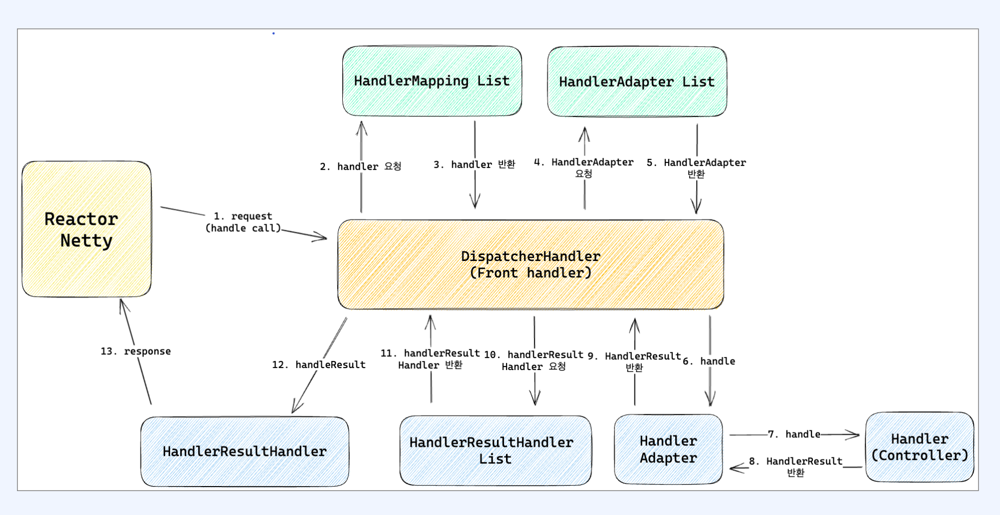

1. **Reactor Netty**: 클라이언트로부터 HTTP 요청을 받아 `DispatcherHandler`로 전달합니다.
2. **DispatcherHandler**: 등록된 `HandlerMapping` 목록을 조회하여 요청에 해당하는 핸들러를 찾습니다.
3. **HandlerMapping List**: 적절한 핸들러를 찾아 `DispatcherHandler`에 반환합니다.
4. **DispatcherHandler**: 반환된 핸들러를 처리하기 위해 `HandlerAdapter`를 조회합니다.
5. **HandlerAdapter List**: 적절한 `HandlerAdapter`를 찾아 `DispatcherHandler`에 반환합니다.
6. **DispatcherHandler**: `HandlerAdapter`를 통해 핸들러를 실행합니다.
7. **Handler (Controller)**: 컨트롤러가 요청을 처리하고 결과를 생성합니다.
8. **Handler (Controller)**: 처리 결과를 `HandlerResult`로 반환합니다.
9. **HandlerAdapter**: `HandlerResult`를 `DispatcherHandler`에 반환합니다.
10. **DispatcherHandler**: 반환된 `HandlerResult`를 처리하기 위해 `HandlerResultHandler`를 조회합니다.
11. **HandlerResultHandler List**: 적절한 `HandlerResultHandler`를 찾아 `DispatcherHandler`에 반환합니다.
12. **HandlerResultHandler**: `HandlerResult`를 처리하여 HTTP 응답으로 변환합니다.
13. **Reactor Netty**: 변환된 HTTP 응답을 클라이언트에 반환합니다.

## HandlerMapping

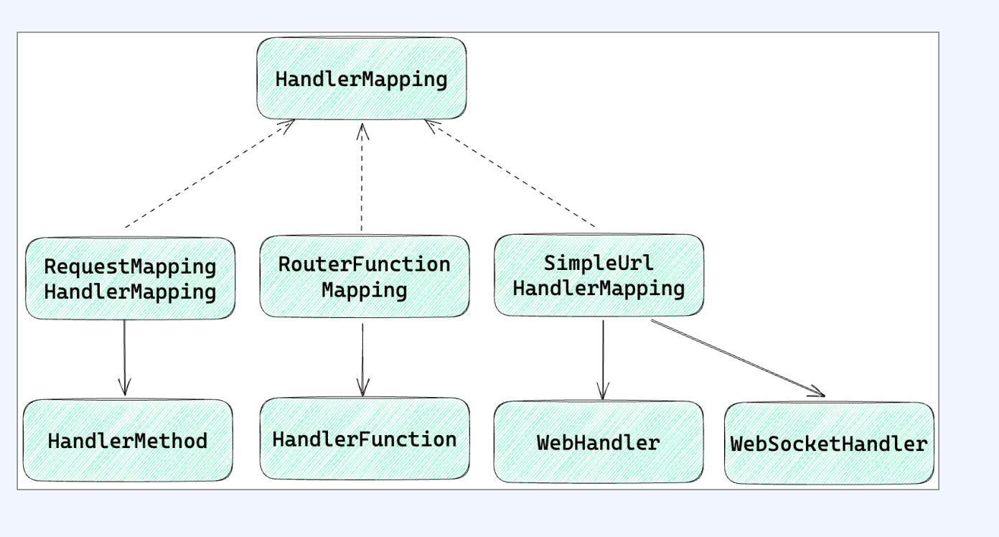

- 대표적인 HandlerMapping
  -  RequestMappingHandlerMapping
  - RouterFunctionMapping
  - SimpleUrlHandlerMapping
- 반환하는 handler 타입
  - HandlerMethod
  - HandlerFunction
  - WebHandler, WebSocketHandler


# Functional Endpoints

## HandlerFunction

`HandlerFunction`은 특정 요청을 처리하는 함수입니다. `HandlerFunction` 인터페이스는 하나의 메서드, `handle`을 가지고 있으며, 이 메서드는 `ServerRequest`를 받아 `Mono<ServerResponse>`를 반환합니다. 이 구조는 요청을 받고 적절한 응답을 생성하는 역할을 합니다.

```java
@FunctionalInterface
public interface HandlerFunction<T extends ServerResponse> {

	Mono<T> handle(ServerRequest request);

}
```

ServerRequest를 인자로 받아 ServerResponse를 Mono로 반환하는 추상 메서드.

요청을 처리하고 응답을 반환한다

## RouterFunction

`RouterFunction`은 URL 경로를 `HandlerFunction`에 매핑하는 역할을 합니다. `RouterFunction`은 `ServerRequest`를 받아 이를 처리할 `HandlerFunction`을 반환하는 함수입니다. `RouterFunction`은 여러 경로를 정의하고, 각 경로에 대해 해당 경로를 처리할 핸들러를 지정할 수 있습니다.

```java
@FunctionalInterface
public interface RouterFunction<T extends ServerResponse> {

	Mono<HandlerFunction<T>> route(ServerRequest request);

	default RouterFunction<T> and(RouterFunction<T> other) {
		return new RouterFunctions.SameComposedRouterFunction<>(this, other);
	}
 ...
}
```

* route : SeverRequest를 인자로 받아 HandlerFunction을 Mono로 반환하는 추상메서드. 
* path, method, predicate 등으로 handlerFunction과 연결하여 해당 요청이 들 어왔을때 handlerFunction을 반환


## RouterFunctionBuilder

`RouterFunctionBuilder`는 Spring WebFlux에서 제공하는 `RouterFunction`을 쉽게 구성할 수 있도록 도와주는 빌더 클래스입니다. 이를 통해 더 간결하고 직관적인 방식으로 라우팅을 설정할 수 있습니다. `RouterFunctionBuilder`는 `RouterFunctions.route()` 메서드를 통해 얻을 수 있으며, 이를 사용하여 여러 경로에 대한 핸들러를 설정할 수 있습니다.

`RouterFunctionBuilder`를 사용하면 라우터 함수를 단계별로 구성할 수 있으며, 각 단계에서 경로와 해당 경로를 처리할 핸들러를 정의할 수 있습니다.

```java
package org.springframework.web.reactive.function.server;

// In RouterFunctions.class 
public interface Builder {
    Builder GET(HandlerFunction<ServerResponse> handlerFunction);
    
    Builder GET(String pattern, HandlerFunction<ServerResponse> handlerFunction);
    
    Builder GET(RequestPredicate predicate, HandlerFunction<ServerResponse> handlerFunction);
    
    Builder GET(String pattern, RequestPredicate predicate, HandlerFunction<ServerResponse> handlerFunction);
    
    Builder nest(RequestPredicate predicate, Consumer<Builder> builderConsumer);
    
    Builder path(String pattern, Consumer<Builder> builderConsumer);
}

@Configuration
public class RouterConfig {

    @Bean
    public RouterFunction<ServerResponse> route() {
        return RouterFunctions.route()
            .GET("/hello", this::helloHandler)
            .POST("/echo", this::echoHandler)
            .build();
    }

    public Mono<ServerResponse> helloHandler(ServerRequest request) {
        return ServerResponse.ok().bodyValue("Hello, WebFlux!");
    }

    public Mono<ServerResponse> echoHandler(ServerRequest request) {
        return request.bodyToMono(String.class)
            .flatMap(body -> ServerResponse.ok().bodyValue(body));
    }
```

- handlerFunction: 해당 조건을 만족했을 경 우 실행할 HandlerFunction
- pattern: handlerFunction을 연결할 path 패턴
- predicate: handlerFunction을 연결할 추가 조건
- GET, HEAD, POST, PUT, PATCH, DELETE, OPTIONS 다른 method도 지원
- path로 공통 prefix pattern을 붙일 수 있고 nest로 공통 predicate를 더할 수 있다

## RouterFunction in Spring

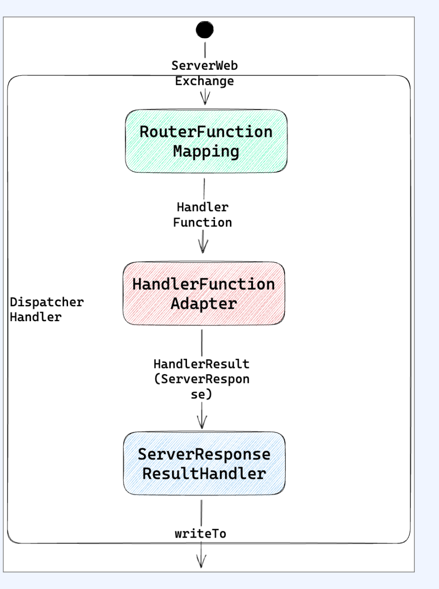

- RouterFunctionol bean으로 등록되면 RouterFunctionMapping를 통해서 handlerFunction 반환
- HandlerFunctionAdapter를 통해서  handlerFunction을 실행하고 ServerResponse를 HandlerResult에 담아 서 반환
- ServerResponseResultHandler가 HandlerResult로 render

# Annotated Controller

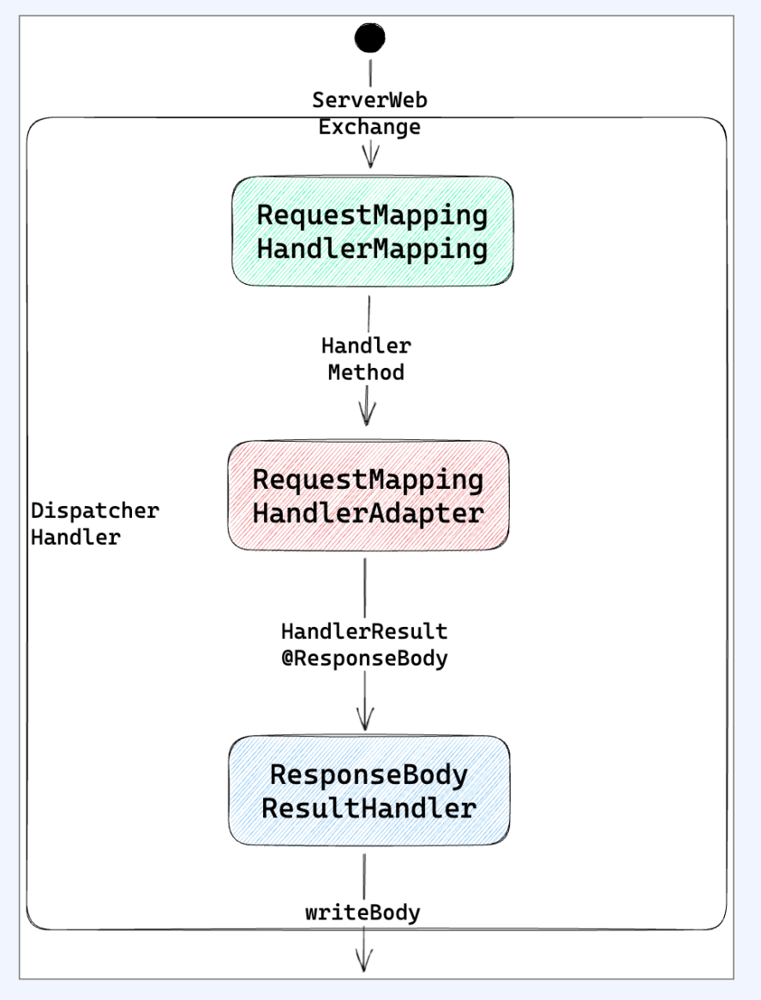

* RequestMappingHandlerMapping을 통해서 HandlerMethod를 반환

- RequestMappingHandlerAdatper를 통 해서 HandlerMethod를 실행하고

  @ResponseBody로 인해서  ResponseBodyResultHandler가 HandlerResult로  render


# Method Arguments

- Servlet stack의 Controller method argument와 거의 비슷
- 하지만 servlet stack에서 제공되지 않고 reactive stack에서만 제공 되거나 같은 역할을 하지만 다른 객체들이 제공

## ServerWebExchange

method argument로

*  ServerWebExchange 
* ServerHttpRequest, Response
* Session 등 접근 가능 

```java
@RestController
public class MyController {

    @GetMapping("/swe")
    public Mono<String> serverWebExchange(ServerWebExchange serverWebExchange) {
        String name = serverWebExchange.getRequest()
                                       .getQueryParams()
                                       .getFirst("name");
        if (name == null) {
            name = "world";
        }
        return Mono.just("Hello " + name);
    }
  
      @GetMapping("/regres")
    public Mono<String> serverRegRes(ServerHttpRequest serverHttpRequest, ServerHttpResponse serverHttpResponse) {
        String name = serverHttpRequest.getQueryParams().getFirst("name");
        if (name == null) {
            name = "world";
        }
        serverHttpResponse.setStatusCode(HttpStatus.CREATED);
        return Mono.just("Hello " + name);
    }

    @GetMapping("/session")
    public Mono<String> session(WebSession webSession, ServerWebExchange serverWebExchange) {
        String savedName = webSession.getAttribute("name");
        String name;
        if (savedName != null) {
            name = savedName;
        } else {
            name = serverWebExchange.getRequest().getQueryParams().getFirst("name");
            if (name == null) {
                name = "world";
            }
            webSession.getAttributes().put("name", name);
        }
        return Mono.just("Hello " + name);
    }
}
```


## Return Value

- void를 반환할때 필요로 하는 argument의 차이
- Flux ‹ServerSentEvent>, Observable<ServerSentEvent>를 지원 
- Servlet stack에서는 HttpMessageConverter를 사용하지만 reactive stack에서는 HttpMessageWriter


Mono Void를 반환하거나 null을 반환하는경우 response를 반환하거나 텅빈 body를 반환


# WebClient

```java
public interface Builder {
    Builder baseUrl(String baseUrl);

    Builder defaultHeaders(Consumer<HttpHeaders> headersConsumer);

    Builder defaultCookies(Consumer<MultiValueMap<String, String>> cookiesConsumer);

    Builder defaultRequest(Consumer<WebClient.RequestHeadersSpec<?>> defaultRequest);

    Builder filters(Consumer<List<ExchangeFilterFunction>> filtersConsumer);

    Builder clientConnector(ClientHttpConnector connector);

    Builder codecs(Consumer<ClientCodecConfigurer> configurer);

    Builder exchangeFunction(ExchangeFunction exchangeFunction);

    WebClient build();
}

```


### 메서드 설명

- **baseUrl(String baseUrl)**: `WebClient`의 기본 URL을 설정합니다. 모든 요청 경로에 이 URL이 접두사로 추가됩니다.
- **defaultHeaders(Consumer<HttpHeaders> headersConsumer)**: 기본으로 제공되는 헤더를 설정합니다.
- **defaultCookies(Consumer<MultiValueMap<String, String>> cookiesConsumer)**: 기본으로 제공되는 쿠키를 설정합니다.
- **defaultRequest(Consumer<WebClient.RequestHeadersSpec<?>> defaultRequest)**: 기본 요청 설정을 지정합니다.
- **filters(Consumer<List<ExchangeFilterFunction>> filtersConsumer)**: 요청을 보내기 전후에 동작하는 필터를 설정합니다.
- **clientConnector(ClientHttpConnector connector)**: `WebClient`에서 사용되는 `clientConnector`를 변경합니다.
- **codecs(Consumer<ClientCodecConfigurer> configurer)**: 클라이언트의 코덱 설정을 지정합니다.
- **exchangeFunction(ExchangeFunction exchangeFunction)**: HTTP 요청을 수행하는 `exchangeFunction`을 변경합니다.
- **build()**: 설정된 `WebClient`를 생성합니다.


### WebClient.Builder 인터페이스 정리

`WebClient.Builder` 인터페이스는 Spring WebFlux의 `WebClient`를 생성하면서 필요한 설정을 제공하는 빌더 패턴입니다. 이를 통해 `WebClient`의 기본 설정을 간편하게 구성할 수 있습니다.

```
java
코드 복사
public interface Builder {
    Builder baseUrl(String baseUrl);

    Builder defaultHeaders(Consumer<HttpHeaders> headersConsumer);

    Builder defaultCookies(Consumer<MultiValueMap<String, String>> cookiesConsumer);

    Builder defaultRequest(Consumer<WebClient.RequestHeadersSpec<?>> defaultRequest);

    Builder filters(Consumer<List<ExchangeFilterFunction>> filtersConsumer);

    Builder clientConnector(ClientHttpConnector connector);

    Builder codecs(Consumer<ClientCodecConfigurer> configurer);

    Builder exchangeFunction(ExchangeFunction exchangeFunction);

    WebClient build();
}
```

### 메서드 설명

- **baseUrl(String baseUrl)**: `WebClient`의 기본 URL을 설정합니다. 모든 요청 경로에 이 URL이 접두사로 추가됩니다.
- **defaultHeaders(Consumer<HttpHeaders> headersConsumer)**: 기본으로 제공되는 헤더를 설정합니다.
- **defaultCookies(Consumer<MultiValueMap<String, String>> cookiesConsumer)**: 기본으로 제공되는 쿠키를 설정합니다.
- **defaultRequest(Consumer<WebClient.RequestHeadersSpec<?>> defaultRequest)**: 기본 요청 설정을 지정합니다.
- **filters(Consumer<List<ExchangeFilterFunction>> filtersConsumer)**: 요청을 보내기 전후에 동작하는 필터를 설정합니다.
- **clientConnector(ClientHttpConnector connector)**: `WebClient`에서 사용되는 `clientConnector`를 변경합니다.
- **codecs(Consumer<ClientCodecConfigurer> configurer)**: 클라이언트의 코덱 설정을 지정합니다.
- **exchangeFunction(ExchangeFunction exchangeFunction)**: HTTP 요청을 수행하는 `exchangeFunction`을 변경합니다.
- **build()**: 설정된 `WebClient`를 생성합니다.

### 사용 예제

#### WebClient 생성 예제

1. **기본 WebClient 생성**:

   ```java
   WebClient webClient = WebClient.create();
   ```

2. **Builder를 이용한 WebClient 생성**:

   ```java
   WebClient.Builder webClientBuilder = WebClient.builder();
   WebClient webClient = webClientBuilder
       .baseUrl("https://fastcampus.co.kr")
       .defaultHeaders(headers -> headers.add("Authorization", "Bearer token"))
       .defaultCookies(cookies -> cookies.add("myCookie", "cookieValue"))
       .filters(filters -> filters.add((request, next) -> {
           // 필터 로직 추가
           return next.exchange(request);
       }))
       .build();
   ```

3. **baseUrl을 제공하여 WebClient 생성**:

   ```java
   WebClient webClientWithUrl = WebClient.create("https://fastcampus.co.kr");
   ```


## WebClient method

```java
nterface RequestHeadersUriSpec<T extends RequestHeadersUriSpec<T>> {
    T get();
    T head();
    RequestBodyUriSpec post();
    RequestBodyUriSpec put();
    RequestBodyUriSpec patch();
    T delete();
    T options();
    RequestBodyUriSpec method(HttpMethod method);
}
```

- get, head, post, put, patch, delete, options, method 제공
- post, put, patch의 경우 RequestBodyUriSpec를 나머지는 RequestHeadersUriSpeC를 반환

### Response Body Spec

```java
interface RequestBodySpec extends RequestHeadersSpec<RequestBodySpec> {
    RequestBodySpec contentLength(long contentLength);
    RequestBodySpec contentType(MediaType contentType);
    RequestHeadersSpec<?> bodyValue(Object body);
    <T, P extends Publisher<T>> RequestHeadersSpec<?> body(P publisher, Class<T> elementClass);
    <T, P extends Publisher<T>> RequestHeadersSpec<?> body(P publisher, ParameterizedTypeReference<T> elementTypeRef);
    RequestHeadersSpec<?> body(BodyInserter<?, ? super ClientHttpRequest> inserter);
}
```

- request의 body를 설정할 수 있는 메소드 제 공
- body 호출시 RequestHeaderSpec 반환
- bodyValue: 객체를 받아서 내부적으로 codec을 이용하여 변환
- Publisher를 이용해서 변환하거나 Bodyinserter를 이용해서 변환 가능

### RequestHeaderSpec

```java
interface RequestHeadersSpec<S extends RequestHeadersSpec<S>> {
    S accept(MediaType... acceptableMediaTypes);
    S acceptCharset(Charset... acceptableCharsets);
    S cookie(String name, String value);
    S cookies(Consumer<MultiValueMap<String, String>> cookiesConsumer);
    S header(String headerName, String... headerValues);
    S headers(Consumer<HttpHeaders> headersConsumer);
    S attribute(String name, Object value);
    S attributes(Consumer<Map<String, Object>> attributesConsumer);
    S httpRequest(Consumer<ClientHttpRequest> requestConsumer);
  
    ResponseSpec retrieve ();
   <V> Mono<V> exchangeToMono(Function<ClientResponse,? extends Mono<V> responseHandler);

   <V> Flux<V> exchangeToFlux(Function<ClientResponse, ? extends Flux<V>> responseHandler);
}
```

- accept, acceptCharset: Accept 헤더 변경
- cookie, cookies: 요청의 쿠키 변경
- header, headers: 요청의 header 변경
- attribute: webClient의 filter들에 제공되는 attribute 설정
- httpRequest: HTTP 라이브러리의 요청에 직접 접근할 수 있게 callback 제공

- retrieve, exchangeToMono, exchange ToFlux를 실행하면 요청을 서버에 전달하고 응답을 받는다
- retrieve: ResponseSpec을 반환
- exchangeToMono: ClientResponse 인자로 받고 body를 Mono 형태로 반환하는 callback
- exchange ToFlux: ClientResponse를 인자 로 받고 body를 Flux 형태로 반환하는 반환하는 callback

### URI Spec

```java
interface UriSpec<S extends RequestHeadersSpec<S>> {
    S uri(URI uri);
    S uri(String uri, Object... uriVariables);
    S uri(String uri, Map<String, ?> uriVariables);
    S uri(String uri, Function<UriBuilder, URI> uriFunction);
    S uri(Function<UriBuilder, URI> uriFunction);
}
```


- **uri(URI uri)**: URI를 설정합니다.
- **uri(String uri, Object... uriVariables)**: 문자열 URI와 가변 인자를 사용하여 URI를 설정합니다.
- **uri(String uri, Map<String, ?> uriVariables)**: 문자열 URI와 맵을 사용하여 URI를 설정합니다.
- **uri(String uri, Function<UriBuilder, URI> uriFunction)**: URI 빌더와 함수형 인터페이스를 사용하여 URI를 설정합니다.
- **uri(Function<UriBuilder, URI> uriFunction)**: URI 빌더와 함수형 인터페이스를 사용하여 URI를 설정합니다.

### Response Sepc

```java
interface ResponseSpec {
    ResponseSpec onStatus(Predicate<HttpStatus> statusPredicate,
                          Function<ClientResponse, Mono<? extends Throwable>> exceptionFunction);

    <T> Mono<T> bodyToMono(Class<T> elementClass);

    <T> Flux<T> bodyToFlux(Class<T> elementClass);

    <T> Mono<ResponseEntity<T>> toEntity(Class<T> bodyClass);

    <T> Mono<ResponseEntity<List<T>>> toEntityList(Class<T> elementClass);

    <T> Mono<ResponseEntity<Flux<T>>> toEntityFlux(Class<T> elementType);

    Mono<ResponseEntity<Void>> toBodilessEntity();
}
```

### 설명

- **onStatus**: 응답 상태를 확인하고 문제가 발생한 경우 `Mono.error`를 반환하여 에러를 전파합니다.
- **bodyToMono**: 응답을 `Mono`로 변환합니다.
- **bodyToFlux**: 응답을 `Flux`로 변환합니다.
- **toEntity**: 응답을 `ResponseEntity`로 변환합니다.
- **toEntityList**: 응답을 `ResponseEntity<List<T>>`로 변환합니다.
- **toEntityFlux**: 응답을 `ResponseEntity<Flux<T>>`로 변환합니다.
- **toBodilessEntity**: 응답을 `ResponseEntity<Void>`로 변환하고 본문은 포함하지 않습니다.

이 인터페이스는 응답을 처리하고 다양한 형태로 변환할 수 있는 메서드를 정의합니다. `onStatus` 메서드는 응답 상태를 확인하고, 조건에 따라 예외를 발생시킵니다. `bodyToMono` 및 `bodyToFlux` 메서드는 응답 본문을 각각 `Mono`와 `Flux`로 변환합니다. `toEntity` 메서드들은 응답을 `ResponseEntity`로 변환하여 다양한 형태의 데이터를 포함할 수 있습니다.


# Reactive Security

## Security FilterChain

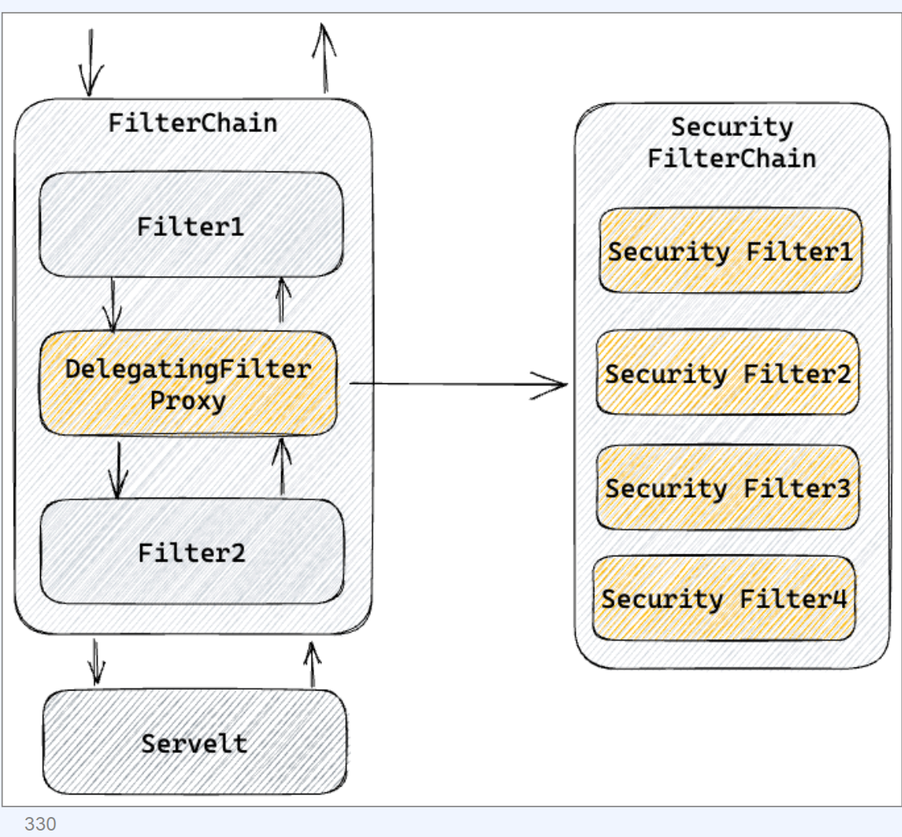

- servlet stack에서는 Servlet filter를 사용
- Servlet filterOll DelegatingFilterProxy를 추 가하고 DelegatingFilterProxy는   Security FilterChain을 호출
- filterChain 내에서는 bean을 사용하기 힘들 지만
- securityFilterChain은 spring context를 갖기 때문에 bean에 접근 가능

## SecurityWebFliterChain - Reactive

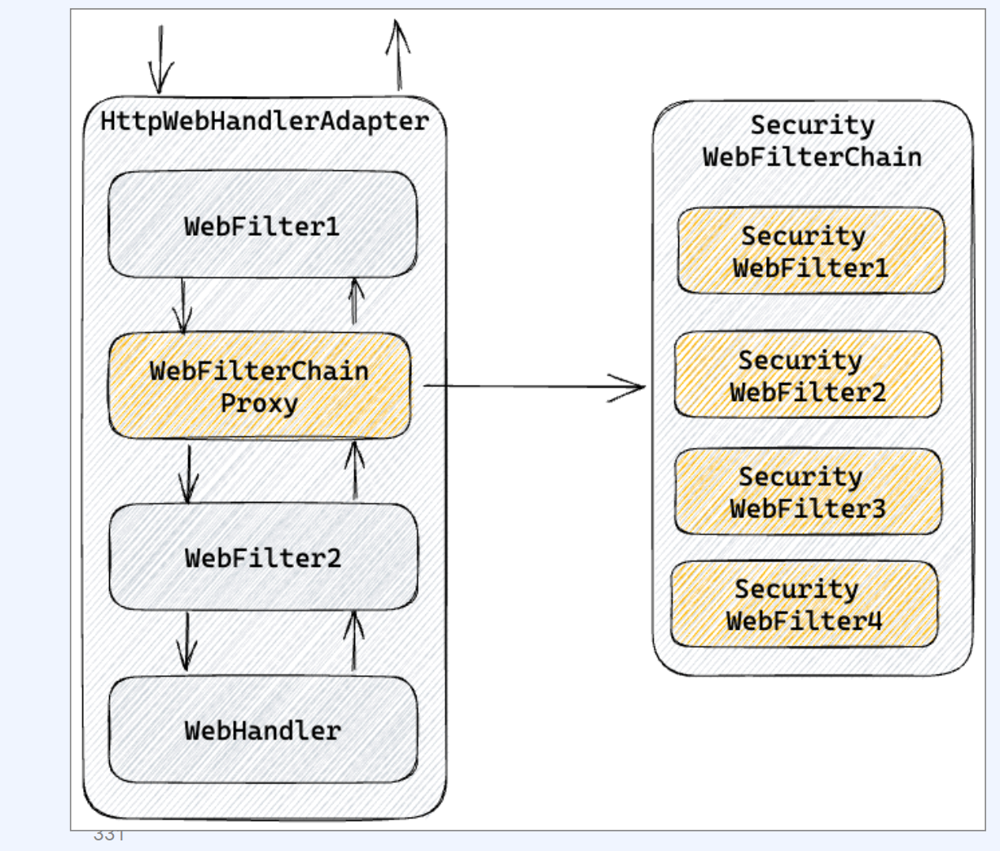

- reactive stack에서는 HttpWebHandlerAdapter의  WebFilter를 사용 
- WebFilter를 구현한 **WebFilterChainProxy**은  servlet stack의  DelegatingFilterProxy 와 동일한 역할

## Reactive Security Context Holder

```java
public final class ReactiveSecurityContextHolder {

    public static Mono<SecurityContext> getContext() {
        // SecurityContext를 Mono로 제공
    }

    public static Function<Context, Context> clearContext() {
        // SecurityContext를 클리어
    }

    public static Context withSecurityContext(Mono<? extends SecurityContext> securityContext) {
        // SecurityContext를 포함하는 Reactor context 반환
    }

    public static Context withAuthentication(Authentication authentication) {
        // SecurityContext를 받아서 이를 포함하는 Reactor context 반환
    }
}
```

- SecurityContextHolder와 비슷하지만 ThreadLocal 대신 context로 Security Context를 제공
- **getContext**: 현재 `SecurityContext`를 `Mono<SecurityContext>`로 제공합니다.
- **clearContext**: `SecurityContext`를 클리어. `Context`에서 `SecurityContext`를 제거하는 함수형 인터페이스를 반환합니다
- **withSecurityContext**: 주어진 `Mono<SecurityContext>`를 포함하는 `Reactor`의 `Context`를 반환합니다.
- **withAuthentication**: 주어진 `Authentication` 객체를 포함하는 `Reactor`의 `Context`를 반환합니다. 이는 `Authentication`을 기반으로 새로운 `SecurityContext`를 생성하여 반환합니다

```java
@Override
public Mono<Void> filter(ServerWebExchange exchange, WebFilterChain chain) {
    String iam = exchange.getRequest().getHeaders().getFirst("X-I-AM");
    
    if (iam == null) {
        final ServerHttpResponse response = exchange.getResponse();
        response.setStatusCode(HttpStatus.UNAUTHORIZED);
        return response.setComplete();
    }
  
    Authentication authentication = new CustomAuthentication(iam);
    return chain.filter(exchange)
                .contextWrite(ctx -> ReactiveSecurityContextHolder.withAuthentication(authentication));
}

```

- 헤더를 분석하여 X-|-AM 에서 값을 추출
- 텅 비었다면 401 status 반환
- 그렇지 않다면 CustomAuthentication을 생 성하고 ReactiveSecurityContextHolder의
   withAuthentication을 사용해서 context 주입

어떻게 사용할까?

```java
@GetMapping("/hello")
public Mono<String> greet() {
    return ReactiveSecurityContextHolder.getContext()
        .map(securityContext -> securityContext.getAuthentication().getPrincipal())
        .flatMap(principal -> Mono.just("Hello, " + ((Principal) principal).getName()));
}

```

*  Controller에서 ReactiveSecurityContextHolder의 getContext를 이용해서 security Context에 접근하고 이를 이용해서 응답 생성

spring WebFlux와 `ReactiveSecurityContextHolder`를 사용하면 비동기 환경에서도 요청당 컨텍스트가 유지된다. 

예시

1. WebFilter 구현

```java
@RequiredArgsConstructor
@Component
public class SecurityWebFilter implements WebFilter {

	private static final Logger log = org.slf4j.LoggerFactory.getLogger(SecurityWebFilter.class);

	private final AuthService authService;

	@Override
	public Mono<Void> filter(ServerWebExchange exchange, WebFilterChain chain) {
		final ServerHttpResponse resp = exchange.getResponse();
		String iam = exchange.getRequest()
			.getHeaders()
			.getFirst("X-I-AM");

		log.info("iam: {}", iam);

		if (iam == null) {
			resp.setStatusCode(HttpStatus.UNAUTHORIZED);
			return resp.setComplete();
		}

		return authService.getNameByToken(iam)
			.map(IamAuthentication::new)
			.flatMap(authentication -> chain.filter(exchange)
				.contextWrite(context -> {
					Context newContext = ReactiveSecurityContextHolder
						.withAuthentication(authentication);

					return context.putAll(newContext);
				}))
			.switchIfEmpty(Mono.defer(() -> {
				resp.setStatusCode(HttpStatus.UNAUTHORIZED);
				return resp.setComplete();
			}));

	}
}
```

* 자동으로 필터가 등록됌

```java
@RequiredArgsConstructor
@RequestMapping("/api/users")
@RestController
public class UserController {
    private final UserService userService;

    @GetMapping("/{userId}")
    public Mono<UserResponse> getUserById(
            @PathVariable String userId
    ) {
        return ReactiveSecurityContextHolder.getContext()
            .flatMap(context -> {
                final String name = context.getAuthentication()
                    .getName();

                System.out.println("name: " + name);

                return Mono.just(new UserResponse(
                    userId,
                    name,
                    1,
                    1L,
                    null
                ));

            });
}
```

컨트롤러에서 처리 

# Server Sent Event (SSE)

Server Sent Event

*  Chunked Transfer-Encoding 기반
*  chunk 단위로 여러 줄로 구성된 문자열을 전달
*  new line으로 이벤트를 구분
*  문자열은 일반적으로 `<field>: <value>` 형태로 구성

```
id:0
event:add
:comment-i
data:data-0

id:1
event:add
:comment-i
data:data-1

id:2
event:add
:comment-i
data:data-2

id:3
event:add
:comment-i
data:data-3

id:4
event:add
:comment-i
data:data-4
```

* id: 이벤트의 id를 가리킨다
  *  `client에서는 이벤트의 id를 저장하고`
  * `Last-Event-ID 헤더에 첨부하여 가장 마지막으로받은 이벤트가 무엇인지 전달`
  * `이를 이용해서 서버는 lastEventId 보다 큰 이벤트만 전달 가능`
* event: 이벤트의 타입을 표현
* data: 이벤트의 data를 표현
  *  여러 줄의 data 필드를 이용하면 multi line data를 표현 가능
* retry: reconnection을 위한 대기 시간을 클라이언트에게 전달
* comment: field 부분이 빈 케이스. 기능을 한다기보다는 정보를 남기기 위한 역할

Return value

- Servlet stack의 return value와 거의 비슷
- 하지만 ModelAndView 대신 Rendering을 지원
- void를 반환할때 필요로 하는 필요로 하는 argument의 차이
- Flux<ServerSentEvent>, Observable<ServerSentEvent> 를 지원 
- Servlet stack에서는 HttpMessageConverter를 사용하지만  reactive stack0에서는 HttpMessageWriter


서버-발송 이벤트(SSE)에서 `id` 값은 여러 용도로 사용될 수 있습니다. 다음은 SSE의 `id` 값을 사용하는 몇 가지 주요 사례입니다:

1. **이벤트 재연결 및 복원**:
   - 클라이언트가 연결을 끊었다가 다시 연결할 때, 마지막으로 받은 이벤트의 `id` 값을 서버에 보내어 누락된 이벤트를 복원할 수 있습니다.
   - 클라이언트는 `Last-Event-ID` 헤더를 사용하여 서버에 마지막으로 받은 이벤트의 `id` 값을 전달할 수 있습니다.
2. **이벤트 순서 관리**:
   - 이벤트의 순서를 보장하거나 추적할 수 있습니다. `id` 값을 사용하면 클라이언트가 이벤트의 순서를 유지하거나 특정 이벤트를 건너뛰지 않았는지 확인할 수 있습니다.
3. **이벤트 로그 및 디버깅**:
   - 서버 측에서 발생한 이벤트의 `id` 값을 로그에 기록하여 디버깅 및 모니터링에 사용할 수 있습니다.
   - 이벤트 ID를 사용하여 특정 이벤트를 쉽게 추적하고 문제를 진단할 수 있습니다.
4. **이벤트 필터링 및 선택**:
   - 클라이언트가 특정 `id` 값 이후의 이벤트만 필터링하여 처리할 수 있습니다. 이를 통해 클라이언트는 특정 이벤트만 선택적으로 수신하고 처리할 수 있습니다.

### 


ServerSentEvent는 ServerSentEventHttpMessageWriter가 처리한다.

* ServerSentEventHttpMessageWrite r는 Flux에 주어진 type에 따라서 ServerSentEvent라면 그대로 사용하고 아니라면 data에 집어넣는다

## ServerSentEventController 구현

```java
@Controller
@RequestMapping("/sse")
public class SseController {

    @ResponseBody
    @GetMapping(path = "/simple", produces = "text/event-stream")
    public Flux<String> simpleSse() {
        return Flux.interval(Duration.ofMillis(100))
                   .map(i -> "Hello " + i);
    }
}
```

- @ResponseBody를 추가
- GetMapping에서 produces를 통해서  response | Content-TypeO| "text/event-stream” 임을 명시
- Flux.interval을 이용해서 100ms 간격으로 하 나씩 증가된 값을 무한히 만드는 Flux 생성
- ServerSentEvent 객체를 반환한게 아니기 때 문에 id가 없고 event 또한 default 값인  "message”로 전달된다


## ServerSentEvent객체

```java
public final class ServerSentEvent<T> {

    @Nullable
    private final String id; // 이벤트의 고유 식별자

    @Nullable
    private final String event; // 이벤트의 타입

    @Nullable
    private final Duration retry; // 클라이언트가 이벤트 스트림 연결을 재시도하기 전에 기다려야 하는 시간

    @Nullable
    private final String comment; // 이벤트에 대한 설명 또는 주석

    @Nullable
    private final T data; // 이벤트의 실제 데이터

    public interface Builder<T> {

        Builder<T> id(String id);

        Builder<T> event(String event);

        Builder<T> retry(Duration retry);

        Builder<T> comment(String comment);

        Builder<T> data(@Nullable T data);

        ServerSentEvent<T> build();
    }
}
```


# WebSocket

- 0SI 7계층에 위치하는 프로토콜
  - 4계층의 TCP에 의존
- 하나의 TCP 연결로 실시간 양방향 통신 지원
- HTTP streaming에서 서버에서 클라이언트로 만 이벤트를 전달했지만 WebSocket은 양방향 통신이 가능
- HTTP와 달리 지속적인 연결을 유지하면 오버 헤드가 적다

## WebSocket 요청과 응답

- 요청에서 Upgrade: websocket과  Connection: Upgrade 헤더를 추가
- 응답으로 status 101과 함께 Upgrade: websocket, Connection: Upgrade 헤더를 제공

```
GET /websocket HTTP/1.1
Upgrade: websocket
Connection: Upgrade

HTTP/1.1 101 Switching Protocols
Upgrade: websocket
Connection: Upgrade
```

## WebSocketHandler

- handle을 통해서 WebSocketSession을 받 고 Mono<Void> 를 반환한다
- 인자로 받는 부분만 제외하면 WebHandler와 비슷

```java
public interface WebSocketHandler {
	Mono<Void> handle (WebSocketSession session):
}
```

## WebSocket CloseStatus

- 1000: NORMAL. 정상적으로 webSocket이 종료
- 1001: GOING_AWAY. 서버가 예상치 못하게 종료되 거나 페이지에서 벗어난 경우
- 1002: PROTOCOL_ERROR. 프로토콜에 문제가 있 는 경우
- 1003: NOT_ACCEPTABLE. accept할 수 없는 데이 터를 받은 경우
- 1009: TOO_BIG_TO_PROCESS. 처리하기에 너무 큰 데이터를 받은 경우
- 1011: SERVER_ERROR. 예상하지 못한 에러로 서버 에서 요청을 처리하지 못하는 경우
- 1012: SERVICE_RESTARTED. 서비스가 재시작. 클 라이언트는 5~30초 사이로 랜덤하게 접근

## WebSocketMessage

```java
public class WebSocketMessage {

	private static final boolean reactorNetty2Present = ClassUtils.isPresent(
			"io.netty5.handler.codec.http.websocketx.WebSocketFrame", WebSocketMessage.class.getClassLoader());


	private final Type type;

	private final DataBuffer payload;

	@Nullable
	private final Object nativeMessage;

  public enum Type {
		TEXT, BINARY, PING. PONG
  }
}
```

- type: WebSocketMessage 타입. TEXT, BINARY, PING, PONG 중 하나
- payload: socketMessage의 값
- getPayloadAsText: payload를 string 형태로 제공


## 핸들러 구현 및 웹소켓 등록

```java
@RequiredArgsConstructor
@Component
public class ChatWebSocketHandler implements WebSocketHandler {
    private final ChatService chatService;

    @Override
    public Mono<Void> handle(WebSocketSession session) {
        String iam = (String) session.getAttributes().get("iam");

        Flux<Chat> chatFlux = chatService.register(iam);
        chatService.sendChat(iam,
                new Chat(iam + "님 채팅방에 오신 것을 환영합니다", "system"));

        session.receive()
                .doOnNext(webSocketMessage -> {
                    String payload = webSocketMessage.getPayloadAsText();

                    String[] splits = payload.split(":");
                    String to = splits[0].trim();
                    String message = splits[1].trim();

                    boolean result = chatService.sendChat(to, new Chat(message, iam));
                    if (!result) {
                        chatService.sendChat(iam, new Chat("대화 상대가 없습니다", "system"));
                    }
                }).subscribe();

        return session.send(chatFlux
                .map(chat -> session.textMessage(chat.getFrom() + ": " + chat.getMessage()))
        );
    }
}

// 등록 
@Configuration
public class MappingConfig {
    @Bean
    SimpleUrlHandlerMapping simpleUrlHandlerMapping(
            ChatWebSocketHandler chatWebSocketHandler
    ) {
        Map<String, WebSocketHandler> urlMapper = Map.of(
                "/chat", chatWebSocketHandler
        );

        SimpleUrlHandlerMapping mapping = new SimpleUrlHandlerMapping();
        mapping.setOrder(1);
        mapping.setUrlMap(urlMapper);

        return mapping;
    }

}
```


