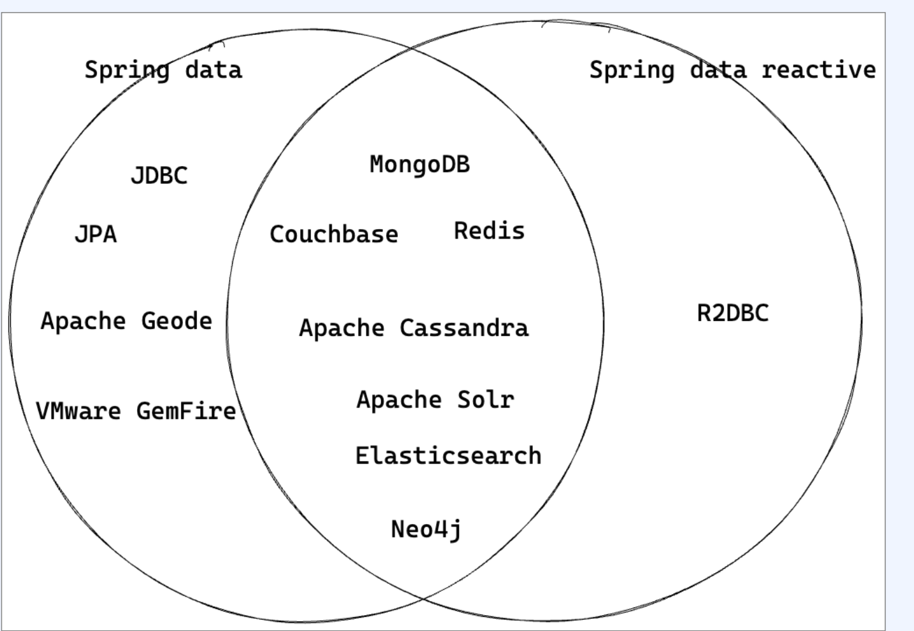
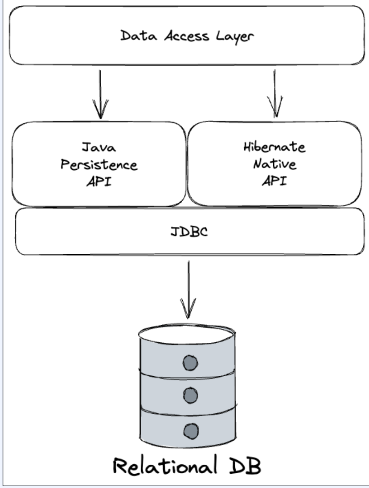
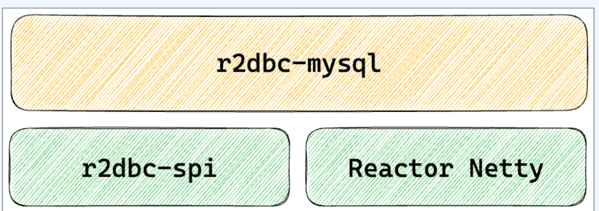
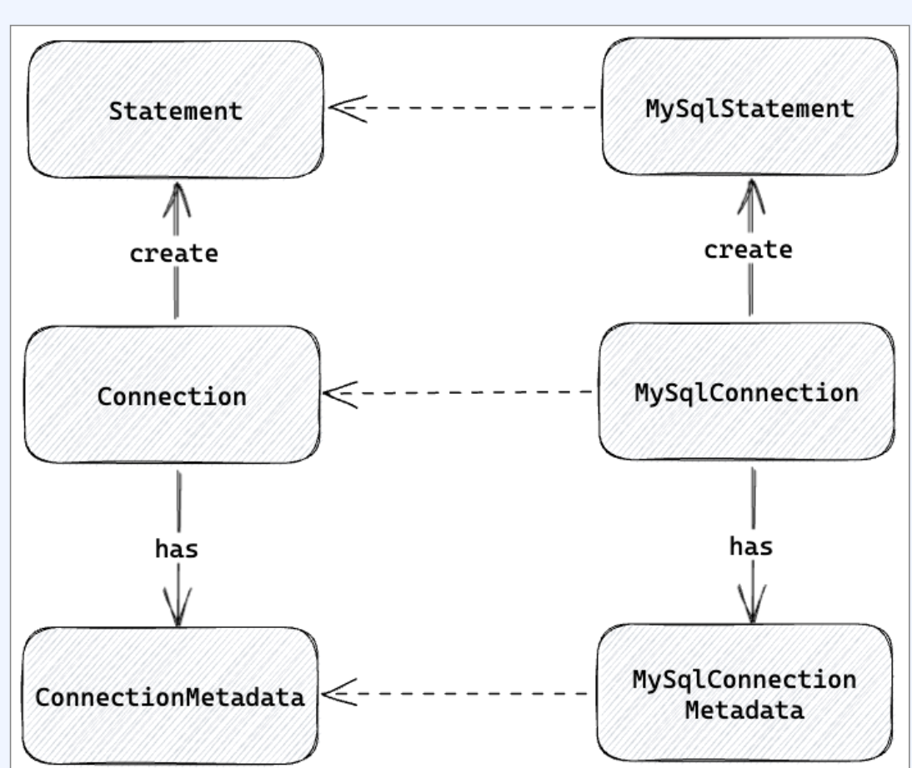
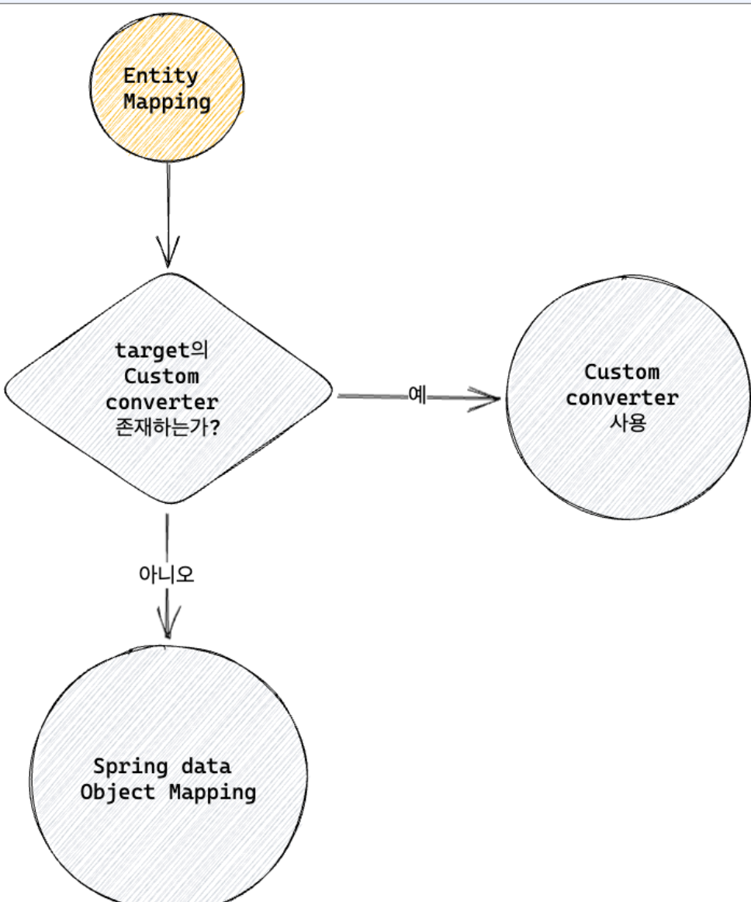
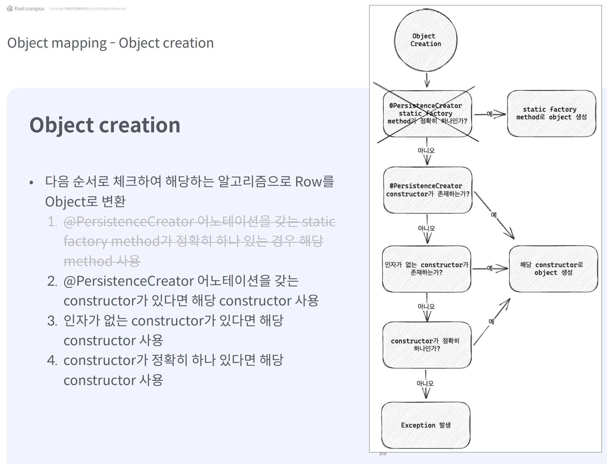
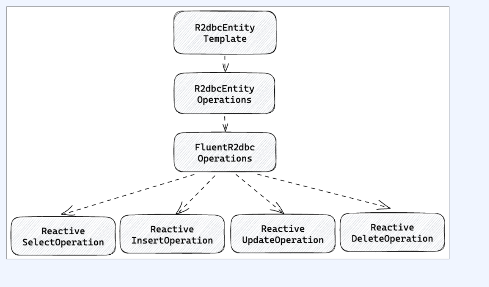
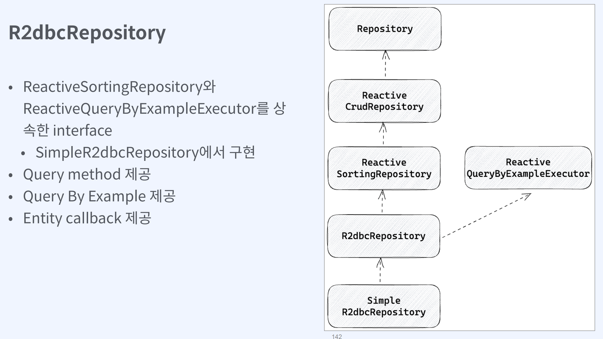

# Spring data reactive 

[toc]


# 지원 스펙



- R2DBC
- MongoDB
- Redis
- Apache Cassandra
- Apache Solr
- Couchbase
- Elasticsearch
- Neo4j


- Reactive streams, Reactor, Netty client,  Java NlO, Selector를 사용하여 비동기 non-blocking을 지원
- Reactive client를 제공하고 이를 기반으로  ReactiveTemplate 혹은ReactiveRepository를 구현
- 데이터베이스에 대한 대한 작업의 결과로 대부분 Publisher를 반환


## 왜 JPA는 Reactive 기반으로 동작하지 못할까?



- JDBC는 동기 blocking I/0 기반으로 설계
- Socket에 대한 연결과 쿼리 실행 모두 동기 blocking 으로 동작
- 이미 널리 사용되고 있기 때문에 JDBC를 수정 하는 것은 사실상 불가능
- JPA 또한 jdbc 기반이기 때문에 비동기 non-blocking 지원 불가능
- -> 비동기 non-blocking 기반의 API, 드라이버를 새로 만들자!


## R2dbc

- Reactive Relational Database Connectivity
- 2017년 Pivotal 사에서 개발이 시작되어 2018년부터 공식 프로젝트로 후원

- 비동기, non-blocking 관계형 데이터베이스 드라이버
- Reactive streams 스펙을 제공하며 Project reactor 기반으로 구현


mysql, h2, r2dbc-pool, postgresql 지원


R2dbc MySQL

- 이전에는 github.com/mirromutth/r2dbc-mysql 에서 제공
- 2020년 5월부터 업데이트 X
- github.com/asyncer-io/r2dbc-mysq|로 포크 진행
- r2dbc-spi 1.0.0.RELEASE TIE


## R2dbc MySQL 구조



- r2dbc-spi와 Reactor Netty 기반 Reactor Netty를 이용하여 r2dbc-spi 스펙 을 구현
- Reactor Netty client로 성능과 확장성 모두 제공
- r2dbc-spi 스펙을 구현하여 여러 데이터베이 스시스템과 호환


## R2dbc SPI  - R2dbc Service Provider Interface

- Connection, ConnectionFactory = db connection 스펙
- R2dbcException,
   R2dbcTimeoutException,
   R2dbcBadGrammarException 등의
   exception 스펙
- Result, Row, RowMetadata 등 result 스펙
- Statement 등 statment 스펙


### R2dbc SPI Connection

```java
public interface Connection extends Closeable {
  @Override
  Publisher<Void> close();
  
  Statement createStatement(String sql);
  
  ConnectionMetadata getMetadata();
}
```

- 데이터베이스에 대한 연결을 가리킨다
- Closable을 구현하여 close 메소드로  connection을 닫을 수 있다
- ConnectionMetadata를 제공
  - database의 version과 productName  제공
- createstatement를 통해서 sql을 넘기고  Statement를 생성

```java
public interface Connection extends Closeable {
    
    /**
     * 트랜잭션을 시작합니다.
     */
    Publisher<Void> beginTransaction();
    
    /**
     * 주어진 정의로 트랜잭션을 시작합니다.
     */
    Publisher<Void> beginTransaction(TransactionDefinition definition);
    
    /**
     * 트랜잭션을 커밋합니다.
     */
    Publisher<Void> commitTransaction();
    
    /**
     * 주어진 이름으로 세이브포인트를 생성합니다.
     */
    Publisher<Void> createSavepoint(String name);
    
    /**
     * 자동 커밋 모드인지 확인합니다.
     */
    boolean isAutoCommit();
    
    /**
     * 현재 트랜잭션 격리 수준을 가져옵니다.
     */
    IsolationLevel getTransactionIsolationLevel();
    
    /**
     * 트랜잭션을 롤백합니다.
     */
    Publisher<Void> rollbackTransaction();
    
    /**
     * 지정된 세이브포인트로 트랜잭션을 롤백합니다.
     */
    Publisher<Void> rollbackTransactionToSavepoint(String name);
    
    /**
     * 자동 커밋 모드를 설정합니다.
     */
    Publisher<Void> setAutoCommit(boolean autoCommit);
    
    /**
     * 트랜잭션 격리 수준을 설정합니다.
     */
    Publisher<Void> setTransactionIsolationLevel(IsolationLevel isolationLevel);
}
```


```java
public interface Statement {
    
    /**
     * 새 문을 추가합니다.
     */
    Statement add();
    
    /**
     * 인덱스를 기준으로 값을 바인딩합니다.
     */
    Statement bind(int index, Object value);
    
    /**
     * 이름을 기준으로 값을 바인딩합니다.
     */
    Statement bind(String name, Object value);
    
    /**
     * 인덱스를 기준으로 null 값을 바인딩합니다.
     */
    Statement bindNull(int index, Class<?> type);
    
    /**
     * 이름을 기준으로 null 값을 바인딩합니다.
     */
    Statement bindNull(String name, Class<?> type);
    
    /**
     * 문을 실행하고 결과를 반환합니다.
     */
    Publisher<? extends Result> execute();
}
```

- Statement는 Connection으로부터 createstatement 을 통해서 생성
- bind: sql에 parameter를 bind
  - index, name 단위로 parameter를 bind
- add: 이전까지 진행한 binding을 저장하고 새 로운 binding을 생성
- execute: 생성된 binding 수만큼 쿼리를 실행 하고 Publisher로 반환


# R2dbc MySQL Connection



- Connection을 구현한 MySqIConnection
- ConnectionMetadata을 구현한 MySqlConnectionMetadata
- Statement를 구현한 MySqlstatement

## MySqlConnectionFactory

- MySqlConnection을 Mono로 형태로 포함
- MySqlConnectionFactoryMetadata를 환
- MySqlConnectionConfiguration을 인자로 받아서 MySqIConnectionFactory 생성

```java
public final class MySqlConnectionFactory implements ConnectionFactory {

    private final Mono<MySqlConnection> client;

    // 생성자
    private MySqlConnectionFactory(Mono<MySqlConnection> client) {
        this.client = client;
    }

    @Override
    public Mono<MySqlConnection> create() {
        return client;
    }

    @Override
    public ConnectionFactoryMetadata getMetadata() {
        return MySqlConnectionFactoryMetadata.INSTANCE;
    }

    // MySqlConnectionConfiguration으로부터 MySqlConnectionFactory를 생성하는 정적 메서드
    public static MySqlConnectionFactory from(MySqlConnectionConfiguration configuration) {
        // MySqlConnection 생성 로직을 추가해야 합니다.
        Mono<MySqlConnection> client = Mono.just(new MySqlConnection(configuration));
        return new MySqlConnectionFactory(client);
    }
}

```

- MySq|ConnectionFactory로 MySqlConnection을 생성
- MySq|Connection 으로  MySq|Statement= 생성
- MySqlConnection으로 transaction을 start, rollback, commit

## MySq|ConnectionConfiguration

- MySQL 연결의 설정을 포함하는 객체
- Builder 패턴으로 쉽게 MySQL 설정
- host, port, database, username, password 등의 기본 설정 제공
- connectTimeout, socketTimeout,  timeout 설정
- 디폴트는 둘 다 timeout 제한 x
- serverZoneld 설정
- 디폴트는 쿼리를 보내는 서버의 zone

## Mysql Connection 생성

```java
// MySqlConnectionConfiguration.builder()를 이용하여 config 생성
var config = MySqlConnectionConfiguration.builder()
    .host("localhost")         // 호스트 설정
    .port(3306)                // 포트 설정
    .username("root")          // 사용자 이름 설정
    .password("1234")          // 비밀번호 설정
    .database("wooman")        // 데이터베이스 이름 설정
    .build();                  // 빌드하여 config 생성

// MySqlConnectionFactory.from() static 메서드를 이용하여 connectionFactory 생성
var connectionFactory = MySqlConnectionFactory.from(config);

connectionFactory.create().flatMapMany(conn -> {
    // 테이블 생성 SQL 실행
    Flux<MySqlResult> createTable = conn.createStatement(tableSql)
        .execute();
    
    // 데이터 삽입 SQL 실행
    Flux<MySqlResult> insertPerson = conn.createStatement(insertSql)
        .bind("name", "taewoo")
        .bind("age", 20)
        .bind("gender", "M")
        .add()
        .bind("name", "sooji")
        .bind("age", 30)
        .bind("gender", "F")
        .execute();
    
    // 데이터 조회 SQL 실행
    Flux<MySqlResult> selectPeople = conn.createStatement(selectSql)
        .execute();
    
    // 테이블 생성 후 데이터 삽입, 그 후 데이터 조회
    return createTable.thenMany(insertPerson)
                      .thenMany(selectPeople);
}).flatMap(result -> {
    // 결과를 Person 객체로 매핑
    return result.map((row, rowMetadata) -> {
        Long id = row.get("id", Long.class);
        String name = row.get("name", String.class);
        Integer age = row.get("age", Integer.class);
        String gender = row.get("gender", String.class);
        return new Person(id, name, age, gender);
    });
}).subscribe(person -> {
    // Person 객체 정보 로깅
    log.info("person: {}", person);
});

```

이런식으로 사용하지만.. 너무 불편하다.


# Spring Data R2dbc

## Entity

```java
@Entity
@Table(name = "person")
@Data
public class PersonEntity {

    @Id
    private final Long id;
    
    private final String name;
    
    @Column(name = "age")
    private final Integer age;
    
    private final String gender;
    
    @Version
    private final String version;
}
```

- 데이터베이스에서 하나의 ROW와 매칭되는 클 래스
- R2dbcEntityTemplate, R2dbcRepository  등은 데이터베이스에 요청을 보내고 그 결과를 Entity 형태로 반환
- 데이터베이스 접근을 단순화하고 개발 편의성 을 향상
- Table, Row, Column에 필요한 데이터베이스 metadata를 어노테이션 등으로 제공

## R2dbcEntityTemplete

```java
public class R2dbcEntityTemplate implements R2dbcEntityOperations,
BeanFactoryAware, ApplicationContextAware {
}
```

- R2dbcEntityTemplate& Spring data r2dbc의 추상화 클래스
- SQL 쿼리들을 문자열 형태로 넘기거나 결과를 직접 처리하지 않아도
- 메소드 체이닝을 통해서 쿼리를 수행하고 결과 를 entity 객체로 받을 수 있다
- R2dbCEntityOperations를 구현


R2dbcDataAutoConfiguration에서 등록해주고 있다.

## DatabaseClient

- 내부에 포함된 ConnectionFactory에 접근 가능
- sql 메소드를 통해서 GenericExecutespec을 반환
- GenericExecutespec은 bind를 통해서  parameter를 sql에 추가
- fetch를 통해서 FetchSpec을 반환

```java
// DatabaseClient 인터페이스
public interface DatabaseClient extends ConnectionAccessor {
    
    /**
     * 연결 팩토리를 가져옵니다.
     */
    ConnectionFactory getConnectionFactory();
    
    /**
     * SQL 쿼리를 설정합니다.
     * 
     * @param sql 실행할 SQL 쿼리
     * @return GenericExecuteSpec 객체
     */
    GenericExecuteSpec sql(String sql);

    // GenericExecuteSpec 내부 인터페이스
    interface GenericExecuteSpec {
        
        /**
         * 인덱스를 기준으로 값을 바인딩합니다.
         * 
         * @param index 바인딩할 인덱스
         * @param value 바인딩할 값
         * @return GenericExecuteSpec 객체
         */
        GenericExecuteSpec bind(int index, Object value);
        
        /**
         * 인덱스를 기준으로 null 값을 바인딩합니다.
         * 
         * @param index 바인딩할 인덱스
         * @param type null 값의 타입
         * @return GenericExecuteSpec 객체
         */
        GenericExecuteSpec bindNull(int index, Class<?> type);
        
        /**
         * 이름을 기준으로 값을 바인딩합니다.
         * 
         * @param name 바인딩할 이름
         * @param value 바인딩할 값
         * @return GenericExecuteSpec 객체
         */
        GenericExecuteSpec bind(String name, Object value);
        
        /**
         * 이름을 기준으로 null 값을 바인딩합니다.
         * 
         * @param name 바인딩할 이름
         * @param type null 값의 타입
         * @return GenericExecuteSpec 객체
         */
        GenericExecuteSpec bindNull(String name, Class<?> type);
        
        /**
         * 결과를 가져옵니다.
         * 
         * @return FetchSpec 객체
         */
        FetchSpec<Map<String, Object>> fetch(); // FetchSpec
    }
}

```

FetchSpec

- FetchSpec& RowsFetchSpec과 UpdatetdRowsFetchSpec을 상속
- RowsFetchSpec: one, first, all 메서드 제공
- one: 없거나 혹은 하나의 결과를 Mono로 제 공. 결과가 하나보다 많다면 에러 반환
- first: 첫 번째 결과를 Mono로 제공. 없다면 빈 값을 반환
- al: 모든 결과를 FluX로 제공
- UpdatetdRowsFetchSpec: 쿼리의 영향을 받은 roW 수를 Mono로 제공

```java
// FetchSpec 인터페이스
public interface FetchSpec<T> extends RowsFetchSpec<T>, UpdatedRowsFetchSpec { }

// RowsFetchSpec 인터페이스
public interface RowsFetchSpec<T> {
    
    /**
     * 한 행을 가져옵니다.
     */
    Mono<T> one();
    
    /**
     * 첫 번째 행을 가져옵니다.
     */
    Mono<T> first();
    
    /**
     * 모든 행을 가져옵니다.
     */
    Flux<T> all();
}

// UpdatedRowsFetchSpec 인터페이스
public interface UpdatedRowsFetchSpec {
    
    /**
     * 업데이트된 행의 수를 가져옵니다.
     */
    Mono<Integer> rowsUpdated();
}

```

## DatabaseClient 실행

```java
// 테이블 생성 SQL 실행
var createTableMono = client.sql(tableSql)
    .fetch()
    .rowsUpdated();

// 데이터 삽입 SQL 실행
var insertMono = client.sql(insertSql)
    .bind("name", "taewoo")
    .bind("age", 20)
    .bind("gender", "M")
    .fetch()
    .rowsUpdated();

// 데이터 조회 SQL 실행
var selectAllFlux = client.sql(selectSql)
    .fetch()
    .all();

// 테이블 생성 후 데이터 삽입, 그 후 데이터 조회
createTableMono.then(insertMono)
    .thenMany(selectAllFlux)
    .doOnNext(result -> {
        // 결과를 로깅
        var id = (Integer) result.get("id");
        var name = (String) result.get("name");
        var age = (Integer) result.get("age");
        var gender = (String) result.get("gender");
        log.info("id: {}, name: {}, age: {}, gender: {}", id, name, age, gender);
    })
    .subscribe();
```

- sql을 실행하여 GenericExecuteSpec을 반환
- GenericExecuteSpec에 bind를 한 후
- fetch를 호출하여 FetchSpec 반환
- rowsUpdated를 호출하여 영향을 받은 row수 조회
- 혹은 all을 호출하여 결과 roW 조회
- 여전히 직접 mapping.....

## R2dbcConverter


`Converter`는 데이터베이스와 애플리케이션 간의 데이터 변환을 담당하는 구성 요소입니다. 주로 데이터베이스에서 읽어온 데이터를 애플리케이션의 도메인 객체로 변환하거나, 애플리케이션에서 사용하는 도메인 객체를 데이터베이스에 저장하기 위해 변환하는 역할을 한다.

* EntityReader와 EntityWriter를 상속

* 구현체로 MappingR2dbcConverter



- 다양한 전략을 통해서 Object를 데이터베이스 의 rOW로, 데이터베이스의 row를 Object로 변환
  - custom converter로 mapping
  - Spring data의 object mapping
  - convention 기반의 mapping
  - metadata 기반의 mapping

어떻게?

- 우선 Configuration을 통해서 converter들을  등록
- Target 클래스를 지원하는 converter를 탐색
- 이를 위해서 두 개의 Converter가 필요
- row를 Target 클래스로 변환하는 Converter
- Target 클래스를 OutboundRow로 변환하는 Converter

Read, Writer 컨버터가 필요하다 

```java
@ReadingConverter
public class PersonReadConverter implements Converter<Row, Person> {
    
    @Override
    public Person convert(Row source) {
        // Row 객체에서 데이터를 읽어와 Person 객체로 변환합니다.
        Long id = source.get("id", Long.class);
        String name = source.get("name", String.class);
        Integer age = source.get("age", Integer.class);
        String gender = source.get("gender", String.class);
        return new Person(id, name, age, gender);
    }
}
```

- Row를 source로 Entity를 target으로 하는 converter
- ROW로부터 name 혹은 index로 column에 접근할 수 있고, 변환하고자 하는 type을 Class 로 전달

```java
@WritingConverter
public class PersonWriteConverter implements Converter<Person, OutboundRow> {
    
    @Override
    public OutboundRow convert(Person source) {
        // Person 객체의 데이터를 OutboundRow 객체로 변환합니다.
        OutboundRow row = new OutboundRow();
        row.put("id", Parameter.from(source.getId()));
        row.put("name", Parameter.from(source.getName()));
        row.put("age", Parameter.from(source.getAge()));
        row.put("gender", Parameter.from(source.getGender()));
        return row;
    }
}
```

- Entity를 source로 RoW를 target으로 하는  converter
- OutboundRow에 값을 추가
- key에는 column의 이름, value에는 Parameter.from을 이용해서 entity의 속성 을 전달
   DefaultDatabaseClient에서   OutboundRow를 이용해서 SQL 생성

등록은 어떻게 할까?

```java
@Configuration
public class R2dbcConfig extends AbstractR2dbcConfiguration {

    /**
     * 커스텀 컨버터를 제공하는 메서드입니다.
     * 
     * @return 커스텀 컨버터들의 리스트를 반환합니다.
     */
    @Override
    protected List<Object> getCustomConverters() {
        return List.of(
            new PersonReadConverter(), 
            new PersonWriteConverter()
        );
    }
}
```

# ObjectMapping

만약 지원하는 converter가 없다면  MappingR2dbcConverter는 다음 과정을 거 쳐서 Row를 entity로 변환

1. Object creation: constructor, factory method 등을 이용해서 RoW의 column 들로 Object 생성
2. Property population: direct set,  setter, with..메소드 등을 이용해서 ROW 의 column을 Object에 주입

## 객체 생성 - Object createion 순서



## 객체 생성 - PersistenceCreator constructor 어노테이션

@PersistenceCreator을 갖는 constructor가 존재 한다면 해당 constructor를 사용

- 여러 개가 존재한다면 가장 마지막 PersistenceCreator가 붙은 constructor를 사용
- 하지만 혼동을 피하기 위해서 가능한  PersistenceCreator constructor는 하나만
- NoArgsConstructor,AllArgsConstructor 전부 패스

```java
public class Person {

    private final Long id;
    private final String name;
    private final Integer age;
    private final String gender;

    // PersistenceCreator 어노테이션을 사용하여 생성자를 지정합니다.
    @PersistenceCreator
    public Person(Long id, String name, Integer age, String gender) {
        this.id = id;
        this.name = name;
        this.age = age;
        this.gender = gender;
    }
}
```

## 객체 생성 - NoArgsconstructor

- No-args constructor가 존재한다면 해당  constructor를 사용
- 다른 constructor 전부 패스


## 객체 생성 - 하나의 constructor

 오직 하나의 constructor가 존재한다면 해당 constructor를 사용

## 객체 생성 - 두 개 이상의 constructor가 있다면?

만약 @PersistenceCreator를 갖는 constructor도 No-args constructor도 없다면? exception 발생

## 객체 생성 - Property population 

 공식 문서에서는 with 메소드를 사용하는 법, setter를 사용하는 법을 언급하고 있지만.. 

* r2dbc에서는 property가 mutable할때만 property population 적용 
* Object creation '하나의 constructor' 조건에 따라 서 id와 name에만 값을 추가 
* property를 순회하며 mutable한 경우에만 reflection을 사용해서 값 주입 
* property가 immutable인 경우, 현재는 방법이 없다

## Object mapping 최적화

- 객체를 가능한한 Immutable하게
- 모든 property를 인자로 갖는 All-args 제공
- property population이 발생하지 않고, constructor만 호출하기 때문에 30% 정 도 성능이 좋다
- 코드 중복을 방지하기 위해서 lombok을 사용하기


# Metadata Mapping - 어노테이션 엔티티 매핑

```java
import org.springframework.data.annotation.Id;
import org.springframework.data.annotation.Transient;
import org.springframework.data.annotation.Version;
import org.springframework.data.annotation.PersistenceConstructor;
import org.springframework.data.relational.core.mapping.Table;
import org.springframework.data.relational.core.mapping.Column;

@Table("person") // 테이블 이름을 "person"으로 설정
public class Person {

    @Id
    private Long id; // primary key

    @Column("name")
    private String name; // 컬럼 이름을 "name"으로 설정

    @Column("age")
    private Integer age; // 컬럼 이름을 "age"로 설정

    @Column("gender")
    private String gender; // 컬럼 이름을 "gender"로 설정

    @Version
    private Long version; // 낙관적 잠금을 위한 버전 필드

    @Transient
    private String temporaryField; // 매핑에서 제외되는 필드

    // @PersistenceConstructor: 객체 생성 시 사용되는 생성자
    @PersistenceConstructor
    public Person(Long id, String name, Integer age, String gender, Long version) {
        this.id = id;
        this.name = name;
        this.age = age;
        this.gender = gender;
        this.version = version;
    }

    // 기본 생성자
    public Person() {
    }

}

```


- Entity 클래스에 어노테이션을 추가하여 데이터베이스와 관련된 설정들을 주입
- @ld: primary key에 해당하는 필드에 적용
- @Table: entity class에 적용. Table 이름을 변경 가능
- @Transient: 기본적으로 모든 필드는 mapping 대상. @Transient가 붙은 필드는 mapping 에서 제외.
- @Column: entity의 property 필드에 적용. Column이 붙은 필드에 대해서는 convention 기반 대신 Column에 주어진 name으로 적용
- @Version: 낙관적 잠금 (Optimistic Lock)에 이용. entity가 update 될 때마다 자동으로 update
- @PersistenceConstructor: 특정 constructor에 대해서 Obiect creation 할 때 사용하게끔
   지정. constructor의 argument 이름에 따라서 mapping


# R2dbcEntityOperations



- FluentR2dbcOperations를 상속
- FluentR2dbcOperations는 여러 Operations를 상속
- ReactiveSelectOperation: select  query와 관련된 메소드 제공
- ReactivelnsertOperation: insert  query와 관련된 메소드 제공
- ReactiveUpdateOperation: update query와 관련된 메소드 제공
- ReactiveDeleteOperation: delete  query와 관련된 메소드 제공


# R2dbcRepository



- R2dbcRepositoriesAutoConfiguration가 활성화되어 있다면 SpringBootApplication  기준으로 자동으로 scan
- 혹은 EnableR2dbCRepositories를 통해서 repository scan

*  만약 여러 r2dbcEntityTemplate이 존재하 거나 여러 데이터베이스를 사용하는 경우,
   basePackages, entityOperationRef 등을 통해서 다른 경로, 다른 entityTemplate 설 정 가능

```java
import org.springframework.context.annotation.Configuration;
import org.springframework.data.r2dbc.config.AbstractR2dbcConfiguration;
import org.springframework.data.r2dbc.repository.config.EnableR2dbcRepositories;

@Configuration
@EnableR2dbcRepositories(
    basePackages = "com.ys.datareactive.r2dbc.spring.repository",
    entityOperationsRef = "r2dbcEntityTemplate"
)
public class R2dbcConfig extends AbstractR2dbcConfiguration {
    // 커스텀 컨버터를 제공하는 메서드입니다.
    @Override
    protected List<Object> getCustomConverters() {
        return List.of(
            new PersonReadConverter(),
            new PersonWriteConverter()
        );
    }
}

```

## ReactiveCrudReposiory

### Save

- 하나의 entity를 save 하거나
- entity Iterable을 save 하거나
- entity Publisher를 인자로 받고 save
- saveAll은 @ Transactional을 사용해서 각각 의 save를 하나의 tX로 묶고 concatMap을 통해서 save를 순차적으로 수행

### find

- id 기반으로 하나 혹은 여러 개의 항목을 탐색 하거나 존재 여부를 확인
- 모든 항목을 탐색하거나 모든 항목의 개수를 확인

### delete

- id 기반으로 하나 혹은 여러 개의 항목을 제거히거나
- 하나 혹은 여러 개의 entity를 기반으로 id를 추 출하여 제거하거나
- 모두 제거

## insert와 업데이트 구분방법


new entity 확인 전략

* @Id에 해당하는 필드를 확인. 만약 @Id 필드가 null이거나 0이라면 새로운 entity로 간주

## R2dbcRepository의 한계

- R2dbcRepository는 기본적으로 CRUD를 수행할 수 있는 메소드를 제공
- 모두 혹은 id 기반으로 CRUD를 제공
- 특정 필드로 탐색을 하거나 상위 n개만 조회 등의 기능은 제공되지 않는다
- join이나 집계와 관련된 함수들은 제공되지 않는다


## r2dbcRepository 쿼리 메소드 (query method

- R2dbCRepository를 상속한
   repository interface에 메소드를 추가
- 메소드의 이름을 기반으로 Query 생성
- 조회, 삭제 지원
- @Query 어노테이션을 사용해서 복잡 한 쿼리나 update 문도 실행 가능

### delete

- 다른 필드를 이용해서 삭제 가능
- 여러 반환 타입 지원
- Integer: 영향을 받은 rOW 수 반환
- Boolean: 삭제되었는지 여부 반환
- Void: 반환값보다는 completion이 중요한 경우


# Transaction

- @Transactional를 사용하여 여러 query를 묶어서 진행
- 새로운 Entity를 만들어서 save하고 update한후
- findAll을 통해서 모든 roW 반환

## TransactionalOperator (1)

* transactional 메소드를 통해서 주어진 Flux 혹은 Mono를 transaction 안에서 실행

```java
public interface TransactionalOperator {

    /**
     * 주어진 Flux를 트랜잭션 내에서 실행합니다.
     * 
     * @param flux 트랜잭션 내에서 실행할 Flux
     * @return 트랜잭션이 적용된 Flux
     */
    default <T> Flux<T> transactional(Flux<T> flux) {
        return execute(it -> flux);
    }

    /**
     * 주어진 Mono를 트랜잭션 내에서 실행합니다.
     * 
     * @param mono 트랜잭션 내에서 실행할 Mono
     * @return 트랜잭션이 적용된 Mono
     */
    <T> Mono<T> transactional(Mono<T> mono);

    /**
     * 주어진 트랜잭션 콜백을 실행합니다.
     * 
     * @param action 실행할 트랜잭션 콜백
     * @return 실행된 트랜잭션 콜백의 결과를 포함하는 Flux
     * @throws TransactionException 트랜잭션 실행 중 발생할 수 있는 예외
     */
    <T> Flux<T> execute(TransactionCallback<T> action) throws TransactionException;
}

```

사용 예시

```java
public Flux<PersonEntity> savePerson2() {
    // 새로운 PersonEntity 객체 생성
    var person = new PersonEntity(null, "peter", 50, "M");
    
    // PersonEntity 객체를 저장하고 업데이트한 후 모든 PersonEntity 객체를 조회하는 작업 정의
    var jobs = personRepository.save(person)
        .flatMap(savedPerson -> {
            var personToUpdate = savedPerson.withAge(30);
            return personRepository.save(personToUpdate);
        })
        .thenMany(personRepository.findAll());

    // 트랜잭션을 적용하여 작업 실행
    return transactionalOperator.transactional(jobs);
}

public Flux<PersonEntity> savePerson3() {
    // 새로운 PersonEntity 객체 생성
    var person = new PersonEntity(null, "peter", 50, "M");
    
    // PersonEntity 객체를 저장하고 업데이트한 후 모든 PersonEntity 객체를 조회하는 작업 정의
    var jobs = personRepository.save(person)
        .flatMap(savedPerson -> {
            var personToUpdate = savedPerson.withAge(30);
            return personRepository.save(personToUpdate);
        })
        .thenMany(personRepository.findAll());

    // 트랜잭션을 적용하여 작업 실행
    return transactionalOperator.execute(status -> jobs);
}
```

- flux를 바로 반환하지 않고 transactionalOperator의   transactional로 wrapping 하여 전달
- 혹은 execute를 통해서  Transaction Callback 형태로 실행