# 코틀린 코루틴(Coroutines)

[toc]

Kotlin 공식 라이브러리

- Kotlin을 위한 공식 라이브리러 지원

  - Kotlin Coroutines
  - kotlinx.coroutines

- 동시성과 관련해서 강력한 성능과 개발 편의를 제공

- Kotlin Serialization

  - kotlinx serialization

  *  객체의 serialization, deserialization을 지원

- Kotlin Lincheck
  - kotlinx.lincheck
  - 동시성 버그를 탐지하고 디버그할 수 있게 테스트 환경 제공


## kLogger

- reified를 이용해서 제네릭으로 받은 타입으로 Logger를 생성
- kLogger 내에서 logger에 GlobalLogger를 제네릭으로 전달하여 GlobalLogger 클래스를 기반으로 sl4jf Logger 생성

```java
inline fun <reified T> logger(): Logger {
    return LoggerFactory.getLogger(T::class.java)
}

inline fun KLogger(): Logger {
    return logger<GlobalLogger>()
}

object GlobalLogger

```

Kotlin에서 `reified` 키워드는 제네릭 함수에서 사용되는 특별한 키워드로, 함수가 인라인으로 선언될 때 사용 가능합니다. 보통 제네릭 타입 정보는 런타임에 지워지기 때문에 `T::class.java`와 같은 표현은 사용할 수 없습니다. 그러나 함수에 `inline`과 `reified` 키워드를 사용하면 컴파일러가 이 정보를 유지하여 런타임에도 타입 정보를 사용할 수 있게 됩니다.


## CoroutineContext

CoroutineContext를 통해서 coroutine에 필 요한 정보들을 제공

coroutine의 이름, CoroutineDispatcher,  ThreadLocal, CoroutineExceptibnHandler 등을 제공

```kotlin
private val log = kLogger()
fun main() {
    val threadLocal = ThreadLocal<String>()
    threadLocal.set("hello")
    log.info("thread: {}", Thread.currentThread().name)
    log.info("threadLocal: {}", threadLocal.get())

    runBlocking {
        val context = CoroutineName("custom name") +
                Dispatchers.IO +
                threadLocal.asContextElement()

        launch(context) {
            log.info("thread: {}", Thread.currentThread().name)
            log.info("threadLocal: {}", threadLocal.get())
            log.info("coroutine name: {}",
                coroutineContext[CoroutineName])
        }
    }
}
```

### Exception Handling

```java
private val log = kLogger()
fun main() {
    runBlocking {
        val context = CoroutineName("custom name") +
            CoroutineExceptionHandler { _, e ->
                log.error("custom exception handler")
            }

        CoroutineScope(Dispatchers.IO).launch(context) {
            throw IllegalStateException()
        }

        delay(100)
    }
}
```

CoroutineExceptionHandler를 제공하여 exception handling

`runBlocking은 GlobalScope를 사용하는데 GlobalScope의  CoroutineExceptionHandler은 대체 불가`

- 따라서 별도의 CoroutineScope에서 수행

## structured concurrency

```kotlin
private suspend fun structured() = coroutineScope {
    log.info("step 1")
    
    launch {
        delay(1000)
        log.info("Finish launch1")
    }
    log.info("step 2")
    
    launch {
        delay(100)
        log.info("Finish launch2")
    }
    log.info("step 3")
}

fun main() = runBlocking {
    log.info("Start runBlocking")
    structured()
    log.info("Finish runBlocking")
}
```


- coroutinescope 함수를 통해서 별도의 Coroutinescope를 생성
- Coroutinescope 내에서는 자식 coroutine 이 모두 완료되고 coroutine이 끝남을 보장
- 따라서 launch가 모두 끝나고 Finish  runBlocking 로그가 출력

```kotlin
private suspend fun structured() = coroutineScope {
    launch {
        try {
            delay(1000)
            log.info("Finish launch1")
        } catch (e: CancellationException) {
            log.info("Job1 is cancelled")
        }
    }

    launch {
        try {
            delay(500)
            log.info("Finish launch2")
        } catch (e: CancellationException) {
            log.info("Job2 is cancelled")
        }
    }

    delay(100)
    this.cancel()
}

fun main() = runBlocking {
    log.info("Start runBlocking")
    
    try {
        structured()
    } catch (e: CancellationException) {
        log.info("Job is cancelled")
    }

    log.info("Finish runBlocking")
}
```

- cancel이 발생하면 `자식 coroutineScope로 cancel을 전파`
- delay 함수는 cancel이 전파되면 CancellationException을 수행하여 cancel

## Flow

```kotlin
private fun range(n: Int): Flow<Int> {
    return flow {
        for (i in 0 until n) {
            delay(100)
            emit(i)
        }
    }
}

fun main() = runBlocking {
    log.info("Start runBlocking")
    range(5).collect {
        log.info("item: {}", it)
    }
    log.info("Finish runBlocking")

}
```

- reactor의 Flux와 비슷한 Flow를 제공
- flow 함수를 사용하여 block 내에서 suspend함수를 실행
- emit을 통해 값을 전달
  - onNext와 비슷
- collect를 이용하여 item을 전달
  - subscribe와 비슷


## Channel

```kotlin
suspend fun main() = runBlocking {
    log.info("Start runBlocking")
    val channel = Channel<Int>()
    launch {
        delay(100)

        for (i in 0 until 5) {
            channel.send(i)
        }
        channel.close()
    }

    delay(500)

    for (i in channel) {
        log.info("item: {}", i)
    }

    log.info("Finish runBlocking")
}
```

- channel을 생성하여 send와 receive 가능
- channel은 여러 coroutine, thread에서 동시 에 실행되도 안전
- for를 통해서 close되기 전까지 지속적으로 receive 수행

```kotlin
fun main() = runBlocking {
    log.info("Start runBlocking")
    val channel = Channel<Int>(1, BufferOverflow.DROP_LATEST)
    launch {
        delay(100)

        for (i in 0 until 5) {
            channel.send(i)
        }
        channel.close()
    }

    delay(500)

    for (i in channel) {
        log.info("item: {}", i)
    }
    
    log.info("Finish runBlocking")
}
```


- capacity와 BufferOverflow 인자를 전달하 여 channel의 크기를 제한 가능
- BufferOverflow에 따라서 send를 지연하거나 item을 drop


## Suspend함수는 일반 함수와 무엇이 다른가?

java로 변환하면 추가적인 코드들이 생성

- greet에 Continuation 이라는 인자를 추가

```kotlin
class SuspendExample {
    suspend fun greet(who: String): String {
        delay(100)
        return getResult(who).awaitSingle()
    }

    private fun getResult(who: String): Mono<String> {
        return Mono.just("Hello, $who!")
    }
}
```

```java
public final class SuspendExample {
  
  public final Object greet(@NotNull Continuation var1) {
    
  }
}
```

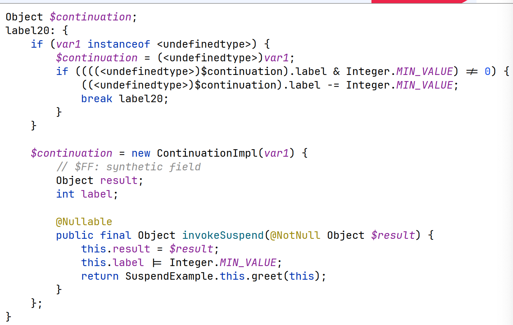

- undefinedtype이 뭔지는 알 수 없지만.. Continuation 인자가 undefinedtype을 구현했는지 체크
- 맞다면 Scontinuation에 추가하고 break, 아니라면 ContinuationImpl 추상 클래스를 상속하여 invokeSuspend 함수 구현
- Continuationimpl 에는 label과 result를 포함

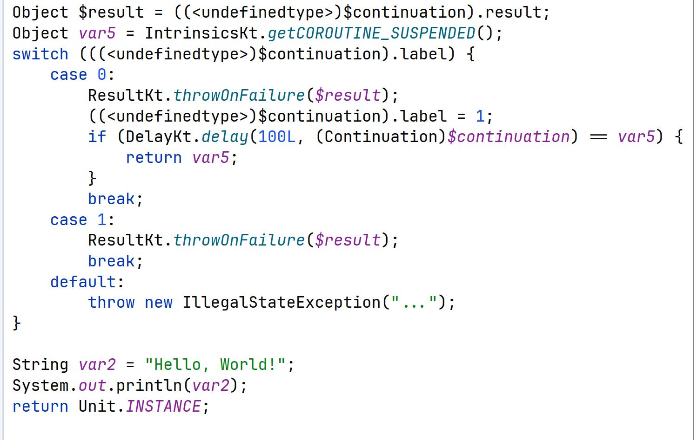

- switch 문을 통해서 label에 따라서 코드를 수 행
- switch 문이 종료된 후, System.out. printin 을 통해서 Hello, World! 출력
- kotlin의 Unit을 반환

# Finite state machine (FSM)

Finite State Machine (FSM)은 유한 상태 기계 또는 유한 상태 머신이라고도 불리며, 제한된 수의 상태를 가지는 시스템을 모델링하는 방법입니다. FSM은 특정 상태를 가지며, 입력에 따라 상태가 변경됩니다. FSM의 주요 구성 요소는 상태(state), 전이(transition), 입력(input), 출력(output)입니다.

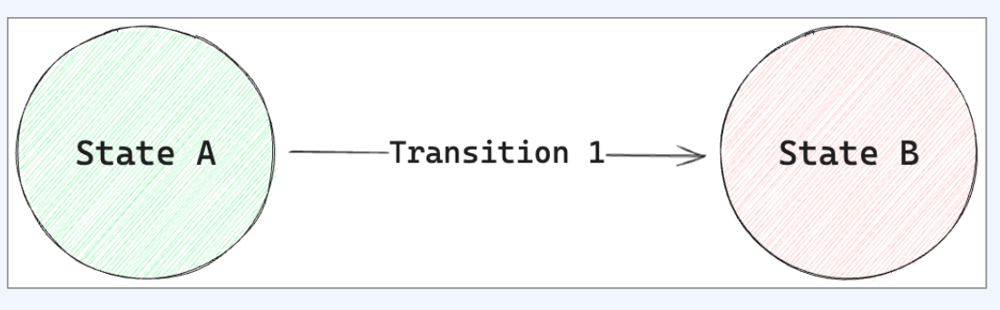

- 시스템이 가질 수 있는 상태를 표현하는 추상적인 모델
- State: 시스템의 특정한 상황
- Transition: 하나의 state에서 다른 state로 이동
- Event: Transition을 trigger하는 외부의 사건

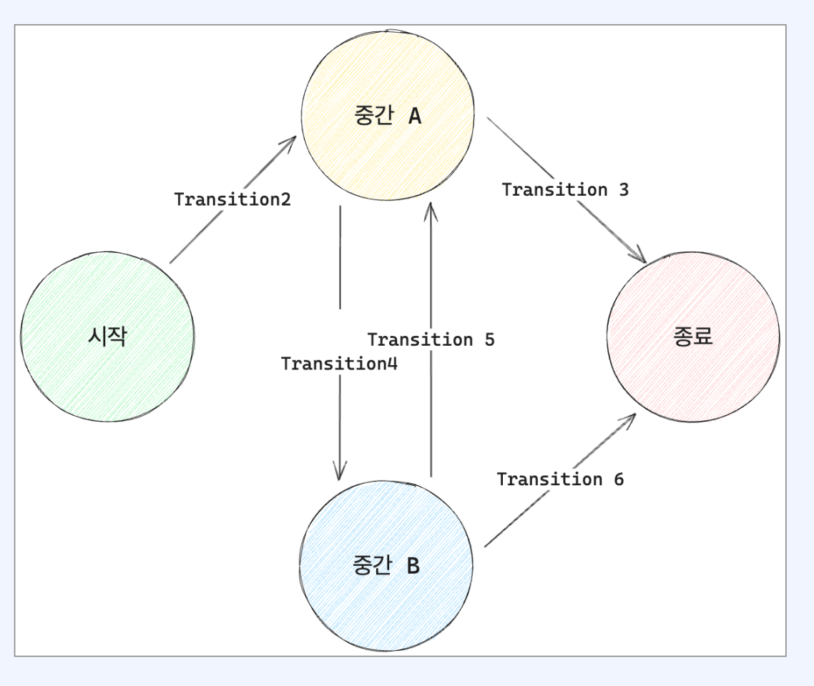

Finite state machine은 유한한 개수의 state 갖는 state machine

- 한 번에 오직 하나의 state만을 가질 수 있다
- Event를 통해서 하나의 state에서 다른 state 로 transition이 가능하다

## FSM 구현

- 재귀 함수를 이용해서 fsm을 구현
- 각각state에 따라서 다른 코드를 실행
- 재귀 함수가 수행될 때마다 state가 변화

example

```kotlin
class FsmExample {
    fun execute(label: Int = 0) {
        var nextLabel: Int? = null

        when (label) {
            0 -> {
                log.info("Initial")
                nextLabel = 1
            }
            1 -> {
                log.info("State1")
                nextLabel = 2
            }
            2 -> {
                log.info("State2")
                nextLabel = 3
            }
            3 -> {
                log.info("End")
            }
        }
        // transition
        if (nextLabel != null) {
            this.execute(nextLabel)
        }
    }
}

fun main() {
    val fsmExample = FsmExample()
    fsmExample.execute()
}


10:30 [main] - Initial
10:30 [main] - State1
10:30 [main] - State2
10:30 [main] - End
```

* 재귀함수를 호출하며 nextLabel을 전달하여상태 변경

## Continuation Passing Style

- Caller가 callee를 호출하는 상황에서
- Callee는 값을 계산하여 continuation을 실행하고 인자로 값을 전달
- continuation은 callee 가장 마지막에서 딱한번 실행


# Callback Vs Continuation

- Callback
  - 추가로 무엇을 해야 하는지
  - 특정 이벤트가 발생했을때 호출
  - 따라서 어디에서나 여러 번 호출될 수 있다
- Continuation
  - 다음에 무엇을 해야 하는지
  - 모든 결과를 계산하고 다음으로 넘어가는 상황에서 호출
  - 따라서 마지막에서 딱 한번 호출된다
  - 로직의 제어를 넘긴다 라고도 볼 수 있다


# 동기와 비동기, 코루틴

```kotlin
fun execute(userId: Long, productIds: List<Long>): Order {
    // 1. 고객 정보 조회
    val customer = customerService.findCustomerById(userId)
    // 2. 상품 정보 조회
    val products = productService
        .findAllProductsByIds(productIds)
    // 3. 스토어 조회
    val storeIds = products.map { it.storeId }
    val stores = storeService.findStoresByIds(storeIds)
    // 4. 주소 조회
    val daIds = customer.deliveryAddressIds
    val deliveryAddress = deliveryAddressService
        .findDeliveryAddresses(daIds)
        .first()
    // 5. 주문 생성
    val order = orderService.createOrder(
        customer, products, deliveryAddress, stores
    )
    return order
}
```

위를 비동기로 바꿔보자


## 1. Future

```kotlin
fun execute(userId: Long, productIds: List<Long>) {
    // 1. 고객 정보 조회
    customerService.findCustomerFuture(userId).thenAccept { customer ->
        // 2. 상품 정보 조회
        productService.findAllProductsFlowable(productIds)
            .toList()
            .subscribe { products ->
                // 3. 스토어 조회
                val storeIds = products.map { it.storeId }
                storeService.findStoresMutli(storeIds)
                    .collect().asList()
                    .subscribe()
                    .with { stores ->
                        // 4. 주소 조회
                        val daIds = customer.deliveryAddressIds
                        deliveryAddressService.findDeliveryAddressesPublisher(da
                            .subscribe(FirstFinder { deliveryAddress ->
                                // 5. 주문 생성
                                orderService.createOrderMono(
                                    customer, products, deliveryAddress, stores,
                                ).subscribe { order ->
                                    log.info("order: {}", order)
                                }
                            })
                    }
            }
    }
}
```

극혐

## 코루틴

```kotlin
suspend fun execute(userId: Long, productIds: List<Long>
    // 1. 고객 정보 조회
    val customer = customerService.findCustomerFuture(us
        .await()
    // 2. 상품 정보 조회
    val products = productService
        .findAllProductsFlowable(productIds)
        .toList().await()
    // 3. 스토어 조회
    val storeIds = products.map { it.storeId }
    val stores = storeService.findStoresMutli(storeIds)
        .collect().asList().awaitSuspending()
    // 4. 주소 조회
    val daIds = customer.deliveryAddressIds
    val deliveryAddress = deliveryAddressService
        .findDeliveryAddressesPublisher(daIds)
        .awaitFirst()
    // 5. 주문 생성
    val order = orderService.createOrderMono(
        customer, products, deliveryAddress, stores,
    ).awaitSingle()
    return order
}
```

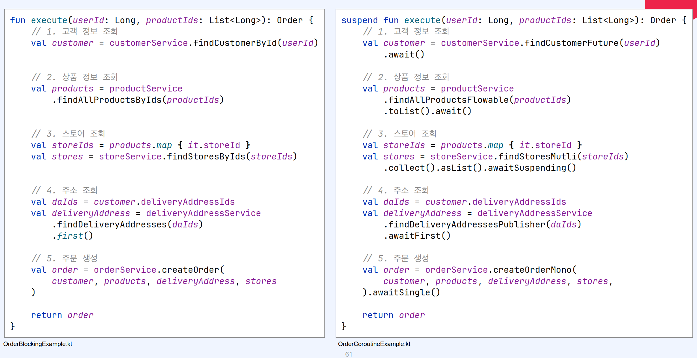

## FSM 적용하기

```kotlin

class OrderAsyncExampleUpgrade3(
    private val customerService: CustomerFutureService,
    private val productService: ProductRxjava3Service,
    private val storeService: StoreMutinyService,
    private val deliveryAddressService: DeliveryAddressPublisherService,
    private val orderService: OrderReactorService,
) {
    private class CustomContinuation(
        private val completion: Continuation<Any>,
    ) : Continuation<Any> {
        var result: Any? = null
        var label = 0

        // arguments and instance
        lateinit var that: OrderAsyncExampleUpgrade3
        var userId by Delegates.notNull<Long>()
        lateinit var productIds: List<Long>

        // variables
        lateinit var customer: Customer
        lateinit var products: List<Product>
        lateinit var stores: List<Store>
        lateinit var deliveryAddress: DeliveryAddress

        override val context: CoroutineContext
            get() = completion.context

        override fun resumeWith(result: Result<Any>) {
            this.result = result.getOrThrow()
            that.execute(0, emptyList(), this)
        }

        fun complete(value: Any) {
            completion.resume(value)
        }
    }

    fun execute(userId: Long,
                productIds: List<Long>,
                continuation: Continuation<Any>) {

        val cont = if (continuation is CustomContinuation) {
            continuation
        } else {
            CustomContinuation(continuation).apply {
                that = this@OrderAsyncExampleUpgrade3
                this.userId = userId
                this.productIds = productIds
            }
        }

        when (cont.label) {
            0 -> {
                // 1. 고객 정보 조회
                cont.label = 1

                customerService.findCustomerFuture(cont.userId)
                    .await(cont)
            }
            1 -> {
                // 2. 상품 정보 조회
                cont.customer = cont.result as Customer
                cont.label = 2

                productService.findAllProductsFlowable(cont.productIds)
                    .toList().await(cont)
            }
            2 -> {
                // 3. 스토어 조회
                cont.products = cont.result as List<Product>
                cont.label = 3

                val products = cont.products
                val storeIds = products.map { it.storeId }
                storeService.findStoresMutli(storeIds)
                    .collect().asList().awaitSuspending(cont)
            }
            3 -> {
                // 4. 주소 조회
                cont.stores = cont.result as List<Store>
                cont.label = 4

                val customer = cont.customer
                val daIds = customer.deliveryAddressIds
                deliveryAddressService.findDeliveryAddressesPublisher(daIds)
                    .awaitFirst(cont)
            }
            4 -> {
                // 5. 주문 생성
                cont.deliveryAddress = cont.result as DeliveryAddress
                cont.label = 5

                val customer = cont.customer
                val products = cont.products
                val deliveryAddress = cont.deliveryAddress
                val stores = cont.stores

                orderService.createOrderMono(
                    customer, products, deliveryAddress, stores,
                ).awaitSingle(cont)
            }
            5 -> {
                val order = cont.result as Order
                cont.complete(order)
            }
        }
    }

    private fun <T> CompletableFuture<T>.await(
        cont: Continuation<T>
    ) {
        this.thenAccept(cont::resume)
    }

    private fun <T> Single<T>.await(cont: Continuation<T>)
        where T : Any {
        this.subscribe(cont::resume)
    }

    private fun <T> Uni<T>.awaitSuspending(cont: Continuation<T>) {
        this.subscribe().with(cont::resume)
    }

    private fun <T> Publisher<T>.awaitFirst(
        cont: Continuation<T>
    ) {
        this.subscribe(FirstFinder(cont::resume))
    }

    private fun <T> Mono<T>.awaitSingle(
        cont: Continuation<T>
    ) {
        this.subscribe(cont::resume)
    }
}

```

- Shared 클래스 생성
- 이번엔 result와 label 뿐만 아니라
- 중간에 값들을 저장하기 위해 customer, products, stores, deliveryAddress 축

다음으로

- shared의 label 값에 따라서 다른 case문이 실행
- case 문에서는 labe을 변경하고
- 이전에 실행됐던 결과를 shared 내부의 중간값에 저장

다음으로

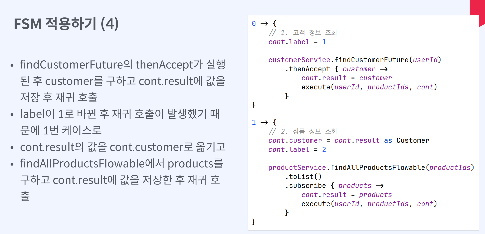

다음으로

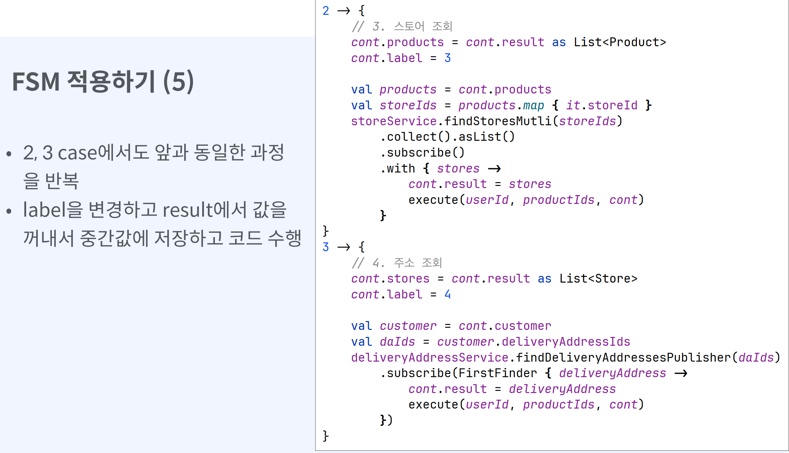

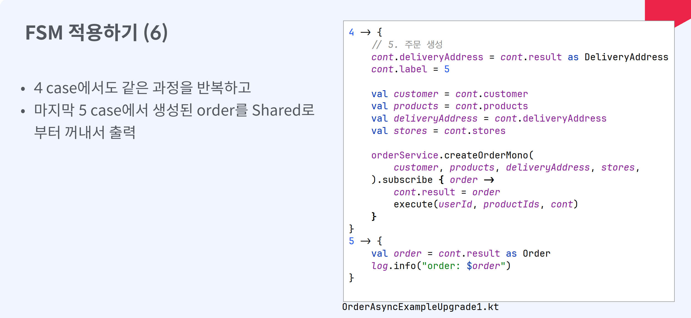

## FSM 기반에서 문제점

- cont.result에 값을 넣고 재귀 함수를 실행하 는 부분이 반복적으로 발생
- 재귀 함수를 직접 호출하기 때문에 외부로 분리
- 하기 힘들다
- main 함수에서는 Shared를 생성하지 않기 때 문에 결과를 출력하는 부분이 하드 코딩되어 있다
- -> Continuation을 전달하는 형태로 변경

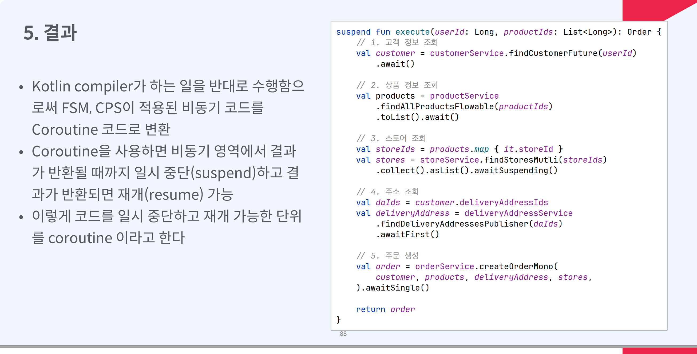

#  정리

- Kotlin compiler는 suspend가 붙은 함수에 Continuation 인자를 추가
- 다른 suspend 함수를 실행하면 소유하고 있는 Continuation을 전달
- 이러한 변환으로 인해서 suspend가 없는 함수에서 다른 suspend 함수 호출 불가
- 전달할 Continuation이 없기 때문

- suspend 함수 내부를 when 문을 이용해서 FSM 상태로 변경
- 각각의 state에서는 label을 변경하고 비동기 함수를 수행
- 비동기 함수가 완료되면 continuation.resume을 수행하여 다시 복귀
- 하지만 label이 변경되면서 다른 state로 transition
- 마지막 state에 도달하면 completion.resume을 수행하고 종료


# Coroutine으로 Spring 사용하기

## suspend 함수는 coroutine 내에서

- suspend 함수는 suspend 함수나 coroutine 내부가 아니라면 실행 불가
- Controller 내부에서 suspend 함수를 호출해 야 한다면?
- 혹은 변경 불가능한 interface가 Mono나 Completablefuture 등을 반환하고suspend 함수가 아니라면?


## Controller suspend 함수 지원

- Spring webflux는 suspend 함수를 지원
- Context1, MonoCoroutine, Dispatchers. Unconfined를 context로 갖고
- reactor-http-nio-2 쓰레드에서 실행

```kotlin
@RestController
@RequestMapping("/greet")
class GreetController {
    private val log = logger<GreetController>()

    private suspend fun greeting(): String {
        return "hello"
    }

    @GetMapping
    suspend fun greet(): String {
        log.info("context: {}", coroutineContext)
        log.info("thread: {}", Thread.currentThread().name)
        return greeting()
    }
}
```

```
54:54 [reactor-http-nio-2] - context:
[Context1{
  reactor.onDiscard.local=reactor.core.publisher.Operators$$Lambda$1021/0x0000000800674840@c81b13,
  MonoCoroutine{Active}@334c23b2,
  Dispatchers.Unconfined
}]
54:54 [reactor-http-nio-2] - thread: reactor-http-nio-2

```

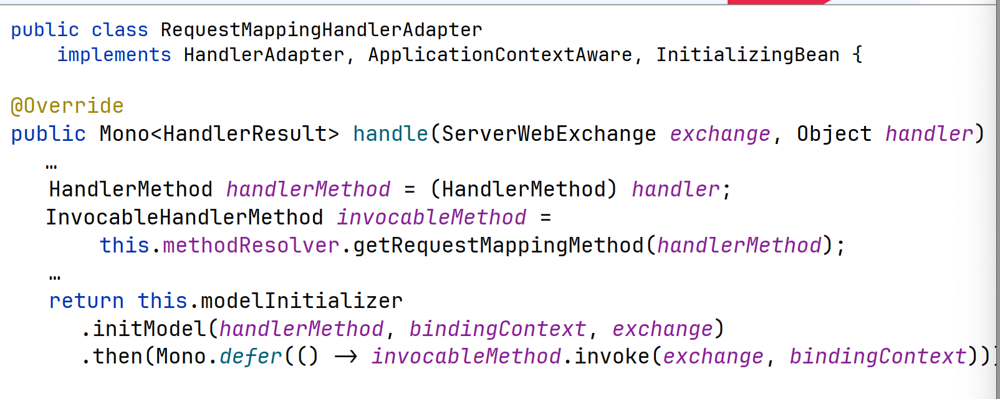

- RequestMappingHandlerAdapter가 handlerMethod를 실행
- handlerMethod로부터 invocableMethod를 획득하고 invoke를 통해 실행

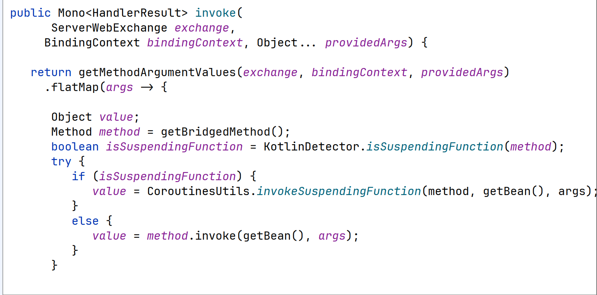

- 주어진 method가 suspend 함수인지 체크하고
- suspend 함수가 맞다면 CoroutineUtils.invokeSuspendingFunction를 실행
- 아니라면 method.invoke 실행


## Mono로 반환

```kotlin
interface GreetMonoService {
    fun findGreet(): Mono<String>
}

class GreetMonoServiceImpl : GreetMonoService {
    private suspend fun greeting(): String {
        delay(100)
        return "hello"
    }

    override fun findGreet(): Mono<String> {
        todo()
    }
}
```


외부 라이브러리에서 제공되는 인터페이스가 `Mono`를 반환하는 경우

이미 많이 사용되어서 `suspend` 함수로 변경이 불가능한 경우

`Mono`를 반환하는 함수 내부에서 어떻게 `suspend` 함수를 호출할 수 있을까?

```kotlin
package kotlinx.coroutines.reactor

public fun <T> mono(
    context: CoroutineContext = EmptyCoroutineContext,
    block: suspend CoroutineScope.() -> T?
): Mono<T> {
    return monoInternal(GlobalScope, context, block)
}

class GreetMonoServiceImpl : GreetMonoService {
    private suspend fun greeting(): String {
        delay(100)
        return "hello"
    }

    override fun findGreet(): Mono<String> {
        return mono {
            greeting()
        }
    }
}

```

- kotlin-coroutines-reactor에서 mono 함수를 제공
- mono 함수를 이용해서 내부에서 suspend 함수를 실행
- mono 함수의 결과값은 Mono이기 때문에 그대로 반환

```kotlin
private fun <T> monoInternal(
    scope: CoroutineScope, // support for legacy mono in scope
    context: CoroutineContext,
    block: suspend CoroutineScope.() -> T?
): Mono<T> = Mono.create { sink ->
    val reactorContext = context.extendReactorContext(sink.currentContext())
    val newContext = scope.newCoroutineContext(context + reactorContext)
    val coroutine = MonoCoroutine(newContext, sink)
    sink.onDispose(coroutine)
    coroutine.start(CoroutineStart.DEFAULT, coroutine, block)
}
```

- monolnternal에서는 sink로부터 ReactorContext를 추출
- 추출한 ReactorContext로 CoroutineContext를 생성
- MonoCoroutine을 생성하고 시작

```kotlin
private class MonoCoroutine<in T>(
    parentContext: CoroutineContext,
    private val sink: MonoSink<T>
) : AbstractCoroutine<T>(parentContext, false, true), Disposable {
    @Volatile
    private var disposed = false

    override fun onCompleted(value: T) {
        if (value == null) sink.success() else sink.success(value)
    }

    override fun onCancelled(cause: Throwable, handled: Boolean) {
        /** Cancellation exceptions that were caused by [dispose], that is, came from downstream, are not errors. */
        val unwrappedCause = unwrap(cause)
        if (getCancellationException() !== unwrappedCause || !disposed) {
            try {
                /** If [sink] turns out to already be in a terminal state, this exception will be passed through the
                 * [Hooks.onOperatorError] hook, which is the way to signal undeliverable exceptions in Reactor. */
                sink.error(cause)
            } catch (e: Throwable) {
                // In case of improper error implementation or fatal exceptions
                cause.addSuppressed(e)
                handleCoroutineException(context, cause)
            }
        }
    }

```

- MonoCoroutine은 sink를 인자로 받고
- Coroutineol complete되면 sink의 success 를 호출
- cancel된다면 sink의 error를 호출

`그렇다면 Reactor의 Context는 전달이 될까?`

```kotlin
class GreetMonoServiceImpl2 : GreetMonoService {

    private suspend fun greeting(): String {
        delay(100)

        val who = coroutineContext[ReactorContext]
            ?.context
            ?.get<String>("who")
            ?: "world"

        return "hello, $who"
    }

    override fun findGreet(): Mono<String> {
        return mono {
            greeting()
        }
    }
}

fun main() {
    val log = logger<GreetMonoServiceImpl2>()
    val greetMonoService = GreetMonoServiceImpl2()

    greetMonoService.findGreet()
        .contextWrite {
            it.put("who", "taewoo")
        }
        .subscribe { greet ->
            log.info("greet: {}", greet)
        }
    
    Thread.sleep(1000)
}
```

- main 함수에서 contextWrite을 통해서 값을 주입 
- findGreet에 reactor의 context가 주입되고
- findGreet은 ReactorContext를 CoroutineContext 형태로 greeting 함수에 전달
- greeting 함수에서는 coroutineContext를 통 해서 who에 접근


# CoroutineContext - CoroutineContext와 coroutine dispatcher

## Coroutine과  ThreadLocal

- coroutine은 다른 쓰레드풀에서 동작 가능
- CoroutineDispatcher (Dispatchers.I0)를 넘겨서 변경
- runBlocking은 main 함수에서 동작하기 때문 에 ThreadLocal에 접근 가능하지만 launch는 다른 쓰레드에서 동작하기 때문에
   ThreadLocal 결과가 null


## Continuation

```kotlin
@SinceKotlin("1.3")
public interface Continuation<in T> {

    public val context: CoroutineContext

    public fun resumeWith(result: Result<T>)
}

```


- suspend 함수들 사이에 공유해야하는 정보가 있다면? 
- suspend 함수는 다양한 쓰레드에서 실행되기 때문에 ThreadLocal 사용 불가
- Continuation은 coroutine 내의 모든 suspend 함수에 전달
- 그리고 CoroutineContext를 포함한다

## Continuation context 전파

- CustomContinuation을 만드는 상황에서 main으로부터 전달받은 Continuation의 context를 전달
- 이와 같은 방법을 사용하면, callee suspend 함수에게 Continuation의 context를 쉽게 전파

```kotlin
private class CustomContinuation(
    private val completion: Continuation<Any>
) : Continuation<Any> {
    override val context: CoroutineContext
        get() = completion.context

    override fun resumeWith(result: Result<Any>) {
        this.result = result.getOrThrow()
        that.execute(0, emptyList(), this)
    }

		fun complete(value: Any) {
  		  completion.resume(value)
		}

}
```

## CoroutineContext 접근 (1)

- runBlocking, launch, async와 같은 CoroutineScope 내부에 있다면 CoroutineScope.coroutineContext 를 통해서 접근 가능

```kotlin
import kotlinx.coroutines.*

fun main() = runBlocking {
    println("CoroutineContext in runBlocking: $coroutineContext")

    launch {
        println("CoroutineContext in launch: $coroutineContext")
    }

    async {
        println("CoroutineContext in async: $coroutineContext")
    }.await()
}
```

- Continuation에 접근이 가능하다면, Continuation.coroutineContext접근 가능

````kotlin
import kotlin.coroutines.*

fun exampleContinuation() {
    val continuation = Continuation(EmptyCoroutineContext) { result: Result<String> ->
        println("Continuation result: ${result.getOrNull()}")
        println("Continuation CoroutineContext: ${continuation.context}")
    }

    continuation.resumeWith(Result.success("Hello, Continuation!"))
}

fun main() {
    exampleContinuation()
}

````


- suspend 함수 내부에서는  coroutineContext를 통해서 접근 가능

```kotlin
import kotlinx.coroutines.*
import kotlin.coroutines.coroutineContext

suspend fun exampleSuspendFunction() {
    println("CoroutineContext in suspend function: $coroutineContext")
}

fun main() = runBlocking {
    exampleSuspendFunction()
}

```


- runBlocking CoroutineScope 내부에서coroutineContext에 접근
- suspend 함수 내부에서 coroutineContext 에 접근
- suspendCoroutine 내부에서 continuation을 인자로 받고 continuation.context로 접근

```kotlin
private suspend fun child() {
    log.info("context in suspend: {}", coroutineContext)

    val result = suspendCoroutine<Int> { cont ->
        log.info("context by continuation: {}",
            cont.context)
        cont.resume(100)
    }
    log.info("result: {}", result)
}

fun main() {
    runBlocking {
        log.info("context in CoroutineScope: {}",
            this.coroutineContext)
        child()
    }
}
```

## CoroutineContext Key, Element

```kotlin
public interface Key<E : Element>

    /**
     * An element of the [CoroutineContext]. An element of the coroutine context is a singleton context by itself.
     */
    public interface Element : CoroutineContext {
        /**
         * A key of this coroutine context element.
         */
        public val key: Key<*>

        public override operator fun <E : Element> get(key: Key<E>): E? =
            @Suppress("UNCHECKED_CAST")
            if (this.key == key) this as E else null

        public override fun <R> fold(initial: R, operation: (R, Element) -> R): R =
            operation(initial, this)

        public override fun minusKey(key: Key<*>): CoroutineContext =
            if (this.key == key) EmptyCoroutineContext else this
    }
}
```

- CoroutineContext는 여러 Element를 포함
- Element의 개수에 따라 다른 객체로 존재
- EmptyCoroutineContext: Element가 나도 없는 상태
- Element: Element가 하나인 상태. 즉 Element 그 자체
- CombinedContext: Element가 두 개 이상일 때
- Key: Element를 구분할 때 사용하는 식별자

## CoroutineContext 연산자

```kotlin
public interface CoroutineContext {
    public operator fun <E : Element> get(key: Key<E>): E?
    public fun <R> fold(initial: R, operation: (R, Element) -> R): R
    public operator fun plus(context: CoroutineContext): CoroutineContext = ...
    public fun minusKey(key: Key<*>): CoroutineContext
}

```

- CoroutineContext는 get, plus, minusKey 등의 연산자를 제공
- get: 특정 Key를 갖는 Element를 반환
- plus: 현재 Context에 다른 Context를 병합.
  이미 같은 Key를 갖는 Element가 다른
  Context에 있다면, 다른 Element로 override
- minusKey: 현재 Context에서 주어진 Key를 갖는 Element를 제외한 Context를 반환


# CoroutineContext 전파

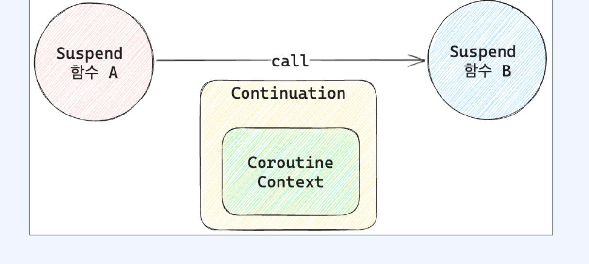

- suspend 함수에서 다른 suspend 함수를 호 출하는 경우, 바깥 suspend 함수의 Continuation이 전달
- 이를 통해서 바깥 Continuation의 CoroutineContext가 내부 suspend 함수에 게 전달


## withContext -  현재 context에 특정 element만 추가해서 실행하고 싶다면? 

```kotlin
fun main() {
    runBlocking {
        log.info("context in runBlocking: {}", this.coroutineContext)

        withContext(CoroutineName("withContext")) {
            val ctx = this.coroutineContext
            log.info("context in withContext: {}", ctx)
        }

        log.info("context in runBlocking: {}", this.coroutineContext)
    }
}
```

- 현재 coroutine의 coroutineContext에 인자 로 전달된 context를 merge
- 새로운 Job을 생성해서 주입


## CoroutineContext의 종류

### CoroutineName

```kotlin
runBlocking(CoroutineName("runBlocking")) {
    log.info("context in runBlocking: {}", this.coroutineContext)
    withContext(CoroutineName("withContext"))  // 오버라이드 
        val ctx = this.coroutineContext
        log.info("context in withContext: {}", ctx)
    }
    log.info("context in runBlocking: {}", this.coroutineContext)
}
```

- 디버깅에 이용되는 element
- CoroutineName을 변경하면 logging에 출력
- -Dkotlinx.coroutines.debug 필요

## Job

- Coroutine의 생명주기를 관리
- Job은 active, completed, cancelled와 같은 여러 상태를 갖는다
- start, cancel을 통해서 명시적으로 시작과 취 소가능
- parent, children을 통해서 다른 Coroutine의 생명주기도 관리
- launch, async 등의 coroutine builder를 통 해서 자식 Job을 생성 가능

## ReactorContext

 ReactorContext를 통해서 Reactor의 ContextView를 다른 suspend 함수에 전달

```kotlin
public class ReactorContext(public val context: Context) : AbstractCoroutineContextElement(ReactorContext) {

    // `Context.of` is zero-cost if the argument is a `Context`
    public constructor(contextView: ContextView): this(Context.of(contextView))

    public companion object Key : CoroutineContext.Key<ReactorContext>

    override fun toString(): String = context.toString()
}
```

```kotlin
fun main() {
    val greeting = mono {
        launch(Dispatchers.IO) {
            val context = this.coroutineContext[ReactorContext]
                ?.context
            val who = context?.get<String>("who")
                ?: "world"
            log.info("hello, $who")

            val newContext = (context ?: Context.empty()).put("who", "taewoo")
            launch(ReactorContext(newContext)) {
                val context = this.coroutineContext[ReactorContext]
                    ?.context

                Mono.create<String> {
                    val who = it.contextView().getOrDefault("who", "world")
                    it.success("hello, $who")
                }.contextWrite((context ?: Context.empty()))
                    .subscribe {
                        log.info(it)
                    }
            }
        }
    }

    greeting
        .contextWrite { it.put("who", "grizz") }
        .subscribe()

    Thread.sleep(1000)
}
```

- contextWrite을 통해서 context를 주입
- launch 내에서 coroutineContext의 ReactorContext로 접근
- 해당 context를 기반으로 새로운 reactor context생성
- ReactorContext(newContext)= launch에 전달
- Mono에서 contextWrite을 통해서 coroutineContext로 전달된 reactor
- context를 주입하고 출력


# Error Handling

## Async의 Exception


- CoroutineScope async LHO|14 exception0| 발생한다면 어떤 결과가?

```kotlin
fun main() {
    runBlocking {
        val deferred = CoroutineScope(Dispatchers.IO).async {
            throw IllegalStateException("exception in launch")
            10
        }

        try {
            deferred.await()
        } catch (e: Exception) {
            log.info("exception caught")
        }
    }
}
```

- try catch를 통해서 exception을 처리할 수 있  다
- 즉, async는 exception이 발생한 경우 유저에게 exception을 노출

## Launch의 Exception Handling

```kotlin
private val log = kLogger()
fun main() {
    runBlocking {
        val job = CoroutineScope(Dispatchers.IO).launch {
            launch {
                launch {
                    throw IllegalStateException("exception in launch")
                }
            }
        }

        job.join()
    }

    println("good")
}
```

- CoroutineScope launch 내에서 exception 이 발생한다면 어떤 결과가?
- catch에 걸리는 대신 exception이 그대로 출력
- exception이 처리되지 못하고 Thread의UncaughtExceptionHandler를 통해 출력

* launch 외부코드에는 영향을 주지 않는다. 

- launch 전체를 try catch로 감싼다면?
- 여전히 exception이 출력
- 함수처럼 exceptiono 전파되는 구조가 아닌 자식 Job에서 부모 Job으로 cancellation이 전파되며 함께 exception이 전달되기 때문에 일반적인 try catch로 exception handing 불가

## CoroutineExceptionHandler

```kotlin
public interface CoroutineExceptionHandler : CoroutineContext.Element {
    /**
     * Key for [CoroutineExceptionHandler] instance in the coroutine context.
     */
    public companion object Key : CoroutineContext.Key<CoroutineExceptionHandler>

    /**
     * Handles uncaught [exception] in the given [context]. It is invoked
     * if coroutine has an uncaught exception.
     */
    public fun handleException(context: CoroutineContext, exception: Throwable)
}
```

- CoroutineExceptionHandler를 통해서 root coroutine의 exception handling 
- launch에 적용 가능
- async에는 적용 불가능
  - async는 exception을 Deferred를 통해서전달하기 때문에

```kotlin
fun main() {
    runBlocking {
        val handler = CoroutineExceptionHandler { _, e ->
            log.error("exception caught")
        }

        val job = CoroutineScope(Dispatchers.IO + handler).launch {
            launch {
                launch {
                    throw IllegalStateException("exception in launch")
                }
            }
        }

        job.join()
    }
}
```

- handler를 생성하여 CoroutineScope에 전달
- Job을 통해서 전달되는 exception을` root coroutine에`서 context에 전달된 handler를 통 해 처리

반드시 루트 코루틴에서 사용할것. 

만약 handler를 root coroutine이 아닌 중간 launch에게 제공한다면?

- exception handling하지 못하고 그대로 출력

```kotlin
fun main() {
    runBlocking {
        val handler = CoroutineExceptionHandler { _, e ->
            log.error("exception caught")
        }

        val job = CoroutineScope(Dispatchers.IO).launch {
            launch(handler) {
                launch {
                    throw IllegalStateException("exception in launch")
                }
            }
        }

        job.join()
    }
}
```


만약 handler를 async한테 제공한다면?

```kotlin
fun main() {
    runBlocking {
        val handler = CoroutineExceptionHandler { _, e ->
            log.error("exception caught in handler")
        }

        val deferred = CoroutineScope(Dispatchers.IO + handler).async {
            throw IllegalStateException("exception in launch")
            10
        }

        try {
            deferred.await()
        } catch (e: Exception) {
            log.info("exception caught in catch")
        }
    }
}

// 37:36 [main] - exception caught in catch <<<< 
```

launch와는 다르게 주어진 handler를 무시하고 try catch에서 handling

## runBlocking handler

- 만약 runBlocking에 handler를 전달한다면?
- handler는 무시되고 그대로 출력

```kotlin
fun main() {
    val handler = CoroutineExceptionHandler { _, e ->
        log.error("exception handler")
    }

    runBlocking(handler) {
        throw IllegalStateException("exception in runBlocking")
    }
}
```

runBlocking 외부에서 try catch를 통해서 error handling 가능


# Coroutine Dispatcher

```kotlin
public abstract class CoroutineDispatcher :
    AbstractCoroutineContextElement(ContinuationInterceptor), ContinuationInterceptor {

    /** @suppress */
    @ExperimentalStdlibApi
    public companion object Key : AbstractCoroutineContextKey<ContinuationInterceptor, CoroutineDispatcher>(
        ContinuationInterceptor,
        { it as? CoroutineDispatcher })

```

Coroutine이 어느 쓰레드에서 실행될지 결정하는 Element

```kotlin
public actual object Dispatchers {
    @JvmStatic
    public actual val Default: CoroutineDispatcher = DefaultScheduler

    @JvmStatic
    public actual val Main: MainCoroutineDispatcher get() = MainDispatcherLoader.dispatcher

    @JvmStatic
    public actual val Unconfined: CoroutineDispatcher = kotlinx.coroutines.Unconfined

    @JvmStatic
    public val IO: CoroutineDispatcher = DefaultIoScheduler

```

CoroutineDispatcher≥ Default, Main,Unconfined, I0 등을 미리 만들어서 제공


## CoroutineDispatcher Main

- Main은 사용 불가
- Main dispatcher는 library를 통해서 주입 받아야 하는데, kotlinx-coroutines-core에서는 지원하지 않는다
- Android(kotlinx-coroutines-android) 는 Handler에서 동작하는 Main dispatcher를 제공

## CoroutineDispatcher 10, Default

- Default는 CPU 코어 수만큼 고정된 크기를 갖는 쓰레드 풀을 제공
  - Dispatcher가 설정되어 있지 않다면, 기본으로 사용 되는 Dispatcher
  - CPU 개수만큼 동시에 실행될 수 있기 때문에, `CPU bound blocking에` 적합
- I0는 기본적으로 최대 64개까지 늘어나는 가변 크기를 갖는 쓰레드 풀을 제공
  - blocking I/0를 실행하기 위한 쓰레드
  - Main 쓰레드나 Default 쓰레드에 영향을 주지 않고 분리된 쓰레드풀에서 I/0 blocking을 격리하기 위함
  - IO bound blocking에 적합


- runBlocking은 BlockingEventLoop dispatcher₴사용
- Default와 IO는 dispatcher≥ DefaultDispatcher-worker-2에서 동일하게 동작
- CoroutineScope를 만들고 Dispatcher를 전달하지 않아서 Default로 실행

## 왜 Default와 IO dispatcher는 같은 쓰레드를 사용하나요?

- I0와 Default는 쓰레드풀(DefaultDispatcher-worker)을 공유
- Default dispatcher로 시작하고 I/O dispatcher로 전환해도 동일한 쓰레드를 사용
- 하지만 동시에 수행 가능한 쓰레드의 개수를 Default는 고정, I0는 가변
- CPU bound blocking 작업은 작업의 특성 상 쓰레드를 cpu 숫자보다 늘려도 의미가 없다
- I0 bound blocking 작업은 쓰레드를 늘리 면 그만큼 더 많은 I0 수행 가능

- I0 dispatcher와 Default dispatcher가 쓰레드풀을 공유하기 때문에 for loop에서 launch 호출시 worker가 64개 이상으로 늘어날 수 있다

## Coroutine Dispatcher Unconfined

- Unconfined로 설정되면 어떤 쓰레드에서 coroutine이 실행될지 예상하기 힘들다
- 처음엔 caller 쓰레드 기준으로 실행
- 그 이후엔 마지막으로 실행된 suspend 함수의 쓰 레드를 따라간다
- 쓰레드가 예상 불가능하기 때문에 일반적인 코드에 서는 사용하면 안된다

## ExecutorCoroutineDispatcher

- 특정한 쓰레드 혹은 고정된 개수의 쓰레드풀을 갖는 Dispatcher 생성
- n개의 쓰레드를 갖는 executor를 생성하고 asCoroutineDispatcher를 통해서 CoroutineDispatcher로 변환
- ExecutorCoroutineDispatcher는 내부에 Executor를 포함
- 따라서 close를 통해서 명시적으로 executor를 종료해야 한다


# Coroutine Scope


## Coroutinescope는 무엇인가요? Coroutine은 또 무엇인가요?

- CoroutineScope는 Coroutine들에 대한 scope를 정의
- scope에는 여러 Coroutine들이 포함
- 자식 Coroutine들에 대한 생명주기를 관리
- 자식 Coroutine들이 모두 완료되어야만  scope도 완료
- 이런 관리를 위해서 CoroutineScope의  coroutineContext에는 꼭 Job를 포함


## Coroutinescope 함수

```kotlin
@Suppress("FunctionName")
public fun CoroutineScope(context: CoroutineContext): CoroutineScope =
    ContextScope(if (context[Job] != null) context else context + Job())

internal class ContextScope(context: CoroutineContext) : CoroutineScope {
    override val coroutineContext: CoroutineContext = context
    // CoroutineScope is used intentionally for user-friendly representation
    override fun toString(): String = "CoroutineScope(coroutineContext=$coroutineContext)"
}

@Suppress("FunctionName")
public fun Job(parent: Job? = null): CompletableJob = JobImpl(parent)

```

- CoroutineScope 함수를 이용해서 CoroutineScope를 생성
- 인자로 주어진 context에 Job이 포함되어있는 지 확인
- 포함되어있지 않다면 Job을 생성하여 추가하 고 ContextScope에 전달
- ContextScope는 CoroutineScope의 단순한구현체

## Coroutine builder

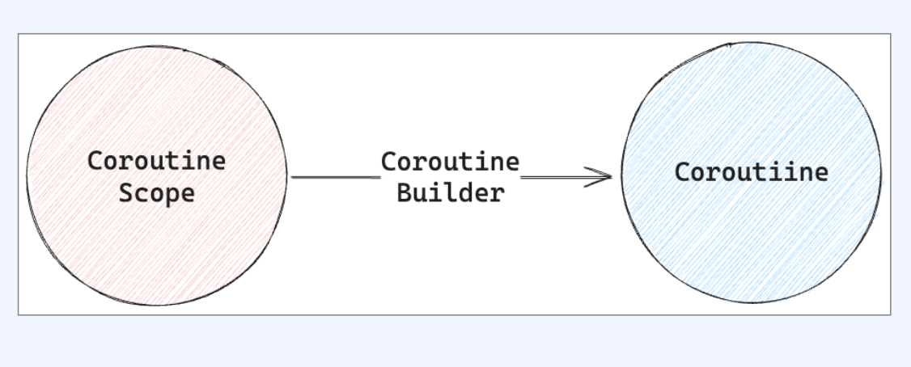

- Coroutine builder는 CoroutineScope로부터 Coroutine을 생성
- CoroutineScope의 CoroutineContext와 인자로 전달 받은 context를 merge하여 new Context를 생성
- Coroutine을 생성하여 start하고 반환
- CoroutineScope의 Job을 부모로 갖는다
- Coroutine builder를 통해서 생성된 Coroutine은 비동기하게 동작


## Coroutine Builder - launch

```kotlin
public fun CoroutineScope.launch(
    context: CoroutineContext = EmptyCoroutineContext,
    start: CoroutineStart = CoroutineStart.DEFAULT,
    block: suspend CoroutineScope.() -> Unit
): Job {
    val newContext = newCoroutineContext(context)
    val coroutine = if (start.isLazy)
        LazyStandaloneCoroutine(newContext, block) else
        StandaloneCoroutine(newContext, active = true)
    coroutine.start(start, coroutine, block)
    return coroutine
}

@ExperimentalCoroutinesApi
public actual fun CoroutineScope.newCoroutineContext(context: CoroutineContext): CoroutineContext {
    val combined = foldCopies(coroutineContext, context, true)
    val debug = if (DEBUG) combined + CoroutineId(COROUTINE_ID.incrementAndGet()) else combined
    return if (combined !== Dispatchers.Default && combined[ContinuationInterceptor] == null)
        debug + Dispatchers.Default else debug
}


```

* 인자가 없으면 디폴트 파라미터로 생성
* StandaloneCoroutine을 생성하고 start
* isLazy가 true라면 LazyStandaloneCoroutine을 생성
* StandaloneCoroutine을 Job으로 반환
* 외부에서 launch를 실행한 후 Job을 획득하 여 cancel, join 등을 실행 가능
* newCoroutineContext를 통해 CoroutineScope의 coroutineConte×t 인자로 주어진 context를 merge

#### 1. `join()`을 호출하지 않는 경우:

- **실행 여부**: `launch`로 시작된 코루틴은 즉시 실행을 시작합니다. 즉, `join()`을 호출하지 않아도 코루틴은 실행됩니다.
- **완료 대기**: `join()`을 호출하지 않으면, 해당 코루틴이 완료될 때까지 현재 스레드(혹은 코루틴)는 그 코루틴의 완료를 기다리지 않습니다. 따라서 그 코루틴이 백그라운드에서 실행되며, 그동안 다른 작업을 계속 진행할 수 있습니다.
- **결과 확인**: `join()`을 호출하지 않으면 해당 코루틴이 언제 완료되는지 알 수 없으므로, 그 코루틴이 끝날 때까지 기다리는 것이 필요할 경우 `join()`을 사용해야 합니다.

#### 2. `join()`을 호출하는 경우:

- **실행 여부**: 마찬가지로 코루틴은 즉시 실행을 시작합니다.
- **완료 대기**: `join()`을 호출하면 현재 스레드는 그 코루틴이 완료될 때까지 기다립니다. 이는 해당 코루틴이 끝날 때까지 다른 작업을 수행하지 않겠다는 것을 의미합니다.
- **결과 확인**: `join()`을 호출하면 코루틴이 완료된 후에야 다음 작업을 진행할 수 있습니다. 이를 통해 해당 코루틴의 완료 시점을 명확히 할 수 있습니다.

**실행 여부**: `launch`로 시작된 코루틴은 `join()` 호출 여부와 상관없이 실행됩니다.

**비동기 처리**: `join()`을 호출하지 않으면 코루틴은 백그라운드에서 실행되며, 현재 스레드는 다른 작업을 계속할 수 있습니다.

**동기 처리**: `join()`을 호출하면 현재 스레드는 해당 코루틴이 완료될 때까지 대기합니다.

## Coroutine builder - async

```kotlin
public fun <T> CoroutineScope.async(
    context: CoroutineContext = EmptyCoroutineContext,
    start: CoroutineStart = CoroutineStart.DEFAULT,
    block: suspend CoroutineScope.() -> T
): Deferred<T> {
    val newContext = newCoroutineContext(context)
    val coroutine = if (start.isLazy)
        LazyDeferredCoroutine(newContext, block) else
        DeferredCoroutine<T>(newContext, active = true)
    coroutine.start(start, coroutine, block)
    return coroutine
}
```

- DeferredCoroutine을 생성하고 start
- isLazy가 true라면 LazyDeferredCoroutine을 생성
- DeferredCoroutine를 Deferred로 반환
- Deferred는 Job을 상속하고 있기 때문에 cancel, join 뿐만 아니라
- await을 통해서 block이 반환하는 값에 접 근 가능

- CoroutineScopedI coroutine builder l async= 통해서 coroutine을 생성하고 this로 접근
- 비동기로 동작하기 때문에 await을 통해서 완료될 때
- 까지 suspend하고 값에 접근


### `Deferred` 객체와 `await()`

`Deferred` 객체는 `async`로 시작한 코루틴의 결과를 나타내는 객체입니다. `await()`을 사용하여 그 결과를 기다리고, 값을 반환받을 수 있습니다.

#### 1. `await()`을 호출하지 않는 경우:

- **실행 여부**: `async`로 시작된 코루틴은 즉시 실행됩니다. `await()`을 호출하지 않아도 코루틴은 실행됩니다.
- **결과 확인**: `await()`을 호출하지 않으면 해당 코루틴의 결과를 사용할 수 없습니다. 즉, 코루틴이 백그라운드에서 실행되더라도 그 결과를 명시적으로 대기하지 않기 때문에 결과 값을 얻을 수 없습니다.
- **완료 대기**: `await()`을 호출하지 않으면 현재 코루틴이 완료될 때까지 기다리지 않으며, 다른 작업을 계속 진행할 수 있습니다.

#### 2. `await()`을 호출하는 경우:

- **실행 여부**: 마찬가지로 코루틴은 즉시 실행을 시작합니다.
- **결과 확인**: `await()`을 호출하면 해당 코루틴이 완료될 때까지 기다리고, 그 결과를 반환받습니다.
- **완료 대기**: `await()`을 호출하면 현재 코루틴이 완료될 때까지 대기합니다. 이를 통해 코루틴의 결과를 명확히 사용할 수 있습니다.

### 요약

- **실행 여부**: `async`로 시작된 코루틴은 `await()` 호출 여부와 상관없이 실행됩니다.
- **결과 확인**: `await()`을 호출하지 않으면 코루틴의 결과를 얻을 수 없고, 호출하면 코루틴의 결과를 반환받습니다.
- **완료 대기**: `await()`을 호출하면 해당 코루틴이 완료될 때까지 대기합니다.


- **`launch`**: 결과가 필요 없는 비동기 작업을 수행할 때 사용합니다. `Job` 객체를 반환하며, `join()`을 통해 완료를 대기할 수 있습니다.
- **`async`**: 결과가 필요한 비동기 작업을 수행할 때 사용합니다. `Deferred<T>` 객체를 반환하며, `await()`을 통해 결과를 받을 수 있습니다.


# Coroutine

```kotlin
@InternalCoroutinesApi
public abstract class AbstractCoroutine<in T>(
    parentContext: CoroutineContext,
    initParentJob: Boolean,
    active: Boolean
) : JobSupport(active), Job, Continuation<T>, CoroutineScope {

```

- 모든 Coroutine은 AbstractCoroutine을 상 속
- Coroutine은 Job이며 Continuation이고  CoroutineScope
- Job: 작업의 단위가 되고 start, cancel로 상태 를 변경할 수 있으며 join으로 완료 시점을 명시
- CoroutineScope: Coroutine builder를 해서 자식 Coroutine을 생성하고, 자식 Coroutine들의 생명주기를 관리


## Scoping 함수 - coroutineScope

```kotlin
fun main() {
    runBlocking {
        val job = CoroutineScope(EmptyCoroutineContext).launch {
            log.info("step1")
            coroutineScope {
                launch {
                    delay(100)
                    log.info("complete job1")
                }

                launch {
                    delay(100)
                    log.info("complete job2")
                }

                launch {
                    delay(100)
                    log.info("complete job3")
                }
            }
            log.info("step2")
        }

        job.join()
    }
}
```

- coroutinescope는 외부 scope의 context를 상속하고 Job을 override
- 이를 통해 분리된 환경에서 자식 Coroutine 들의 생명주기를 관리하고
- `자식 Coroutine이 모두 완료되고  coroutineScope 함수가 완료됨을 보장`
- ScopeCoroutine을 생성하여 block을 실행
- ScopeCoroutine은 동기적으로 동작

## coroutineScope와 launch의 차이

- coroutinescope는 동기적으로 launch는 비동기적으 로 동작
- coroutinescope는 ScopeCoroutine을 생성하지만 Continuationld를 override하지 않고 launch는 새 로운 Continuationld 생성
- coroutinescope는 결과를 반환하지만 launch는 Job을 반환


## async의 문제

- 여러 deferred들이 완료되어야 하는 시점이 중요하다면?
- deferred 1,2, 3은 정확히 step1 출력과 step2 출력 사이에 반환되어야 한다

### async의 문제 해결

```kotlin
fun main() {
    runBlocking {
        val job = CoroutineScope(EmptyCoroutineContext).launch {
            log.info("step1")
            val result = coroutineScope {
                val deferred1 = async {
                    delay(100)
                    100
                }

                val deferred2 = async {
                    delay(100)
                    200
                }

                val deferred3 = async {
                    delay(100)
                    300
                }

                deferred1.await() +
                        deferred2.await() +
                        deferred3.await()
            }
            log.info("result: {}", result)
            log.info("step2")
        }

        job.join()
    }
}
```


- coroutineScope로 async를 감싸고 마지막에 await 을 호출하여 결과를 합산
- async 함수를 호출하는 순간부터 각각의 coroutine  들은 시작
- 따라서 300ms가 아닌 100ms만 걸리게 된다
- coroutinescope로 감싸고 async를 실행하기 때문에 포함하고 있는 async들만 종료되고 나면 coroutineScope도 종료
- 즉, async들만 실행되고 합류하는 일종의 동기화 포인트를 생성

## Scoping 함수 - withContext

- Scoping 함수는 coroutinescope 뿐만 아 니라 with Context도 존재
- coroutinescope와는 다르게 인자로 context를 전달
- oldContext에 인자로 전달받은 context를 `merge한 newContext` 생성
- newContext와 oldContext의 상태에 따라서 
  - ScopeCoroutine,
  -  UndispatchedCoroutine,
  -  DispatchedCoroutine 반환


## exception 전파

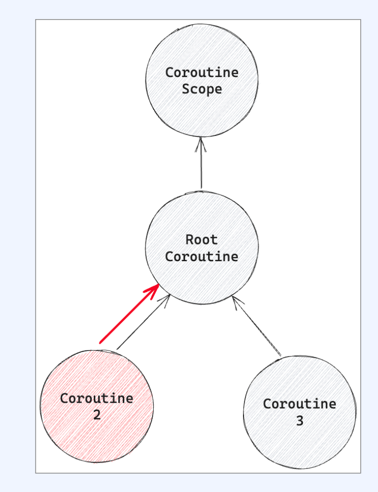


- Coroutine2에서 exception 발생
- Coroutine2는 부모 Job을 cancel

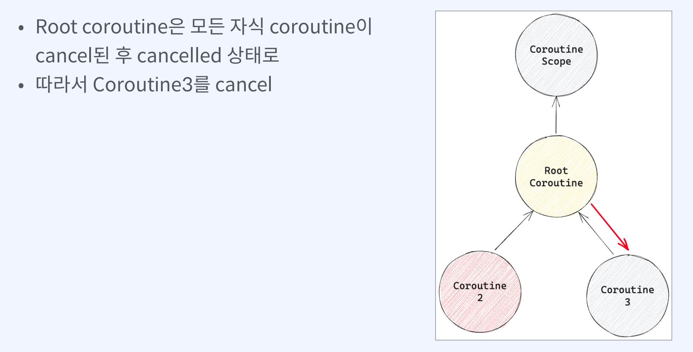

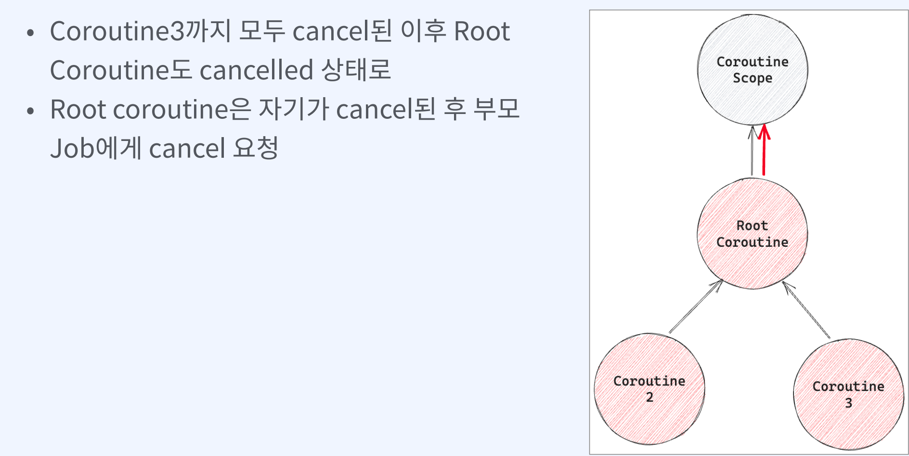

## exception - SupervisorJob

SupervisorJob을 Context로 제공하면 exception에 의한 cancel 전파가 위로 전파되지 않고 아래 방향으로만 전

```kotlin

fun main() {
    runBlocking {
        val cs = CoroutineScope(Dispatchers.Default)
        val csJob = cs.coroutineContext[Job]

        // launch1
        val job = cs.launch {
            // launch2
            launch(SupervisorJob()) {
                delay(100)
                throw IllegalStateException("unexpected")
            }

            // launch3
            launch {
                try {
                    delay(1000)
                    log.info("job3: I'm done")
                } catch (e: Exception) {
                    log.info("job3: I'm cancelled")
                    log.info("e3: {}", e.message)
                }
            }
        }

        job.join()
        log.info("job is cancelled: {}", job.isCancelled)
        log.info("csJob is cancelled: {}", csJob?.isCancelled)
    }
}
```

## withTimeout

- withTimeout을 통해 일정 시간 대기
- 시간 초과시 해당 coroutine을 cancel하고 TimeoutCancellationException& throw

```kotlin

fun main() {
    runBlocking {
        val cs = CoroutineScope(Dispatchers.Default)
        val csJob = cs.coroutineContext[Job]

        // launch1
        val job = cs.launch {
            // launch2
            launch {
                withTimeout(500) {
                    try {
                        delay(1000)
                        log.info("job2: I'm done")
                    } catch (e: Exception) {
                        log.info("job2: I'm cancelled")
                        log.info("e2: {}", e.message)
                    }
                }
            }

            // launch3
            launch {
                try {
                    delay(1000)
                    log.info("job3: I'm done")
                } catch (e: Exception) {
                    log.info("job3: I'm cancelled")
                    log.info("e3: {}", e.message)
                }
            }
        }

        job.join()
        log.info("job is cancelled: {}", job.isCancelled)
        log.info("csJob is cancelled: {}", csJob?.isCancelled)
    }
}
```


# Coroutine 심화


## Flux와 suspend 함수

* flux를 생성하면서 suspend 함수를 사용하고 싶다면 불가하다.
* Flux.create에서 suspend 함수 호출 시 create는 일반 함수에서 동작하기 때문에 suspend 함수 호출 불가

때문에 코틀린에서 제공하는 flux 함수를 사용해야 한다

```kotlin
public fun <T> flux(
    context: CoroutineContext = EmptyCoroutineContext,
    @BuilderInference block: suspend ProducerScope<T>.() -> Unit
): Flux<T> {
    require(context[Job] === null) { "Flux context cannot contain job in it." +
        "Its lifecycle should be managed via Disposable handle. Had $context" }
    return Flux.from(reactorPublish(GlobalScope, context, block))
}
```

## Flux 대신 Flow를

- collect suspend 함수를 제공
- FlowCollector에서 emit을 구현하여 item을 전달 받을 수 있다

```kotlin
public interface Flow<out T> {

    public suspend fun collect(collector: FlowCollector<T>)
}
```

```kotlin
fun main() {
    runBlocking {
        val squareFlow: Flow<Int> = flow {
            emit(square(10))
            emit(square(20))
            emit(square(30))
        }

        squareFlow.collect(object: FlowCollector<Int> {
            override suspend fun emit(value: Int) {
                log.info("value: {}", value)
            }
        })

        log.info("again")

        squareFlow.collect {
            log.info("value: {}", it)
        }
    }
}
```

- flow 함수를 통해서 Flow 생성
- flow는 suspend 함수를 지원하므로 square suspend 함수를 바로 사용 가능
- object: FlowCollector로 익명 클래스 생성
- 혹은 lambda로 변경하여 호출 가능
- Flow 또한 Flux처럼 cold하다


## Channel

```kotlin
public interface Channel<E> : SendChannel<E>, ReceiveChannel<E> {
}
```

- Channel과 SendChannel을 ReceiveChannel을 상속
- SendChannel의 send를 통해서 값을 전달
- trySend를 통해서 결과를 받을 수 있다
- close를 통해서 명시적으로 닫을 수 있다
- ReceiveChannel의 receive를 통해서 값을 수신
- 모든 과정은 thread safe하고 coroutine으로 동작하기 때문에 non-blocking

### Channel close with for

 명시적으로 close하고 for를 통해서 close될 때까지 모든 값들을 전달 받을 수도 있다

```kotlin
fun main() {
    runBlocking {
        val channel = Channel<Int>()

        launch(Dispatchers.IO) {
            log.info("sending")
            channel.send(1)
            channel.send(2)
            channel.send(3)
            channel.close()
        }

        for (value in channel) {
            log.info("value: {}", value)
        }
    }
}
```

### Channel capacity

```kotlin
public const val UNLIMITED: Int = Int.MAX_VALUE

public const val RENDEZVOUS: Int = 0

public const val CONFLATED: Int = -1

public const val BUFFERED: Int = -2

internal const val OPTIONAL_CHANNEL = -3
```


- UNLIMITED: 제한 없이 channel에 추가할 수있다
- RENDEZVOUS: channel에 buffer가 없다
- 즉, channel이 비워야만 send할 수 있기 때 문에 send와 receive가 교차적으로 발생
- CONFLATED: 가장 오래된 channel의 내용을 삭제
- BUFFERED: 기본적으로 64개만큼의 크기를 갖는 buffer를 생성

