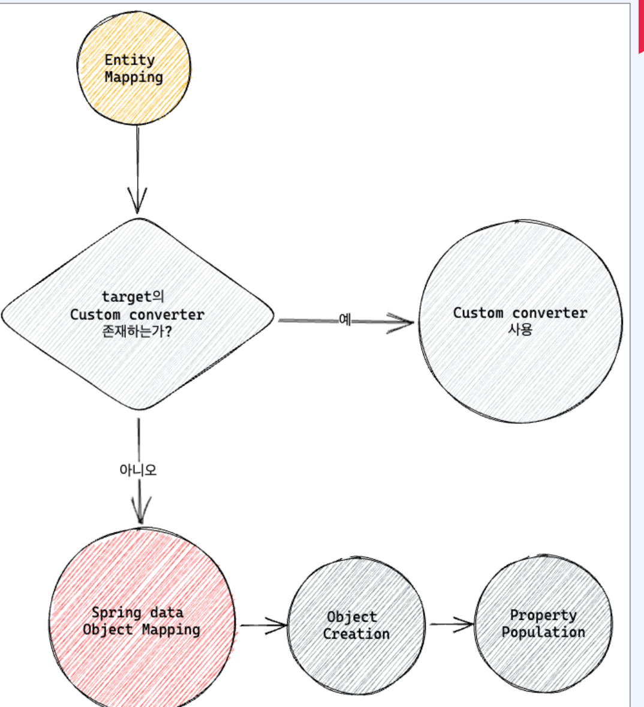
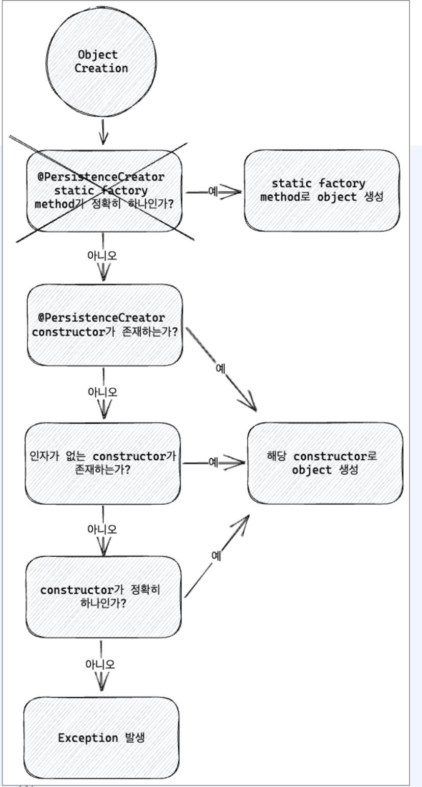

# Reactive Mongo

[toc]

MongoDB사에서 공식적인 2가지 java driver를 제공

- Sync Driver
- Reactive Streams Driver


## Sync Driver


- 동기적으로 동작하는 어플리케이션을 위한  MongoDB 드라이버
- 클라이언트가 요청을 보내면 응답이 돌아오기 전까지 쓰레드가 blocking
- 메소드가 응답 객체를 바로 반환하기 때문에 직관적이며 쉽게 작성 가능
- 쓰레드 동시성 문제로 인해서 많은 요청을 처리하기 힘들다


## Reactive Streams driver


- 비동기적으로 동작하는 어플리케이션을 위한 MongoDB 드라이버
- 클라이언트가 요청을 보내면 쓰레드는 non- blocking
- 모든 응답이 Publisher를 이용해서 전달되기 때문에 처리하기 어렵다
- Spring reactive stack과 함께 사용되어 높은 성능과 안정성을 제공


# Mongo Reactive Streams Driver


- MongoDB의 MongoClient, MongoDatabase, MongoCollection
- MongoClient: MongoDB 클러스터를 가리키는 객체
  - MongoDatabase factory 역할.

* MongoDatabase: Mongo의 Database를 가리킨다
  - Codec, WriteConcern, ReadPreference 정보를 포함

- collection 이름을 인자로 받고 MongoCollection를 제공
- MongoCollection: MongoDB의 Collection을 가리킨다
  - mongodb commands를 실행

```java

public class MongoExample {
    private static final Logger log = LoggerFactory.getLogger(MongoExample.class);

    public static void main(String[] args) {
        ConnectionString connectionString = new ConnectionString("mongodb://localhost:27017/wooman");
        MongoClientSettings settings = MongoClientSettings.builder()
                .applyConnectionString(connectionString)
                .build();

        try (MongoClient mongoClient = MongoClients.create(settings)) {
            MongoDatabase database = mongoClient.getDatabase("wooman");
            log.info("database: {}", database.getName());

            MongoCollection<Document> collection = database.getCollection("person");
            log.info("collection: {}", collection.getNamespace().getCollectionName());
        }
    }
}
```

- Connectionstring을 이용해서 MongoDB 연결 정보를 string 형태로 제공
- MongoClientSettings builder에 Connection 정보를 전달
- MongoClientSettings로 MongoClient 생성
- MongoClient로 MongoDatabase 접근 
- MongoDatabase로 MongoCollection 접근


# Mongo Document

- MongoCollection에 query를 실행하여 bson의 Document를 반환
- bson의 Document는 Map<String, Object> 를 구현하고 내부에 LinkedHashMap을 저장 하여 Map 메소드 override

다음은 BSON 타입과 대응하는 Java 타입을 표로 정리한 것입니다:

| BSON Type          | Number | Java Type                                          |
| ------------------ | ------ | -------------------------------------------------- |
| Double             | 1      | Double, Float                                      |
| String             | 2      | Character, String, Enum                            |
| Object             | 3      | -                                                  |
| Array              | 4      | -                                                  |
| Binary data        | 5      | Binary (bson에서 제공), byte[]                     |
| ObjectId           | 7      | ObjectId (bson에서 제공)                           |
| Boolean            | 8      | Boolean, AtomicBoolean                             |
| Date               | 9      | Date, Instant, LocalDate, LocalDateTime, LocalTime |
| Null               | 10     | -                                                  |
| Regular Expression | 11     | Pattern                                            |
| JavaScript         | 13     | Code (bson에서 제공)                               |
| 32-bit integer     | 16     | Integer, Byte, Short, AtomicInteger                |
| Timestamp          | 17     | -                                                  |
| 64-bit integer     | 18     | Long, AtomicLong                                   |
| Decimal128         | 19     | Decimal128 (bson에서 제공), BigDecimal             |
| Min key            | -1     | MinKey (bson에서 제공)                             |
| Max key            | 127    | MaxKey (bson에서 제공)                             |


# Spring Data Mongo Reactive

## Entity

```java
@Document(collection = "person")
@NoArgsConstructor
@AllArgsConstructor
@Data
public class PersonDocument {
    @Id
    private ObjectId id;
    private String name;
    @Field(name = "age")
    private Integer age;
    private String gender;
    @Version
    private Long version;
}
```

- 데이터베이스에서 하나의 Document와 매칭 되는 클래스
- ReactiveMongoEntityTemplate,
   ReactiveMongoRepository 등은 데이터베 이스에 요청을 보내고 그 결과를 Entity 형태로 반환
- 데이터베이스 접근을 단순화하고 개발 편의성 을 향상
- Collection, Document에 필요한 데이터베이 스 metadata를 어노테이션 등으로 제공

## ReactiveMongoTemplate

```java
public class ReactiveMongoTemplate implements ReactiveMongoOperations, ApplicationContextAware {

    public ReactiveMongoTemplate(MongoClient mongoClient, String databaseName) {
        // Implementation here...
    }

    public ReactiveMongoTemplate(ReactiveMongoDatabaseFactory mongoDatabaseFactory) {
        // Implementation here...
    }

    public ReactiveMongoTemplate(ReactiveMongoDatabaseFactory mongoDatabaseFactory,
                                 @Nullable MongoConverter mongoConverter) {
        // Implementation here...
    }

    public ReactiveMongoTemplate(ReactiveMongoDatabaseFactory mongoDatabaseFactory,
                                 @Nullable MongoConverter mongoConverter,
                                 Consumer<Throwable> subscriptionExceptionHandler) {
        // Implementation here...
    }

    // Additional methods and implementations...
}
```


- ReactiveMongoTemplate은 Spring data mongodb reactive의 추상화 클래스
- Mongo 쿼리들을 Bson 형태로 넘기거나 PojoCodec, Custom codec 등을 등록하지 않아도 
- 메소드 체이닝을 통해서 쿼리를 수행하고 결과 를 entity 객체로 받을 수 있다
- ReactiveMongoOperations를 구현

# Spring data의 Object Mapping



만약 지원하는 converter가 없다면  MappingMongoConverter는 다음 과정을 거 쳐서 Document를 entity로 변환

1. Object creation: constructor, factory method 등을 이용해서 Document의field들로 Object 생성
2. Property population: setter, with.. 메소드등을 이용해서 Document의 field를Object에 주입

## Object Createation





 다음 순서로 체크하여 해당하는 알고리즘으로  Document를 Object로 변환

1. @PersisteneeCreater 어노테이션을 갖는 statie faetery methed가 정확히 하나 있는 경우 해당
    method 사용
2. @PersistenceCreator 어노테이션을 갖는 constructor가 있다면 해당 constructor 사용
3. 인자가 없는 constructor가 있다면 해당  constructor 사용
4. constructor가 정확히 하나 있다면 해당 constructor 사용

## id mapping

- mongodb에서 모든 document는 _id를 필요

- MappingMongoConverter는 다음의 방법으로 . id를 감지

  - @ld가 붙어있는 필드

  - 필드명이 id이고 @Field를 통해서 별도의 이름이 부여되지 않은 경우

- id 필드가 제공되지 않는 경우, 자동으로 추가

## Property population

- r2dbc에서는 property가 mutable할때만 property population 적용이 가능했지만 mongodb에서는 with 메소드 지원
- No-args constructor를 호출하여 텅 빈 객체를 만들  고
- gender를 제외한 나머지 필드는 reflection으로
- gender는 withGender 메소드 호출

# MetaData Mapping

- Entity 클래스에 annotation을 추가하여 데이터베이스와 관련된 설정들을 주입
- @ld:_id에 해당하는 필드에 적용
- @Document: entity class에 적용. Collection 이름을 변경 가능
- @DBRef: mongodb의 DBRef 형태로 저장해야 하는 필드
- @Indexed: 필드에 대해서 인덱스를 생성. 기본적으론 자동 생성이 비활성화이므로 별도로 설 정 필요
- @Compoundindex: 클래스에 적용. 여러 필드로 구성된 복합 인덱스 제공
- @Textindexed: 필드에 text index를 적용
- @Hashindexed: 필드에 hash index를 적용

- @Transient: 기본적으로 모든 필드는 mapping 대상. @ Transient가 붙은 필드는 mapping
- @Field: entity의 property 필드에 적용. @Field가 붙은 필드에 대해서는 convention 기반 대신 Field에 주어진 name으로 적용
- @Version: 낙관적 잠금 (Optimistic Lock)에 이용. entity가 update 될때마다 자동으로 update
- @PersistenceConstructor: 특정 constructor에 대해서 Obiect creation 할 때 사용하게끔
   지정. constructor의 argument 이름에 따라서 mapping


# Transactional

```java
@Service
@RequiredArgsConstructor
public class PersonMongoService {

    private final PersonMongoRepository personRepository;

    @Transactional
    public Flux<PersonDocument> savePerson() {
        var person = new PersonDocument(null, "peter", 50, "M");
        return personRepository.save(person)
            .flatMap(savedPerson -> {
                var personToUpdate = savedPerson.withAge(30);
                return personRepository.save(personToUpdate);
            })
            .thenMany(personRepository.findAll());
    }
}

```

- @Transactional를 사용하여 여러 query를 묶어서 진행
- 새로운 Entity를 만들어서 save하고 update 한후
- findAIl을 통해서 모든 document 반환

## TransactionalOperator (1)

```java
public interface TransactionalOperator {

    default <T> Flux<T> transactional(Flux<T> flux) {
        return execute(it -> flux);
    }

    <T> Mono<T> transactional(Mono<T> mono);

    <T> Flux<T> execute(TransactionCallback<T> action) throws TransactionException;
  
    public Flux<PersonDocument> savePerson2() {
        var person = new PersonDocument(null, "peter", 50, "M");
        var jobs = personRepository.save(person)
            .flatMap(savedPerson -> {
                var personToUpdate = savedPerson.withAge(30);
                return personRepository.save(personToUpdate);
            })
            .thenMany(personRepository.findAll());
      
        return transactionalOperator.transactional(jobs);
    }

    public Flux<PersonDocument> savePerson3() {
        var person = new PersonDocument(null, "peter", 50, "M");
        var jobs = personRepository.save(person)
            .flatMap(savedPerson -> {
                var personToUpdate = savedPerson.withAge(30);
                return personRepository.save(personToUpdate);
            })
            .thenMany(personRepository.findAll());
      
        return transactionalOperator.execute(status -> jobs);
    }
}
```


 transactional 메소드를 통해서 주어진 Flux 혹은 Mono를 transaction 안에서 실행

- flux를 바로 반환하지 않고
   transactionalOperator/
   transactional로 wrapping 하여 전달
- 혹은 execute를 통해서
   TransactionCallback 형태로 실행