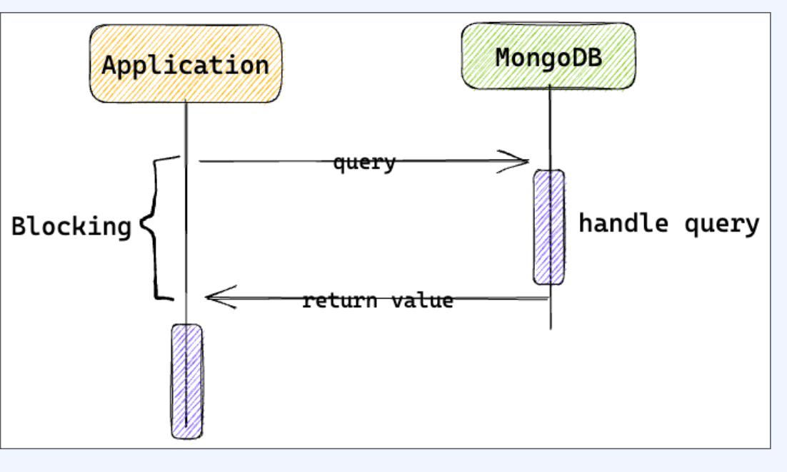
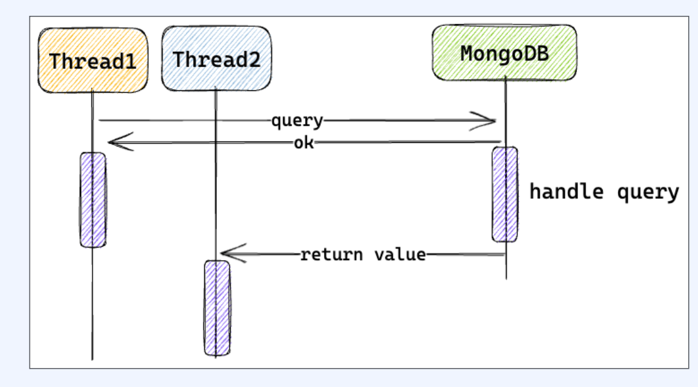
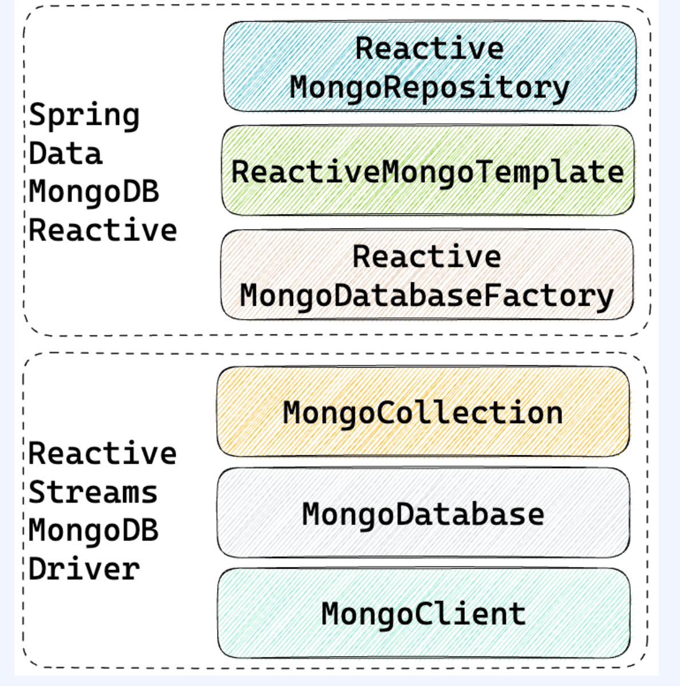
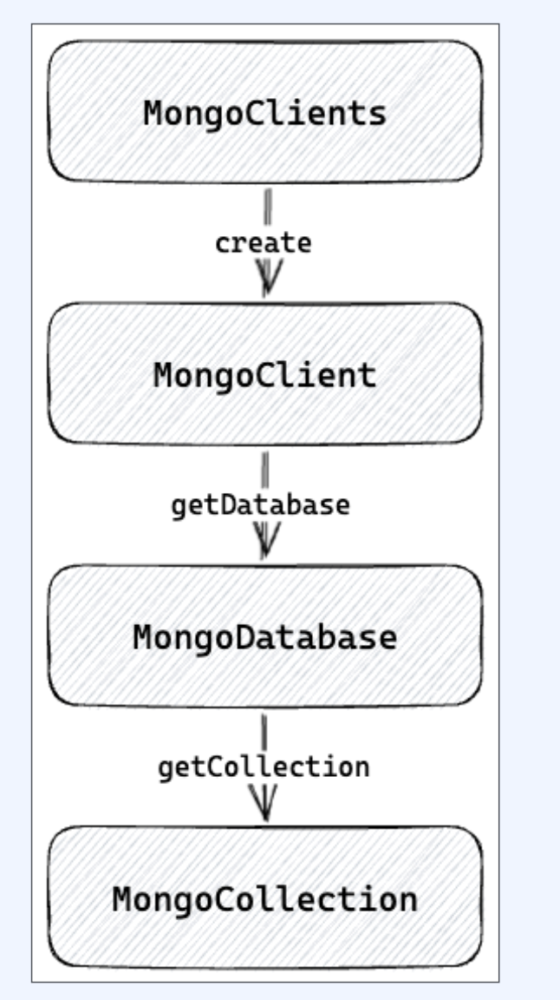

# Reactive Mongo

[toc]

MongoDB사에서 공식적인 2가지 java driver를 제공

- Sync Driver
- Reactive Streams Driver


## Sync Driver



- 동기적으로 동작하는 어플리케이션을 위한  MongoDB 드라이버
- 클라이언트가 요청을 보내면 응답이 돌아오기 전까지 쓰레드가 blocking
- 메소드가 응답 객체를 바로 반환하기 때문에 직관적이며 쉽게 작성 가능
- 쓰레드 동시성 문제로 인해서 많은 요청을 처리하기 힘들다


## Reactive Streams driver



- 비동기적으로 동작하는 어플리케이션을 위한 MongoDB 드라이버
- 클라이언트가 요청을 보내면 쓰레드는 non- blocking
- 모든 응답이 Publisher를 이용해서 전달되기 때문에 처리하기 어렵다
- Spring reactive stack과 함께 사용되어 높은 성능과 안정성을 제공



# Mongo Reactive Streams Driver



- MongoDB의 MongoClient, MongoDatabase, MongoCollection
- MongoClient: MongoDB 클러스터를 가리키는 객체
  - MongoDatabase factory 역할.

* MongoDatabase: Mongo의 Database를 가리킨다
  - Codec, WriteConcern, ReadPreference 정보를 포함

- collection 이름을 인자로 받고 MongoCollection를 제공
- MongoCollection: MongoDB의 Collection을 가리킨다
  - mongodb commands를 실행

```java

public class MongoExample {
    private static final Logger log = LoggerFactory.getLogger(MongoExample.class);

    public static void main(String[] args) {
        ConnectionString connectionString = new ConnectionString("mongodb://localhost:27017/wooman");
        MongoClientSettings settings = MongoClientSettings.builder()
                .applyConnectionString(connectionString)
                .build();

        try (MongoClient mongoClient = MongoClients.create(settings)) {
            MongoDatabase database = mongoClient.getDatabase("wooman");
            log.info("database: {}", database.getName());

            MongoCollection<Document> collection = database.getCollection("person");
            log.info("collection: {}", collection.getNamespace().getCollectionName());
        }
    }
}
```

- Connectionstring을 이용해서 MongoDB 연결 정보를 string 형태로 제공
- MongoClientSettings builder에 Connection 정보를 전달
- MongoClientSettings로 MongoClient 생성
- MongoClient로 MongoDatabase 접근 
- MongoDatabase로 MongoCollection 접근


