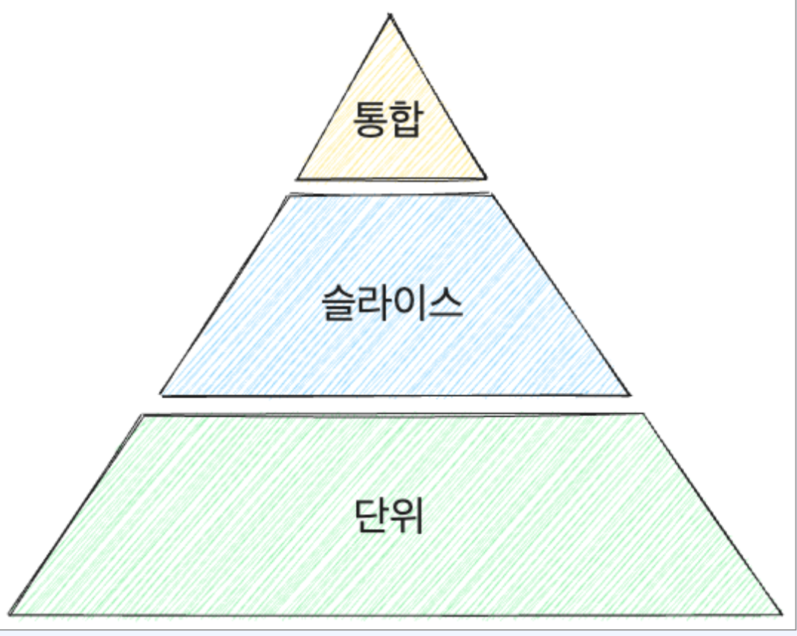
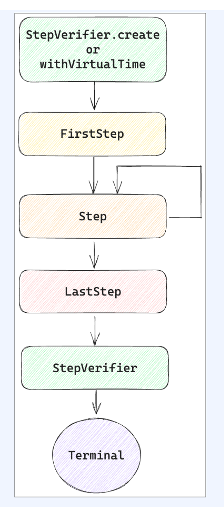

# Reactive Test

[toc]


# 소프트웨어 테스트 7가지 원칙

국제 소프트웨어 테스팅 자격 협회 (ISTQB)에서 수집하고 확립한 원칙


## 1. 테스트는 결함을 찾는 과정이다

- 테스트를 통해 소프트웨어의 결함을 확인할 수 있다
- 테스트는 소프트웨어가 완전히 결함이 없다는 것을 증명하는 것이 아니다
- 테스트는 결함의 수를 줄이는데 큰 도움이 되지 만, 소프트웨어가 완전히 오류 없음을 보장하지 는 않는다
- 하지만, 테스트를 통해 소프트웨어의 정상 작동 에 대한 신뢰를 높일 수 있다

## 2. 완벽한 테스트는 불가능하다

- 모든 입력과 전제 조건을 테스트하는 것은 실질 적으로 불가능하다
- 프로그램 실행 경로, 주어지는 입력값, 이벤트 실행 순서 등은 무한히 조합 가능 (무한 경로, 무 한 입력값, 무한 타이밍)
- 테스트에 사용할 수 있는 시간과 예산은 한정적
- 따라서, 리스크를 분석하고 중요한 기능에 초점 을 맞춰 테스트 계획을 세우는 것이 필요

## 3. 테스트는 일찍 진행할수록 좋다

- 테스트는 일찍 진행할수록 비용을 아낄 수 있다
- 요구사항 분석에 발견한 결함은 **QA에 발견한** 결함보다 더 쉽게 해결 가능
- 구현 과정에서 테스트를 작성하면, 구현이 완료 된 이후 바로 수행할 수 있기 때문에 전체 테스 트 기간 단축 가능

## 4. 결함은 집중되는 성향을 갖는다

- 대다수의 결함은 소수의 특정 모듈에 집중되는 경향을 갖기 때문에 해당 영역에 집중해야 한다
- 결함의 80%는 코드의 20%로 인해 발생한다
   (파레토의 법칙)

1. 복잡한 구조를 갖는 모듈
2. 다른 모듈과 복잡한 상호 작용을 하는 모듈
3. 개발 난이도가 높거나 최신 기술을 사용한 모듈
4. 기존 코드를 쓰지 않고 새롭게 개발한 모듈
5. 크기가 큰 모듈
6. 경험이 미흡한 팀에서 만든 모듈

## 5. 테스트에 내성이 생길 수 있다

- 동일한 테스트를 지속적으로 실행하면 소프트 웨어가 작동하는 것을 확인할 수는 있지만, 새 로운 문제를 발견하지 못하게 된다
- 테스트를 검토하고 지속적으로 시나리오를 수정하거나 추가
- 다양한 테스트 기법, 접근 방식을 병행
- 테스트를 개선하지 않고 이전 상태 그대로 둔다 면 새로운 조건, 상황을 커버하지 못 할 수 있다

## 6. 테스트는 주변 환경에 의존한다

- 테스트는 주변 환경에 따라서 완전히 달라질 수 있다
- 각각의 서비스는 고유한 요구사항과 검증 수준을 갖는다
- 의료 서비스는 게임 서비스에 비해서 더 많은 테스트와 다른 종류의 테스트가 필요
- 따라서 주변 환경을 파악하고 해당하는 환경에 맞는 테스트 수준, 기법을 준비

##  7.결함이 없다고 좋은 품질은 아니다

- 소프트웨어에 결함이 없다고 해서 무조건 좋은 품질을 갖는 소프트웨어인 것은 아니다
- 사용자가 원하는 기능을 갖추고 요구사항을 만 족하는 소프트웨어가 진정으로 좋은 소프트웨어
- 테스트의 목적은 결함을 원천적으로 제거하는 것이 아닌 사용자가 원하는 기능을 갖고 있는 소프트웨어가 맞는지 검증하는 것


 

# 테스트의 종류

- 테스트하는 기능, 복잡성에 따라서 여러 테스트 기법 적용
- 단위 테스트, 슬라이스 테스트, 통합 테스트



## Reactive 환경에서 테스트

- Reactive 환경에서는 테스트를 수행하기 쉽지 않다
- blocking하게 동작하지 않기 때문에 함수를 실행하고 기다리는 것이 애매..


# 단위 테스트

- 개발자가 작성한 가장 작은 단위를 검증하는 테스트 기법
  - 단위는 객체와 메소드를 가리킨다
- 각각의 객체와 메소드가 올바르게 동작하는지 검증
- 예외적인 상황에서 적절하게 동작하는지 확인
- 호출한 메소드에서 에러가 발생하는 상황
- 잘못된 입력값이 주어진 상황


## 단위 테스트 5가지 원칙 F.l.R.S.T.

- Clean code의 저자인 Robert Martin이 제시한 규칙
- 효과적인 단위 테스트를 위한 5가지 원칙을 제 시
- Fast, Isolated (Independent), Repeatable, Self-validating, Timely(Thorough)

### Fast

- 단위 테스트는 빠르게 실행되어야 한다
- 여러 항목에 대해서 여러 번 수행이 되기 때문에 한 번의 실행 속도가 전체에 큰 영향 을 준다
- 단위 테스트가 빠를수록 개발 프로세스에 방해를 주지 않기 때문에 더 자주 실행할 수 있다
- 인프라, 외부 호출에 의존하는 코드를 가능한 mocking으로 만들어야 한다

### Independent

*  단위 테스트는 독립적으로 수행되어야 한다

- 다른 테스트에 영향을 받지 않아야 하며 테스트의 순서에 상관없이 동작해야 한다
- 각각의 테스트는 자신의 테스트 대상에 대해서만 테스트를 수행해야 한다

### Repeatable

- 단위 테스트는 같은 입력에 대해서 같은 결과를 반환해야 한다
- 입력이 같다면 여러 번 실행되더라도 그 결과가 달라지면 안된다

### Self validating

- 단위 테스트는 스스로 검증이 가능해야 한다
- 통과인지 실패인지 결과를 바로 확인할 수 있어야 하고 자동으로 실행되어야 한다
- 결과가 애매한 상황이 없어야 한다

### Timely

- 단위 테스트는 적절한 시점에 작성되어야 한다
- 개발 초기 단계에 작성되어야 한다
- 실제 코드가 작성되는 시점에 맞춰 개발되어야 한다


# Reactor Test

Project reactor에서는 reactor를 위해서 다양한 라이브러리 지원

- Reactor Core, Reactor Netty, Reactor Adapter, Reactor Kafka 등
- 추가로 Reactor test 지원


## Reactor Test

```groovy
// reactor test
testImplementation("io.projectreactor:reactor-test")
```


## Flux 테스트

Flux를 테스트한다면?

- collectList로 Mono<List>로 변경
- block을 통해서 강제로 동기 blocking 코드로변경

```java
@Test
void test1() {
    Flux<Integer> flux = Flux.create(sink -> {
        for (int i = 0; i < 10; i++) {
            sink.next(i);
        }
        sink.complete();
    });
  
    var expected = IntStream.range(0, 10).boxed()
            .toList();
    var actual = flux.collectList().block();
  
    assertIterableEquals(expected, actual);
}
```

중간에 onError 이벤트가 발생하면  assertThrows를 통해서 exception을 확인해 야 한다

- exceptionol throw되기 전에 onNext로 전달 된 값을 확인하려면 추가적인 복잡한 코드가 필요

```java
@Test
void test2() {
    Flux<Integer> flux = Flux.create(sink -> {
        for (int i = 0; i < 10; i++) {
            sink.next(i);
            if (i == 5) {
                sink.error(new RuntimeException("error"));
            }
        }
        sink.complete();
    });
    assertThrows(RuntimeException.class, 
        () -> flux.collectList().block());
}
```

## StepVerifier

- StepVerifier를 사용하면 Publisher가 제공하 는 다양한 이벤트를 차례로 검증 가능
- 예제에서는 flux를 create하여 테스트 환경을 준비
- 그 이후 expectSubscription, expectNext, expectComplete를 통해서 이벤트를 확인

```java
@Test
void test1() {
    Flux<Integer> flux = Flux.create(sink -> {
        for (int i = 0; i < 10; i++) {
            sink.next(i);
        }
        sink.complete();
    });
    StepVerifier.create(flux)
            .expectSubscription()
            .expectNext(0, 1, 2, 3, 4, 5, 6, 7, 8, 9)
            .expectComplete()
            .verify();
}
```



- StepVerifier≥ FirstStep, Step, LastStep으 로 구성
- Firststep은 처음 받는 이벤트인 onSubscription과 관련
  - 0..1
- Step은 이후에 들어오는 이벤트들을 순차적으로 검증
  - 0..N
- Laststep은 최종 결과를 검증
  - 1

*  검증에 실패한다면 테스트 실패

### First Step

```java
public interface StepVerifier {

  static <T> FirstStep<T> create(Publisher<? extends T> publisher) {
		return create(publisher, Long.MAX_VALUE);
	}

	static <T> FirstStep<T> create(Publisher<? extends T> publisher, long n) {
		return create(publisher, StepVerifierOptions.create().initialRequest(n));
	}

	static <T> FirstStep<T> create(Publisher<? extends T> publisher, StepVerifierOptions options) {
		return DefaultStepVerifierBuilder.newVerifier(options, () -> publisher);
	}
}
```

- StepVerifier의 create static 메소드를 이용하여 FirstStep을 생성
  - 추가로 Subscription에 전달할 request 수와  StepVeriffierOptions를 지원
- Firststep은 Step을 상속하기 때문에 무시하고 바로 Step으로 넘어갈 수 있다
- expectSubscription: onSubscribe 이벤트 기대
  - expectsubscription은 Step을 반환하여 step으 로 넘어갈 수 있다
  - 혹은 FirstStep은 Step을 상속하기 때문에  expectSubscription를 호출하지 않고 바로 Step 으로 넘어갈 수도 있다

마지막 인자인 StepVeriferOptions

```java
public class StepVerifierOptions {

	@Nullable
	private String scenarioName = null;

	private boolean checkUnderRequesting = true;
	private long initialRequest = Long.MAX_VALUE;
	private Supplier<? extends VirtualTimeScheduler> vtsLookup = null;
	private Context initialContext;

  
	public StepVerifierOptions initialRequest(long initialRequest) {
		this.initialRequest = initialRequest;
		return this;
	}
	
  public StepVerifierOptions withInitialContext(Context context) {
		this.initialContext = context;
		return this;
	}

  public StepVerifierOptions scenarioName(@Nullable String scenarioName) {
		this.scenarioName = scenarioName;
		return this;
	}
}
```

- initialRequest: Subscription에 전달할 request 수 제공
- withlnitialContext: Context를 제공하여 초기 Context 설정
- scenarioName: 시나리오 이름을 부여하여 assertion 에러 발생시 메세지에 노출

즉 아래테스트는 다음과 같이 설명할 수 있다.

```java
@Test
void test1() {
    var flux = Flux.range(0, 5);
    var options = StepVerifierOptions.create()
            .initialRequest(100)
            .withInitialContext(Context.empty())
            .scenarioName("test1");
  
    StepVerifier.create(flux, options)
            .expectSubscription()
            .expectNextCount(5)
            .verifyComplete();
}
```

- StepVerifierOptions.create를 이용해서 텅 빈 Options 생성
- 이후 initialRequest와 withInitialContext,
   scenarioName을 체이닝하여 request 수, 초 기 Context, 시나리오 이름 설정
- FirstStep에 서 expectsubscription 실행 후 Step으로 이동
- Step에서 expectNextCount를 통해서 5개의onNext를 수행하고
- verify Complete로 종료

### Step onNext

```java
interface Step<T> extends LastStep {

  default Step<T> assertNext (Consumer<? super T> assertionConsumer) {
    return consumeNextWith(assertionConsumer):
  }

  Step<T> expectNext (T t);

  Step<T> expectNext (T... ts);

  Step<T> expectNextCount (long count);
  

  Step<T> expectextSequence ();

  Iterable<? extends T> iterable);

  Step<T> expectNextMatches (Predicate‹? super T> predicate);
```

- onNext 이벤트로 전달되는 item들을 하나씩 검증
- assertNext: Consumer를 통해 item을 검증. 문제가 있다면 JUnit의 Assertions 등을 통해서
   AssertionErrors throw

* expectNext: 한 개 이상의 item을 순서대로 비교. 가 변인자를 통해 여러 값을 전달 가능

- expectNextCount: 각각의 item을 검증하는 대신
   count만큼 onNext 이벤트가 발생하는지 검증
- expectNextSequence: iterable의 element들을
- onNext로 전달되는 item들과 순서대로 비교
-  expectNextMatches: onNext로 전달된 item을 인 자로 받고 검증하여 booelan 반환. true라면 통과

### Step Context

```java
interface Step<T> extends LastStep {
	ContextExpectations<T> expectAccessibleContext();
	
	Step<T> expectNoAccessibleContext();
}
```

- Publisher에 전파되는 Context를 검증
- expectAccessibleContext: onSubscribe  이벤트 이후 전파된 Context가 있는지 검증
- 전파된 Context가 없다면 테스트 실패
- ContextExpectations를 반환하여 Context와 관련된 추가 검증 가능
- expectNoAccessibleContext:  onSubscribe 이벤트 이후 전파되는 Context가 없는지 검증
- 전파된 Context가 있다면 테스트 실패

```java
interface ContextExpectations<T> {
    ContextExpectations<T> hasKey(Object key);
    ContextExpectations<T> hasSize(int size);
    ContextExpectations<T> contains(Object key, Object value);
    ContextExpectations<T> containsAllOf(Context other);
    ContextExpectations<T> containsAllOf(Map<?, ?> other);
    ContextExpectations<T> containsOnly(Context other);
    ContextExpectations<T> containsOnly(Map<?, ?> other);
    ContextExpectations<T> assertThat(Consumer<Context> assertingConsumer);
    ContextExpectations<T> matches(Predicate<Context> predicate);
    ContextExpectations<T> matches(Predicate<Context> predicate, String description);
    Step<T> then();
}
```

- haskey: Context에 특정한 key을 갖는지 검증
- hassize: Context에 특정한 size를 갖는지 검증
- contains: Context에 특정한 key에 특정한 값을 가지 고 있는지 검증
- containsAllof: 다른 Context 혹은 Map에 포함된 값 들을 모두 포함하는지 검증
- containsonly: 다른 Context, Map에 포함된 값들을 모두 포함하는지 검증. 그 이외의 값은 가지면 안된다 
- assertThat: Consumer를 통해서 Context를 인자 로 전달받고 JUnit의 Assertions 등을 통해서 비교 matches: Context를 인자로 전달받고 기대와 일치하 는 경우 true를 반환하는 Predicate을 통해 검증
- then: ContextExpectations를 종료하고 Step으로 복귀

```java
public class StepContextExampleTest {
    @Test
    void test1() {
        var flux = Flux.range(0, 5);

        StepVerifier.create(flux)
                .expectNoAccessibleContext()
                .expectNextCount(5)
                .verifyComplete();
    }

    @Test
    void test2() {
        var flux = Flux.range(0, 5)
                .contextWrite(Context.of("foo", "bar"));

        StepVerifier.create(flux)
                .expectAccessibleContext()
                .contains("foo", "bar").then()
                .expectNextCount(5)
                .verifyComplete();
    }

    @Test
    void test3() {
        var flux = Flux.range(0, 5);

        var options = StepVerifierOptions.create()
                .withInitialContext(Context.of("foo", "bar"));

        StepVerifier.create(flux, options)
                .expectAccessibleContext()
                .contains("foo", "bar").then()
                .expectNextCount(5)
                .verifyComplete();
    }
}
```

- test1에서는 Context가 전파되지 않기 때문에 expectNoAccessibleContext 
- test2에서는 contextwrite을 통해서 Context 생성
  - expectAccessibleContext가 통과되고 contains를 통해서 기대하는 값이 존재하는지확인 
- test3에서는 StepVerifierOptions를 통해Context를 주입
- StepVerifierOptions를 통해 Context를 주 입하는 것은 subscribe에서 Conntext 주입과 비슷

### Step 유틸리티

- as: 이전 step에 description을 추가. 테스트 실패시 as에 넘겨진 description이 로그에  추가
- then: 이전 step 이후 Runnable 코드를 실행
- thenRequest: 추가로 n만큼 request. 처음 에 request를 제한적으로 했다면 이후 thenRequest를 통해서 추가적으로 item 요 청 가능

```java
@Slf4j
public class StepUtilityExampleTest {
    @Test
    void test1() {
        var flux = Flux.range(0, 10);

        StepVerifier.create(flux, 5)
                .expectSubscription()
                .expectNextCount(5)
                .as("five elements")
                .then(() -> log.info("five elements"))
                .thenRequest(5)
                .expectNextCount(5)
                .verifyComplete();
    }
}
```

- create에 request 5를 제공
- as를 이용해서 description 추가
- then을 통해서 expectNextCount 이후 특정동작 수행
- thenRequest로 추가로 5개 request
- 이후 expectNextCount로 다음 5개 consume
- 이후 verifyComplete로 완료

## LastStep, StepVerifier

### LastStep

- LastStep은 가장 마지막에 호출되어 최종 상태를 확인 가능
- Step은 Laststep을 상속하기 때문에 Step 단 계에서 Laststep의 메소드를 호출하여 검증 종료 가능

### LastStep expectError

- Publisher가 onError를 전달하는 것을 기대하는 경우  consumeErrorWith 혹은 expectError* 호출
- 모두 StepVerifier를 반환하기 때문에 명시적으로 verify를 호출해야 한다
- consumeErrorwith: Consumer를 전달하여  Consumer 내부에서 검증
- expectError: onError 이벤트가 전달됐는지 검증
  - Class를 전달하여 특정 타입의 Error가 전달되었는 지 확인 가능
- expectErrorMessage: onError 이벤트로 전달된 Error의 message를 비교
- expectErrorMatches: Predicate를 전달하여 true 가 반환되면 통과. 아니라면 실패
- expectErrorSatisfies: consumeErrorWith와 동일 

```java
interface LastStep {
    StepVerifier consumeErrorWith(Consumer<Throwable> consumer);
    StepVerifier expectError();
    StepVerifier expectError(Class<? extends Throwable> clazz);
    StepVerifier expectErrorMessage(String errorMessage);
    StepVerifier expectErrorMatches(Predicate<Throwable> predicate);
    StepVerifier expectErrorSatisfies(Consumer<Throwable> assertionConsumer);
}
```

```java
public class Test {
  
    @Test
    void test2() {
        var flux = Flux.error(new IllegalStateException());
        StepVerifier.create(flux)
                .expectError(IllegalStateException.class)
                .verify();
    }

    @Test
    void test3() {
        var message = "custom message";
        var flux = Flux.error(new IllegalStateException(message));
        StepVerifier.create(flux)
                .expectErrorMessage(message)
                .verify();
    }

    @Test
    void test4() {
        var flux = Flux.error(new IllegalStateException("hello"));
        StepVerifier.create(flux)
                .expectErrorMatches(e ->
                        e instanceof IllegalStateException &&
                                e.getMessage().equals("hello"))
                .verify();
    }

    @Test
    void test5() {
        var flux = Flux.error(new IllegalStateException("hello"));
        StepVerifier.create(flux)
                .expectErrorSatisfies(e -> {
                    assertInstanceOf(IllegalStateException.class, e);
                    assertEquals("hello", e.getMessage());
                })
                .verify();
    }
  
    @Test
    void test11() {
        var mono = Mono.delay(Duration.ofMillis(500));

        StepVerifier.create(mono)
                .expectTimeout(Duration.ofMillis(100))
                .verify();
    }

    @TestToFail
    void test12() {
        var mono = Mono.delay(Duration.ofMillis(100));

        StepVerifier.create(mono)
                .expectTimeout(Duration.ofSeconds(1))
                .verify();
    }

    @Test
    void test13() {
        var flux = Flux.range(0, 10)
                .delayElements(Duration.ofMillis(500));

        StepVerifier.create(flux)
                .expectTimeout(Duration.ofMillis(100))
                .verify();
    }
}
}
```

- expectError를 통해 onError 이벤트가 전달되는 것을 검증
- expectError에 Throwable Class를 전달하 여 특정 타입의 Error가 throw되는지 검증
- expectErrorMessage를 통해 특정 메세지를 가진 Error가 전달되는지 검증
- expectErrorMatches에 Predicate를 lambda로 전달하여 조건을 충촉하는지 확인 하는지 boolean으로 반환
- expectErrorSatisfies에l Consumer를  labmda로 전달하여 조건을 충족하는지 확인 하는지 assert를 통해서 검증
- expectTimeout은 timeout이 날것이라 기대하는것이다. 


또한 LastStep에는 verify()가 있는데, 매번 verify를 끝에 붙이는게 쉽지 않기 때문에 단축 메소드를 제공한다.

- verifyError의 경우, expectError().verify0 와 동일
- 나머지 메소드도 동일
- Duration을 반환하여 전체 검증에 얼마만큼의 시간이 소모되었는지 확인 가능

```java
public class Test {
    @Test
    void test1() {
        var err = new IllegalStateException("hello");

        StepVerifier.create(Mono.error(err))
                .verifyErrorMessage("hello");
    }

    @Test
    void test2() {
        StepVerifier.create(Mono.just(1))
                .expectNext(1)
                .verifyComplete();
    }

    @Test
    void test3() {
        var mono = Mono.delay(Duration.ofMillis(500));
        
        StepVerifier.create(mono)
                .verifyTimeout(Duration.ofMillis(100));
    }
}
```

verify ErrorMessage, verify Complete, verifyTimeout 등을 호출하여 빠르게 검증 가능

## Step Verifier

```java
public interface StepVerifier {
  StepVerifier log ();
	Duration verify() throws AssertionError:
	Duration verify(Duration duration) throws AssertionError:
	Assertions verifyThenAssertThat();
	Assertions verifyThenAssertThat (Duration duration);
}
```

- verify: 호출되는 시점부터 Publisher에 대한 검증 시작.
  -  onComplete, onError 이벤트가 발생하거나 cancel 되면 block 해제
- 기본적으로 timeout 없이 계속 기다린다
  -  Duration을 제공하여 특정 시간동안만 block하게 만들 수 있다
- verifyThenAssertThat: verify와 동일하게Publisher를 검증하고 Assertions를 반환하여 모든 이벤트가 종료된 시점에서 추가 검증 가능
  - Duration을 제공하여 특정 시간동안만 block하게


## withVirtualTime - 가상시간

### delay publisher

만약 Mono에 1시간 로 걸려있다면?

Flux가 10개의 item을 갖는데 delayElements를 통해 10초의 간격을 갖는다면?

테스트실행에 지연이 생기게 된다.

### withVirtualTime

시간과 관련된 기능을 지원하기 위해 withVirtualTime을 제공한다.

withVirtualTime으로 FirstStep을 생성하면 기존의 Scheduler를 VirtualTimeScheduler로 대체한다.

VirtualTimeScheduler는 delay와 관련된 함 수들을 실제로 대기하는 대신 건너뛸 수 있는 기능을 제공한다. 

```java
public class FirstStepWithVirtualTimeExampleTest {
    @Test
    void test2() {   // 제대로 동작 안함. 5초 걸림 
        var flux = Flux.range(0, 5)
                        .delayElements(Duration.ofSeconds(1));

        StepVerifier.withVirtualTime(() -> flux)
                .thenAwait(Duration.ofSeconds(5))
                .expectNextCount(5)
                .verifyComplete();
    }
    
    @Test
    void test3() {  // 제대로 동작. 금방 끝남 
        // var flux = Flux.range(0, 5)
        //     .delayElements(Duration.ofSeconds(1));

        StepVerifier.withVirtualTime(() ->  Flux.range(0, 5)
                .delayElements(Duration.ofSeconds(1)))
            .thenAwait(Duration.ofSeconds(5))
            .expectNextCount(5)
            .verifyComplete();
    }
}
```

* 만약 Supplier 바깥에서 FluX를 만들고 생성 된 flux를 전달하면 제대로 동작하지 않는다

```java
interface Step<T> extends LastStep {
	Step<T> thenAwait (Duration timeshift);
	Step<T> expectNoEvent (Duration duration):
}
```

- thenAwait: 주어진 시간을 대기
  - withVirtualTime와 함께 사용되어 실제 시간을 기다리는 대신 건너뛴다
- expectNoEvent: 주어진 시간동안 이벤트가 발생하지 않기를 기대
  - 실제 시간을 기다리는 대신 주어진 시간을 건너뛰고 그동안 이벤트가 발생했는지 검증

```java
public class WithVirtualTimeTest {
    @Test
    void test1() {
        StepVerifier.withVirtualTime(() -> {
                    return Flux.range(0, 5)
                            .delayElements(Duration.ofHours(1));
                })
                .thenAwait(Duration.ofHours(2))
                .expectNextCount(2)
                .thenAwait(Duration.ofHours(3))
                .expectNextCount(3)
                .verifyComplete();
    }

    @Test
    void test2() {
        StepVerifier.withVirtualTime(() -> {
                    return Mono.delay(Duration.ofDays(10));
                })
                .expectSubscription()
                .expectNoEvent(Duration.ofDays(9))
                .thenAwait(Duration.ofDays(1))
                .expectNext(0L)
                .verifyComplete();
    }
}
```

* 1시간 간격으로 0부터 4까지 값을 생성하는 Flux 생성
  * thenAwait을 이용해서 2시간 대기 -> 2시간이므로 2개 요소 방출
  * 다시 thenAwait을 이용해서 3시간 대기 후 -> 3개 요소 방출
  * 실제 테스트시간은 1초도 걸리지않음

* 10일도 똑같다. 


## TestPublisher

TestPublisher

```java
public abstract class TestPublisher<T> implements Publisher<T>, PublisherProbe<T> {

	/**
	 * Create a standard hot {@link TestPublisher}.
	 *
	 * @param <T> the type of the publisher
	 * @return the new {@link TestPublisher}
	 */
	public static <T> TestPublisher<T> create() {
		return new DefaultTestPublisher<>();
	}

```

- Subscriber를 검증하기 위해선 Publisher가 필요
- Publisher를 직접 구현하는 대신 TestPublisher를 사용하면 쉽게 테스트 가능
- create: TestPublisher를 생성


# Slice Test

- 스프링 프레임워크에서 제공하는 테스트 기능
- 하나의 레이어를 나눠서 테스트 한다는 이유에 서 슬라이스 테스트라고 한다
- 프레젠테이션 레이어
  - @WebFluxTest
- 데이터 액세스 레이어
  - @DataR2dbcTest
  - @DataRedisTest
  - @DataMongoTest


# WebTestClient

- WebClient와 유사
- WebTestClient는 별도의 생성 메소드와, body, cookie, header, status 검증 메소드를 제공

```java
public class WebTestClient {

    // controller들을 제공하여 WebTestClient 생성
    public static ControllerSpec bindToController(Object... controllers) {
        return new DefaultControllerSpec(controllers);
    }

    // RouterFunction들을 제공하여 WebTestClient 생성
    public static RouterFunctionSpec bindToRouterFunction(RouterFunction<?> routerFunction) {
        return new DefaultRouterFunctionSpec(routerFunction);
    }

    // Application Context 내의 bean들을 기반으로 WebTestClient 생성
    public static MockServerSpec<?> bindToApplicationContext(ApplicationContext applicationContext) {
        return new ApplicationContextSpec(applicationContext);
    }

    // WebHandler를 직접 제공하여 WebTestClient 생성
    public static MockServerSpec<?> bindToWebHandler(WebHandler webHandler) {
        return new DefaultMockServerSpec(webHandler);
    }

    // reactor netty client를 사용해서 떠있는 서버에 직접 연결
    public static Builder bindToServer() {
        return new DefaultWebTestClientBuilder();
    }

    // reactor netty client를 사용해서 떠있는 서버에 직접 연결
    public static Builder bindToServer(ClientHttpConnector connector) {
        return new DefaultWebTestClientBuilder(connector);
    }
}
```

MockServerSpec

```java
// webFilter, webSessionManager, MockServerConfigurer 등을 지원
// configureClient를 통해 WebTestClient의 Builder를 반환
// 혹은 build를 호출하여 바로 WebTestClient 생성
interface MockServerSpec<B extends MockServerSpec<B>> {

    // webFilter를 설정
    <T extends B> T webFilter(WebFilter... filter);

    // webSessionManager를 설정
    <T extends B> T webSessionManager(WebSessionManager sessionManager);

    // MockServerConfigurer를 적용
    <T extends B> T apply(MockServerConfigurer configurer);

    // WebTestClient의 Builder를 반환
    Builder configureClient();

    // 바로 WebTestClient 생성
    WebTestClient build();
}
```

다음과 같이 생성 가능

```java
public class CreateWebTestClientByApplicationContextExampleTest {
    @MockBean
    GreetingService mockGreetingService;

    @Autowired
    ApplicationContext applicationContext;

    WebTestClient webTestClient;
    
    @Autowired
    GreetingController greetingController;

    @Autowired
    GreetingControllerAdvice greetingControllerAdvice;
  
    // 1 
    @BeforeEach
    void setup() {
        webTestClient = WebTestClient.bindToApplicationContext(
                        applicationContext
                ).build();
    }
  
    // 2
    @BeforeEach
    void setup() {
        webTestClient = WebTestClient.bindToController(
                        greetingController
                ).corsMappings(cors ->
                        cors.addMapping("/api/**"))
                .controllerAdvice(greetingControllerAdvice)
                .build();
    }
    
    // 3
    @BeforeEach
    void setup() {
        webTestClient = WebTestClient.bindToServer()
                .baseUrl("http://localhost:8080")
                .build();
    }
}
```


## WebTestClient 검증

- status, header, cookie, body에 대한 assertions들을 제공
- returnResult를 통해서 결과를  FluxExchangeResult 형태로 반환 가능


```java
public class StatusAssertions {

	private final ExchangeResult exchangeResult;

	private final WebTestClient.ResponseSpec responseSpec;

	public WebTestClient.ResponseSpec isEqualTo(HttpStatusCode status) {
		HttpStatusCode actual = this.exchangeResult.getStatus();
		this.exchangeResult.assertWithDiagnostics(() -> AssertionErrors.assertEquals("Status", status, actual));
		return this.responseSpec;
	}

	public WebTestClient.ResponseSpec isEqualTo(int status) {
		return isEqualTo(HttpStatusCode.valueOf(status));
	}

	public WebTestClient.ResponseSpec isOk() {
		return assertStatusAndReturn(HttpStatus.OK);
	}

	public WebTestClient.ResponseSpec isCreated() {
		return assertStatusAndReturn(HttpStatus.CREATED);
	}

	public WebTestClient.ResponseSpec isAccepted() {
		return assertStatusAndReturn(HttpStatus.ACCEPTED);
	}

	public WebTestClient.ResponseSpec isNoContent() {
		return assertStatusAndReturn(HttpStatus.NO_CONTENT);
	}

	public WebTestClient.ResponseSpec isFound() {
		return assertStatusAndReturn(HttpStatus.FOUND);
	}

	public WebTestClient.ResponseSpec isSeeOther() {
		return assertStatusAndReturn(HttpStatus.SEE_OTHER);
	}

	public WebTestClient.ResponseSpec isNotModified() {
		return assertStatusAndReturn(HttpStatus.NOT_MODIFIED);
	}

	public WebTestClient.ResponseSpec isTemporaryRedirect() {
		return assertStatusAndReturn(HttpStatus.TEMPORARY_REDIRECT);
	}

	public WebTestClient.ResponseSpec isPermanentRedirect() {
		return assertStatusAndReturn(HttpStatus.PERMANENT_REDIRECT);
	}

	public WebTestClient.ResponseSpec isBadRequest() {
		return assertStatusAndReturn(HttpStatus.BAD_REQUEST);
	}

	public WebTestClient.ResponseSpec isUnauthorized() {
		return assertStatusAndReturn(HttpStatus.UNAUTHORIZED);
	}

	public WebTestClient.ResponseSpec isForbidden() {
		return assertStatusAndReturn(HttpStatus.FORBIDDEN);
	}
  
	public WebTestClient.ResponseSpec isNotFound() {
		return assertStatusAndReturn(HttpStatus.NOT_FOUND);
	}

	/**
	 * Assert the response error message.
	 */
	public WebTestClient.ResponseSpec reasonEquals(String reason) {
		String actual = getReasonPhrase(this.exchangeResult.getStatus());
		this.exchangeResult.assertWithDiagnostics(() ->
				AssertionErrors.assertEquals("Response status reason", reason, actual));
		return this.responseSpec;
	}

	public WebTestClient.ResponseSpec is1xxInformational() {
		return assertSeriesAndReturn(HttpStatus.Series.INFORMATIONAL);
	}

	public WebTestClient.ResponseSpec is2xxSuccessful() {
		return assertSeriesAndReturn(HttpStatus.Series.SUCCESSFUL);
	}

	public WebTestClient.ResponseSpec is3xxRedirection() {
		return assertSeriesAndReturn(HttpStatus.Series.REDIRECTION);
	}

	public WebTestClient.ResponseSpec is4xxClientError() {
		return assertSeriesAndReturn(HttpStatus.Series.CLIENT_ERROR);
	}

	public WebTestClient.ResponseSpec is5xxServerError() {
		return assertSeriesAndReturn(HttpStatus.Series.SERVER_ERROR);
	}


webTestClient.get()
        .uri("/greeting?who=grizz")
        .exchange()
        .expectStatus()
        .isOk()
        .expectStatus()
        .is2xxSuccessful();
```


헤더 검증

```java
webTestClient.get()
        .uri("/greeting/header?who=grizz&age=20")
        .exchange()
        .expectHeader()
        .contentType("text/plain;charset=UTF-8")
        .expectHeader()
        .exists("X-WHO")
        .expectHeader()
        .doesNotExist("X-EMAIL")
        .expectHeader()
        .value("X-WHO", header -> {
            assertEquals("grizz", header);
        })
        .expectHeader()
        .valueEquals("X-AGE", 20L);
```

쿠키 검증

```java
webTestClient.get()
        .uri("/greeting/cookie?who=grizz")
        .exchange()
        .expectCookie().exists(cookieName)
        .expectCookie().valueEquals(cookieName, "grizz")
        .expectCookie().domain(cookieName, "grizz.kim")
        .expectCookie().httpOnly(cookieName, true)
        .expectCookie().path(cookieName, "/")
        .expectCookie().secure(cookieName, true)
        .expectCookie()
        .maxAge(cookieName, Duration.ofSeconds(3600));
```

*  Cookie의 값, maxAge, path, domain, secure, httponly. sameSite 등을 검증


Body 검증

```java
var expected = new GreetingResponse(message, "grizz", 20);

webTestClient.get()
        .uri("/greeting/body?who=grizz&age=20")
        .exchange()
        .expectHeader()
        .contentType(MediaType.APPLICATION_JSON)
        .expectBody(GreetingResponse.class)
        .isEqualTo(expected)
        .value(greetingResponse -> {
            assertTrue(greetingResponse.age > 0);
        });
```

- BodyContentSpec은 body + decode되지 않은 상황에서 검증할 수 있는 메소드 제
- consumeWith의 경우, body를 byte[] 형태 로 제공
- returnResult를 통해서 body를 byte[] 형태로 직접 접근 가능

## @WebFluxTest

```java
@Target(ElementType.TYPE)
@Retention(RetentionPolicy.RUNTIME)
@Documented
@Inherited
@BootstrapWith(WebFluxTestContextBootstrapper.class)
@ExtendWith(SpringExtension.class)
@OverrideAutoConfiguration(enabled = false)
@TypeExcludeFilters(WebFluxTypeExcludeFilter.class)
@AutoConfigureCache
@AutoConfigureJson
@AutoConfigureWebFlux
@AutoConfigureWebTestClient
@ImportAutoConfiguration
public @interface WebFluxTest {

  String[] properties() default {};

	@AliasFor("controllers")
	Class<?>[] value() default {};

	@AliasFor("value")
	Class<?>[] controllers() default {};
  
}
```

필 요한 auto-configuration들만 import

- WebFluxTypeExcludeFilter를 통해 WebFlux에 필요한 컴퍼넌트만 bean으로 등 록
- 다른 auto-configuration은 import하지 않 고 불필요한 컴퍼넌트도 bean으로 등록하지않기 때문에 WebFlux에 대해서만 테스트 가능

- properties를 통해서 테스트에 필요한 system properties를 설정
- controllers를 통해서 테스트를 진행할 Controller 클래스 명시
- 만약 controllersL value가 비어있다면 모든 @Controller를 scan하여 등록

```java
ublic final class WebFluxTypeExcludeFilter extends StandardAnnotationCustomizableTypeExcludeFilter<WebFluxTest> {

	private static final Class<?>[] NO_CONTROLLERS = {};

	private static final String[] OPTIONAL_INCLUDES = { "com.fasterxml.jackson.databind.Module",
			"org.thymeleaf.dialect.IDialect" };

	private static final Set<Class<?>> DEFAULT_INCLUDES;

	static {
		Set<Class<?>> includes = new LinkedHashSet<>();
		includes.add(ControllerAdvice.class);
		includes.add(JsonComponent.class);
		includes.add(WebFluxConfigurer.class);
		includes.add(Converter.class);
		includes.add(GenericConverter.class);
		includes.add(WebExceptionHandler.class);
		includes.add(WebFilter.class);
		for (String optionalInclude : OPTIONAL_INCLUDES) {
			try {
				includes.add(ClassUtils.forName(optionalInclude, null));
			}
			catch (Exception ex) {
				// Ignore
			}
		}
		DEFAULT_INCLUDES = Collections.unmodifiableSet(includes);
	}
```

- @Component, @Service, @Repository 는 scan 대상에서 제외


## @DataR2dbcTest

properties를 기반으로 DatabaseClient를 생성

- DatabaseClient를 기반으로 R2dbcEntityTemplate을 생성
- R2dbcEntityTemplate을 기반으로 Repository를 생성
- TransactionManager를 생성하고 transaction을 관리

```java
@EnableR2dbcAuditing
@EnableR2dbcRepositories(
        basePackages = "com.grizz.wooman.test.app.repository.user"
)
@TestConfiguration
public class TestR2dbcMysqlConfig {
}


@ActiveProfiles("mysql")
@Import(TestR2dbcMysqlConfig.class)
@ContextConfiguration(
        classes = TestApplication.class
)
@DataR2dbcTest
public class R2dbcExampleTest {
  
     @Autowired
    UserR2dbcRepository userR2dbcRepository;

    @Autowired
    DatabaseClient databaseClient;

    @Autowired
    R2dbcEntityTemplate r2dbcEntityTemplate;
 
}
```


### @DataR2dbcTest

```java

@ActiveProfiles("mysql")
@Import(TestR2dbcMysqlConfig.class)
@ContextConfiguration(
        classes = TestApplication.class
)
@DataR2dbcTest
public class R2dbcExampleTest {
    @Autowired
    UserR2dbcRepository userR2dbcRepository;

    @Autowired
    DatabaseClient databaseClient;

    @Autowired
    R2dbcEntityTemplate r2dbcEntityTemplate;

    @BeforeEach
    void setup() {
        databaseClient.sql("CREATE TABLE IF NOT EXISTS USERS (" +
                        "id INT AUTO_INCREMENT PRIMARY KEY," +
                        "name VARCHAR(255) NOT NULL," +
                        "age INT NOT NULL," +
                        "profile_image_id VARCHAR(255) NOT NULL," +
                        "password VARCHAR(255) NOT NULL," +
                        "created_at       DATETIME     NOT NULL," +
                        "updated_at       DATETIME     NOT NULL" +
                        ");")
                .fetch()
                .rowsUpdated()
                .block();
    }

    @Test
    void when_save_then_it_should_save_it() {
        // given
        UserEntity user = new UserEntity(
                "grizz", 30, "1234", "1q2w3e4r!"
        );

        // when
        var result = userR2dbcRepository.save(user);

        // then
        StepVerifier.create(result)
                .assertNext(it -> {
                    assertEquals(user.getName(), it.getName());
                    assertEquals(user.getAge(), it.getAge());
                    assertEquals(
                            user.getProfileImageId(),
                            it.getProfileImageId());
                    assertEquals(
                            user.getPassword(),
                            it.getPassword());
                    assertNotNull(it.getId());
                })
                .verifyComplete();
    }
    
    @Test
    void when_find_by_name_should_return_result() {
        // given
        var name = "grizz";
        UserEntity user = new UserEntity(
                name, 30, "1234", "1q2w3e4r!"
        );
        r2dbcEntityTemplate.insert(UserEntity.class)
                .using(user)
                .block();

        // when
        var result = userR2dbcRepository.findByName(name);

        // then
        StepVerifier.create(result)
                .expectNextCount(1)
                .verifyComplete();
    }
}
```


## @DataR2dbcTest initializer

ConnectionFactoryinitializer를 활용하여 sql을 실행 가능

- 최초에 bean이 등록되는 시점에 initialize를 실행

```java
@Slf4j
@TestConfiguration
public class TestR2dbcMysqlInitConfig {

	@Bean
	public ConnectionFactoryInitializer r2dbcInitializer(ConnectionFactory connectionFactory) {
		
		ConnectionFactoryInitializer initializer =
			new ConnectionFactoryInitializer();
		
		initializer.setConnectionFactory(connectionFactory);
		initializer.setDatabasePopulator(
			new ResourceDatabasePopulator(
				new ClassPathResource("sql/mysql.sql")
			)
		);

		return initializer;
	}
	
}
```

