# PT 이용권 서비스

Spring Batch


• 스프링에서 제공하는 특성 그대로 사용 가능

* != 스케줄러
* Application: 사용자 코드 및 구성
*  Core: Job, Step, JobLauncher, JobParameter
* Infrastructure: File, DB

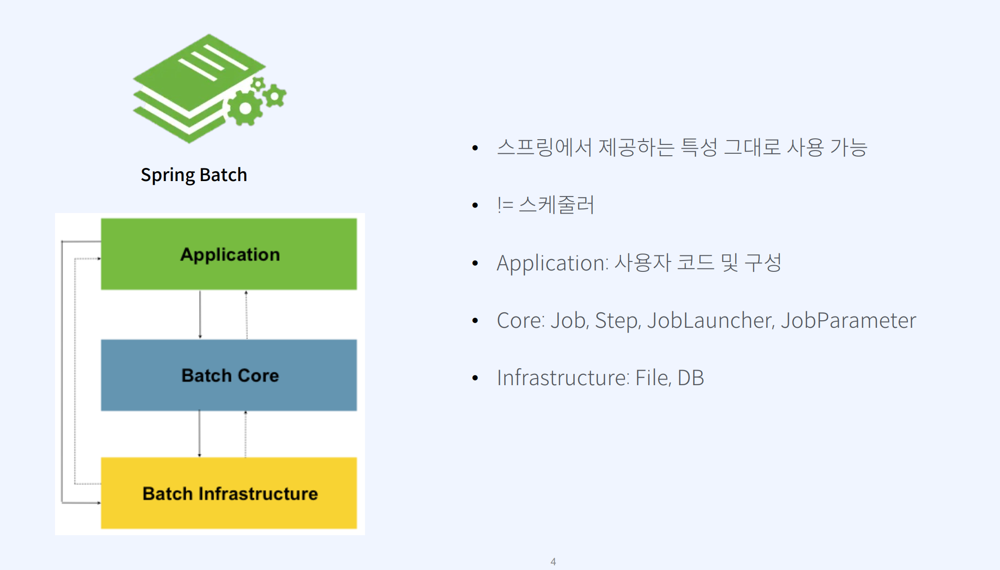


## 이용권 서비스 요구사항
## 이용권, 수업

• 사용자는 N개의 이용권을 가질 수 있다.
• 이용권은 횟수가 모두 소진되거나 이용기간이 지나면 만료된다.
• 이용권 만료 전 사용자에게 알림을 준다.
• 업체에서 원하는 시간을 설정하여 일괄로 사용자에게 이용권을 지급할 수 있다.
• 예약된 수업 10분 전 출석 안내 알람을 준다.
• 수업 종료 시간 시점 수업을 예약한 학생의 이용권 횟수를 일괄로 차감한다. (-1)


## 통계
• 사용자의 수업 예약, 출석, 이용권 횟수 등의 데이터로 유의미한 통계 데이터를 만든다.

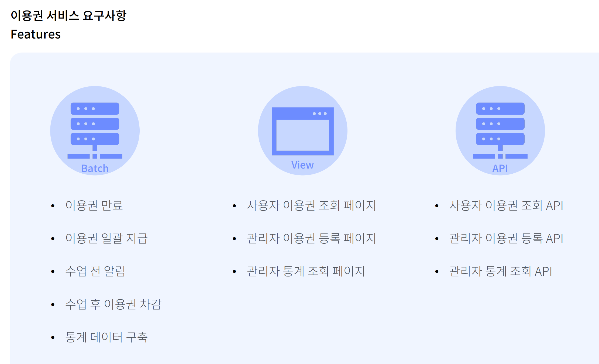


# 배치 구조 설계

## Step

* 배치 처리를 정의하고 제어하는 독립된 작업의 단위
*  간단히 정의한 하나의 작업 처리

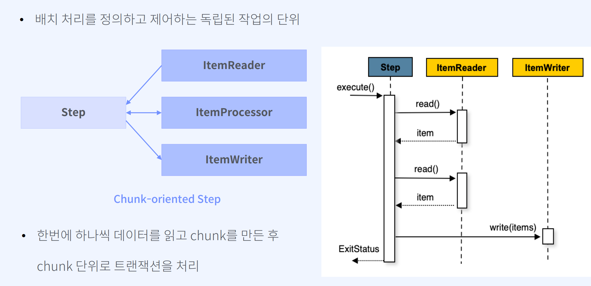

## Job

처음부터 끝까지 독립적으로 실행할 수 있으며 고유하고 순서가 지정된 여러 스텝들의 모음

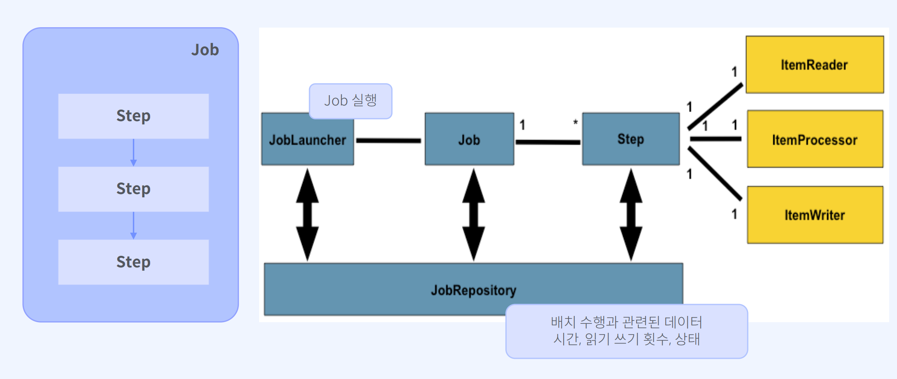

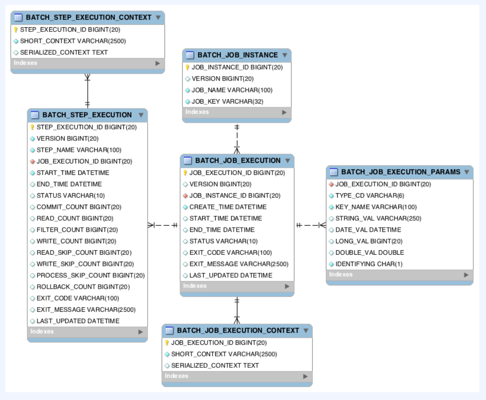


# 배치 구조 설계

## 이용권 만료


## 이용권 일괄 지급 JOB


## 예약 수업 전 알람
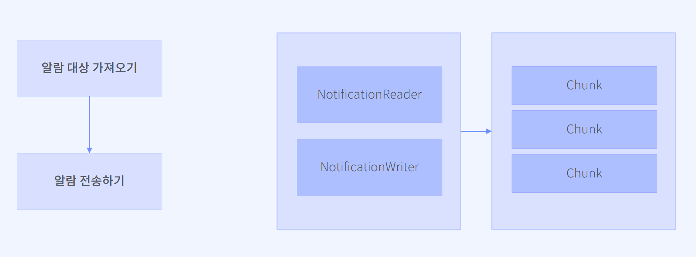

대량의 데이터 병렬처리 고려 

## 수업 종료 후 이용권 차감

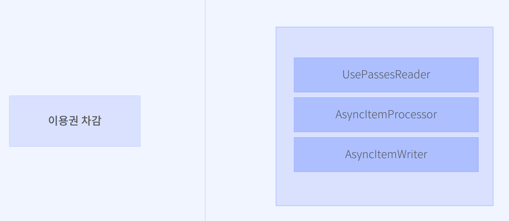


# ItemReader

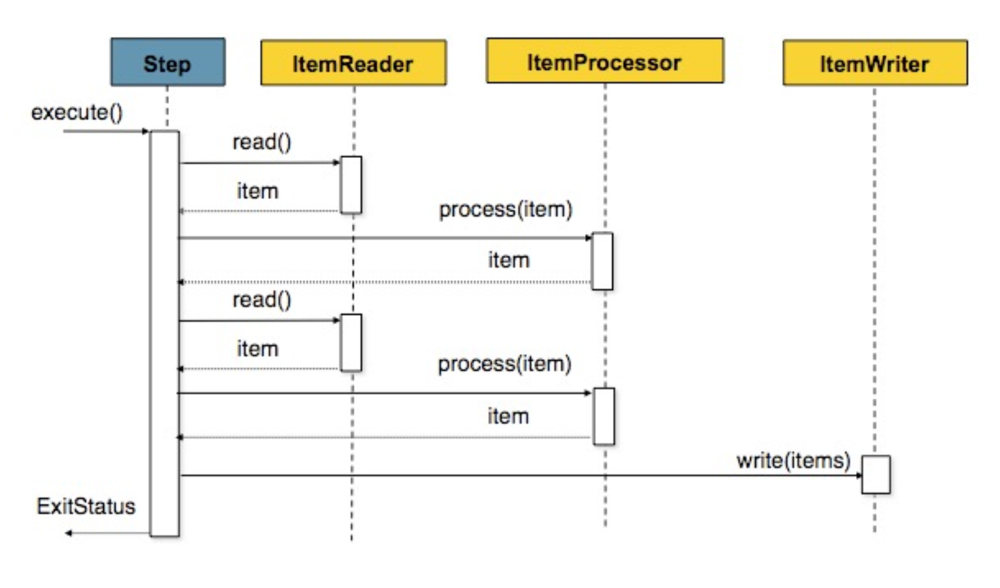

# Cursor Vs Paging

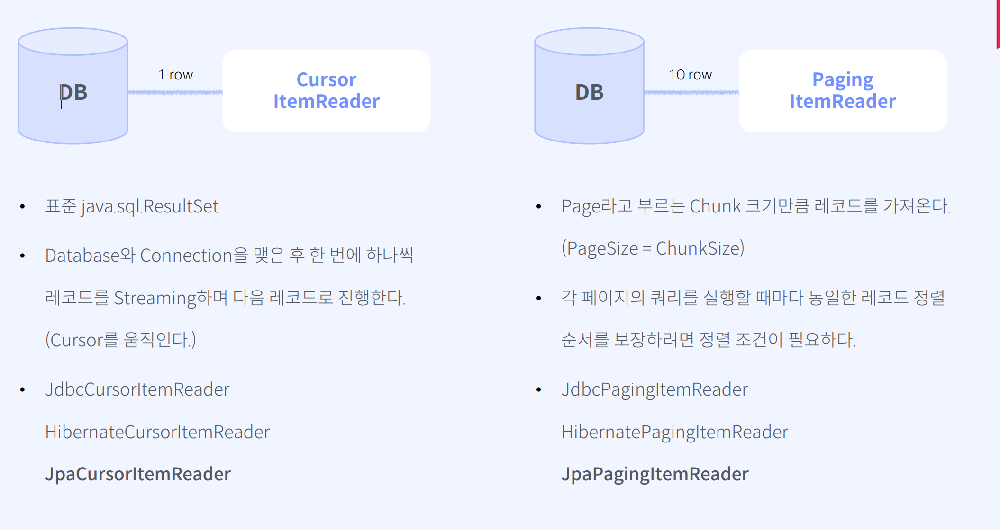

# Batch 이용권 일괄 지급 Job

```java

@Configuration
public class ExpirePassesJobConfig {

	private final int CHUNK_SIZE = 5;

	// @EnableBatchProcessing로 인해 Bean으로 제공된 JobBuilderFactory, StepBuilderFactory
	private final JobBuilderFactory jobBuilderFactory;
	private final StepBuilderFactory stepBuilderFactory;
	private final EntityManagerFactory entityManagerFactory;
	private final PackageRepository packageRepository;

	public Job expirePassesJob() {
		// step이 1개인 Job
		return jobBuilderFactory.get("expirePassesJob")
			.start(expirePassesStep())
			.build();
	}

	@Bean
	public Step expirePassesStep() {

		return this.stepBuilderFactory.get("expirePassesStep")
			.<PassEntity, PassEntity>chunk(CHUNK_SIZE) // 작개 쪼개서 씀. 원래는 적게 안한다.
			.reader(expirePassesItemReader())
			.processor(expirePassesItemProcessor())
			.writer(expirePassesItemWriter())
			.build();

	}

	/**
	 * JpaCursorItemReader: JpaPagingItemReader만 지원하다가 Spring 4.3에서 추가되었습니다.
	 * 페이징 기법보다 보다 높은 성능으로, 데이터 변경에 무관한 무결성 조회가 가능합니다.
	 */
	@Bean
	@StepScope
	public JpaCursorItemReader<PassEntity> expirePassesItemReader() {
		return new JpaCursorItemReaderBuilder<PassEntity>()
			.name("expirePassesItemReader")
			.entityManagerFactory(entityManagerFactory)
			// 상태(status)가 진행중이며, 종료일시(endedAt)이 현재 시점보다 과거일 경우 만료 대상이 됩니다.
			.queryString("select p from PassEntity p where p.status = :status and p.endedAt <= :endedAt")
			.parameterValues(Map.of("status", PassStatus.IN_PROGRESS, "endedAt", LocalDateTime.now()))
			.build();
	}

	@Bean
	public ItemProcessor<PassEntity, PassEntity> expirePassesItemProcessor() {
		return passEntity -> {
			passEntity.setStatus(PassStatus.EXPIRED);
			passEntity.setExpiredAt(LocalDateTime.now());
			return passEntity;
		};
	}

	/**
	 * JpaItemWriter: JPA의 영속성 관리를 위해 EntityManager를 필수로 설정해줘야 합니다.
	 */
	@Bean
	public JpaItemWriter<PassEntity> expirePassesItemWriter() {
		return new JpaItemWriterBuilder<PassEntity>()
			.entityManagerFactory(entityManagerFactory)
			.build();
	}

}

```


# Tasklet -> Repeat와 RepeatStatus

Spring Batch는 Step과 그 하위 Chunk의 반족 작업이며 Repeat 정책을 따른다

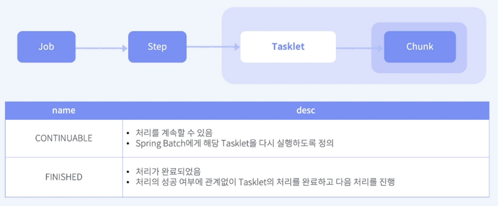


# 멀티스레드 기반 예약 수업 전 알람

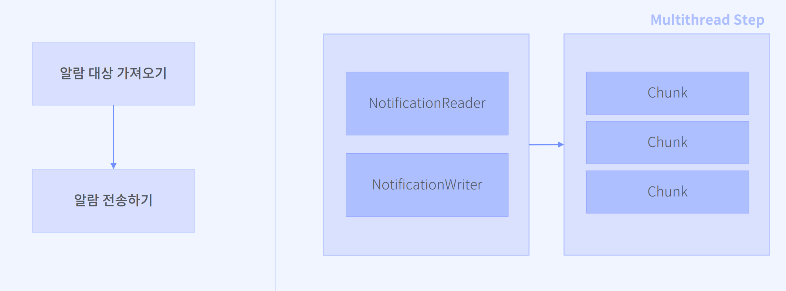