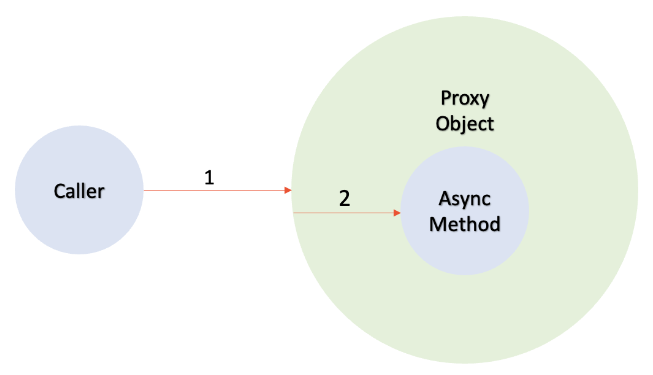

# 스프링 비동기 프로그래밍

[toc]

비동기 프로그래밍이란? 

Main Thread가 Task를 처리하는 게 아니라

Sub Thread에게 Task를 위임하는 행위라고 말할 수 있다.

- 그러면 여기서 Sub Thread는 어떻게 생성하고
- 어떻게 관리를 해야 할까?

Spring에서 비동기 프로그래밍을 하기 위해선 ThreadPool을 정의할 필요가 있다

왜?

* 비동기는 Main Thread가 아닌 Sub Thread에서 작업이 진행
  - Java에서는 ThreadPool을 생성하여 Async 작업을 처리

## ThreadPool 생성 옵션 

1. CorePoolSize
   * 허용 코어 스레드 타임아웃이 설정되지 않은 경우 유휴 상태인 경우에도 풀에 유지할 스레드 수

```
if ( Thread 수 < CorePoolSize )
	New Thread
	
if ( Thread 수 > CorePoolSize )
	Queue에 요청 추가
```

2. MaxPoolSize
   * 풀에 허용할 최대 스레드 수

```
if ( Oueue Full && Thread # < MaxPoolSize )
	New Thread 

if ( Queue Full && Thread ÷ > MaxPoolSize )
	요청 거절
```


2. WorkQueue
   * 작업이 실행되기 전에 대기하는 데 사용할 큐입니다. 이 큐는 실행 메서드에 의해 제출된 실행 가능한 작업만 보유
3. KeepAliveTime
   * 스레드 수가 코어보다 많은 경우 초과 유휴 스레드가 종료되기 전에 새 작업을 대기하는 최대 시간
   * 단위 - keepAliveTime 인수의 시간 단위
4. 핸들러 - 스레드 바운드 및 큐 용량에 도달하여 실행이 차단될 때 사용할 핸들러입니다.


### ThreadPoolExecutor - CorePoolsize 값을 너무 크게 설정할 경우 side Effect 고려해보기

`corePoolSize`는 스레드 풀이 시작할 때 유지하는 스레드의 최소 수를 나타낸다.

1. **메모리 부담**:
   - `corePoolSize` 값을 크게 설정하면 해당 수만큼의 스레드가 즉시 생성됩니다. 각 스레드는 자체 스택 메모리를 가지므로, 스레드 수가 증가하면 메모리 사용량도 증가합니다. 이로 인해 시스템의 메모리 부담이 커질 수 있습니다.
2. **초기 처리 지연**:
   - 많은 수의 스레드가 즉시 생성되면, 초기 스레드 시작에 필요한 시간으로 인해 작업의 시작이 지연될 수 있습니다.
3. **컨텍스트 스위칭 오버헤드**:
   - 스레드 수가 많아지면 CPU 스케줄러가 스레드 간의 컨텍스트 스위칭을 더 자주 수행해야 합니다. 이로 인해 성능이 저하되며, CPU 사용량이 불필요하게 증가할 수 있습니다.
4. **자원 경합**:
   - 너무 많은 스레드가 동시에 실행되면, 공유 자원(예: 데이터베이스 연결)에 대한 경합이 발생할 수 있습니다. 이로 인해 경쟁 조건, 데드락 등의 동시성 문제가 발생할 수 있습니다.
5. **시스템 한계 초과**:
   - 운영 체제나 하드웨어에는 동시에 실행할 수 있는 스레드의 최대 수에 제한이 있을 수 있습니다. `corePoolSize` 값을 이 제한을 초과하게 설정하면 시스템 에러나 예기치 않은 동작이 발생할 수 있습니다.
6. **비효율적인 리소스 사용**:
   - 실제로 필요하지 않은 많은 스레드를 유지하는 것은 리소스를 낭비하는 것이 될 수 있습니다. 대부분의 애플리케이션은 필요한 스레드 수를 정확하게 예측하고 그에 따라 `corePoolSize` 값을 설정하는 것이 좋습니다.

이러한 부작용을 피하기 위해 `corePoolSize` 값을 적절하게 설정하는 것이 중요합니다. 값을 설정할 때는 시스템의 메모리, CPU, 사용 가능한 스레드 수, 애플리케이션의 요구 사항 및 특성 등을 고려해야 합니다


`몇개가 적당할까?`

* https://docs.oracle.com/javase/7/docs/api/java/util/concurrent/ThreadPoolExecutor.html

`ThreadPoolExecutor`에서 다음 조건 중 하나라도 만족하면 이 예외가 발생합니다:

- `corePoolSize < 0`: `corePoolSize`는 스레드 풀이 시작할 때 유지하는 스레드의 최소 수입니다. 이 값이 0보다 작을 수 없습니다.
- `keepAliveTime < 0`: 비활성 상태의 스레드가 종료되기 전에 대기할 수 있는 시간입니다. 이 값은 0보다 작을 수 없습니다.
- `maximumPoolSize <= 0`: 스레드 풀에서 동시에 실행될 수 있는 스레드의 최대 수입니다. 이 값은 0보다 커야 합니다.
- `maximumPoolSize < corePoolSize`: 최대 스레드 수는 핵심 스레드 수보다 작을 수 없습니다. 즉, `corePoolSize`가 `maximumPoolSize`보다 크면 안 됩니다.


# Spring Async 환경 세팅

```java
@Configuration
@EnableAsync
public class AsyncConfig { }
```

```java
@Configuration
public class AppConfig {

    @Bean(name = "defaultTaskExecutor", destroyMethod = "shutdown") // 디폴트로 사용 
    public ThreadPoolTaskExecutor defaultTaskExecutor() {
        ThreadPoolTaskExecutor executor = new ThreadPoolTaskExecutor();
        executor.setCorePoolSize(200);
        executor.setMaxPoolSize(200);
        return executor;
    }

    @Bean(name = "messagingTaskExecutor", destroyMethod = "shutdown") // 메시지용으로 사용 
    public ThreadPoolTaskExecutor messagingTaskExecutor() {
        ThreadPoolTaskExecutor executor = new ThreadPoolTaskExecutor();
        executor.setCorePoolSize(200);
        executor.setMaxPoolSize(200);
        return executor;
    }
}

```

각 스레드 풀 비동기로 사용방법

```java
@Service
@RequiredArgsConstructor
public class EmailService {

    @Async("defaultTaskExecutor") // 스레드 풀 이름. default 사용 
    public void sendMail() {
        System.out.println("[sendMail] :: "
                           + Thread.currentThread().getName());
    }

    @Async("messagingTaskExecutor") // 커스텀 스레드 풀 사용 
    public void sendMailWithCustomThreadPool() {
        System.out.println("[sendMailWithCustomThreadPool] :: "
                           + Thread.currentThread().getName());
    }
}
```


# Async 동작 원리



## 주의사항

스프링 컨테이너에 등록되어있는 빈을 통해서 @Async가 붙은 메소드를 호출해야 한다.

new EmailService() 등으로 인스턴스를 직접 생성해서 호출하면 Async하게 동작하지 않는다. 


또한, 같은 클래스 내에서 Async 메소드를 호출하면 동작하지 않는다.

```java
@Service
@RequiredArgsConstructor
public class EmailService {

    public void 비동기아닌메소드() {
      비동기메소드(); // 동작 안함 
    }

    @Async
    public void 비동기메소드() {
        System.out.println("비동기");
    }
}
```

반드시 Bean 주입을 받아 프록시를 이용해야 한다. 해당 클래스는 프록시 기반 AOP를 지원해야한다. 