# 인프런 - 면접전에 알고가면 좋은 것들 - 자바 백엔드 개발자편

[toc]

# 웹서비스 구조와 운영체제 기술

URI vs URL

URI가 더 큰 개념, URL을 포함하고 있음 

- URL: URI 라고 불리는 더 일반화된 부류의 부분집합 (대부분은 스킴//서버위치/경로의 구조)
- URI: URL 과 URN 으로 구성된 종합적인 개념
- URN: 리소스가 어디에 존재하든 상관없이 이름만으로 리소스 식별이 가능


# WAS와 JVM

JVM은 유저모드 / 커널모드 / 하드웨어 중 유저모드에 위치해있다.

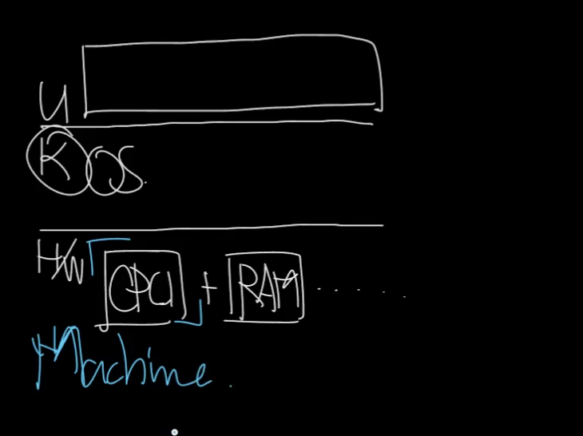

APM으로 항상 모니터링 해야한다

APM 툴

* 제니퍼 (유료)
* Scouter
* 핀포인트 

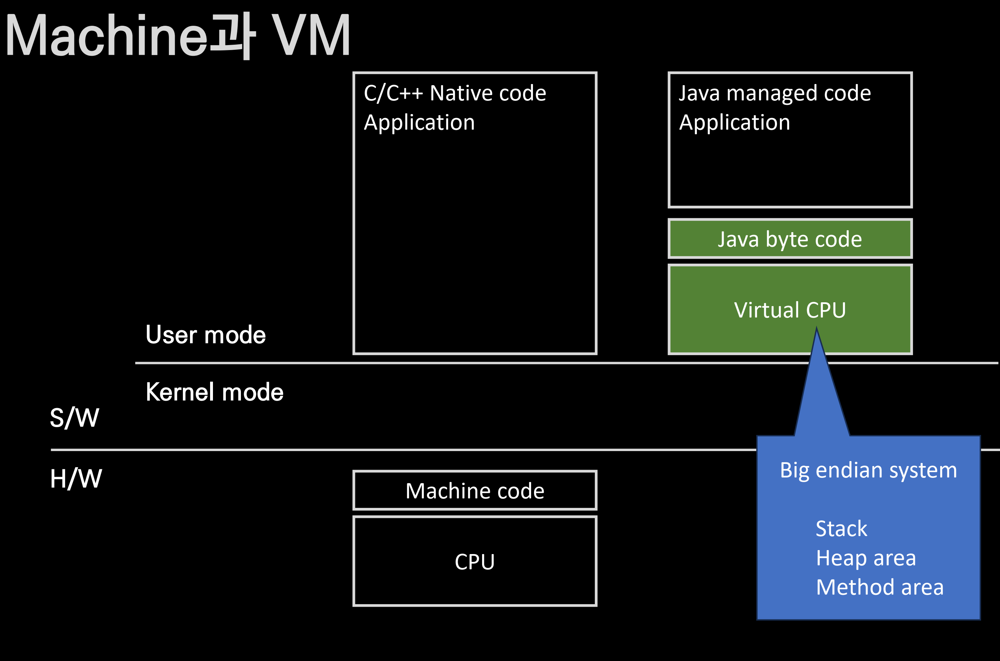

JVM은 빅엔디안이다.

**빅 엔디안?**

* 리틀 엔디안(Little Endian)과 빅 엔디안(Big Endian)은 컴퓨터 시스템에서 멀티바이트 데이터의 바이트 순서를 저장하는 두 가지 다른 방법
* 이 차이는 주로 데이터를 메모리에 저장하거나 네트워크를 통해 데이터를 전송할 때 중요하다.
* 빅 엔디안
  - **정의**: 빅 엔디안 방식에서는 가장 큰 바이트(높은 주소를 가진 바이트)가 메모리의 낮은 주소에 저장됩니다.
  - **예시**: 숫자 `0x12345678`를 저장할 때, `0x12`가 가장 낮은 주소에, `0x78`이 가장 높은 주소에 배치됩니다.
  - **사용처**: 일반적으로 네트워크 프로토콜에서 사용되며, "네트워크 바이트 순서"라고도 합니다.
  - **장점**: 사람이 숫자를 읽고 이해하기에 직관적입니다.
* 리틀 엔디안
  * **정의**: 리틀 엔디안 방식에서는 가장 작은 바이트(낮은 주소를 가진 바이트)가 메모리의 낮은 주소에 저장됩니다.
  * **예시**: 숫자 `0x12345678`를 저장할 때, `0x78`이 가장 낮은 주소에, `0x12`가 가장 높은 주소에 배치됩니다.
  * **사용처**: 많은 현대 컴퓨터 아키텍처에서 사용되며, 인텔 x86 및 x86-64 아키텍처가 대표적입니다.
  * **장점**: 산술 연산을 수행할 때 주소 계산이 더 간단할 수 있습니다.
* 빅엔디안 vs 리틀엔디안 차이점
  * **저장 순서**: 빅 엔디안은 가장 큰 바이트부터 시작하여 순차적으로 저장하는 반면, 리틀 엔디안은 가장 작은 바이트부터 시작합니다.
  * **호환성**: 서로 다른 엔디안 방식을 사용하는 시스템 간에 데이터를 전송할 때는 바이트 순서를 변환해야 할 수 있습니다.
  * **프로그래밍 시 고려사항**: 개발자는 다른 엔디안 방식을 사용할 수 있는 시스템 간에 데이터를 주고받을 때 이러한 차이점을 고려해야 합니다.
  * 예를들어 일부 국가에서는 날짜를 "일/월/년" 형식으로 표기하는 반면, 다른 국가에서는 "년/월/일" 형식을 사용하는 것과 비슷


JVM은 네트워크 바이트 오더(빅 엔디안)을 사용하여 CPU 아키텍쳐와 무관하게 플랫폼 독립성을 유지할 수 있다.

> 리틀 엔디안은 메모리의 첫 주소에 하위 데이터(데이터의 맨 오른쪽)부터 저장하고, 빅 엔디안은 메모리의 첫 주소에 상위 데이터(데이터의 맨 왼쪽)부터 저장한다.
> int a = 0x12345678
> 리틀엔디안 = 0x78 0x56 0x34 0x12
> 빅엔디안 = 0x12 0x34 0x56 0x78

* https://velog.io/@dldhk97/JVM

## 비동기 입/출력

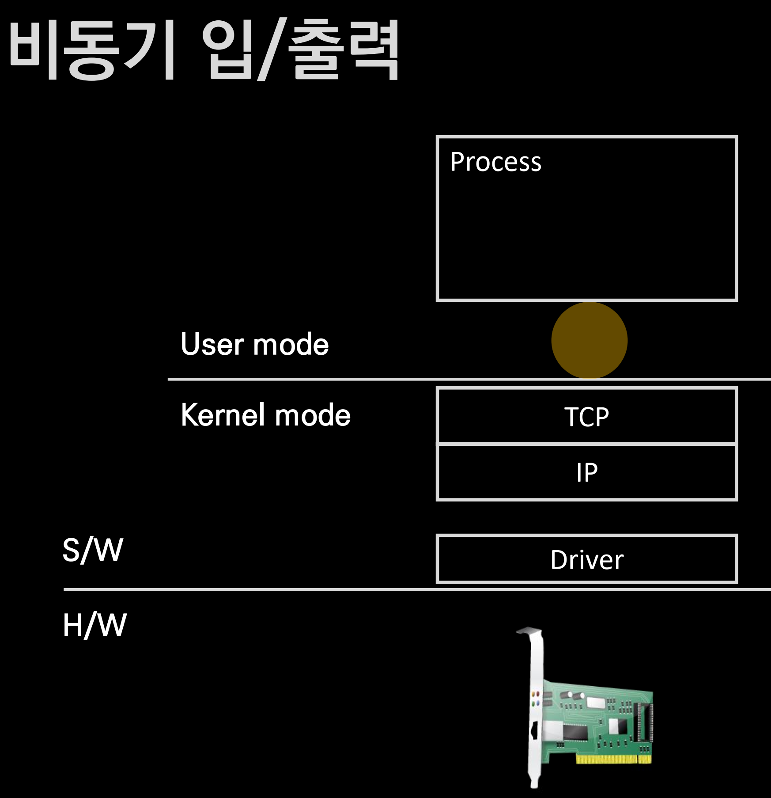

처리 주체에 넘겨서 어플리케이션이 블록되는걸 방지하는것이 비동기다.

## 브라우저에 URL을 입력하면 일어나는일

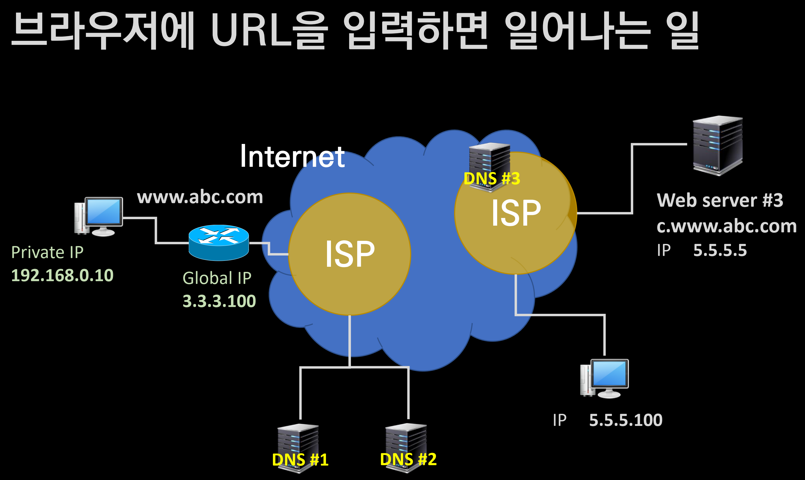

1. URL 입력시
   * 1. 로컬 컴퓨터에서 hosts 파일을 뒤져서 도메인 이름이랑 매핑되어있는 IP주소를 찾는다 
   * 2. 그래도없으면 DNS 캐시(램, 메모리)를 참조해서 도메인으로부터 IP를 얻어낸다 
     3. 그래도 없으면 DNS 서버에 질의하여 받아온다(이때 DNS 캐시가 업데이트 된다)

2. TCIP/IP 기반 프로토콜이면(HTTP) 3웨이 핸드셰이킹을한다 ACK -> SYN ->ACK (피기백을 한다 마지막 ACK엔)
3. 서버는HTTP를 해석한다
4. 서버는 해석하여 응답해준다
5. 응답을 받으면 리소스를 디스크에 캐시한다. 


DNS는 ROOT DNS가있고, 병렬화되어서 서로 메시(mesh)형태로 묶여있다.


# 웹서버와 HTTP

[HTTP 개요]
https://developer.mozilla.org/ko/docs/Web/HTTP/Overview
[HTTP의 진화]
https://developer.mozilla.org/ko/docs/Web/HTTP/Basics_of_HTTP/Evolution_of_HTTP
[HTTP vs HTTPS 성능차이 체감 사이트 ]
http://www.httpvshttps.com/
[What is HTTP/2 and how is it different from HTTP/1?]
https://www.wallarm.com/what/what-is-http-2-and-how-is-it-different-from-http-1
[Introduction to HTTP2]
https://web.dev/performance-http2/
[HTTP/2 vs HTTP/3: A comparison]
https://ably.com/topic/http-2-vs-http-3

## HTTP 1.1 vs HTTP 2

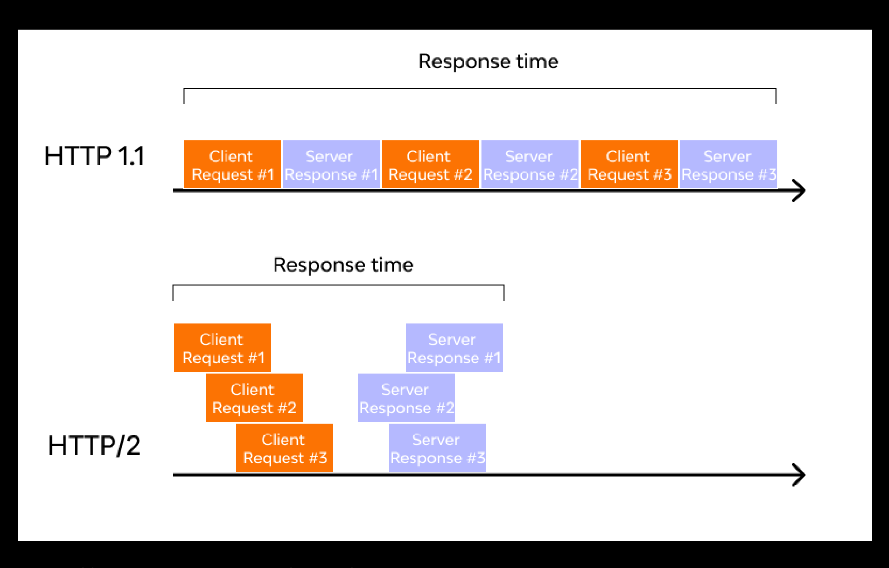

HTTP 1.1은 여러 요청이 있으면 순차적이다.

* 요청 1을 보내고 요청1에대한 응답이 와야 요청2를 보낼수 있따.
* 각 HTTP 요청/응답 쌍은 새 TCP 연결을 필요로 합니다. 지속 연결(persistent connections)을 지원하긴 하지만, 한 번에 하나의 요청/응답만 처리할 수 있다.
* HTTP/1.1은 파이프라이닝을 지원하여 여러 요청을 연속적으로 보낼 수 있지만, 응답은 요청 순서대로 받아야 하며, 이는 헤드 오브 라인 블로킹 문제를 발생시킨다.
* **헤더 압축**을 지원하지 않아서 모든 요청과 응답마다 헤더 정보가 전체적으로 중복 전송된다

HTTP2는

* 단일 TCP 연결을 통해 여러 개의 스트림을 동시에 전송할 수 있어 여러 요청과 응답이 동시에, 비동기적으로 처리될 수 있다.이를 멀티플렉싱이라고 한다.
* **헤드 오브 라인 블로킹**: HTTP/2는 멀티플렉싱을 통해 요청 쌍이 끝나야 다음 요청을 보낼 수 있는 문제를 완화하여 여러 요청이 서로 기다릴 필요 없이 독립적으로 처리될 수 있다.
* 또한 스트림 우선순위를 부여하여 중요한 파일이 먼저 응답되도록 해서 효율적으로 동작할 수 있다. 
* 서버가 클라이언트의 요청을 기다리지 않고 예측 가능한 리소스를 미리 클라이언트에게 보낼 수 있다.
* **더 압축**: HPACK 압축 방식을 사용하여 헤더 데이터를 효율적으로 압축하고, 중복 전송을 줄인다.

[HTTP1.1 vs HTTP 2.0  성능차이 체감 사이트(2.0은 HTTPS 위에서 동작해야 하기 때문에 이렇게 되어있따. ) ]

* HTTP/2 표준 자체는 TLS를 요구하지 않지만, 브라우저는 보안상의 이유를 TLS를 요구한다. 

http://www.httpvshttps.com/

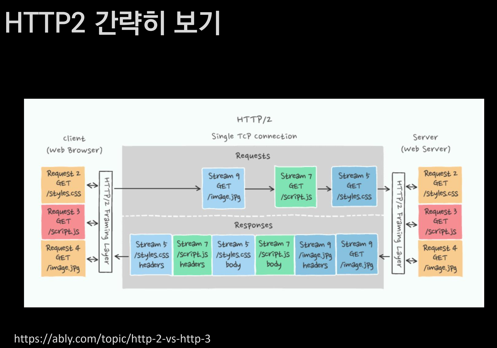

* https://ably.com/topic/http-2-vs-http-3

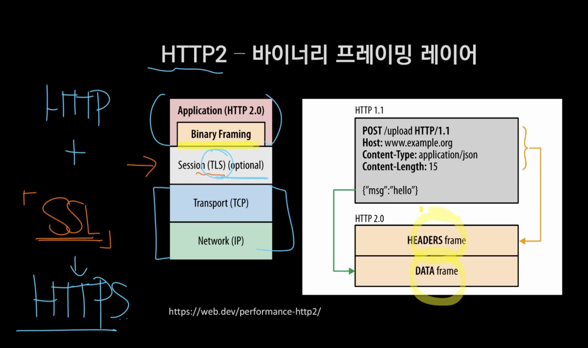

HTTP/1.1과 HTTP/2의 메시지 포맷은 근본적으로 다르다. 

HTTP/1.1은 텍스트 기반의 프로토콜로, HTTP 메시지는 사람이 읽을 수 있는 텍스트로 구성된다. 

반면, HTTP/2는 이진 프로토콜로, 효율성과 성능을 높이기 위해 이진 형식을 사용한다. (사람이 읽기 어렵다)

> 때문에 바디부분의 데이터를 아스키 변환할 필요도 없이 바이너리 데이터를 프레임 단위로 쪼개서 헤더와 함께 보낸다.
>
> 즉 HTTP/2는 이진 포맷을 사용하여 메시지를 전송하는것이다 이는 기계가 읽기에 최적화되어 있어 텍스트보다 처리가 빠르다.
>
> 수신한쪽에서는 프레임 헤더를 보고 데이터 프레임을 조립해서 하나의 데이터를 완성한다.
>
> 때문에 동시다발적으로 전송이 가능한것이다. 

### HTTP/1.1 메시지 예시:

HTTP/1.1 요청 메시지는 다음과 같은 형식을 가질 수 있습니다:

```http
GET /index.html HTTP/1.1
Host: www.example.com
User-Agent: Mozilla/5.0 (Windows NT 10.0; Win64; x64)
Accept: text/html,application/xhtml+xml,application/xml;q=0.9,*/*;q=0.8
Accept-Language: en-US,en;q=0.5
Accept-Encoding: gzip, deflate, br
Connection: keep-alive
```

### HTTP/2 메시지 예시:

HTTP/2에서는 메시지가 이진 프레임으로 구성되어 있다. 

이 프레임은 다양한 유형이 있으며, 데이터 스트림을 제어하는 데 사용된다. 

HTTP/2 메시지의 이진 데이터로 구성되어 있기 때문에 직접적으로 표현하는 것은 어렵다

위 그림처럼, 혹은 아래처럼 프레임 구조로 되어있다.

```http
+-----------------------------------------------+
| Length (24 bits)                              |
+---------------+---------------+---------------+
| Type (8 bits) | Flags (8 bits)                |
+-+-------------+-------------------------------+
|R| Stream Identifier (31 bits)                 |
+=+=============================================+
| Frame Payload (variable)                      |
+-----------------------------------------------+
```

- **Length**: 페이로드의 길이를 나타냅니다.
- **Type**: 프레임의 유형을 나타냅니다 (예: HEADERS, DATA, SETTINGS 등).
- **Flags**: 프레임에 대한 추가적인 통제 정보를 제공합니다.
- **R**: 예약 필드로, 현재 사용되지 않으며 0으로 설정되어야 합니다.
- **Stream Identifier**: 프레임이 속하는 스트림의 식별자입니다.
- **Frame Payload**: 실제 데이터를 포함합니다. (헤더 프레임과 데이타 프레임이 여기 포함되어 있음 )

예를 들어, `HEADERS` 프레임은 HTTP 헤더를 전송하는 데 사용되며, `DATA` 프레임은 실제 바디 데이터를 전송하는 데 사용된다.

#### HEADERS 프레임 (HTTP 헤더 전송에 사용):

```
+---------------+
| Length        | 
+---------------+
| Type=HEADERS  | 
+---------------+
| Flags         | 
+---------------+
| Stream ID     | 
+---------------+
| Header Block Fragment | <- HPACK 압축된 HTTP 헤더
+---------------+
```

#### DATA 프레임 (HTTP 바디 데이터 전송에 사용):

```
+---------------+
| Length        | 
+---------------+
| Type=DATA     | 
+---------------+
| Flags         | 
+---------------+
| Stream ID     | 
+---------------+
| Application Data | <- 실제 바디 데이터
+---------------+
```


## HTTP 버전별 비교

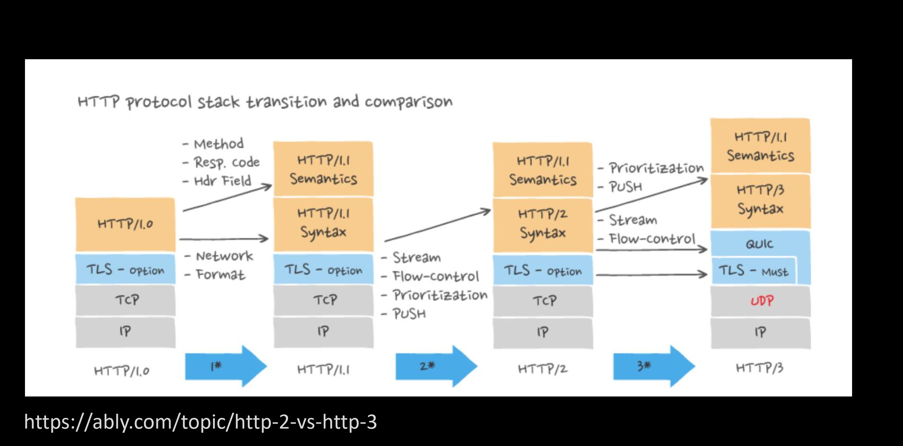


## IPS와 INLINE 구조 - 계층별 장애 대응

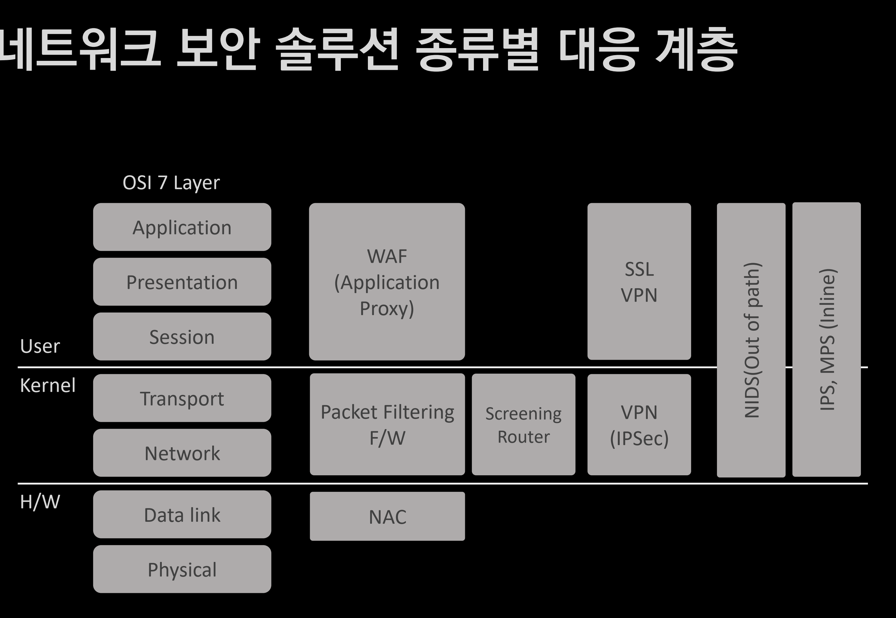

인라인(In-line) 구조와 아웃 오브 패스(Out-of-Path) 구조는 특히 네트워크 장비나 보안 시스템을 배치하는 방식에서 사용되는 용어입니다. 이 두 구조는 네트워크 트래픽이 장비를 통과하는 방식과 관련이 있습니다.

인라인 구조는 트래픽의 실시간 처리와 보안에 중점을 두는 반면, 아웃 오브 패스 구조는 네트워크의 유연성과 안정성을 향상시키는 데 더 적합할 수 있습니다. 사용 사례와 네트워크의 요구 사항에 따라 적절한 구조를 선택해야 합니다.

## INLINE구조

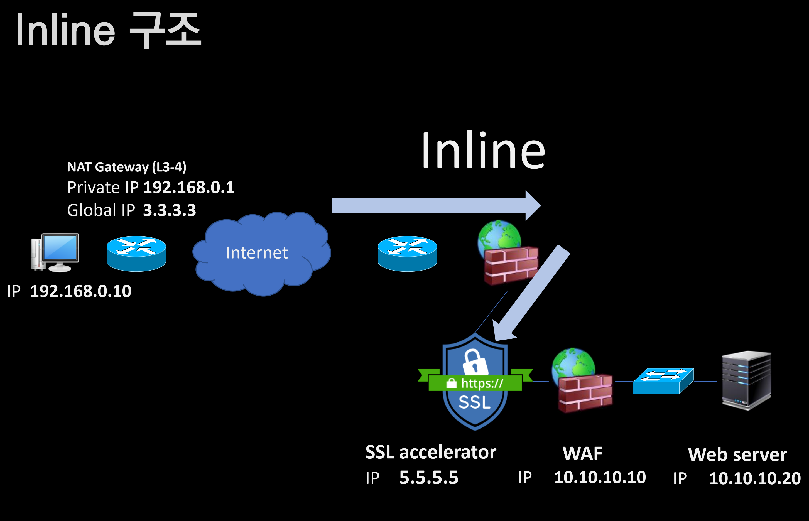

* 내부 PC는 사설 IP, 공유기를 글로벌 IP 사용

인라인 장치란, 라우터같은 보안장치가 있을 때 패킷단위로 지나가는걸 걸러주는 역할을 한다.

눈에는 보이지 않게 존재한다.

### 인라인(In-line) 구조

- **정의**: 인라인 구조에서는 네트워크 장비가 직접적인 데이터 패스(data path) 상에 위치합니다. 모든 네트워크 트래픽은 해당 장비를 통과해야 하며, 장비는 트래픽을 검사하고, 필터링하며, 수정할 수 있습니다.
- **예시**: 방화벽, 침입 방지 시스템(IPS), 로드 밸런서와 같은 장비가 인라인 모드로 구성될 수 있습니다. 이러한 장비는 네트워크의 중요 지점에 배치되어 모든 트래픽을 처리합니다.
- **장점**: 트래픽을 실시간으로 처리할 수 있으며, 보안 위협이나 네트워크 문제를 즉각적으로 탐지하고 대응할 수 있습니다.
- **단점**: 장비에 문제가 발생하면 전체 네트워크 트래픽에 영향을 줄 수 있으며, 네트워크 성능에 병목 현상을 일으킬 수 있습니다.

##  Out Of Path구조

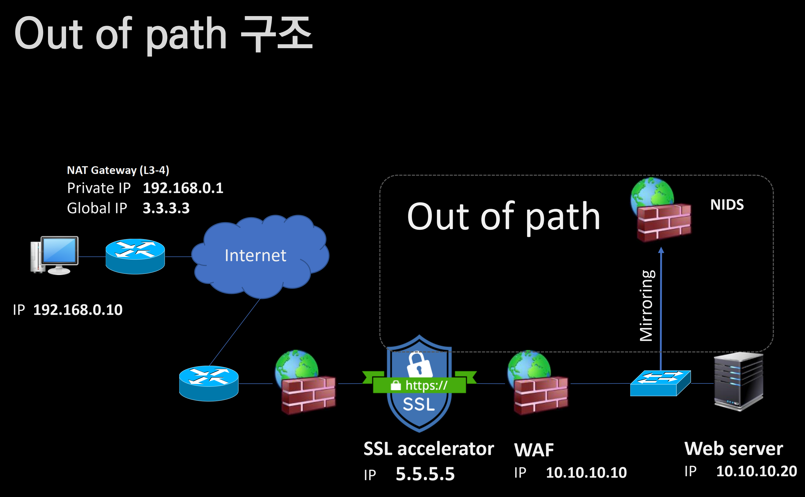

### 아웃 오브 패스(Out-of-Path) 구조

- **정의**: 아웃 오브 패스 구조에서는 네트워크 장비가 주 데이터 패스 밖에 위치합니다. 트래픽은 기본적으로 장비를 거치지 않고 흐르며, 특정 조건이나 정책에 따라 선택적으로 장비로 리디렉션됩니다.
- **예시**: 네트워크 모니터링 시스템, 침입 탐지 시스템(IDS), 데이터 복제를 위한 네트워크 탭(TAP)이 아웃 오브 패스 구조로 구성될 수 있습니다.
- **장점**: 주 네트워크에 문제가 발생하더라도 네트워크 트래픽이 계속 흐를 수 있으며, 장비의 성능 문제가 네트워크 전체에 미치는 영향을 줄일 수 있습니다.
- **단점**: 실시간 트래픽 처리와 반응에 제한이 있을 수 있으며, 복잡한 네트워크 구성이 필요할 수 있습니다.


## 왜 INLINE과 OUTOFPATH를 알아야 하는가?

서버 개발을 할떄 SSL 을 사용한다

SSL 인증서를 설치하는 위치를 고려해야 한다.

실제로 인프라를 구축할때에는 웹서버에다가 설치할수도 있지만 그렇지 않을수도 있다.

인라인 구조이면, Instrusion prevetion 시스템 (IPS, 침입방지시스템)에다가 설치해야 될수도 있다.

구조와 구성을 놓고 보면, 외부에 노출되는 구조면 인증서가 IPS에다가 설치해야할수도 있다.


# SSL은 어디에 설치되나?

SSL 인증서를 검증하는 방법은 인증서를 발급한 CA의 인증서에 포함된 Public key를 이용해 SSL 인증서 Hash 결과를
복호화 하면 된다.

CA(Certification Authority, 인증기관) : PCA의하위 기관으로 인증서 발급과 취소 등의 실질적인업무를 하는 기관이다. 

yessign(금융결제원), NCA(한국 전산원) 등이 이에 속하며, 상호 간 신뢰한다

* PCA(Policy Certification Authorities, 정책인증기관) : RootCA를 발급하고 기본 정책을 수립하는 기관으로, 우리나라의
  KISA(Korea Information Security Agency,한국정보보호진흥원)가 여기에 해당한다. 
* RootCA는 모든 인증서의 기초가 되는 인증서를 보유하고 있으며, 인증서에 포함된 공개키에 대응되는 개인키로 생성한 자체 서명 인증서를 사용한다


PKI가 비대칭 키(public, private 키 한 쌍)중 public key다

public key로 암호화하면 private key로 복호화하고 반대도 있다.


###  PKI (Public Key Infrastructure)

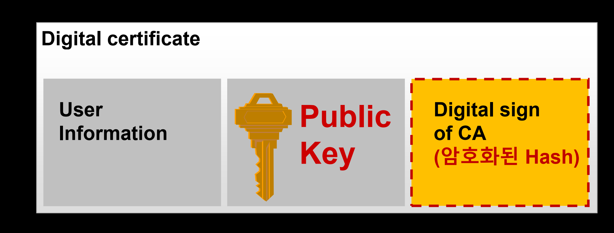

CA의 Private key로 Hash결과가 암호화 되어 있으며 검증과정에서는 PC에 사전 배포된 CA Public key(기관 인증서
에 포함)로 암호를 풀어 검증할 수 있다.

클라이언트와 서버랑 통신할 때, 서버의 인증서를 클라이언트가 받고

클라이언트는 데이터를 보낼 때 클라이언트의 세션 키로 암호화를 한다. 

즉 SSL 인증서는 public key이며 ca로부터 발급받는다. (웹서버, ISP, WAF, load balacner, proxyserver 어디에도 설치될 수 있다)


# WAS와 JVM

[CORS]
https://developer.mozilla.org/ko/docs/Web/HTTP/CORS
[시큐어코딩가이드]
https://www.mois.go.kr/frt/bbs/type001/commonSelectBoardArticle.do%3Bjsessionid=fr7QaTyG2gK5o02XJn
YETp3havIQ1MGLKMYdWaaEe5me9IOk932SIy2BbP1AM08Z.mopwas54_servlet_engine1?bbsId=BBSMSTR_00
0000000012&nttId=42152
http://hoonmaro.tistory.com/19 (훈마로의 보물창고)
https://www.freecodecamp.org/news/jvm-tutorial-java-virtual-machine-architecture-explained-for-beginners/
https://www.hackerearth.com/practice/notes/runtime-data-areas-of-java/
https://www.programmersought.com/article/4905216600/

## JVM 구성요소

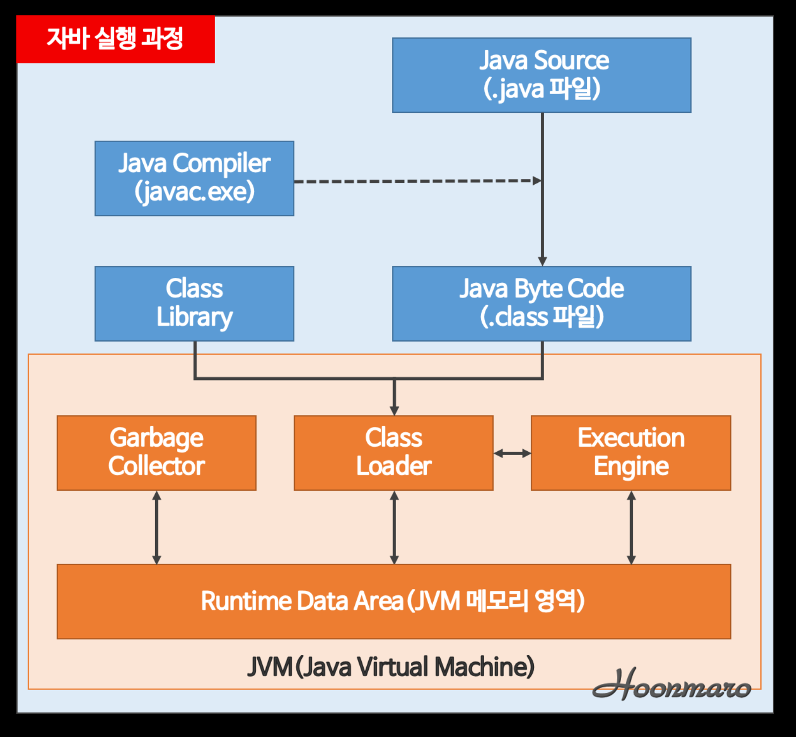

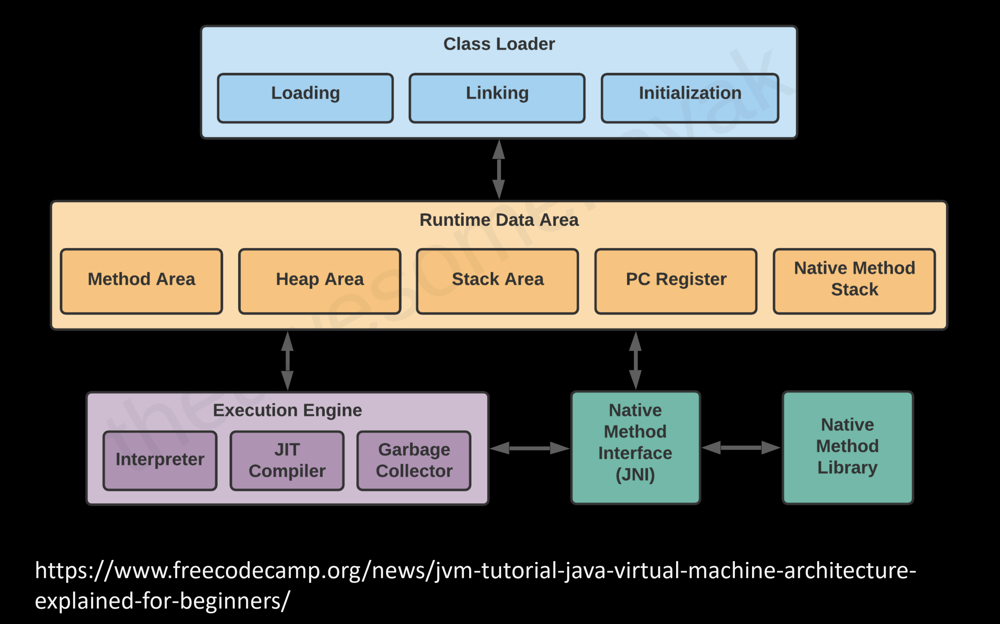

https://www.freecodecamp.org/news/jvm-tutorial-java-virtual-machine-architectureexplained-for-beginners/

## Class Loader

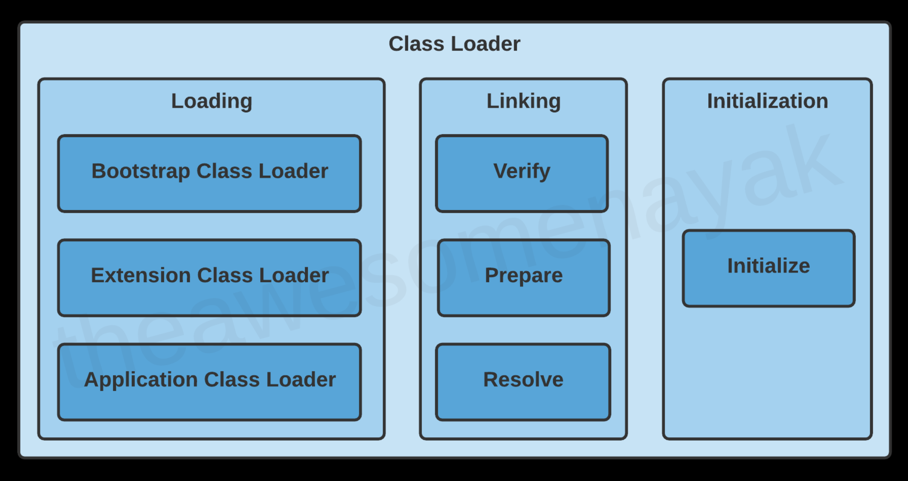

* .java 파일을 컴파일해서 얻는 .class을 메모리 로드
* 로드할 클래스가 여럿이면 Main() 메서드를 포함하는 클래스를 우선 로드
* 로드, 링크, 초기화 단계를 거침

1. 부트스트랩 클래스 로더
   * java.lang, java.net, java.util, java.io같은 표준 Java 패키지 로드
   * rt.jar 파일에 들어있는 핵심 라이브러리

2. 확장 클래스 로더
* $JAVA_HOME/jre/lib/ext
* 확장 라이브러리 클래스 로드

3. (응용 프로그램) 클래스 로더
* (-classpath, -cp) 클래스 경로에 있는 클래스 로드
* 일반적으로 개발자가 작성한 코드를 포함하는 클래스
* 로더가 클래스 이름을 찾지 못할 경우
  NoClassDefFoundError,
  ClassNotFoundExecption 에러 발생

### 클래스 링크

* 클래스 로드 후 링크 절차를 수행하며 클래스간 의존관계를 분석하고 함께 링크
* 확인: .class 파일자체에 대한 구조 정합성 검증 (실패 시 VerifyException 에러 발생)
* 준비: 정적 필드에 메모리를 할당하고 기본 값으로 초기화. (생성자 호출 전이며 일단 0 초기화)

### JVM 클래스 초기화

* 클래스 생성자 호출
* 정적 필드에 0이 아닌 초깃값을 기술할 경우 실제 값으로 초기화
* 멀티스레드 환경을 고려하지 않을 경우 클래스 초기화 중 오류발생 가능


## JVM Runtime data area

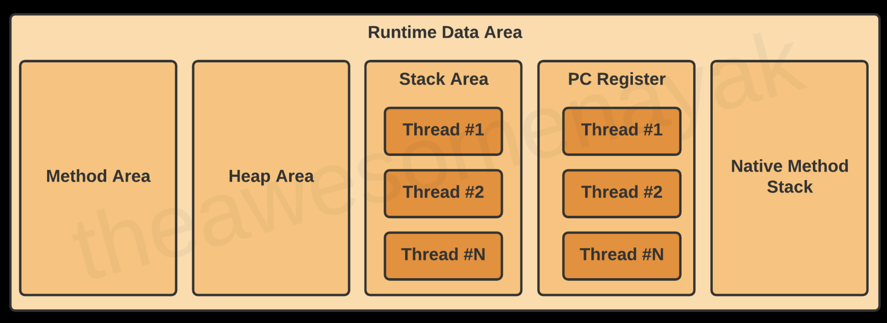

Method area

* 상수 풀
* 필드
* 메서드 코드 등이 저장되는 영역

Heap area

* 클래스 인스턴스들이 저장되는 런타임데이터 영역으로 GC가 관리
* new 연산으로 생성된 모든 클래스 인스턴스가 저장되는 영역
* 멀티스레드 환경에서 Heap 영역은 모든 스레드가 공유 (동기화 필수)

Stack area

* 각 스레드마다 별도의 스택을 가짐
* 메서드 호출 시 스택 프레임이 증가하며 각 반환 시 프레임 자동 소멸
* 지역변수, 피연산자, 스택 프레임 데이터 등 세 가지 요소로 구성
* 지역변수
  * 지역변수들을 배열 형식으로 저장관리
  * 바이트 코드 수준에서 각 지역변수에 대한 접근은 배열의 인덱스로 대체
  * 배열의 최대 크기는 컴파일 타임에 결정 (C/C++와 비슷)

* 피연산자와 프레임
  * 스택기반 머신 형태로 작동하도록 구성
  * 연산의 중간결과도 스택에 저장
  * 스택의 최대 크기는 컴파일 타임에 결정
  * 메서드에 대한 모든 심볼정보 및 예외처리 관련 catch 블록 정보 등은 프레임 데이터 영역 사용

PC(Program Counter) register

* 일반 CPU(EIP register)처럼 Program Counter를 가지며 같은 역할 수행
* 스레드 마다 별도 문맥을 가질 수 있도록 개별 PC register를 가짐

Native method 스택

* C/C++같은 Native 언어로 개발된 메서드를 지원하기 위한 스택
* 스레드 마다 별도로 제공
* JNI(Java Native Interface)

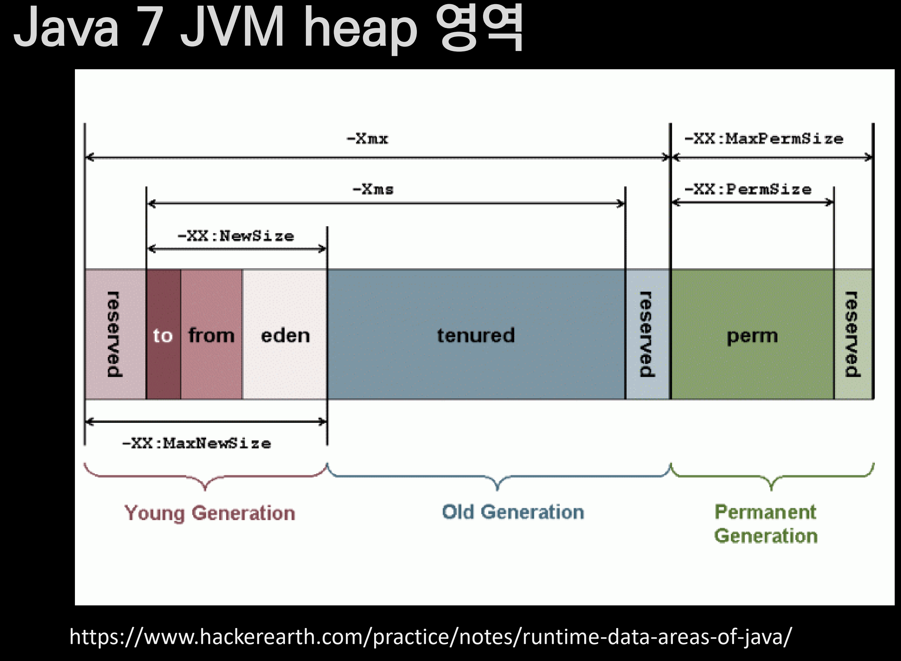

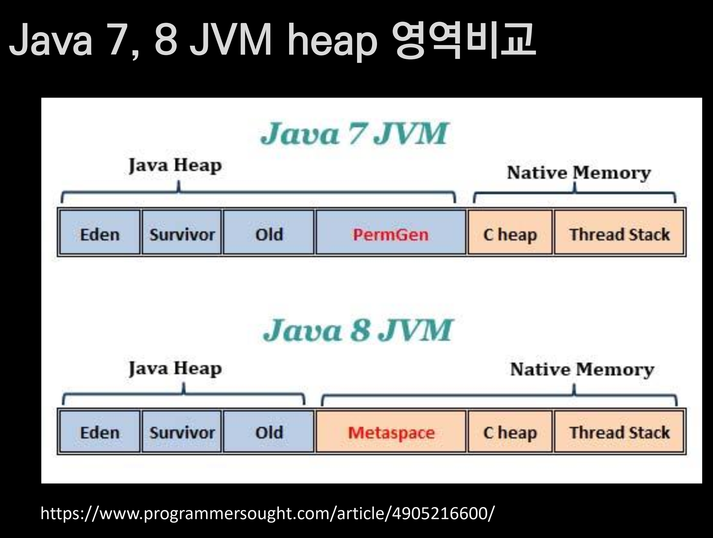


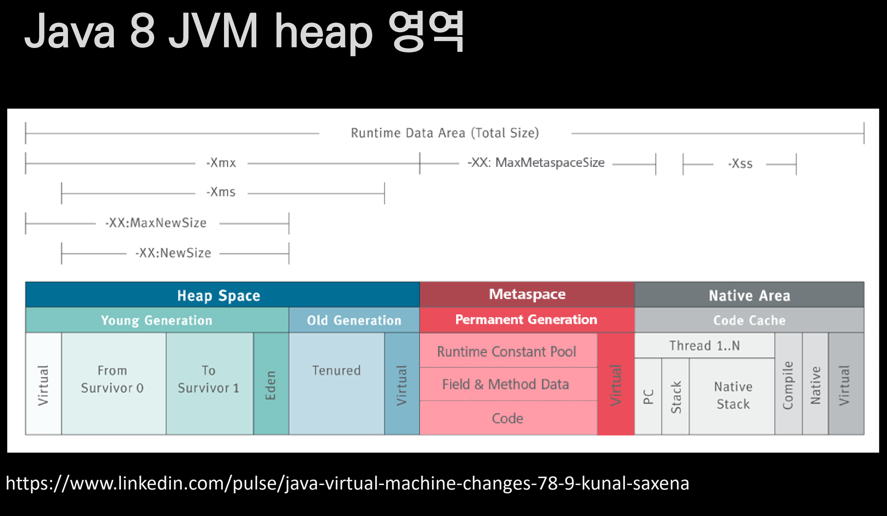

JVM heap 영역

* Metaspace 영역(Java 8)
* 로드되는 클래스, 메소드 등에 관한 메타정보 저장 (자동확장 가능)
* Java heap이 아닌 Native 메모리 영역사용
* 리플렉션 클래스 로드 시 사용 (Spring)

Permanent generation (Java 7)

* 로드되는 클래스, 메소드 등에 관한 메타 정보 저장 (고정 크기)
* 리플렉션 클래스 로드 시 사용 (Spring)

New (Young generation)

* 새로 생성한 개체가 사용하는 영역
* Minor GC 대상 영역
* Eden, From, To 요소로 구성

Eden

* 객체 생성 직후 저장되는 영역
*  Minor GC 발생 시 Survivor 영역으로 이동
*  Copy & Scavenge 알고리즘

Survivor 0, 1

*  Minor GC 발생 시 Eden, S0에서 살아남은 객체는 S1로 이동
* S1에서 살아남은 객체는 Old 영역으로 이동
*  age bit 사용 (참조계수)

Old (Old generation)

* Young generation 영역에서 소멸하지 않고 남은 개체들이 사용하는 영역

* Full GC 발생 시 개체 회수
* Mark & Compact 알고리즘

### JVM Garbage collector

Heap 영역에서 사용되지 않는 객체(메모리)를 식별하고 회수하는 자동화된 메모리 관리 체계

* Mark & Sweep + Compact
  * Mark: 사용되지 않는 개체 식별
  * Sweep: 식별한 개체 제거
  * 필요 시 Compact 실시

Heap 영역에서 참조되지 않는 개체를 수집 및 제거해 메모리 회수

* Minor/Major(Full) GC
* GC수행 시 프로그램 일시 정지
  * stop-the-world

GC 속도

* Minor GC가 보통 1초 이내 완료
* Full GC는 수 초 이상 진행되기도 하며 이 지연 때문에 DB 연결이 끊기는 등 운영문제가 발생할 수 있음

### 초기 GC: Serial Collector

- **Minor GC**: Young Generation에서 사용되며, 객체들이 처음 할당될 때 사용하는 메모리 영역을 정리합니다.
- **Full GC**: 전체 힙을 정리합니다. Serial Collector는 단일 스레드로 작동하며, 작은 힙 사이즈와 단일 처리기 시스템에 적합합니다.

### Parallel Collector (Throughput Collector)

- **Minor GC**: Parallel Garbage Collector는 Young Generation에서 병렬로 Minor GC를 수행합니다.
- **Full GC**: Old Generation도 병렬로 처리하며, 전체 힙을 정리합니다. 처리량(throughput)을 최대화하는 데 초점을 맞추며, 멀티 프로세서와 대규모 메모리를 가진 시스템에 적합합니다.

### Concurrent Mark Sweep (CMS) Collector

- **Minor GC**: Parallel Collector와 유사하게 작동합니다.
- **Full GC**: CMS는 Old Generation에서 동시성(concurrency)을 유지하면서, 애플리케이션의 중단 시간(stop-the-world events)을 줄이려고 합니다. CMS는 낮은 응답 시간이 중요한 애플리케이션에 적합합니다.

### Garbage-First (G1) Collector

- **Minor GC**: Young Generation에 대해 병렬 수집을 수행하면서도, 힙을 여러 영역으로 나누어 관리합니다.
- **Full GC**: G1 Collector는 전체 힙을 정리하는 Full GC를 가능한 피하려고 하지만, 필요한 경우 영역을 기반으로 GC를 수행합니다. G1은 대규모 힙과 긴 가비지 컬렉션 지연 시간을 줄이는 것을 목표로 합니다.

### Z Garbage Collector (ZGC)

- **Minor GC**: ZGC는 Young Generation과 Old Generation을 구분하지 않고, 힙을 동적으로 관리합니다.
- **Full GC**: 전통적인 의미의 Full GC가 없으며, ZGC는 메모리 회수를 거의 동시에 수행하도록 설계되어 있어 애플리케이션의 중단 시간을 최소화합니다. ZGC는 낮은 지연 시간과 확장성을 가진 시스템에 적합합니다.

#### GC에서 살아남는 객체를 선정하는 방법

GC는 객체 참조의 유효(Reachable)함과 그렇지 않음(Unreachable)을 근거로 대상 식별

**GC Roots (Stack 데이터) **

 GC Roots는 가비지 컬렉터가 유효한 객체를 식별하고, 그렇지 않은 객체들을 회수하는 출발점

GC Roots는 어떤 객체도 그들을 참조하지 않는 상황에서도 가비지 컬렉터에 의해 절대 회수되지 않는 객체의 집합

> GC Roots 개념은 메모리 누수를 진단할 때 특히 중요합니다. 객체가 예상치 않게 GC Roots에 의해 참조되고 있다면, 이 객체는 가비지 컬렉터에 의해 회수되지 않으므로, 불필요하게 메모리를 차지
>
> GC 과정에서 가비지 컬렉터는 이러한 GC Roots로부터 출발하여 객체 그래프를 탐색합니다. 도달 가능한(reachable) 객체, 즉 GC Roots로부터 어떤 경로를 통해서라도 참조될 수 있는 객체들은 유지되어야 하는 것으로 간주됩니다. 반면에, 어떤 GC Roots와도 연결되지 않는 객체들은 도달할 수 없는(unreachable) 것으로 간주되어 메모리 회수의 대상

GC Roots로 간주되는 대상

* 메서드 static 데이터
* JNI로 만들어진 데이터
* 실행 중인 모든 쓰레드도 GC Roots입니다. 쓰레드 자체, 쓰레드 스택에서의 변수, 쓰레드가 실행하는 메소드의 참조도 포함
* **로컬 변수(Local Variables)**: 활성 스레드의 스택 프레임에 있는 변수들입니다. 이들은 현재 실행 중인 메소드의 매개변수, 로컬 변수, 임시 데이터 등을 포함
* **시스템 클래스(System Classes)**: JVM에 의해 사용되는 클래스들과 그 정적 필드들도 GC Roots

### GC 종류

Serial GC

* 단일 스레드 환경 및 소규모 응용 프로그램을 위한 간단한 GC
* Minor GC에서 Copy & Scavenge 알고리즘 적용
* Full GC에서 Mark & Compact 알고리즘 적용

Parallel GC

* JVM 기본 옵션(Java 8 기본)
* 멀티스레드 기반(개수 지정 가능)으로 작동해 효율을 높임
* Low-pause (응용 프로그램 중단 최소화)
* Throughput (Mark & Compact 알고리즘을 기반으로 신속성 최대화)

Concurrent GC

* Low-pause와 유사하며 응용 프로그램 실행 중 GC 실시
* 동작 중지 최소화

Incremental GC (Train GC)

* Concurrent GC와 유사하나 Minor GC 발생 시 Full GC를 일부 병행
* 경우에 따라 오히려 더 느려지는 부작용

G1(Garbage First) GB

*  4GB 이상 대용량 Heap 메모리를 사용하는 멀티스레드 기반 응용 프로그램에 특화된 GC
*  Heap을 영역(1~32MB)단위로 분할한 후 멀티스레드로 스캔
*  가비지가 가장 많은 영역부터 수집 실시

CMS(Concurrent Mark Sweep) GC

*  Java9부터 사용하지 않다가 Java 14에서 G1GC를 지원하고자 완전히 제거

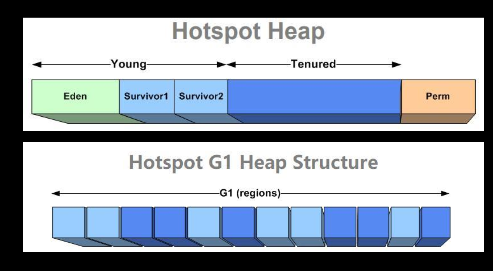

## Execution engine

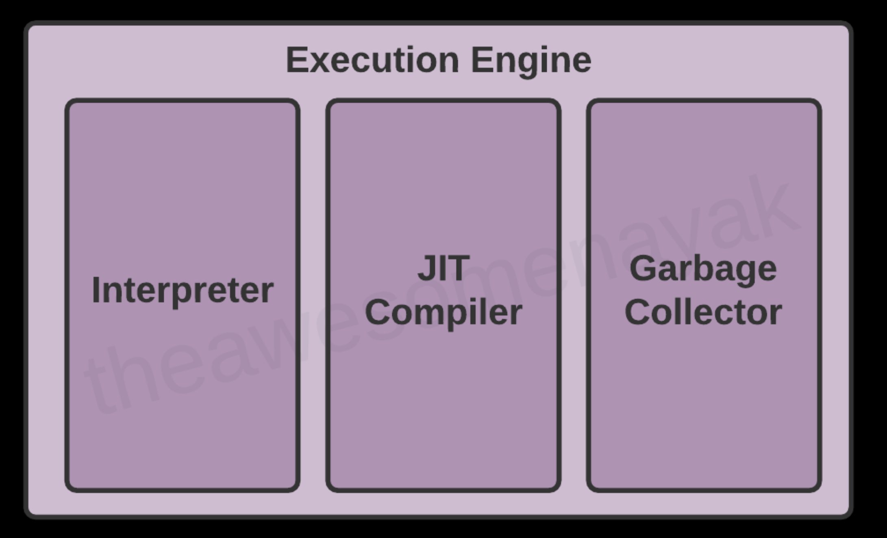

Interpreter

* 바이트 코드 명령을 실행
* 메소드가 여러 번 호출되면 매번 번역

JIT(Just In Time) compiler

* Java bytecode를 실제 기계어로 번역
* JVM이 반복되는 코드를 발견할 경우 효율을 높일 목적으로 사용
  * Intermediate code generator
  * Code optimizer
  * Target code generator
  * Profiler (Hotspot)
* 실행 기록을 모아 자주 사용되는 코드에 주로 적용 (반복문)
* 프로그램을 오래 실행 할 수록 성능개선에 유리
* 읽어 보면 좋을 참고자료
  *  https://inspirit941.tistory.com/352


•Interpreter
•JIT compiler
•Garbage collector
•Native method interface (JNI)
•Native method library (.dll)


# 데이터베이스


# 운영과 보안


# 넷플릭스 서버 디자인


# 이력서 및 자기소개

