# 인프런 2시간으로 끝내는 코루틴

[toc]


# 1강. 루틴과 코루틴

co-routine : 협력하는 루틴, 함수

* routine 은 컴퓨터 공학에서 이야기하는루틴으로 간단히 ‘함수’라고 생각해도 좋다

```kotlin
fun main() {
	println("START")
	newRoutine()
	println("END")
} 

fun newRoutine() {
	val num1 = 1
	val num2 = 2
	println("${num1 + num2}")

}
```

1. main 루틴이 START 를 출력한 이후 new 루틴을 호출한다.
2. new 루틴은 1과 2를 계산해 3을 출력한다
3. 그 이후, new 루틴은 종료되고 main 루틴으로 돌아온다.
4. main 루틴은 END 를 출력하고 종료된다.


이때 newRoutine()이 종료된 이후에는 해당 함수에서 사용된 num1과 num2는 다시 접근할수 없이 초기화 된다

- 루틴은 진입하는 곳이 한 곳이고
- 루틴이 종료되면 그 루틴에서 사용했던 정보가 초기화

## 코틀린 사용 의존성

```kotlin
dependencies {
    implementation("org.jetbrains.kotlinx:kotlinx-coroutines-core:1.7.2")
    testImplementation(kotlin("test"))
}
```

```kotlin
fun main(): Unit = runBlocking {
    printWithThread("START")
    launch {
        newRoutine()
    }
    yield()
    printWithThread("END")
}

suspend fun newRoutine() {
    val num1 = 1
    val num2 = 2
    yield()
    printWithThread("${num1 + num2}")
}

fun printWithThread(str: Any?) {
    println("[${Thread.currentThread().name}] $str")
}
```

runBlocking 함수는 일반 루틴 세계와 코루 틴 세계를 연결하는 함수이다. 

이 함수 자체로 새로운 코루틴을 만들게 되고, runB Locking 에 넣어준 람다가 새로운 코루틴 안에 들어가게 된다.

 Launch 함수 :  새로운 코루틴을 만드는 함수. 주로 반환 값이 없는 코루틴을 만드는데 사용된다.

yield() 라는 함수는 지금 코루틴의 실행을 잠시 멈추고 다른 코루틴이 실행 되도록 양보한다.

* 이 코드에는 2개의 코루틴이 있다. runBlocking과 launch

suspend 라는 키워드가 붙으면 다른 suspend fun 을 호출할수 있다.

*  yield() 가 suspend fun 이기 때문에 함수 newRoutine 에 suspend 를 붙여 주었다.

실행결과

```
[main] START
[main] END
[main] 3
```

1. main 코루틴이 runBlocking 에 의해 시작되고 START 가 출력된다.
2. Launch 에 의해 새로운 코루틴이 생긴다. 하지만, newRoutine의 실행은 바로 일어나지 않는다.
3. main 코루틴 안에 있는 yield() 가 되면 main 코루틴은 newRoutine 코루틴에게 실행을 양보한다. 따라서 launch 가 만든 새로운 코루틴이 실행되고, newRoutine 함수가 실행된다.
4. newRoutine 함수는 다시 yield() 를 호출하고 main 코루틴으로 되돌아온다.
5. main 루틴은 END 를 출력하고 종료된다.
6. 아직 newRoutine 함수가 끝나지 않았으니 newRoutine 함수로 되돌아가 3 이 출력되
    고 프로그램이 종료된다.

루틴과 코루틴의 가장 큰 차이는 중단과 재개이다. 

루틴은 한 번 시작되면 종료될 때 까지 멈추지 않지만, 코루틴은 상황에 따라 잠시 중단이 되었다가 다시 시작되기도 한다. 

`때문에 완전히 종료되기 전까지는 newRoutine 함수 안에 있는 num1 num2 변수가 메모리에서 제거되지도 않는다.`

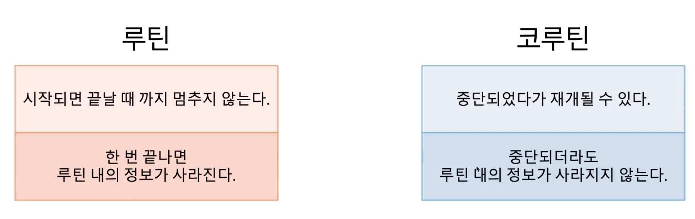

### 인텔리제이에서 코루틴 로그보기

InteliJ IDEA에서 vm option으로 ``-Dkotlinx.coroutines.debug` 를 주게 되면 어떤 코루 틴에서 출력이 일어났는지 확인할 수도 있다.

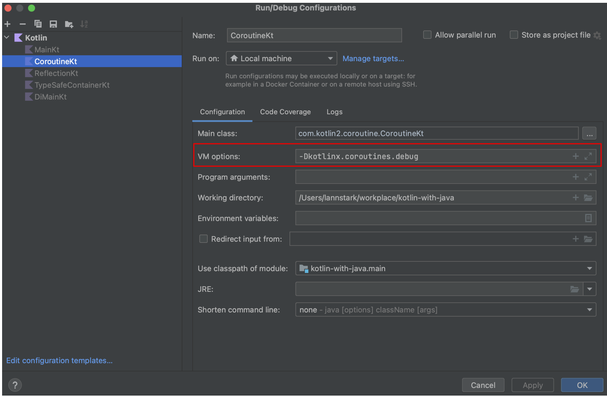

# 2강. 스레드와 코루틴

프로세스(process)는 컴퓨터에서 실행되고 있는 프로그램을 의미하며
스레드는(thread)는 프로세스보다 작은 개념으로 프로세스에 소속되어 여러 코드를 동시에 실행할 수있도록 해준다. 

스레드는 코드를 실행하고 따라서 우리가 작성한 코드는 특정 스레드에서 실행된다.

그렇다면 코루틴은 무엇일까? `코루틴은 스레드보다 작은 개념이다`

* 코루틴은 특정 스레드에 종속되어있지 않다. 

가장 먼저 코루틴은 단지 우리가 작성한 루틴, 코드의 종류 중 하나이기 때문에 코루틴 코드가 실행되려면 스레드가 있어야만 한다. 

그런데 코루틴은 중단되었다가 재개될 수 있기 때문에(suspend), 코루틴 코드의 앞부분은 1번 스레드에 배정되고, 뒷부분은 2번 스레드에 배정될 수 있다.

## 스레드와 코루틴의 context switching 차이

- 프로세스
  - 프로세스는 각각독립된 메모리 영역을 갖고 있기 때문에 1번 프로세스에서 2번 프로세스로 실행이 변경되면 는 OS 수준에서 수행되며, CPU 레지스터, 프로그램 카운터, VM 상태, 스택, 힙 영역 등의 정보가 저장되고 모두 교체되어야 한다.
  - 때문에 프로세스 간의 context switching은 비용이 제일 크다.
- 스레드
  - 스레드는 독립된 스택 영역을 갖고 있지만, 힙 영역을 공유하고 있기 때문에 실행이 변경되면 스택 영역만 교체된다.
  - 따라서 프로세스보다는 context switching 비용이 적다.
  - 스레드는 병렬 실행이 가능하다. 멀티 코어 프로세서에서 여러 스레드는 동시에 실행될 수 있습니다.
  - 각 스레드는 고정된 크기의 스택 메모리를 가져서 많은 스레드를 생성하면 메모리 사용이 증가한다.
- 코루틴
  - 반면 코루틴은 1번 코루틴과 2번 코루틴이 같은 스레드에서 실행될 수 있다.
  - 때문에 동일한 스레드에서 코루틴이 실행되면, 메모리 전부를 공유하므로 스레드보다도 context switching 비용이 적다.
  - 기본적으로 코루틴은 동시성을 위해 설계되었지만, 병렬 실행을 위한 것은 아니다. 하지만 코루틴을 병렬로 실행하려면 특정 스레드 풀 또는 다른 백그라운드 메커니즘과 함께 사용할 수 있다.
  - 코루틴은 필요에 따라 동적으로 메모리를 할당합니다. 이로 인해 많은 코루틴을 생성하더라도 메모리 부담이 크게 늘어나지 않는다.

또한, 스레드는 동시성을 확보하기 위해 여러 개의 스레드가 필요하다. 

반면, 코루틴은 1번 코루틴과 2번 코루틴이 하나의 스레드에서 번갈아 실행될 수 있기 때문에 단 하나의 스레드 만으로도 동시성을 확보할 수 있다.

* 동시성은 한번에 한가지 일만 할수있지만 두 작업이 아주 빠르게 실행되어 동시에 보이는것. 

코루틴과 같은 방식을 '비선점형'이라 부르고 스레드와 같은 방식을 '선점형'이라 부른다.

# 3강. 코루틴 빌더와 Job

코루틴을 만드는 방법

1. runBlocking

2. launch
3. async()


## runBlocking

```kotlin
import kotlinx.coroutines.runBlocking

fun main() = runBlocking { 
    
}
```

새로운 코루틴을 만들고 기존 루틴과 코루틴을 이어주는 역할을 한다 

- 현재 스레드를 블로킹하여 주어진 람다 내의 코루틴 코드를 실행.
- 주로 테스트나 메인 함수에서 코루틴 코드를 동기적으로 실행할 때 사용

주의할점은, 이름에 blocking이 들어가있다는건 runBlocking으로 인해 만들어진 코루틴과 그 안에 있는 코루틴이 모두 완료될때까지 코드를 블락시킨다.

* 스레드가 블락되면 해당 스레드는 블락이 풀릴때까지 다른 코드를 실행시킬 수 없다

```kotlin
fun main() {

    runBlocking {
        printWithThread("START")
        launch {
            delay(2_000L)
            printWithThread("LAUNCH END")
        }

    }
    printWithThread("END")
}

```

main 함수에는 `runBlocking` 으로 만들어진 코루틴이 있고, `runBlocking` 으로 만들어진 코루 틴 안에는 `다시 한번 Launch 로 만들어진 코루틴`이 있다. 

* 여기서 사용된 delay() 함수는 코 루틴을 지정된 시간 동안 지연시키는 함수이다

이 코드에서 END 가 출력되기 위해서는 runBlocking 때문에 두 개의 코루틴이 모두 완전히

종료되어야 하고 따라서 출력 결과는 다음과 같다.

```kotlin
[main @coroutine#1] START
[main @coroutine#2] LAUNCH END
[main] END
```

* END가 출력되기 전에 runBlocking  블록이 끝나야 해서 2초를 기다려야하는 문제가 있다. 즉 스레드가 블락당한것이다

때문에 runBlocking함수를 사용하는것은 별로 좋지 않고, 메인 함수나 테스트 코드 작성시에만 사용하는것이 좋다


## launch

반환 값이 없는 코드를 실행할 때 사용한다.

`launch` 는 runBLocking 과는 다르게 만들어진 코루틴을 결과로 반환하고, 이 객체를 이용해 코루틴을 제어할 수 있다.
 이 객체의 타입은 `Job` 으로 코루틴을 나타낸다. 즉, Job 을 하나 받으면 코루틴을 하나 만든 것이다.

```kotlin
fun main() = runBlocking {
    val job = launch {
        printWithThread("Hello Launch")
    }
}
```

* job은 launch가 만들어낸 코루틴 자체를 제어할 수 있는 객체이다. 

Job 을 이용해 코루틴을 제어할 수 있다고 했는데, 제어한다는 의미는 무엇일까?!

* 시작시키거나, 취소시키거나, 종료시까지 대기하게 할 수 있다. 

예를 들어 우리가 코루틴을 만든 후, 시작 신호를 주어야 코루틴이 실행되도록 변경해 보자.

### launch-  job.start()

```kotlin
fun main(): Unit = runBlocking {

    val launch = launch(start = CoroutineStart.LAZY) {
        printWithThread("hello launch")
    }

    delay(1_000L)
    launch.start()
}

```

* launch 라는 코루틴 빌더를 사용할 때 coroutinestart. LAZY 옵션을주면 코루틴이 즉시 실행되지 않는다.

Job.start()를 직접 호출해야만 동작한다.

### launch - job.cancel()

canceL() 함수는 우리가 만든 코루틴을 취소하는 기능이다

```kotlin
fun main(): Unit = runBlocking {
    val job = launch {
        (1..5).forEach {
            printWithThread(it)
            delay(500)
        }
    }

    delay(1_000L)
    job.cancel()
}
```

원래대로라면 1~5까지 출력하지만, 1초뒤에  cancel() 시켜서 2까지만 출력한다

### launch - job.join()

Job 객체의 join() 기능을 사용하면 우리가 제어하고 있는 코루틴이 끝날 때까지 대기할 수도 있다

```kotlin
fun main(): Unit = runBlocking {
    val job1 = launch {
        delay(1_000)
        printWithThread("Job 1")
    }

    val job2 = launch {
        delay(1_000)
        printWithThread("Job 2")
    }

}
```

결과

```
[main] Job 1
[main] Job 2
```

위의 코드는 각각의 코루틴에서 delay가 1초씩 걸려 있지만, Job 1과 Job 2가 출력되는데

1.1초 정도면 충분하다! 그 이유는, j0b1에서 1초를 기다리는 동안 job2가 시작되어 함께 1 초를 기다리기 때문이다.
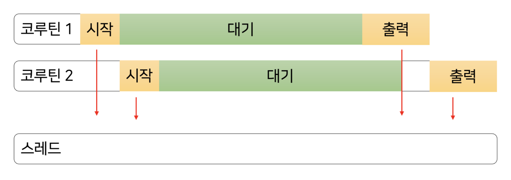

join() 기능을 사용하면 job1이 끝날떄까지 기다린다

```kotlin
fun main(): Unit = runBlocking {
    val job1 = launch {
        delay(1_000)
        printWithThread("Job 1")
    }
    job1.join()

    val job2 = launch {
        delay(1_000)
        printWithThread("Job 2")
    }

}
```

첫 번째 코루틴에 대해 join() 을 호출하며 첫 번째 코루틴이 끝날 때까지 완전히 기다렸기 때문에 시간이 더 걸린다

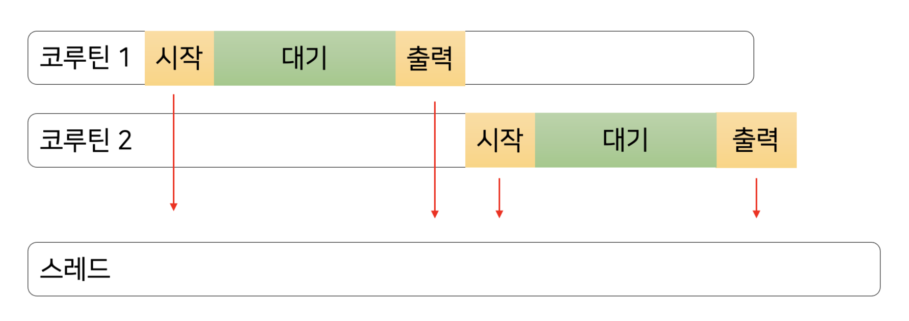

## async()

async() 는 Launch() 와 거의 유사한데 딱 한 가지 다른 점이 있다. 
주어진 함수의 실행 결과를 반환할 수 없는 launch() 와 달리 async() 는 주어진 함수 실행 결과를 반환할 수 있다.

```kotlin
fun main(): Unit = runBlocking {
    val job = async {
        3  + 5
    }
}
```

async() 역시 Launch() 처럼 코루틴을 제어할 수 있는 객체를 반환하며 그 객체는 Deferred 이다.

* launch는 Job이다

Deferred 는 Job 의 하위 타입으로 Job 과 동일한 기능들이 있고, async() 에서 실행된 결 과를 가져오는 await() 함수가 추가적으로 존재한다.

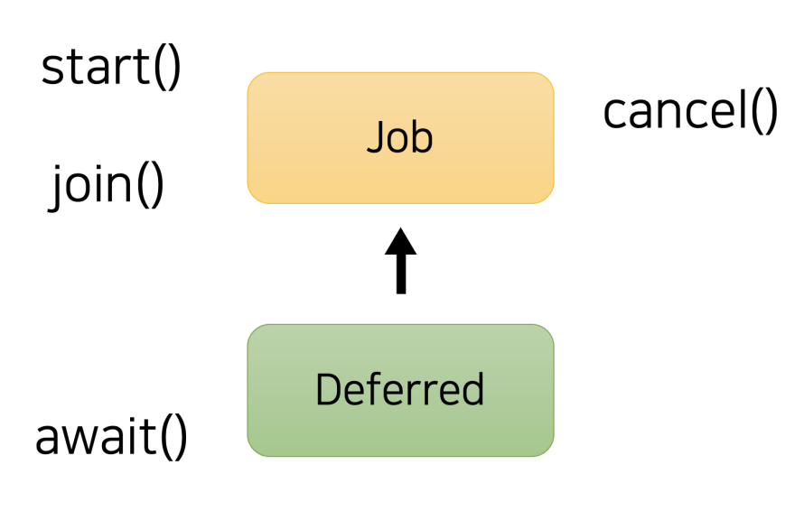

```kotlin
fun main(): Unit = runBlocking {
    val job = async {
        3 + 5
    }

    val eight = job.await()
}
```

이 async() 함수는 여러 외부 자원을 동시에 호출해야 하는 상황에서 유용하게 활용될 수 있다.

예를 들어, 두 API를 각각호출해 결과를 합해야 한다고 하자.

```kotlin
fun main(): Unit = runBlocking {
    val time = measureTimeMillis { // 소요시간 측정 
        val job1 = async { apiCall1() }
        val job2 = async { apiCall2() }
        printWithThread(job1.await() + job2.await())
    }
    
    printWithThread("소요 시간 : $time ms")
}

suspend fun apiCall1(): Int {
    delay(1_000L)
    return 1
}

suspend fun apiCall2(): Int {
    delay(1_000L)
    return 2
}
```

또한, 첫 번째 API의 결과가 두 번째 API에 필요한 경우에는 calback을 이용하지 않고도, 동기 방식으로 코드를 작성할 수 있게 해준다.

```kotlin
fun main(): Unit = runBlocking {
    val time = measureTimeMillis {
        val job1 = async { apiCall1() }
        val job2 = async { apiCallV2(job1.await()) }
        printWithThread(job2.await())
    }

    printWithThread("소요 시간 : $time ms")
}
```

async() 와 관련해 한 가지 주의할 점으로는, coroutinestart. LAZY 옵션을 사용해 코루틴을 지연 실행시킨다면, 

* 지연 코루틴이라고 한다 

await() 함수를 호출했을 때 계산 결과를 계속해서 기다린다는 것이다.

```kotlin

fun main(): Unit = runBlocking {
    val time = measureTimeMillis {
        val job1 = async(start = CoroutineStart.LAZY) { apiCall1() }
        val job2 = async(start = CoroutineStart.LAZY) { apiCallV2() }
        printWithThread(job1.await() + job2.await())
    }
    printWithThread("소요 시간 : $time ms") // 소요시간 2초 
}

suspend fun apiCallV2(): Int {
    delay(1_000L)
    return 2
}
```

만약 지연 코루틴 을 async()와 함께 사용하면서 동시에 호출하고 싶다면 start()를 먼저 써줘야 한다

```kotlin
fun main(): Unit = runBlocking {
    val time = measureTimeMillis {
        val job1 = async(start = CoroutineStart.LAZY) { apiCall1() }
        val job2 = async(start = CoroutineStart.LAZY) { apiCallV2() }

        job1.start() // 호출
        job2.start()
        
        printWithThread(job1.await() + job2.await())
    }
    printWithThread("소요 시간 : $time ms") // 결과 1초 
}
```


## 추가 빌더 produce, actor

`produce`는 데이터를 생성하고 채널로 전송하는 역할을 하며, `actor`는 메시지를 수신하고 해당 메시지에 따른 작업을 수행하는 역할

1. **roduce**:

   - `produce` 빌더는 값을 생성하여 채널로 전송하는 코루틴을 생성합니다.
   - `produce`는 `ReceiveChannel`을 반환합니다. 이 채널에서 생성된 값을 수신할 수 있습니다.
   - 주로 데이터 생산자로 사용됩니다.

   ```kotlin
   import kotlinx.coroutines.*
   import kotlinx.coroutines.channels.*
   
   fun CoroutineScope.produceNumbers(): ReceiveChannel<Int> = produce {
       for (i in 1..5) {
           send(i)
           delay(100) // 일부 지연을 추가
       }
   }
   
   fun main() = runBlocking {
       val channel = produceNumbers()
       for (i in channel) {
           println(i)
       }
   }
   ```

2. **actor**:

   - `actor` 빌더는 메시지를 수신하고 해당 메시지를 기반으로 어떤 작업을 수행하는 코루틴을 생성합니다.
   - `actor`는 `SendChannel`을 반환합니다. 이 채널을 통해 메시지를 해당 액터에게 전송할 수 있습니다.
   - 주로 메시지 기반의 작업 처리자로 사용됩니다.

   ```kotlin
   import kotlinx.coroutines.*
   import kotlinx.coroutines.channels.*
   
   sealed class Message
   data class SayHello(val name: String) : Message()
   object Stop : Message()
   
   fun CoroutineScope.greetingActor(): SendChannel<Message> = actor {
       for (msg in channel) { // 메시지를 반복적으로 처리
           when (msg) {
               is SayHello -> println("Hello, ${msg.name}!")
               is Stop -> {
                   println("Stopping the actor.")
                   channel.close()
               }
           }
       }
   }
   
   fun main() = runBlocking {
       val actor = greetingActor()
       actor.send(SayHello("Alice"))
       actor.send(SayHello("Bob"))
       actor.send(Stop)
   }
   ```

## Job vs Deffered

* https://kotlinlang.org/api/kotlinx.coroutines/kotlinx-coroutines-core/kotlinx.coroutines/-job/

Job 은 취소 가능하고, 완료되면 라이프 사이클이 끝납니다.

Deferred 값은 논블로킹 캔슬러블 future 입니다. 결과값을 가지고 있는 job 입니다.

즉, deferred는 결과값을 가지고 있는 job 입니다.

- launch - 새로운 코루틴을 시작. 결과값을 전달하지 않을 때 사용.
- async - 결과를 리턴할 수 있는 코루틴을 시작할때만 사용.

하나의 deferred의 값은 하나의 job 입니다. async builder의 coroutineContext안에 있는 하나의 job은 코루틴 자기자신을 가리킵니다.

Deffered 결과 값(또는 예외)을 반환할 수 있는 코루틴의 실행을 나타내는 핸들이다.

`Job`은 코루틴의 상태와 생명 주기를 관리하는 데 사용되며, `Deferred`는 그 외에도 코루틴의 결과 값을 가져오는 데 사용됩니다.


## 코루틴 Context와 Dispatcher

launch, async 모두 CoroutneScope의 확장함수

CoroutineScope에는 CoroutineContext 하나만 들어있으며 CoroutineContext는 실행중인 여러 Job과 디스패처를 저장하는 맵이다.
`코루틴 컨텍스트`는 코루틴의 실행 환경을 나타내며, `디스패처`는 코루틴이 실행될 스레드를 결정하는 역할

1. **코루틴 컨텍스트 (Coroutine Context)**:
   - 코루틴 컨텍스트는 코루틴이 실행되는 동안 필요한 다양한 정보와 요소를 담고 있는 환경입니다.
   - 컨텍스트는 여러 `Element`들의 집합으로 구성되며, 각각의 `Element`는 특정 키로 구분됩니다.
   - 가장 중요한 `Element` 중 하나가 `Job`입니다. `Job`은 코루틴의 생명주기와 취소 상태를 관리합니다.
   - 다른 중요한 `Element`로는 `CoroutineDispatcher`가 있습니다.
2. **디스패처 (CoroutineDispatcher)**:
   - 디스패처는 코루틴이 실행될 스레드를 결정하는 역할을 합니다.
   - 코루틴은 특정 스레드에서 시작될 필요가 없으며, 중간에 다른 스레드로 전환될 수도 있습니다. 이러한 스레드 전환을 관리하는 것이 디스패처의 역할입니다.
   - Kotlin 코루틴 라이브러리는 몇 가지 기본 디스패처를 제공합니다:
     - `Dispatchers.Default`: CPU 사용이 많은 작업을 위한 디스패처입니다.
     - `Dispatchers.IO`: I/O 작업을 위한 디스패처입니다.
     - `Dispatchers.Main`: UI 작업을 위한 디스패처입니다. Android와 같은 플랫폼에서 UI 작업을 수행할 때 사용됩니다.
     - `Dispatchers.Unconfined`: 특정 스레드에 구속되지 않는 디스패처입니다. 코루틴은 호출하는 스레드에서 시작되며 필요에 따라 다른 스레드로 전환될 수 있습니다.


```kotlin
launch { // 부모 컨텍스트를 사용 
  
}

launch(Dispatchers.Unconfined) { // 특정 스레드에 종속되지 않음? 메인 스레드 사용 
  
}

launch(Dispatchers.Default) { // 기본 디스패처를 사용 
  
}

launch (newSingleThreadContext("MyOwnThread")) { // 새 스레드 사용 
  
}

// IO 디스패처 사용
launch(Dispatchers.IO) {
        println("IO dispatcher: ${Thread.currentThread().name}")
}

// Unconfined 디스패처 사용 (주의: 실제 앱에서 사용하기 위한 것은 아닙니다!)
launch(Dispatchers.Unconfined) {
        println("Unconfined start: ${Thread.currentThread().name}")
        delay(100)
        println("Unconfined after delay: ${Thread.currentThread().name}")
}

// Main 디스패처 사용 (Android와 같은 플랫폼에서 UI 작업을 수행할 때 사용됩니다.)
// 이 예제에서는 실제로 실행할 수 없습니다. 특정 플랫폼에서만 작동합니다.
// launch(Dispatchers.Main) {
//     println("Main dispatcher: ${Thread.currentThread().name}")
// }
```


# 4강. 코루틴의 취소

여러 코루틴을 사용할 때, 필요 없어진 코루틴을 적절하게 취소하며 컴퓨터 자원을 절약할 수 있다.

방법들

1. kotlinx.coroutines 패키지의 suspend 함수를 이용한다.(yield(),   delay(), withTimeout(), 등) 
   1. 코루틴은 주기적으로 취소 요청을 확인하고 해당 요청에 응답해야 한다. 위의 `suspend` 함수들은 이러한 취소 요청을 확인하고 적절하게 반응하는 데 도움을 준다

2. 코루틴 스스로가 본인의 상태를 확인하여 요청을 받았을 때 CancellationException을 던진다. 

코루틴을 취소하기 위해서는 이전 시간에 살펴봤던 것처럼, Job객체의 cancel() 함수를 사용할 수 있다. 

`다만, 취소 대상인 코루틴도 취소에 협조를 해주어야 한다.`

```kotlin
fun main(): Unit = runBlocking {
    val job1 = launch {
        delay(1_000L)
        printWithThread("Job 1")
    }

    val job2 = launch {
        delay(1_000L)
        printWithThread("Job 2")
    }

    delay(100L) // 첫 번째 코루틴 코드가 시작되는 것을 잠시 기다린다.
    
    job1.cancel()
}
```

결과

```
[main @coroutine#3] Job 2
```

바로 delay() 함수가 바로 코루틴 취소에 대한 협조이다. 

더 근본적으로는 delay() 혹은yield() 와 같은 kotlinx.coroutines 패키지의 suspend 함수를 사용하면 취소에 협조할 수 있다

첫 번째 방법은 `바로 코루틴 패키지의 suspend 함수이다`

코루틴이 취소에 협조하지 않으면 정말 취소되지 않는 것일까?

```kotlin
fun main(): Unit = runBlocking {
    val job = launch {
        var i = 1
        var nextPrintTime = System.currentTimeMillis()
        while (i <= 5) {
            if (nextPrintTime <= System.currentTimeMillis()) {
                printWithThread("${i++} 번째 출력!")
                nextPrintTime += 1_000L // 1초 후에 다시 출력되도록 한다.
            }
        }
    }
    
    delay(100L)
    
    job.cancel()
}
```

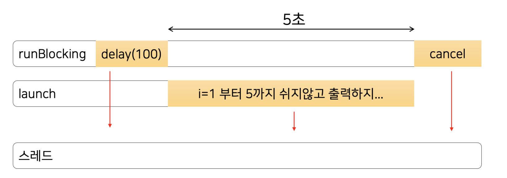

응 안된다. 협력하는 함수를 사용하는 코루틴만 취소 가능하다


## 2. 코루틴 취소방법 - 코루틴 스스로가 본인의 상태를 확인해 취소 요청을 받았을 때 CancellationException 을 던지는 방법
스스로 본인 상태를 확인해 취소 요청을 받으려면 두 가지 개념을 추가적으로 이해해야 한다.

* isActive
  * 코틀린을 만들 때 사용한 함수 블록 안에서는 isActive 라는 프로퍼티에 접근할 수 있다.
  * 이 프로퍼티는 현재 코루틴이 활성화 되어 있는지, 아니면 취소 신호를 받았는지 구분할 수 있게 해준다.

* Dispatchers.Default
  * 취소 신호를 정상적으로 전달하려면, 우리가 만든 코루틴이 다른 스레드에서 동작 해야 한다.
  * Dispatchers.Default 를 launch() 함수에 전달하면 우리의 코루틴을 다른 스레드에서 동작시킬 수 있다

```kotlin
fun main(): Unit = runBlocking {
    val job = launch(Dispatchers.Default) { // 하드코딩된 디스패처를 피하세요.
        var i = 1
        var nextPrintTime = System.currentTimeMillis()
        while (i <= 5) {
            if (nextPrintTime <= System.currentTimeMillis()) {
                printWithThread("${i++} 번째 출력!")
                nextPrintTime += 1_000L // 1초 후에 다시 출력되도록 한다.
            }

            if (!isActive) { // 코루틴 스스로 취소를 확인한다.
                throw CancellationException()
            }
        }
    }

    delay(100L)
    printWithThread("취소 시작")
    job.cancel()
}
```

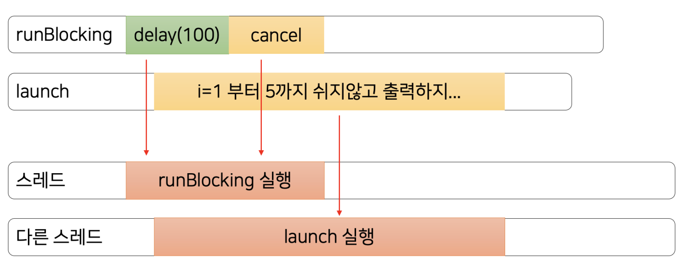

Dispatchers.Default 로 다른 스레드를 배정할 수 있다.

```kotlin

@Suppress("EXTENSION_SHADOWED_BY_MEMBER")
public val CoroutineScope.isActive: Boolean
    get() = coroutineContext[Job]?.isActive ?: true

```

isActice 확장 프로퍼티는 CoroutineScope를 사용할 수 있는 경우 접근할 수 있다.

취소명령을 받았는지 여부를 알 수 있다.

* 여기서 `isActive` 확장 프로퍼티는 현재 `CoroutineScope`의 `Job`이 활성 상태인지 (아직 완료되지 않았거나 취소되지 않았는지) 확인하는 데 사용

> 만약 위 코드에서, launch(Dispatchers.Default) 대신 launch 를 사용한다면, “취소 시작” 자체가 출력되지 않게 된다. 
>
> launch 에서 동작시키고 있는 코드가 main 스레드를 점유한 채 비켜주지 않기 때문이다.

퓨팅 자원을 적절하게 관리하기 위해서는 코루틴을 취소할수 있어야 하고, 코루틴을 취소하려면 취소될 코루틴이 적절한 협조를 해주어야 한다. 

취소 협조 방법으로는

1. kotlinx.coroutines 패키지의 suspend 함수를 호출하거나
   * 사실 yield(), delay() 도 내부적으로 CancellationException을 던짐 
2. isActive 로 직접 상태를 확인해 CancellationException 을 던지는 방법 이 있었다

## CancellationException?


`CancellationException`은 Kotlin 코루틴에서 취소 연산과 관련된 예외입니다. 코루틴이 취소되면, 해당 코루틴은 이 예외를 받게 됩니다. 이 예외는 코루틴의 정상적인 종료를 나타내는 것이 아닌, 외부에서의 취소 요청으로 인해 코루틴이 중단된 것을 나타낸다

```kotlin
package kotlinx.coroutines

/**
 * 코루틴의 [Job]이 일시 중단 중에 취소되면, 취소 가능한 일시 중단 함수에 의해 발생합니다.
 * 이는 코루틴의 _정상적인_ 취소를 나타냅니다.
 * **기본적인 처리되지 않은 예외 핸들러에 의해 콘솔/로그에 출력되지 않습니다.**
 * [CoroutineExceptionHandler]를 참조하세요.
 */
public actual typealias CancellationException = java.util.concurrent.CancellationException

```

* 루틴의 취소를 나타내기 때문에 일반적으로 특별한 처리 없이 전파되어야 한다. 코루틴의 `catch` 블록에서 이 예외를 명시적으로 처리할 필요는 없다.
* **전파**: 코루틴 계층 구조에서 상위 코루틴이 취소되면 그 하위의 모든 코루틴도 취소됩니다. 이 경우, 하위 코루틴들은 모두 `CancellationException`을 받게된다.
* `withContext` 블록 내에서 발생한 `CancellationException`은 해당 블록을 벗어나서 전파되지 않는다. 
* 이는 `withContext` 블록이 다른 컨텍스트에서 실행되기 때문에, 그 외부의 취소 상태와 독립적으로 동작해야 하기 때문이다.


try - catch 문을 활용해 CancellationException 를 잡은 후 다시 던지지 않는다면 코틀린이 취소되지 않고, finally 문을 활용해 필요한 자원을 닫을 수도 있다

```kotlin
fun main(): Unit = runBlocking {
    val job = launch {
        try {
            delay(1_000L)
        } catch (e: CancellationException) {
        // 예외를 잡아서 먹어버린다!
        } 
        printWithThread("delay에 의해 최소되지 않았다!")
    } 
    
    delay(100L)
    printWithThread("취소 시작")
    job.cancel()
}
```

```kotlin
fun main(): Unit = runBlocking {
    val job = launch {
        try {
            delay(1_000L)
        } finally {
            // 자원을 적절히 닫을 수 있다.
        } 
        printWithThread("delay에 의해 최소되지 않았다!")
    } 
    
    delay(100L)
    printWithThread("취소 시작")
    job.cancel()
}
```


# 5강. 코루틴의 예외 처리와 Job의 상태 변화

```kotlin
fun main(): Unit = runBlocking {
    val job1 = launch {
        delay(1_000L)
        printWithThread("Job 1")
    }
    val job2 = launch {
        delay(1_000L)
        printWithThread("Job 2")
    }
}
```

위 코드는 root 코루틴을 만드는 예제이다.

* runBlockingdㅡ로 만들어진 코루틴이 root이다
* launch는 자식이다

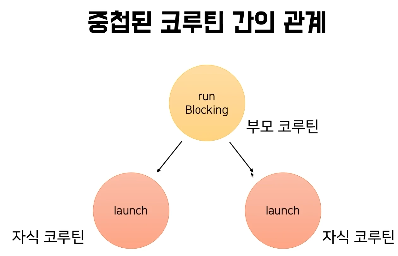

만약 새로운 root 코루틴을 만들고 싶다면 어떻게 해야 할까?!
launch를 사용해 코루틴을 만들 때, 새로운 영역(CoroutineScope)에 만들면 된다

```kotlin
fun main(): Unit = runBlocking {
    val job1 = CoroutineScope(Dispatchers.Default).launch {
        delay(1_000L)
        printWithThread("Job 1")
    }
    val job2 = CoroutineScope(Dispatchers.Default).launch {
        delay(1_000L)
        printWithThread("Job 2")
    }
}
```

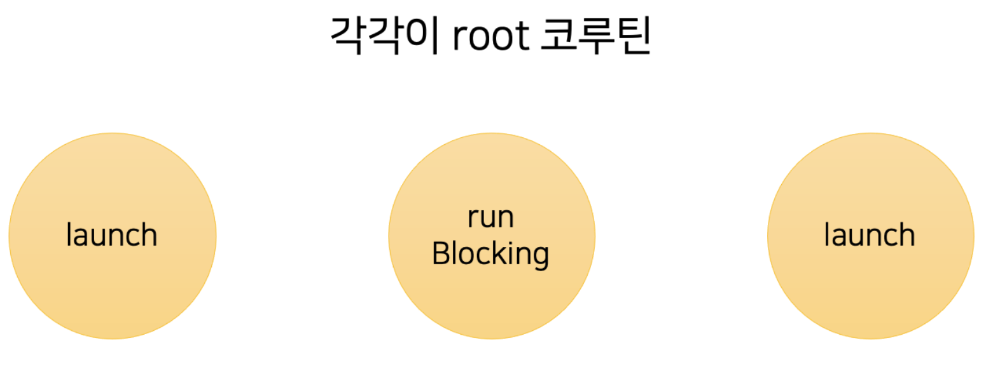

## Launch와 async의 예외발생 차이

먼저 launch의 예외발생 

```kotlin
fun main(): Unit = runBlocking {
    val job = CoroutineScope(Dispatchers.Default).launch { 
        throw IllegalArgumentException()
    }
    delay(1_000L)
}
```

결과

```
Exception in thread "DefaultDispatcher-worker-1" java.lang.IllegalArgumentException
	at coroutine.LaunchExceptionKt$main$1$job$1.invokeSuspend(LaunchException.kt:10)
```

launch 함수는 예외가 발생하자마자, 해당 예외를 출력하고 코루틴이 종료된다

반면, async 함수는 예외가 발생하더라도 예외를 출력하지 않는다

```kotlin
fun main(): Unit = runBlocking {
    val job = CoroutineScope(Dispatchers.Default).async {
        throw IllegalArgumentException()
    }
    delay(1_000L)
}
```

예외를 확인하고 싶다면 await() 함수를 호출해야 한다.

async 는 launch 와 다르게 값을 반환하는 코루틴에 사용되기에, 예외 역시 값을 반환할 때 처리할 수 있도록 설계된 것이다

```kotlin
fun main(): Unit = runBlocking {
    val job = CoroutineScope(Dispatchers.Default).async {
        throw IllegalArgumentException()
    }
    delay(1_000L)
    job.await() // 이때 예외 발생 
}
```

이번에는 새로운 영역에 root 코루틴을 만들지 않고, runBlocking 코루틴의 자식 코루틴으로 만들어보자. 

이 경우는 launch 와 async 모두 예외가 발생하면 바로 에러 로그를 확인할 수 있다

```kotlin
fun main(): Unit = runBlocking {
    val job = launch { // async로 변경해도 동일하다.
        throw IllegalArgumentException()
    }
    delay(1_000L)
}
```

* 바로 예외를 반환한다

이상하다! 분명 async 는 예외를 즉시 반환하지 않는다고 했는데 왜 이런 차이가 발생하는 것 일까?!

`그 이유는 코루틴 안에서 발생한 예외가 부모 코루틴으로 전파되기 때문이다`

* 위의 코드에서 `launch`로 시작된 코루틴의 부모는 `runBlocking`으로 시작된 코루틴이다

runBlocking 안에 있는 async 코루틴에서 예외가 발생하면, 그 예외는 부모 코루틴으로 이동되고, 부모 코루틴도 취소하는 절차에 들어가게 된다. 

runBlocking 의 경우 예외가 발생하면 해당 예외를 출력하기에 async 의 예외를 받아 즉시 출력하는 것이다.

`부모 코루틴에게 예외를 전파하지 않는 방법은 없을까?`

바로 `SupervisorJob`() 을 사용하는 것이다

```kotlin
fun main(): Unit = runBlocking {
    val job = async(SupervisorJob()) {
        throw IllegalArgumentException()
    }
    delay(1_000L)
   
    // job.await() 이렇게 해야 예외가 발생한다 
}
```

async 함수에 SupervisorJob() 을 넣어주면 async 자식 코루틴에서 발생한 예외
가 부모 코루틴으로 전파되지 않고, job.await() 을 해야 예외가 발생하는 원래 행동 패턴으로 돌아가게 된다.

## 코루틴 예외처리

try-catch와 CoroutineExceptionHandler를 사용할 수 있다.

만약 try catch 대신, 예외가 발생한 이후 에러를 로깅하거나, 에러 메시지를 보내는 등의
공통된 로직을 처리하고 싶다면 CoroutineExceptionHandler 라는 객체를 활용해볼 수 있다.

```kotlin
val exceptionHandler = CoroutineExceptionHandler { context, throwable ->
    printWithThread("예외")
}
```

* context는 코루틴 구성요소
* throwable은 발생한 예외 

`CoroutineExceptionHandler` 객체는 코루틴의 구성 요소와 발생한 예외를 파라미터로 받을 수 있다.

```kotlin
fun main(): Unit = runBlocking {
    val exceptionHandler = CoroutineExceptionHandler { _, _ -> // 구성요소와 예외를 쓰지 않을거면 언더바 사용
        printWithThread("예외")
    }
    
    val job = CoroutineScope(Dispatchers.Default) // 부모 코루틴이 있으면 핸들러가 적용 안되므로 new 루트로 실행
        .launch(exceptionHandler) { // 핸들러 적용 
            throw IllegalArgumentException()
        }
    
    delay(1_000L)
}
```

* 다만 CoroutineExceptionHandler는 `async가 아닌 launch에만 적용 가능`하고, `부모 코루틴이 있으면 동작하지 않는다.`

## 코루틴의 취소와 예외의 차이

CancellationException 인지 여부의 차이이다.

> 내부적으로는 취소나 실패 모두 취소됨 상태로 관리한다.

코루틴은 코루틴 내부에서 발생한 예외에 대해 다음과 같이 처리하고 있다.
1. 발생한 예외가 CancellationException 인 경우
  * 취소로 간주하고 부모 코루틴에게 전파하지 않는다.
2. 다른 예외가 발생한 경우
  * 실패로 간주하고 부모 코루틴에게 전파한다.
  * 그리고 코루틴은 예외가 발생하면, 해당 예외가 CancellationException 이건 다른 종류의 예외이건 `내부적으로 “취소됨 상태”로 간주한다`

이를 State Machine으로 표현해 보면 다음과 같다

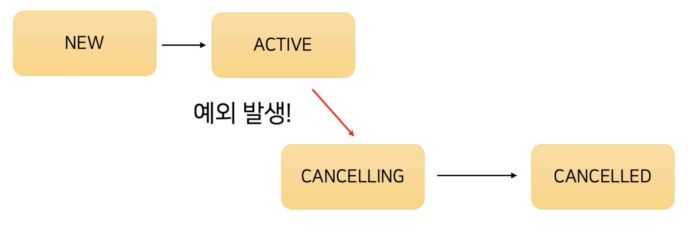

만약 예외가 발생하지 않고 코루틴이 정상적으로 처리되었다면 다음과 같은 흐름을 가진다.

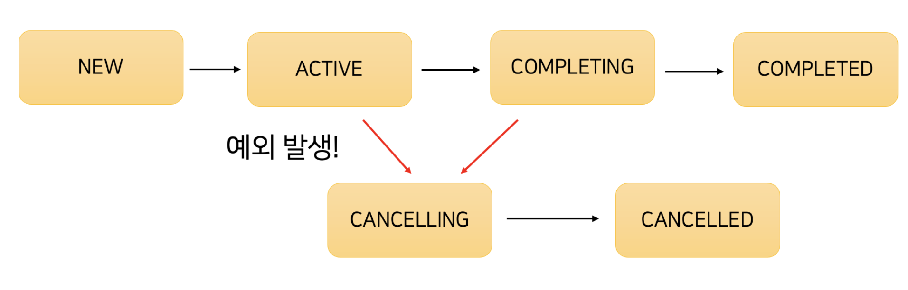

자 그런데 여기서 `Completing`과 `Completed`가 나뉘는 이유는 무엇일까??
바로~ 그 이유를 다음 시간에 알아보도록 하자! 😊

# 6강. Structued Concurrency - 구조적 동시성

**구조화된 동시성 (Structured Concurrency)**의 핵심 아이디어는 코루틴이 임의로 시작되고 종료되는 것이 아니라, 

명확하게 정의된 스코프와 수명 주기를 갖도록 하는 것이다. 

이를 통해 리소스 누수나 예기치 않은 동작을 방지하며, 코드의 가독성과 유지 관리성을 향상시킨다.

* 부모 - 자식 관계의 코루틴이 한 몸 처럼 움직인다.
* 1번 자식의 예외가 부모에게 전파되면 다른 자식들도 전파되어 취소된다. 
* 자식 코루틴에서 예외가 발생할 경우, Structured Concurrency에 의해 부모 코루틴이취소되고, 부모 코루틴의 다른 자식 코루틴들도 취소된다.
* 자식 코루틴에서 예외가 발생하지 않더라도 부모 코루틴이 취소되면, 자식 코루틴들이 취소된다.
* `다만 CancellationException 의 경우 정상적인 취소로 간주하기 때문에 부모 코루틴에게전파되지 않고, 부모 코루틴의 다른 자식 코루틴을 취소시키지도 않는다.`


**코루틴 Job의 Life Cycle**


주어진 작업이 완료된 코루틴은 바로 COMPLETED 가 되는게 아니라 COMPLETING 으로 처리 되었다.
작업이 완료된 경우 바로 COMPLETED 가 되는게 아니라 왜 COMPLETING의 한 단계 거쳐 가는걸까?

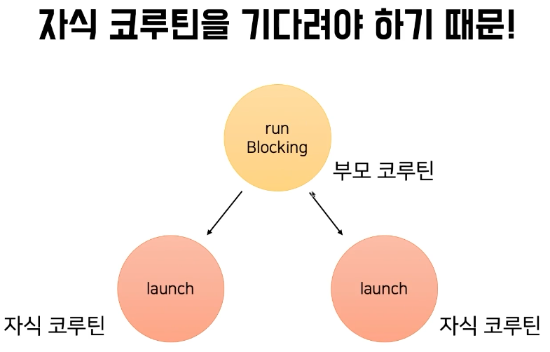

그 이유는 자식 코루틴이 있을 경우, 

* 자식 코루틴들이 모두 완료될 때까지 기다릴 수 있고,

* 자식 코루틴들 중 하나에서 예외가 발생하면 다른 자식 코루틴들에게도 취소 요청을 보내기때문이다

```kotlin
fun main(): Unit = runBlocking {
    launch {
        delay(600L)
        printWithThread("A")
    }

    launch {
        delay(500L)
        throw IllegalArgumentException("코루틴 실패!")
    }

}
// 결과
Exception in thread "main" java.lang.IllegalArgumentException: 코루틴 실패!
```

* 첫 번째 코루틴이 A를 출력하고 있고, 두 번째 코루틴이 예외를 던지고 있다

두 코루틴은 독립적이기 때문에 예외도 발생하고 A도 출력될 것 같지만, 실제로는 앞 코루틴은 동작을 안하고 예외만 발생되는 것을 확인할 수 있다

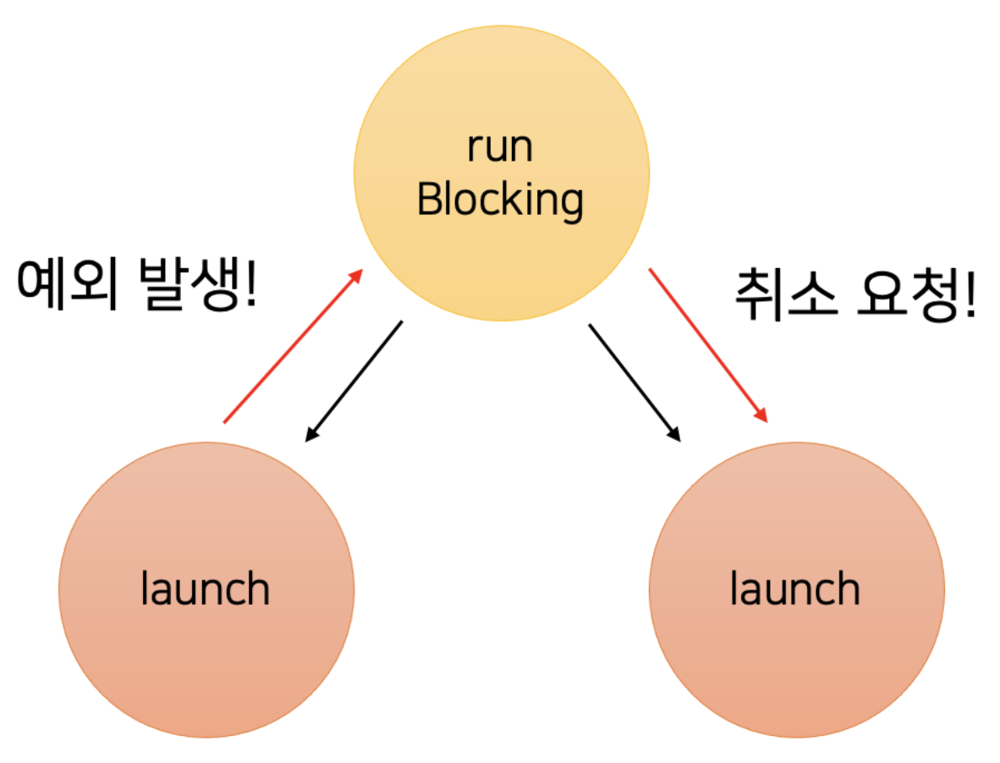

그 이유는, 두 번째 코루틴에서 `발생한 예외가 runBlocking 에 의해 만들어진 부모 코루틴에게 취소 신호를 보내게 되고`, 
`이 취소 신호를 받은 부모 코루틴이 다른 자식 코루틴인 첫 번째 코루틴까지 취소시키기 때문이다.`

이렇게 부모 - 자식 관계의 코루틴이 한 몸 처럼 움직이는 것을 “Structured Concurrency”라고 부른다

코틀린 공식 문서에서는 Structured Concurrency 필요성 에 대해 다음과 같이 이야기하고 있다.

* `Structured Concurrency는 수많은 코루틴이 유실되거나 누수되지 않도록 보장한다.`
* `Structured Concurrency는 코드 내의 에러가 유실되지 않고 적절히 보고될 수 있도록 보장한다`


취소및 예외와 같이 Structured Concurrency를 생각해보면

* 자식 코루틴에서 예외가 발생할 경우, Structured Concurrency에 의해 부모 코루틴이취소되고, 부모 코루틴의 다른 자식 코루틴들도 취소된다.
* 자식 코루틴에서 예외가 발생하지 않더라도 부모 코루틴이 취소되면, 자식 코루틴들이 취소된다.
* 다만 CancellationException 의 경우 정상적인 취소로 간주하기 때문에 부모 코루틴에게
  전파되지 않고, 부모 코루틴의 다른 자식 코루틴을 취소시키지도 않는다.

# 7강. CoroutineScope과 CoroutineContext

* CoroutineScope : 코루틴이 탄생할 수 있는 영역

* CoroutineContext : 코루틴과 관련된 데이터를 보관

CoroutineScope : 코루틴의 생명 주기와 범위를 정의하는 인터페이스이다. 코루틴이 언제 시작되고 언제 종료될지, 그리고 어떻게 관리될지를 결정한다.

* 주로 코루틴의 생명 주기를 관리하는데 사용된다. 특정 스코프 내에서 시작된 모든 코루틴은 해당 스코프가 종료될 때까지 완료되어야 한다. 따라서 스코프가 종료될 때 모든 자식 코루틴도 함께 종료된다.
* `CoroutineScope`는 `CoroutineContext`를 가지고 있다. 이 컨텍스트는 코루틴의 실행 환경, 예를 들어 `Job`과 `Dispatcher`, 그리고 다른 컨텍스트 요소들을 포함한다.  
* `CoroutineScope`는 Structured Concurrency의 원칙을 실현하는 데 중요한 역할을 한다. 코루틴은 항상 특정 스코프 내에서 시작되며, 해당 스코프와 그 생명 주기에 연결된다. 

launch 혹은 async 와 같은 코루틴 빌더는 CoroutineScope 의 확장함수이다. 

즉, launch 와 async 를 사용하려면 CoroutineScope이 필요하다. 

```kotlin
// launch의 시그니처
public fun CoroutineScope.launch(
    context: CoroutineContext = EmptyCoroutineContext,
    start: CoroutineStart = CoroutineStart.DEFAULT,
    block: suspend CoroutineScope.() -> Unit
): Job

// async의 시그니처
public fun <T> CoroutineScope.async(
    context: CoroutineContext = EmptyCoroutineContext,
    start: CoroutineStart = CoroutineStart.DEFAULT,
    block: suspend CoroutineScope.() -> T
): Deferred<T>
```


직접 CoroutineScope 을 만든다면 runBlocking 이 굳이 필요하지 않다. 

main 함수를 일반 함수로 만들어 코루틴이 끝날 때까지 main 스레드를 대기시킬 수도 있고, 

```kotlin
fun main() { // 일반 메인 함수 
    val job = CoroutineScope(Dispatchers.Default).launch { // 직접 CoroutineScope 생성
        delay(1_000L)
        printWithThread("Job 1")
    } 
    
    Thread.sleep(1_500L) // job1이 끝나기를 기다린다.
}
```

main함수 자체를 suspend 함수로 만들어 join() 시킬 수도 있다

```kotlin
suspend fun main() { // suspend fun
    val job = CoroutineScope(Dispatchers.Default).launch {
        delay(1_000L)
        printWithThread("Job 1")
    } 
  
    job.join()
}
```

`CoroutineScope 의 주요 역할은 CoroutineContext 라는 데이터를 보관하는 것이다.` 

실제 CoroutineScope 인터페이스 역시 매우 단순하다

```kotlin
public interface CoroutineScope {
	public val coroutineContext: CoroutineContext
}
```

CoroutineContext 는 코루틴과 관련된 여러가지 데이터를 갖고 있다.

* 현재 코루틴의 이름
* CoroutineExceptionHandler
* Job
* CoroutineDispatcher 등이 들어있다. 
  * Dispatcher는 코루틴이 어떤 스레드에 배정될지를 관리하는 역할을 맡는다

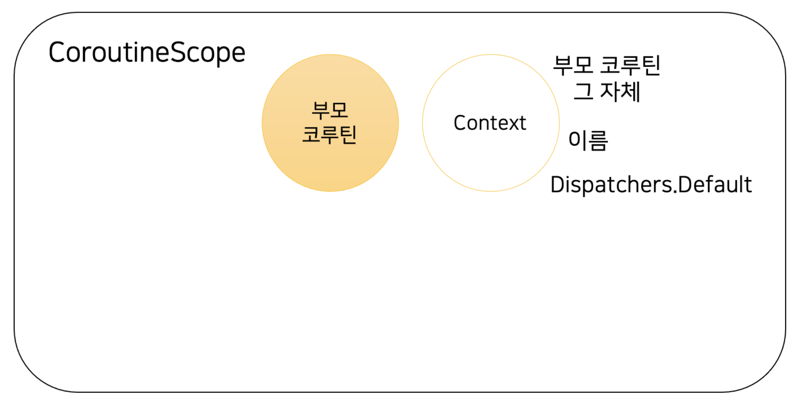

* CoroutineScope 은 코루틴이 탄생할 수 있는 영역이고, CoroutineScope 안에는 CoroutineContext 라는 코루틴과 관련된 데이터가 들어 있다.

위의 그림과 같이 최초 한 영역에 부모 코루틴이 있다고 하자.

이때 CoroutineContext 에는 (코루틴 정보 - 이름, Dispatchers.Default , 부모 코루틴)이 들어 있다.

이 상황 에서 부모 코루틴에서 자식 코루틴을 만든다.

* 자식 코루틴은 부모 코루틴과 같은 Scope에서 생성되고, 해당 Scope의 context 가져온 다음 필요한 정보를 덮어 써 
  `새로운 자식만의 context를 만든다.`

예를 들어 이름을 우리가 직접 지정해주었다고 하자. 

그럼 자식 코루틴은 우리가 지정해준이름을 이용해 필요한 데이터를 context에서 가져와 적절히 덮어 쓰고 새로운 context를 갖
게 된다. 

`이 과정에서 부모 - 자식 간의 관계도 설정해준다.`

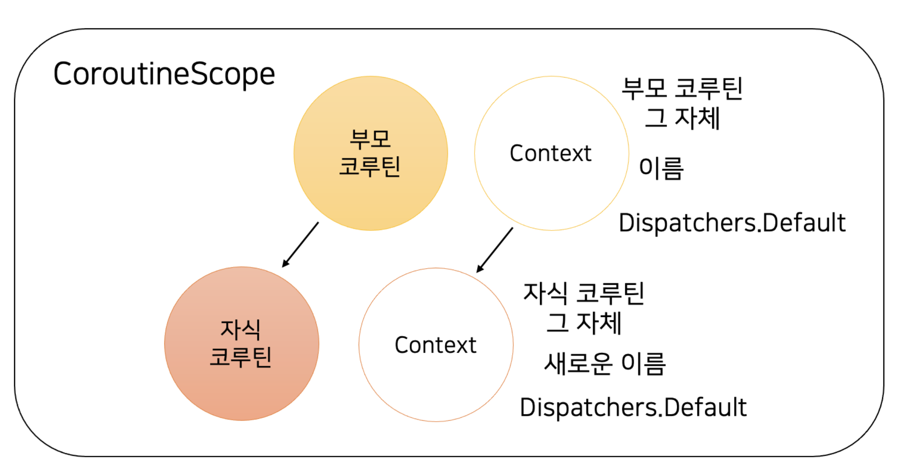

* 이 원리가 바로 Structured Concurrency를 작동시킬 수 있는 기반이 된다.

그리고 이렇게 한 영역(scope)에 있는 코루틴들은 scope 자체를 cancel() 시킴으로써 모든 코루틴을 종료시킬 수 있다

```kotlin
class AsyncLogic {
    private val scope = CoroutineScope(Dispatchers.Default)
    
    fun doSomething() {
        scope.launch {
        // 여기서 어떤 작업을 하고 있다.
        }
    } 
    
    fun destroy() {
        scope.cancel() // 스코프 자체를 종료시켜버리면 해당 스코프의 모든 코루틴들이 종료됌 
    }
}

val asyncLogic = AsyncLogic()
asyncLogic.doSomething()
asyncLogic.destory() // 필요가 없어지면 모두 정리
```


## CouroutineContext

CoroutineContext 는 코루틴과 관련된 여러가지 데이터를 갖고 있다.

* 현재 코루틴의 이름
* CoroutineExceptionHandler
* Job
* CoroutineDispatcher 등이 들어있다. 
  * Dispatcher는 코루틴이 어떤 스레드에 배정될지를 관리하는 역할을 맡는다

CoroutineContext 는 `Map과 Set을 섞어 둔 자료구조와 같다.` 

* CoroutineContext 에 저장되는 데이터는 key - value로 이루어져 있고,
*  Set과 비슷하게 동일한 Key를 가진 데이터는 하나만 존재할 수 있다.

```kotlin
package kotlin.coroutines

@SinceKotlin("1.3")
public interface CoroutineContext {

    public operator fun <E : Element> get(key: Key<E>): E?

    // [CoroutineContext]의 요소에 대한 키입니다. [E]는 이 키와 관련된 요소의 타입입니다.
    public interface Key<E : Element>

    
    // [CoroutineContext]의 요소입니다. 코루틴 컨텍스트의 요소는 자체적으로 싱글톤 컨텍스트입니다.
    public interface Element : CoroutineContext {
        
        // 이 코루틴 컨텍스트 요소의 키입니다.
        public val key: Key<*>

        public override operator fun <E : Element> get(key: Key<E>): E? =
            @Suppress("UNCHECKED_CAST")
            if (this.key == key) this as E else null

        public override fun <R> fold(initial: R, operation: (R, Element) -> R): R =
            operation(initial, this)

        public override fun minusKey(key: Key<*>): CoroutineContext =
            if (this.key == key) EmptyCoroutineContext else this
    }

}
```

* CoroutineContext 인터페이스의 구현체가 꽤 많다. 

이 key - value 하나하나를 Element 라 부르고, 

+ 기호를 이용해 각 Element 를 합치거나 context에 Element 를 추가할 수 있다

```kotlin
suspend fun main() {

    // + 기호를 이용해 Element 합성
    var coroutineContext = CoroutineName("나만의 코루틴") + SupervisorJob()
    printWithThread(coroutineContext)

    // context에 element를 추가
    coroutineContext += CoroutineName("나만의 코루틴2")
    println(coroutineContext)
}

// 결과
[DefaultDispatcher-worker-1] [CoroutineName(나만의 코루틴), SupervisorJobImpl{Active}@64908e92]
[SupervisorJobImpl{Active}@64908e92, CoroutineName(나만의 코루틴2)]
```

만약 context에서 Element를 제거하고 싶다면, minusKey 함수를 이용해 제거할 수 있다.
```kotlin
coroutineContext.minusKey(CoroutineName.Key)
```

## context에 들어갈 수 있는 Dispatcher

코루틴은 스레드에 배정되어 실행된다.

또한 코루틴은 중단되었다가
다른 스레드에 배정될 수도 있는데, 이렇게 코루틴을 스레드에 배정하는 역할을 Dispatcher가 수행한다

```kotlin

// [Dispatchers.IO] 코루틴 디스패처에서 사용되는 최대 스레드 수를 정의하는 속성의 이름입니다.
public const val IO_PARALLELISM_PROPERTY_NAME: String = "kotlinx.coroutines.io.parallelism"

//[CoroutineDispatcher]의 여러 구현을 그룹화하여 관리 
public actual object Dispatchers {|

    @JvmStatic
    public actual val Default: CoroutineDispatcher = DefaultScheduler

    @JvmStatic
    public actual val Main: MainCoroutineDispatcher get() = MainDispatcherLoader.dispatcher

    @JvmStatic
    public actual val Unconfined: CoroutineDispatcher = kotlinx.coroutines.Unconfined

    /**
     * 블로킹 IO 작업을 공유 스레드 풀로 오프로드하기 위해 설계된 [CoroutineDispatcher]입니다.
     *
     * 이 풀의 추가 스레드는 필요에 따라 생성되고 종료됩니다.
     * 이 디스패처에서 사용되는 작업에 의한 스레드 수는 
     * "kotlinx.coroutines.io.parallelism" ([IO_PARALLELISM_PROPERTY_NAME]) 시스템 속성 값으로 제한됩니다.
     * 기본값은 64 스레드 또는 코어 수(둘 중 큰 값)로 제한됩니다.
     *
     * ### 제한된 병렬성에 대한 탄력성
     *
     * `Dispatchers.IO`는 탄력성이라는 독특한 특성을 가집니다: [CoroutineDispatcher.limitedParallelism]을 통해 얻은 그것의 뷰는 
     * `Dispatchers.IO`의 병렬성에 의해 제한되지 않습니다. 개념적으로, 제한없는 스레드 풀을 백업하는 디스패처가 있으며, 
     * `Dispatchers.IO`와 `Dispatchers.IO`의 뷰 모두 그 디스패처의 뷰입니다. 실제로는, `Dispatchers.IO`의 병렬성 제한을 준수하지 않는 그것의 뷰도 
     * `Dispatchers.IO`와 스레드 및 리소스를 공유한다는 것을 의미합니다.
     *
     * ```
     * // MySQL 연결을 위한 100개의 스레드
     * val myMysqlDbDispatcher = Dispatchers.IO.limitedParallelism(100)
     * // MongoDB 연결을 위한 60개의 스레드
     * val myMongoDbDispatcher = Dispatchers.IO.limitedParallelism(60)
     * ```
     * 시스템은 최대 부하 시점에 블로킹 작업에 dédicé된 `64 + 100 + 60` 스레드를 가질 수 있지만,
     * 안정적인 상태에서는 `Dispatchers.IO`, `myMysqlDbDispatcher` 및 `myMongoDbDispatcher` 사이에서 공유되는 몇 개의 스레드만 있습니다.
     *
     * ### 구현 노트
     *
     * 이 디스패처와 그 뷰는 [Default][Dispatchers.Default] 디스패처와 스레드를 공유하므로, 
     * 이미 [Default][Dispatchers.Default] 디스패처에서 실행 중일 때 
     * `withContext(Dispatchers.IO) { ... }`를 사용하면 일반적으로 다른 스레드로 전환되지 않습니다.
     * 이러한 시나리오에서 기본 구현은 최선의 노력으로 실행을 동일한 스레드에서 유지하려고 시도합니다.
     *
     * 스레드 공유의 결과로, IO 디스패처 위의 작업 중에는 64(기본 병렬성)개 이상의 스레드가 생성될 수 있습니다(하지만 사용되지 않음).
     */
    @JvmStatic
    public val IO: CoroutineDispatcher = DefaultIoScheduler

    /**
     * 내장 디스패처, 예: [Default] 및 [IO],를 종료하여 
     * 관련된 모든 스레드를 중지하고 모든 새로운 작업을 거부합니다.
     * 시간 관련 작업(`delay`, `withTimeout`)에 대한 폴백으로 사용되는 디스패처 및 
     * 다른 디스패처에서 거부된 작업을 처리하는 디스패처도 종료됩니다.
     *
     * 이것은 **미묘한** API입니다. 일반적인 애플리케이션 수준의 코드에서 호출되어서는 안되며 호출은 되돌릴 수 없습니다.
     * 종료 호출은 코루틴 기계의 대부분에 영향을 미치며 코루틴 프레임워크를 작동 불능 상태로 만듭니다.
     * 종료 메서드는 보류 중인 작업이나 활성 코루틴이 없을 때만 호출되어야 합니다.
     * 그렇지 않으면 동작은 명시되지 않습니다: `shutdown` 호출은 종료를 완료하지 않고 예외를 발생시킬 수 있거나, 
     * 성공적으로 완료될 수 있지만 남아있는 작업은 영구적으로 도르마 상태가 되어 완료되거나 실행되지 않을 것입니다.
     *
     * 종료의 주요 목적은 코루틴 프레임워크와 관련된 모든 백그라운드 스레드를 중지하여 
     * kotlinx.coroutines 클래스를 Java 가상 머신에서 언로드 가능하게 하는 것입니다.
     * 컨테이너화된 환경(OSGi, Gradle 플러그인 시스템, IDEA 플러그인)에서 컨테이너 수명 주기의 끝에 사용하는 것이 좋습니다.
     */
    @DelicateCoroutinesApi
    public fun shutdown() {
        // ... 코드 ...
    }

    // ... 기타 주석 ...
}

```

### Dispatcher의 대표적인 종류

`Dispatchers.Default`

* 가장 기본적인 디스패처. CPU 자원을 많이 쓸 때 권장되며, 별다른 설정이 없다면 Dispatchers.Default 가 사용된다.

`Dispatchers.IO`

* I/O 작업에 최적화된 디스패처.

`Dispatchers.Main`

* 보통 UI 컴포넌트를 조작하기 위한 디스패처. 특정 의존성을 갖고 있어야 정상적으 로 활용할 수 있다.

`Java의 스레드풀인 ExecutorService를 디스패처로 변환`

* asCoroutineDispatcher () 이라는 확장함수를 이용해 ExecutorService를 디스패처로 전환할 수 있다

```kotlin
import kotlinx.coroutines.CoroutineScope
import kotlinx.coroutines.asCoroutineDispatcher
import kotlinx.coroutines.launch

import java.util.concurrent.Executors

fun main() {
    val threadPool = Executors.newSingleThreadExecutor()
    
    CoroutineScope(threadPool.asCoroutineDispatcher())
        .launch { 
            printWithThread("새로운 코루틴")
        }
}
```


# 8강. suspending function

suspending function이란 우리가 지금까지 사용해왔던 것으로 suspend 지시어가 붙은 함수를 의미한다

suspend 지시어가 붙으면 무엇이 달라 지는 것일까?

바로 다른 suspend 함수를 부를 수 있는 특수 능력이 생긴다

```kotlin
fun main(): Unit = runBlocking {	
	launch {
		delay(100L) // suspend 함수
	}
}
```

`runBlocking` 코루틴 빌더나 `launch` 코루틴 빌더에서 다른 함수를 받을 때, 

이 함수는 suspend 함수로 간주된다. 실제 launch 의
시그니처에서도 suspend 함수를 받고 있다. 

이렇게 함수 타입에 suspend 를 붙인 것을 가리켜 suspending lambda 라고 부른다.

```kotlin
// launch의 시그니처, suspend 함수를 받고 있다.
public fun CoroutineScope.launch(
    context: CoroutineContext = EmptyCoroutineContext,
    start: CoroutineStart = CoroutineStart.DEFAULT,
    block: suspend CoroutineScope.() -> Unit // suspend
): Job
```

실제 코루틴에서 사용하는 suspend 함수 역시 **코루틴이 중지 되었다가 재개될 수 있는 지점**이된다. 

이를 가리켜 `suspension point 라고` 부른다

* 여기서 핵심은 "될 수 있는" 이다. 
* suspend 함수를 호출한다고 해서 무조건 중지되는 것이 아니다. 중지가 될 수도 있고, 중지가 되지 않을 수도 있다는 의미이다

## suspend 함수는 어떻게 활용할 수 있을까?

suspend function은

비동기 프로그래밍을 할 때 콜백 지옥에서 벗어날 수 있는 동기식 코드를 작성하는데 도움이 된다,

여러 비동기 라이브러리를 사용할 수 있도록 도와준다.


* 연쇄적인 API를 호출해야 하는 상황에서 첫번째 api의 결과를 두번째 api 에 사용시 

```kotlin
fun main(): Unit = runBlocking {
    val result1 = async { // 반환타입은 Deferred
        apiCall_1()
    } 
    val result2 = async { // 반환타입은 Deferred
        apiCall_2(result1.await()) 
    } 
    
    printWithThread(result2.await())
} 

fun apiCall_1(): Int {
    Thread.sleep(1_000L)
    return 100
} 

fun apiCall_2(num: Int): Int {
    Thread.sleep(1_000L)
    return num * 2
}
```

async 와 Deferred 를 활용해 콜백을 활용하지 않고 코드를 작성했지만, 반환타입이 Deferred 이기 때문에

Deferred에 의존적인 코드가 되버린다. 

* 즉 무조건 결과를 가져오려면 Deferred.await()로 꺼내야 해서 코드내에서 Deferred가 무조건 필요하다. 

* Deferred 대신에 CompletableFuture 또는 Reactor 와 같은 다른 비동기 라이브러리 코드로 갈아 끼워야 할 수도 있다


이때 suspend fun 을 사용하면 어떤 비동기 라이브러리 구현체를 사용하건 해당 함수 내부에서 선택할 수 있다. 

* 반환 타입이 상관이 없어진다. Deferred에 의존적이지 않다. 

```kotlin
fun main(): Unit = runBlocking {
    val result1 = apiCall_1()
    val result2 = apiCall_2(result1)
    
    printWithThread(result2)
} 

suspend fun apiCall_1(): Int {
    return CoroutineScope(Dispatchers.Default).async {
        Thread.sleep(1_000L)
        100
    }.await()
} 

suspend fun apiCall_2(num: Int): Int {
    return CompletableFuture.supplyAsync {
        Thread.sleep(1_000L)
        100
    }.await()
}
```

## 코루틴 라이브러리에서 제공하는 suspend 함수

### 1. coroutineScope 함수

launch 나 async 처럼 새로운 코루틴을 만들지만, 주어진 함수 블록이 바로 실행되는 특징을 갖고 있다

새로 생긴 코루틴과 자식 코루틴들이 모두 완료된 이후 반환된다.

 coroutineScope 으로 만든 코루틴은 이전 코루틴의 자식 코루틴이 된다

```kotlin
fun main(): Unit = runBlocking {
    printWithThread("START")
    printWithThread(calculateResult())
    printWithThread("END")
} 

suspend fun calculateResult(): Int = coroutineScope {
    val num1 = async {
        delay(1_000L)
        10
    } 
    
    val num2 = async {
        delay(1_000L)
        20
    } 
    
    num1.await() + num2.await()
}
```

* num1 async와 num2 async는 메인 코루틴의 자식

### 2. withContext 함수

withContext 역시 주어진 코드 블록이 즉시 호출되며 새로운 코루틴이 만들어지고, 이 코루틴이 완전히 종료되어야 반환된다. 
즉 기본적으로는 coroutineScope 과 같다

하지만, withContext 를 사용할 때 `context에 변화를 줄 수 있어` 다음과 같이 Dispatcher를 바꿔 사용할 때 활용해볼 수 있다.

* Context가 지정이 가능하다.

```kotlin
fun main(): Unit = runBlocking {
    printWithThread("START")
    printWithThread(calculateResult())
    printWithThread("END")
} 

suspend fun calculateResult(): Int = withContext(Dispatchers.Default) {
    val num1 = async {
        delay(1_000L)
        10
    }

    val num2 = async {
        delay(1_000L)
        20
    }

    num1.await() + num2.await()

}
```

### 3. withTimeout 과 withTimeoutOrNull 함수

이 함수들 역시 coroutineScope 과 유사하지만 주어진 함수 블록이 `시간 내에 완료되어야 한다는 차이점`이 있다.

주어진 시간 안에 코루틴이 완료되지 않으면 

* withTimeout 은 `TimeoutCancellationException` 을 던지게 되고, 

* withTimeoutOrNull 은 null을 반환하게 된다

```kotlin
fun main(): Unit = runBlocking {

    val result = withTimeout(100L) {
        delay(500L)
        10 + 20
    }

    printWithThread(result)
}
```


# 9강. 코루틴과 Continuation (코루틴의 연속성 (`Continuation`))

코루틴은 어떻게 중단도 하고 재개도 할까?!

1. **중단 (Suspension)**:
   - `suspend` 함수는 실행 중인 코루틴을 중단할 수 있는 능력이 있습니다.
   - 이 중단은 블로킹이 아닙니다. 즉, 스레드를 차단하거나 대기 상태로 만들지 않습니다.
   - 대신, 현재의 코루틴 실행 상태는 내부적으로 저장되며, 스레드는 다른 작업을 계속 수행할 수 있습니다.
2. **재개 (Resumption)**:
   - 코루틴은 나중에 재개될 준비가 되면 다시 시작될 수 있습니다.
   - 이는 내부적으로 저장된 코루틴의 상태를 사용하여 이루어집니다.
   - 코루틴이 재개될 때, 중단된 지점부터 실행이 계속됩니다.

1. **중단 포인트**: `suspend` 함수 내에서 `delay()`, `await()`, `withContext()`와 같은 다른 `suspend` 함수를 호출할 때마다 중단 포인트가 생성됩니다.
2. **컨티뉴에이션 (Continuation)**: 코루틴이 중단되면, 그 지점의 실행 상태와 함께 재개될 때 실행되어야 할 코드가 "컨티뉴에이션" 객체에 저장됩니다.
3. **재개**: 비동기 작업이 완료되면, 컨티뉴에이션이 호출되어 코루틴이 중단된 지점부터 실행을 계속합니다.

이러한 방식으로 코루틴은 효과적으로 복잡한 비동기 로직을 처리하면서도 코드의 가독성을 유지합니다. 
Kotlin의 코루틴은 내부적으로 JVM의 Continuation-Passing Style (CPS) 변환을 사용하여 이러한 동작을 구현합니다. 
이 변환을 통해, 코루틴 코드는 CPS 형태의 코드로 변환되며, 이를 통해 중단과 재개 메커니즘을 지원합니다.

 

예제를 보자

UserService 에서는 findUser 라는 suspend 함수로 유저 정보를 가져오는데 이 suspend 함수는 또 다른 2개의 suspend 함수를 호출한다.

```kotlin
class UserService {
    private val userProfileRepository = UserProfileRepository()
    private val userImageRepository = UserImageRepository()
    
    suspend fun findUser(userId: Long): UserDto {
        println("유저를 가져오겠습니다")
        val profile = userProfileRepository.findProfile(userId)
        println("이미지를 가져오겠습니다")
        val image = userImageRepository.findImage(profile)
        return UserDto(profile, image)
    }
    
} 

data class UserDto(
    val profile: Profile,
    val image: Image,
) 

class UserProfileRepository {
    suspend fun findProfile(userId: Long): Profile {
        delay(100L)
        return Profile()
    }
} 

class Profile

class UserImageRepository {
    suspend fun findImage(profile: Profile): Image {
        delay(100L)
        return Image()
    }
} 

class Image
```


우리는 suspend fun인  findUser 가 어떻게 구현되는지 알아볼 것이다

suspend 함수의 의미는 “중단이 될 수 있다”는 의미이기에, suspend 함수를 호출하는 두 곳이 우리의 중단될 수 있는 지점
이 된다. 

이 지점을 경계로 메소드를 나누면 총 3단계로 나누어진다

```kotlin
class UserService {
    private val userProfileRepository = UserProfileRepository()
    private val userImageRepository = UserImageRepository()

    suspend fun findUser(userId: Long): UserDto {
        // 0단게 - 초기시작
        println("유저를 가져오겠습니다")
        val profile = userProfileRepository.findProfile(userId)

        // 1단계 - 1차 중단 후 재시작
        println("이미지를 가져오겠습니다")
        val image = userImageRepository.findImage(profile)

        // 2단계 -2차 중단 후 재시작
        return UserDto(profile, image)
    }

}
```

이제 우리는 이 각 단계는 라벨로 표시할 것이다

라벨을 표시하기 위해 라벨 정보를 있는 객체를 하나 만들어야 한다. 

* 우선 인터페이스로 만들고, findUser 메소드 안에서 익명 클래스로 라벨을 갖고 있게 처리한다. 

```kotlin
// 라벨을 갖고 있을 인터페이스, 점점 더 많은 기능이 추가될 것이다!
interface Continuation {
}
```

```kotlin
class UserService {
    private val userProfileRepository = UserProfileRepository()
    private val userImageRepository = UserImageRepository()

    suspend fun findUser(userId: Long): UserDto {

        val stateMachine = object : Continuation {
            var label = 0 // 익명 클래스를 만들어 라벨을 갖게 만든다.
            var profile: Profile? = null
            var image: Image? = null
        }

        when (stateMachine.label) {
            0 -> {
                println("프로필을 가져오겠습니다")
                stateMachine.label = 1
                val profile = userProfileRepository.findProfile(userId)
                stateMachine.profile = profile
            }

            1 -> {
                println("이미지를 가져오겠습니다")
                stateMachine.label = 2
                val image = userImageRepository.findImage(stateMachine.profile!!)
                stateMachine.image = image

            }
            
            2 -> {
                return UserDto(stateMachine.profile!!, stateMachine.image!!)
            }
        }

    }

}
```

어떻게 1번 라벨과 2번 라벨이 호출되게 할 수 있을까?

현재는 findUser 가 호출되면, sm 이라는 변수가 만들어지며 0번 라벨을 갖게 되고, 

userProfileRepository.findProfile() 를 호출 직 전 1번 라벨로 변경되긴 하지만, 그대로 함수가 종료되어 버린다

이를 해결하기 위해, suspend 함수는 `가장 마지막 매개변수로 Continuation을 받도록 변경 할 것이다`

*  findUser 중단 함수도 마찬가지이고,
*  findUser 에서 사용하고 있는 findProfile 이나 findImage 도 마찬가지이다

```kotlin
class UserProfileRepository {
    suspend fun findProfile(userId: Long, continuation: Continuation): Profile {
        delay(100L)
        return Profile()
    }
}

class UserImageRepository {
    suspend fun findImage(profile: Profile, continuation: Continuation): Image {
        delay(100L)
        return Image()
    }
}
```

```kotlin
class UserService {
    private val userProfileRepository = UserProfileRepository()
    private val userImageRepository = UserImageRepository()

    suspend fun findUser(userId: Long): UserDto {

        val stateMachine = object : Continuation {
            var label = 0 // 익명 클래스를 만들어 라벨을 갖게 만든다.
            var profile: Profile? = null
            var image: Image? = null
        }

        when (stateMachine.label) {
            0 -> {
                println("프로필을 가져오겠습니다")
                stateMachine.label = 1
                val profile = userProfileRepository.findProfile(userId, stateMachine)
                stateMachine.profile = profile
            }

            1 -> {
                println("이미지를 가져오겠습니다")
                stateMachine.label = 2
                val image = userImageRepository.findImage(stateMachine.profile!!, stateMachine)
                stateMachine.image = image

            }

            2 -> {
                return UserDto(stateMachine.profile!!, stateMachine.image!!)
            }
        }
    }

}
```

그리고 이제 Continuation 에 resumeWith(data: Any?) 라는 함수를 하나 만들고, 

findUser에서 익명 클래스로 만든 sm 에 resumeWith 를 오버라이드 하도록 한다. 

오버라이드된 resumeWith 에서는 다시 한 번 findUser를 호출할 것이다

```kotlin
interface Continuation {
    suspend fun resumeWith(data: Any?)
}
```

```kotlin
class UserService {
    private val userProfileRepository = UserProfileRepository()
    private val userImageRepository = UserImageRepository()

    suspend fun findUser(userId: Long, continuation: Continuation): UserDto {

        val stateMachine = object : Continuation {
            val userId = userId
            var label = 0 // 익명 클래스를 만들어 라벨을 갖게 만든다.
            var profile: Profile? = null
            var image: Image? = null
          
            override suspend fun resumeWith(data: Any?) {
                findUser(this.userId, this)
            }
        }
    }
}
```

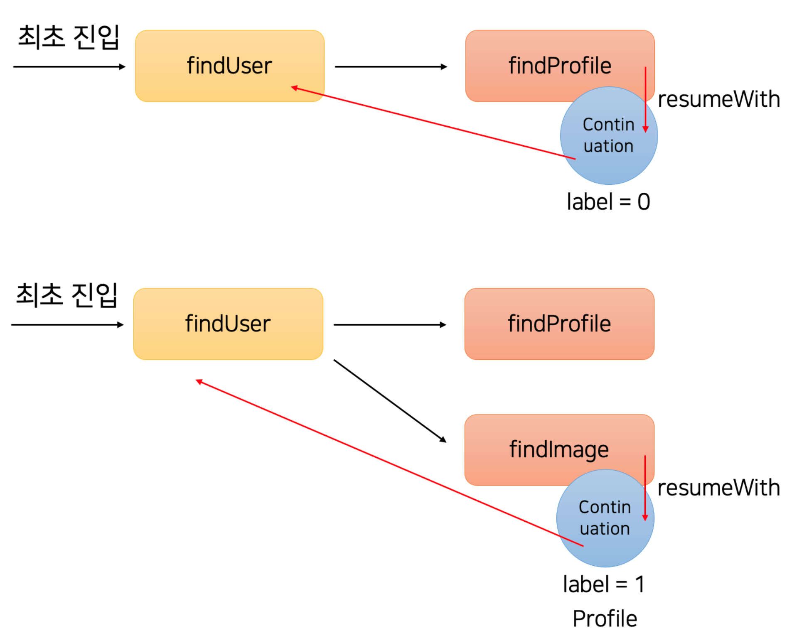

이렇게 동작하기 위해서, findUser 가 호출 될 때마다 sm 을 새로 만들어주지 않고, 들어온
Continuation 객체의 타입에 따라 새로운 Continuation 객체를 만들도록 수정한다

```kotlin

class UserService {
    private val userProfileRepository = UserProfileRepository()
    private val userImageRepository = UserImageRepository()

    private abstract class FindUserContinuation(val userId: Long) : Continuation {
        var label = 0
        var profile: Profile? = null
        var image: Image? = null
    }

    suspend fun findUser(userId: Long, continuation: Continuation?): UserDto {
        val sm = continuation as? FindUserContinuation ?: object : FindUserContinuation(
            userId
        ) {
            override suspend fun resumeWith(data: Any?) {
                when (super.label) {
                    0 -> {
                        profile = data as Profile
                        label = 1
                    }

                    1 -> {
                        image = data as Image
                        label = 2
                    }
                }
                findUser(userId, this)
            }
        }
        when (sm.label) {
            0 -> {
                println("프로필을 가져오겠습니다")
                userProfileRepository.findProfile(userId, sm)
            }

            1 -> {
                println("이미지를 가져오겠습니다")
                userImageRepository.findImage(sm.profile!!, sm)
            }
        }

        return UserDto(sm.profile!!, sm.image!!)
    }

}

```

이렇게 되면, 우리가 그림에서 살펴보았던 것처럼, Continuation 을 통해 최초 호출인지 아니면 callback 호출인지를 구분할 수 있게 되고, 

Continuation 의 구현 클래스에서 라벨과 전달할 데이터 등을 관리할 수 있게 된다


`코루틴의 내부 동작 원리를 살펴보았다`. 

실제 우리가 최초 작성했던 간단한 findUser 함수는 컴파일을 하게 되면, 

우리가 만들어봤던 Continuation 을 사용한 Continuation Passing Style (CPS)로 변하게 된다

코루틴에서는 Continuation을 전달하며 Callback으로 활용한다.

실제 코루틴에서 사용되는 Continuation 인터페이스와 주요 함수는 다음과 같다.

```kotlin
public interface Continuation<in T> {
    public val context: CoroutineContext
    public fun resumeWith(result: Result<T>)
}
```


# 10강. 코루틴의 활용과 마무리

코루틴은
* callback hell을 해결했고
* Kotlin 언어 키워드가 아닌 라이브러리

로써 동작한다는 특정을 갖고 있습니다.

서버에서도 여러 API(I/O)를 동시에 호출해야 한다면, 활용될 수있죠

추가적으로 webflux와 같은 프레임워크에서도 코루틴을 사용할 수 있고, 동시성 테스트를
할 때도 코루틴을 적용해볼 수 있습니다.