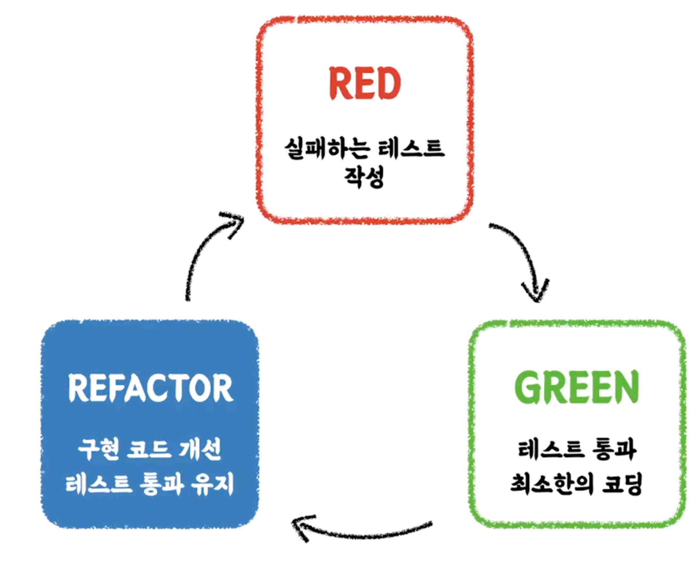
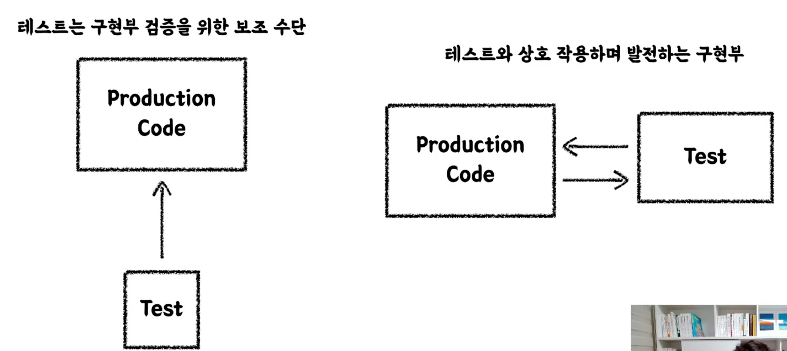
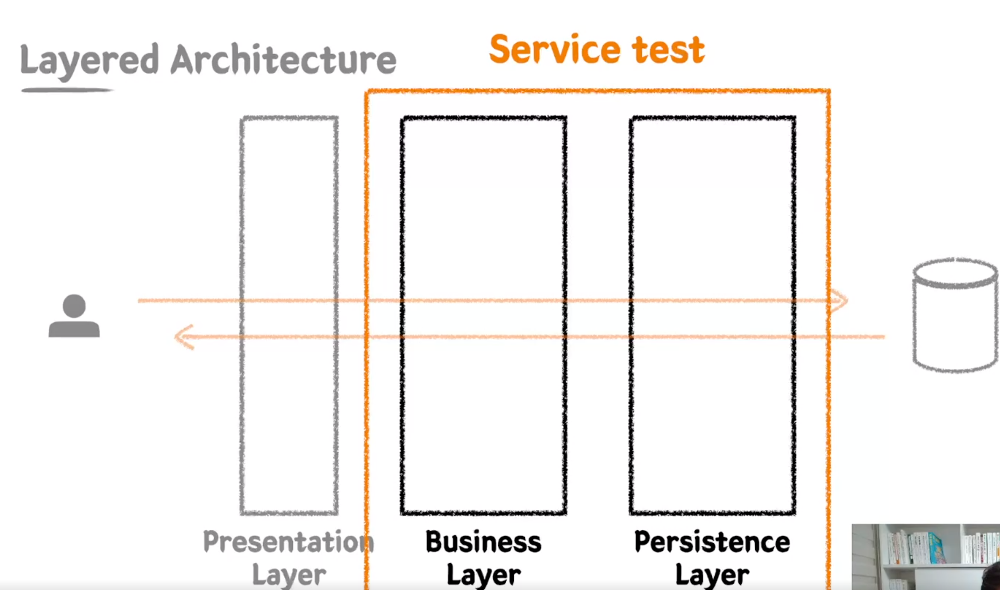

# 인프런 - Practical Testing : 실용적인 테스트 가이드 박우빈님

테스트를 작성하는 역량

* 주니어 개발자에게 가장 기대하는 요소 중 하나

* 채용 시 구현 과제 등에서 테스트 작성 여부, 테스트 코드 구현 방식을 확인 

* 소프트웨어의 품질을 보증하는 방법으로, 그 중요성을 알고 있는지를 확인


무엇을 학습하나요?

* 테스트 코드가 필요한 이유

* 좋은 테스트 코드란 무엇일까?

*  실제 실무에서 진행하는 방식 그대로 테스트를 작성해가면서 API를 설계하고 개발하는 방법

* 정답은 없지만, 오답은 있다! 구체적인 이유에 근거한 상세한 테스트 작성 립


# 테스트는 왜 필요할까?


프로덕션 코드(production code)는 개발되고 확장되면서 다음과 같은 문제점들이 발생하게 된다.

* 커버할 수 없는 영역 발생
* 경험과 감에 의존
* 늦은 피드백
* 유지보수 어려움
* 소프트웨어 신뢰 하락


우리가 테스트 통해 얻고자 하는것

* 빠른 피드백 - 내가 원하는대로, 의도하는대로 동작하는지 
* 자동화 - 매번 모든 케이스에 대해 검증하는게 아닌 기계가 검증할수 있도록 자동화
* 심리적 안정감


테스트 코드를 작성하지 않는다면?

* 변화가 생기는 매순간마다 발생할 수 있는 모든 Case를 고려해야 한다.
  * 기능이 추가될때마다 다른 영역에 대한 범위 테스트

* 변화가 생기는 매순간마다 모든 팀원이 동일한 고민을 해야 한다.

* 빠르게 변화하는 소프트웨어의 안정성을 보장할 수 없다.


테스트 코드가 병목이 된다면?

* 프로덕션 코드의 안정성을 제공하기 힘들어진다.

* 테스트 코드 자체가 유지보수하기 어려운, 새로운 짐이 된다.

* 잘못된 검증이 이루어질 가능성이 생긴다.


올바른 테스트 코드란?

* 자동화 테스트로 비교적 빠른 시간 안에 버그를 발견할 수 있고, ✓ 수동 테스트에 드는 비용을 크게 절약할 수 있다.

* 소프트웨어의 빠른 변화를 지원한다.

*  림원들의 집단 지성을 팀 차원의 이익으로 승격시킨다.

*  가까이 보면 느리지만, 멀리 보면 가장 빠르다.


> 테스트는 귀찮다. 하지만 귀찮지만 반드시 해야한다. 


# 샘플 프로젝트 

주제 : 초 간단 카페 키오스크 시스템

* 주문 기능에 집중


요구사항

* 주문 목록에 음료 추가/삭제 기능
* 주문 목록 전체 지우기
* 주문 목록 총 금액 계산하기
* 주문 생성하기


# 단위테스트

* 작은 코드 단위(클래스 or 메서드)를 독립적으로 검증하는 테스트
* XUnit - Kent Back
  * 각 언어마다 XUnit의 테스트 프레임워크가 존재한다
  * https://JUnit.org/junit5

### AssertJ

* 테스트 코드 작성을 원활하게 돕는 레스트 라이브러리

* 풍부한 API, 메서드 체이닝 지원

* http://joel-costigliola.github.io/assertj/


## 테스트 케이스 세분화하기

질문하기 : 암묵적이거나 아직 드러나지 않은 요구사항이 있는가?


* 해피케이스 : 요구사항을 만족하는 케이스
* 예외케이스 : 엣지케이스 등

-> 경계값 테스트 (이상, 이하, 초과, 미만), 구간, 날짜 등 


## 테스트 하기 어려운 영역을 분리하기 

* 관측할 때마다 다른 값에 의존하는 코드
  *  현재 날짜/시간, 랜덤 값, 전역 변수/함수, 사용자 입력 등

*  외부 세계에 영향을 주는 코드
  *  표준 출력, 메시지 발송, 데이러베이스에 기록하기 등

Before

```java
public Order createOrder() {
	LocalDateTime currentDateTime = LocalDateTime.now(); // 테스트하기 어렵다. 	
  LocalTime currentTime = currentDateTime.toLocalTime();
		if (currentTime.isBefore(SHOP_OPEN_TIME) || currentTime.isAfter(SHOP_CLOSE_TIME)) {
			throw new IllegalArgumentException("주문 시간이 아닙니다. 관리자에게 문의하세요.");
		}

		return new Order(currentDateTime, beverages);
	}
```

after

```java
public Order createOrder(LocalDateTime currentDateTime) { // 외부에서 의존성 주입
		LocalTime currentTime = currentDateTime.toLocalTime();
		if (currentTime.isBefore(SHOP_OPEN_TIME) || currentTime.isAfter(SHOP_CLOSE_TIME)) {
			throw new IllegalArgumentException("주문 시간이 아닙니다. 관리자에게 문의하세요.");
		}

		return new Order(currentDateTime, beverages);
	}
```


## TDD : Test Driven Development

프로덕션 코드보다 테스트 코드를 먼저 작성하여 테스트가 구현 과정을 주도하도록 하는 방법론



tdd의 red - green - refactoring 3가지 단계

* Red : 실패하는 테스트 작성 - 구현부가 없이 테스트를 먼저 작성하기 때문에 당연히 실패한다.

* Green : 빠른 시간내에 테스트를 통과하도록 구현부의 코드를 작성하라. 
* Refactoring : 구현코드를 개선하고 테스트 통과를 유지하라


TDD의 큰 장점중 하나 - **피드백**

* 내가 작성한 프로덕션 코드에 대해 자주, 피드백 받을 수 있따.

**선 기능 구현** 후 테스트 작성의 문제점

* 레스트 자체의 누락 가능성

* 특정 레스트 케이스만 검증할 가능성 - 해피 케이스만

*  잘못된 구형을 다소 늦게 발견할 가능성

**선 테스트 작성 후** 기능 구현

* 복잡도가 낮은, 테스트 가능한 코드로 구현할 수 있게 한다.

* 쉽게 발견하기 어려운 엣지(Edge) 케이스를 놓치지 않게 해준다.

*  구현에 대한 빠른 피드백을 받을 수 있다.

* 과감한 리팩토링이 가능해진다.




# 테스트는 [] 다


### 테스트는 문서다?

*  프로덕션 기능을 설명하는 테스르 코드 문서

* 다양한 테스트 케이스를 통해

* 프로덕션 코드를 이해하는 시각과 관점을 보완

* 어느 한 사람이 과거에 경험했던 고민의 결과물을 팀 차원으로 승격시켜서, 모두의 자산으로 공유할 수 있다.


## @DisplayName을 섬세하게 적자

메소드 이름보다 DisplayName이 더 한눈에 잘 들어온다.

* build, Execution, Deployment -> Build Tools -> Gradle -> Intelij 로 설정하면 왼쪽 하단 테스트의 DisplayName이 명세히 나온다.

명사의 나열보단 문장으로

* A 이면 B이다

* A이면 B가 아니고 C다

```
'음료 1개 추가 테스트' 

보다는

'음료를 1개 추가할 수 있다.'
```

또한 테스트 행위에 대한 결과까지 기술하는 것이 좋다.

```
음료를 1개 추가하면 주문 목록에 담긴다.
```


```
특정 시간 이전에 주문을 생성하면 실패한다.

보다는

영업 시작 시간 이전에는 주문을 생성할 수 없다.
```

* 도메인 용어를 사용하여 한층 추상화된 내용을 담기

* `실패한다` 처럼 테스트의 현상을 중점으로 기술하지 말것


## BDD 스타일로 작성하기

BDD, Behavior Driven Development

*  TDD에서 파생된 개발 방법

*  함수 단위의 테스트에 집중하기보다, 시나리오에 기반한 테스트케이스(TC) 자체에 집중하여 테스트한다.

*  개발자가 아닌 사람이 봐도 이해할 수 있을 정도의 추상화 수준(레벨)을 권장


given / when / then

* Given : 시나리오 진행에 필요한 모든 준비 과정 (객체, 값, 상태 등)
  * 어떤 환경에서

*  When : 시나리오 행동 진행
  * 어떤 행동을 진행했을 때

* Then : 시나리오 진행에 대한 결과 명시, 검증
  * 어떤 상태 변화가 일어난다.

-> DisplayName에 명확하게 작성할 수 있다.


# Spring & JPA 기반 테스트


## 레이어드 아키텍처 (Layered Architecture)와 테스트

레이어드별로 관심사를 분리하고 책임을 나눠 유지보수하기 용이하게 하자는 취지


단위테스트 만으로 커버하기 힘든 영역은 통합테스트를 진행한다

### 통합테스트

*  여러 모듈이 협력하는 기능을 통합적으로 검증하는 레스트

* 일반적으로 작은 범위의 단위 테스트만으로는 기능 전체의 신뢰성을 보장할 수 없다.

*  풍부한 단위 테스트 & 큰 기능 단위를 검증하는 통합 레스트


## Persistence Layer 테스트 

요구사항

* ✓ 키오스크 주문을 위한 상품 후보 리스트 조회하기
*  상품의 판매 상태 : 판매중, 판매보류, 판매중지 - 판매중, 판매보류인 상태의 상품을 화면에 보여준다.
*  id, 상품 번호, 상품 라입, 판매 상태, 상품 이름, 가격

```java
//when
		List<Product> products = productRepository.findAllBySellingStatusIn(List.of(SELLING, HOLD));
		//then
		assertThat(products).hasSize(2)
			.extracting("productNumber", "name", "sellingStatus")
			.containsExactlyInAnyOrder(
				tuple("001", "아메리카노", SELLING),
				tuple("002", "카페라떼", HOLD)
			);
```

* extracting과 tuple을 잘 활용해보자 


Persistence Layer는 DataAccess의 역할이다.

비즈니스 가공 로직이 포함 되어서는 안된다. CRUD에만 집중하자. 


## Business Layer 테스트

*  비즈니스 로직을 구현하는 역할

* Persistence Layer와의 상호작용(Data를 읽고 쓰는 행위)을 통해 비즈니스 로직을 전개시킨다.

*  트랜잭션을 보장해야 한다.



요구사항

*  상품 번호 리스트를 받아 주문 생성하기

*  주문은 주문 상태, 주문 등록 시간을 가진다.

* 주문의 총 금액을 계산할 수 있어야 한다.


추가 요구사항

* 주문 생성 시 재고 확인 및 개수 차감 후 생성하기
* 재고는 상품번호를 가진다.
* 재고와 관련 있는 상품 타입은 병 음료, 베이커리이다.


테스트 시 @Transactional을 사용할땐 주의해야 한다. 


## Presentation Layer 테스트

*  외부 세계의 요청을 가장 먼저 받는 계층

* 파라미터에 대한 최소한의 검증을 수행한다.