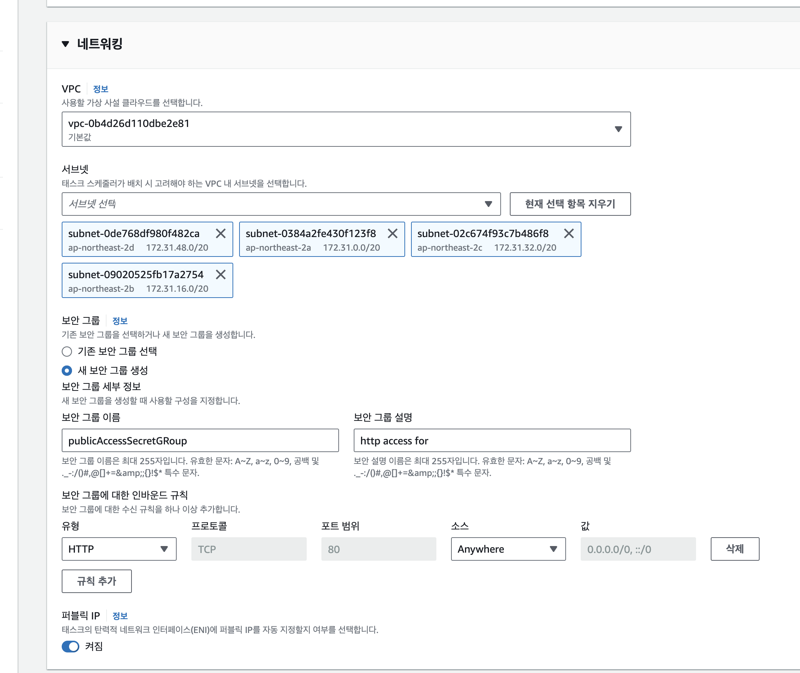
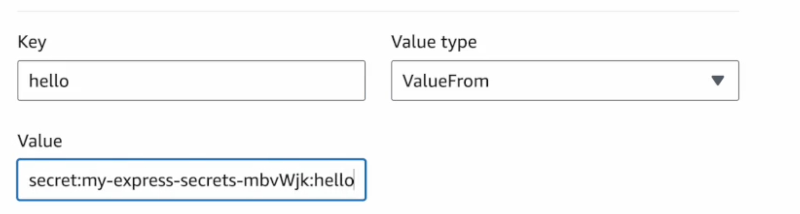
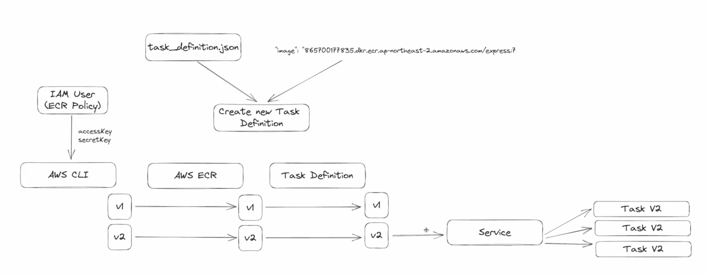
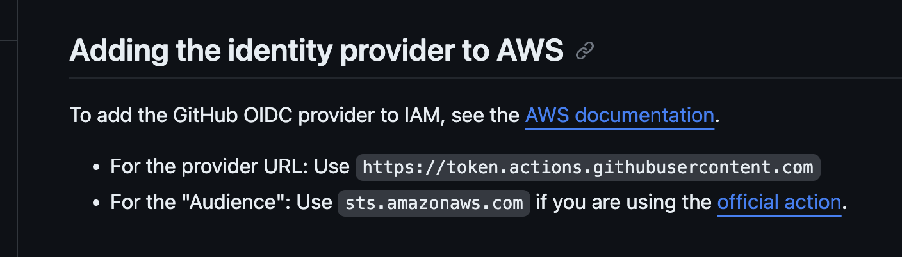
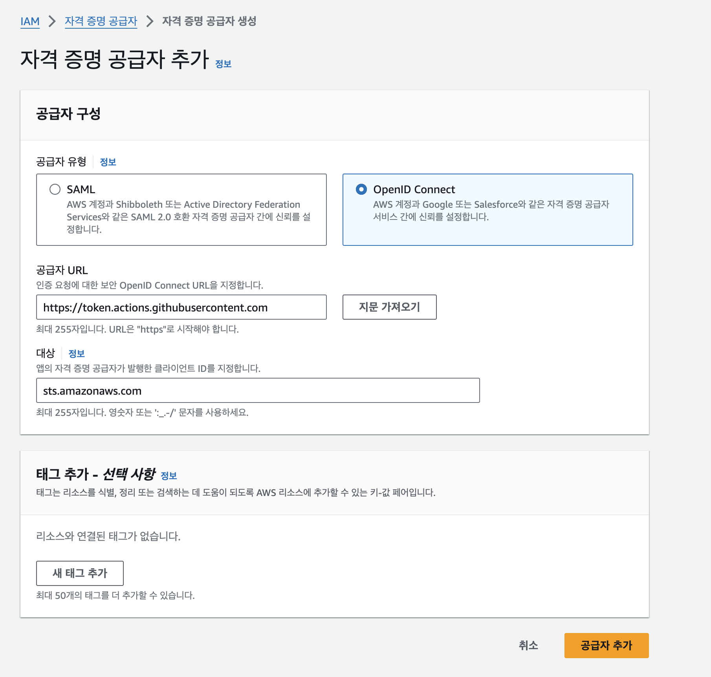
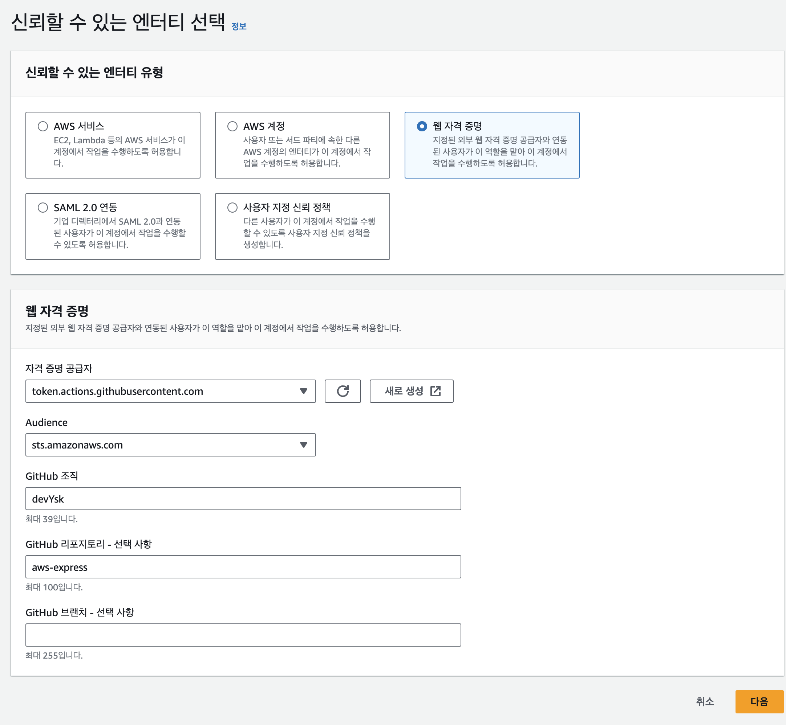
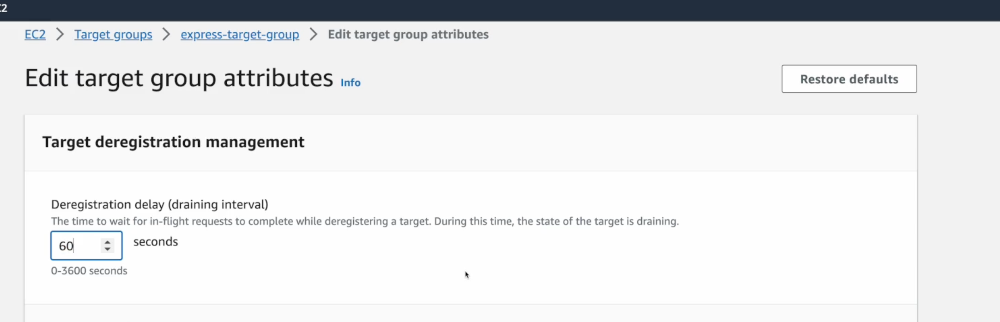

# AWS 배포 완벽가이드

* https://www.inflearn.com/course/aws-%EB%B0%B0%ED%8F%AC-%EC%99%84%EB%B2%BD%EA%B0%80%EC%9D%B4%EB%93%9C


레디스 스크립트

```yaml
version: '3.8'

# docker-compose -f docker-compose.yml up -d
services:
  ecs-redis:
    container_name: ecs-redis
    environment:
      - TZ=Asia/Seoul
#      - ALLOW_EMPTY_PASSWORD=yes
    image: redis:latest
    ports:
      - "6379:6379"
#    command: redis-server --requirepass cms --port 6379
```


# 레디스 고가용성을 위한 설치

* https://redis.io/docs/install/install-redis/install-redis-on-linux/

레디스 원격 접속

```sh
redis-cli -h 아이피
```

만약 아래와 같은 문구가 나오면

```
Could not connect to Redis at xxx.xxx.xxx.xxx:6379: Connection refused

```

1. 우분투 방화벽 설정

```sh
ufw allow 6379
```


2. bind 지시문을 찾아 주석을 해제하거나 bind 작성 

```sh
sudo su
cd /etc/redis
vi redis.conf
```

```sh
# bind 192.168.1.100 10.0.0.1     # listens on two specific IPv4 addresses
# bind 127.0.0.1 ::1              # listens on loopback IPv4 and IPv6
 bind * -::*# like the default, all available interfaces << 해제
```

이거 하거나 

```sh
bind 0.0.0.0 
```

* 추가한다

재시작

```
sudo service redis-server restart
```


**또는 아래처럼도 가능**

```sh
sudo systemctl status redis-server
● redis-server.service - Advanced key-value store
     Loaded: loaded (/lib/systemd/system/redis-server.service; disabled; vendor preset: en>
     Active: active (running) since Sat 2024-01-20 05:48:10 UTC; 3min 15s ago
       Docs: http://redis.io/documentation,
             man:redis-server(1)
   Main PID: 3008 (redis-server)
     Status: "Ready to accept connections"
      Tasks: 6 (limit: 516)
     Memory: 3.2M
        CPU: 373ms
     CGroup: /system.slice/redis-server.service
             └─3008 "/usr/bin/redis-server 0.0.0.0:6379" "" "" "" "" "" "" "" "" ""
```

* /lib/systemd/system/redis-server.service 부분을 체크
* cat /lib/systemd/system/redis-server.service를 보면 /etc/redis/redis.conf 파일을 참조중이다.

```sh
1. 레디스 다운
sudo systemctl stop redis-server

redis-server --daemonisze yes --requirepass prod1234
- 로그인 : auth prod1234
```


* sudo vi /etc/redis/redis.conf  


레디스 암호설정

```
/etc/redis.conf 파일에서 requirepass에 원하는 패스워드를 설정한다.
기본적으로는 requirepass가 주석 처리되어있다.
```


# docker graceful shutdown

* SIGTERM, SIGINT 

* **SIGTERM (Signal Terminate, 15)**: 이 시그널은 프로세스에게 "정상적으로 종료하라"고 알리는 신호
* **SIGINT (Signal Interrupt, 2)**: 이 시그널은 주로 사용자가 키보드 인터럽트(Ctrl+C)를 통해 발생. 즉시 종료

docker stop [containerId]를 하면 즉시 shutdown되므로 이때 signal을 애플리케이션에 전달하면 된다.


특정 task에 public Ip를 이용해서 접속하고 싶으면 새 보안그룹을 생성한다. 




ECS 로드밸런서와 ECS 서비스(테스크)들의 시큐리티 그룹을 같게 만들어야 통신할 수 있다.

default 보안그룹을 수정하지 말고, ecs 테스크에서 정의한 security 그룹을 추가한다. 


## ECR 만들기

* https://ap-northeast-2.console.aws.amazon.com/ecr/private-registry?region=ap-northeast-2
* 생성된 URI로 푸시해야 한다.

```
1. 인증 토큰을 검색하고 레지스트리에 대해 Docker 클라이언트를 인증합니다.

aws ecr get-login-password --region ap-northeast-2 | docker login --username AWS --password-stdin 905418426802.dkr.ecr.ap-northeast-2.amazonaws.com

2. 다음 명령을 사용하여 도커 이미지를 빌드합니다.

docker build -t express .

3. 빌드가 완료되면 이미지에 태그를 지정하여 이 리포지토리에 푸시
docker tag express:latest 905418426802.dkr.ecr.ap-northeast-2.amazonaws.com/express:latest

4. docker push 905418426802.dkr.ecr.ap-northeast-2.amazonaws.com/express:latest
```


ECR 푸시 IAM 유저 필요 권한

* https://docs.aws.amazon.com/AmazonECR/latest/userguide/image-push.html


## AWS CLI 설치

* https://docs.aws.amazon.com/ko_kr/cli/latest/userguide/getting-started-install.html

* github action aws cli : https://github.com/aws-actions

```yaml
name: Push Docker image to ECR

on:
  push:
    branches:
      - main  # 또는 푸시하고 싶은 브랜치

jobs:
  build-and-push:
    runs-on: ubuntu-latest
    steps:
    - name: Checkout repository
      uses: actions/checkout@v2

    - name: Configure AWS credentials
      uses: aws-actions/configure-aws-credentials@v1
      with:
        aws-access-key-id: ${{ secrets.AWS_ACCESS_KEY_ID }}
        aws-secret-access-key: ${{ secrets.AWS_SECRET_ACCESS_KEY }}
        aws-region: ${{ secrets.AWS_REGION }}

    - name: Login to Amazon ECR
      id: login-ecr
      uses: aws-actions/amazon-ecr-login@v1

    - name: Build, tag, and push image to Amazon ECR
      env:
        ECR_REGISTRY: ${{ steps.login-ecr.outputs.registry }}
        IMAGE_TAG: latest  # 또는 다른 태그
      run: |
        IMAGE_REPO_NAME=my-ecr-repo  # ECR 리포지토리 이름 변경
        docker build -t $IMAGE_REPO_NAME:$IMAGE_TAG .
        docker tag $IMAGE_REPO_NAME:$IMAGE_TAG $ECR_REGISTRY/$IMAGE_REPO_NAME:$IMAGE_TAG
        docker push $ECR_REGISTRY/$IMAGE_REPO_NAME:$IMAGE_TAG

    - name: Verify pushed image
      run: |
        aws ecr describe-images --repository-name $IMAGE_REPO_NAME --image-ids imageTag=$IMAGE_TAG

```


### AWS CLI second 프로파일 생성

```sh
aws configure --profile 프로파일명
ex)
aws configure --profile second
```

**환경 변수 설정** (선택 사항): 특정 세션 또는 쉘에서 이 프로파일을 사용하려면, `AWS_PROFILE` 환경 변수를 설정할 수 있습니다.

```
export AWS_PROFILE=second
```

이렇게 하면 해당 세션에서는 'second' 프로파일이 기본적으로 사용

ecr 사용시

```sh
aws ecr get-login-password --region ap-northeast-2 --profile 프로파일명 | docker login --username AWS --password-stdin 레포 URI
```


ECS에서 내부 컨테이너 연결시

* cluster -> 구성 및 네트워킹(configuration) -> ServiceConnectServices의 프로토콜 빼고 가져와서 환경변수로 연결한다.

* 이후 service 생성시 서비스 연결 켜기 -> 클라이언트 or 클라이언트 및 서버 선택


# Aws Secrets Manager를 이용한 환경 변수 관리

* https://ap-northeast-2.console.aws.amazon.com/secretsmanager/home?region=ap-northeast-2#

AWS Secrets Manager는 AWS(Amazon Web Services)에서 제공하는 서비스로, 소프트웨어 애플리케이션에서 사용하는 중요한 정보(예: 데이터베이스 비밀번호, API 키, 액세스 토큰 등)를 안전하게 관리할 수 있게 해줍니다

### 1. **비밀 관리**

- **중앙 집중식 관리**: 중요한 애플리케이션 비밀을 한 곳에서 관리할 수 있습니다. 이를 통해 애플리케이션 코드나 설정 파일에서 민감한 정보를 제거하여 보안을 강화할 수 있습니다.
- **비밀의 보안 저장**: 비밀은 암호화된 형태로 저장되며, AWS의 엄격한 보안 표준에 따라 관리됩니다.

### 2. **액세스 제어 및 감사**

- **세분화된 권한 관리**: AWS Identity and Access Management(IAM)을 사용하여 비밀에 대한 액세스 권한을 세밀하게 제어할 수 있습니다. 이를 통해 필요한 사용자와 애플리케이션만이 비밀에 접근할 수 있습니다.
- **감사 및 모니터링**: 비밀에 대한 액세스 시도와 변경 사항을 기록하고 모니터링할 수 있습니다. AWS CloudTrail을 통해 이러한 활동의 감사 로그를 보관할 수 있습니다.

### 3. **자동 비밀 회전**

- **비밀 회전 지원**: 정기적으로 비밀을 자동으로 변경(회전)하는 기능을 지원합니다. 이를 통해 보안을 강화하고, 비밀이 노출되었을 때의 위험을 줄일 수 있습니다.
- **서드파티 통합**: 여러 서드파티 서비스와의 통합을 지원하여, 이러한 서비스들의 비밀도 관리할 수 있습니다.

### 4. **간편한 통합**

- **애플리케이션 통합**: AWS SDK 및 CLI를 사용하여 애플리케이션과 쉽게 통합할 수 있습니다. 이를 통해 애플리케이션에서 필요한 비밀을 실시간으로 검색할 수 있습니다.
- **다양한 AWS 서비스와의 호환성**: Amazon RDS, Amazon Redshift, Amazon DocumentDB와 같은 AWS 서비스와의 통합을 지원합니다.

### 5. **사용 용이성**

- AWS 콘솔, AWS CLI 또는 AWS SDK를 통해 Secrets Manager를 쉽게 사용할 수 있습니다. 사용자는 웹 인터페이스를 통해 비밀을 생성, 관리 및 삭제할 수 있습니다.

### 사용 사례

- 데이터베이스 접속 정보 관리
- 서드파티 API 키 관리
- 애플리케이션 구성 정보 관리

AWS Secrets Manager는 Spring Cloud Config와 통합하여 사용할 수 있습니다


ECS -> Task Definition -> 환경변수 추가해서 사용할 수 있다.

key 는 지정한 키, value type(값 유형)은 Value FRom)어디서부터) 이고 value에는 arn값~::key값을 넣어주면 된다  




# ECS 배포



도커 이미지는 github commit id로 추가한다. 


## OIDC OpenId Connect로 안전하게 AWS CLI 로그인 해주기

https://docs.github.com/en/actions/deployment/security-hardening-your-deployments/configuring-openid-connect-in-amazon-web-services

* OIDC (OpenID Connect)는 인증을 위한 개방형 표준 프로토콜. OAuth 2.0 프로토콜을 기반으로 하며, 사용자의 신원을 확인하는 데에 사용
* OIDC를 사용하면, 사용자는 하나의 계정으로 여러 애플리케이션 및 서비스에 로그인할 수 있으며, 이를 통해 보다 편리하고 안전한 인증 경험을 제공받을 수 있다.

### 장점

1. **단일 로그인 (Single Sign-On, SSO):** 사용자는 여러 AWS 서비스나 애플리케이션에 접근하기 위해 다양한 로그인 정보를 기억할 필요 없이, OIDC를 통해 하나의 계정 정보로 로그인할 수 있습니다.
2. **보안 강화:** OIDC는 고급 보안 기능을 제공합니다. 예를 들어, 토큰 기반 인증은 사용자의 신원을 보다 안전하게 관리할 수 있게 해줍니다.
3. **중앙 집중식 사용자 관리:** 사용자의 인증 정보를 중앙에서 관리할 수 있어, 조직 내에서 사용자 계정 및 권한 관리가 용이합니다.
4. **규정 준수:** 많은 규정 및 표준들이 인증 방식에 대한 엄격한 요구 사항을 가지고 있는데, OIDC는 이러한 요구 사항을 충족하는 데 도움이 될 수 있습니다.

### 단점

1. **구현 복잡성:** OIDC를 처음 설정하고 구성하는 과정은 복잡할 수 있으며, 기술적 지식이 필요합니다.
2. **종속성 문제:** 외부 ID 공급자(IDP)에 대한 의존도가 높아지면, 해당 공급자의 장애가 발생했을 때 로그인 및 인증에 문제가 생길 수 있습니다.
3. **성능 영향:** 인증 과정이 추가되면서 네트워크 지연이나 다른 성능 저하가 발생할 수 있습니다.
4. **보안 위협:** 잘못 구현된 OIDC는 보안 취약점을 야기할 수 있으며, 이는 조직의 데이터 보안에 위험을 초래할 수 있습니다.


github의 특정 repository의 action에만 허용을 해주는 기능이다.

1. identity provider 생성(자격증명공급자) - https://us-east-1.console.aws.amazon.com/iam/home?region=ap-northeast-2#/identity_providers
2. 공급자 추가 

공급자 url과 대상은 아래 페이지에서 입력한다.

* https://docs.github.com/en/actions/deployment/security-hardening-your-deployments/configuring-openid-connect-in-amazon-web-services#adding-the-identity-provider-to-aws





3. 지문을 가져온다음 프로바이더 생성한다.
4. 공급자에 들어가서 역할 할당 버튼을 누른다. (role을 할당해야한다.)
5. 웹 자격증명을 선택하고 Github 조직에는 조직명, repository에는 repository명(선택), branch에는 branch명 입력( 선택)



6. role에 policy를 지정해주고, 역할을 생성한다. `github 조직명 대소문자 구분하므로 주의`

```yaml
env:
  AWS_REGION: ap-northeast-2

permissions:
  id-token: write # This is required for requesting the JWT
  contents: read  # This is required for actions/checkout


jobs:
  deploy:
    runs-on: ubuntu-latest
    steps:
      - name: Configure Aws credentials
        uses: aws-actions/configure-aws-credentials@v4
        with:
          role-to-assume: arn:aws:iam::905418426802:role/github_devysk_express_oidc
          role-session-name: sampleSessionName
          aws-region: ${{ env.AWS_REGION }}
```


## ECS 배포하기

https://docs.github.com/en/actions/deployment/deploying-to-your-cloud-provider/deploying-to-amazon-elastic-container-service


1. ecs 접속하여 task definitions의 json을 copy
2. 프로젝트에 task_definition.json 생성 - 이때 containerDefinitions.image는 지운다. 

```yaml
name: testAndDeploy


on:
  push:
    branches:
      - main

env:
  AWS_REGION: ap-northeast-2
  ECR_REPOSITORY: express
  ECS_SERVICE: my-express
  ECS_CLUSTER: my-express-cluster
  ECS_TASK_DEFINITION: ./task_definition.json
  CONTAINER_NAME: express

permissions:
  id-token: write # This is required for requesting the JWT
  contents: read  # This is required for actions/checkout


jobs:
  test:
    runs-on: ubuntu-22.04
    steps:
      - name: Checkout repository
        uses: actions/checkout@v3
      - name: Build And test with Docker compose
        run: docker-compose -f docker-compose.test.yml up --build --abort-on-container-exit
  deploy:
    runs-on: ubuntu-latest
    steps:
      - name: Checkout
        uses: actions/checkout@v4

      - name: Configure Aws credentials
        uses: aws-actions/configure-aws-credentials@v4
        with:
          role-to-assume: arn:aws:iam::905418426802:role/github_devysk_express_oidc
          role-session-name: sampleSessionName
          aws-region: ${{ env.AWS_REGION }}

      - name: Login to Amazon ECR
        id: login-ecr
        uses: aws-actions/amazon-ecr-login@62f4f872db3836360b72999f4b87f1ff13310f3a

      - name: Build, tag, and push image to Amazon ECR
        id: build-image
        env:
          ECR_REGISTRY: ${{ steps.login-ecr.outputs.registry }}
          IMAGE_TAG: ${{ github.sha }}
        run: |
          # Build a docker container and
          # push it to ECR so that it can
          # be deployed to ECS.
          docker build -t $ECR_REGISTRY/$ECR_REPOSITORY:$IMAGE_TAG .
          docker push $ECR_REGISTRY/$ECR_REPOSITORY:$IMAGE_TAG
          echo "image=$ECR_REGISTRY/$ECR_REPOSITORY:$IMAGE_TAG" >> $GITHUB_OUTPUT

      - name: Fill in the new image ID in the Amazon ECS task definition
        id: task-def
        uses: aws-actions/amazon-ecs-render-task-definition@c804dfbdd57f713b6c079302a4c01db7017a36fc
        with:
          task-definition: ${{ env.ECS_TASK_DEFINITION }}
          container-name: ${{ env.CONTAINER_NAME }}
          image: ${{ steps.build-image.outputs.image }}

      - name: Deploy Amazon ECS task definition
        uses: aws-actions/amazon-ecs-deploy-task-definition@df9643053eda01f169e64a0e60233aacca83799a
        with:
          task-definition: ${{ steps.task-def.outputs.task-definition }}
          service: ${{ env.ECS_SERVICE }}
          cluster: ${{ env.ECS_CLUSTER }}
          wait-for-service-stability: true

# 어떤 role을 부여받을것인가. 자격증명공급자의 생성한 role의 arn을 입력.
```


## 배포 속도 줄이기

ec2 로드밸런서를 사용중이라면 ec2-> target groups -> 그룹명 -> Edit target group attributes에서 Draning 타임을 줄여주면 된다. (60초 정도)

* 이 값은 graceful과 비슷하게 적용하면 좋다. 


