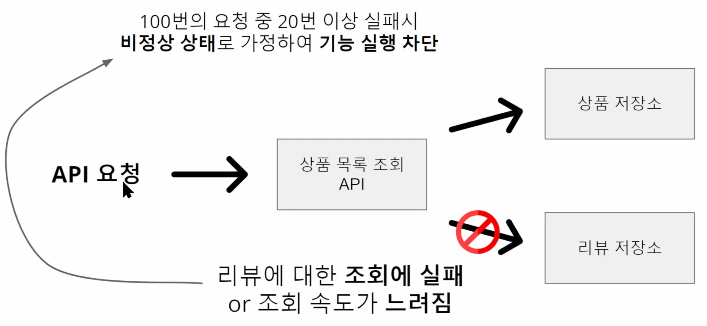

# 인프런 - 장애없는 서비스를 만들기 위한 Resiliece4j

[toc]

장애가 전파될 가능성이 있는 부분을 식별할 수 있는 목적

장애 전파 가능성을 개선할 수 있다.


Resilience -> 회복 탄력성, 장애 내성 

서비스의 실패란? -> 장애이다. 


영향을 받더라도 최소한의 영향을 받도록 도와준다.


# Resilience4j

* https://godekdls.github.io/Resilience4j/contents/ - 한글 공식문서
* https://github.com/resilience4j/resilience4j


Nextflix의 Hystrix를 대체하고 해당 저장소에서도 Resilicnce4j를 사용하라고 권장

6가지 핵심 기능을 제공

* CircuitBreaker

* Bulkhead

* RateLimiter

* Retry

* TimeLimiter

* Cache


강의에서는 CircuitBreaker + Retry 를 주로 다룬다.


서버가 너무 트래픽을 많이 받아서 회복을 위해 트래픽을 잠시 차단시켜야 한다면? -> CircuitBreaker

* 원래 기능을 대체할 수 있는 다른 기능인 fallback을 실행한다.
* Retry를 해도 해결되는 문제가 아닌 경우.

* 써킷브레이커는 회로 차단기이다.

## Resilience4j를 사용하면 적절한 상황


Retry -> 작업이 일시적으로 실패했다면 사용한다.

고려해야 할 요소

* 몇번까지 재시도 할것인가?
* 재시도 간격은 얼마나 길게?
* 어떤 상황을 호출 실패로 간주할 것인가? 

> 일시적 실패로 간주하는 경우의 대부분은 네트워크 통신이 좀 자주 있을것이다.

* NPE는 일시적인 실패가 아니다. 


* https://d2.naver.com/helloworld/6070967 예시에 대한 좋은 자료 


# Resilience4j 시작하기

1.7 브랜치 접속

* https://github.com/resilience4j/resilience4j/tree/1.7

```groovy
dependencies {
    // AOP를 사용하기 위한 스프링 부트 스타터
    implementation 'org.springframework.boot:spring-boot-starter-aop'

    // 애플리케이션의 상태를 체크하기 위한 스프링 부트 액추에이터
    implementation 'org.springframework.boot:spring-boot-starter-actuator'

    // Resilience4j를 스프링 부트 2와 함께 사용하기 위한 스타터
    implementation "io.github.resilience4j:resilience4j-spring-boot2:$resilience4jVersion"

    // Resilience4j의 모든 모듈을 포함하는 의존성
    implementation "io.github.resilience4j:resilience4j-all:$resilience4jVersion"
}

ext {
    resilience4jVersion = '1.7.0'
}
```

대부분 스프링 AOP를 사용한다.


# Retry

```java
package com.example.resilience4jdemo.a_retry;

import com.example.resilience4jdemo.exception.IgnoreException;
import com.example.resilience4jdemo.exception.RetryException;
import io.github.resilience4j.retry.annotation.Retry;
import lombok.extern.slf4j.Slf4j;
import org.springframework.stereotype.Service;

@Slf4j
@Service
public class RetryService {

    private static final String SIMPLE_RETRY_CONFIG = "simpleRetryConfig";
    // config의 이름이 중요하다. application.yml에 들어있음 

    @Retry(name = SIMPLE_RETRY_CONFIG, fallbackMethod = "fallback")
    public String process(String param) {
        return callAnotherServer(param);
    }

    private String fallback(String param, Exception ex) {
        // retry에 전부 실패해야 fallback이 실행
        log.info("fallback! your request is " + param);
        return "Recovered: " + ex.toString();
    }

    private String callAnotherServer(String param) {
        // retry exception은 retry된다.
        throw new RetryException("retry exception");
        // ignore exception은 retry하지 않고 바로 예외가 클라이언트에게 전달된다.
//        throw new IgnoreException("ignore exception");
    }

};
```

* applicaition.yamldㅢ simpleRetryConfig를 봐야한다.


```yaml
spring:
  application.name: resilience4j-demo-by-foo

server:
  port: 8080

resilience4j.retry:
  configs:
    default:
      maxAttempts: 3
      waitDuration: 1000
      retryExceptions:
        - com.example.resilience4jdemo.exception.RetryException   # retryExceptions에 지정된 예외는 재시도
      ignoreExceptions:
        - com.example.resilience4jdemo.exception.IgnoreException  # retryExceptions에 지정되지 않은 예외는 ignoreExceptions로 처리됨
  instances:
    simpleRetryConfig:
      baseConfig: default
```

* maxAttempts : 3번까지 재시도
* waiteDuration: 1초씩 대기 

다음 빈의 역할이 뭘까?

```java
@Bean
public RegistryEventConsumer<Retry> myRegistryEventConsumer() {

        
  return new RegistryEventConsumer<Retry>() {
  
    @Override
    
    public void onEntryAddedEvent(EntryAddedEvent<Retry> entryAddedEvent) {
    
      log.info("RegistryEventConsumer.onEntryAddedEvent");  
      entryAddedEvent.getAddedEntry()
        .getEventPublisher()
        .onEvent(event -> log.info(event.toString())); // 이벤트 발생시 호출 
      	// 다른 행동도 가능하지 않을까? 
           
    }
    
    @Override         
    public void onEntryRemovedEvent(EntryRemovedEvent<Retry> entryRemoveEvent) {   
      log.info("RegistryEventConsumer.onEntryRemovedEvent"); 
    }

    @Override
    public void onEntryReplacedEvent(EntryReplacedEvent<Retry> entryReplacedEvent) {
      log.info("RegistryEventConsumer.onEntryReplacedEvent");         
    }
        
  };
   
}
```

* 재시도를 몇번째 했는지 알려주는 빈이다. 등록 안하면 안알려준다
* 이벤트를 이용해서 할 수 있는 무언가들이 있을거다. 

```
2023-11-23 00:40:39.461  INFO 50142 --- [nio-8080-exec-3] c.e.r.a_retry.RetryDemoApplication       : 2023-11-23T00:40:39.461515+09:00[Asia/Seoul]: Retry 'simpleRetryConfig', waiting PT1S until attempt '1'. Last attempt failed with exception 'com.example.resilience4jdemo.exception.RetryException: retry exception'.
2023-11-23 00:40:40.468  INFO 50142 --- [nio-8080-exec-3] c.e.r.a_retry.RetryDemoApplication       : 2023-11-23T00:40:40.468246+09:00[Asia/Seoul]: Retry 'simpleRetryConfig', waiting PT1S until attempt '2'. Last attempt failed with exception 'com.example.resilience4jdemo.exception.RetryException: retry exception'.
2023-11-23 00:40:41.478  INFO 50142 --- [nio-8080-exec-3] c.e.r.a_retry.RetryDemoApplication       : 2023-11-23T00:40:41.475644+09:00[Asia/Seoul]: Retry 'simpleRetryConfig' recorded a failed retry attempt. Number of retry attempts: '3'. Giving up. Last exception was: 'com.example.resilience4jdemo.exception.RetryException: retry exception'.

```

만약 리트라이 하지 않고 바로 클라이언트한테 예외를 던지고 싶으면?

```java

import com.example.resilience4jdemo.exception.IgnoreException;
import com.example.resilience4jdemo.exception.RetryException;

private String callAnotherServer(String param) {
    // retry exception은 retry된다.
     throw new RetryException("retry exception");
    // ignore exception은 retry하지 않고 바로 예외가 클라이언트에게 전달된다.
    throw new IgnoreException("ignore exception");
}
```

yml 등에 설정도 해줘야 한다.

```yaml
resilience4j.retry:
  configs:
    default:
      maxAttempts: 3
      waitDuration: 1000
      retryExceptions:
        - com.example.resilience4jdemo.exception.RetryException   // here
        # retryExceptions에 지정된 예외는 재시도
      ignoreExceptions:
        - com.example.resilience4jdemo.exception.IgnoreException  // here
        # retryExceptions에 지정되지 않은 예외는 ignoreExceptions로 처리됨
  instances:
    simpleRetryConfig:
      baseConfig: default
```

https://resilience4j.readme.io/docs/retry 

설정이 맣으니 꼭 보자 

## Retry 코드 직접 만들어보기

```java
@Slf4j
@Service
public class RetryService {

    private static final int MAX_ATTEMPS = 3;
    private static final int WAIT_DURATION = 1000;

    public String process(String param) throws InterruptedException {
        String result = null;

        int retryCount = 0;

        while (retryCount++ < MAX_ATTEMPS) {
            try {
                result = callAnotherServer(param);
            } catch (RetryException ex) {
                if (retryCount == MAX_ATTEMPS) {
                    return fallback(param, ex);
                }

                Thread.sleep(WAIT_DURATION);
            }

            if (result != null)
                break;
        }

        return result;
    }

    private String fallback(String param, Exception ex) {
        // retry에 전부 실패해야 fallback이 실행
        log.info("fallback! your request is " + param);
        return "Recovered: " + ex.toString();
    }

    private String callAnotherServer(String param) {
        // retry exception은 retry된다.
        throw new RetryException("retry exception");
        // ignore exception은 retry하지 않고 바로 예외가 클라이언트에게 전달된다.
//        throw new IgnoreException("ignore exception");
    }

}
```


# CircuitBreaker 알아보기



dㅙ 서킷브레이커를 쓸까?


많은 부하를 받은 특정 서비스가 회복될동안 트래픽을 차단하여 회복에 도움이 된다. 

* ex) -> 특정 서비스가 안되면 사용자가 왜 안되냐고 계속 호출할 수 있으므로 장애를 전파시킬 수 있게 되는것 

## 서킷브레이커의 3가지 상태


* close : 정상 상태
  * 트래픽이 들어와서 서킷이 close 된 상태


* open : 비정상 트래픽으로 차단 
  * 트래픽을 막고 서킷이 open된 상태 


* halfOpen : 차단되었던 상태에서 정상으로 돌아갈 수 있는지 확인하는 단계


시도때도없이 서킷 을 OPEN을 그건 비정상 상태

* 확실하게 에러인 경우만 판별하여 해야한다.

```java
@RestController
@RequestMapping(value = "/")
public class CircuitBreakerController {

    private final CircuitBreakerService circuitBreakerService;

    public CircuitBreakerController(CircuitBreakerService circuitBreakerService) {
        this.circuitBreakerService = circuitBreakerService;
    }


    @GetMapping("/api-call")
    public String apiCall(@RequestParam String param) throws InterruptedException {
        return circuitBreakerService.process(param);
    }

};


@Slf4j
@Service
public class CircuitBreakerService {

    private static final String SIMPLE_CIRCUIT_BREAKER_CONFIG = "simpleCircuitBreakerConfig";

    @CircuitBreaker(name = SIMPLE_CIRCUIT_BREAKER_CONFIG, fallbackMethod = "fallback")
    public String process(String param) throws InterruptedException {
        return callAnotherServer(param);
    }

    private String fallback(String param, Exception ex) {
        // fallback은 ignoreException이 발생해도 실행된다.
        log.info("fallback! your request is " + param);
        return "Recovered: " + ex.toString();
    }

    private String callAnotherServer(String param) throws InterruptedException {
        if ("a".equals(param))
            throw new RecordException("record exception");
        else if ("b".equals(param))
            throw new IgnoreException("ignore exception");
        else if ("c".equals(param)) // 3초 이상 걸리는 경우도 실패로 간주
            Thread.sleep(4000);

        return param;
    }

};

```


## 서킷브레이커의 상태변화를 감지하는 이벤트 Bean

```java

import io.github.resilience4j.circuitbreaker.CircuitBreaker;

@Slf4j
@SpringBootApplication
public class CircuitBreakerDemoApplication {

    public static void main(String[] args) {
        SpringApplication.run(CircuitBreakerDemoApplication.class, args);
    }

    @Bean
    public RegistryEventConsumer<CircuitBreaker> myRegistryEventConsumer() {

        return new RegistryEventConsumer<CircuitBreaker>() {
            @Override
            public void onEntryAddedEvent(EntryAddedEvent<CircuitBreaker> entryAddedEvent) {
                log.info("RegistryEventConsumer.onEntryAddedEvent");
                entryAddedEvent.getAddedEntry()
                  .getEventPublisher()
                  .onEvent(event -> log.info(event.toString()));
                entryAddedEvent.getAddedEntry()
                  .getEventPublisher()
                  .onFailureRateExceeded(event -> log.info("{}", event.getEventType()));

            }

            @Override
            public void onEntryRemovedEvent(EntryRemovedEvent<CircuitBreaker> entryRemoveEvent) {
                log.info("RegistryEventConsumer.onEntryRemovedEvent");
            }

            @Override
            public void onEntryReplacedEvent(EntryReplacedEvent<CircuitBreaker> entryReplacedEvent) {
                log.info("RegistryEventConsumer.onEntryReplacedEvent");
            }
        };
    }

}

```

## 서킷브레이커 설정

```yaml
resilience4j.circuitbreaker:
  configs:
    default:
      slidingWindowType: COUNT_BASED
      minimumNumberOfCalls: 7                          
      # 최소 7번까지는 무조건 CLOSE로 가정하고 호출한다.
      slidingWindowSize: 10                            
      # (minimumNumberOfCalls 이후로는) 10개의 요청을 기준으로 판단한다.
      waitDurationInOpenState: 10s                     
      # OPEN 상태에서 HALF_OPEN으로 가려면 얼마나 기다릴 것인가?

      failureRateThreshold: 40                         
      # slidingWindowSize 중 몇 %가 recordException이면 OPEN으로 만들 것인가?

      slowCallDurationThreshold: 3000                  
      # 몇 ms 동안 요청이 처리되지 않으면 실패로 간주할 것인가?
      
      slowCallRateThreshold: 60                        
      # slidingWindowSize 중 몇 %가 slowCall이면 OPEN으로 만들 것인가?

      permittedNumberOfCallsInHalfOpenState: 5        
      # HALF_OPEN 상태에서 5번까지는 CLOSE로 가기위해 호출한다.
      
      automaticTransitionFromOpenToHalfOpenEnabled: true 
      # OPEN 상태에서 자동으로 HALF_OPEN으로 갈 것인가?

      eventConsumerBufferSize: 10                      
      # actuator를 위한 이벤트 버퍼 사이즈

      recordExceptions:
        - com.example.resilience4jdemo.exception.RecordException
      ignoreExceptions:
        - com.example.resilience4jdemo.exception.IgnoreException
  instances:
    simpleCircuitBreakerConfig:
      baseConfig: default
```

* https://resilience4j.readme.io/docs/circuitbreaker

```
2023-11-23 01:34:01.888  INFO 28653 --- [nio-8080-exec-8] c.e.r.c.CircuitBreakerDemoApplication    : FAILURE_RATE_EXCEEDED
2023-11-23 01:34:01.897  INFO 28653 --- [nio-8080-exec-8] c.e.r.c.CircuitBreakerDemoApplication    : 2023-11-23T01:34:01.897600+09:00[Asia/Seoul]: CircuitBreaker 'simpleCircuitBreakerConfig' changed state from CLOSED to OPEN

-> 서킷브레이커 OPEN

2023-11-23 01:34:30.829  INFO 28653 --- [ransitionThread] c.e.r.c.CircuitBreakerDemoApplication    : 2023-11-23T01:34:30.828998+09:00[Asia/Seoul]: CircuitBreaker 'simpleCircuitBreakerConfig' changed state from OPEN to HALF_OPEN

-> 오류가 줄어드니 HALF_OPEN


2023-11-23 01:38:13.873  INFO 28653 --- [nio-8080-exec-7] c.e.r.c.CircuitBreakerDemoApplication    : 2023-11-23T01:38:13.873315+09:00[Asia/Seoul]: CircuitBreaker 'simpleCircuitBreakerConfig' changed state from HALF_OPEN to CLOSED

-> 정상 5로 설정
```

확인사항

1. CLOSE 상태에서 OPEN 상태로 전환되는 것

2. OPEN 상태에서 기능 실행이 차단 되는 것

3. OPEN 상태에서 HALF_OPEN 상태로 바뀌는 것

4. HALF_OPEN 상태에서 계속 성공시 CLOSE 상태로 바뀌는 것

5. HALF_OPEN 상태에서 계속 실패시 OPEN 상태로 바뀌는 것

6. 실행 시간이 오래 걸린 것도 실패로 간주하여 OPEN으로 상태가 바뀌는 것

recordExceptions -> 서킷브레이커가 실패로 간주할 예외 

ignoreExceptions -> 서킷브레이커가 동작하는데 영향은 안줌 그러나 폴백이 실행됌 


# CircuitBreaker 관련 주요 설정들

```yml
resilience4j.circuitbreaker:
  configs:
    default:
      slidingWindowType: COUNT_BASED
      minimumNumberOfCalls: 7                                   # 최소 7번까지는 무조건 CLOSE로 가정하고 호출한다.
      slidingWindowSize: 10                                     # (minimumNumberOfCalls 이후로는) 10개의 요청을 기준으로 판단한다.
      waitDurationInOpenState: 10s                              # OPEN 상태에서 HALF_OPEN으로 가려면 얼마나 기다릴 것인가?

      failureRateThreshold: 40                                  # slidingWindowSize 중 몇 %가 recordException이면 OPEN으로 만들 것인가?

      slowCallDurationThreshold: 3000                           # 몇 ms 동안 요청이 처리되지 않으면 실패로 간주할 것인가?
      slowCallRateThreshold: 60                                 # slidingWindowSize 중 몇 %가 slowCall이면 OPEN으로 만들 것인가?

      permittedNumberOfCallsInHalfOpenState: 5                  # HALF_OPEN 상태에서 5번까지는 CLOSE로 가기위해 호출한다.
      automaticTransitionFromOpenToHalfOpenEnabled: true        # OPEN 상태에서 자동으로 HALF_OPEN으로 갈 것인가?

      eventConsumerBufferSize: 10                               # actuator를 위한 이벤트 버퍼 사이즈

      recordExceptions:
        - com.example.resilience4jdemo.exception.RecordException
      ignoreExceptions:
        - com.example.resilience4jdemo.exception.IgnoreException
```


## **Sliding Window Type (슬라이딩 윈도우 타입)**:

서킷 브레이커가 장애율을 계산하는 데 사용하는 슬라이딩 윈도우의 타입입니다. "count-based"나 "time-based"로 설정할 수 있습니다.


요청이 들어올때마다 하나씩 이동한다

두종류가 있다

1. count_based : 마지막 N 번의 호출을 기준으로 계산
2. time_based : 최근 N 시간 동안의 호출을 기준으로 계산

## Sliding Window Size (슬라이딩 윈도우 크기)

슬라이딩 윈도우의 크기를 정의합니다. "count-based" 윈도우에서는 호출 횟수를, "time-based" 윈도우에서는 시간을 의미합니다.

만약 100개를 지정하면, 100개의 상태를 기준으로 서킷브레이커의 상태를 변경한다 (close, open, harf-open 등)


## **Failure Rate Threshold (장애율 임계값)**

서킷 브레이커가 오픈 상태로 전환되기 전에 허용되는 호출의 실패율의 최대치입니다. 

이 값이 초과되면 서킷 브레이커는 오픈 상태로 전환됩니다.

-> 슬라이딩 윈도우에서 몇개가 실패해야 서킷을 open시킬지 결정함 (퍼센테이지 % 로)


## **Minimum Number of Calls (최소 호출 횟수)**:

 장애율을 계산하기 전에 서킷 브레이커가 고려해야 하는 최소 호출 횟수입니다. 

이 값은 장애율이 통계적으로 유의미하도록 하기 위해 설정됩니다.


슬라이딩 윈도우 사이즈 10, 임계치 70인데 sliding window가 채워지지않았다면?

* 이 5개중 4개가 실패했따면 비율상으로 80%이기 때문 open으로 바꿔야한다

근데 만약 이때, open으로 바꾸기 싫다면? minimumNumberOfCalls를 이용한다 

> 슬라이딩 윈도우보다 큰사이즈로 지정하면 의미가 없다 


##  Wait Duration In Open State (오픈 상태에서의 대기 시간

서킷 브레이커가 오픈 상태일 때, 반으로 열린 상태(Half-Open)로 전환하기 전에 대기해야 하는 시간입니다. 

이 기간 동안 모든 호출은 차단됩니다.


## **Permitted Number of Calls in Half-Open State (반 열린 상태에서 허용되는 호출 횟수)**:

 서킷 브레이커가 반으로 열린 상태일 때 허용되는 호출 횟수입니다. 이 호출들은 서비스가 다시 정상으로 돌아왔는지를 판단하기 위해 사용됩니다.

## **Automatic Transition from Open to Half-Open Enabled (오픈에서 반으로 열린 상태로의 자동 전환 활성화)**: 

이 설정이 활성화되면, 설정된 대기 시간이 지난 후 서킷 브레이커가 자동으로 오픈 상태에서 반으로 열린 상태로 전환됩니다. 그렇지 않으면, 사용자가 수동으로 상태를 전환해야 합니다.


```
resilience4j.circuitbreaker:
  configs:
    default:

      slowCallDurationThreshold: 3000                           
      # 몇 ms 동안 요청이 처리되지 않으면 실패로 간주할 것인가? -> 3초가 지나면 느린 요청으로 간주 
      slowCallRateThreshold: 60                                 
      # slidingWindowSize 중 몇 %가 slowCall이면 OPEN으로 만들 것인가?
```


https://resilience4j.readme.io/v1.7.0/docs/circuitbreaker#create-and-configure-a-circuitbreaker


# CircuitBreaker 이벤트 활용하기

https://resilience4j.readme.io/v1.7.0/docs/circuitbreaker#consume-emitted-registryevents

```java
@Bean
public RegistryEventConsumer<CircuitBreaker> myRegistryEventConsumer() {
	return new RegistryEventConsumer<>() {
		@Override
		public void onEntryAddedEvent(EntryAddedEvent<CircuitBreaker> entryAddedEvent) {
			log.info("RegistryEventConsumer.onEntryAddedEvent");
			CircuitBreaker.EventPublisher eventPublisher = entryAddedEvent.getAddedEntry()
				.getEventPublisher();
			eventPublisher.onEvent(event -> log.info("onEvent {}", event));
			eventPublisher.onSuccess(event -> log.info("onSuccess {}", event));
			eventPublisher.onCallNotPermitted(event -> log.info("onCallNotPermitted {}", event));
			eventPublisher.onError(event -> log.info("onError {}", event));
			eventPublisher.onIgnoredError(event -> log.info("onIgnoredError {}", event));
			eventPublisher.onStateTransition(event -> log.info("onStateTransition {}", event));
			eventPublisher.onSlowCallRateExceeded(event -> log.info("onSlowCallRateExceeded {}", event));
			eventPublisher.onFailureRateExceeded(event -> log.info("onFailureRateExceeded {}", event));
		}
		@Override
		public void onEntryRemovedEvent(EntryRemovedEvent<CircuitBreaker> entryRemoveEvent) {
			log.info("RegistryEventConsumer.onEntryRemovedEvent");
		}
		@Override
		public void onEntryReplacedEvent(EntryReplacedEvent<CircuitBreaker> entryReplacedEvent) {
			log.info("RegistryEventConsumer.onEntryReplacedEvent");
		}
	};
}
```

**이벤트의 종류**


## 이벤트 활용방법


각 애플리케이션에 서킷브레이커가 적용되어있다고 가정.

`eventPublisher.onStateTransition` 을 통해서버 3의 서킷브레이커 open 상태를 서버 1과 서버2로 전파할 수 있다. 

* close는 가급적 전파하지 않는게 좋다. 모두 open 상태에서 모두 Close 되면 트래픽 증가로 인해 장애가 발생할 수 있기 때문


## 어떤 예외를 RecordException로 지정할까?

임계치이상의 RecordException이 발생하면 서킷브레이커는 open 상태가 된다.

* 트래픽을 차단하기 위해 카운트등을 발생시키는 익셉션 

잘못 지정하면 오픈이 되지 않거나, 과하게 오픈이 될수도 있다. 


어떤 예외가 던져질지 식별하여 RecordException으로 등록하면 된다.

* 유효성 검사나 NulIPointerException 처럼 서킷이 열리는 것과 무관한 예외는 recordExceptions로 등록 X

* Exception이나 RuntimeException 처럼 너무 높은 수준의 예외 역시 recordExceptions로 등록 X

사용하는 라이브러리가 예외를 던져주지 않는다면?

* 예외는 아니지만 502 Bad Gateway로 응답이온다면? -> 500번대면 직접 예외를 던진다.

* slow call인경우 타임아웃을 지정하여 직접 예외 던지기. 

## fallback 활용하기 

```java
@CircuitBreaker(name = SIMPLE_CIRCUIT_BREAKER_CONFIG, fallbackMethod = "fallback")
public String process(String param) throws InterruptedException {
  return callAnotherServer(param);
}

private String fallback(String param, Exception ex) {
  // fallback은 ignoreException이 발생해도 실행된다.
  log.info("fallback! your request is " + param);
  return "Recovered: " + ex.toString();
}
```

fallback이 실행되는상황

1. Record Exception이 발생했을 때
2. Ignore Exception이 발생했을 때
3. 서킷이 OPEN되어 요청이 실행되지 않을 때

위 코드의 문제점 : Exception으로 모든 예외를 fallback으로 받고있음. -> 분리 가능

```java
@CircuitBreaker(name = SIMPLE_CIRCUIT_BREAKER_CONFIG, fallbackMethod = "fallback")
public String process(String param) throws InterruptedException {
    return callAnotherServer(param);
}

private String fallback(String param, RecordException ex) {
    log.info("RecordException fallback! your request is " + param);
    return "Recovered: " + ex.toString();
}

private String fallback(String param, IgnoreException ex) {
    log.info("IgnoreException fallback! your request is " + param);
    return "Recovered: " + ex.toString();
}

private String fallback(String param, CallNotPermittedException ex) {
    log.info("CallNotPermittedException fallback! your request is " + param);
    return "Recovered: " + ex.toString();
}
```

* 이때, 폴백으로 잡지못한 예외는 애플리케이션 밖으로 던져져서 스택으로 남고 꺼지게된다.

폴백을 이용해서 파라미터로 들어온 데이터를 이용해서 캐시된 데이터를 반환할 수도 있다.


# 액츄에이터랑 같이 사용하기

액츄에이터로 서킷브레이커의 상태를 변경할 수 있다.

```
/actuator/circuitbreakers
/actuator/circuitbreakers/{name}
/actuator/circuitbreakerevents
/actuator/circuitbreakerevents/{name}
/actuator/circuitbreakerevents/{name}/{eventType}
```

* 서킷브레이커 엔드포인트

```yaml
management.endpoints.web.exposure.include: '*'
management.endpoint.health.show-details: always

management.health.diskspace.enabled: false
management.health.circuitbreakers.enabled: true

management.metrics.tags.application: ${spring.application.name}
management.metrics.distribution.percentiles-histogram.http.server.requests: true
management.metrics.distribution.percentiles-histogram.resilience4j.circuitbreaker.calls: true
```

## API 호출로 서킷 상태 변경하기

```
/actuator/circuitbreakers/{name}
```

서킷브레이커 이름을 통해야 한다.

POST 메소드를 이용한다.

```http
POST http://localhost:8080/actuator/circuitbreakers/simpleCircuitBreakerConfig
// body
{
  "updateState" : "FORCED_OPEN"
}
```

응답

```
{
  "circuitBreakerName": "simpleCircuitBreakerConfig",
  "currentState": "FORCED_OPEN",
  "message": "simpleCircuitBreakerConfig state has been changed successfully"
}
```

애플리케이션 로그

```
c.e.r.e.CircuitBreakerDemoApplication    : onStateTransition 2023-12-31T19:08:06.656279+09:00[Asia/Seoul]: CircuitBreaker 'simpleCircuitBreakerConfig' changed state from CLOSED to FORCED_OPEN
```

액추에이터로 설정한 상태는, 자동으로 CLOSE로 가지 않으므로, API로 CLOSE로 바꿔야 한다

```
POST http://localhost:8080/actuator/circuitbreakers/simpleCircuitBreakerConfig
// body
{
  "updateState" : "CLOSE"
}
```


* FORCED_OPEN

* CLOSE
* DISABLE 


# 프록시패턴, AOP, Self Invocation

## Proxy 패턴

Proxy Pattern

프록시는 '대리자'라는 뜻을 가지고 있음

원래 객체를 대신하여 요청을 받아, 원래 객체를 호출하기 전이나 후에 특정 로직을 추가하여 실행 가능

  


## AOP

관점 지향 프로그래밍은

어떤 로직을 핵심적인 로직과 부가적인 로직으로 나누고, 반복되는 부가적인 로직을 분리하여 감추는 것

\- 어떤 로직에서 부가적인 로직이 없어지고 핵심적인 로직만 남기 때문에 핵심적인 로직의 가독성이 올라감


## Self Invocation

AOP가 동작하지 않는 문제


Self Invocation 예제

