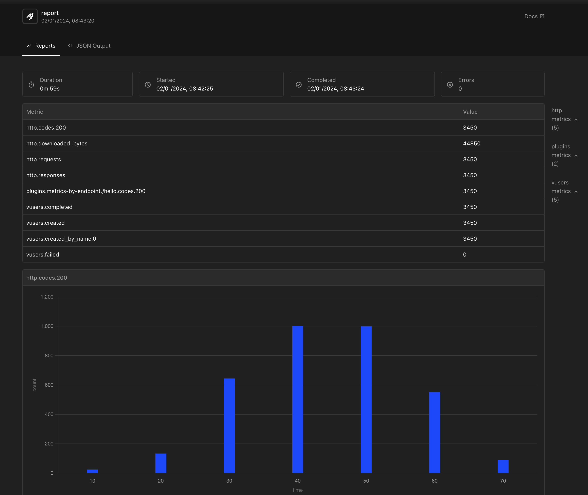

# 인프런 백엔드 성능 테스트 - foo

* https://www.inflearn.com/course/lecture?courseSlug=%EB%B0%B1%EC%97%94%EB%93%9C-%EC%95%A0%ED%94%8C%EB%A6%AC%EC%BC%80%EC%9D%B4%EC%85%98-%EC%84%B1%EB%8A%A5-%ED%85%8C%EC%8A%A4%ED%8A%B8&unitId=193231

[toc]


# Latency(지연시간)과 throughput(처리량)


latency : 요청 한건한건의 처리시간. 주로 ms, s 단위 

throughput : 단위 시간동안 몇건의 요청을 처리할 수 있는가?. tps 단위 (Transaction Per Second, 1초당 몇건의 요청을 처리)

성능을 측정할 때는 이 2가지를 모두 측정해야한다

* 요구사항 :  초당 3000개의 요청(처리량) 이 들어올 때 99%의 요청이 100ms 미만(지연시간)으로 처리되어야함

> 처리량을 늘리면 지연시간도 함께 늘어날 가능성이 높음


# 운영체제와 서버 자원


CPU가 많이 쓰이는 작업

* 계산작업, 이미지, 영상 인코딩, 암호화, 해시

메모리가 많이 쓰이는 작업

* CPU랑 함께 쓰임, 인스턴스 생성, 캐싱, 컬렉션 객체

디스크가 많이 쓰이는 작업

* 파일 입출력, 로그 발생시, 데이터베이스 입출력


# 네트워크

네트워크는 마법이 아니다

빛의 속도 : 약 30만 km/s

1초(1,000ms)에 지구를 7.5바퀴 돈다 -> 1바퀴를 도는데 1,000/ 7.5 = 133.3ms가 걸린다

## 네트워크 대역폭과 지연시간의 관계

대역폭이 100mb/s 이고 클라가 다사용중인데,

또다른 클라이언트가 50mb/s를 추가로 보낸다면?

-> 대역폭을 넘어서는 데이터는 늦게 전송되고 지연시간이 길어짐. 

대역폭을 넓히는것도 성능을 높이는 방법이다. 

# 데이터베이스

지연시간이 길어지는 상황

* 많은 데이터 중 필요한 데이터를 찾아야 할때 -> 인덱스

* 한번에 많은 데이터를 응답으로 줘야할 떄 
* 데이터에 락이 너무 자주 걸릴 때 

## 스레드풀과 커넥션 풀

커넥션풀은 백엔드애플리케션과 디비와의 커넥션을 미리 만들어놓음.

* DB의 커넥션 갯수도 확인해야함. 여러 WAS가 연결시 다 연결 못할 수도 있기 때문.
* 성능테스트를 통해 적절한 숫자를 설정해야 한다. 


# 성능테스트의 방향성

* 실무에서의 성능 테스트

* 실무가 아닌 환경에서의 성능 테스트

로 나뉜다 


실무에서는 충분한 인프라 투입 가능.

실무가 아닌경우 인프라를 제대로 구축하기 달라짐 

## 실무에서의 성능 테스트

* 동시접속자가 3,000명 정도로 예상되고, 이 사용자들이 발생시키는 요청은 1,000 tps 정도 될 것 같음
* 이때 99%의 요청은 지연시간이 50ms 미만으로 유지되어야함

예상되는 트래픽을 감당하기 위해

성능 테스트, 튜닝을 진행하고 필요하다면 충분한 인프라 자원을 투입 할 수 있음


> 실무가 아니면 지정하기 힘들다

## 실무가 아닌 환경에서의 성능 테스트

1. 우선 한건씩 요청을 보내서 지연시간(Latency)가 어느정도 나오는지 테스트해보기

2. 처리량(Throughput)을 높이면서 현재 인프라 구성에서 지연시간이 치솟는 지점 찾아보기

3. 어떤 부분이 병목이 되는건지 `가설`을 세워보고 서버 자원 모니터링, 로그 등을 통해 병목 지점 탐색

4. 병목을 해결할 수 있는 다양한 방법들을  적용


# Artillery

* https://www.artillery.io/

* https://www.artillery.io/docs/get-started/get-artillery

```
HTTP(S), Socket.io, Websocket, gRPC  등 다양한 프로토콜을 지원한다.
시나리오 테스트를 할 수 있다.
JavaScript로 로직을 작성해서 추가할 수 있다.
statsd를 지원해서 Datadog이나 InfluxDB 등에 실시간으로 결과를 등록할 수 있다.
풍부한 CLI 커맨드를 제공한다.
리포트 페이지를 따로 제공한다. HTML, JSON 등 
클라우드 규모에서의 테스트 가능 (AWS Lambda 서버리스 로드 테스트)
시나리오 단위로 테스트 가능
```


**설치**

```
npm install -g artillery@latest
```

* https://nodejs.org/en/download 노드를 먼저 깔아야 한다. 

**노드 버전 업데이트 방법**

```
node -v //node 버전 확인
npm cache clean -f //캐시 삭제
npm install -g n //nodejs 버전관리 플러그인

#버전 업그레이드 선택 - sudo를 붙여야 할수도 있다. 
n stable //안정화 된 버전
n lts //lts 버전
n latest //최신 버전
n 16.11.1 //특정 버전
```

**아틸러리 최신 업데이트** 

```
npm update -g artillery
```


예시 스크립트

* https://www.artillery.io/docs/get-started/first-test

```yml
config:
  # 테스트 서버의 타겟 URL 설정
  target: http://asciiart.artillery.io:8080

  # 부하 테스트 단계를 정의하는 부분
  phases:
    # 첫 번째 부하 단계: "Warm up phase"
    - duration: 60           # 단계의 지속 시간 (초)
      arrivalRate: 1         # 초당 새로 도착하는 가상 사용자 수
      rampTo: 5              # 이 단계의 끝에서 초당 도착하는 가상 사용자 수로 증가
      name: Warm up phase    # 단계의 이름

    # 두 번째 부하 단계: "Ramp up load"
    - duration: 60           # 단계의 지속 시간 (초)
      arrivalRate: 5         # 초당 새로 도착하는 가상 사용자 수
      rampTo: 10             # 이 단계의 끝에서 초당 도착하는 가상 사용자 수로 증가
      name: Ramp up load     # 단계의 이름

    # 세 번째 부하 단계: "Spike phase"
    - duration: 30           # 단계의 지속 시간 (초)
      arrivalRate: 10        # 초당 새로 도착하는 가상 사용자 수
      rampTo: 30             # 이 단계의 끝에서 초당 도착하는 가상 사용자 수로 증가
      name: Spike phase      # 단계의 이름

  # 플러그인 설정 부분
  plugins:
    ensure: {}
    apdex: {}
    metrics-by-endpoint: {}

  # APDEX(Application Performance Index) 설정
  apdex:
    threshold: 100          # APDEX 계산을 위한 응답 시간 임계값 (밀리초)

  # 성능 보장(ensure) 설정
  ensure:
      thresholds:
        - http.response_time.p99: 100  # 99%의 요청이 100ms 이하의 응답 시간을 가져야 함
        - http.response_time.p95: 75   # 95%의 요청이 75ms 이하의 응답 시간을 가져야 함

# 부하 테스트 시나리오
scenarios:
  - flow:
      # 반복되는 요청 시퀀스 정의
      - loop:
        # 3개의 GET 요청을 순서대로 보냄
        - get:
            url: "/dino"
        - get:
            url: "/pony"
        - get:
            url: "/armadillo"
        count: 100  # 이 시퀀스를 100번 반복

```


## 간단한 성능테스트

```yaml
config:
  target: 'http://localhost:8080'
  phases:
    - duration: 10
      arrivalRate: 5
    - duration: 10
      arrivalRate: 20
    - duration: 30
      arrivalRate: 100
    - duration: 10
      arrivalRate: 20
scenarios:
  - flow:
    - get:
        url: "/hello"
```

* testconfig.yaml을 만든다.

명령어를 입력한다.

```sh
artillery run --output report.json test-config.yaml
```

테스트가 끝나면 report.json이 만들어진다

 [report.json](report.json) 

이걸 html로 바꿔서 볼 수 있다.

```sh
artillery report report.json --output report.html
```

*  [report.html](report.html)  파일이 생성이된다.



## 성능테스트 결과 해석하기

* https://www.artillery.io/docs

## 시나리오 테스트하기

다음문서 참고. https://www.artillery.io/docs/reference/test-script

* 다양한 시나리오 테스트 방법. 

1. 로그인 후
2. 다양한 요청들 1, 2 

```java
@RestController
public class ScenarioController {

    @RequestMapping(value = "/login", method = RequestMethod.POST)
    public String login() {
        sleep(20);

        return "Login Success";
    }

    @RequestMapping(value = "/some-function-one", method = RequestMethod.GET)
    public String someFunctionOne() {
        sleep(30);

        return "Result One";
    }

    @RequestMapping(value = "/some-function-two", method = RequestMethod.GET)
    public String someFunctionTwo() {
        sleep(15);

        return "Result Two";
    }

    private void sleep(long millisecond) {
        try {
            Thread.sleep(millisecond);
        } catch (InterruptedException e) {
            throw new RuntimeException(e);
        }
    }

}
```

스크립트

```yaml
config:
  # 테스트 대상 서버의 URL
  target: 'http://localhost:8080'

  # 부하 테스트 단계를 정의하는 부분
  phases:
    # 첫 번째 단계: "Warm up"
    - duration: 30       # 이 단계의 지속 시간은 30초
      arrivalRate: 3     # 초당 3개의 새로운 가상 사용자가 도착
      name: Warm up      # 단계의 이름

    # 두 번째 단계: "Ramp up load"
    - duration: 30       # 이 단계의 지속 시간은 30초
      arrivalRate: 3     # 시작 시 초당 3개의 새로운 가상 사용자
      rampTo: 30         # 30초 동안 사용자 수를 점차 30까지 증가
      name: Ramp up load # 단계의 이름

    # 세 번째 단계: "Sustained load"
    - duration: 60       # 이 단계의 지속 시간은 60초
      arrivalRate: 30    # 초당 30개의 새로운 가상 사용자가 도착
      name: Sustained load # 단계의 이름

    # 네 번째 단계: "End of load"
    - duration: 30       # 이 단계의 지속 시간은 30초
      arrivalRate: 30    # 시작 시 초당 30개의 새로운 가상 사용자
      rampTo: 10         # 30초 동안 사용자 수를 점차 10까지 감소
      name: End of load  # 단계의 이름

# 부하 테스트 시나리오
scenarios:
  # 첫 번째 시나리오: "login and use some functions"
  - name: "login and use some functions"
    flow:
      - post:              # POST 요청
          url: "/login"    # 로그인 URL
      - get:               # GET 요청
          url: "/some-function-one" # 첫 번째 기능의 URL
      - get:               # GET 요청
          url: "/some-function-two" # 두 번째 기능의 URL

  # 두 번째 시나리오: "just login"
  - name: "just login"
    flow:
      - post:              # POST 요청
          url: "/login"    # 로그인 URL

```

```yaml
artillery run --output scenarios-report.json scenario-test-config.yaml
# 문서 생성
artillery report report.json --output scenarios-report.html
```


## 파라미터 테스트

```java
@RestController
public class ParameterController {

    private static final Logger logger = LoggerFactory.getLogger(ParameterController.class);

    @GetMapping(value = "/login-with-id-password")
    public String loginWithIdPassword(@RequestBody IdAndPassword idAndPassword) {
        logger.info("{} / {}", idAndPassword.getId(), idAndPassword.getPassword());

        return "Login Success";
    }

    static class IdAndPassword {
        private String id;
        private String password;

        public String getId() {
            return id;
        }

        public String getPassword() {
            return password;
        }
    }
}

```

스크립트

```yaml
config:
  target: 'http://localhost:8080' # 부하 테스트가 실행될 서버의 주소 (여기서는 로컬 서버의 8080 포트)
  phases:
    - duration: 30 # 각 테스트 단계의 지속 시간 (30초)
      arrivalRate: 3 # 초당 도착하는 가상 사용자 수 (초당 3명)
      name: Warm up # 테스트 단계의 이름 (워밍업)
  payload:
    path: "id-password.csv" # 테스트에 사용될 데이터가 포함된 CSV 파일의 경로
    fields:
      - "id" # CSV 파일에서 사용될 필드 (사용자 ID)
      - "password" # CSV 파일에서 사용될 필드 (사용자 비밀번호)
scenarios:
  - name: "just login" # 시나리오 이름 (로그인만 수행)
    flow:
      - post:
          url: "/login-with-id-password" # POST 요청이 보내질 URL (ID와 비밀번호로 로그인)
          json:
            id: "{{ id }}" # POST 요청에 포함될 JSON 데이터 (사용자 ID)
            password: "{{ password }}" # POST 요청에 포함될 JSON 데이터 (사용자 비밀번호)
  - name: "just GETGET"
    flow:
      - get:
          url: "/search?query={{ id }}"

```

```
artillery run --output parameter-report.json parameter-test-config.yaml
# 문서 생성
artillery report parameter-report.json --output parameter-report.html
```


## JWT Token 테스트 예제

* https://www.artillery.io/docs/reference/test-script#before-and-after-sections


## 높은 부하 성능 테스트 결과 해석

```java
@RestController
public class HighLoadController {

    @GetMapping(value = "/high-load-cpu")
    public int highLoadCpu() {
        int sum = 0;

        // 랜덤한 수를 뽑아서 더하는 연산
        for (int i = 0; i < 20_000_000; i++) {
            int randomInt = ThreadLocalRandom.current().nextInt();

            sum = sum + randomInt;
        }

        return sum;
    }

    @GetMapping(value = "/high-load-memory")
    public int highLoadMemory() {
        ArrayList<Integer> memoryIntensiveList = new ArrayList<>();
        
        for (int i = 0; i < 500_000; i++) {
            // int를 추가하는 과정에서 새로운 Integer 래퍼 클래스 인스턴스 생성
            memoryIntensiveList.add(i);
        }

        return memoryIntensiveList.size();
    }

}
```

```yaml
config:
  target: 'http://localhost:8080'
  phases:
    - duration: 30
      arrivalRate: 20
      name: Warm up
    - duration: 10
      arrivalRate: 20
      rampTo: 200
      name: Ramp up load
    - duration: 10
      arrivalRate: 200
      name: Sustained load
    - duration: 30
      arrivalRate: 200
      rampTo: 20
      name: End of load
scenarios:
  - name: "high load cpu"
    flow:
      - get:
          url: "/high-load-cpu"
  - name: "high load memory"
    flow:
      - get:
          url: "/high-load-memory"
```

* 각 테스트할때 메모리에 주석 치거나 시피유에 주석 치고 돌릴것

```yaml
artillery run --output high-load-report.json high-load-test-config.yaml
# 문서 생성
artillery report high-load-report.json --output high-load-report.html
```

리스폰스 타임이 9000Ms도 있다.. 9초.. 


서버의 리소스 모니터링이 필요한 경우도 있다.

* 스프링 액추에이터

# 간단한 성능 개선 - 1 캐시 적용

```java
@RestController
public class HashController {

    private final Map<String, String> cashHashResult = new ConcurrentHashMap<>();

    @GetMapping("/no-cache-hash-string")
    public String noCacheHashString(@RequestParam String input) {
        return calculateHash(input);
    }

    @GetMapping("/cached-hash-string")
    public String cachedHashString(@RequestParam String input) {
        if (cashHashResult.containsKey(input)) {
            return cashHashResult.get(input);
        }

        String hashedResult = calculateHash(input);
        cashHashResult.put(input, hashedResult);
        return hashedResult;
    }

    private String calculateHash(String input) {
        try {
            MessageDigest md = MessageDigest.getInstance("SHA-256");

            for (int i = 0; i < 50000; i++) {
                byte[] bytes = input.getBytes();
                byte[] hashedBytes = md.digest(bytes);
                input = bytesToHex(hashedBytes);
                md.reset();
            }
        } catch (NoSuchAlgorithmException e) {
            e.printStackTrace();
        }

        return input;
    }

    private static String bytesToHex(byte[] bytes) {
        StringBuilder result = new StringBuilder();
        for (byte aByte : bytes) {
            result.append(Integer.toString((aByte & 0xff) + 0x100, 16).substring(1));
        }
        return result.toString();
    }

}

```

* 위는 캐시 미적용, 아래는 캐시 적용

```yaml
config:
  target: 'http://localhost:8080'
  phases:
    - duration: 60
      arrivalRate: 30
  payload:
    path: "numbers.csv"
    fields:
      - "number"
scenarios:
  - name: "get hash"
    flow:
      - get:
          url: "/no-cache-hash-string?input={{ number }}"
#          url: "/cached-hash-string?input={{ number }}"
```

```
artillery run --output hash-test-report.json hash-test-config.yaml
# 문서 생성
artillery report hash-test-report.json --output hash-test-report.html
```

* 주석 풀고 하고 다르게 테스트 한다.

