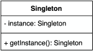
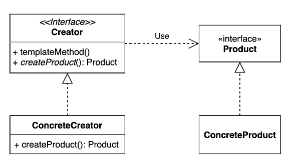
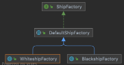
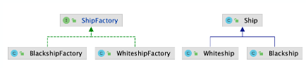
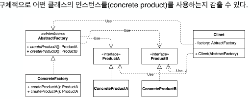

# 코딩으로 학습하는 GoF의 디자인 패턴 - 인프런 백기선님

# 1.객체 생성 관련 패턴
* 싱글톤 패턴
* 팩토리 메소드 패턴
* 추상 팩토리 패턴
* 빌더 패턴
* 포로토타입 패턴

# 2.구조 관련 패턴
* 어댑터 패턴
* 브릿지 패턴
* 컴포짓 패턴
* 데코레이터 패턴
* 퍼사드 패턴
* 플라이웨이트 패턴
* 프록시 패턴

#3.행동 관련 패턴
* 책임 연쇄 패턴
* 커맨드 패턴
* 인터프리터 패턴
* 이터레이터 패턴
* 중재자 패턴
* 메멘토 패턴
* 옵저버 패턴
* 상태 패턴
* 전략 패턴
* 템플릿 메소드 패턴
* 방문자 패턴


# 1. 객체 생성 관련 패턴 - Singleton(싱글톤)

* 인스턴스를 오직 한개만 제공하는 클래스
* 시스템 런타임, 환경 세팅에 대한 정보 등, 인스턴스가 여러개 일 때 문제가 생길 수 있는
  경우가 있다. 인스턴스를 오직 한개만 만들어 제공하는 클래스가 필요하다
* 

## 싱글톤 (Singleton) 패턴 구현 방법 1
```java
public class Settings {
    private static Settings instance;

    private Settings() {}

    public static Settings getInstance() {
        if (instance == null) {
            instance = new Settings();
        }

        return instance;
    }
}
```

1. 생성자를 private으로 만든 이유? 
   * -> 단 한개의 인스턴스가 필요하기 때문에서 외부에서 new로 새 인스턴스를 못 만들게 하기 위함
2. getInstance() 메소드를 static으로 선언한 이유? 
  * - getInstance를 글로벌하게 액세스 가능하게 하기 위해.
3. getInstance()가 멀티쓰레드 환경에서 안전하지 않은 이유?
  *  -> 여러 개의 쓰레드가 동시에 getInstance() 메소드에 접근한다고 할 때 여러 개의 인스턴스가 만들어질 수도 있는 상황이 발생할 수 있기 때문입니다.

## 싱글톤 (Singleton) 패턴 구현 방법 2
동기화(synchronized)를 사용해 멀티쓰레드 환경에 안전하게 만드는 방법
```java
public static synchronized Settings getInstance() {
    if (instance == null) {
        instance = new Settings();
    }
return instance;
}
```
* synchronized 키워드를 사용하면 동시에 여러 쓰레드가 접근할수 없다. 
* 단점 : 호출할 때마다 동기화 처리 작업 때문에 성능이 나오지 않는다. 

1. 자바의 동기화 블럭 처리 방법은?
  * Race condition이 발생할 수 있는 code block을 synchronized 키워드로 감싸면, 하나의 쓰레드만 이 code block에 진입할 수 있습니다. 
  * 그 외에 다른 쓰레드는 먼저 진입한 쓰레드가 이 code block을 나갈 때 까지 기다리도록 함
2. getInstance() 메소드 동기화시 사용하는 락(lock)은 인스턴스의 락인가 클래스의 락인가?
   그 이유는?

## 싱글톤 구현 방법 3 - Eager Initialization
```java
public class Settings {
    private static final Settings INSTANCE = new Settings();

    private Settings() {}

    public static Settings getInstance() {
        return INSTANCE;
    }
}
```

1. 이른 초기화가 단점이 될 수도 있는 이유?
  * 미리 만드는것 자체가 단점이 될 수도 있다 - 객체를 생성하거나 초기화 하는대 시간과 비용이 많이 들거나, 기껏 만들었는데 어디서도 사용 안한다면? 
2. 만약에 생성자에서 checked 예외를 던진다면 이 코드를 어떻게 변경해야 할까요?
  * exception을 던지면 함수를 호출하는 쪽에서 try-catch 문으로 감싼다. 
  * 하지만 예제처럼 변수를 초기화하는 과정에서는 try-catch 문을 사용할 수 없다.  
  * 그럴경우 static {} 블록을 이용해서 instance를 초기화하면 되는데 이경우 final 키워드를 사용할 수 없다.

## 싱글톤 구현 방법 4 - double checked locking

```java
public class Settings {
    private static volatile Settings instance;
    private Settings() {}
    public static Settings getInstance() {

        if (instance == null) {
            synchronized (Settings.class) {
                if (instance == null) {
                    instance = new Settings();
                }
            }
        }
        return instance;
    }
}

```
1. double check locking이라고 부르는 이유?
  * checking을 2번 했기 때문. 여러 쓰레드가 동시에 if문을 통과했다 하더라도 synchronized때문에 하나의 쓰레드만 안으로 들어갈 수 있다.
  * 인스턴스를 생성하고 빠져나가는데 이때 다른 if문을 통과한 쓰레드가 synchronized로 들어오더라도 인스턴스가 이미 생성되있기 때문에 if문에서 튕기고 인스턴스를 리턴한다.
2. instance 변수는 어떻게 정의해야 하는가? 그 이유는?
  * volatile 키워드를 사용해야 한다. volatile을 사용하지 않은 변수는 성능향상을 위해 CPU 캐시에 저장한다.  
  * 이 경우 쓰레드가 변수값을 읽어올 때 각각의 CPU의 캐시에서 가져오기 때문에 값이 달라 값의 불일치가 발생한다.
  * volatile 키워드를 추가하게 되면 Main Memory에 저장하고 읽어오기 때문에 변수 값 불일치 문제를 해결 할 수 있습니다.
  * https://nesoy.github.io/articles/2018-06/Java-volatile
  * 메서드 단위에 synchronized를 사용하는 것 보다 성능 향상을 가져온다.

## 싱글톤 구현 방법 5 - static inner class 

```java
public class Settings {

    private Settings() {}

    private static class SettingsHolder {
        private static final Settings SETTINGS = new Settings();
    }

    public static Settings getInstance() {
        return SettingsHolder.SETTINGS;
    }
    
}
```
* 멀티쓰레드에서 환경에서도 안전하고 겟 인스턴스가 호출될때 이 홀더 클래스가 로딩이 되므로 레이지 로딩도 가능하다. 

## 싱글톤 패턴 구현을 깨트리는 방법 1
* 우리는 제대로 구현했지만, 사용하는 쪽에서 제대로 사용을 안하고 리플렉션 같은 것을 사용해서 권장하지 않는 방법으로 사용한다면? 

#### 1. 리플렉션을 사용한다면?
```java
Settings settings = Settings.getInstance();
Constructor<Settings> constructors = Settings.class.getDeclaredConstructor();
constructors.setAccessible(true);
Settings newInstance = constructors.newInstance();
```
1. 리플렉션에 대해 설명하세요 : 리플렉션은 구체적인 클래스의 타입을 몰라도 안에 선언되어있는 함수, 변수들에 접근할 수 있게 해주는 자바의 api
2. setAccessible(true)를 사용하는 이유는? : 기본 생성자는 private로 선언되어 있어, 외부에서는 호출할 수 없다는 것인데, 
  * setAccessible(true)를 통해 Constructor<Settings5>타입으로 받은 declaredConstructor, 기본생성자를 사용가능하게해 newInstance()를 사용해 새로운 객체를 만들 수 있게하기 때문이다

#### 2. 직렬화 & 역직렬화를 사용한다면? 

```java
Settings settings = Settings.getInstance();
Settings settings1 = null;
try (ObjectOutput out = new ObjectOutputStream(new FileOutputStream("settings.obj"))) {
    out.writeObject(settings);
}
try (ObjectInput in = new ObjectInputStream(new FileInputStream("settings.obj"))) {
    settings1 = (Settings) in.readObject();
}

System.out.println(settings == settings1);
```
* 객체를 파일로 저장했다가 다시 로딩할 수도 있다. 

1. 자바의 직렬화 & 역직렬화에 대해 설명하세요 : 
  * 직렬화는 자바 시스템 내부에서 사용되는 Object 또는 Data를 외부의 자바 시스템에서도 사용할 수 있도록 byte 형태로 데이터를 변환하는 기술이며
  * 역직렬화는 byte로 변환된 Data를 원래대로 Object나 Data로 변환하는 기술이다
2. Serializable Id란 무엇이며 왜 쓰는가? : Serializable를 상속받는 경우 클래스의 버전관리를 위해 serialVersionUID를 사용한다.  
  * serialVersionUID변수를 명시적으로 선언해 주지 않으면 컴파일러가 계산한 값을 부여하는데 Serializable Class 또는 Outer Class에 변경이 있으면 serialVersionUID값이 바뀌게 된다.  
  * 만약 Serialize할 때와 Deserialize할 때의 serialVersionUID 값이 다르면 InvalidClassExcepions가 발생하여 저장된 값을 객체로 Restore 할 수 없다
3. try-resource 블럭에 대해 설명하세요 : 
  * try-resource 블럭은 기존의 try-catch-final 블럭에서 사용하고 꼭 종료해줘야 하는 resource를 사용할 때 final 블럭에서 resource를 해제하는데, 
  * try-resource 블럭을 사용하면 따로 명시적으로 resource를 해제해주지 않아도 자동으로 해제
    

* 역 직렬화 방지 방법. 
```java
public class Settings implements Serializable {
    ...
    protected Object readResolve() {
        return getInstance();
    }
}

```
* 역 직렬화 할 때 readResolve()라는 메소드가 사용이 되는데, 이 메서드 안에서 new Object() 대신 getInstance()를 호출하게끔 코드를 바꾸면 된다. 

## 싱글톤 (Singleton) 패턴 구현 방법 6 - enum
* enum을 사용하면 리플렉션도 막을 수 있다. 

```java
public enum Settings {
    INSTANCE;
}
```
* enum은 thread-safe 한가?
  * Settings enumeration 생성 과정이 쓰레드 세이프 하다는 것이지, 그 enum 인스턴스 자체가 쓰레드 세이프 하진 않다. 
  * 동기화 블럭을 사용하지 않은 게터 세터가 있으니 해당 enum 객체는 쓰레드 세이프하지 않습니다.


1. Enum 타입의 인스턴스를 리플렉션을 통해 만들 수 있는가? : 없다
2. Enum으로 싱글톤 타입을 구현할 때의 단점은? : 인스턴스를 미리 생성해야하며 상속이 불가하다
3. 직렬화 & 역직렬화 시에 별도로 구현해야 하는 메소드가 있는가? :
   * enum은 기본적으로 Enum이라는 클래스를 상속받고 있고 이 클래스는 이미 Serializeble을 상속하고 있기 때문에 enum도 별다른 안전장치를 마련하지 않아도 안전한 직렬화 & 역직렬화가 가능하다

* 자바에서 enum을 사용하지 않고 싱글톤 패턴을 구현하는 방법은?
    * RAZY_HOLDER 및 STATIC_INNER_CLASS 
* private 생성자와 static 메소드를 사용하는 방법의 단점은?
* enum을 사용해 싱글톤 패턴을 구현하는 방법의 장점과 단점은?
  * 미리 만들어짐.
  * 상속을 할 수가 없다. 
* static inner 클래스를 사용해 싱글톤 패턴을 구현하라.
```java
public class Singleton {

    private Singleton() {}
    private static class SingletonHolder {
        private static final Singleton SINGLETON = new Singleton();
    }

    public static Singleton getInstance() {
        return Singleton.getInstance();
    }
}
```

## 싱글톤 패턴이 쓰이는 곳 
* 스프링에서 빈의 스코프 중에 하나로 싱글톤 스코프.
* 자바 java.lang.Runtime
* 다른 디자인 패턴(빌더, 퍼사드, 추상 팩토리 등) 구현체의 일부로 쓰이기도 한다.

# 팩토리 메소드 (Factory method) 패턴
* 해결하려는 문제 : 어떤 인스턴스를 생성하는 책임을 구체적인 클래스 말고 추상적인 인터페이스의 메서드로 감싸는 것 
* 구체적으로 어떤 인스턴스를 만들지는 서브 클래스가 정한다
* 다양한 구현체 (Product)가 있고, 그중에서 특정한 구현체를 만들 수 있는 다양한 팩토리
  (Creator)를 제공할 수 있다
* 

* 객체만 생성하는 공장을 통해서 간접적으로 객체를 생성하게 하며 인터페이스를 정의하되, 
* 실제 구현내용은 자식클래스에서 구현이 되므로 세부 구현 코드를 몰라도 부모클래스에서 자유롭게 사용이 가능하여 객체 간의 결합도가 낮아지는 효과

* 자바에서 팩토리 메소드 패턴을 적용할 때 참고
1. 자바 8의 인터페이스 default 메소드
- 인터페이스에 추상 메소드가 아닌 default 메소드를 통해 기능을 구현할 수 있게 되어서 상속받는 서브클래스의 중복코드를 제거할 수 있다.
2. 자바 9의 인터페이스의 private 메소드
- 기능 구현이 가능해지면서 인터페이스의 내부 로직을 private 메소드로 구현하면 읽기 좋은 코드로 작성할 수 있게 된다.

* 
  * 자바 8 이전
* 
  * 자바 8 이후 

* ## 확장에 열려있고 변경에 닫혀있는 구조

* 팩토리 메소드 패턴을 적용했을 때의 장점은? 단점은?
  * 장점 : 코드를 수정하지 않고(변경의 최소) 새로운 인스턴스를 여러 방법으로 생성할 수 있는 "확장에 열려있고 변경에 닫혀있는 객체 지향 원칙"을 만족하는 객체 생성 방법
    * 코드가 간결해진다.
    * 느슨한 결합(loose coupling)
  * 단점 : 계속해서 새로운 하위클래스를 정의한다는 점이 있다. 
    * 이는 불필요하게 많은 클래스를 정의하게 될 수 있고 이로 인해 복잡해 질 수 있다는 단점
* “확장에 열려있고 변경에 닫혀있는 객체 지향 원칙”을 설명하세요.
  * 개방-폐쇄 원칙 (OCP: Open-Closed Principle)
  * 소프트웨어 엔티티(클래스, 모듈, 함수 등)는 확장에 대해서는 열려 있어야 하지만 변경에 대해서는 닫혀 있어야 한다.
    * 기존 코드를 변경하지 않으면서(Close) 기능을 추가(Open)할 수 있도록 설계가 되어야 한다는 원칙
* 자바 8에 추가된 default 메소드에 대해 설명하세요
  * 인터페이스에 추상 메소드가 아닌 default 메소드를 통해 기능을 구현할 수 있게 됨
    * 그 인터페이스를 구현하거나, 상속받은 인터페이스도 메서드 사용 가능 
## 실무에서는 어떻게 쓰이나?
* 단순한 팩토리 패턴
  * `매개변수의 값에 따라 또는 메소드에 따라 각기 다른 인스턴스를 리턴하는 단순한 버전 의 팩토리 패턴`
  * java.lang.Calendar 또는 java.lang.NumberFormat
    * Calendar는 Gregorian형식(우리가 현재 쓰는), Julian 형식이 있는데, 이 두가지 경우를 모두 커버하기 위해 팩토리 메소드 패턴으로 디자인 되었다.
    * NumberFormat은 국가에 따라 또는 화폐에 따라 다른 표현 방식을 커버하기 위해 팩토리 메소드 패턴으로 디자인 되었다.
* 스프링 BeanFactory
  * Object 타입의 Product를 만드는 BeanFacotry라는 Creator!
```java
BeanFactory xmlFactory = new ClassPathXmlApplicationContext("config.xml");
String hello = xmlFactory.getBean("hello", String.class);
System.out.println(hello);

BeanFactory javaFactory = new AnnotationConfigApplicationContext(Config.class);
String hi = javaFactory.getBean("hello", String.class);
System.out.println(hi);
```
* xml 설정과 java 설정으로 읽어오는 방식
* Product에 해당하는 것은 Object
* ConcreteProduct에 해당하는 것은 xml 또는 class Bean

# 추상 팩토리 (Abstract factory) 패턴 
* 서로 관련있는 여러 객체를 만들어주는 인터페이스
* 목적 : 클라이언트 코드 팩토리에서 어떤 인스턴스를 만들어 쓰는 코드를 인터페이스 기반으로 코드를 짤 수 있게하기 위함  
  * 팩토리 메서드 패턴이랑 비슷하지만 다르다  
* 

* 추상 팩토리 패턴의 목적 자체를 이해하면 팩토리 메서드와 완전히 분리해서 이해할 수 있는데, 추상 팩토리 패턴은 클라이언트 코드에서 팩토리로부터 객체(제품)를 생성하고 사용하는 코드를 인터페이스 기반으로 작성할 수 있게끔 한다.
* 팩토리 메서드 패턴 vs 추상 팩토리 패턴 : https://stackoverflow.com/questions/5739611/what-are-the-differences-between-abstract-factory-and-factory-design-patterns
  * 팩토리 메서드 패턴의 핵심은 제품(객체)을 생성하는 추상 메서드와 이를 오버라이드해 필요한 제품을 생성하는 메서드 그 자체라고 볼 수 있고 추상 팩토리 패턴은 제품(객체)을 생성하는 한 개 이상의 추상 메서드를 가진 인터페이스와 이를 구현한 콘크리트 팩토리의 객체에 초점이 맞춰져 있다.


## 추상 팩토리 (Abstract factory) 패턴 구현 방법
* 클라이언트 코드에서 구체적인 클래스의 의존성을 제거한다

* 팩토리 메소드 패턴과 굉장히 흡사한데 무엇이 다른건가.
* 모양과 효과는 비슷하지만…
  * 둘 다 구체적인 객체 생성 과정을 추상화한 인터페이스를 제공한다.
* 관점이 다르다.
  * 팩토리 메소드 패턴은 `“팩토리를 구현하는 방법 (inheritance)”`에 초점을 둔다.
  * 추상 팩토리 패턴은 `“팩토리를 사용하는 방법 (composition)”`에 초점을 둔다.
* 목적이 조금 다르다.
  * 팩토리 메소드 패턴은 구체적인 객체 생성 과정을 하위 또는 구체적인 클래스로 옮기는 것이 목적.
  * 추상 팩토리 패턴은 관련있는 여러 객체를 구체적인 클래스에 의존하지 않고 만들 수 있게 해주는 것이 목적.

## 추상 팩토리 (Abstract factory) 패턴
실무에서는 어떻게 쓰이나?

* 자바 라이브러리
  * javax.xml.xpath.XPathFactory#newInstance()
  * javax.xml.transform.TransformerFactory#newInstance()
  * javax.xml.parsers.DocumentBuilderFactory#newInstance()
* 스프링
  * FactoryBean과 그 구현체

* FactoryBean은 스프링이 제공하는 인터페이스로, (XML 설정 기준) 기본으로 제공되는 스프링 구문으로는 생성 및 관리할 수 없는 객체를 Bean으로 활용할 수 있게끔 어댑터 역할을 한다. 여기서 생성 및 관리할 수 없는 객체란 생성자가 private한 싱글톤 객체 혹은 정적 팩토리 메서드를 통해 얻어오는 객체가 이에 해당한다.


