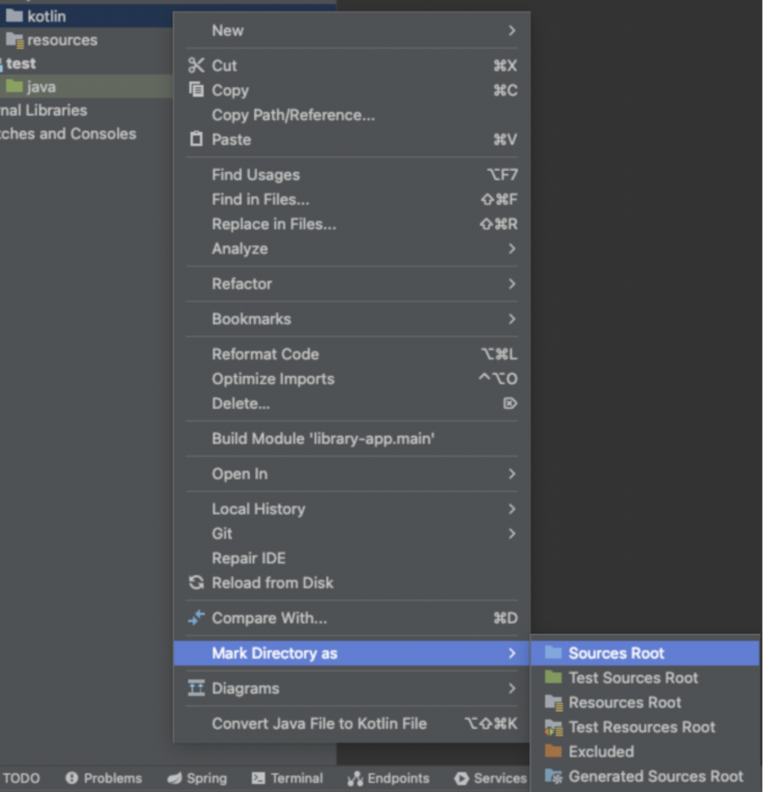
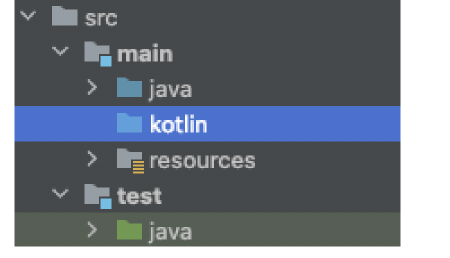
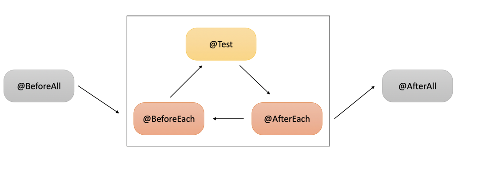
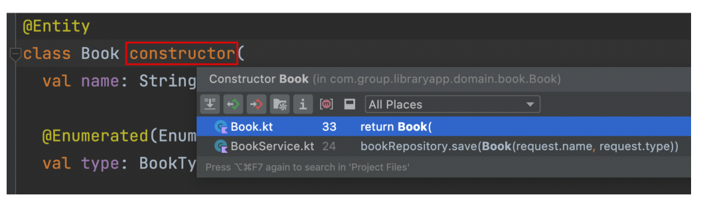

# 도서관리 애플리케이션 


# 테스트 코드란 무엇인가
* 프로그래밍 코드를 사용해 무엇인가를 검증한다
* 자동으로 (사람의 손을 거치지 않고) 테스트를 할 수 있다!

* 리팩토링을 해야 코드의 품질이 유지되고, Business가 안정적으로 유지되는데, 리팩토링을 할때마다 사람이 직접 검증한다면.. 범위가 너무 넓고 비용이 많이 든다.
## 테스트 코드의 장점 
1. 개발 과정에서 문제를 미리 발결한 수 있다.
2. 기능 추가와 리팩토링을 안심하고 할 수 있다.
3. 빠른 시간 내 코드의 동작 방식과 결과를 확인할 수 있다.
4. 좋은 테스트 코드를 작성하려 하다보면, 자연스럽게 좋은 코드가 만들어진다.
5. 잘 작성한 테스트는 문서 역할을 한다.(코드 리뷰를 돕는다.)


# 자바 프로젝트에서 코틀린 코드 사용하는법

1. plugin 필요
  *  id 'org.jetbrains.kotlin.jvm' version '1.6.21'
```gradle
plugins {
    id 'org.springframework.boot' version '2.6.8'
    id 'io.spring.dependency-management' version '1.0.11.RELEASE'
    id 'java'
    id 'org.jetbrains.kotlin.jvm' version '1.6.21'
}
```

2. dependencies 필요
  *  implementation 'org.jetbrains.kotlin:kotlin-stdlib-jdk8'

```gradle
dependencies {
    implementation 'org.jetbrains.kotlin:kotlin-stdlib-jdk8'
}
```

3. compileKotlin 필요
  * kotlinOptions {jvmTarget = "11"}

```gradle
compileKotlin {
    kotlinOptions {
        jvmTarget = "11"
    }
}
```

4. compileTestKotlin 필요

```gradle
compileTestKotlin {
    kotlinOptions {
        jvmTarget = "11"
    }
}
```

* 다음 src/main/kotlin 이름으로 디렉토리를 만든다.
  * src/test/kotlin도 마찬가지

* 그리고 kotlin Directory에 마우스를 올리고 우클릭 > `Mark Directory as` > `Source Root` 를 클릭
  * 폴더가 파란색이거나 초록색이 아니라면 실행. intelij idea에서! 





* 그러면 폴더의 색이 변한다. 



* 다음, src/main/java/ 와 동일하게 src/main/kotlin 내부에 프로젝트 패키지를 만든다.

테스트 메소드를 들여다보면, 크게 3가지 과정으로 구성되어 있는 것을 확인할 수 있다.
1. 테스트 대상을 만들어 준비하는 과정
2. 실제 우리가 테스트 하고 싶은 기능을 호출하는 과정
3. 호출 이후 의도한대로 결과가 나왔는지 확인하는 과정

* 이것을 given - when - then 패턴이라고 한다


수동으로 만든 테스트 코드에는 다음과 같은 단점이 있다.
1. 테스트 클래스가 많아지고 메소드가 생길 때마다 메인 메소드에 수동으로 코드를 작성
해 주어야 하고, 메인 메소드가 아주 커질 것이다.
    * 테스트 메소드를 개별적으로 실행하기도 어렵다.
2. 테스트가 실패한 경우 무엇을 기대하였고, 어떤 잘못된 값이 들어와 실패했는지 알려주
지 않는다. 또한 예외를 던지거나, try catch를 사용해야 하는 등 직접 구현해야 할 부분
이 많다.
3. 테스트 메소드별로 공통적으로 처리해야 하는 기능이 있다면, 메소드마다 중복이 생기
게 된다.
   * 예를 들어, 현재 모든 테스트 메소드에서는 5를 초기값으로 가지고 있는 계산기를
만들어 준다.


이러한 단점을 극복하기 위해 테스트 프레임워크가 등장하였는데, Java-Kotlin 진영에서 가
장 많이 사용되는 Juni5를 알아보자


# 코틀린에서의 Junit5


```kotlin
import org.junit.jupiter.api.*

class JunitTest {

    companion object {
        @JvmStatic
        @BeforeAll
        fun beforeAll() {
            println("모든 테스트 시작 전")
        } @JvmStatic
        @AfterAll
        fun afterAll() {
            println("모든 테스트 실행 후")
        }
    }

    
    @BeforeEach
    fun beforeEach() {
        println("각 테스트 시작 전")
    }

    @AfterEach
    fun afterEach() {
        println("각 테스트 실행 후")
    }

    @Test
    fun test1() {
        println("테스트 1")
    }

    @Test
    fun test2() {
        println("테스트 2")
    }
}
```

### 각 어노테이션은 다음과 같은 의미를 가진다.
* @Test : 테스트 메소드를 지정한다. 테스트 메소드를 실행하는 과정에서 오류가 없으면
성공이다.

* @BeforeEach : 각 테스트 메소드가 수행되기 전에 실행되는 메소드를 지정한다.

* @AfterEach : 각 테스트가 수행된 후에 실행되는 메소드를 지정한다.

* @BeforeAll : 모든 테스트를 수행하기 전에 최초 1회 수행되는 메소드를 지정한다.
  * 코틀린에서는 @JvmStatic 을 붙여 주어야 한다.

* @AfterAll : 모든 테스트를 수행한 후 최후 1회 수행되는 메소드를 지정한다.
  * 코틀린에서는 @JvmStatic 을 붙여 주어야 한다

* 테스트 순서



Junit5를 사용하면, 메소드 단위로 테스트를 실행시킬 수 있고 클래스 단위로 테스트를 실행
시킬 수도 있다.


* 단언문은 assertThat(확인하고싶은값) 으로 시작하고 뒤에 .isEqualTo( ) 가 붙게 된다.
* 이때 isEqualTo 는 정확히 동일한 것을 기대한다는 의미이다


### 자주 사용되는 단언문을 몇 가지

* 주어진 값이 true인지 / false인지 검증한다.
```kotlin
val isNew = true
assertThat(isNew).isTrue
assertThat(isNew).isFalse
```

* 주어진 컬렉션이 size가 원하는 값인지 검증한다.
```kotlin
val people = listOf(Person("A"), Person("B"))
assertThat(people).hasSize(2)
```

* 주어진 컬렉션 안의 item 들에서 name 이라는 프로퍼티를 추출한 후 (extracting), 그 값을 검증한다.
    * 이때 순서는 중요하지 않다.

```kotlin
val people = listOf(Person("A"), Person("B"))
assertThat(people).extracting("name").containsExactlyInAnyOrder("A", "B")
```

* 주어진 컬렉션 안의 item 들에서 name 이라는 프로퍼티를 추출한 후 (extracting), 그값을 검증한다.
    * 이때 순서도 중요하다.

```kotlin
val people = listOf(Person("A"), Person("B"))
assertThat(people).extracting("name").containsExactly("A", "B")
```

* 함수( function1() )를 실행했을 때 원하는 예외가 나오는지 검증한다.
```kotlin
assertThrows<IllegalArgumentException> {
  function1()
}
```

* 예외 메시지까지 검증할 수 있다.

```kotlin
val message = assertThrows<IllegalArgumentException> {
  function1()
}.message
assertThat(message).isEqualTo("잘못된 값이 들어왔습니다")
```

## Kotlin No-arg-constructor

```
Class 'Book' should have [pubilc, protected] no-arg constructor
```
* 이 에러가 발생하는 이유는 다음과 같다.
    * JPA를 사용하기 위해서는 아무런 argument를 받지 않는 기본 생성자가 필요하다

* 하지만 코틀린 코드에서는 ‘주 생성자'를 만들 때 프로퍼티를 함께 만들어주는 방식을 사
용함으로써, 아무런 argument를 받지 않는 기본 생성자가 존재하지 않는다.

* 이 에러를 해결해주기 위해서는 다음과 같은 kotlin-jpa 플러그인이 필요하다


```gradle
// build.gradle
plugins {
id "org.jetbrains.kotlin.plugin.jpa" version "1.6.21" 
}
```

## 코틀린에러

코틀린으로 스프링 사용 시 ClassNotFoundException: kotlin.reflect.full.KClasses

에러시 kotlin-reflect 의존성을 추가해주면 해결된다.


```
이 에러는 코틀린 클래스에 대한 리플렉션을 할 수 없어 발생하는데, 이를 해결하기 위해
Kotlin 리플렉션 라이브러리를 넣어주어야 한다. 리플렉션이란, 클래스나 메소드 등을 런타
임으로 제어하기 위한 기술을 의미한다
```

```xml
<!-- https://mvnrepository.com/artifact/org.jetbrains.kotlin/kotlin-reflect -->

<dependency>

    <groupId>org.jetbrains.kotlin</groupId>

    <artifactId>kotlin-reflect</artifactId>

    <version>사용 버전에 맞게</version>

</dependency>
```

```gradle
dependencies {
    implementation 'org.jetbrains.kotlin:kotlin-reflect'
}
```


# Kotlin과 JPA를 함께 사용할 때 이야기거리 3가지


## 코틀린에서의 `setter`를 막는 방법


### 1. backing property


```kotlin
@Entity
class User constructor(

    private var _name: String,

    ) {

    val name: String
        get() = this._name
}
```

* 이렇게 _name 이라는 프로퍼티를 만들고, 읽기 전용으로 추가 프로퍼티 name 을 만든다

> 다만, JpaRepository에서 쿼리메소드가 동작하지 않을 수 있다. _name을 못찾는 경우가 있다. 

### 2. custom setter


```kotlin
class User(
  name: String // 프로퍼티가 아닌, 생성자 인자로만 name을 받는다
) {

  var name = name
    private set
}
```

User의 생성자에서 name을 프로퍼티가 아닌, 생성자 인자로만 받고 이 name을 변경가능
한 name 프로퍼티로 넣어주되, name 프로퍼티에 private setter를 달아두는 것이다.

### 3. setter를 그냥 열어두고, 사용하지 않는것

* setter를 그냥 열어두고, 사용하지 않는다

> 결국 어느 방법이든, setter를 열어두고 사용하지 않는것이든,  Trade-Off의 영역이라 생각하고, 팀간의 컨벤션을 잘 맞추는 것이 중요하지 않을까 싶
다


---

## 생성자 안의 프로퍼티, 클래스 body 안의 프로퍼티

다시 User 클래스를 보자. User 클래스 주생성자 안에 있는 userLoanHistories 와 id 는 꼭
주생성자 안에 있을 필요가 없다. 아래와 같이 코드가 바뀔 수 있는 것이다.


```kotlin
@Entity
class User  (
  var name: String,
  val age: Int?,
) {
  @OneToMany(mappedBy = "user", cascade = [CascadeType.ALL], orphanRemovel = true)
  val userLoanHistories: MutableList<UserLoanHistory> = mutableListOf(),

  @Id
  @GeneratedValue(strategy = GenerationType.IDENTITY)
  val id: Long? = null,

  
}
```

테스트를 하기 위한 객체를 만들어 줄 때도 정적
팩토리 메소드를 사용하다 보니 프로퍼티가 안에 있건, 밖에 있건 두 경우 모두 적절히 대응
할 수 있다.
하지만 명확한 가이드가 있는 것은 함께 개발을 할 때에 중요하므로
1. 모든 프로퍼티를 생성자에 넣거나
2. 프로퍼티를 생성자 혹은 클래스 body 안에 구분해서 넣을 때 명확한 기준이 있거나
해야한다고 생각한다


# JPA와 data class


* JPA Entity는 data class를 피하는 것이 좋다.

* data class는 equals, hashCode, toString 등의 함수를 자동으로 만들어준다. 

* 사실 원래 세 함수는 JPA Entity와 궁합이 그렇게 좋지 못했다. 
  * 연관관계 상황에서 문제가 될 수 있는 경우들이 존재했기 때문이다


예를 들어, User와 USerLoanHistory Entity가 `1:N` 관계를 맺고 있을 떄, 


> 1 : N 연관관계를 맺고 있는 상황에서 User 쪽에 equals() 가 호출된다면,   
User는 본인과 관계를 맺고 있는 UserLoanHistory의 equals() 를 호출하게 되고, 다시 UserLoanHistory 는 본인과 관계를 맺고 있는 User의 equals() 를 호출하게 된다.  
때문에 JPA Entity는 data class를 피하는 것이 좋다.


* -> 무한으로 서로 참조할 수도 있기 때문.. 

---

## Entity (Class) 가 생성되는 로직을 찾고 싶은 경우, constructor 지시어를 명시적으로 작성하고 추적하면 훨씬 편하다.





* constructor를 클릭하면 생성자가 호출되는 지점만 추적할 수 있다 (in intelij IDEA)


