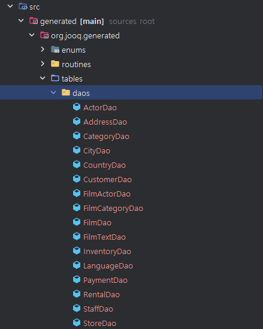

# 섹션 2-2. jOOQ Generated DAO 사용하기

### 1. Generated DAO 위치 확인


### step 2. 상속형태로 DAO 사용

```java
@Repository
public class FilmRepositoryIsA extends FilmDao {

    private final DSLContext dslContext;
    private final JFilm FILM = JFilm.FILM;

    public FilmRepositoryIsA(Configuration configuration, DSLContext dslContext) {
        super(configuration);
        this.dslContext = dslContext;
    }
}
```

### step 3. 컴포지션 관계로 DAO 사용

```java
@Repository
public class FilmRepositoryHasA {

    private final FilmDao dao;
    private final DSLContext dslContext;
    private final JFilm FILM = JFilm.FILM;

    public FilmRepositoryHasA(Configuration configuration, DSLContext dslContext) {
        this.dao = new FilmDao(configuration);
        this.dslContext = dslContext;
    }
}
```

### step 4. 테스트 코드로 동작확인

```java
@SpringBootTest
public class JooqDaoWrapperTest {

    @Autowired
    FilmRepositoryIsA filmRepositoryIsA;

    @Autowired
    FilmRepositoryHasA filmRepositoryHasA;

    @Test
    @DisplayName(""" 
            상속) 자동생성 DAO 사용
               - 영화 길이가 100 ~ 180 분 사이인 영화 조회
            """)
    void 상속_DAO_1() {
        // given
        var start = 100;
        var end = 180;

        // when
        List<Film> films = filmRepositoryIsA.fetchRangeOfJLength(start, end);

        // then
        assertThat(films).allSatisfy(film ->
                assertThat(film.getLength()).isBetween(start, end)
        );
    }

    @Test
    @DisplayName(""" 
            컴포지션) 자동생성 DAO 사용
               - 영화 길이가 100 ~ 180 분 사이인 영화 조회
            """)
    void 컴포지션_DAO_1() {
        // given
        var start = 100;
        var end = 180;

        // when
        List<Film> films = filmRepositoryHasA.fetchRangeOfLength(start, end);

        // then
        assertThat(films).allSatisfy(film ->
                assertThat(film.getLength()).isBetween(start, end)
        );
    }
}
```

### 별첨. generated DAO에서 필드에 jPrefix 가 붙는 이슈
https://github.com/jOOQ/jOOQ/issues/15926 (3.20에서 해결 후 릴리즈 예정)
