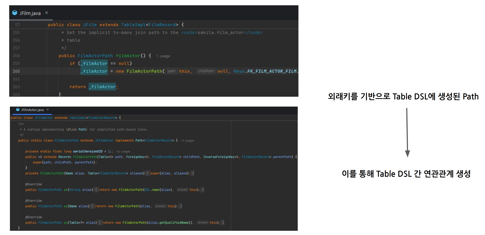
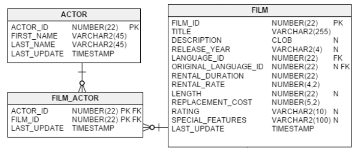

# 섹션 4-2. Testcontainers + Flyway를 통해 DDL로 jOOQ DSL 만들기

gradle 플러그인
- 여태까지 우리가 사용했던것
  - https://github.com/etiennestuder/gradle-jooq-plugin
- 이번에 우리가 사용할 것
  - https://github.com/monosoul/jooq-gradle-plugin
### 1. jOOQ plugin 교체

nu.studer.jooq -> dev.monosoul.jooq-docker로 교체

### 2. build.gradle 수정
```groovy
dependencies {
    // ...
    jooqCodegen project(':jooq-custom')
    jooqCodegen "org.jooq:jooq:${jooqVersion}"
    jooqCodegen "org.jooq:jooq-meta:${jooqVersion}"
    jooqCodegen "org.jooq:jooq-codegen:${jooqVersion}"
    
    jooqCodegen 'org.flywaydb:flyway-core:10.8.1'
    jooqCodegen 'org.flywaydb:flyway-mysql:10.8.1'
}
```

```groovy
import org.jooq.meta.jaxb.*

jooq {
    version = "${jooqVersion}"
    withContainer {
        image {
            name = "mysql:8.0.29"
            envVars = [
                MYSQL_ROOT_PASSWORD: "passwd",
                MYSQL_DATABASE     : "sakila"
            ]
        }

        db {
            username = "root"
            password = "passwd"
            name = "sakila"
            port = 3306
            jdbc {
                schema = "jdbc:mysql"
                driverClassName = "com.mysql.cj.jdbc.Driver"
            }
        }
    }
}

tasks {
    generateJooqClasses {
        schemas.set(["sakila"])
        outputDirectory.set(project.layout.projectDirectory.dir("src/generated"))
        includeFlywayTable.set(false)

        usingJavaConfig {
            generate = new Generate()
                    .withJavaTimeTypes(true)
                    .withDeprecated(false)
                    .withDaos(true)
                    .withFluentSetters(true)
                    .withRecords(true)

            withStrategy(
                    new Strategy().withName("jooq.custom.generator.JPrefixGeneratorStrategy")
            )

            database.withForcedTypes(
                    new ForcedType()
                            .withUserType("java.lang.Long")
                            .withTypes("int unsigned"),
                    new ForcedType()
                            .withUserType("java.lang.Integer")
                            .withTypes("tinyint unsigned"),
                    new ForcedType()
                            .withUserType("java.lang.Integer")
                            .withTypes("smallint unsigned")
            )
        }
    }
}
```

### 3. src/db/migration 폴더에 flyway 파일 추가
flyway에 사용될 파일은 ```V{버전 번호}__{name}.sql``` 형식이 되어야한다.
V1__init_tables.sql 이라는 파일로 추가

### 4. gradle -> jooq > generateJooqClasses 테스크 실행

#  path-based join을 통한 JOIN절 가독성 높이기

Jooq에서 연관관계를 통해 조인시 on절을 생략하고 싶다?



외래키가 없다면?

1. Synthetic foreign key 사용 (문서) (다만 상용 라이센스에서만 가능)

2. DSL 생성시에만 외래키를 구성할 수 있게 설정

   - Testcontainer + Flvwav에서 DDL에 EK 명시

   - JPA Entity의 필드에 @ JoinColumn으로 FK 명시

## path based join 종류

1. implicit path join (문서) (3.11~) **(비추천)**

Path를 통해 SELECT 절에서 암시적으로 하위 테이블의 컬럼에 접근

JOIN 절에 조인되는 테이블이 명시되지 않음 기본적으로는 many-to-one 관계에서만 동작하고

one-to-many 방식에서는 동작을 지정해야함 (3.19 ~)

implicit path join 을 끌 수 있다. 


2. explicit path join (문서) (3.19 ~) **(추천)**

Path를 통해 JOIN의 ON 절 생성

JOIN 절에 조인되는 테이블이 명시되어 있어 가독성 좋음


- Docs
  - Implicit path join (3.11 ~ )
    - https://www.jooq.org/doc/latest/manual/sql-building/sql-statements/select-statement/implicit-join/
  - Implicit to-many path join (3.19 ~ )
    - https://www.jooq.org/doc/latest/manual/sql-building/sql-statements/select-statement/implicit-to-many-join/
  - Explicit path join (3.19 ~ )
    - https://www.jooq.org/doc/latest/manual/sql-building/sql-statements/select-statement/explicit-path-join/
  - Synthetic foreign keys (상용 라이센스만 가능)
    - https://www.jooq.org/doc/latest/manual/code-generation/codegen-advanced/codegen-config-database/codegen-database-synthetic-objects/codegen-database-synthetic-fks/
    - 외래키가 없더라도 DSL 생성시 설정에서 외래키를 추가 할 수 있음

## NOTICE

해당 프로젝트는 4.2강의 testcontainers + flyway 형태로 작업되어있습니다.

Implicit path join은 가독성이 떨어지고, 실수하기 쉬워 사용을 비추천한다.
특히 **Implicit to-many path join** 는 사용하지 말자.

다만 Explicit path join 외래키가 지원된다면 추천한다.




### 1. FilmRepository 수정

```java
package org.sight.jooqstart.film;

import lombok.RequiredArgsConstructor;
import org.jooq.DSLContext;
import org.jooq.generated.tables.JActor;
import org.jooq.generated.tables.JFilm;
import org.jooq.generated.tables.JFilmActor;
import org.jooq.generated.tables.pojos.Film;
import org.jooq.impl.DSL;
import org.springframework.stereotype.Repository;

import java.util.List;

@Repository
@RequiredArgsConstructor
public class FilmRepository {
    // ...
    public List<FilmWithActor> findFilmWithActorsListImplicitPathJoin (Long page, Long pageSize) {
        final JFilmActor FILM_ACTOR = JFilmActor.FILM_ACTOR;
        return dslContext.select(
                        DSL.row(FILM.fields()),
                        DSL.row(FILM_ACTOR.fields()),
                        DSL.row(FILM_ACTOR.actor().fields())
                )
                .from(FILM)
                .join(FILM_ACTOR)
                    .on(FILM.FILM_ID.eq(FILM_ACTOR.FILM_ID))
                .limit(pageSize)
                .offset((page - 1) * pageSize)
                .fetchInto(FilmWithActor.class);
    }

    public List<FilmWithActor> findFilmWithActorsListExplicitPathJoin (Long page, Long pageSize) {
        return dslContext.select(
                        DSL.row(FILM.fields()),
                        DSL.row(FILM.filmActor().fields()),
                        DSL.row(FILM.filmActor().actor().fields())
                )
                .from(FILM)
                .join(FILM.filmActor())
                .join(FILM.filmActor().actor())
                .limit(pageSize)
                .offset((page - 1) * pageSize)
                .fetchInto(FilmWithActor.class);
    }
}
```

### 2. 테스트 코드 작성

```java
@SpringBootTest
public class JooqJoinShortCutTest {

    @Autowired
    FilmRepository filmRepository;

    @Test
    @DisplayName("implicitPathJoin_테스트")
    void implicitPathJoin_테스트() {

        List<FilmWithActor> original = filmRepository.findFilmWithActorsList(1L, 10L);
        List<FilmWithActor> implicit = filmRepository.findFilmWithActorsListImplicitPathJoin(1L, 10L);

        Assertions.assertThat(original)
                .usingRecursiveFieldByFieldElementComparator()
                .isEqualTo(implicit);
    }

    @Test
    @DisplayName("explicitPathJoin_테스트")
    void explicitPathJoin_테스트() {

        List<FilmWithActor> original = filmRepository.findFilmWithActorsList(1L, 10L);
        List<FilmWithActor> implicit = filmRepository.findFilmWithActorsListExplicitPathJoin(1L, 10L);

        Assertions.assertThat(original)
                .usingRecursiveFieldByFieldElementComparator()
                .isEqualTo(implicit);
    }
}
```

### 3. optional - jOOQ config

```java
@Configuration
public class JooqConfig {
    @Bean
    public DefaultConfigurationCustomizer jooqDefaultConfigurationCustomizer() {
        return c -> c.settings()
                .withExecuteDeleteWithoutWhere(ExecuteWithoutWhere.THROW)
                .withExecuteUpdateWithoutWhere(ExecuteWithoutWhere.THROW)
                .withRenderSchema(false)

                // implicit path join to-many는 기본적으로 에러를 발생시켜 이렇게 수동으로 조인을 지정 해야한다.
                 .withRenderImplicitJoinToManyType(RenderImplicitJoinType.INNER_JOIN)

                // implicit PATH JOIN many-to-one 을 비활성화 하고 싶다면 하고 싶다면
//                 .withRenderImplicitJoinType(RenderImplicitJoinType.THROW)
        ;
    }
}
```


# jooQ translator site에서 이기종 SOL 변환하기

https://www.jooq.org/translate/
