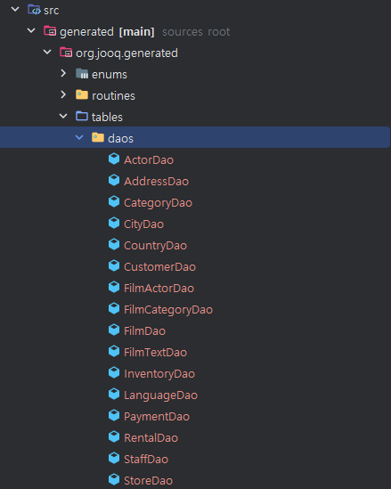
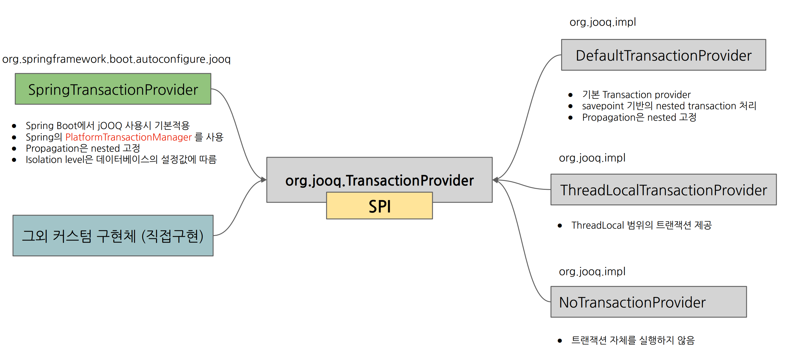
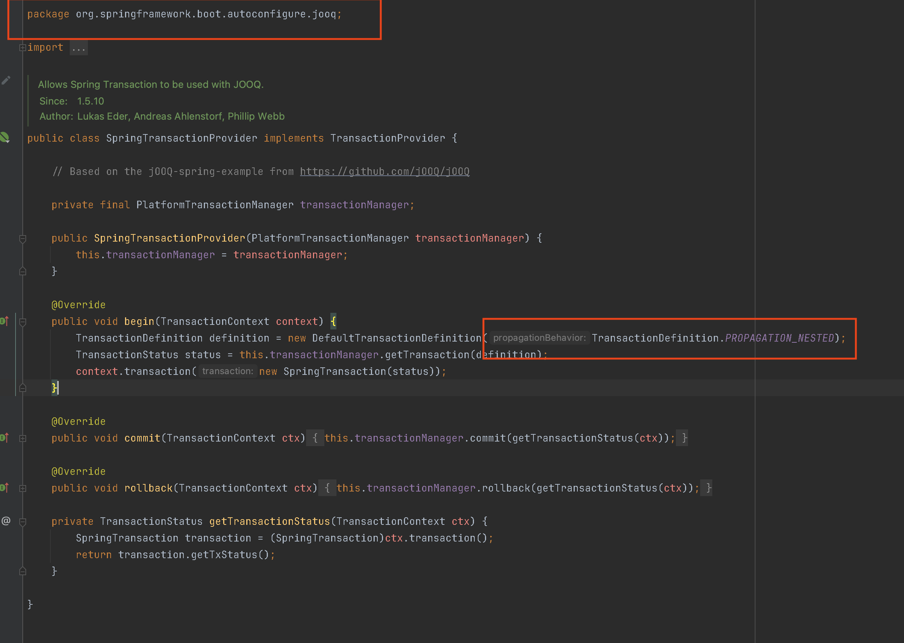
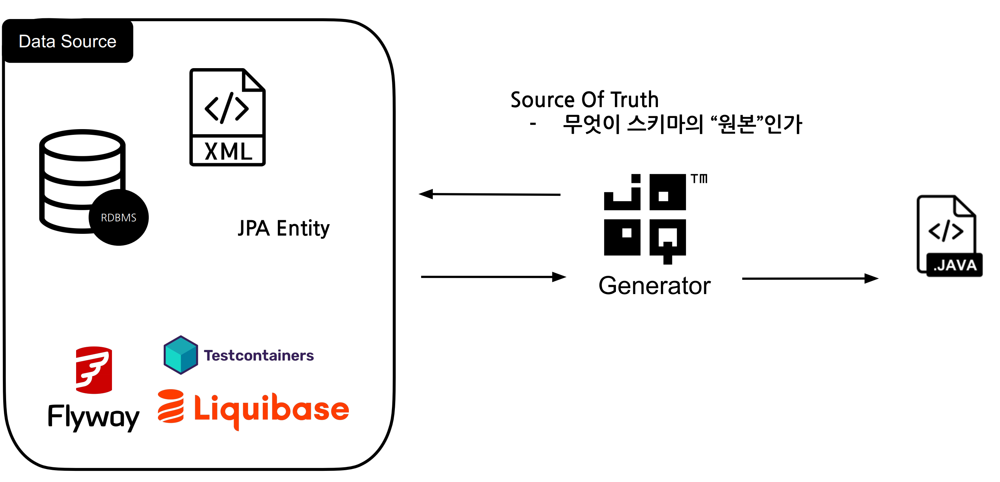
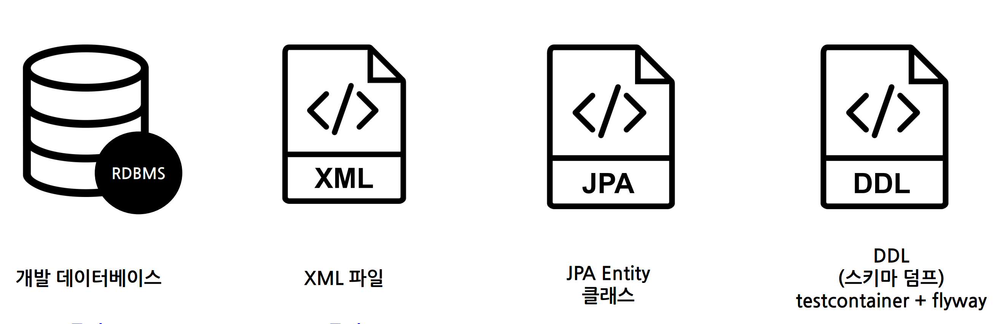
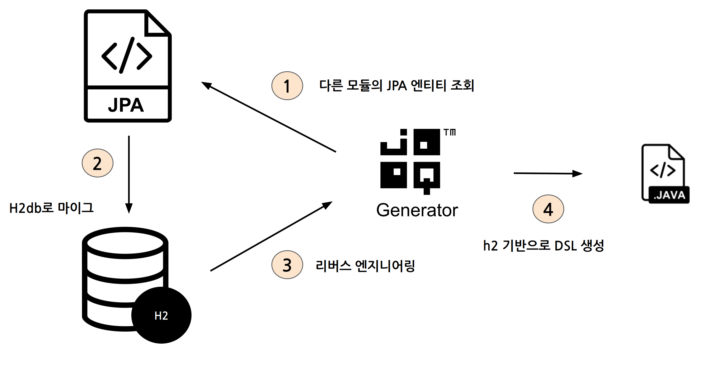
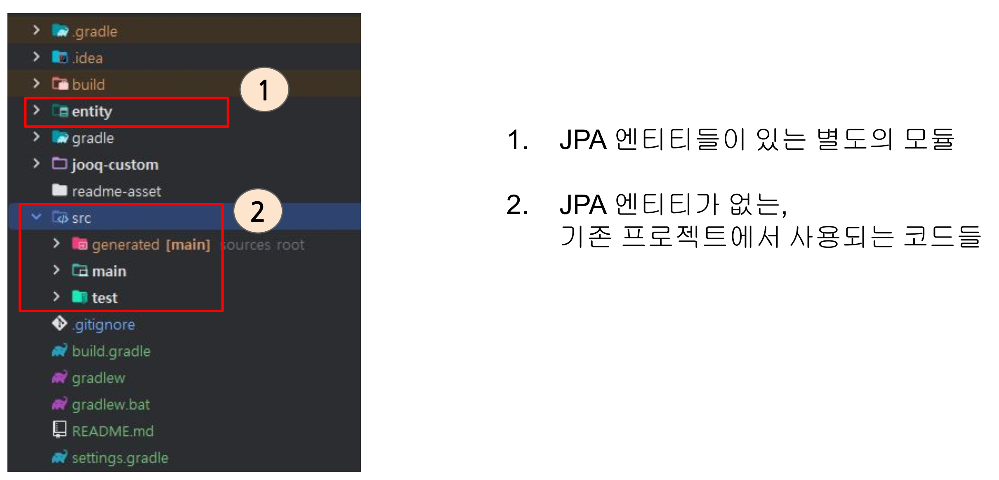
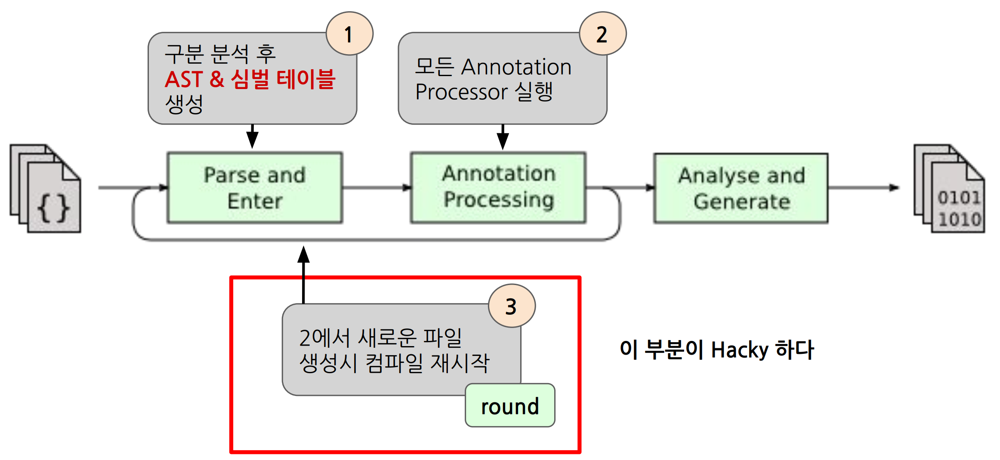
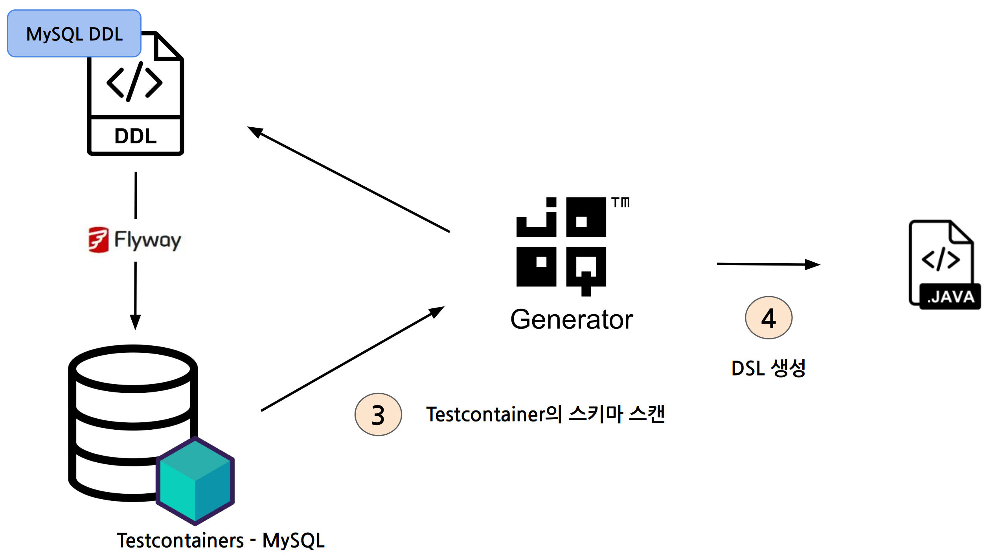
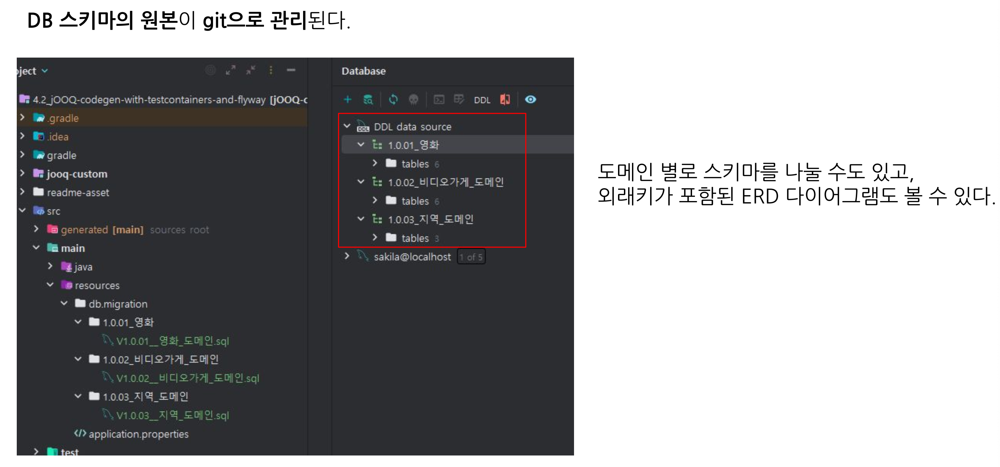

# 인프런 실전 JOOQ


* https://www.jooq.org/

[toc]

JOOQ : 자바 코드로 SQL을 작성하게 도와주는 라이브러리

### JOOQ의 주요 특징 및 장점

1. **타입 세이프 쿼리**: 컴파일 타임에 쿼리의 오류를 잡아내어 런타임 에러를 줄일 수 있습니다.
2. **강력한 SQL 지원**: 거의 모든 SQL 기능을 지원하며, 데이터베이스 벤더에 특화된 기능도 사용할 수 있습니다.
3. **직접적인 SQL 접근**: SQL을 코드에서 직접 작성할 수 있어, 복잡한 쿼리를 보다 직관적으로 작성할 수 있습니다.
4. **자동 코드 생성**: 데이터베이스 스키마에서 Java 클래스를 자동으로 생성하여, 개발자가 쉽게 사용할 수 있도록 합니다.
5. **유연성**: ORM보다 더 유연하게 데이터베이스 쿼리를 작성하고 실행할 수 있습니다.

### JOOQ의 단점

1. **복잡한 설정**: 초기 설정이 복잡할 수 있으며, 데이터베이스 스키마 변경 시 코드 재생성이 필요합니다.
2. **러닝 커브**: JOOQ에 익숙해지기 위해서는 러닝 커브가 존재합니다.
3. **객체 지향적 매핑 부족**: JPA와 같은 ORM만큼 객체 지향적 매핑을 제공하지 않습니다.

### JPA (Java Persistence API)와의 비교

**JPA (Java Persistence API)**는 자바 애플리케이션에서 관계형 데이터베이스의 데이터를 객체로 매핑하여 관리할 수 있게 해주는 표준 사양입니다. Hibernate와 같은 구현체가 있습니다.

### JPA의 장점

1. **객체 지향적 데이터베이스 접근**: 데이터베이스의 테이블을 객체로 매핑하여, 객체 지향 프로그래밍의 장점을 누릴 수 있습니다.
2. **자동화된 데이터베이스 연동**: CRUD 작업을 자동으로 처리해주어 개발 생산성을 높여줍니다.
3. **투명한 캐싱**: 1차 및 2차 캐시를 통해 데이터베이스 접근을 최적화할 수 있습니다.

### JPA의 단점

1. **복잡한 쿼리 제한**: 복잡한 쿼리나 특수한 데이터베이스 기능 사용이 어렵습니다.
2. **퍼포먼스 이슈**: 대량의 데이터를 처리할 때 퍼포먼스 문제가 발생할 수 있습니다.
3. **오버헤드**: 객체를 매핑하고 관리하는데 오버헤드가 발생할 수 있습니다.

### JOOQ와 JPA 비교

- **쿼리 작성 방식**: JOOQ는 SQL을 직접 작성하고 타입 세이프하게 사용할 수 있으며, JPA는 JPQL이나 Criteria API를 사용하여 객체 지향적으로 쿼리를 작성합니다.
- **유연성**: JOOQ는 SQL의 모든 기능을 활용할 수 있는 반면, JPA는 ORM으로서의 추상화된 데이터베이스 접근을 제공합니다.
- **학습 곡선**: JPA는 객체 지향적 패러다임에 익숙한 개발자에게 친숙한 반면, JOOQ는 SQL에 대한 깊은 이해가 필요합니다.
- **퍼포먼스**: JOOQ는 SQL을 직접 실행하므로 최적화된 쿼리를 작성할 수 있지만, JPA는 데이터 매핑과 관련된 오버헤드가 있습니다.


# 프로젝트 세팅

* https://github.com/jOOQ/sakila
* https://github.com/jOOQ/sakila/tree/main/mysql-sakila-db

https://github.com/etiennestuder/gradle-jooq-plugin 를 사용해야 한다 

```
plugins {
    id 'nu.studer.jooq' version '9.0'
}
```

## 환경설정하기

### Step 1. Spring Initializer로 Spring Boot 프로젝트 생성

```build.gradle```에 아래와 같이 디펜던시 추가

```
buildscript {
	ext {
		jooqVersion = '3.19.5'
	}
}

// ... 

dependencies {
    implementation 'org.springframework.boot:spring-boot-starter'
    
    // jOOQ 의존성 수동설정
    implementation ('org.springframework.boot:spring-boot-starter-jooq') {
        exclude group: 'org.jooq:jooq' // 구버전이 있기 때문에 제거해야 한다. 
    }
    
    implementation "org.jooq:jooq:${jooqVersion}"
    runtimeOnly 'com.mysql:mysql-connector-j'
    testImplementation 'org.springframework.boot:spring-boot-starter-test'
}
```

### Step 2. nu.studer.jooq gradle plugin 추가

```
plugins {
    // ...
	id 'nu.studer.jooq' version '9.0'
}
```

### Step 3. jOOQ 설정

```
String dbUser   = System.properties["db-user"]   ?: "root"
String dbPasswd = System.properties["db-passwd"] ?: "passwd"

jooq {
	version = "${jooqVersion}"
	configurations {
		sakilaDB {
			generationTool {
			    
			    // DB 접속정보
				jdbc {
					driver = 'com.mysql.cj.jdbc.Driver'
					url = 'jdbc:mysql://localhost:3306'
					user = "${dbUser}"
					password = "${dbPasswd}"
				}
				
				
				generator {
					name = 'org.jooq.codegen.DefaultGenerator'

					database {
						name = 'org.jooq.meta.mysql.MySQLDatabase'

						schemata {
							schema {
								inputSchema = 'sakila'
							}
						}
					}
					
					generate {
						daos = true
						records = true
						immutablePojos = true
						fluentSetters = true
						javaTimeTypes = true
						deprecated = false
					}

					target {
						directory = 'src/generated'
					}
				}
			}
		}
	}
}
```

### Step 4. sourceSet에 src/generated 추가

```build.gradle```

```
sourceSets {
	main {
		java {
			srcDirs = ["src/main/java", "src/generated"]
		}
	}
}
```

### Step 5. jooq-codegen에 의존성 추가

```build.gradle```

```groovy
dependencies {
    // ...
    jooqGenerator 'com.mysql:mysql-connector-j'
	jooqGenerator "org.jooq:jooq:${jooqVersion}"
	jooqGenerator "org.jooq:jooq-meta:${jooqVersion}"
}
```

### Step 6. generateSakilaDBJooq task 실행

* configurations + xxx(sakila) + jooq 로 테스크가 생성된다


# DSL 커스텀하기


1. DSL generate strategy
   1.  DSL 생성 클래스 이름 커스텀

2. DSL generate
   1. DSL들 중에서 무엇을 생성할지 커스텀

3. jOOQ runtime configuration
   1. 런타임 j000 커스텀


## DSL generate strategy

DSL 생성 클래스 이름 커스텀

클래스 이름에 프리픽스나 서픽스 등 공통 클래스명 부여 가능 

1. 제너레이터 구현 

```java
package jooq.custom.generator;

public class JPrefixGeneratorStrategy extends DefaultGeneratorStrategy {

    @Override
    public String getJavaClassName(final Definition definition, final Mode mode) {
        if (mode == Mode.DEFAULT) {
            return "J" + super.getJavaClassName(definition, mode);
        }
        return super.getJavaClassName(definition, mode);
    }
}

```

2. gradle에서 제너레이터 적용

```java
jooq {
	version = "${jooqVersion}"
	configurations {
		sakilaDB {
			generationTool {
				jdbc {
					driver = 'com.mysql.cj.jdbc.Driver'
					url = 'jdbc:mysql://localhost:3306'
					user = "${dbUser}"
					password = "${dbPasswd}"
				}

				generator {
					name = 'org.jooq.codegen.DefaultGenerator'

					database {
						name = 'org.jooq.meta.mysql.MySQLDatabase'
						unsignedTypes = true
						schemata {
							schema {
								inputSchema = 'sakila'
							}
						}
					}

					generate {
						daos = true
						records = true
						fluentSetters = true
						javaTimeTypes = true
						deprecated = false
					}

					target {
						directory = 'src/generated'
					}

					// jooq-custom 내부의 설정 here
					strategy.name = 'jooq.custom.generator.JPrefixGeneratorStrategy'
				}
			}
		}
	}
}
```

## DSL generate

DSL들 중에서 무엇을 생성할지 커스텀

**generate 설정 블록**

```java
generate {
	daos = true
	records = true
	fluentSetters = true
	javaTimeTypes = true
	deprecated = false
}
```

### JOOQ 설정 옵션 및 기본값

| 옵션명             | 설명                                                         | 기본값  | 추가 설명                                                    |
| ------------------ | ------------------------------------------------------------ | ------- | ------------------------------------------------------------ |
| **daos**           | DAO를 생성할지 여부를 지정합니다. DAO는 데이터베이스와의 상호작용을 캡슐화하여 편리하게 사용할 수 있는 객체입니다. | `false` | DSL 생성 시 일부 편의 기능이 완성되어 있는 DAO를 자동으로 생성합니다. |
| **records**        | JOOQ Records 클래스를 생성할지 여부를 지정합니다. Record 클래스는 데이터베이스의 행(row)을 나타내며, ActiveRecord 패턴을 지원합니다. | `true`  | Record 클래스는 데이터베이스 테이블에 대응되는 ActiveRecord를 자동으로 생성합니다. |
| **immutablePojos** | 불변(immutable) POJO를 생성할지 여부를 지정합니다. 불변 POJO는 생성된 이후 상태가 변경되지 않는 객체입니다. | `false` | Immutable POJO는 데이터베이스 테이블에 대응되는 POJO를 자동으로 생성합니다. |
| **fluentSetters**  | 플루언트 스타일의 setter 메서드를 생성할지 여부를 지정합니다. 플루언트 스타일의 setter는 setter 메서드가 객체 자체를 반환하여 체이닝을 가능하게 합니다. | `false` | POJO나 Record 생성 시 setter 메서드가 `void`를 반환하는 대신 객체 자체를 반환합니다. |
| **javaTimeTypes**  | `java.time` 패키지의 날짜/시간 타입을 사용할지 여부를 지정합니다. `java.time` 패키지는 Java 8에서 도입된 새로운 날짜/시간 API입니다. | `false` | 기본적으로 `java.sql.Date`, `java.sql.Time`, `java.sql.Timestamp` 타입을 사용합니다. 이 옵션을 활성화하면 `java.time.LocalDate`, `java.time.LocalTime`, `java.time.LocalDateTime` 타입을 사용합니다. |
| **unsignedTypes**  | MySQL에서 제공하는 unsigned 타입 사용 여부를 지정합니다. 사용을 권장하지 않습니다. | `false` | unsigned 타입은 주로 MySQL에서 사용되며, 데이터베이스에서 제공하는 unsigned 타입을 사용할지 여부를 결정합니다. |
| **forcedTypes**    | 특정 데이터 타입을 DSL에서 강제로 다른 타입으로 지정할 수 있습니다. 예를 들어, INET, JSON 타입을 varchar로 지정할 수 있습니다. | 없음    | 데이터베이스의 특정 타입을 JOOQ 코드 생성 시 다른 타입으로 강제 지정할 수 있습니다. |

### JOOQ 설정 옵션 (Spring 및 JPA 관련)

| 옵션명                     | 설명                                                         | 기본값  | 추가 설명                                                    |
| -------------------------- | ------------------------------------------------------------ | ------- | ------------------------------------------------------------ |
| **jpaAnnotations**         | 생성된 코드에 JPA 애노테이션을 추가할지 여부를 지정합니다.   | `false` | 이 옵션을 활성화하면, JOOQ가 생성한 POJO 클래스에 JPA 애노테이션(@Entity, @Table 등)이 추가됩니다. |
| **jpaVersion**             | 생성된 코드에 사용할 JPA 버전을 지정합니다.                  | `2.1`   | JPA 애노테이션을 사용할 때 JPA 버전을 지정합니다. 예를 들어, `2.0`, `2.1`, `2.2` 등을 사용할 수 있습니다. |
| **validationAnnotations**  | 생성된 코드에 JSR-303/JSR-380 Bean Validation 애노테이션을 추가할지 여부를 지정합니다. | `false` | 이 옵션을 활성화하면, JOOQ가 생성한 POJO 클래스에 Bean Validation 애노테이션(@NotNull, @Size 등)이 추가됩니다. |
| **springAnnotations**      | 생성된 코드에 Spring 애노테이션을 추가할지 여부를 지정합니다. | `false` | 이 옵션을 활성화하면, JOOQ가 생성한 클래스에 Spring 애노테이션(@Component, @Autowired 등)이 추가됩니다. |
| **springDao**              | 생성된 DAO 클래스에 Spring DAO 지원을 추가할지 여부를 지정합니다. | `false` | 이 옵션을 활성화하면, JOOQ가 생성한 DAO 클래스에 Spring DAO 지원이 추가됩니다. |
| **constructorProperties**  | 생성된 POJO 클래스에 `@ConstructorProperties` 애노테이션을 추가할지 여부를 지정합니다. | `false` | 이 옵션을 활성화하면, JOOQ가 생성한 POJO 클래스에 `@ConstructorProperties` 애노테이션이 추가됩니다. |
| **globalObjectReferences** | 생성된 POJO 클래스에서 전역 객체 참조를 사용할지 여부를 지정합니다. | `true`  | 전역 객체 참조를 사용하면, 객체의 동일성을 유지하기 쉽게 됩니다. |
| **pojos**                  | POJO 클래스를 생성할지 여부를 지정합니다.                    | `true`  | 이 옵션을 활성화하면, 데이터베이스 테이블에 대응되는 POJO 클래스가 생성됩니다. |
| **daos**                   | DAO(Data Access Object)를 생성할지 여부를 지정합니다.        | `false` | 이 옵션을 활성화하면, 데이터베이스 테이블에 대응되는 DAO 클래스가 생성됩니다. |
| **interfaces**             | 생성된 POJO와 DAO 클래스에 인터페이스를 추가할지 여부를 지정합니다. | `false` | 이 옵션을 활성화하면, 생성된 POJO와 DAO 클래스에 인터페이스가 추가되어 더 유연한 코드를 작성할 수 있습니다. |
| **generatedAnnotation**    | 생성된 클래스에 `@Generated` 애노테이션을 추가할지 여부를 지정합니다. | `true`  | 이 옵션을 활성화하면, JOOQ가 생성한 클래스에 `@Generated` 애노테이션이 추가됩니다. |

```
generate {
    jpaAnnotations = true  // 생성된 코드에 JPA 애노테이션 추가 여부 (기본값: false)
    jpaVersion = '2.1'  // 생성된 코드에 사용할 JPA 버전 지정 (기본값: 2.1)
    validationAnnotations = true  // 생성된 코드에 Bean Validation 애노테이션 추가 여부 (기본값: false)
    springAnnotations = true  // 생성된 코드에 Spring 애노테이션 추가 여부 (기본값: false)
    springDao = true  // 생성된 DAO 클래스에 Spring DAO 지원 추가 여부 (기본값: false)
}
```

## jOOQ runtime configuration

런타임 j000 커스텀

JOOQ의 설정을 Spring 애플리케이션에서 구성하기 위한 Spring Configuration 클래스

```java
@Configuration
public class JooqConfig {

    @Bean
    Settings jooqSettings() {
        return new Settings()
                .withRenderSchema(false);
    }
}
```

* `withRenderSchema(false)` 설정을 통해 JOOQ가 SQL 쿼리를 생성할 때 스키마 이름을 포함하지 않도록 함


# JOOQ DAO 사용법

# 섹션 2-2. jOOQ Generated DAO 사용하기

### 1. Generated DAO 위치 확인



### step 2. 상속형태로 DAO 사용

```java
@Repository
public class FilmRepositoryIsA extends FilmDao {

    private final DSLContext dslContext;
    private final JFilm FILM = JFilm.FILM;

    public FilmRepositoryIsA(Configuration configuration, DSLContext dslContext) {
        super(configuration);
        this.dslContext = dslContext;
    }
}
```

### step 3. 컴포지션 관계로 DAO 사용

```java
@Repository
public class FilmRepositoryHasA {

    private final FilmDao dao;
    private final DSLContext dslContext;
    private final JFilm FILM = JFilm.FILM;

    public FilmRepositoryHasA(Configuration configuration, DSLContext dslContext) {
        this.dao = new FilmDao(configuration);
        this.dslContext = dslContext;
    }
}
```

### step 4. 테스트 코드로 동작확인

```java
@SpringBootTest
public class JooqDaoWrapperTest {

    @Autowired
    FilmRepositoryIsA filmRepositoryIsA;

    @Autowired
    FilmRepositoryHasA filmRepositoryHasA;

    @Test
    @DisplayName(""" 
            상속) 자동생성 DAO 사용
               - 영화 길이가 100 ~ 180 분 사이인 영화 조회
            """)
    void 상속_DAO_1() {
        // given
        var start = 100;
        var end = 180;

        // when
        List<Film> films = filmRepositoryIsA.fetchRangeOfJLength(start, end);

        // then
        assertThat(films).allSatisfy(film ->
                assertThat(film.getLength()).isBetween(start, end)
        );
    }

    @Test
    @DisplayName(""" 
            컴포지션) 자동생성 DAO 사용
               - 영화 길이가 100 ~ 180 분 사이인 영화 조회
            """)
    void 컴포지션_DAO_1() {
        // given
        var start = 100;
        var end = 180;

        // when
        List<Film> films = filmRepositoryHasA.fetchRangeOfLength(start, end);

        // then
        assertThat(films).allSatisfy(film ->
                assertThat(film.getLength()).isBetween(start, end)
        );
    }
}
```

### 별첨. generated DAO에서 필드에 jPrefix 가 붙는 이슈

https://github.com/jOOQ/jOOQ/issues/15926 (3.20에서 해결 후 릴리즈 예정)


# JOOQ WHERE Condition

# 섹션 2-3. 조건절 및 동적 조건절 만들기

### 0. 조건절

jOOQ에서 where, having 절 안에 들어가는 조건은  
모두 ```org.jooq.Condition``` 를 상속받는 구현체이다.  
조건절에 사용되는 Condition 들은 모두 메서드 체이닝 형태로 사용할 수 있다.

### 1. AND 절과 OR 절

#### 1.1 AND 절

- and 조건 검색 - fistName와 LastName이 일치하는 배우 조회

```java
@Repository
@RequiredArgsConstructor
public class ActorRepository {
    
    private final DSLContext dslContext;
    
    // ...
    
    Actor fetchActorByFirstNameAndLastName(String firstName, String lastName) {
        return dslContext.selectFrom(ACTOR)
                .where(ACTOR.FIRST_NAME.eq(firstName).and(ACTOR.LAST_NAME.eq(lastName)))
                .fetch();
    }

    // 또는 
    Actor fetchActorByFirstNameAndLastName(String firstName, String lastName) {
        return dslContext.selectFrom(ACTOR)
                .where(
                        ACTOR.FIRST_NAME.eq(firstName),
                        ACTOR.LAST_NAME.eq(lastName)
                ).fetch();
    }   
}
```

```mysql
select `actor`.`actor_id`, 
       `actor`.`first_name`,
       `actor`.`last_name`,
       `actor`.`last_update` 
from `actor` 
where (`actor`.`first_name` = ? and `actor`.`last_name` = ?)
```

#### 1.2 OR 절

- or 조건 검색 - fistName 또는 LastName이 일치하는 배우 조회

```java
@Repository
@RequiredArgsConstructor
public class ActorRepository {

    private final DSLContext dslContext;
    
    // ...
    public List<Actor> fetchActorByFirstNameOrLastName(String firstName, String lastName) {
        return dslContext.selectFrom(ACTOR)
                .where(
                        ACTOR.FIRST_NAME.eq(firstName)
                                .or(ACTOR.LAST_NAME.eq(lastName))
                )
                .fetchInto(Actor.class);[README.md](README.md)
    }
}
```

```mysql
select `actor`.`actor_id`, 
       `actor`.`first_name`,
       `actor`.`last_name`,
       `actor`.`last_update`
from `actor`
where (`actor`.`first_name` = ? or `actor`.`last_name` = ?)
```

### 2. Dynamic Condition 만들기

조건절에서 DSL.noCondition()을 사용하여 조건이 없는 경우 조건절에서 제외할 수 있음.

```java
import org.jooq.Condition;
import org.jooq.Field;
import org.jooq.impl.DSL;

public class JooqConditionUtils {
    public static <T> Condition eqIfNotNull(Field<T> field, T value) {
        if (value == null) {
            return DSL.noCondition();
        }
        return field.eq(value);
    }
}
```

### 3. in 절 동적조건절 만들기

- in절 - 동적 조건 검색

```java
public class JooqListConditionUtils {
    public static <T> Condition inIfNotEmpty(Field<T> field, List<T> values) {
        if (CollectionUtils.isEmpty(values)) {
            return DSL.noCondition();
        }
        return field.in(values);
    }
}
```

```java
@Repository
public class ActorRepository {

    private final DSLContext dslContext;

    // ...
    public List<Actor> findByActorIdIn(List<Long> actorIdList) {
        return dslContext.selectFrom(ACTOR)
                .where(inIfNotEmpty(ACTOR.ACTOR_ID, actorIdList))
                .fetchInto(Actor.class);
    }
}
```

## 4. 다중 조건 검색

```java
@Builder
@Getter
public class ActorFilmographySearchOption {

    // 배우 이름
    private final String actorName;

    // 영화 제목
    private final String filmTitle;
}
```

```java
@Repository
public class ActorRepository {

    private final DSLContext dslContext;
    
    // ...

    public List<ActorFilmography> findActorFilmographyByFullName(ActorFilmographySearchOption searchOption) {
        final JFilmActor FILM_ACTOR = JFilmActor.FILM_ACTOR;
        final JFilm FILM = JFilm.FILM;

        Map<Actor, List<Film>> actorListMap = dslContext.select(
                        DSL.row(ACTOR.fields()).as("actor"),
                        DSL.row(FILM.fields()).as("films")
                )
                .from(ACTOR)
                .join(FILM_ACTOR)
                .on(ACTOR.ACTOR_ID.eq(FILM_ACTOR.ACTOR_ID))
                .join(FILM)
                .on(FILM_ACTOR.FILM_ID.eq(FILM.FILM_ID))
                .where(
                        // 배우 full name like 검색
                        containsIfNotBlank(ACTOR.FIRST_NAME.concat(" ").concat(ACTOR.LAST_NAME), searchOption.getActorName()),

                        // 영화 제목 like 검색
                        containsIfNotBlank(FILM.TITLE, searchOption.getFilmTitle())
                )
                .fetchGroups(
                        record -> record.get("actor", Actor.class),
                        record -> record.get("films", Film.class)
                );

        return actorListMap.entrySet().stream()
                .map(entry -> new ActorFilmography(entry.getKey(), entry.getValue()))
                .collect(Collectors.toList());
    }
}
```


## And랑 Or랑 같이 사용

```java
    public List<Actor> findByFirstnameOrLastName(String firstName, String lastName) {
        return dslContext.selectFrom(ACTOR)
                .where(
                        ACTOR.FIRST_NAME.eq(firstName).or(ACTOR.LAST_NAME.eq(lastName)), // 이렇게 ,로 구분하면 OR절이 포함된 검색조건과 AND절이 있는 검색조건을 함께 사용할 수 있습니다.
                        ACTOR.FIRST_NAME.eq(firstName)
                ).fetchInto(Actor.class);
    }
```


# Subquery

# 섹션 2-4. 서브쿼리

### 1. 스칼라 서브쿼리 (SELECT 절)

영화별 대여료가 1.0 이하면 'Cheap', 3.0 이하면 'Moderate', 그 이상이면 'Expensive'로 분류하고, 각 영화의 총 재고 수를 조회한다.

```mysql
SELECT
    film.film_id,
    film.title,
    film.rental_rate,
    CASE
        WHEN rental_rate <= 1.0 THEN 'Cheap'
        WHEN rental_rate <= 3.0 THEN 'Moderate'
        ELSE 'Expensive'
    END AS price_category,
    (SELECT COUNT(*) FROM inventory where film_id = film.film_id) AS total_inventory
FROM FILM;
```

### 2. 인라인 뷰 (FROM 절)

평균 대여 기간이 가장 긴 영화부터 정렬해서 조회한다.

```mysql
SELECT film.film_id,
       film.title,
       rental_duration_info.average_rental_duration
FROM film
JOIN
     (SELECT inventory.film_id, AVG(DATEDIFF(rental.return_date, rental.rental_date)) AS average_rental_duration
      FROM rental JOIN
          inventory ON rental.inventory_id = inventory.inventory_id
      WHERE rental.return_date IS NOT NULL
      GROUP BY inventory.film_id
     ) AS rental_duration_info
    ON film.film_id = rental_duration_info.film_id
ORDER BY rental_duration_info.average_rental_duration DESC;
```

### 3. 서브쿼리 

대여된 기록이 있는 영화가 있는 영화만 조회한다.

```mysql
SELECT
  film.*
FROM
  film
WHERE EXISTS (
  SELECT 1
  FROM inventory
  JOIN rental ON inventory.inventory_id = rental.inventory_id
  WHERE inventory.film_id = film.film_id
)
```

## 정답

#### 1. 스칼라 서브쿼리 (SELECT 절)

```java
@Repository
public class FilmRepositoryHasA {
    private DSLContext dslContext;
    // ...
    public List<FilmPriceSummary> findFilmPriceSummaryByFilmTitleLike(String filmTitle) {
        final JInventory INVENTORY = JInventory.INVENTORY;
        return dslContext.select(
                        FILM.FILM_ID,
                        FILM.TITLE,
                        FILM.RENTAL_RATE,
                        case_()
                                .when(FILM.RENTAL_RATE.le(BigDecimal.valueOf(1.0)), "Cheap")
                                .when(FILM.RENTAL_RATE.le(BigDecimal.valueOf(3.0)), "Moderate")
                                .otherwise("Expensive").as("price_category"),
                        DSL.selectCount().from(INVENTORY).where(INVENTORY.FILM_ID.eq(FILM.FILM_ID)).asField("total_inventory")
                ).from(FILM)
                .where(containsIfNotBlank(FILM.TITLE, filmTitle))
                .fetchInto(FilmPriceSummary.class);
    }
}
```

### 2. 인라인 뷰 (FROM 절)

```java
@Repository
public class FilmRepositoryHasA {
    private DSLContext dslContext;
    // ...
    public List<FilmRentalSummary> findFilmRentalSummaryByFilmTitleLike(String filmTitle) {
        JInventory INVENTORY = JInventory.INVENTORY;
        JRental RENTAL = JRental.RENTAL;

        var rentalDurationInfoSubquery = select(INVENTORY.FILM_ID,
                avg(DSL.localDateTimeDiff(DatePart.DAY, RENTAL.RENTAL_DATE, RENTAL.RETURN_DATE)).as("average_rental_duration"))
                .from(RENTAL)
                .join(INVENTORY)
                .on(RENTAL.INVENTORY_ID.eq(INVENTORY.INVENTORY_ID))
                .where(RENTAL.RETURN_DATE.isNotNull())
                .groupBy(INVENTORY.FILM_ID)
                .asTable("rental_duration_info");

        return dslContext.select(FILM.FILM_ID, FILM.TITLE, rentalDurationInfoSubquery.field("average_rental_duration"))
                .from(FILM)
                .join(rentalDurationInfoSubquery)
                .on(FILM.FILM_ID.eq(rentalDurationInfoSubquery.field(INVENTORY.FILM_ID)))
                .where(containsIfNotBlank(FILM.TITLE, filmTitle))
                .orderBy(field(name("average_rental_duration")).desc())
                .fetchInto(FilmRentalSummary.class);
    }
}
```

### 3. 서브쿼리

```java
@Repository
public class FilmRepositoryHasA {
    private DSLContext dslContext;
    // ...
    public List<Film> findRentedFilmByTitle(String filmTitle) {
        JInventory INVENTORY = JInventory.INVENTORY;
        JRental RENTAL = JRental.RENTAL;

        return dslContext.selectFrom(FILM)
                .whereExists(selectOne()
                        .from(INVENTORY)
                        .join(RENTAL).on(INVENTORY.INVENTORY_ID.eq(RENTAL.INVENTORY_ID))
                        .where(INVENTORY.FILM_ID.eq(FILM.FILM_ID))
                ).and(containsIfNotBlank(FILM.TITLE, filmTitle))
                .fetchInto(Film.class);
    }
}
```


# EnumConverter 이용하기

# 섹션 2-5. EnumConverter 를 통한 Enum Mapping 하기

### 1. FilmPriceSummary 수정

```java
@Getter
public class FilmPriceSummary {

    private Long filmId;
    private String title;
    private PriceCategory priceCategory;
    private BigDecimal rentalRate;
    private Long totalInventory;

    @Getter
    public enum PriceCategory {
        CHEAP("Cheap"),
        MODERATE("Moderate"),
        EXPENSIVE("Expensive")
        ;

        private final String code;

        PriceCategory(String code) {
            this.code = code;
        }

        public static PriceCategory findByCode (String code) {
            for (PriceCategory value : values()) {
                if (value.code.equalsIgnoreCase(code)) {
                    return value;
                }
            }
            return null;
        }
    }
}
```

### 2. EnumConverter 생성

평균 대여 기간이 가장 긴 영화부터 정렬해서 조회한다.

```java
public class PriceCategoryConverter extends EnumConverter<String, FilmPriceSummary.PriceCategory>{

    public PriceCategoryConverter() {
        super(String.class, FilmPriceSummary.PriceCategory.class, FilmPriceSummary.PriceCategory::getCode);
    }
}
```

### 3. EnumConverter 사용

```java
@Repository
public class FilmRepositoryHasA {

    private final DSLContext dslContext;
    
    // ...
    
    public List<FilmPriceSummary> findFilmPriceSummaryByFilmTitleLike(String filmTitle) {
        final JInventory INVENTORY = JInventory.INVENTORY;
        return dslContext.select(
                        FILM.FILM_ID,
                        FILM.TITLE,
                        FILM.RENTAL_RATE,
                        case_()
                                .when(FILM.RENTAL_RATE.le(BigDecimal.valueOf(1.0)), "Cheap")
                                .when(FILM.RENTAL_RATE.le(BigDecimal.valueOf(3.0)), "Moderate")
                                .else_("Expensive").as("price_category").convert(new PriceCategoryConverter()),
                        selectCount().from(INVENTORY).where(INVENTORY.FILM_ID.eq(FILM.FILM_ID)).asField("total_inventory")
                ).from(FILM)
                .where(containsIfNotBlank(FILM.TITLE, filmTitle))
                .fetchInto(FilmPriceSummary.class);
    }
}
```

# jOOQ로 데이터 생성하기 insert

### 1. 자동생성된 DAO를 통한 insert

```java
@Repository
public class ActorRepository {
    public Actor saveByDao(Actor actor) {
        // 이때 PK (actorId)가 actor 객체에 추가됨
        actorDao.insert(actor);
        return actor;
    }   
}
```

### 2. ActiveRecord 를 통한 insert

```java
@Repository
public class ActorRepository {
    public ActorRecord saveByRecord(Actor actor) {
        ActorRecord actorRecord = dslContext.newRecord(ACTOR, actor);
        actorRecord.insert();
        return actorRecord;
    }
}
```

### 3. SQL 실행 후 PK만 반환

```java
@Repository
public class ActorRepository {
    public Long saveWithReturningPkOnly(Actor actor) {
        return dslContext.insertInto(ACTOR,
                        ACTOR.FIRST_NAME,
                        ACTOR.LAST_NAME
                )
                .values(
                        actor.getFirstName(),
                        actor.getLastName()
                )
                .returningResult(ACTOR.ACTOR_ID)
                .fetchOneInto(Long.class);
    }
}
```

### 4. SQL 실행 후 해당 ROW 전체 반환

```java
@Repository
public class ActorRepository {
    public Actor saveWithReturning(Actor actor) {
        return dslContext.insertInto(ACTOR,
                        ACTOR.FIRST_NAME,
                        ACTOR.LAST_NAME
                )
                .values(
                        actor.getFirstName(),
                        actor.getLastName()
                )
                .returning(ACTOR.fields())
                .fetchOneInto(Actor.class);
    }
}
```

### 5. Bulk Insert

```java
@Repository
public class ActorRepository {
    public void bulkInsertWithRows(List<Actor> actorList) {
        var rows = actorList.stream()
                .map(actor -> DSL.row(
                        actor.getFirstName(),
                        actor.getLastName()
                )).toList();

        dslContext.insertInto(ACTOR,
                        ACTOR.FIRST_NAME, ACTOR.LAST_NAME
                ).valuesOfRows(rows)
                .execute();
    }
}
```


# UPDATE DELETE

- Docs
  - update: https://www.jooq.org/doc/latest/manual/sql-building/sql-statements/update-statement
  - delete: https://www.jooq.org/doc/latest/manual/sql-building/sql-statements/delete-statement/

### 1. update 절

#### 1.1 동적으로 필드 업데이트

```java
@Getter
@Builder
public class ActorUpdateRequest {
    private String firstName;
    private String lastName;
}
```

```java
public int updateWithDto(Long actorId, ActorUpdateRequest request) {
    var firstName = StringUtils.hasText(request.getFirstName()) ? val(request.getFirstName()) : noField(ACTOR.FIRST_NAME);
    var lastName = StringUtils.hasText(request.getLastName()) ? val(request.getLastName()) : noField(ACTOR.LAST_NAME);

    return dslContext.update(ACTOR)
            .set(ACTOR.FIRST_NAME, firstName)
            .set(ACTOR.LAST_NAME, lastName)
            .where(ACTOR.ACTOR_ID.eq(actorId))
            .execute();
}
```

#### 1.1 동적으로 필드 업데이트 (ActiveRecord 사용)

```java
public int updateWithRecord(Long actorId, ActorUpdateRequest request) {
    var record = dslContext.newRecord(ACTOR);

    if (StringUtils.hasText(request.getFirstName())) {
        record.setFirstName(request.getFirstName());
    }

    if (StringUtils.hasText(request.getLastName())) {
        record.setLastName(request.getLastName());
    }

    return dslContext.update(ACTOR)
            .set(record)
            .where(ACTOR.ACTOR_ID.eq(actorId))
            .execute();
    // 또는
    // record.setActorId(actorId);
    // return record.update();
}
```

### 1. delete 절

```java
public int delete(Long actorId) {
    return dslContext.deleteFrom(ACTOR)
            .where(ACTOR.ACTOR_ID.eq(actorId))
            .execute();
}

public int deleteWithActiveRecord(Long actorId) {
    ActorRecord actorRecord = dslContext.newRecord(ACTOR);
    actorRecord.setActorId(actorId);
    return actorRecord.delete();
}
```

## WHERE 절이 없는 UPDATE, DELETE 쿼리 실행 차단 중요!!!! 

```java
@Configuration
public class JooqConfig {
    @Bean
    public DefaultConfigurationCustomizer jooqDefaultConfigurationCustomizer() {
        return c -> c.settings()
                .withExecuteDeleteWithoutWhere(ExecuteWithoutWhere.THROW)
                .withExecuteUpdateWithoutWhere(ExecuteWithoutWhere.THROW)
                .withRenderSchema(false);
    }
}
```

## Active Record 패턴

객체가 직접 데이터를 수정하는 기능을 가진 형태의 레코드 객체를 액티브 레코드 패턴이라고 한다.

JOOQ의 액티브 레코드 패턴은 데이터베이스의 행을 객체로 나타내고, 이 객체를 통해 데이터베이스 작업(CRUD: Create, Read, Update, Delete)을 수행할 수 있도록 하는 디자인 패턴입니다. 이 패턴은 JOOQ에서 테이블마다 생성되는 레코드 클래스를 통해 구현됩니다. 아래에서 JOOQ의 액티브 레코드 패턴의 개념과 사용 예제를 설명합니다.

### 액티브 레코드 패턴 개념

1. **레코드 객체**: 
   - JOOQ는 각 테이블에 대해 자동으로 레코드 클래스를 생성합니다. 이 클래스는 테이블의 각 행을 나타내며, 테이블의 컬럼을 해당 객체의 필드로 가집니다.
   - 예를 들어, `ACTOR` 테이블에 대한 레코드는 `ActorRecord` 클래스가 됩니다.

2. **CRUD 작업**:
   - 레코드 객체는 데이터베이스 작업을 수행하는 메서드를 제공합니다. `insert()`, `update()`, `delete()`, `fetchOne()`, `fetch()` 등의 메서드를 통해 데이터베이스와 상호작용할 수 있습니다.

### 사용 예제

아래는 JOOQ의 액티브 레코드 패턴을 사용하여 `ACTOR` 테이블에 대해 CRUD 작업을 수행하는 예제입니다.

#### 1. 레코드 객체 생성 및 데이터 설정

```java
ActorRecord actor = dslContext.newRecord(ACTOR);
actor.setFirstName("John");
actor.setLastName("Doe");
```

#### 2. 데이터베이스에 행 삽입 (Create)

```java
actor.insert();
```

#### 3. 데이터베이스에서 행 조회 (Read)

```java
ActorRecord fetchedActor = dslContext.selectFrom(ACTOR)
                                     .where(ACTOR.ACTOR_ID.eq(actorId))
                                     .fetchOne();
System.out.println(fetchedActor.getFirstName());
```

#### 4. 데이터베이스에서 행 업데이트 (Update)

```java
fetchedActor.setLastName("Smith");
fetchedActor.update();
```

#### 5. 데이터베이스에서 행 삭제 (Delete)

```java
fetchedActor.delete();
```

### 장점

- **직관성**: 레코드 객체를 통해 데이터베이스 행을 직접 조작할 수 있어 코드가 직관적이고 이해하기 쉽습니다.
- **타입 세이프티**: JOOQ는 컴파일 타임에 타입 체크를 수행하므로, 잘못된 데이터 타입 사용을 방지할 수 있습니다.
- **간결성**: CRUD 작업을 수행하는 메서드가 레코드 객체에 포함되어 있어 코드가 간결합니다.

### 단점

- **복잡한 쿼리**: 매우 복잡한 쿼리를 작성할 때는 액티브 레코드 패턴보다 JOOQ의 다른 기능(JOOQ의 DSL 등)을 사용하는 것이 더 나을 수 있습니다.
- **단위 테스트 어려움**: 데이터베이스와의 직접적인 연동이 필요하므로, 단위 테스트가 어려울 수 있습니다. 이를 해결하기 위해 목(Mocking) 프레임워크를 사용할 수 있습니다.


## Data Mapper 패턴

데이터 매퍼(Data Mapper) 패턴은 객체와 데이터베이스 간의 매핑을 분리하여, 객체가 데이터베이스와의 상호작용에 대한 책임을 가지지 않도록 하는 디자인 패턴입니다. 이 패턴은 객체와 데이터베이스 간의 데이터를 변환하고 저장하는 역할을 하는 별도의 매퍼 클래스를 사용

```java
public class ActorMapper {

    public void insert(Actor actor) {
        dslContext.insertInto(ACTOR)
                  .set(ACTOR.FIRST_NAME, actor.getFirstName())
                  .set(ACTOR.LAST_NAME, actor.getLastName())
                  .execute();
    }

    public Actor findById(Long actorId) {
        Record record = dslContext.selectFrom(ACTOR)
                                  .where(ACTOR.ACTOR_ID.eq(actorId))
                                  .fetchOne();

        if (record == null) {
            return null;
        }

        Actor actor = new Actor();
        actor.setActorId(record.get(ACTOR.ACTOR_ID));
        actor.setFirstName(record.get(ACTOR.FIRST_NAME));
        actor.setLastName(record.get(ACTOR.LAST_NAME));
        return actor;
    }

    public void update(Actor actor) {
        dslContext.update(ACTOR)
                  .set(ACTOR.FIRST_NAME, actor.getFirstName())
                  .set(ACTOR.LAST_NAME, actor.getLastName())
                  .where(ACTOR.ACTOR_ID.eq(actor.getActorId()))
                  .execute();
    }

    public void delete(Long actorId) {
        dslContext.deleteFrom(ACTOR)
                  .where(ACTOR.ACTOR_ID.eq(actorId))
                  .execute();
    }
}

```

**데이터 매퍼 패턴**은 도메인 객체와 데이터베이스 간의 상호작용을 분리하여 객체가 데이터베이스와의 직접적인 상호작용을 피하게 합니다.

이 패턴을 통해 책임이 분리되고 테스트가 용이해지지만, 시스템의 복잡성이 증가할 수 있습니다.

매퍼 클래스는 데이터베이스 작업을 수행하며, 도메인 객체를 데이터베이스 행으로 변환하고 그 반대도 수행합니다.


데이터 매퍼 패턴은 복잡한 비즈니스 로직을 가진 애플리케이션에서 도메인 객체와 데이터베이스의 독립성을 유지하기 위해 유용하게 사용할 수 있습니다.

## DataMapper패턴 vs ActiveRecord패턴비교

### 결합도 (Coupling)

#### Active Record

- **결합도**: 객체와 데이터베이스 간의 결합이 강함.
- **영향**: 객체의 변경이 데이터베이스 스키마에 영향을 줄 수 있으며, 데이터베이스 변경이 객체에 영향을 줄 수 있음.

#### Data Mapper

- **결합도**: 객체와 데이터베이스 간의 결합이 느슨함.
- **추상화**: 객체는 데이터베이스 관계가 매퍼 클래스에 의해 추상화되며, 직접적으로 연결되지 않음.
- **유연성**: 객체와 데이터베이스 간 종속성이 없어 유연성이 높아짐.

### 응집도 (Cohesion)

#### Active Record

- **응집도**: 객체와 관련된 데이터베이스 작업이 객체 내에 모두 있어서 응집도가 낮음.
- **자체 처리**: 각 객체는 자체적으로 CRUD 작업을 처리해서 직관적이나, 객체의 역할이 너무 많아짐.

#### Data Mapper

- **응집도**: 데이터베이스 작업을 처리하는 책임이 객체와 분리되어 있어 응집도가 높음.
- **위임**: 객체는 데이터베이스 작업을 수행하는 데 필요한 매퍼 클래스에 위임.
- **단순화**: 이로 인해 객체의 책임이 단순화되고, 단일 책임 원칙(SRP)을 준수할 수 있음.

### 테스트 용이성

#### Active Record

- **테스트**: 테스트하기 어려움.

#### Data Mapper

- **테스트**: 테스트하기 쉬움.

ActiveRecord패턴은 간단하고 매우 직관적이나, 객체가 데이터베이스에 강하게결합됨

* =>테스트를작성하기어렵게만든다.

서비스레이어에서는 사용하지말고 영속계층에서만사용하자


## 실습

- Docs
  - Simple Crud: https://www.jooq.org/doc/latest/manual/sql-execution/crud-with-updatablerecords/simple-crud/

- ActiveRecord 패턴과 DataMapper 패턴
  - 마틴파울러 - ActiveRecord [(링크)](https://martinfowler.com/eaaCatalog/activeRecord.html)
  - 마틴파울러 - Data Mapper [(링크)](https://martinfowler.com/eaaCatalog/dataMapper.html)


# 트랜잭션

1. Spring

- @Transactional

- TransactionTemplate

2. jOOQ -  jOOQ transaction api 

* https://www.jooq.org/doc/latest/manual/sql-execution/transaction-management/

## Spring Boot + j000에서 트랜잭션 처리 방법

1. jooq transaction API를 무시하고 Spring 스타일의 트랜잭션 사용 - 추천 
2. Spring 스타일을 무시하고 jOOQ transaction API 사용 - 비추천 
3. Spring 스타일과 JOOQ transaction API를 혼용 - 금지 

이슈 : https://github.com/spring-projects/spring-boot/issues/24049

### 요약: jOOQ 트랜잭션 경험 개선

#### 문제점
- Spring Boot에서 jOOQ와 트랜잭션을 사용할 때 혼란 발생.
- jOOQ와 Spring의 트랜잭션 API를 혼용 시 통합 문제 발생, 특히 비동기 트랜잭션에서.

#### 제안된 해결책
1. `SpringTransactionProvider`를 개선하여 동기 및 비동기 트랜잭션 모두 처리.
2. Spring의 트랜잭션 관리와 jOOQ의 트랜잭션 관리 중 선택할 수 있는 설정 추가.

#### 현재 접근 방식
- Spring의 트랜잭션 관리(`@Transactional`)와 jOOQ의 트랜잭션 관리 혼용을 피하도록 개선.

자세한 내용은 [GitHub 이슈](https://github.com/spring-projects/spring-boot/issues/24049)에서 확인할 수 있습니다.

### 왜 JOOQ 트랜잭션을 사용하면 안되는가?

트랜잭션 propagation: 이미 실행 중인 트랜잭션 내에서 실행되는 트랜잭션을 제어하는 메커니즘

| Propagation   | 설명                                                         | Default        |
| ------------- | ------------------------------------------------------------ | -------------- |
| REQUIRED      | 이미 실행 중인 트랜잭션에 참여하며, 없는 경우 새로운 트랜잭션을 시작 | Spring Default |
| NESTED        | 새로운 중첩 트랜잭션을 시작하며, 외부 트랜잭션이 커밋되거나 롤백될 때까지 독립적으로 커밋되거나 롤백 | jOOQ Default   |
| REQUIRES_NEW  | 항상 새로운 트랜잭션을 시작하며, 현재 실행 중인 트랜잭션이 있더라도 새로운 트랜잭션을 시작 |                |
| SUPPORTS      | 현재 실행 중인 트랜잭션에 참여하며, 트랜잭션이 없는 경우에는 트랜잭션 없이 실행 |                |
| MANDATORY     | 현재 실행 중인 트랜잭션이 없는 경우 예외를 발생시키며, 이미 존재하는 트랜잭션 내에서 실행 |                |
| NEVER         | 현재 실행 중인 트랜잭션이 있는 경우 예외를 발생시키며, 트랜잭션 없이 실행 |                |
| NOT_SUPPORTED | 현재 실행 중인 트랜잭션을 일시 중단시키고, 트랜잭션 없이 실행. 트랜잭션이 없는 경우에도 트랜잭션 없이 실행 |                |

1. **NESTED**는 SAVEPOINT 지원이 필요하며, 이는 트랜잭션을 지원하는 모든 RDBMS에서 사용 가능하지 않음.
2. **REQUIRED**는 SAVEPOINT의 오버헤드를 피함. 트랜잭션을 중첩할 필요가 없는 경우 적절함. (잘못된 @Transactional 주석 사용을 피해야 함)
3. 많은 Spring 사용자 코드에서 서비스 메서드에 @Transactional을 무분별하게 사용하며, 이를 해결하기 위해 REQUIRED가 편리한 기본값이 될 수 있음.
4. JPA는 NESTED 트랜잭션과 잘 작동하지 않음. 엔티티가 손상됨. 이는 버그나 누락된 기능으로 볼 수 있지만, 구현이 복잡하고 가치가 없을 수 있음.

심지어 MySQL은 중첩 트랜잭션을 지원하지 않는다.

* https://blog.jooq.org/nested-transactions-in-jooq/

왜 JOOQ 는 nested가 디폴트인가?

#### jOOQ에서 NESTED가 기본값인 이유

- **부분적 롤백**: NESTED 트랜잭션은 트랜잭션 내에서 부분적으로 롤백 가능.
- **자동 SAVEPOINT**: jOOQ는 SAVEPOINT를 사용하여 NESTED 트랜잭션을 관리, 이를 통해 개발자가 수동으로 SAVEPOINT를 관리할 필요가 없음.
- **코드 가독성**: NESTED 트랜잭션 사용 시 코드 가독성 증가.


REQUIRED는 SAVEPOINT 오 버헤드를 방지합니다. 이는 실제 로 트랜잭션을 중첩할 필요가 없 는 경우 문제가 될 수 있습니다

* SAVEPOINT는 트랜잭션 내에서 특정 지점을 설정하여, 트랜잭션의 일부만 롤백할 수 있도록 하는 기능입니다. 이는 복잡한 트랜잭션 작업에서 부분적으로 오류를 복구할 수 있게 해준다. 

* #### 오버헤드 발생 이유

  - **추가 연산**: SAVEPOINT 설정과 롤백 지점까지의 데이터 무결성 유지에는 추가적인 시스템 연산이 필요합니다.
  - **리소스 사용**: 트랜잭션 상태를 지속적으로 관리하고 유지해야 하므로 메모리와 CPU 사용량이 증가할 수 있습니다.
  - **복잡성 증가**: SAVEPOINT를 관리하는 로직이 복잡해지면서 트랜잭션 처리 시간이 늘어날 수 있습니다.

#### NESTED vs. REQUIRED

- **NESTED**:
  - **장점**: 부분적 롤백 가능, 더 세밀한 트랜잭션 관리.
  - **단점**: SAVEPOINT를 지원하지 않는 RDBMS에서는 사용 불가.
  - **사용 시기**: 트랜잭션 내에서 부분적으로 롤백이 필요한 경우.
- **REQUIRED**:
  - **장점**: SAVEPOINT 오버헤드 없음, 대부분의 RDBMS에서 지원.
  - **단점**: 전체 트랜잭션 롤백 시 데이터 일관성 문제.
  - **사용 시기**: 단일 트랜잭션으로 충분하고 중첩 트랜잭션이 필요 없는 경우.


## 번외) JPA와 j00Q를 같이 써도 되나요?

* 번외) JPA와 j00Q를 같이 써도 되나요?

JpaTrasactionManager가 같이 써도 문제 없게 지원한다.

* https://docs.spring.io/spring-framework/docs/current/javadoc-api/org/springframework/orm/jpa/JpaTransactionManager.html

### JpaTransactionManager 요약

**JpaTransactionManager**는 단일 JPA EntityManagerFactory를 위한 Spring의 PlatformTransactionManager 구현체입니다. 주요 기능은 다음과 같습니다:

- **EntityManager 관리**: 스레드에 바인딩된 EntityManager를 관리.
- **JTA 지원**: 다중 트랜잭션 리소스 접근 시 필요.
- **DataSource 접근**: 트랜잭션 내에서 직접적인 DataSource 접근 지원.
- **중첩 트랜잭션**: JDBC Savepoint를 통한 중첩 트랜잭션 지원(기본값은 비활성화).

중첩 트랜잭션은 JPA에서는 지원되지 않으며, JPA 코드가 중첩 트랜잭션에 참여하지 않음. 



\- SPI (Service Provider Interface)

특정 서비스의 구현을 외부에 위임하고, 이를 유연하게 변경할 수 있게 하는 인터페이스



# 무엇을 기준으로 DSL을 만들어야 할까



* XML, DDL, DB, Flyway 등 무엇을 기반으로 만들어야 할까?


### 실제 데이터베이스를 통해 DSL 생성

* 협업하는 개발자가 매우 적은 경우

* 로컬에서 DB를 띄워서 개발하는 경우

장점  

* 별다른 설정 없이 DSL 사용가능

* DB 스키마 변경에 직접적인 영향을 받음

* DSL 수정이 쉬움

단점 

* DB 스키마 변경에 직접적인 영향을 받음

* 공용 개발 DB인 경우, 내가 수정한 스키마가 다른 개발자가 개발에 영향을 미침 eg. 개발중인 테이블 삭제, 컬럼 삭제 -> 다른 개발자들은 컴파일 에러


당연하지만)운영DB로는DSL생성하지말것




무엇이 Source Of Truth가 될 수 있는가?

* 개발 데이터베이스 : 문서 - https://www.jooq.org/doc/3.19/manual/code-generation/codegen-configuration/
* XML파일 - https://www.jooq.org/doc/latest/manual/code-generation/codegen-xml/
* JPA ENtity - https://www.jooq.org/doc/latest/manual/code-generation/codegen-jpa/
* ddl 스키마 덤프 - https://www.jooq.org/doc/latest/manual/code-generation/codegen-ddl/

JPA 또는 DDL을 추천한다


# JPA Entity를 통해 DSL 생성하기

JPA Entity를 통해 DSL 생성
 한 프로젝트 내에서 JPA와 jOOQ 를 같이 사용하는 경우 하지만 위의 경우에도 큰 단점 하나때문에 추천하지 않음

 장점

- JPA와 같이 사용하는 경우

* 엔티티로 DSL을 생성함으로써 DB 스키마 변경에 영향이 적음

\- 내가 엔티티를 수정해도 커밋되기 전까진 다른 개발자에게 영향을 미치지 않음

단점

* 멀티모듈 강제 - 그로인해 개인적으로는 추천하지 않음



## 엔티티 모듈 분리는 선택이 아닌 필수

`JPADatabase`는 Spring을 사용하여 클래스패스에서 어노테이션된 엔티티를 찾습니다. 이를 위해 여러 모듈을 아래와 같은 종속성 그래프로 구성해야 합니다:

```

                        +-------------------+
                        | Your JPA entities |
                        +-------------------+
                             ^         ^
                  depends on |         | depends on
                             |         |
          +---------------------+   +---------------------+
          | jOOQ codegen plugin |   | Your application    |
          +---------------------+   +---------------------+
                             |         |
                   generates |         | depends on
                             v         v
                     +-------------------------+
                     | jOOQ generated classes  |
                     +-------------------------+
```

JPA 엔티티를 jOOQ 코드 생성기를 실행하는 모듈과 동일한 모듈에 넣을 수 없습니다.



왜??

1. 모듈에는 단일 컴파일단계만 있어야한다.
2. 모듈로 분리하는 방식의 접근이 가장 깔끔하고, 나머지는 hacky한 방식이다.

3. (QueryDSL 같은곳에서 쓰는) APT를 방식을 생각해봐라. APT를 쓴다면 한번의 컴파일 단계에서

   1. 엔티티를 가져다가 컴파일해서

   1. j00Q DsL을 만들고

   1. 그걸 가지고 다시 전체적으로 컴파일을 해야한다.

​	이런 지저분한 방식을 도입하고 싶진 않다.


4. 3번처럼 annotation processing phase에서 처리하면 단일모듈로 처리 할 수 있겠지만, 이 방식은 새로운 문제들을 발생시킬 것이며, 다른 라이브러리들에서 이 APT는 언제나 엉망이였음.  해당 방식을 도입할 예정은 아직 없으며, 우선순위 밖임.

APT란? (Annotation Processor Phase)



Annotation Processor Phase (APT)는 Java 컴파일러가 어노테이션을 처리하는 단계입니다. APT는 주어진 소스 코드를 컴파일할 때, 특정 어노테이션을 인식하고, 해당 어노테이션을 기반으로 추가 소스 파일이나 리소스를 생성하는 역할을 합니다. 이는 메타프로그래밍의 일환으로, 코드를 분석하고 수정하여 반복적인 작업을 자동화하는 데 유용합니다. APT는 컴파일 시간에 실행되며, 주로 라이브러리 개발자들이 유용하게 사용할 수 있습니다.

## 그래도 해야겠다면?

* https://github.com/SightStudio/jOOQ-inflearn/tree/main/4.1_jOOQ-codegen-with-jpa/entity/src/main/java/com/sight/entity

* https://www.jooq.org/doc/latest/manual/code-generation/codegen-advanced/codegen-config-generate/codegen-generate-annotations/

testConatiner와 flyway 조합 추천 

```
generate {
	daos = true
	deprecated = false
	records = true
	fluentSetters = true
	javaTimeTypes = true
	jpaVersion = 2.2
	jpaAnnotations = true
}
```

```groovy

dependencies {
	implementation "org.jooq:jooq:${jooqVersion}"

	jooqGenerator project(':4.1_jOOQ-codegen-with-jpa:jooq-custom')
	jooqGenerator "org.jooq:jooq:${jooqVersion}"
	jooqGenerator "org.jooq:jooq-meta:${jooqVersion}"

	implementation 'org.springframework.boot:spring-boot-starter'
  
	implementation ('org.springframework.boot:spring-boot-starter-jooq') {
		exclude group: 'org.jooq'
	}

	// codegen 시점에 entity 포함
	jooqGenerator project(':4.1_jOOQ-codegen-with-jpa:entity')

	// 만약 application 모듈에서 엔티티 모듈을 사용하고 싶다면 주석 해제
	// implementation project(':entity')

	jooqGenerator "org.jooq:jooq-meta-extensions-hibernate:${jooqVersion}"

	// in-memory H2로 JOOQ dsl 생성을 위함
	// h2의 v2 버전 호환성 때문에 상위버전 대신 1.4.200 버전을 추천
	jooqGenerator 'com.h2database:h2:1.4.200'
}

tasks.named('test') {
	useJUnitPlatform()
}

jooq {
	version = "${jooqVersion}"
	configurations {
		sakilaDB {
			generationTool {
				generator {
					name = 'org.jooq.codegen.DefaultGenerator'

          // 여기서부터. 
					database {
						name = 'org.jooq.meta.extensions.jpa.JPADatabase'
						unsignedTypes = true

						properties {
							property {
								key = 'packages'
								value = 'com.sight.entity'
							}

							// DSL 생성시, jpa의 AttributeConverters 에 따라 jooq DSL의 타입을 매핑할지 여부
							property {
								key = 'useAttributeConverters'
								value = true
							}
						}

						forcedTypes {
							forcedType {
								userType = 'java.lang.Long'
								includeTypes = 'int unsigned'
							}

							forcedType {
								userType = 'java.lang.Integer'
								includeTypes = 'tinyint unsigned'
							}

							forcedType {
								userType = 'java.lang.Integer'
								includeTypes = 'smallint unsigned'
							}
						}
					}

					generate {
						daos = true
						records = true
						fluentSetters = true
						javaTimeTypes = true
						deprecated = false
					}

					target {
						directory = 'src/generated'
					}

					// jooq-custom 내부의 설정
					strategy.name = 'jooq.custom.generator.JPrefixGeneratorStrategy'
				}
			}
		}
	}
}
```


- Docs
  - JPADatabase: Code generation from entities
    - https://www.jooq.org/doc/latest/manual/code-generation/codegen-jpa


### 1. entity 모듈 생성

.gitignore 를 만드는것을 잊지 말자.

### 2. entity 모듈의 build.gradle 설정

```groovy
dependencies {
    implementation 'org.springframework.boot:spring-boot-starter-data-jpa'
    implementation "org.jooq:jooq:${jooqVersion}"

}

test {
    useJUnitPlatform()
}
```

### 3. entity 모듈에 JPA 엔티티 추가

엔티티 모듈안에 ```com.sight.entity``` 패키지의 엔티티들을 참고해서
JPA 엔티티 엔티티 모듈에 추가

### 4. root의 build.gradle에 의존성 추가

```groovy
dependency {
    // codegen 시점에 entity 포함
    jooqGenerator project(':entity')

    // 만약 application 모듈에서 엔티티 모듈을 사용하고 싶다면 주석 해제
    // implementation project(':entity')

    jooqGenerator "org.jooq:jooq-meta-extensions-hibernate:${jooqVersion}"

    // in-memory H2로 JOOQ dsl 생성을 위함
    // h2의 v2 버전 호환성 때문에 상위버전 대신 1.4.200 버전을 추천
    jooqGenerator 'com.h2database:h2:1.4.200'
}
```

### 5. root build.gradle의 jOOQ database를 JPA database로 변경

build.gradle

```groovy
jooq {
    version = "${jooqVersion}"
    configurations {
        sakilaDB {
            generationTool {
                generator {
                    name = 'org.jooq.codegen.DefaultGenerator'

                    database {
                        name = 'org.jooq.meta.extensions.jpa.JPADatabase'
                        unsignedTypes = true

                        properties {
                            property {
                                key = 'packages'
                                value = 'com.sight.entity'
                            }

                            // DSL 생성시, jpa의 AttributeConverters 에 따라 jooq DSL의 타입을 매핑할지 여부
                            property {
                                key = 'useAttributeConverters'
                                value = true
                            }
                        }

                        forcedTypes {
                            forcedType {
                                userType = 'java.lang.Long'
                                includeTypes = 'int unsigned'
                            }

                            forcedType {
                                userType = 'java.lang.Integer'
                                includeTypes = 'tinyint unsigned'
                            }

                            forcedType {
                                userType = 'java.lang.Integer'
                                includeTypes = 'smallint unsigned'
                            }
                        }
                    }

                    generate {
                        daos = true
                        records = true
                        fluentSetters = true
                        javaTimeTypes = true
                        deprecated = false
                    }

                    target {
                        directory = 'src/generated'
                    }

                    // jooq-custom 내부의 설정
                    strategy.name = 'jooq.custom.generator.JPrefixGeneratorStrategy'
                }
            }
        }
    }
}
```

### 6. application 모듈의 generateSakilaDBJooq 테스크 실행

```groovy
gradle :application:generateSakilaDBJooq
```


## Testcontainers+Flyway를 통해 DDL로 jOOQDSL 만들기



1. MySQL DDL 조회
2. flyway를 통해 ddl 마이그레이션
3. Testconatiner의 스키마 스캔
4. DSL 생성

무엇이 좋을까?



Git Ops를 통해 스키마의 원본을 코드로 관리할 수 있다.

* 설계쌍으로만 존재했던 외래키를 코드상에서 유지 가능
* 도메인 별로 스키마를 나눌수도 있꼬 외래키가 포함된 ERD도 볼수있음 
* 원본 DDL이 DSL 생성에 직접적으로 관여해서 관리가 강제됨 

문제점

* 세팅이 어렵다.

# Testcontainers + Flyway를 통해 DDL로 jOOQ DSL 만들기

gradle 플러그인

- 여태까지 우리가 사용했던것
  - https://github.com/etiennestuder/gradle-jooq-plugin
- 이번에 우리가 사용할 것
  - https://github.com/monosoul/jooq-gradle-plugin

### 1. jOOQ plugin 교체

nu.studer.jooq -> dev.monosoul.jooq-docker로 교체

### 2. build.gradle 수정

```groovy
dependencies {
    // ...
    jooqCodegen project(':jooq-custom')
    jooqCodegen "org.jooq:jooq:${jooqVersion}"
    jooqCodegen "org.jooq:jooq-meta:${jooqVersion}"
    jooqCodegen "org.jooq:jooq-codegen:${jooqVersion}"
    
    jooqCodegen 'org.flywaydb:flyway-core:10.8.1'
    jooqCodegen 'org.flywaydb:flyway-mysql:10.8.1'
}
```

```groovy
import org.jooq.meta.jaxb.*

jooq {
    version = "${jooqVersion}"
    withContainer {
        image {
            name = "mysql:8.0.29"
            envVars = [
                MYSQL_ROOT_PASSWORD: "passwd",
                MYSQL_DATABASE     : "sakila"
            ]
        }

        db {
            username = "root"
            password = "passwd"
            name = "sakila"
            port = 3306
            jdbc {
                schema = "jdbc:mysql"
                driverClassName = "com.mysql.cj.jdbc.Driver"
            }
        }
    }
}

tasks {
    generateJooqClasses {
        schemas.set(["sakila"])
        outputDirectory.set(project.layout.projectDirectory.dir("src/generated"))
        includeFlywayTable.set(false)

        usingJavaConfig {
            generate = new Generate()
                    .withJavaTimeTypes(true)
                    .withDeprecated(false)
                    .withDaos(true)
                    .withFluentSetters(true)
                    .withRecords(true)

            withStrategy(
                    new Strategy().withName("jooq.custom.generator.JPrefixGeneratorStrategy")
            )

            database.withForcedTypes(
                    new ForcedType()
                            .withUserType("java.lang.Long")
                            .withTypes("int unsigned"),
                    new ForcedType()
                            .withUserType("java.lang.Integer")
                            .withTypes("tinyint unsigned"),
                    new ForcedType()
                            .withUserType("java.lang.Integer")
                            .withTypes("smallint unsigned")
            )
        }
    }
}
```

### 3. src/db/migration 폴더에 flyway 파일 추가

flyway에 사용될 파일은 ```V{버전 번호}__{name}.sql``` 형식이 되어야한다.
V1__init_tables.sql 이라는 파일로 추가

### 4. gradle -> jooq > generateJooqClasses 테스크 실행


# SlowQuery 감지 - ExecuteListener

- Docs
  - ExecuteListeners: https://www.jooq.org/doc/latest/manual/sql-execution/execute-listeners/

### 1. PerformanceListener 생성

```java
public class PerformanceListener implements ExecuteListener {

    private StopWatch watch;
    private static final Duration SLOW_QUERY_LIMIT = Duration.ofSeconds(3);

    @Override
    public void executeStart(ExecuteContext ctx) {
        watch = new StopWatch();
    }

    @Override
    public void executeEnd(ExecuteContext ctx) {
        final long queryTimeNano = watch.split();

        if (queryTimeNano > SLOW_QUERY_LIMIT.toNanos()) {
            Query query = ctx.query();
            Duration executeTime = Duration.ofNanos(queryTimeNano);
            log.warn(
                    String.format(
                            """
                            ### Slow SQL 탐지 >>
                            경고: jOOQ로 실행된 쿼리 중 %d초 이상 실행된 쿼리가 있습니다.
                            실행시간: %s초
                            실행쿼리: %s
                            """
                            , SLOW_QUERY_LIMIT.toSeconds()
                            , millisToSeconds(executeTime)
                            , query
                    )
            );
        }
    }

    private String millisToSeconds(Duration duration) {
        return String.format("%.1f", duration.toMillis() / 1000.0);
    }
}
```

### 2. jOOQ config에 PerformanceListener 등록

Spring Boot 3.x 기준

```java
@Configuration
public class JooqConfig {
    @Bean
    public DefaultConfigurationCustomizer jooqDefaultConfigurationCustomizer() {
        return c -> {
            c.set(PerformanceListener::new);
            c.settings()
                    .withExecuteDeleteWithoutWhere(ExecuteWithoutWhere.THROW)
                    .withExecuteUpdateWithoutWhere(ExecuteWithoutWhere.THROW)
                    .withRenderSchema(false);
        };
    }
}
```

### 3. 슬로우 쿼리 실행 후 로그 확인

```java
import static org.jooq.impl.DSL.*;

@SpringBootTest
public class JooqSlowQueryTest {

    @Autowired
    DSLContext dslContext;

    @Test
    @DisplayName("SLOW 쿼리 탐지테스트")
    void 슬로우쿼리_탐지_테스트() {
        dslContext.select(DSL.field("SLEEP(4)"))
                .from(dual())
                .execute();
    }
}

```
