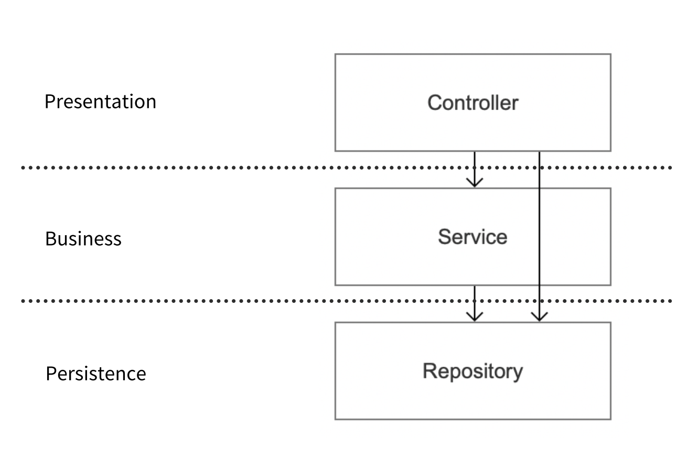
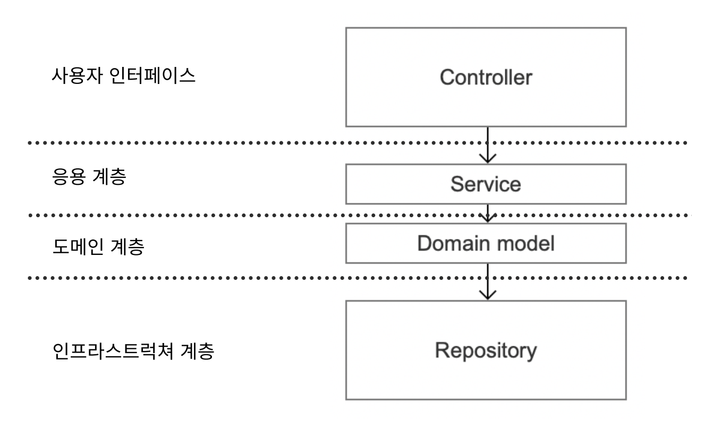
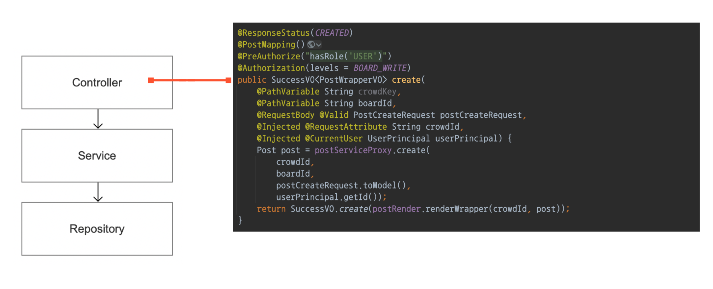
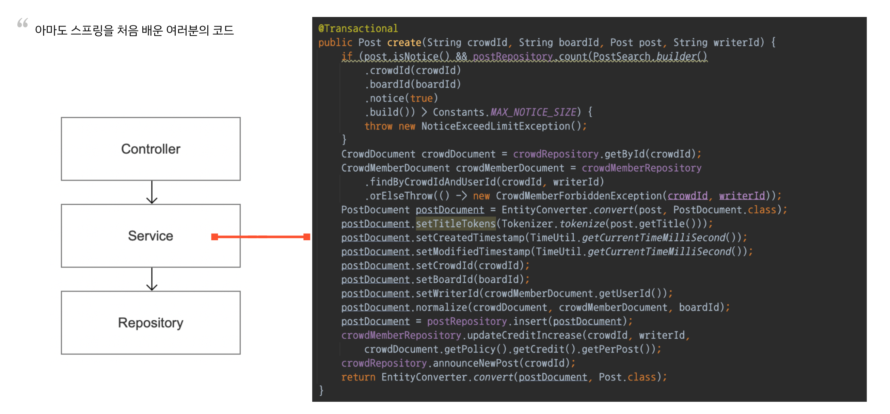

# 스프링을 OOP 스럽게 사용하기


1. Smart UI
2. Transaction script


# Smart UI

이름은 Smart인데 사실은 비꼬는 말이다.

> Smart UI란 컨트롤러에 있는 코드가 모든 처리를 다하고 응답을 내려주는 코드

백엔드에서 UI란 Controller

절대 똑똑한 Controller가 아니다.

**Controller는 어떤 서비스를 실행할지 선택하는 정도의 역할**

* 컨트롤러에 있는 코드가 모든 처리를 다하고 응답을 내려주는 코드는 피하자


## Relaxed Layered System - 안티 패턴


> 한 계층의 구성요소가 바로 아래 있는 계층만 접근할 수 있는게 아니라 **하위 모든 계층에 접근을 허용**한다.



* Controller 에서 Repository를 바로 접근할 수 있게 짜여진 코드를 Relaxed Layered Architecture라고 부른다

* 이 방식이 SmartUI 으로 유도되는 방식이다 


## Layered System at DDD

> 계층화의 가치는 각 계층에서 컴퓨터 프로그램의 특정 측면만을 전문적으로 다룬다는 데 있다.



* DDD를 적용한 조직은 이런 계층 구조를 갖고 있을 확률이 높다.


### 도메인 레이어 (Domain Layer)

* 도메인 레이어야 말로 애플리케이션의 핵심

> 소프트웨어가 수행할 작업을 정의하고 표현력 있는 **도메인 객체가 문제를 해결하게 하는 레이어**, 다른 시스템의 응용 계층과 상호작용하는데 필요한것들.
>
> 도메인 레이어 계층은 최대한 얇게 유지되어야 한다.
>
> 업무 규칙이나 지식이 포함되지 않아야 한다.
>
> **오직 작업을 조정하고 아래에 위치한 계층에 도메인 객체의 협력자에게 작업을 위임한다**
>
> \- 에릭 에반스, 도메인 주도 설계

* **서비스 컴포넌트는 도메인 객체에 작업을 위임해야 한다를 기억하자.**

* 도메인 : 비즈니스 모델. 우리가 해결하려는 문제


### Transaction Script 패턴


컨트롤러



서비스...



레포지토리...


* 전혀 추상화가 되어있지 않다.


서비스는 뚱뚱하면 좋지 않다. 

Transaction Script 패턴을 보면 다음과 같다.

- 수동적인 도메인
- 모든 업무 규칙과 지식이 포함된 서비스
- 뚱뚱한 계층
- 전혀 객체 지향이 아님.

사실상 서비스는 트랜잭션을 실행하는 스크립트의 역할일 뿐, 비즈니스 로직을 서비스가 들고 있다.

* 서비스 코드에 모든 업무 규칙과 지식들이 들어가 있따.
* 이런 코드는 테스트하기도 힘들고 전혀 객체지향스럽지도 않고 절차지향적인 코드이다.


> 트랜잭션 스크립트 : 서비스가 트랜잭션을 수행하는 스크립트 역할이기 때문 
>
> 서비스가 비즈니스 로직을 들고 있게 된다면 트랜잭션 스크립트 패턴이 되버린다.
>
> 서비스는 **작업을 조정하고, 비즈니스 로직을 도메인에게 위임**해야 한다.
>
> 

#### 도메인이 무엇인가?

* 간단하게 말하면 우리가 해결하려는 문제, 즉 비즈니스 모델이다

**비즈니스 로직을 도메인이 들고 있도록 하자.**


### 트랜잭션 스크립트 패턴의 또다른 문제점

```java
@Service
@RequiredArgsConstructor
public class ServiceA {

  private final RepositoryA repositoryA; 
  private final Repository repository; 
  private final Repository repositoryC;

  public void functionA() {
    A a = repositoryA.find0;
    B b = repositoryB.findO;
    C c = repositoryC.find0;
		// start
		//비즈니스 로직
		//end
		repositoryA.save(a);
  }
}
```

* 위 코드는 비즈니스 로직을 서비스가 들고 있는 코드이다. 
  * 1 레포지토리가 도메인을 가져오고
  * 2 비즈니스 로직을 처리하고 
  * 데이터를 저장


**테스트가 너무 어려워진다.**

왜? -> 비즈니스 로직과 Repository가 결합되어 있기 때문

심지어 Repository랑 연동돼있으니까 테스트용 DB랑 연동해야 한다.


### 개선 1

```java
@Service
@RequiredArgsConstructor
public class ServiceA {

  private final RepositoryA repositoryA; 
  private final Repository repository; 
  private final Repository repositoryC;

  public void functionA() {
    A a = repositoryA.find0;
    B b = repositoryB.findO;
    C c = repositoryC.find0;
		
    a.function(b, c);
    
		repositoryA.save(a);
  }
}
```

* 만약 비즈니스 로직을 도메인이 들고있다면(여기서는 a)
* 비즈니스 로직에 대한 테스트 코드 작성이 쉬워진다.

```java
public class ATest {
	@Test
	public void functionATest() {
	// given
	A a = new A();
	B b = new B();
	C c = new C();
	//when
	a.functionA(b, c); // 테스트 코드를 간단하게 할 수 있습니다.
	// then
	assert (...);
  }
}
```

우리는 서비스가 갖고 있던 과한 책임을 객체로 위임한것

그 결과로,

* 객체가 훨씬 능동적인 상태로 변환

* 비즈니스 로직이 서비스에서 모델로 옮겨가면서 서비스 계층의 코드가 얇아졌다.

> 객체 a는 단순히 데이터를 저장하는 struct가 아니라, 행동을 갖고 b와 c와 협력하는 객체가 되었다.
>
> 즉 도메인이 되었다.


### 도메인 서비스

실무에서 보면 다음과 같은 상황을 만날 수 있다.

```java
@Service
@RequiredArgsConstructor
public class ProductService{
	private final UserRepository userRepository;
	private final ProductRepository productRepository;
	private final CouponRepository couponRepository;

  public int calculatePrice (long userId, long productId) {
    User user = userRepository. getById(userId);
    Product product = productRepository.getById(productId);
    List<Coupon> coupons = couponRepository.getByUserId(userId);
		//최대 할인율을 찾는다.
		Coupon target;
		for (Coupon coupon : coupons) {
			if (coupon.getDiscount() > target.getDiscount()) {
				target = coupon;
			}
		}
		
    //적용 가능한 쿠폰이 있다면 적용한다.
		int price = product.getPrice();
		if(target != null) {
			price *= target. getDiscount ( );
		}
		//사용자의 마일리지도 반영한다.
		price -= user.getMileage();
		return price;
	}
}
```

1. 상품이랑 쿠폰을 레포지토리에서 찾고
2. 최대 할인율을 찾고
3. 마일리지를 반영한다
4. 가격 계산을 한다.


바로 어느 도메인도 비즈니스 로직을 들고 있기 애매한 경우이다. 

> 가격 계산 로직
>
> 가격 = 상품의 가격 * 쿠폰 최대 할인율 - 사용자 마일리지

어디에도 들어가기 어색하다.

#### 이 경우에는?

> 도메인의 개념 가운데 객체로는 모델에 어울리지 않는 것이 있다. 
>
> 필요한 도메인 기능을 ENTITY나 VALUE에서 억지로 맡게 하면 모델에 기반을 둔 객체의 정의가 왜곡되거나 또는 무의미하고 인위적으로 만들어진 객체가 추가 될 것이다.
>
> \- 에릭 에반스.


로직 중에 모델로 들어가기 어려운 로직이 분명히 있고 이 개념을 억지로 다른 객체에 넣어서 객체를 왜곡하지 말라고 한다.


가장 답에 가까운 것이 지금 갖고 있는 도메인들로는 처리가 힘드니 **새 객체를 만드는 것이다.**

```java
@Service
@RequiredArgsConstructor
public class ProductService{
	private final UserRepository userRepository;	
	private final ProductRepository productRepository; 
  private final CouponRepository couponRepository;

  public int calculatePrice (long userId, long product Id)
		User user = userRepository.getById(userId);
		Product product = productRepository.getById(productId);
		List<Coupon> coupons = couponRepository.getByUserId(userId);
		PriceCalculator priceCalculator = new PriceCalculator ( );
		return priceCalculator.calculate (user, product, coupons) ;
	}
}
```


이렇게 만들어진 새 객체는 테스트하기 쉽다.

```java
public PriceCalculatorTest {
	@Test
	public void 가격을_ 계산_할_수_ 있다 () {
	// given
	User user = User.builder()....build() ;
	Product product = Product.builder()....build()
	List<Coupon> coupons = Arrays.asList(...);
	// when
	PriceCalculator priceCalculator = new PriceCalculator();
	int price = priceCalculator.calculate(user, product, coupons);
	// then
	assert ( ...);
  }
}
```


PriceCalculator 같은 객체를 **도메인 서비스 객체(Domain Service Object)** 라고 한다.

* 가격 게산 같이 객체로 표현하기 애매하고, 논리 로직 자체가 목적인 행위자를 도메인 서비스라고 한다.
* 이름을 짓기 어려워 PriceCalculator, PriceManager, PriceService 등의 이름으로도 불릴 수 있다. 

그런데, **도메인 서비스**라고 하니까 우리가 원래 부르던 **서비스 컴포넌트**랑 이름이 겹친다.

* 스프링의 서비스 계층은 애플리케이션 서비스라고 부르자.


#### 애플리케이션 서비스 (Application Service)

- 최대한 얇게 유지되어야 한다.
- 애플리케이션 서비스는 비즈니스 결정을 내리지 않아야 함.
  - e.g) if (user.dontHaveMoney())
- 애플리케이션 서비스는 요청을 도메인과 도메인 서비스에 위임한다.


### 번외. 도메인 서비스(Domain Service) VS 도메인

>  도메인 서비스가 유의미한 도메인이 될 수 있는지 항상 확인하자.

```java
@Service
@RequiredArgsConstructor
public class ProductService{
	private final UserRepository userRepository;	
	private final ProductRepository productRepository; 
  private final CouponRepository couponRepository;

  public int calculatePrice (long userId, long product Id)
		User user = userRepository.getById(userId);
		Product product = productRepository.getById(productId);
		List<Coupon> coupons = couponRepository.getByUserId(userId);
		Cashier cashier = new Cashier();
		return cashier.calculate(user, product, coupons);
	}
}
```

* PriceCalculator라기보다는 Cashier라는 이름의 도메인이 나을 수도 있다.
  * 가격을 계산하는건 점원이라고 볼 수 있으니까. .


#### Q. PriceCalculator라는 도메인 서비스보다 Cashier라는 도메인으로 만드는 게 좋다는 말이 맞는 건가요?

- PriceCalculator라고 부르면 가격 계산만을 하겠다는 의미의며 사실상 유의미한 객체가 만들어지는 게 아니다. 함수를 랩핑하는 클래스들이 무수히 생겨날 뿐이다.

- 그렇게 되면 사실상 절차 지향 프로그래밍과 다를 게 없고,  나중에 가서는 *"기존 서비스랑 다른 게 뭐지?"*라는 생각이 들 것이다.

- 요점은 도메인 영역을 풍부하게 만들고 코드를 객체지향 적으로만들자. 

- 근데 또 단일 책임 원칙에 따르면, 역할은 분리가 되어야 하는 게 맞으므로,  PriceCalculator처럼 가는 것도 나쁘지 않다.

  

그러한 이유로 이는 사실상 호불호의 영역

설계는 트레이드 오프가 항상 있고, 정답이 정해져 있지 않다. 

따라서 이렇게 혼란스러운 상황에서 사용할 수 있는 가장 확실한 명제는 이거다.

**"구조적으로 테스트하기 쉬운 코드면 무슨 코드든 좋다."**


#### Q. 도매인 서비스도 빈으로 만드는 게 맞나요?

A. 호불호의 영역이며, 상황마다 다르다.왜냐면 빈으로 만들어지는 순간 애플리케이션 레이어에 종속되는 것이고, 그러면 애플리케이션 서비스가 된다고 할 수 있다.

그래서 도메인 서비스가 필요할 때는 

1. 매번 인스턴스화해서 새로 만들기도 하고, 
2. 애플리케이션 서비스를 생성하는 생성자 주입 시기에 만드는 경우도 있다. 

 왜냐하면 서비스는 한번 생성으로 영원히 같은 일을 할 수 있는 객체여야 하기 때문. 


*"생성자 주입 시기에 수동으로 만들 거면 빈으로 주입하지 않는 이유가 뭐지?"*

우리가 테스트하기 힘든 이유는 대부분 프레임워크에 너무 의존적인 코드를 짜기 때문이다.

 Jpa에 강결합 되어있기 때문에 h2를 이용해서 테스트할 수밖에 없고, 스프링에 지나치게 의존적이라 mockito 없이는 테스트가 불가하다.

도메인 영역은 스프링에 종속되지 않아야 한다. 

* 도메인은 애플리케이션의 핵심이라고 불립니다. 
* 이 말인 즉, 훗날 스프링이 망하게 돼서 자바 진영에 스프링 프레임워크가 아닌 다른 프레임워크가 생겨났을 때. *"도메인만 도려내서 그 프레임워크에 이식이 가능한 수준이어야 한다"*는 의미라고 생각합니다. 
* 꼭 프레임워크의 변경만을 의미하는 말은 아니다. 스프링에 메이저 버전 업데이트가 있을 때, 비즈니스 코드를 건드려야 한다면? 

* 물론 자바를 사용하면서 스프링이 아닌 프레임워크를 상상하기는 쉽지 않고, ORM은 JPA 이외의 것을 상상하기 쉽지 않다.


#### Q. 도메인을 왜 이렇게 강조하는 건가요?

A. 우리는 스프링 프로그래머가 아니기 때문이다.   "개발자라는 직업은 무엇이든 개발할 수 있어야한다"

**그리고 그러기 위해선 plain java를 이용하여 설계할 줄 알아야 하고, 언어와 관계없이 설계를 할 수 있는 방법을 알아야 한다.**

그런 의미에서 DDD는 웹 개발뿐만 아니라 어디에도 통용되는 이론이다. 

도메인 레이어라는 부분을 Plain java로 잘 작성할 수 있게 되면, 테스트하기가 굉장히 쉬워진다. 

* java는 스프링을 다루기 위해 만들어진 언어가 아니다! 

* 프레임워크 없이 개발할 수 있는, 도메인이라는 영역을 잘 다룰 수 있는 게 먼저이다.

 


### 그렇다면 Transaction Script가 무조건 나쁜건가?

| Transaction Script의 단점 | Transaction Script 옹호파                    | 그렇다면                                                     |
| ------------------------- | -------------------------------------------- | ------------------------------------------------------------ |
| 테스트하기 힘듬           | 테스트가 꼭 필요한가                         | 테스트가 필요없다 느끼시면 OK                                |
| OOP 스럽지 않다.          | 꼭 00P 스러워야하나                          | 추구하는게 00P 가 아니라면 0K                                |
|                           | OOP 스러운 코드가 더 읽기 힘들어요.          | OOP 는 POP 보다 분명 덜 직관적일 수 있다.                    |
|                           | 0OP 스럽게 개발하려하니 개발속도가 느립니다. | 빠르게 개발해야한다면 OK                                     |
|                           |                                              | 하지만 서비스가 커진다면 분명 접근법을 달리해야하는 시기가 온다. |


> 개발에는 정답이 없다.

### 더 알아볼만한 주제들

Domain Driven Design

- 마지막이 Design .
- Development 가 아닌만큼 개발 이상의 이야기를 한다.

Event Driven Design

* **결합**을 끊는 가장 좋은 방법론

Object Oriented Programming

- ' 객체' 지향 프로그래밍이다.
- 클래스' 지향 프로그래밍이 아니다.