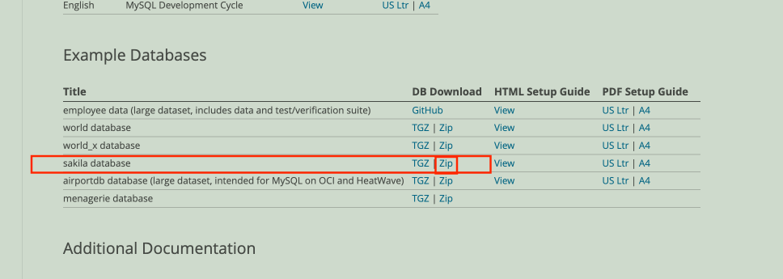
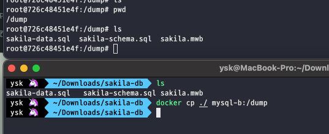
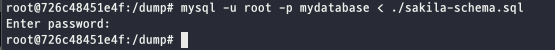

# MYSQL

RDBMS - SQL

* https://www.yalco.kr/lectures/sql/


* 원하는 만큼만 데이터 가져오기
    * LIMIT {가져올 갯수}
    * 또는 LIMIT {건너뛸 갯수}, {가져올 갯수} 를 사용하여, 원하는 위치에서 원하는 만큼만 데이터를 가져올 수 있습니다.

SELECT * FROM Customers LIMIT 10;

SELECT * FROM Customers LIMIT 30, 10;

MySQL에서는 TRUE는 1, FALSE는 0으로 저장됩니다.

IS 양쪽이 모두 TRUE 또는 FALSE

IS NOT 한쪽은 TRUE, 한쪽은 FALSE

MYSQL 에서 숫자 + 문자 는 문자를 0으로 인식한다. = 숫자 + 0

MySQL의 기본 사칙연산자는 대소문자 구분을 하지 않습니다.

SELECT 'A' = 'a';

1. 숫자 관련 함수들

---

| 함수 | 설명 | 
|-------|--------| 
| ROUND | 반올림 | 
| CEIL | 올림 | 
| FLOOR | 내림 |
| ABS  | 절대값 |
| GREATEST | (괄호 안에서) 가장 큰 값   |
| LEAST    | (괄호 안에서) 가장 작은 값 |

```sql
SELECT GREATEST(1, 2, 3),
       LEAST(1, 2, 3, 4, 5);

SELECT OrderDetailID,
       ProductID,
       Quantity,
       GREATEST(OrderDetailID, ProductID, Quantity),
       LEAST(OrderDetailID, ProductID, Quantity)
FROM OrderDetails;

```

그룹 함수 - 조건에 따라 집계된 값을 가져옵니다.

| 함수  | 설명               |
|-------|--------------------|
| MAX   | 가장 큰 값         |
| MIN   | 가장 작은 값       |
| COUNT | 갯수 (NULL값 제외) |
| SUM   | 총합               |
| AVG   | 평균 값            |

|함수|설명|
|---|---|
|POW(A, B), POWER(A, B) |    A를 B만큼 제곱|
|SQRT    | 제곱근|
|TRUNCATE(N, n)    | N을 소숫점 n자리까지 선택|

* https://dev.mysql.com/doc/refman/8.0/en/numeric-functions.html

2. 문자열 관련 함수

| 함수         | 설명               |
|--------------|--------------------|
| UCASE, UPPER | 모두 대문자로      |
| LCASE, LOWER | 모두 소문자로      |
| CONCAT(. . .)       | 괄호 안의 내용 이어붙임     |
| CONCAT_WS(S, . . .) | 괄호 안의 내용 S로 이어붙임 |
| SUBSTR, SUBSTRING | 주어진 값에 따라 문자열 자름 |
| LEFT              | 왼쪽부터 N글자               |
| RIGHT             | 오른쪽부터 N글자             |
| LENGTH                        | 문자열의 `바이트` 길이         |
| CHAR_LENGTH, CHARACTER_LEGNTH | 문자열의 `문자` 길이           |
| TRIM                          | 양쪽 공백 제거               |
| LTRIM                         | 왼쪽 공백 제거               |
| RTRIM                         | 오른쪽 공백 제거             |

* https://dev.mysql.com/doc/refman/8.0/en/string-functions.html
* 더 많은 문자열 함수

1. 시간/날짜 관련 함수들

| 함수                   | 설명                  |
|------------------------|-----------------------|
| CURRENT_DATE, CURDATE  | 현재 날짜 반환        |
| CURRENT_TIME, CURTIME  | 현재 시간 반환        |
| CURRENT_TIMESTAMP, NOW | 현재 시간과 날짜 반환 |

| 함수                   | 설명                    |
|------------------------|-------------------------|
| DATE                   | 문자열에 따라 날짜 생성 |
| TIME                   | 문자열에 따라 시간 생성 |

```sql
SELECT '2021-6-1 1:2:3' = '2021-06-01 01:02:03',
       DATE('2021-6-1 1:2:3') = DATE('2021-06-01 01:02:03'),
       TIME('2021-6-1 1:2:3') = TIME('2021-06-01 01:02:03'),
       DATE('2021-6-1 1:2:3') = TIME('2021-06-01 01:02:03'),
       DATE('2021-6-1') = DATE('2021-06-01 01:02:03'),
       TIME('2021-6-1 1:2:3') = TIME('01:02:03');
```

* 결과 : 0 1 1 0 1 1

| 함수            | 설명                                       |
|-----------------|--------------------------------------------|
| YEAR            | 주어진 DATETIME값의 년도 반환              |
| MONTHNAME       | 주어진 DATETIME값의 월(영문) 반환          |
| MONTH           | 주어진 DATETIME값의 월 반환                |
| WEEKDAY         | 주어진 DATETIME값의 요일값 반환(월요일: 0) |
| DAYNAME         | 주어진 DATETIME값의 요일명 반환            |
| DAYOFMONTH, DAY | 주어진 DATETIME값의 날짜(일) 반환          |

```sql
SELECT OrderDate,
       YEAR(OrderDate)      AS YEAR,
       MONTHNAME(OrderDate) AS MONTHNAME,
       MONTH(OrderDate)     AS MONTH,
       WEEKDAY(OrderDate)   AS WEEKDAY,
       DAYNAME(OrderDate)   AS DAYNAME,
       DAY(OrderDate)       AS DAY
FROM Orders;
```

| 함수            | 설명                                       |
|-----------------|--------------------------------------------|
| HOUR            | 주어진 DATETIME의 시 반환                  |
| MINUTE          | 주어진 DATETIME의 분 반환                  |
| SECOND          | 주어진 DATETIME의 초 반환                  |
| ADDDATE, DATE_ADD | 시간/날짜 더하기                           |
| SUBDATE, DATE_SUB | 시간/날짜 빼기                             |

```sql
SELECT ADDDATE('2021-06-20', INTERVAL 1 YEAR),
       ADDDATE('2021-06-20', INTERVAL -2 MONTH),
       ADDDATE('2021-06-20', INTERVAL 3 WEEK),
       ADDDATE('2021-06-20', INTERVAL -4 DAY),
       ADDDATE('2021-06-20', INTERVAL -5 MINUTE),
       ADDDATE('2021-06-20 13:01:12', INTERVAL 6 SECOND);
```

| 함수            | 설명                                       |
|-----------------|--------------------------------------------|
| DATE_DIFF       | 두 시간/날짜 간 일수차                     |
| TIME_DIFF       | 두 시간/날짜 간 시간차                     |

```sql
SELECT TIMEDIFF('2021-06-21 15:20:35', '2021-06-21 16:34:41');
```

| 함수 | 설명 | 
|---|---|
| LAST_DAY | 해당 달의 마지막 날짜 |

| 함수            | 설명                                       |
|-----------------|--------------------------------------------|
| DATE_FORMAT     | 시간/날짜를 지정한 형식으로 반환           |

| 형식   | 설명                      |
|--------|---------------------------|
| %Y     | 년도 4자리                |
| %y     | 년도 2자리                |
| %M     | 월 영문                   |
| %m     | 월 숫자                   |
| %D     | 일 영문(1st, 2nd, 3rd...) |
| %d, %e | 일 숫자 (01 ~ 31)         |
| %T     | hh:mm:ss                  |
| %r     | hh:mm:ss AM/PM            |
| %H, %k | 시 (~23)                  |
| %h, %l | 시 (~12)                  |
| %i     | 분                        |
| %S, %s | 초                        |
| %p     | AM/PM                     |

```sql
SELECT DATE_FORMAT(NOW(), '%M %D, %Y %T'),
       DATE_FORMAT(NOW(), '%y-%m-%d %h:%i:%s %p'),
       DATE_FORMAT(NOW(), '%Y년 %m월 %d일 %p %h시 %i분 %s초');
```

| 함수                  | 설명                                  |
|-----------------------|---------------------------------------|
| STR _ TO _ DATE(S, F) | S를 F형식으로 해석하여 시간/날짜 생성 |

```sql
SELECT OrderDate,
       DATEDIFF(
               STR_TO_DATE('1997-01-01 13:24:35', '%Y-%m-%d %T'),
               OrderDate
           ),
       TIMEDIFF(
               STR_TO_DATE('1997-01-01 13:24:35', '%Y-%m-%d %T'),
               STR_TO_DATE(CONCAT(OrderDate, ' ', '00:00:00'), '%Y-%m-%d %T')
           )
FROM Orders;
```

* 더 많은 시간/ 날짜 함수 :https://dev.mysql.com/doc/refman/8.0/en/string-functions.html

2. 기타 함수

| 형식           | 설명                               |
|----------------|------------------------------------|
| IF(조건, T, F) | 조건이 참이라면 T, 거짓이면 F 반환 |

```sql
SELECT IF(1 > 2, '1는 2보다 크다.', '1은 2보다 작다.');
```

보다 복잡한 조건은 CASE문을 사용합니다.

```sql
SELECT CASE
           WHEN -1 > 0 THEN '-1은 양수다.'
           WHEN -1 = 0 THEN '-1은 0이다.'
           ELSE '-1은 음수다.'
           END;

SELECT Price,
       IF(Price > 30, 'Expensive', 'Cheap'),
       CASE
           WHEN Price < 20 THEN '저가'
           WHEN Price BETWEEN 20 AND 30 THEN '일반'
           ELSE '고가'
           END
FROM Products;
```

| 형식         | 설명                      |
|--------------|---------------------------|
| IFNULL(A, B) | A가 NULL일 시 B 출력      |

```sql
SELECT IFNULL('A', 'B'),
       IFNULL(NULL, 'B');
```

그룹 함수

| 함수   | 설명               |
|--------|--------------------|
| MAX    | 가장 큰 값         |
| MIN    | 가장 작은 값       |
| COUNT  | 갯수 (NULL값 제외) |
| SUM    | 총합               |
| AVG    | 평균 값            |

1. GROUP BY - 조건에 따라 집계된 값을 가져옵니다.

* HAVING - 그룹화된 데이터 걸러내기
* WHERE는 그룹하기 전 데이터, HAVING은 그룹 후 집계에 사용합니다.

```sql
SELECT COUNT(*) AS Count,
       OrderDate
FROM Orders
WHERE OrderDate > DATE('1996-12-31')
GROUP BY OrderDate
HAVING Count > 2;
```

2. DISTINCT - 중복된 값들을 제거합니다.
    * GROUP BY 와 달리 집계함수가 사용되지 않습니다.
    * GROUP BY 와 달리 정렬하지 않으므로 더 빠릅니다.

```sql
SELECT DISTINCT Country, City
FROM Customers
ORDER BY Country, City;
```

---

1. 비상관 서브쿼리

* 만약 서브쿼리가 외부 쿼리의 어떤 것도 참조하지 않고 단독으로 사용되면 비상관쿼리
* 내부 쿼리가 우선 실행되고, 그리고 나서 결과가 외부쿼리의 WHERE 조건으로 이용되고,
* 하지만 내부 쿼리는 외부 쿼리의 값과는 아무 상관이 없이 단독으로도 쿼리가 실행될 수 있는 쿼리.

```sql
SELECT *
FROM Products
WHERE Price < (
    SELECT AVG(Price)
    FROM Products
);

SELECT CategoryID,
       CategoryName,
       Description
FROM Categories
WHERE CategoryID =
      (SELECT CategoryID
       FROM Products
       WHERE ProductName = 'Chais');
```

| 연산자 | 의미                                     |
|--------|------------------------------------------|
| ~ ALL  | 서브쿼리의 모든 결과에 대해 ~하다        |
| ~ ANY  | 서브쿼리의 하나 이상의 결과에 대해 ~하다 |

2. 상관 서브쿼리

* 상관서브쿼리는 내부 쿼리의 값이 결정되는데 외부 쿼리에 의존합니다.

```sql
SELECT ProductID,
       ProductName,
       (
           SELECT CategoryName
           FROM Categories C
           WHERE C.CategoryID = P.CategoryID
       ) AS CategoryName
FROM Products P;
```

---

1. JOIN(INNER JOIN) - 내부 조인

* 양쪽 모두에 값이 있는 행(NOT NULL) 반환
* 'INNER '는 선택사항

* JOIN한 테이블 GROUP하기

```sql
SELECT C.CategoryName,
       MIN(O.OrderDate) AS FirstOrder,
       MAX(O.OrderDate) AS LastOrder,
       SUM(D.Quantity)  AS TotalQuantity
FROM Categories C
         JOIN Products P
              ON C.CategoryID = P.CategoryID
         JOIN OrderDetails D
              ON P.ProductID = D.ProductID
         JOIN Orders O
              ON O.OrderID = D.OrderID
GROUP BY C.CategoryID;
```

* SELF JOIN - 같은 테이블끼리

````sql
SELECT E1.EmployeeID,
       CONCAT_WS(' ', E1.FirstName, E1.LastName) AS Employee,
       E2.EmployeeID,
       CONCAT_WS(' ', E2.FirstName, E2.LastName) AS NextEmployee
FROM Employees E1
         JOIN Employees E2
              ON E1.EmployeeID + 1 = E2.EmployeeID;

-- 1번의 전, 마지막 번호의 다음은?
````

2. LEFT/RIGHT OUTER JOIN - 외부 조인

* 반대쪽에 데이터가 있든 없든(NULL), 선택된 방향에 있으면 출력 - 행 수 결정
    * LEFT 조인일 시 RIGHT에 NULL이 있을 수도 있다.
    * RIGHT 조인일 시 LEFT에 NULL이 있을 수도 있디.
* 'OUTER '는 선택사항

3. CROSS JOIN - 교차 조인

* 조건 없이 모든 조합 반환(A * B)

```sql
SELECT E1.LastName,
       E2.FirstName
FROM Employees E1
         CROSS JOIN Employees E2
ORDER BY E1.EmployeeID;
```

---

| 연산자    | 설명                      |
|-----------|---------------------------|
| UNION     | 중복을 제거한 집합        |
| UNION ALL | 중복을 제거하지 않은 집합 |

* 조인 대상이 아닌 테이블들의 집합
    * 합집합
    * 교집합
    * 차집합
    * 대칭 차집합

## MySQL sakila database Downaload

* https://dev.mysql.com/doc/index-other.html

* 
    * zip 선택
* 압축을 플고 도커 컨테이너 안으로 파일 이동
* `docker cp 파일명 컨테이너명:/디렉토리명`
* 

### MYSQL .sql IMPORT

* 

- 전체 스키마 Import
    * 이때 mydatabase라는 데이터베이스 스키마는 미리 생성해놓아야한다.
        * create database mydatabase

```shell
$> mysql -u [아이디] -p [패스워드] 데이터베이스명 < 경로 및 파일명

ex) mysql -u root -p mydatabase < ./sakila-schema.sql
```

* 패스워드는 명령어 입력 후 암호를 물을 떄 입력해도 된다.
* 덤프 파일 만들 떄와 꺽쇠 모양이 반대

- 특정 테이블 Import

```shell
$> mysql -u [아이디] -p[패스워드] -데이터베이스명=테이블명 < 경로 및 파일명.sql
ex) mysql -uroot -p -mydatabase=customer < ./sakilla-schema.sql
```

* 반대로 Dump는?

- 전체 스키마 Export

```shell
$> mysqldump -u [아이디] -p [패스워드] 데이터베이스명 > 경로 및 저장할 파일명.sql
ex) mysqldump -u root -p 9999 testdb > /root/ysk/dump/mydatabase.sql
```

- 특정 테이블 Export

```shell
$> mysqldump -u[사용자아이디] -p[패스워드] 데이터베이스명 테이블명 > 경로 및 저장할 파일명.sql

ex) mysqldump -u root -p 1234 mydatabase member > /root/ysk/backup/mydatabase_member.sql
```

1. 숫자 자료형

* ️🔗 https://dev.mysql.com/doc/refman/8.0/en/integer-types.html

* | 자료형    | 바이트 | SIGNED                         | UNSIGNED          |   |
        |-----------|--------|--------------------------------|-------------------|---|
  | TINYINT   | 1      | -128 ~ 127                     | 0 ~ 255           |   |
  | SMALLINT  | 2      | -32,768 ~ 32,767               | 0 ~ 65,535        |   |
  | MEDIUMINT | 3      | -8,388,608 ~ 8,388,607         | 0 ~ 16,777,215    |   |
  | INT       | 4      | -2,147,483,648 ~ 2,147,483,647 | 0 ~ 4,294,967,295 |   |
  | BIGINT    | 8      | -2^63 ~ 2^63 - 1               | 0 ~ 2^64 - 1      |   |

️🔗 고정 소수점(Fixed Point)

* https://dev.mysql.com/doc/refman/8.0/en/fixed-point-types.html
* 수 좁은 범위의 수 표현 가능, 정확한 값 자료형 설명 범위

  | 자료형 | 설명  | 범위      |
      |------|-----|---|
  | DECIMAL( s, d ) | 실수 부분 총 자릿수( s ) & 소수 부분 자릿수 ( d ) | s 최대 65 |

️🔗 부동 소수점(Floating Point) 수 넓은 범위의 수 표현 가능, 정확하지 않은 값 (일반적으로 충분히 정확)

|자료형|
|----|
|FLOAT|
|DOUBLE|

2. 문자 자료형

* 문자열 : https://dev.mysql.com/doc/refman/8.0/en/char.html
* ️ 링크에서 Storage Required 관련 표 비교


| 자료형 | 설명  | 차지하는 바이트  | 최대 바이트 |
|-----|-----|------|-------------|
| CHAR( s ) | 고정 사이즈 (남는 글자 스페이스로 채움)|s (고정값)| 255|
| VARCHAR ( s ) | 가변 사이즈 | 실제 글자 수[최대 s] + 1 [글자수 정보] | 65,535      |


️* 텍스트 :  https://dev.mysql.com/doc/refman/8.0/en/blob.html

| 자료형     | 최대 바이트 크기 |
|------------|------------------|
| TINYTEXT   | 255              |
| TEXT       | 65,535           |
| MEDIUMTEXT | 16,777,215       |
| LONGTEXT   | 4,294,967,295    |


3. 시간 자료형
* https://dev.mysql.com/doc/refman/8.0/en/date-and-time-types.html️🔗 

| 자료형    | 설명                | 비고                                           |
|-----------|-----------|---------|
| DATE      | YYYY-MM-DD          |                                   
| TIME      | HHH:MI:SS           | HHH: -838 ~ 838까지의 시간    |
| DATETIME  | YYYY-MM-DD HH:MI:SS | 입력된 시간을 그 값 자체로 저장 |
| TIMESTAMP | YYYY-MM-DD HH:MI:SS | MySQL이 설치된 컴퓨터의 시간대를 기준으로 저장 |

* 시간 데이터를 가감없이 기록할 때 DATETIME
  * 어디에서 쓰든 동일한 값 
* 시간 자동기록, 국제적인 서비스를 할 경우 TIMESTAMP 사용

# chapter 4 https://www.yalco.kr/lectures/sql-adv/

1. 기본키(Primary Key) 
  * 중복되지 않는 고유값만 허용
  * NULL 값 허용하지 않음
  * 테이블당 하나의 기본키만 지정 가능
    * 복합키 가능

2. 고유키(Unique) 
  * 중복 제한, NULL 값 가능
```Sql
-- 고유키 넣는 방법 1
CREATE TABLE people (
  person_id INT AUTO_INCREMENT PRIMARY KEY,
  first_name CHAR(2) UNIQUE,
  last_name CHAR(3)
  # or UNIQUE(first_name);
);

-- 다중 고유키
CREATE TABLE people (
  person_id INT AUTO_INCREMENT PRIMARY KEY,
  first_name CHAR(2),
  last_name CHAR(3),
  UNIQUE (first_name, last_name)
);
```

3. 외래키
* 외래 키 추가하기
```sql
ALTER TABLE _자식테이블명
  ADD CONSTRAINT _제약명 
  FOREIGN KEY ( _자식테이블외래키 )
  REFERENCES 부모테이블명 ( _부모테이블기본키 )
  -- ON DELETE _삭제시제약 
  -- ON UPDATE _수정시제약 
```

* 외래 키 삭제하기
```shell
ALTER TABLE _자식테이블명 DROP FOREIGN KEY _자식테이블외래키
```
* 외래키는 NULL값이거나 또는 부모 테이블의 기본 키값과 같아야 합니다.

* 외래 키 제약

| 제약   | 설명 | 비고    |
|-----|---|------|
| NO ACTION, RESTRICT | 자식 테이블에 해당 외래키가 있을 때 수정/삭제되지 않음 | |
| CASCADE |  자식 테이블의 해당 행도 수정/삭제   |    |
| SET NULL | 자식 테이블의 외래키를 NULL로  | 자식 외래키가 NOT NULL일 시 설정 불가 |
| SET DEFAULT  | 자식 테이블의 외래키를 기본값으로 | InnoDB 엔진에서 사용 불가 |


## 뷰 - 가상의 테이블

```sql
-- 뷰 생성
CREATE VIEW section_view AS
SELECT section_id, section_name
FROM sections;
```

### 뷰를 사용하는 이유
1. 보안 - 테이블 구조 및 내용 숨기기
2. 편의 - 복잡한 쿼리 사전 구현


### 내용수정이 가능한 뷰
* 집계함수 사용하지 않음(MAX, MIN, AVG...)
* GROUP BY 사용하지 않음
* UNION, DISTINCT 사용하지 않음
* SELECT절에 서브쿼리 없음
* WHERE절의 서브쿼리가 FROM절의 테이블 참조하지 않음
* 조인은 INNER만 가능

```sql
-- 가능
UPDATE section_view
	SET section_name = '서양식'
WHERE section_id = 5;

-- 불가
UPDATE business_view
SET business_name = '화룡반점'
WHERE business_name = '화룡각';
```


# 인덱스
* 특정 컬럼(들)에 대한 목차 생성 - 검색 가속화
* 테이블 내용변경(추가, 수정, 삭제)시 시간 더 소모

1. 인덱스 사용하기

```sql
-- 인덱스 생성
ALTER TABLE `mydatabase`.`businesses`
  ADD INDEX index_biz_name (business_name);
--
-- 다중 컬럼 인덱스
ALTER TABLE menus
  ADD INDEX index_name_cal (menu_name, kilocalories);
-- 
-- 인덱스 조회
SHOW INDEX FROM businesses;
--
-- 인덱스 삭제
ALTER TABLE businesses
  DROP INDEX index_biz_name;
```

## 2. 인덱스를 사용하기 적합한 곳

* 데이터의 변경이 잦지 않은 테이블
* WHERE, ORDER BY 에 자주 사용되는 컬럼
* JOIN에 사용되는 컬럼
* ⭐ Cardinality가 높은 컬럼 = 중복도가 낮은 컬럼 (B-Tree 경우)
  * 성별: 부적합, 이름: 적합

* **cardinality?**
  * 중복도가 ‘낮으면’ 카디널리티가 ‘높다’고 표현한다.
  * 중복도가 ‘높으면’ 카디널리티가 ‘낮다’고 표현한다.
  * 카디널리티는 전체 행에 대한 특정 컬럼의 중복 수치를 나타내는 지표
  * 상대적인 개념이다. a는 b보다 중복도가 낮으면 카디널리티가 높은 것이다. 
  * 인덱스를 걸 때, 내가 원하는 데이터를 선택하는 과정에서 최대한 많은 데이터가 걸러져야 성능이 좋을것이기 때문 
  * 덱싱 컬럼을 선택시, 카디널리티에 대한 고려는 중요한 부분
  * `여러 컬럼을 동시에 인덱싱할때, 다음과 같이 카디널리티가 높은 컬럼을(중복이 적은 컬럼을) 우선순위로 두는 것이 인덱싱 전략에 유리하다.`
    * 인덱스를 걸 때, 내가 원하는 데이터를 선택하는 과정에서 최대한 많은 데이터가 걸러져야 성능이 좋을것이다.(선택하는 데이터가 많아질수록 full scan에 가까워지므로)
  * https://negabaro.github.io/archive/db-term-cardinality
## 3. 인덱스의 종류
1.B-Tree 인덱스
  * 기본(default) 인덱스 
  * Cardinality가 높은 컬럼에 적합

2. Full-Text 인덱스
   * 다수의 단어 등을 포함하는 컬럼에서 단어 및 구문을 검색하기 위함
   * 데이터를 일정 단위로 분할하여 인덱싱
   * *InnoDB, MyISM에서만 사용 가능
   * CHAR, VARCHAR, TEXT 컬럼에만 적용 가능
   * Full-Text Index 문서 링크 : https://dev.mysql.com/doc/refman/8.0/en/fulltext-search.html

3. Hash 인덱스
   * 일치 여부만 확인 (= 가능, >, >=, <, <=, LIKE 등 불가)
   * 인덱스 크기가 작고 검색이 매우 빠름
   * MEMORY, NDB 엔진에서만 사용가능
     * InnoDB 엔진에서는 내부적으로 Adoptive Hash Index 구현
       * 자주 사용되는 데이터만 내부적으로 해시값 생성하여 속도 증가
       * Adoptive Hash Index 문서 링크

4. 비트맵 인덱스
   * Cardinality가 낮은 컬럼에 적합
   * `MySQL에는 없음`
---
## 1. 사용자

```sql
USE mysql;
SELECT * FROM user;
```
* 사용자 조회

```sql
-- CREATE USER '사용자명'@'접속위치' IDENTIFIED BY '비밀번호';
-- CREATE USER 'user_1'@'localhost' IDENTIFIED BY 'abcdefg';
-- CREATE USER 'user_1'@'12.345.678.90' IDENTIFIED BY 'abcdefg';
CREATE USER 'user_1'@'%' IDENTIFIED BY 'abcdefg';
```
* 사용자 생성

```sql
DROP USER 'user_1'@'%';
```
* 사용자 삭제

## 2. 권한

```sql
-- 사용자에 권한 추가
GRANT SELECT ON mydatabase.businesses
TO 'user_1'@'%';

GRANT UPDATE, DELETE ON mydatabase.businesses
TO 'user_1'@'%';

-- 사용자 권한 조회
SHOW GRANTS FOR 'user_1'@'%';

-- 사용자 권한 박탈
REVOKE DELETE ON mydatabase.businesses
FROM 'user_1'@'%';

SHOW GRANTS FOR 'user_1'@'%';

-- 데이터베이스의 모든 권한 부여
GRANT ALL PRIVILEGES ON mydatabase.*
TO 'user_1'@'%';
```
