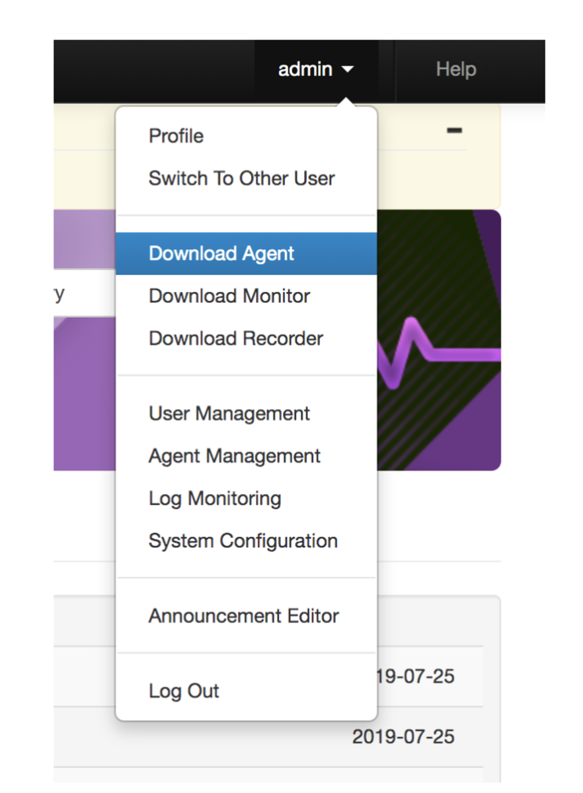
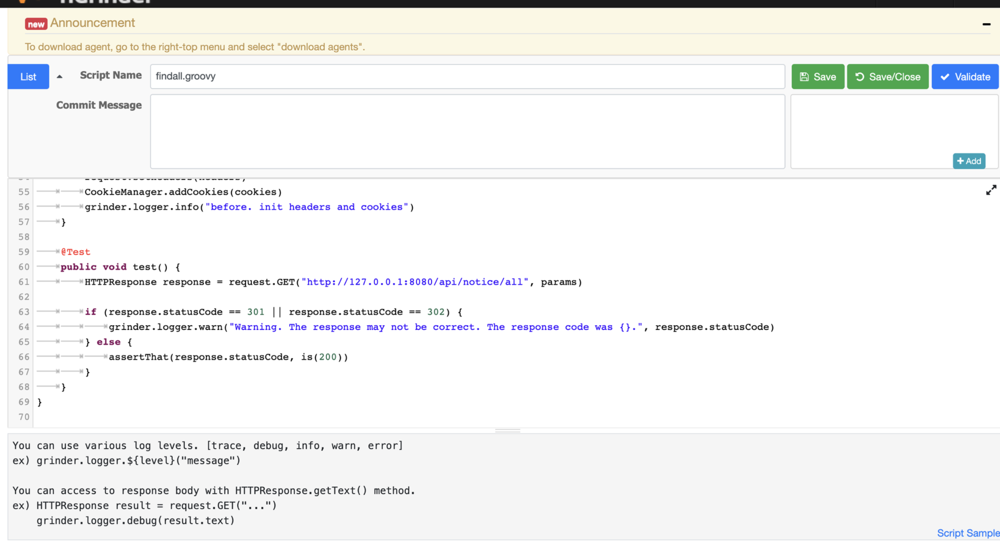
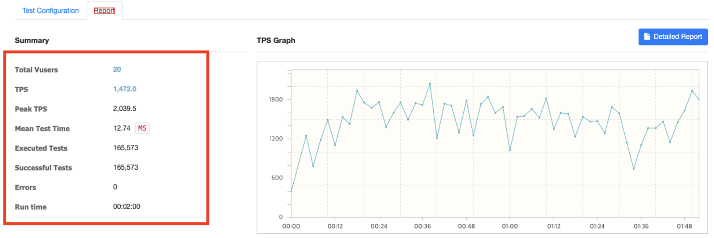
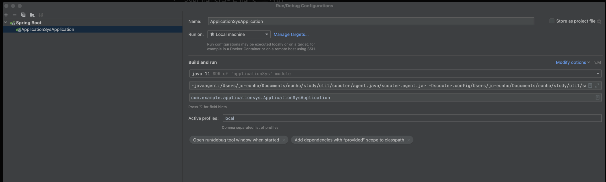
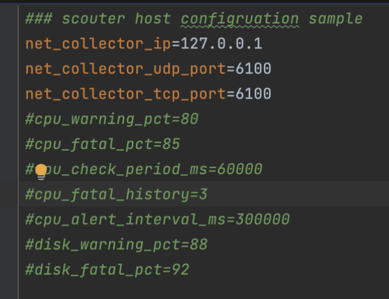
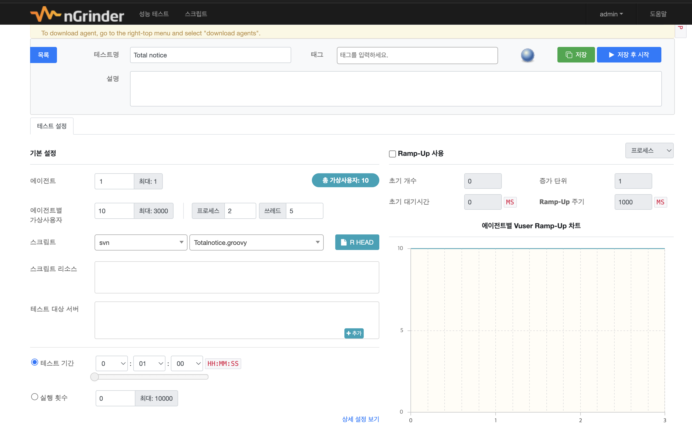
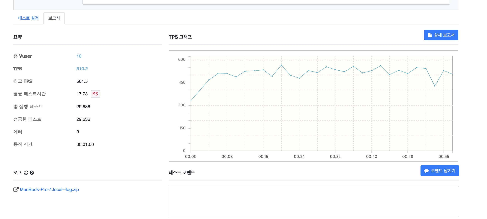
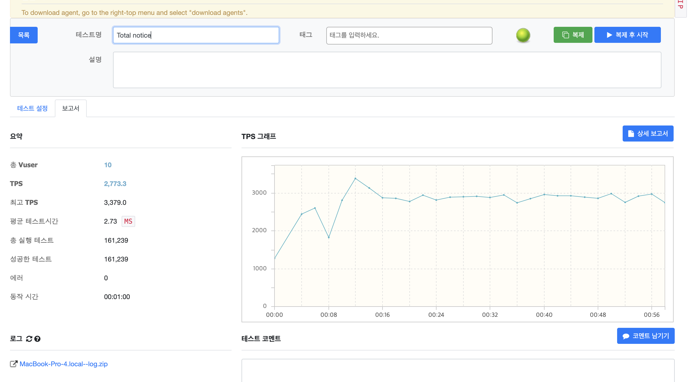
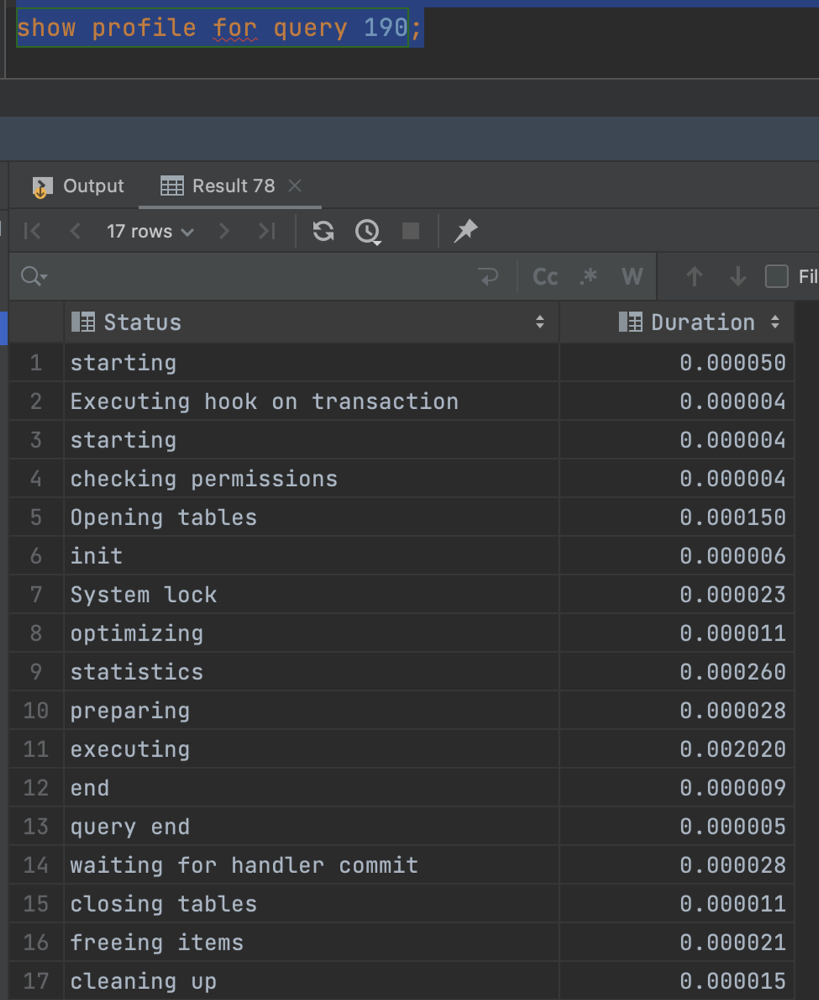

# 인프런 성능 테스트 - 

* https://www.inflearn.com/course/%EC%84%B1%EB%8A%A5-%EA%B0%9C%EC%84%A0-%EC%B4%88%EC%84%9D-%EB%8B%A4%EC%A7%80%EA%B8%B0


[toc]


* 이력서 예시 : https://www.notion.so/0soo-log/5609c67af6574827a95cf50ac2563912

# ngrinder 설치

- https://github.com/naver/ngrinder/releases
- `ngrinder-controller-3.5.5-p1.war` 파일 다운로드

- 사용방법
  - controller 실행

/Users/../git/study/ngrinder 로 이동(`ngrinder-controller-3.5.8.war` 파일이 있는 디렉토리 경로 이동)

* 버전 보고 명령어 실행 

```
java -jar ngrinder-controller-3.5.8.war --port=8300
```

```
ERROR
Please set `java.io.tmpdir` property like following. tmpdir should be different from the OS default tmpdir.
`java -Djava.io.tmpdir=${NGRINDER_HOME}/lib -jar ngrinder-controller.war`
```

에러 발생시  다음과 같이 `java.io.tmpdir` 프로퍼티를 설정

* ngrinder는 2024-02-10 기준 자바11까지만 지원하므로 자바 11로 실행시켜야 한다. 

먼저 내 시스템의 자바 버전을 확인한다

```
이 설치된 경로를 찾으려면 터미널에서 
update-alternatives --config java (대부분의 Linux 배포판)
또는 
/usr/libexec/java_home -V (macOS)를 실행
```

다음 아래 명령어로 ngrinder 실행 

```
JAVA_HOME=/Users/ysk/Library/Java/JavaVirtualMachines/corretto-11.0.17/Contents/Home \
Java -Djava.io.tmpdir=$(pwd)/tmpdir -jar ngrinder-controller-3.5.8.war --port=8300
```


```
java -Djava.io.tmpdir=${NGRINDER_HOME}/lib -jar ngrinder-controller-3.5.8.war --port=8300

또는

java -Djava.io.tmpdir=/home/user/ngrinder/lib -jar ngrinder-controller-3.5.8.war --port=8300

-- 현재디렉토리 아래의 /tmpdir 디렉토리로 실행
JAVA_HOME=/Users/ysk/Library/Java/JavaVirtualMachines/corretto-11.0.17/Contents/Home \
Java -Djava.io.tmpdir=$(pwd)/tmpdir -jar ngrinder-controller-3.5.8.war --port=8300
```


로컬호스트 접속

* http://localhost:8300/

* id/passwd : admin/admin

agent 다운로드

* 페이지 오른쪽 상단



- `**ngrinder-agent-3.5.5-p1-localhost.tar**` 다운받은 tar파일을 압축풀기
- 디렉토리로 가서 스크립트 파일을 실행하여 agent를 실행해줌.

```
./run_agent.sh - mac
```

여기서도 마찬가지로 자바 11로 실행시켜주기 위해서 sh파일을 수정한다.

```
cat ./run_agent.sh
```

보면 실행하는 sh파일이 있다. -> ./run_agent_internal.sh

이 파일 내용을 바꿔준다

```
#!/bin/sh

# Java 11의 경로를 사용하여 Java 실행
JAVA_HOME=/Users/ysk/Library/Java/JavaVirtualMachines/corretto-11.0.17/Contents/Home \
Java -server -cp "lib/ngrinder-core-3.5.8.jar:lib/ngrinder-runtime-3.5.8.jar:lib/*" org.ngrinder.NGrinderAgentStarter --mode=agent --command=run $@
```

이후 다시 실행한다.

- 만약에 중간에 막힌다면 다른 버전을 다운받아서 실행해보자
- https://github.com/naver/ngrinder/releases

다시 페이지로 이동하여 Agent Management 탭 클릭

* http://localhost:8300/agent?

- agent가 정상적으로 띄어져 있는지 확인

**어떤 기능을 테스트해볼지 script 작성**

- script 탭을 클릭하고 “create” 버튼을 클릭 - http://localhost:8300/script

script name(findall)을 지어주고, 테스트 하고자하는 url을 입력([http://127.0.0.1:8080](http://localhost:8080/api/notice/all)/api/notices)

* 테스트로 이름은 findall



- validate 클릭해주기
- SAVE 버튼 클릭


## ngrinder 관련 용어 정리

- TPS 란(처리량)
  - TPS는 "Transactions Per Second"의 약어로, "초당 처리가능한 트랜잭션의 수"
  - TPS가 100이라면 초당 처리 할 수 작업이 100이다 라고 생각하면 됩니다.
  - TPS 수치가 높을 수록 짧은 시간에 많은 작업을 처리할 수 있다고 보시면 됩니다.
- Vuser란
  - 가상 사용자(Virtual User)
  - ex) "vUser 10"은 가상 사용자(Virtual User)가 10명을 나타냅니다. 이것은 부하 테스트 시나리오에서 10명의 가상 사용자가 동시에 시스템 또는 애플리케이션에서 동작하고 있다는 것을 의미합니다.



- TPS: 평균 TPS
- Peak TPS: 최고 TPS
- Mean Test Time: 평균 테스트시간
- Executed Tests: 테스트 실행 횟수
- Successful Tests: 테스트 성공 횟수
- Errors: 에러 횟수
- Run time: 테스트 실행시간

> 💡 TPS 수치는 높고 Mean Test Time은 낮을 수록 성능적으로 긍정적


# 스카우트 설치

- Scouter Server 설치 및 기동(아래 github주소에서)
  - https://github.com/scouter-project/scouter/releases

- scouter-all-[version].tar.gz 다운로드 받기
  - Scouter Collector와 Agent를 포함하는 압축파일입니다.
- scouter.client.product-[os].tar.gz 다운로드 받기
  - 각 OS별 Client(Viewer) 프로그램입니다.

- 다운받은 scouter-all-[version].tar.gz 파일 압축풀기
  - server 디렉토리로 이동
  - Scouter Server 실행하기 - [`**startup.sh](<http://startup.sh/>)(mac) 또는 startup.bat(window) 실행**`

```
./startup.sh
```

실행시 오류가 나니까 스크립트를 아래처럼 수정한다

* 시스템의 자바 위치에 맞게 11버전으로 수정 

```
#!/usr/bin/env bash

export JAVA_HOME=/Users/ysk/Library/Java/JavaVirtualMachines/corretto-11.0.17/Contents/Home
nohup $JAVA_HOME/bin/java -Xmx1024m -classpath ./scouter-server-boot.jar scouter.boot.Boot ./lib > nohup.out &
sleep 1
tail -100 nohup.out
```


- Scouter Client 실행
  - **scouter.client.product-[os].tar.gz**의 압축을 풀고 실행

스카우터 Client 다운로드시 맥에서 에러가 난다면

```
‘scouter.client’은(는) 손상되었기 때문에 열 수 없습니다. 해당 항목을 휴지통으로 이동해야 합니다
```

다음 명령어 입력

```
xattr -cr scouter.client.app
```

* id/ 비밀번호 : admin/ admin

스프링 부트 애플리케이션을 java -jar로 실행할때 아래 옵션 주기(디렉토리 경로 변경해주기)

* -javaagent(scouter/agent.java/scouter.agent.jar)

* -Dscouter(scouter/server/conf/scouter.conf)

* -Dobj_name(원하는 name으로 지정)

나의경우

```
-javaagent:/Users/jo-eunho/Documents/eunho/study/util/scouter/agent.java/scouter.agent.jar -Dscouter.config/Users/jo-eunho/Documents/eunho/study/util/scouter/server/conf/scouter.conf -Dobj_name=demoTomcat --add-opens java.base/java.lang=ALL-UNNAMED
```


```
-javaagent:/Users/ysk/study/scouter/agent.java/scouter.agent.jar \
-Dscouter.config/Users/ysk/study/scouter/server/conf/scouter.conf \
-Dobj_name=demoTomcat --add-opens java.base/java.lang=ALL-UNNAMED
```



### OS에 CPU , Memory 정보를 확인을 위해 “agent.host” 설정 및 실행

- /scouter/agent.host/conf 경로에 scouter.conf 설정 변경



- 실행( /scouter/agent.host 경로로 이동)
  - MAC
    - ./host.sh 실행


# 캐싱으로 조회성능 개선하기

#### 의존성 추가 해주기

Maven 기반

```xml
<dependency>
    <groupId>org.springframework.boot</groupId>
    <artifactId>spring-boot-starter-cache</artifactId>
</dependency>
<dependency>
    <groupId>net.sf.ehcache</groupId>
    <artifactId>ehcache</artifactId>
</dependency>
```

ehcache.xml 추가하기

* resources/ehcache.xml

```
<?xml version="1.0" encoding="UTF-8"?>
<ehcache>

    <defaultCache
            maxElementsInMemory="1000"
            maxElementsOnDisk="0"
            eternal="false"
            statistics="false"
            timeToIdleSeconds="10"
            timeToLiveSeconds="10"
            overflowToDisk="false"
            diskPersistent="false"
            memoryStoreEvictionPolicy="LRU"/>

    <cache
            name="NoticeReadMapper.findAll"
            maxElementsInMemory="10000"
            maxElementsOnDisk="0"
            eternal="false"
            statistics="false"
            timeToIdleSeconds="10"
            timeToLiveSeconds="10"
            overflowToDisk="false"
            diskPersistent="false"
            memoryStoreEvictionPolicy="LRU"/>

    <cache
            name="NoticeReadMapper.findByPage"
            maxElementsInMemory="10000"
            maxElementsOnDisk="0"
            eternal="false"
            statistics="false"
            timeToIdleSeconds="10"
            timeToLiveSeconds="10"
            overflowToDisk="false"
            diskPersistent="false"
            memoryStoreEvictionPolicy="LRU"/>

</ehcache>
```

- name
  - 캐시의 이름
- maxElementsInMemory
  - **메모리에 저장**할 수 있는 최대 요소 수입니다.
- maxElementsOnDisk
  - **디스크에 저장**할 수 있는 최대 요소 수입니다.
- eternal
  - **캐시 항목이 영원히 유지되는지 여부**를 나타냅니다. 여기서는 false로 설정되어 있으므로 캐시 항목은 유효 기간(timeToLiveSeconds) 또는 유휴 기간(timeToIdleSeconds)이 지나면 제거됩니다.
- statistics
  - JMX 통계정보 갱신 옵션
- timeToIdleSeconds
  - 설정된 시간 동안 Idle(유후상태) 상태시 갱신
  - 캐시된 데이터가 사용 되지 않은 채로 유지되는 최대 시간
- timeToLiveSeconds
  - 설정된 시간 동안 유지 후 갱신
  - 캐시 된 데이터의 전체 수명
- overflowToDisk
  - 메모리에 캐시된 데이터가 메모리 한계를 초과하는 경우 디스크로 넘길지 여부를 지정합니다.
- diskPersistent
  - 디스크에 저장된 데이터가 시스템 재시작 후에도 유지되어야 하는지 여부를 나타냅니다.
- memoryStoreEvictionPolicy
  - 메모리가 꽉 찼을 때 데이터 제거 알고리즘 옵션
    - ex) **`LRU` , `LFU` , `FIFO`**

자바설정은?

```java
@Configuration
@EnableCaching
public class CacheConfig {
    @Bean
    @Primary
    public CacheManager cacheManager(EhCacheManagerFactoryBean ehCacheManagerFactoryBean) {
        return new EhCacheCacheManager(ehCacheManagerFactoryBean.getObject());
    }

    @Bean
    public EhCacheManagerFactoryBean ehCacheManagerFactoryBean() {
        EhCacheManagerFactoryBean ehCacheManagerFactoryBean = new EhCacheManagerFactoryBean();
        ehCacheManagerFactoryBean.setConfigLocation(new ClassPathResource("ehcache.xml"));
        ehCacheManagerFactoryBean.setShared(true);
        return ehCacheManagerFactoryBean;
    }
  
    @Bean
    public CacheManager cacheManager() {
        org.ehcache.CacheManager ehCacheManager = CacheManagerBuilder.newCacheManagerBuilder()
            .withCache("NoticeReadMapper.findAll",
                CacheConfigurationBuilder.newCacheConfigurationBuilder(Long.class, String.class,
                ResourcePoolsBuilder.heap(10000))
                .build())
            .withCache("NoticeReadMapper.findByPage",
                CacheConfigurationBuilder.newCacheConfigurationBuilder(Long.class, String.class,
                ResourcePoolsBuilder.heap(10000))
                .build())
            .build(true);

        return new EhCacheCacheManager(ehCacheManager);
    }
}
```

#### ehcache Configuration 추가 

EhCache를 사용할 수 있도록 EhCacheManagerFactoryBean과 EhCacheCacheManger를 Bean으로 등록해주기

```java
import org.springframework.cache.CacheManager;
import org.springframework.cache.annotation.EnableCaching;
import org.springframework.cache.ehcache.EhCacheCacheManager;
import org.springframework.cache.ehcache.EhCacheManagerFactoryBean;
import org.springframework.context.annotation.Bean;
import org.springframework.context.annotation.Configuration;
import org.springframework.context.annotation.Primary;
import org.springframework.core.io.ClassPathResource;

@Configuration
@EnableCaching
public class EhcacheConfiguration {

    @Bean
    @Primary
    public CacheManager cacheManager(EhCacheManagerFactoryBean ehCacheManagerFactoryBean) {
        return new EhCacheCacheManager(ehCacheManagerFactoryBean.getObject());
    }

    @Bean
    public EhCacheManagerFactoryBean ehCacheManagerFactoryBean() {
        EhCacheManagerFactoryBean ehCacheManagerFactoryBean = new EhCacheManagerFactoryBean();
        ehCacheManagerFactoryBean.setConfigLocation(new ClassPathResource("ehcache.xml"));
        ehCacheManagerFactoryBean.setShared(true);
        return ehCacheManagerFactoryBean;
    }

}
```

- **@EnableCaching : 스프링 캐싱을 활성화**
- ehCacheManagerFactoryBean.**setShared** : 여러 스프링 빈이 동일한 **`EhCacheManager`** 인스턴스를 공유할 수 있도록 설정


### 캐싱 사용하기.

@Cacheable 사용하기.

value 속성은 캐시의 이름

ehcache.xml 구성 파일에서 <cache> 엘리먼트의 name 속성과 일치 시켜주기

```java
@Override
@Cacheable(value = "NoticeReadMapper.findAll")
@Transactional
public List<Notice> getAllNotices() {
    return noticeReadMapper.findAll();
}
```

cache에 데이터 확인을 위한 임시 API 생성

```java
import net.sf.ehcache.Ehcache;
import net.sf.ehcache.Element;
import org.springframework.cache.CacheManager;
import org.springframework.cache.ehcache.EhCacheCache;
import org.springframework.web.bind.annotation.GetMapping;
import org.springframework.web.bind.annotation.RequestMapping;
import org.springframework.web.bind.annotation.RestController;

import java.util.*;
import java.util.stream.Collectors;

@RestController
@RequestMapping("/api")
public class EhcacheController {
    private CacheManager cacheManager;

    public EhcacheController(CacheManager cacheManager)
    {
        this.cacheManager = cacheManager;
    }

    @GetMapping("/ehcache")
    public Object findAll(){
        List<Map<String, List<String>>> result = cacheManager.getCacheNames().stream()
                .map(cacheName -> {
                    EhCacheCache cache = (EhCacheCache) cacheManager.getCache(cacheName);
                    Ehcache ehcache = cache.getNativeCache();
                    Map<String, List<String>> entry = new HashMap<>();

                    ehcache.getKeys().forEach(key -> {
                        Element element = ehcache.get(key);
                        if (element != null) {
                            entry.computeIfAbsent(cacheName, k -> new ArrayList<>()).add(element.toString());
                        }
                    });

                    return entry;
                })
                .collect(Collectors.toList());

        return result;
    }
}
```

### @Cacheable 옵션 활용하기.

```java
@Override
@Cacheable(value = "NoticeReadMapper.findByPage", key = "#request.requestURI + '-' + #pageNumber", condition = "#pageNumber <= 5")
public List<Notice> findByPage(HttpServletRequest request, int pageNumber) {
    int startIdx = (pageNumber - 1) * 10;
    return noticeReadMapper.findByPage(startIdx);
}
```

- key
  - "NoticeReadMapper.findByPage" 로 캐시 이름은 동일한데 1page에 대한 캐시인지 2page에 대한 캐시인지 어떻게 구분하나요?
    - 캐시의 키를 동적으로 생성하기 위한 SpEL(스프링 표현 언어) 식을 지정하는 데 사용됩니다.
    - 메소드의 파라미터를 이용하여 특정 파라미터 값을 기반으로 캐시 키를 생성할 수 있습니다.
      - ex). 캐시의 키를 requestUrl 과 pageNumber를 조합해서 생성
- condition
  - 공지사항의 경우 보통 최신 공지사항 데이터를 주로 보지 않나요?
  - 메모리는 결국 한정적인데 모든 데이터를 저장 하는거는 비 효율적이지 않나요?
    - **`condition`** 속성은 캐시가 적용되기 위한 추가적인 조건을 지정할 때 사용됩니다.
    - `condition` 에 지정된 SpEL 식이 true인 경우에만 캐시가 적용됩니다.
      - ex) . 공지사항 페이징 조회시 pageNumber가 5 이하인 경우에만 캐싱처리 됩니다.


## Ngridner 테스트

1. 스크립트 생성 - http://localhost:8300/script

테스트 작성

```groovy
// 기존 코드
@Test
public void test() {
	HTTPResponse response = request.GET("http://127.0.0.1:8080/api/notices", params)

	if (response.statusCode == 301 || response.statusCode == 302) {
		grinder.logger.warn("Warning. The response may not be correct. The response code was {}.", response.statusCode)
	} else {
		assertThat(response.statusCode, is(200))
	}
}
```

검증 이후 저장 


2. 테스트 페이지 진입

http://localhost:8300/perftest?page.page=1&page.size=15&query=&queryFilter=&sort=id,DESC&tag=

3. create Test( 테스트 생성 )



* 에이전트, 가상사용자, 프로세스, 쓰레드, 스크립트 지정 

캐시 적용 전후 확인





- ```
  **수치 변화**
  ```

  - 평균 TPS :  { 510 } → { 2773 }  **약 5배 개선**
  - Peek TPS :  { 564 } → { 3379 }
  - Mean Test Time : { 17 } ms → { 2 } ms **약 8배 단축**
  - Exected Tests : {  29636  } → { 162936  }  


### test2 페이징 테스트 

스크립트 수정

```java
@Test
	public void test() {
	// 랜덤한 페이지 값 생성 (1 이상, 10 이하)
    def randomPage = new Random().nextInt(10) + 1

    // API 호출 URL 조합
    def apiUrl = "http://127.0.0.1:8080/api/notices/${randomPage}"

    // API 호출 및 응답 획득
    HTTPResponse response = request.GET(apiUrl, params)

		if (response.statusCode == 301 || response.statusCode == 302) {
			grinder.logger.warn("Warning. The response may not be correct. The response code was {}.", response.statusCode)
		} else {
			assertThat(response.statusCode, is(200))
		}
	}
```


## 캐시 면접 질문


- local cache( ex). ehcache) vs global cache( ex). redis , memcache) 차이에 대해 아시나요?

  [질문]

  - 캐싱처리를 하면서 크게 local cache ,global cache 2가지가 있다는 것을 알게 되었습니다.

    [대답예시]

    - local cache 의 경우
      - 로컬 캐시는 애플리케이션 내부에서만 유효하며, 동일한 애플리케이션 내의 여러 모듈이나 서비스 간에는 공유되지 않습니다.
      - 또한, 메모리 내에 데이터를 저장하므로 매우 빠른 읽기 및 쓰기 성능을 제공합니다.
      - 로컬 캐시는 애플리케이션의 JVM 내부 또는 로컬 서버에 저장되며, 외부에서 접근할 수 없습니다.
    - global cache 의 경우
      - 글로벌 캐시는 여러 서버 또는 애플리케이션 간에 데이터를 공유할 수 있습니다.
      - 글로벌 캐시는 주로 네트워크를 통해 데이터에 접근하므로 로컬 캐시에 비해 상대적으로 느린 읽기 및 쓰기 성능을 가질 수 있습니다.
      - 글로벌 캐시는 주로 네트워크를 통해 외부 서버에 데이터를 저장하므로 여러 애플리케이션이 공유할 수 있습니다.
    - 저의 경우 캐싱처리를 local cache인  Ehcache를 활용하였습니다.

------

💡 지원자 선택한 기술(local cache - ehcache)을 왜 사용했는지 설명할 수 있는 지

- Ehcache를 선택한 이유는 무엇인가요?
  - 제가 개발한 부분에 `**캐싱 처리가 필요한 부분이 공지사항 데이터와 부서코드 데이터**` 조회 부분이었습니다.
  - 2가지 데이터에 특징이 `**자주 변경되지 않는다는 특징을 고려해보면**`  캐싱 된 데이터가 서비스 간에는 공유되지 않더라도 크게 문제가 되지 않는 데이터 이었기 때문에 로컬 캐시만으로도 충분하다고 판단 하였으며
  - redis 등에 캐시 서버를 구축하고 관리하는 리소스가 필요한 글로벌 캐시와 의존성만 추가해준다면 바로 사용할 수 있는 로컬 캐시 간에 `**트레이더오프를 고려해보면**` 구현 당시에는 로컬 캐시가 더 나은 선택이라고 판단하여 선택했습니다.

------

💡 캐시설정 정보에(ehcache.xml) 대해 알고 있는지

- 캐시가 용량 제한에 도달하면 새 데이터를 수용하기 위해 어떤 항목을 제거할지에 대한 결정해야 할 텐데 어떤 설정을 했나요?
  - memoryStoreEvictionPolicy 에 `**가장 최근에 액세스된 항목을 먼저 제거하는 LRU 알고리즘**`을 사용했습니다.
  - 다른 페이지 교체 알고리즘에 대해서도 아는게 있다면 설명해주세요.
    - 가장 적게 액세스된 항목을 먼저 제거하는 `**LFU 알고리즘**` 과 가장 오래된 항목을 먼저 제거하는 `**FIFO 알고리즘**`이 있습니다.

- 데이터 갱신시 어떻게 처리 하는지?
  - @cacheevict를 활용하여 특정 상황에 캐시를 갱신하는 방법과 TTL 설정을 통한 정기적으로 갱신하는 방법이 있는거로 알고 있는데요.
  - 개발하는 기능에 적절한 캐시 갱신시간을 요구사항을 고려하여 TTL 설정을 하여 정기적으로 갱신되도록 처리하였습니다.

------

💡 캐시설정 정보에(ehcache.xml) 대해 알고 있는지

- Ehcache에 데이터는 어디에 저장되는지?
  - 메모리와 디스크에 저장 설정을 할 수 있는데요. 캐시가 메모리에 저장되도록 설정하였습니다.

💡 캐시에 대한 개념을 숙지하고 있는지

- 캐시를 사용하면 무조건 좋은것인가요??
  - 무조건 캐시에 데이터를 저장하는게 좋은게 아니라 **상황에 맞게 설정을 해야 한다고 생각**합니다.
  - 캐시에 필요한 데이터가 있는지 체크를 하고 없다면 DB에서 데이터를 조회하기 때문에
  - 캐시에 저장을 했지만 자주 히트율이 떨어지는 데이터인 경우 캐시에서 데이터를 찾는 작업 디비에서 데이터를 조회작업 이중으로 작업을 하며 메모리 자원을 차지 하기 때문에
  - 상황에 맞게 적절히 사용해야 된다고 생각합니다.
  - 그렇기 때문에 제가 개발 했던 프로젝트에서는 공지사항 / 부서코드등에 히트율이 높은 데이터를 캐시에 저장하여 활용했습니다.

- 성능 확인은 어떻게 했는지?
  - 부하테스트 툴인 ngrinder를 통해 확인을 했습니다.
  - ngrinder를 통해 1분간 Vuser를 20명으로 설정하여 동일한 조건에서 캐싱 전과 후를 비교하였습니다.
    - 해당 테스트를 통해 **tps 수치**와 **응답시간**을 변화를 체크하였고 확인 결과 각각 tps 수치는 {}% 응답시간은 {}% 가 개선 되었음을 확인 했습니다.


# 인덱스 최적화 및 성능 개선

## 테이블 컬럼 카디널리티 수치 보는 쿼리

```sql
SELECT
  CONCAT(ROUND(COUNT(DISTINCT id) / COUNT(*) * 100, 2), '%') AS id_cardinality,
  CONCAT(ROUND(COUNT(DISTINCT title) / COUNT(*) * 100, 2), '%') AS title_cardinality,
  CONCAT(ROUND(COUNT(DISTINCT content) / COUNT(*) * 100, 2), '%') AS content_cardinality,
  CONCAT(ROUND(COUNT(DISTINCT who) / COUNT(*) * 100, 2), '%') AS who_cardinality,
  CONCAT(ROUND(COUNT(DISTINCT createDate) / COUNT(*) * 100, 2), '%') AS createDate_cardinality,
  CONCAT(ROUND(COUNT(DISTINCT updateDate) / COUNT(*) * 100, 2), '%') AS updateDate_cardinality
FROM notice;
```

* 여기서 %가 높은 컬럼을 카디널리티가 높다 표현하고, 이 컬럼들이 인덱스로 사용되는것이 좋다. 

## Mysql Profiling 사용하여 쿼리 튜닝 결과 확인

MySQL 에서는 쿼리가 처리되는 동안 각 단계별 작업에 시간이 얼마나 걸렸는지 확인할 수 있는 기능을 제공

```sql
--프로파일링 기능을 활성화 여부 확인
show variables like '%profiling%';

-- profiling 기능 활성화하기
set profiling=1;

set profiling_history_size=100;
```

- 확인할  **Query_id 찾기**
  - profiling 기능을 통해 확인하고자 하는 쿼리 실행하기.
  - show profiles ; 명령어 실행 후 실행한 쿼리를 찾아서 Query_id 찾기

```
SELECT * FROM study_db.notice
WHERE createDate BETWEEN '2023-01-15 00:00:00' AND '2023-02-14 23:59:59'
;

show profiles ;
```

- 찾은 Query_id(23)에 대해 profiling 기능으로 확인하기.

  - Profile을 통해 조회할 수 있는 세부 목록
    - BLOCK IO
    - MEMORY
    - CPU
    - CONTEXT SWITCHES
    - IPC
    - PAGE FAULTS
    - SOURCE
    - SWAPS
  - 예시를 같이 봐보도록 하겠습니다.

  ```sql
  // 해당 쿼리문의 수행 시간을 더 상세한 단위로 확인
  show profile for query 23;
  
  // 해당 쿼리의 CPU 사용량을 분석
  show profile cpu for query 23;
  ```



* Duration을 비교하여 성능 개선을 확인해야 한다. 

## 인덱스를 사용하지 않는 경우

1. 함수나 연산자를 사용하여 인덱스 컬럼의 값을 변형한경우
2. Like 연산시 왼쪽 Like. ex -> WHERE LIKE '%검색%'
3. Or절을 사용하는 경우
4. NULL값을 비교하는 경우 -> WHERE createdDate is Null
5. 컬럼 자료형이 다른 경우
6. IN 연산자를 사용한 검색에서 IN 목록의 개수가 많은 경우

## 인덱스 면접 대비 

- **Mysql의 사용한 인덱스의 자료구조는 무엇인가요?**

  - Mysql에서 InnoDB엔진을 사용을 하였고 인덱스의 `**자료구조는 b-Tree**` 입니다.
  - Hash 등에 다른 자료구조도 있는데 b-Tree 자료를 사용하는 이유는 머라고 생각합니까?
    - Hash 자료구조의 경우 데이터를 해시 함수를 사용하여 무작위로 배치하므로 **정렬된 결과**를 얻는 것이 어려우며 **범위를 지정**하여(범위 검색) 여러 값을 찾는 것이 어렵습니다
    - 반대로 b-Tree 자료구조는 `**범위 쿼리, 정렬된 결과의 반환, 부분 검색 등 다양한 쿼리 작업**`을 효과적으로 처리할 수 있습니다.
    - 각각에  장단점이 있기 때문에 상황에 따라 사용하는 자료구조가 다르다고 생각합니다.

- **인덱스에 생성은 무슨 기준으로 한 것인지?**

  - 기능 개발을 하면서 작성한 쿼리에 `**where 절 or join에 있는 칼럼중에서 카디널리티 수치를 기준**`으로 잡아 생성했습니다.
  - 그렇다면 왜 where절에 있는 칼럼들중에 인덱스를 생성 하였나요?
    - where절에 칼럼에 인덱스가 없으면 데이터베이스 엔진은 **`테이블 전체를 스캔하여 조건에 맞는 행을 찾아야 합니다.`** 하지만 인덱스가 있다면 인덱스를 사용하여 더 빠르게 검색이 가능하기 때문입니다.

- **결합 인덱스를 사용시 주의 사항 무엇인가요?**

  - 여러 칼럼을 가지고 인덱스를 만드는 만큼 어떤 칼럼을 첫번째에 지정 하는지에 대한 고려가 필요하다고 생각합니다.

    - `**카디널리티 수치가 높은순으로 순서를 지정**`하는게 성능에 더 좋기 때문에 카디널리티 수치를 기반으로 순서를 지정하여 결합인덱스를 생성했습니다.

  - 결합 인덱스는 여러 열을 포함하므로 인덱스 크기가 단일 인덱스보다 커지기 때문에  **메모리 적인 부분도 고려**

    가 필요하다고 생각합니다.

    - 그렇기 때문에 무조건 결합인덱스 생성이 좋은 것이 아니라 단일 인덱스로도 충분히 성능이 나온다면 저는 단일 인덱스를 사용하는게 올바르다고 생각합니다.
      - 그렇다면 성능 확인은 어떻게 하실건가요?
        - mysql에서는 각 단계별 작업에 시간이 얼마나 걸렸는지 확인할 수 있는 Profiling 기능을 제공해줍니다.
        - 해당 기능을 통해 단일 인덱스의 경우 와 결합 인덱스의 경우에 단계별 응답시간을 비교하고 ngrinder 부하테스트 툴을 통해 부하를 줘서 검증할 것 입니다.

- 만약 인덱스를 생성을 분명히 했는데 인덱스가 타지 않고 있다면 왜 그런지 아는대로 이야기 해주세요.?

  - 인덱스가 타지 않는 상황들이 있습니다. 여러 상황이 있지만 대표 케이스를 5가지정도 이야기해 보겠습니다.
    - **함수나 연산자를 사용하는 경우**
    - **LIKE문 검색에서 와일드카드의 위치**
    - **NULL 값을 비교하는 경우**
    - **컬럼의 자료형이 다른 검색을 하는 경우**
    - **OR절을 사용하는 경우**
  - 또는 인덱스가 타지 않도록 잘못 작성한 쿼리가 없다면 디비 엔진에서 판단을 한 것이기 때문에 꼭 인덱스를 타야한다면 힌트 기능을 통해 강제로 인덱스를 타도록 하겠습니다.

# 비동기 성능 개선

동기방식이 맞는 경우

- 결제 API 에서 pg사로 결제 요청을 한 경우 pg사에서 정상적으로 결제처리가 완료되었다는 응답을 받고 추가 작업을 진행하는 경우
- 사전 작업 완료가 된 후 이어서 다음 작업을 할 수 있는 경우

비동기방식을 활용해도 되는 경우

- 100명에 사용자에게 쿠폰 발송을 한다면 1번 사용자 발송이 완료되고 2번 사용자를 발송하는 경우
- 공지사항 글을 북마크해둔 사용자에게 게시글에 공지사항 추가/변경 시 알림

비동기 방식 전송 코드

```java
public long sendAll() {
    List<Notice> notices = noticeService.getAllNotices(); // 5000건
    long beforeTime = System.currentTimeMillis();

	  /* 비동기 방식 */
    notices.forEach(notice ->
            CompletableFuture.runAsync(() -> sendLog(notice.getTitle()))
                    .exceptionally(throwable -> {
												// 개발자 담당자한테 web hook 및 전달할 있게 처리하기.
                        log.error("Exception occurred: " + throwable.getMessage());
                        return null;
                    })
    );

    long afterTime = System.currentTimeMillis();
    long diffTime = afterTime - beforeTime;
    log.info("실행 시간(ms): " + diffTime);
    return diffTime;
}
```

### 비동기 방식 사용시 주의사항

- 사전 작업에 완료를 기다려하는 작업에는 동기방식을 활용해야합니다.
  - ex) 결제 API에서 PG사/간편결제(카카오페이,네이버페이등..)에 결제 요청을 하는 경우에는 요청에 응답을 받은 후 후속처리를 해야하기 때문에 동기방식이 적절합니다.
- thread pool 설정
  - `thread pool 설정을 하지 않는다면 **common pool 을 사용하게 되는데 사용하지 않도록** 별도에 thread pool에 thread를 사용하도록 설정`

```java
/**
 * 주어진 실행자에서 실행되는 작업에 의해 비동기적으로 완료되는 새로운 CompletableFuture를 반환합니다.
 * 이 메서드는 주어진 동작을 실행한 후에 반환된 CompletableFuture를 완료합니다.
 *
 * @param runnable 반환된 CompletableFuture를 완료하기 전에 실행할 동작
 * @param executor 비동기 실행을 위해 사용할 실행자
 * @return 새로운 CompletableFuture
 */
public static CompletableFuture<Void> runAsync(Runnable runnable,
                                                Executor executor) {
    return asyncRunStage(screenExecutor(executor), runnable);
}

```

## 비동기 면접 대비

- 비동기 방식은 무조건 좋은것인지?

  - 무조건 좋다 보다는  기능 개발을 하면서 상황에 따라 동기방식으로 처리를 해야하는 경우가 있고 비동기 방식을 활용해도 되는 경우가 있기 때문에 상황에 맞게 사용하는게 맞다고 생각합니다.
  - 또한 비동기 방식으로 동기 방식 모두 성능상 차이가 있는 성능 확인도 필요하다고 생각합니다.

- 비동기 방식을 사용하면서 고려한 부분은?

  - 예외처리는 어떻게 하였는지? / 비동기 처리시 실패한 케이스에 대한 시나리오는?

  - 왜 기본 common pool이 아닌 별도에 thread pool 설정을 하였는지?

    - 왜 별도에 thread pool을 설정하는지?
      - 잠재적인 리소스 경쟁
        - 공통 풀은 특정 **`Executor`**를 지정하지 않고 **`CompletableFuture`** API를 통해 제출된 모든 작업에서 사용되는 공유 풀입니다. 이러한 격리 부족은 예측할 수 없는 동작 및 잠재적인 리소스 경쟁으로 이어질 수 있습니다.
      - 유연한 대처에 어려움
        - 공통 풀을 조정하는 것은 제한적이며, 특정 작업 또는 워크로드에 대한 성능 최적화를 위해 스레드 풀의 크기 또는 다른 특성을 조정할 수 없을 수 있습니다. **전용 스레드 풀을 사용하면 작업 및 작업 부하의 특성에 따라** 스레드 풀 매개변수를 미세 조정할 수 있습니다.

  - Thread pool을 따로 설정하였다면 스래드 갯수는 무슨 기준으로 한 것인지?

    - 고려 요소

      - **프로세서 수**

        - 보통은 스레드 풀의 크기를 프로세서 수나 코어 수와 관련시킵니다. 이는 대부분의 CPU 작업이 병렬로 처리될 수 있도록 하는데 도움이 됩니다. **`Runtime.getRuntime().availableProcessors()`**를 사용하여 사용 가능한 프로세서 수를 얻을 수 있습니다.

        ```java
        int processors = Runtime.getRuntime().availableProcessors();
        ```

      - **작업의 성격**

        - 애플리케이션의 작업이 CPU 바운드인지 I/O 바운드인지에 따라 스레드 풀의 크기를 조정해야 합니다. CPU 바운드 작업은 CPU 리소스를 많이 사용하므로 프로세서 수에 근접한 수의 스레드를 사용하는 것이 좋습니다. 반면 I/O 바운드 작업은 주로 대기 시간이 발생하므로 더 많은 스레드를 사용하여 대기 시간을 최소화할 수 있습니다.

      - **메모리 사용**

        - 각 스레드는 메모리를 소비합니다. 스레드 풀의 크기를 결정할 때 메모리 사용도 고려해야 합니다. 많은 스레드를 사용하면 메모리 소비가 늘어날 수 있습니다.

      - **컨텍스트 전환 비용**

        - 스레드 간의 전환은 비용이 발생합니다. 스레드 풀의 크기를 너무 크게 설정하면 스레드 간의 전환 비용이 늘어날 수 있습니다.

  - 작업하신 발송 관련 기능은 그렇다면 CPU 바운드  I/O 바운드중에 어디에 해당하는지?

    1. CPU 바운드 작업:
       - 계산이나 데이터 처리가 많이 필요한 작업은 CPU 바운드 작업일 가능성이 높습니다.
       - 병렬로 실행되는 연산이 많아 CPU 사용률이 높을 때 CPU 바운드로 간주할 수 있습니다.
    2. I/O 바운드 작업:
       - `**외부 API 호출**`, 데이터베이스 쿼리, 파일 시스템 액세스 등과 같이 대기 시간이 발생하는 작업은 I/O 바운드 작업일 가능성이 높습니다.
       - 네트워크 통신이나 디스크 I/O 등을 수반하는 작업은 주로 I/O 바운드로 간주됩니다.
    3. 작업 특성 분석:
       - API 호출이나 데이터 전송 등의 외부 작업이 주로 발생하는지 살펴봅니다. 이러한 작업은 대개 I/O 작업의 특성을 갖습니다.
       - 대용량 데이터를 계산하거나 정렬하는 작업은 CPU 작업의 특성을 갖을 수 있습니다.

    일반적으로 네트워크 호출은 I/O 바운드 작업으로 간주됩니다. 외부 API 호출은 해당 API 응답을 기다리는 동안 대기 상태에 있기 때문입니다. 따라서, 외부 API 호출이 주된 작업이라면 해당 부분은 I/O 바운드로 판단할 수 있습니다.

    그러나 세밀한 판단을 위해서는 애플리케이션의 동작을 프로파일링하거나 성능 분석 도구를 사용하여 CPU 및 I/O 사용률을 모니터링하는 것이 좋습니다. 이러한 도구를 사용하면 어떤 종류의 작업이 시스템 자원을 어떻게 사용하는지에 대한 통계를 확인할 수 있으며, 이를 기반으로 작업이 CPU 바운드인지 I/O 바운드인지 더 정확하게 결정할 수 있습니다.

    이메일 발송에 **`Executors.newFixedThreadPool`**, **`Executors.newCachedThreadPool`**, 또는 **`Executors.newScheduledThreadPool`** 중 어떤 것을 선택할지는 상황과 요구사항에 따라 다릅니다.

    1. newFixedThreadPool:
       - 쓰레드 풀의 크기를 고정합니다.
       - 메일 발송이 많이 발생하고, 발송 작업에 대한 쓰레드 풀의 크기를 제한하고 싶을 때 사용할 수 있습니다.
       - 쓰레드의 생성 비용이 크지 않고 고정된 수의 쓰레드가 항상 활성화되어 있어야 할 때 적합합니다.
    2. newCachedThreadPool:
       - 쓰레드 풀의 크기를 동적으로 조정합니다.
       - 메일 발송이 가변적이거나 순간적으로 많은 발송이 예상될 때 유용합니다.
       - 발송이 적은 경우에는 쓰레드 풀이 작은 크기로 유지됩니다.
    3. newScheduledThreadPool:
       - 스케줄된 작업을 위한 쓰레드 풀을 생성합니다.
       - 특정 시간에 메일 발송이 필요하거나 주기적인 작업이 필요한 경우 사용할 수 있습니다.
       - **`ScheduledExecutorService`**를 이용하여 작업을 일정 시간마다 또는 특정 시간에 실행할 수 있습니다.

    **추천:** 일반적으로 이메일 발송은 비교적 무거운 I/O 작업이므로 **`newCachedThreadPool`**이나 **`newFixedThreadPool`** 중 하나를 선택하는 것이 좋습니다. 둘 다 적절한 사용 사례가 있으며, 발송되는 이메일의 양과 특성에 따라 선택할 수 있습니다.

    만약 이메일 발송뿐만 아니라 예약된 작업이나 주기적인 작업도 필요하다면 **`newScheduledThreadPool`**을 고려할 수 있습니다.