# 인프런 실전 레디스 활용

강의 목적

* 실무에 적용 가능한 Redis 활용 방법을 익힌다
  * 캐싱(Caching) 기법
  * Redis의 다양한 Data type을 사용한 문제 해결법
    * String, List, Set, Hash, Sorted Set, Stream, Bitmap, Geospatial, etc.

*  대용량 트래픽 처리를 위한 Redis 활용 사례

[toc]

1. Redis 알아보기
2. Redis 설치
3. 데이터 타입 알아보기

4. Redis 특수 명령어
5. 데이터 타입 활용
6. Redis 사용시 주의사항
7. 마무리


# 1. Redis 알아보기

Remote Dictionary Server

딕셔너리라는 것은, 해시맵과 같이 키 밸류로 상수의 시간 안에 찾는것이 가능하다는 의미

- 다수의 서버가 공유하는 해시 테이블

* 표준 C로 작성된 오픈소스이다.
* 레디스는 백업을 제외한 모든 데이터를 RAM에 저장한다. 

## Redis 특징

* In-Memory : 모든 데이터를 RAM에 저장 (백업 / 스냅샷 제외)
* Single Thread :  단일 thread에서 모든 task 처리
* Cluster Mode 지원 :  다중 노드에 데이터를 분산 저장하여 안정성 & 고가용성 제공
* Persistence :  RDB(Redis Database) + AOF(Append only file) 통해 영속성 옵션 제공
* Pub/Sub :  Pub/Sub 패턴을 지원하여 손쉬운 어플리케이션 개발(e.g 채팅, 알림등)

## Redis 장점

높은 성능 

* 모든 데이터를 메모리에 저장하기 때문에 매우 빠른 읽기/쓰기 속도 보장

Data Type 지원 ⭐

* Redis에서 지원하는 Data type을 잘 활용하여 다양한 기능 구현

클라이언트 라이브러리

* Python, Java, JavaScript 등 다양한 언어로 작성된 클라이언트 라이브러리 지원

다양한 사례 / 강한 커뮤니티

* Redis를 활용하여 비슷한 문제를 해결한 사례가 많고, 커뮤니티 도움 받기 쉬움

## Redis 사용 사례

Caching 

* 임시 비밀번호(One-Time Password)

* 로그인 세션(Session)

Rate Limiter 

* Fixed-Window / Sliding-Window Rate Limiter(비율 계산기)

Message Broker 메시지 큐(Message Queue)

* 실시간 분석 / 계산 순위표(Rank / Leaderboard)

반경 탐색(Geofencing)

* 방문자 수 계산(Visitors Count)

실시간 채팅 

* Pub/Sub 패턴

## Redis Persistence

### Persistence(영속성)

Redis는 주로 캐시로 사용되지만 데이터 영속성을 위한 옵션 제공
SSD와 같은 영구적인 저장 장치에 데이터 저장

### RDB(Redis Database)

Point-in-time Snapshot -> 재난 복구(Disaster Recovery) 또는 복제에 주로 사용
일부 데이터 유실의 위험이 있고, 스냅샷 생성 중 클라이언트 요청 지연 발생

### AOF(Append Only File)

Redis에 적용되는 Write 작업을 모두 log로 저장
데이터 유실의 위험이 적지만, 재난 복구시 Write 작업을 다시 적용하기 때문에 RDB 보다 느림

### RDB + AOF 함께 사용하는 옵션 제공

## Redis Caching

캐싱(Caching)

데이터를 빠르게 읽고 처리하기 위해 임시로 저장하는 기술

계산된 값을 임시로 저장해두고, 동일한 계산 / 요청 발생시 다시 계산하지 않고 저장된 값을 바로 사용

캐시(Cache) = 임시 저장소

### 캐싱 사용 사례

* **CPU 캐시** :  CPU와 RAM의 속도 차이로 발생하는 지연을 줄이기 위해 L1, L2, L3 캐시 사용

* **웹 브라우저 캐싱** : 웹 브라우저가 웹 페이지 데이터를 로컬 저장소에 저장하여 해당 페이지 재방문시 사용

* **DNS 캐싱**:  이전에 조회한 도메인 이름과 해당하는 IP 주소를 저장하여 재요청시 사용

* **데이터베이스 캐싱** : 데이터베이스 조회나 계산 결과를 저장하여 재요청시 사용

* **CDN** : 원본 서버의 컨텐츠를 PoP 서버에 저장하여 사용자와 가까운 서버에서 요청 처리

* **어플리케이션 캐싱** :  어플리케이션에서 데이터나 계산 결과를 캐싱하여 반복적 작업


## Cache Hit / Miss

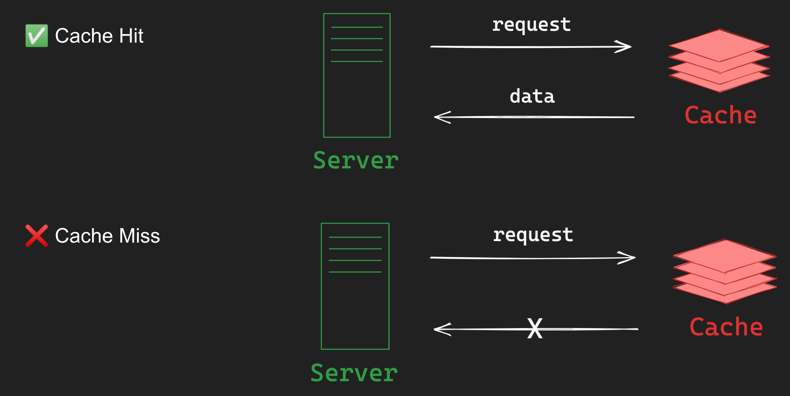

1. **Cache Hit**:
   - 캐시 히트는 요청된 데이터가 캐시에 존재할 때 발생합니다.
   - 예를 들어, 웹 브라우저가 웹 페이지의 이미지를 로드할 때 해당 이미지가 브라우저의 캐시에 이미 저장되어 있다면, 이미지는 캐시에서 빠르게 로드됩니다. 이 경우, 새로운 네트워크 요청을 할 필요가 없습니다.
   - 캐시 히트는 시스템의 성능을 향상시키는 데 중요한 역할을 합니다. 왜냐하면 캐시에서 데이터를 검색하는 것은 일반적으로 원래의 데이터 소스에서 검색하는 것보다 훨씬 빠르기 때문입니다.
2. **Cache Miss**:
   - 캐시 미스는 요청된 데이터가 캐시에 없을 때 발생합니다.
   - 이 경우, 데이터는 원래의 데이터 소스(예: 디스크, 데이터베이스, 원격 서버)에서 검색되어야 합니다. 그런 다음, 향후 액세스를 위해 해당 데이터는 캐시에 저장될 수 있습니다.
   - 캐시 미스는 캐싱 시스템의 성능에 부정적인 영향을 미칠 수 있습니다. 데이터를 원래의 소스에서 가져와야 하므로 더 많은 시간이 소요될 수 있습니다.

## 캐시 전략 - Cache-Aside Pattern

클라이언트가 서버에 요청할 때 캐시를 먼저 조회하고, 캐시에 없다면 데이터베이스를 읽고 캐시에 write하는 전략

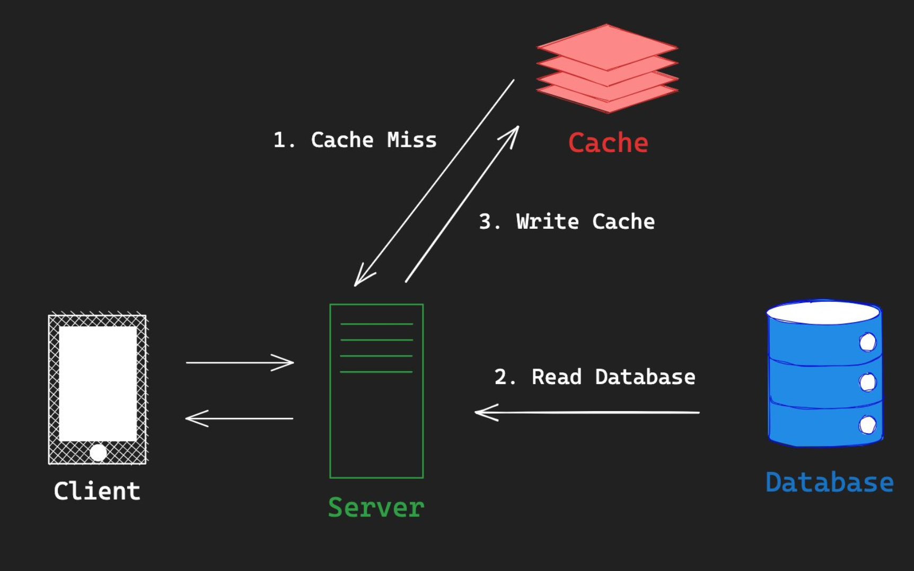


이외에 다양한 캐시 패턴이 존재한다. 

# 2. Redis 설치

### MacOS

https://redis.io/docs/getting-started/installation/install-redis-on-mac-os/ 

1. HomeBrew 설치

```bash
/bin/bash -c "$(curl -fsSL https://raw.githubusercontent.com/Homebrew/install/HEAD/install.sh)"
```

2. Redis 설치

```bash
brew install redis
```

3. Redis 실행

```bash
brew services start redis
```

4. Redis 종료

```bash
brew services stop redis
```

### Docker - compose

```yaml
 version: '3'

services:
   inf-redis:
     container_name: inf-redis
     environment:
       - TZ=Asia/Seoul
       - ALLOW_EMPTY_PASSWORD=yes
     image: redis:latest
     ports:
       - "6379:6379"
     command: redis-server --requirepass 1234
     volumes:
       - /Users/ysk/dev/volume/inf-redis/data:/data
       - /Users/ysk/dev/volume/inf-redis/config:/usr/local/etc/redis
```


# 3. 데이터 타입 알아보기

## 데이터 저장/조회/삭제

저장

```
$ SET lecture inflearn-redis
```

조회
```
$ GET lecture
```

삭제
```
$ DEL lecture
```

## Strings

Strings 문자열, 숫자, serialized object(JSON string) 등 저장

```
SET key이름 값 // String 저장
```

### MSET - MultiSet

```
MSET key이름1 값1, key이름2, 값2 // Multi-set
```

### MGET - MultiGet

```sh
MGET key이름1, key이름2

//
127.0.0.1:6379> MGET lecture price language
1) (nil)
2) "100"
3) "ko"
```

### INCR - Redis는 별도의 Integer 타입 없이 String으로 숫자를 저장

```sh
INCR price // Increase의 약자로 숫자형 String 값을 1 증가
```

### INCRBY - 특정 숫자형 key의 값을 증가

```sh
INCRBY price 100 // price의 value를 100 증가 
```

### SET - JSON String

만약 다음과 같이 저장하면 

```
$ SET inflearn-redis '{"price": 100, "language": "ko"}'
```

사용할때 해당 data를 직접 json형태로 바꿔서 사용해야 한다.

```
127.0.0.1:6379> get inflearn-redis

"{\"price\": 100, \"language\": \"ko\"}"
```


key를 만들때 :(콜론)을 만들어 의미별로 구분할수도 있다. 

ex) inflean-redis:ko:price 200이다 로 저장

```
$ SET inflearn-redis:ko:price 200
```


```sh
$ SET lecture inflearn-redis

$ MSET price 100 language ko
$ MGET lecture price language

$ INCR price
$ INCRBY price 10

$ SET ‘{“lecture”: “inflearn-redis”, “language”: “en”}’
$ SET inflearn-redis:ko:price 200
```


## Lists

String을 Linked List로 저장할때 사용한다 

*  push / pop에 최적화 O(1)

Queue(FIFO) / Stack(FILO) 구현에 사용

* 인덱스로 접근이 가능하다

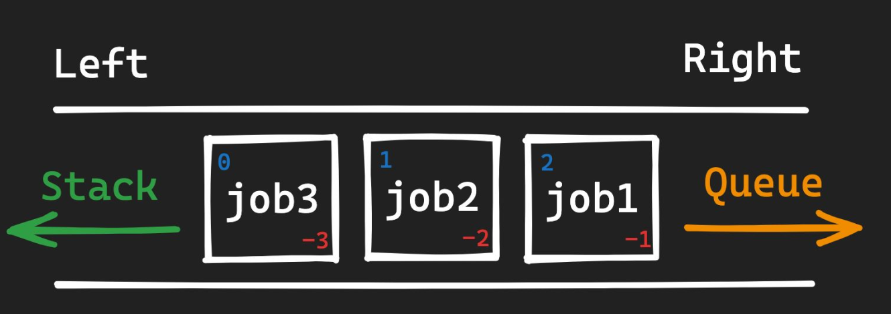

```sh
$ LPUSH queue job1 job2 job3     # 'queue' 리스트의 왼쪽(시작)에 'job1', 'job2', 'job3'를 추가
$ LRANGE queue 0 -1 					   # 'queue' 리스트의 모든 요소 조회
$ RPOP queue                      # 'queue' 리스트의 오른쪽(끝)에서 항목을 꺼내 (제거하고) 반환
$ LPUSH stack job1 job2 job3     # 'stack' 리스트의 왼쪽(시작)에 'job1', 'job2', 'job3'를 추가
$ LPOP stack                     # 'stack' 리스트의 왼쪽(시작)에서 항목을 꺼내 (제거하고) 반환
$ LPUSH queue job1 job2 job3     # 'queue' 리스트의 왼쪽(시작)에 'job1', 'job2', 'job3'를 추가
$ LRANGE queue -2 -1             # 'queue' 리스트의 뒤에서 두 번째와 마지막 항목을 반환
$ LTRIM queue 0 0                # 'queue' 리스트를 자르며, 0번째 항목만 유지하고 나머지는 제거

$ LRANGE mylist 0 -1             # 'mylist'의 모든 항목 조회
$ RPUSH mylist val1 val2         # 'mylist'에 값들을 오른쪽에서 푸시
$ LPUSHX mylist val              # 'mylist'가 존재할 경우 왼쪽에 값 푸시
$ RPUSHX mylist val              # 'mylist'가 존재할 경우 오른쪽에 값 푸시
$ LINSERT mylist BEFORE pivot val # 'pivot' 전에 'val' 삽입
$ LINSERT mylist AFTER pivot val  # 'pivot' 후에 'val' 삽입
$ LLEN mylist                    # 'mylist'의 길이 반환
$ LINDEX mylist 2                # 'mylist'에서 2번째 위치의 값을 반환
$ LSET mylist 2 "newval"         # 'mylist'의 2번째 위치의 값을 "newval"로 설정
$ LREM mylist 2 "val"            # 'mylist'에서 "val"을 2회 제거
$ RPOPLPUSH source dest          # 'source'의 오른쪽 항목을 팝하고 'dest'의 왼쪽에 푸시
```


## Sets

Sets : Unique(중복 없이) string을 저장하는 정렬되지 않은 집합


Set Operation 사용 가능(e.g. intersection, union, difference)

* Redis Set에는 집합을 구하는 연산이 포함되어있다

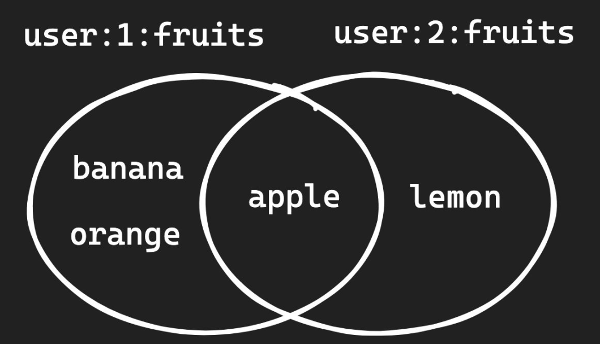

```sh
$ SADD user:1:fruits apple banana orange orange     
# 'user:1:fruits'라는 Set에 'apple', 'banana', 'orange'를 추가합니다. Set은 중복 값을 허용하지 않으므로 'orange'는 한 번만 추가됩니다.

$ SMEMBERS user:1:fruits                            
# 'user:1:fruits'라는 Set에 있는 모든 항목들을 반환합니다.

$ SCARD user:1:fruits                  
# 'user:1:fruits'라는 Set의 요소 수를 반환합니다.

$ SISMEMBER user:1:fruits banana 
# 'banana'가 'user:1:fruits'라는 Set에 있는지 확인합니다. 있으면 1, 없으면 0을 반환합니다.

# Sets
$ SADD user:2:fruits apple lemon                    
# 'user:2:fruits'라는 Set에 'apple'과 'lemon'을 추가합니다.

$ SINTER user:1:fruits user:2:fruits                
# 'user:1:fruits'와 'user:2:fruits' 두 Set의 교집합을 반환합니다.

$ SDIFF user:1:fruits user:2:fruits                 
# 'user:1:fruits' Set에서 'user:2:fruits' Set의 항목들을 제외한 나머지 항목들을 반환합니다.

$ SUNION user:1:fruits user:2:fruits                
# 'user:1:fruits'와 'user:2:fruits' 두 Set의 합집합을 반환합니다.

-- 추가 명령어

$ KEYS key*
# KEYS pattern, 모든 key 조회. O(n)의 시간복잡도 주의 


$ SREM user:1:fruits apple                           
# 'user:1:fruits' Set에서 'apple'을 제거합니다.

$ SPOP user:1:fruits                            
# 'user:1:fruits' Set에서 임의의 항목을 제거하고 반환합니다.

$ SRANDMEMBER user:1:fruits            
# 'user:1:fruits' Set에서 임의의 항목을 반환합니다.

$ SRANDMEMBER user:1:fruits 2          
# 'user:1:fruits' Set에서 임의로 2개의 항목을 반환합니다.

$ SMOVE user:1:fruits user:2:fruits banana    
# 'user:1:fruits'에서 'banana'를 제거하고 'user:2:fruits'에 추가합니다.

$ SDIFFSTORE result user:1:fruits user:2:fruits  
# 'user:1:fruits'와 'user:2:fruits'의 차집합을 'result'라는 Set에 저장합니다.

$ SINTERSTORE result user:1:fruits user:2:fruits  
# 'user:1:fruits'와 'user:2:fruits'의 교집합을 'result'라는 Set에 저장합니다.

$ SUNIONSTORE result user:1:fruits user:2:fruits  
# 'user:1:fruits'와 'user:2:fruits'의 합집합을 'result'라는 Set에 저장합니다.

$ SSCAN user:1:fruits 0 MATCH apple                
# 'user:1:fruits' Set에서 'apple'과 일치하는 항목을 스캔합니다.

```

## Hashes

Hashes :  field-value 구조를 갖는 데이터 타입

다양한 속성을 갖는 객체의 데이터를 저장할 때 유용

```sh
$ HSET lecture name inflearn-redis price 100 language ko
# 'lecture'라는 Hash에 'name', 'price', 'language'라는 키와 각각 'inflearn-redis', '100', 'ko'라는 값을 설정합니다.

$ HGET lecture name
# 'lecture'라는 Hash에서 'name' 키에 해당하는 값을 가져옵니다.

$ HMGET lecture price language invalid
# 'lecture'라는 Hash에서 'price', 'language', 'invalid' 키들에 해당하는 값을 한 번에 가져옵니다. 'invalid' 키는 존재하지 않기 때문에 nil 또는 null 값을 반환합니다.

$ HINCRBY lecture price 10
# 'lecture'라는 Hash의 'price' 키에 저장된 값을 10만큼 증가시킵니다.

-- 추가 명령어

$ HSETNX lecture author John
# 'lecture'라는 Hash에 'author'라는 키가 없을 경우에만 'John'이라는 값을 설정합니다. 
# 만약 키가 이미 존재하면 아무 것도 변경되지 않습니다.

$ HMSET lecture author John duration 45
# 'lecture'라는 Hash에 'author' 키에 'John' 값을, 'duration' 키에 '45' 값을 한번에 설정합니다.

$ HGETALL lecture
# 'lecture'라는 Hash의 모든 키-값 쌍을 가져옵니다.

$ HDEL lecture author
# 'lecture'라는 Hash에서 'author' 키와 그에 해당하는 값을 제거합니다.

$ HEXISTS lecture author
# 'lecture'라는 Hash에 'author'라는 키가 존재하는지 확인합니다. 존재하면 1을, 존재하지 않으면 0을 반환합니다.

$ HKEYS lecture
# 'lecture'라는 Hash의 모든 키를 반환합니다.

$ HVALS lecture
# 'lecture'라는 Hash의 모든 값을 반환합니다.

$ HLEN lecture
# 'lecture'라는 Hash의 키-값 쌍의 수를 반환합니다.

$ HINCRBYFLOAT lecture rating 0.5
# 'lecture'라는 Hash의 'rating' 키에 저장된 실수 값을 0.5만큼 증가시킵니다.

$ HSTRLEN lecture name
# 'lecture'라는 Hash의 'name' 키에 저장된 값의 문자열 길이를 반환합니다.

```


## Sorted Sets (ZSET)

ZSets :  

Unique string을 연관된 score를 통해 정렬된 집합(Set의 기능 + 추가로 score 라는 필드 속성 저장하고 이용한다 )

* 차이점은 각 멤버가 연관된 '점수'나 '순위' 값이 있다는 것

내부적으로 Skip List + Hash Table로 이루어져 있고, score 값에 따라 정렬 유지

* `SkipList`는 검색, 삽입, 삭제 작업을 효율적으로 수행할 수 있는 데이터 구조

  * **SkipList의 핵심 개념**:

    1. **다중 레벨**: SkipList는 여러 레벨의 연결 리스트로 구성됩니다. 베이스 레벨에서는 모든 요소가 포함됩니다. 그리고 각 상위 레벨에서는 아래 레벨의 일부 요소만 포함됩니다. 이렇게 여러 레벨로 구성되어 있어 검색을 효율적으로 할 수 있습니다.
    2. **랜덤화**: 요소가 상위 레벨에 포함될지 여부는 확률적으로 결정됩니다. 이 랜덤성이 SkipList에 균형을 유지하도록 돕습니다.
    3. **포워드 포인터**: 각 노드는 현재 레벨에서의 다음 노드뿐만 아니라, 상위 레벨에서의 다음 노드에 대한 참조도 포함합니다. 이러한 포워드 포인터를 사용하여 빠르게 리스트를 탐색할 수 있습니다.

    **SkipList의 장점**:

    1. **평균 시간 복잡도**: SkipList의 검색, 삽입, 삭제 작업은 평균 O(log n)의 시간 복잡도를 가집니다.
    2. **동적**: 요소가 삽입되거나 삭제될 때 자동으로 균형을 유지합니다.

score가 동일하면 lexicographically(사전 편찬 순) 정렬

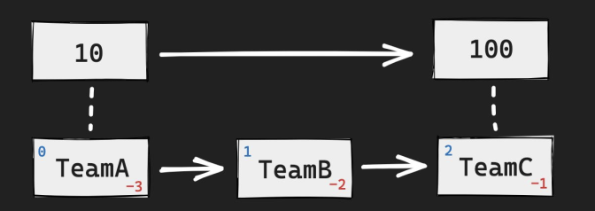

**적용 사례**:

- **리더보드**: 게임의 점수나 어플리케이션의 사용자 랭킹과 같은 리더보드에 사용됩니다.
- **시계열 데이터**: 점수는 타임스탬프로 사용될 수 있으며, 이를 통해 시계열 데이터를 저장하고 쿼리할 수 있습니다.
- **우선순위 큐**: 점수는 우선순위로 사용되며, 다양한 작업이나 요청을 우선순위에 따라 처리할 수 있습니다.

`Sorted Sets`는 `Sets`의 모든 기능을 포함하면서도 각 멤버에 순서를 부여할 수 있어 특정 케이스에서 유용하게 사용될 수 있습니다.


```sh
$ ZADD points 10 TeamA 10 TeamB 50 TeamC
# 'points'라는 Sorted Set에 'TeamA', 'TeamB', 'TeamC'라는 멤버들을 각각의 점수 10, 10, 50으로 추가합니다.

$ ZRANGE points 0 -1
# 'points'라는 Sorted Set에서 가장 낮은 점수부터 가장 높은 점수까지의 모든 멤버들을 반환합니다.

$ ZRANGE points 0 -1 WITHSCORES
# 'points'라는 Sorted Set에서 가장 낮은 점수부터 가장 높은 점수까지의 모든 멤버들과 그들의 점수를 함께 반환합니다.

$ ZRANGE points 0 -1 REV WITHSCORES
# 'points'라는 Sorted Set에서 가장 높은 점수부터 가장 낮은 점수까지의 모든 멤버들과 그들의 점수를 함께 반환합니다.

$ ZRANK points TeamA
# 'points'라는 Sorted Set에서 'TeamA' 멤버의 순위를 반환합니다. 순위는 0부터 시작하며, 가장 낮은 점수가 0입니다.

--- 추가 명령어

$ ZADD leaderboard 150 user1 200 user2
# 'leaderboard'라는 Sorted Set에 'user1'과 'user2'라는 멤버를 각각의 점수 150, 200으로 추가합니다.

$ ZCARD leaderboard
# 'leaderboard'라는 Sorted Set의 멤버 수를 반환합니다.

$ ZCOUNT leaderboard 100 200
# 'leaderboard'라는 Sorted Set에서 점수 100부터 200 사이에 있는 멤버 수를 반환합니다.

$ ZINCRBY leaderboard 10 user1
# 'leaderboard'라는 Sorted Set에서 'user1'의 점수를 10만큼 증가시킵니다.

$ ZREM leaderboard user2
# 'leaderboard'라는 Sorted Set에서 'user2' 멤버를 제거합니다.

$ ZREVRANK leaderboard user1
# 'leaderboard'라는 Sorted Set에서 'user1' 멤버의 역순위를 반환합니다. 역순위는 가장 높은 점수가 0에서 시작합니다.

$ ZSCORE leaderboard user1
# 'leaderboard'라는 Sorted Set에서 'user1' 멤버의 점수를 반환합니다.

$ ZREVRANGE leaderboard 0 -1 WITHSCORES
# 'leaderboard'라는 Sorted Set에서 가장 높은 점수부터 가장 낮은 점수까지의 모든 멤버들과 그들의 점수를 함께 반환합니다.

$ ZRANGEBYSCORE leaderboard 100 200 WITHSCORES
# 'leaderboard'라는 Sorted Set에서 점수 100부터 200 사이의 멤버들과 그들의 점수를 반환합니다.

$ ZREMRANGEBYSCORE leaderboard 0 100
# 'leaderboard'라는 Sorted Set에서 점수 0부터 100 사이의 멤버들을 모두 제거합니다.

$ ZLEXCOUNT leaderboard [a [z
# 'leaderboard'라는 Sorted Set에서 'a'부터 'z'까지(포함) 사전식 순서에 있는 멤버 수를 반환합니다.

```

## Streams

Streams :  append-only log에 consumer groups과 같은 기능을 더한 자료 구조

* 카프카와 유사..
  * 차이점
    * **목적**: Kafka는 대규모 이벤트 스트리밍 및 메시징 플랫폼으로 시작되었습니다. Redis Streams는 Redis 데이터베이스 내의 스트리밍 기능으로 시작되어, 적은 양의 데이터와 간단한 스트리밍 작업에 적합합니다.
    * **확장성**: Kafka는 분산 클러스터 구성이며, 수십 TB 또는 그 이상의 데이터를 처리하도록 설계되었습니다. Redis는 메모리 기반의 데이터베이스로, 데이터 크기는 사용 가능한 메모리에 의해 제한됩니다.
    * **지속성**: Kafka는 디스크에 데이터를 지속적으로 저장하며, TTL을 설정하거나 컴팩션 정책을 사용하여 데이터를 정리합니다. Redis는 주로 메모리에 데이터를 저장하지만, 디스크에 스냅샷을 저장하는 등의 영속성 메커니즘을 제공합니다.
    * **API 및 기능**: Redis Streams는 XADD, XREAD 같은 간단하고 직관적인 API를 제공합니다. Kafka는 Producer API, Consumer API 등 좀 더 복잡한 API를 제공합니다.
    * **통합**: Kafka는 ZooKeeper와 같은 추가 컴포넌트와 통합되어야 합니다. Redis는 독립적인 시스템으로 동작하며, Redis 클러스터를 설정하는 것만으로도 충분합니다.
  * Streams의 단점
    * **확장성 제한**: Redis는 기본적으로 단일 노드 메모리 기반의 구조로 설계되었습니다. 대량의 데이터를 처리하거나 수백 TB 이상의 데이터를 저장하는 것이 목표라면, Kafka는 더 나은 선택일 수 있습니다. Redis 클러스터는 확장성을 향상시키지만 Kafka의 분산 처리 능력에 비해 한계가 있습니다.
    * **메모리 종속성**: Redis는 주로 메모리에 데이터를 저장하므로 사용 가능한 RAM 크기에 데이터 저장이 제한됩니다. 대규모 데이터 스트림을 저장하려면 많은 메모리가 필요합니다.
    * **내구성**: Kafka는 디스크 기반으로 동작하여 데이터를 지속적으로 저장합니다. 반면 Redis Streams는 메모리 기반으로 동작하며 데이터를 디스크에 지속하기 위해 주기적인 스냅샷 또는 AOF 방법을 사용합니다.
* append-only : 데이터 저장 로그. 데이터가 삭제되지 않고 항상 추가만된다.

* 추가 기능 :  unique id를 통해 하나의 entry를 읽을 때, O(1) 시간 복잡도
  * Consumer Group을 통해 분산 시스템에서 다수의 consumer가 event 처리

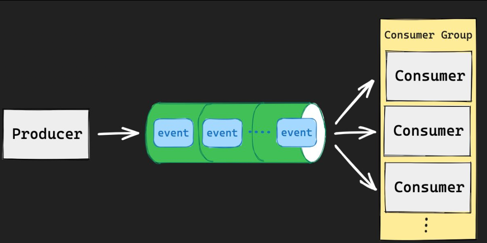

```sh
$ XADD events * action like user_id 1 product_id 1
# 'events'라는 Stream에 새로운 이벤트를 추가합니다. 이 이벤트에는 'action', 'user_id', 그리고 'product_id'라는 필드가 있으며 각각 'like', '1', '1' 값을 가집니다. '*'는 Redis가 자동으로 시간 기반의 ID를 생성하도록 지시합니다.

$ XADD events * action like user_id 2 product_id 1
# 'events' Stream에 또 다른 이벤트를 추가합니다. 이 이벤트는 첫 번째 이벤트와 유사하지만 'user_id' 필드의 값이 '2'입니다.

$ XRANGE events - +
# 'events' Stream의 모든 이벤트를 조회합니다. '-'는 Stream의 시작을 의미하고 '+'는 Stream의 끝을 의미합니다.

$ XDEL events ID
# 'events' Stream에서 주어진 ID의 이벤트를 삭제합니다. 여기서 'ID'는 실제로 생성된 이벤트의 ID로 바뀌어야 합니다.

-- 추가 명령어.. 더있음
$ XLEN events
# 'events' Stream에 포함된 메시지의 개수를 반환합니다.

$ XREAD COUNT 2 STREAMS events 0
# 'events' Stream에서 처음 두 개의 메시지를 읽습니다. '0'은 스트림의 시작부터 메시지를 읽기 시작한다는 것을 의미합니다.

$ XREAD BLOCK 10000 STREAMS events $
# 10초(10,000 밀리초) 동안 'events' Stream의 새로운 메시지를 기다립니다. 새로운 메시지가 도착하면 반환합니다.

$ XGROUP CREATE events mygroup 0
# 'events' Stream에 'mygroup'이라는 이름의 컨슈머 그룹을 생성합니다.

$ XREADGROUP GROUP mygroup Alice COUNT 1 STREAMS events >
# 'mygroup'의 'Alice' 컨슈머가 'events' Stream에서 아직 읽지 않은 메시지를 하나 읽습니다.

$ XACK events mygroup messageID
# 'mygroup'에게 'messageID' 메시지가 성공적으로 처리되었음을 알립니다.

$ XPENDING events mygroup
# 'mygroup'에서 처리되지 않은 메시지의 개수와 컨슈머의 정보를 반환합니다.

$ XCLAIM events mygroup Alice 3600000 messageID
# 만약 'Alice'가 다운되거나 메시지를 처리하지 못한 경우, 해당 메시지를 'Alice'가 1시간(3,600,000 밀리초) 후에 다시 처리할 수 있도록 주장(claim)합니다.

```

* 추가 명령어 : [Redis 공식 문서](https://redis.io/commands#stream)

## Geospatial

Geospatial Indexes : 좌표를 저장하고, 검색하는 데이터 타입 거리 계산, 범위 탐색 등 지원

**장점**

1. **빠른 속도**: Redis의 메모리 기반 구조 덕분에 Geospatial 쿼리는 매우 빠릅니다.
2. **간단함**: 복잡한 지리적 쿼리 없이 간단한 명령어로 위치 기반 정보를 저장하고 검색할 수 있습니다.
3. **스케일링**: Redis 클러스터를 사용하여 Geospatial 데이터를 스케일 아웃할 수 있습니다.

**단점**

1. **정밀도 한계**: Redis의 Geospatial 기능은 고도의 정밀성을 요하는 애플리케이션에는 적합하지 않을 수 있습니다.
2. **기능 제한**: 좀 더 고급의 지리적 쿼리 기능이 필요한 경우, 전용 지리적 데이터베이스나 GIS 솔루션을 고려해야 할 수 있습니다.
3. **메모리 사용량**: Redis는 메모리 기반 데이터베이스이므로, 많은 양의 지리적 데이터를 저장할 때 메모리 사용량이 급증할 수 있습니다.

```sh
$ GEOADD seoul:station 126.923917 37.556944 hong-dae 127.027583 37.497928 gang-nam
# 'seoul:station'이라는 키에 'hong-dae'와 'gang-nam' 두 지점의 경도와 위도를 추가합니다. 
# 'hong-dae'의 좌표는 (126.923917, 37.556944)이며, 'gang-nam'의 좌표는 (127.027583, 37.497928)입니다.

$ GEODIST seoul:station hong-dae gang-nam KM
# 'seoul:station' 키에서 'hong-dae'와 'gang-nam' 두 지점 간의 거리를 킬로미터(KM)로 계산하여 반환합니다.

$ GEOADD key long1 lat1 name1 ... longN latN nameN
# 지정된 키에 하나 이상의 지리적 위치(경도, 위도 및 이름)를 추가합니다.

$ GEODIST key name1 name2 [unit]
# 두 지점 간의 거리를 계산합니다. 선택적으로 단위(m, km, mi, ft)를 지정할 수 있습니다.

$ GEOHASH key name1 ... nameN
# 지정된 이름의 위치에 대한 geohash 값을 반환합니다.

$ GEOPOS key name1 ... nameN
# 지정된 이름의 위치에 대한 위도와 경도를 반환합니다.

$ GEORADIUS key longitude latitude radius m|km|ft|mi [WITHCOORD] [WITHDIST] [WITHHASH] [COUNT count]
# 주어진 위치와 반경 내의 요소를 검색합니다. 여러 옵션을 사용하여 결과를 커스터마이즈 할 수 있습니다.

$ GEORADIUSBYMEMBER key member radius m|km|ft|mi [WITHCOORD] [WITHDIST] [WITHHASH] [COUNT count]
# 지정된 멤버의 위치를 중심으로 주어진 반경 내의 요소를 검색합니다.

```

* Redis 공식 문서의 Geospatial 인덱스: [링크](https://redis.io/commands#geo)

## Bitmaps

Bitmaps :  실제 데이터 타입은 아니고, String에 binary operation을 적용한 것

최대 42억개 binary 데이터 표현 = 2^32(4,294,967,296)

* 적은 메모리를 이용하여 상태값을 저장하는데 사용 

```sh
$ SETBIT key offset value
# 특정 오프셋에 비트를 설정합니다. 오프셋은 0부터 시작하며, 값은 0 또는 1이어야 합니다.

$ SETBIT user:log-in:23-01-01 123 1
# 'user:log-in:23-01-01' 키의 123번째 비트를 1로 설정합니다. - 1월 1일 123번 유저 로그인

$ SETBIT user:log-in:23-01-01 456 1
# 'user:log-in:23-01-01' 키의 456번째 비트를 1로 설정합니다. 로그인

$ SETBIT user:log-in:23-01-02 123 1
# 'user:log-in:23-01-02' 키의 123번째 비트를 1로 설정합니다. 로그인


$ BITOP AND result user:log-in:23-01-01 user:log-in:23-01-02
# 'user:log-in:23-01-01'와 'user:log-in:23-01-02'의 비트를 AND 연산한 후, 그 결과를 'result' 키에 저장합니다.
# 1월 1일과 2일에 로그인한 유저 확인

$ BITCOUNT key [start end]
# 키에서 설정된 비트(1로 설정된 비트)의 수를 반환합니다.

$ BITCOUNT user:log-in:23-01-01
# 'user:log-in:23-01-01' 키에 설정된 비트의 수를 반환합니다.

$ BITOP operation destkey key [key ...]
# 하나 이상의 입력 키와 비트 연산을 수행하고 결과를 destkey에 저장합니다.

$ GETBIT key offset
# 특정 오프셋의 비트 값을 반환합니다.

$ GETBIT result 123
# 'result' 키의 123번째 비트 값을 반환합니다.

```


## HyperLogLog

HyperLogLog : 집합의 cardinality를 추정할 수 있는 확률형 자료구조

* 중복 아이템의 수를 카운트하는데 사용되는 통계 기반의 알고리즘

정확성을 일부 포기하는 대신 저장공간을 효율적으로 사용(평균 에러 0.81%)


1. **메모리 효율성**: HLL은 고유한 요소의 수를 추정하는데 매우 작은 양의 메모리만 사용합니다. 예를 들어, 수백만 개의 아이템을 트래킹하기 위해 약 12KB의 고정 크기를 사용합니다.
2. **정확성**: 정확한 카운트를 제공하지는 않지만 0.81%의 표준 오차 내에서 꽤 정확한 추정치를 제공합니다.
3. **병합 가능**: 여러 HLL 구조물을 합칠 수 있습니다. 따라서 분산된 시스템에서 데이터를 수집하고 나중에 병합할 수 있습니다.

**vs. Set**

1. **메모리 사용**: Sets는 집합의 각 항목에 대한 실제 메모리를 사용합니다. 반면, HLL은 추정치를 제공하는데 매우 적은 양의 메모리만 사용합니다.
2. **정확성**: Sets는 100% 정확한 카운트를 제공합니다. HLL은 근사치를 제공하며, 작은 표준 오차가 있을 수 있습니다.
3. 사용 사례
   - **Sets**: 중복을 허용하지 않는 항목의 집합을 관리하려는 경우 사용됩니다.
   - **HyperLogLog**: 대량의 데이터에서 고유한 항목의 수를 추정하려는 경우 사용됩니다. 예를 들어, 웹사이트 방문자 수나 고유한 IP 주소의 수 등을 추정할 때 유용합니다.

정확한 카운트가 필요하면 Sets를 사용하고, 대량의 데이터에서 근사치로 고유 항목 수를 빠르게 얻고 싶을 때는 HLL을 사용합니다.

```sh
$ PFADD fruits apple orange grape kiwi
# 'fruits'라는 HyperLogLog에 'apple', 'orange', 'grape', 'kiwi'라는 값을 추가합니다. 이 명령어는 추정 중복 카운트를 증가시킵니다.

$ PFCOUNT fruits
# 'fruits'라는 HyperLogLog에 저장된 고유한 항목들의 근사적인 카운트(수)를 반환합니다.

$ PFADD key element [element ...]
# 지정된 key의 HyperLogLog에 하나 이상의 요소를 추가합니다.

$ PFCOUNT key [key ...]
# 하나 또는 여러 HyperLogLog의 근사적인 카운트(수)를 반환합니다.

$ PFMERGE destkey sourcekey [sourcekey ...]
# 여러 HyperLogLog를 하나로 병합하여 결과를 'destkey'에 저장합니다.

$ PFADD users user1 user2 user3
# 'users'라는 HyperLogLog에 'user1', 'user2', 'user3'를 추가합니다.

$ PFCOUNT users
# 'users' HyperLogLog에 저장된 고유한 항목들의 근사적인 카운트(수)를 반환합니다.

$ PFADD otherUsers user4 user5
# 'otherUsers'라는 다른 HyperLogLog에 'user4', 'user5'를 추가합니다.

$ PFMERGE allUsers users otherUsers
# 'users'와 'otherUsers' 두 HyperLogLog를 병합하여 결과를 'allUsers'에 저장합니다. 'allUsers'는 이제 모든 고유한 사용자의 근사 카운트를 포함하게 됩니다.
```

## HyperLogLogs 메모리 테스트

터미널에서 Set를 입력하기 위한 도커 명령어 실행

```sh
docker exec -it inf-redis /bin/bash -c \
"for (( i=1; i<=1000; i++ )); do redis-cli -a 1234 SADD k1 \$i; done"
```

레디스 ci에서 메모리 확인

```sh
127.0.0.1:6379> MEMORY USAGE k1
(integer) 40296
```

* 40296 바이트 사용

다음으로, HyperLogLogs 명령어 실행

```sh
docker exec -it inf-redis /bin/bash -c \
"for (( i=1; i<=1000; i++ )); do redis-cli -a 1234 PFADD k2 \$i; done"
```

레디스 cli에서 메모리 확인

```sh
127.0.0.1:6379> MEMORY USAGE k2
(integer) 3632
```

* 3632 바이트 사용


## (선택) BloomFilter 실습 자료

- Mac
  - https://docs.docker.com/desktop/install/mac-install/

### 컨테이너 실행

```sh
docker run -p 63790:6379 -d --rm redis/redis-stack-server
```


Redis 모듈의 확장으로 제공된다.

## BloomFilter

BloomFilter: element가 집합 안에 포함되었는지 확인할 수 있는 확률형 자료 구조 (=membership test)
정확성을 일부 포기하는 대신 저장공간을 효율적으로 사용

특징은 메모리 효율성을 가지고 있지만, "있을 수도 있다" 또는 "없다"의 두 가지 상태만 반환한다는 점입니다. 

**false positive** :  element가 집합에 실제로 포함되지 않은데 포함되었다고 잘못 예측하는 경우

* 실제로는 없지만 있는 것으로 잘못 판단)는 허용되지만, false negatives(실제로는 있지만 없는 것으로 잘못 판단)는 발생하지 않습니다.

```sh
$ BF.MADD fruits apple orange
# 'fruits'라는 이름의 Bloom filter에 'apple'과 'orange'를 추가합니다.

$ BF.EXISTS fruits apple
# 'fruits'라는 이름의 Bloom filter에서 'apple'의 존재 여부를 확인합니다. 
# 있으면 1을 반환하고, 없거나 false positive의 경우에도 1을 반환합니다.

$ BF.EXISTS fruits grape
# 'fruits'라는 이름의 Bloom filter에서 'grape'의 존재 여부를 확인합니다. 
# 없으면 0을 반환하며, 이는 'grape'가 추가되지 않았음을 확신시켜 줍니다.
```


# 4. Redis 특수 명령어

## 데이터 만료 (expire)

Expiration : 데이터를 특정시간 이후에 만료 시키는 기능

TTL(Time To Live):  데이터가 유효한 시간(초 단위)

특징 데이터 조회 요청시에 만료된 데이터는 조회되지 않음

데이터가 만료되자마자 삭제하지 않고, 만료로 표시했다가 백그라운드에서 주기적으로 삭제

```sh
$ SET greeting hello
# 'greeting'이라는 키에 'hello'라는 값을 설정합니다.

$ EXPIRE greeting 10
# 'greeting'이라는 키에 대한 만료 시간을 10초로 설정합니다. 10초 후에는 이 키와 그 값은 자동으로 Redis에서 제거됩니다.

$ TTL greeting
# 'greeting' 키의 남은 생존 시간(TTL, Time-To-Live)을 초 단위로 반환합니다. 만일 EXPIRE 명령이 호출된 지 바로 후라면 대략 10에 가까운 값이 반환될 것입니다.

$ GET greeting
# 'greeting' 키의 값을 가져옵니다. 만약 이 명령이 키의 만료 시간 이후에 호출되면, null 또는 nil 값을 반환하게 됩니다.

$ SETEX greeting 10 hello
# 'greeting'이라는 키에 'hello'라는 값을 설정하면서 동시에 그 키의 만료 시간을 10초로 설정합니다. 이것은 SET과 EXPIRE 명령어를 연속으로 사용하는 것과 동일한 효과를 갖습니다.

```

## SET NX/XX

NX :  해당 Key가 존재하지 않는 경우에만 SET

XX :  해당 Key가 이미 존재하는 경우에만 SET

Null Reply :  SET이 동작하지 않은 경우 (nil) 응답

```
$ SET greeting hello NX
# 'greeting'이라는 키가 아직 존재하지 않을 경우에만 'hello'라는 값을 설정합니다.
# 'NX'는 "Not eXists"의 약자로, 키가 존재하지 않는 경우에만 새 값을 설정합니다.

$ SET greeting hello XX
# 'greeting'이라는 키가 이미 존재할 경우에만 'hello'라는 값을 설정합니다.
# 'XX'는 "eXists"의 약자로, 키가 이미 존재하는 경우에만 값을 갱신합니다.

```


## PUB/SUB

Publisher와 Subscriber가 서로 알지 못해도 통신이 가능하도록 decoupling 된 패턴

Publisher는 Subscriber에게 직접 메시지를 보내지 않고, Channel에 Publish

Subscriber는 관심이 있는 Channel을 필요에 따라 Subscribe하며 메시지 수신

* vs. Stream : 메시지가 보관되는 Stream과 달리 Pub/Sub은 Subscribe 하지 않을 때 발행된 메시지 수신 불가

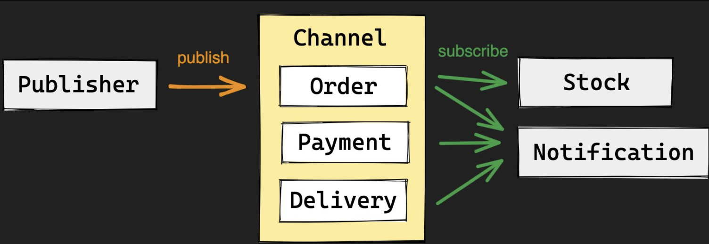

```sh
$ SUBSCRIBE ch:order ch:payment
# 'ch:order'와 'ch:payment'라는 채널에 구독을 시작합니다. 해당 채널로부터 메시지가 전송되면 그 메시지를 받게 됩니다.

$ PUBLISH ch:order new-order
# 'ch:order'라는 채널에 'new-order'라는 메시지를 발행합니다. 이 채널을 구독하는 모든 구독자들에게 이 메시지가 전달됩니다.

$ PUBLISH ch:payment new-payment
# 'ch:payment'라는 채널에 'new-payment'라는 메시지를 발행합니다. 이 채널을 구독하는 모든 구독자들에게 이 메시지가 전달됩니다.
```

## Pipeline

다수의 commands를 한 번에 요청하여 네트워크 성능을 향상 시키는 기술

Round-Trip Times 최소화

대부분의 클라이언트 라이브러리에서 지원

* Round-Trip Times :  Request / Response 모델에서 발생하는 네트워크 지연 시간

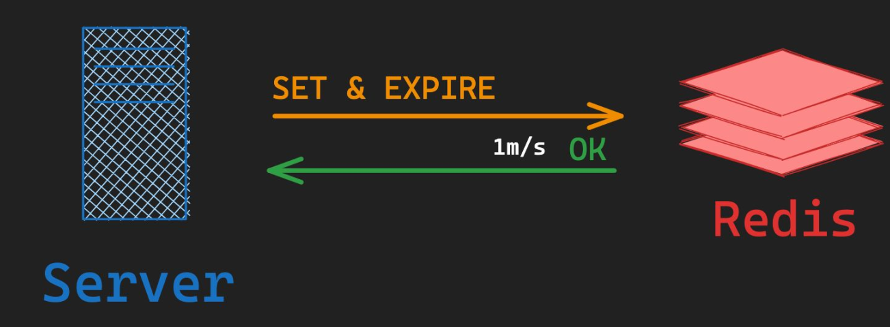

## Transaction

다수의 명령을 하나의 트랜잭션으로 처리 -> 원자성(Atomicity) 보장

중간에 에러가 발생하면 모든 작업 Rollback

하나의 트랜잭션이 처리되는 동안 다른 클라이언트의 요청이 중간에 끼어들 수 없음

* Atomicity :  All or Nothing / 모든 작업이 적용되거나 하나도 적용되지 않거나

* vs. Pipeline Pipeline은 네트워크 퍼포먼스 향상을 위해 여러개의 명령어를 한 번에 요청
  Transcation은 작업의 원자성을 보장하기 위해 다수의 명령을 하나처럼 처리하는 기술
  * Pipeline과 Transaction을 동시에 사용 가능

```sh
$ MULTI
# 트랜잭션을 시작합니다. 이후로 이루어지는 모든 명령어들은 일괄적으로 실행됩니다.

$ INCR foo
# 'foo'라는 키의 값을 1 증가시키는 명령어입니다. 실제로 이 명령어는 즉시 실행되지 않고, EXEC 명령어가 호출될 때까지 대기합니다.

$ DISCARD
# 트랜잭션을 취소하고, 이전에 트랜잭션 내에 실행된 모든 명령어들을 무시합니다. 

$ EXEC
# 트랜잭션 내의 모든 명령어들을 실제로 실행합니다. 여기서는 'INCR foo'가 실행되어 'foo'의 값을 1 증가시킵니다.
```

discard ex1

```sh
127.0.0.1:6379> multi
OK
127.0.0.1:6379(TX)> incr foo
QUEUED
127.0.0.1:6379(TX)> discard
OK
127.0.0.1:6379> get foo
(nil)
```

exec ex2

```sh
127.0.0.1:6379> multi
OK
127.0.0.1:6379(TX)> incr foo
QUEUED
127.0.0.1:6379(TX)> exec
1) (integer) 1
127.0.0.1:6379> get foo
"1"
```


# 5. 데이터 타입 활용 

## One-Time Password : 인증을 위해 사용되는 임시 비밀번호(e.g. 6자리 랜덤 숫자) - String Type

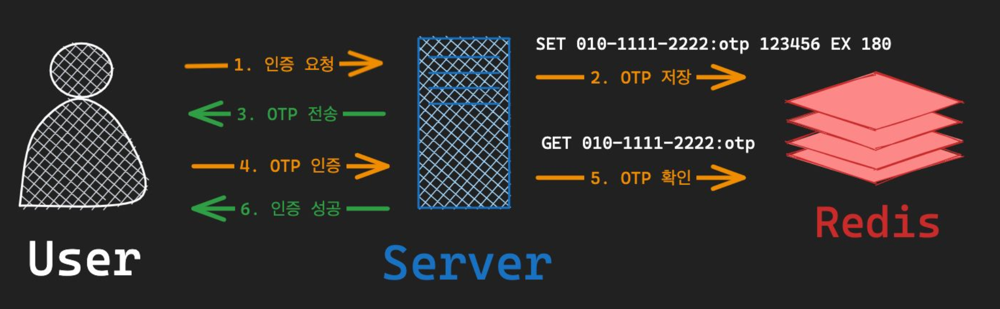

#### 1. 서버로 인증 요청

사용자가 웹 사이트나 앱 등의 인터페이스를 통해 로그인 또는 특정 작업을 수행하기 위해 인증 요청을 합니다.

#### 2. 레디스로 OTP 저장

서버는 랜덤한 OTP 값을 생성한 후, 해당 값을 Redis에 저장합니다.

```
$ SET 010-1111-2222:otp 123456 EX 180
```

위의 예제는 `010-1111-2222`라는 키로 OTP 값 `123456`을 저장하고, 유효시간을 3분 (180초)으로 설정합니다.

* **UUID or Random Value 생성**: 일반적으로 OTP는 랜덤한 문자열이나 숫자로 구성됩니다. 

* 이 때, key는 사용자의 식별 정보(e.g. 사용자 ID, 이메일, 전화번호 등)를 사용하고, value는 생성된 OTP 값입니다.

> **중복 검사**: 동일한 사용자에게 여러 번의 OTP 요청이 오는 경우, 이전 OTP 값을 무효화하거나 다른 방식으로 처리해야 할 수도 있습니다.

#### 3. OTP 클라이언트로 전송

생성된 OTP 값을 사용자에게 전송합니다. 일반적으로 SMS, 이메일, 또는 앱 내 알림으로 전송될 수 있습니다.

1. 사용자가 OTP를 입력하여 전송하면 서버는 해당 사용자의 ID와 함께 OTP 값을 받습니다.
2. Redis에서 해당 사용자의 OTP 값을 조회합니다.
3. 조회된 OTP 값과 사용자로부터 받은 OTP 값을 비교합니다.
4. 만약 값이 일치하면 인증에 성공한 것으로 간주하며, 일치하지 않거나 OTP 값이 만료(데이터가 존재하지 않을 경우)되었다면 인증 실패로 처리합니다.

> 이후 인증 성공시 만료시간을 이용해 삭제하거나 실패한 이후에는 Redis에서 해당 OTP 값을 삭제합니다

#### 4. 사용자로부터 서버로 OTP 인증

사용자는 받은 OTP 값을 입력하여 인증 요청을 합니다.

#### 5. OTP 번호 확인

서버는 Redis에서 해당 전화번호의 OTP 값을 조회합니다.

```
$ GET 010-1111-2222:otp
```

조회된 값과 사용자로부터 입력받은 OTP 값을 비교합니다.

#### 6. 인증 성공 or 실패

일치하면 인증 성공, 일치하지 않으면 실패로 처리합니다.

### 추가 고려사항

- **보안 고려**: OTP 값 생성 시, 보안을 위해 난수 생성 알고리즘을 사용하여 예측 불가능한 값이 생성되어야 합니다.
- **유효시간**: 3분은 일반적인 유효시간이지만, 유효시간은 서비스의 특성에 따라 조정될 수 있습니다.
- **재전송 기능**: 사용자가 OTP를 제대로 받지 못했을 때를 대비하여 재전송 기능을 제공하는 것이 좋습니다.
- **인증 실패 횟수 제한**: 연속적인 인증 실패 시, 일정 시간 동안 OTP 인증을 제한하거나 계정을 잠근다는 등의 조치를 취하는 것이 보안에 유리합니다.
- **OTP 삭제**: 인증이 성공하거나 유효시간이 지난 후, Redis의 해당 OTP 값은 삭제되어야 합니다. Redis의 TTL 기능으로 자동 삭제는 가능하지만, 명시적으로 삭제하는 것도 고려해볼만 합니다.
- **로그 기록**: 모든 인증 요청 및 결과는 로그로 기록되어야 합니다. 이는 문제 발생 시 추적이 용이하고, 보안 감사를 위해서도 필요합니다.
- **중복 전송 제한**: 동일한 번호로 연속적인 OTP 요청을 방지하기 위한 로직이 필요합니다.

## 분산 락 (Distrubuted Lock) - String Type

분산 환경의 다수의 프로세스에서 동일한 자원에 접근할 때, 동시성 문제 해결

* DB 레코드 락의 단점 : 성능 저하, 레코드가 없는 경우 락 불가능

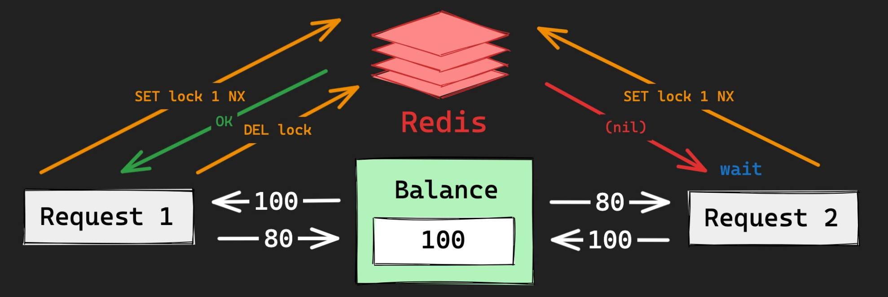


## Rate Limiter - String Type

시스템 안정성/보안을 위해 요청의 수를 제한하는 기술

* IP-Based, User-Based, Application-Based, etc

**Fixed-window Rate Limiting** :  고정된 시간(e.g. 1분) 안에 요청 수를 제한하는 방법

1. **Key 설정**: 사용자의 식별자(IP 주소, 사용자 ID 등)와 현재 시간 창을 기반으로 Redis 키를 생성합니다.

   예: `rate-limit:<USER_ID>:<current_window>`

2. **요청 시 마다 증가**: 해당 키의 값을 INCR 명령을 사용하여 요청 시마다 증가시킵니다.

3. **허용 횟수 체크**: INCR의 결과 값이 허용된 요청 횟수를 초과하는지 확인합니다.

4. **키 만료 설정**: 첫 번째 요청에 대한 응답으로 해당 키에 TTL(Time-To-Live)을 설정하여 시간 창이 지나면 자동으로 삭제되도록 합니다.

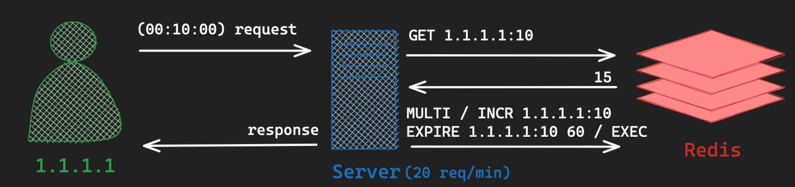

ex) IP 기준으로 분당 요청 수를 제한하는 예시

1. 요청이 들어올 때마다 아래 명령어를 실행합니다:

```
$ MULTI
$ INCR rate-limit:<IP_ADDRESS>:<current_minute>
$ EXPIRE rate-limit:<IP_ADDRESS>:<current_minute> 60
$ EXEC
```

**응용 프로그래밍 코드 (Kotlin)**:

1. lettuce

```kotlin
import io.lettuce.core.RedisClient;
import io.lettuce.core.api.StatefulRedisConnection;
import io.lettuce.core.api.sync.RedisCommands;

public class RateLimiter {

    private RedisClient redisClient;
    private StatefulRedisConnection<String, String> connection;
    private RedisCommands<String, String> syncCommands;

    public RateLimiter() {
        redisClient = RedisClient.create("redis://localhost:6379");
        connection = redisClient.connect();
        syncCommands = connection.sync();
    }

    public boolean checkRateLimit(String ipAddress) {
        String key = ipAddress + ":" + (System.currentTimeMillis() / 60000); // 분단위로 키 생성
        long currentCount;

        // 트랜잭션 시작
        syncCommands.multi();
        syncCommands.incr(key);
        syncCommands.expire(key, 60);
        syncCommands.exec();

        currentCount = Long.parseLong(syncCommands.get(key));

        return currentCount <= 100; // 분당 100회 제한
    }

    public void close() {
        connection.close();
        redisClient.shutdown();
    }

    public static void main(String[] args) {
        RateLimiter rateLimiter = new RateLimiter();
        String ip = "192.168.1.1";

        if(rateLimiter.checkRateLimit(ip)) {
            System.out.println("Request accepted.");
        } else {
            System.out.println("Rate limit exceeded!");
        }

        rateLimiter.close();
    }
}

```

2. redisson

```kotlin
import org.redisson.Redisson
import org.redisson.api.RBatch
import org.redisson.api.RedissonClient
import org.redisson.config.Config

class RateLimiter {

    private val redisson: RedissonClient

    init {
        val config = Config()
        config.useSingleServer().address = "redis://localhost:6379"
        redisson = Redisson.create(config)
    }

    fun checkRateLimit(ipAddress: String): Boolean {
        val limitPerMinute = 100
        val currentMinute = (System.currentTimeMillis() / 1000 / 60).toString()
        val key = "rate-limit:$ipAddress:$currentMinute"
		
      	// Redission을 사용해서 MULTI / EXEC 트랜잭션 블록을 사용하려면, RBatch 객체를 사용해야 한다.
        val batch = redisson.createBatch() // 트랜잭션용
        val atomicLongAsync = batch.getAtomicLong(key)
        val incrementFuture = atomicLongAsync.addAndGetAsync(1L)

        // 만약 이번이 첫 요청이라면, 해당 키에 대한 만료 시간을 설정합니다.
        atomicLongAsync.expireAsync(60)

        batch.execute()

        val currentCount = incrementFuture.get()

        // 현재 횟수가 제한을 초과했는지 확인합니다.
        return currentCount <= limitPerMinute
    }

    fun close() {
        redisson.shutdown()
    }
}

fun main() {
    val limiter = RateLimiter()
    val ipAddress = "192.168.0.1" // 예제 IP 주소

    if (limiter.checkRateLimit(ipAddress)) {
        println("요청을 처리합니다.")
    } else {
        println("Rate Limit를 초과했습니다.")
    }

    limiter.close()
}

```

## SNS Activity Feed(활동 피드) - List

Activity Feed :  사용자 또는 시스템과 관련된 활동이나 업데이트를 시간순으로 정렬하여 보여주는 기능

Fan-Out :  단일 데이터를 한 소스에서 여러 목적지로 동시에 전달하는 메시징 패턴

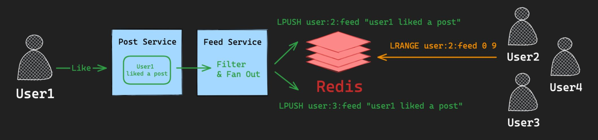

1. 유저 1이 특정 게시물 좋아요를 누르면 게시물 서비스로 올라감
2. Feed Service에서 필터링 및 fanout을 통해 user2와 user3의 feed List에 해당 내용을 추가
3. 유저2, 유저3이 해당 피드를 조회하면 반환한다.

## Shopping Cart(장바구니) - Set

사용자가 구매를 원하는 상품을 임시로 모아두는 가상의 공간

특징 :  수시로 변경이 발생할 수 있고, 실제 구매로 이어지지 않을 수도 있다

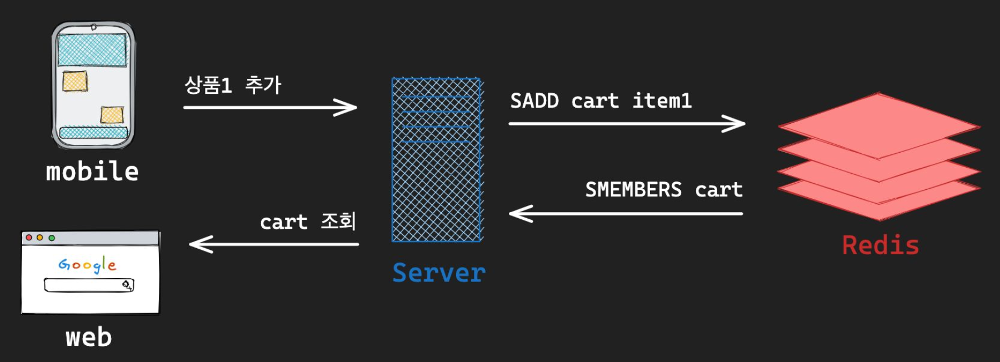

```kotlin
import io.lettuce.core.RedisClient
import io.lettuce.core.api.StatefulRedisConnection
import io.lettuce.core.api.sync.RedisCommands

class Cart {

    private val redisClient: RedisClient = RedisClient.create("redis://localhost:6379")
    private val connection: StatefulRedisConnection<String, String> = redisClient.connect()
    private val syncCommands: RedisCommands<String, String> = connection.sync()

    fun addItemToCart(userId: String, itemId: String) {
        val cartKey = "user:$userId:cart"
        syncCommands.sadd(cartKey, itemId)
    }

    fun getItemsFromCart(userId: String): Set<String>? {
        val cartKey = "user:$userId:cart"
        return syncCommands.smembers(cartKey)
    }

    fun removeItemFromCart(userId: String, itemId: String) {
        val cartKey = "user:$userId:cart"
        syncCommands.srem(cartKey, itemId)
    }

    fun clearCart(userId: String) {
        val cartKey = "user:$userId:cart"
        syncCommands.del(cartKey)
    }

    fun close() {
        connection.close()
        redisClient.shutdown()
    }
}

fun main() {
    val cart = Cart()
    val userId = "user123"

    cart.addItemToCart(userId, "item1")
    cart.addItemToCart(userId, "item2")
    println("Items in cart: ${cart.getItemsFromCart(userId)}")

    cart.removeItemFromCart(userId, "item1")
    println("Items in cart after removing item1: ${cart.getItemsFromCart(userId)}")

    cart.clearCart(userId)
    println("Items in cart after clearing: ${cart.getItemsFromCart(userId)}")

    cart.close()
}

```

- `RedisTemplate`은 Spring Data Redis 프로젝트의 일부입니다. Spring 프레임워크와 함께 사용하도록 설계되었으며, 일반적으로 Spring 애플리케이션에서 Redis와의 통신을 추상화하고 쉽게 진행할 수 있게 합니다.
- `RedisCommands`는 Lettuce 라이브러리의 일부입니다. 이는 비동기 Redis 클라이언트로, Spring과는 독립적입니다.


## Login Session - Hash

Login Session :  사용자의 로그인 상태를 유지하기 위한 기술
동시 로그인 제한 :  로그인시 세션의 개수를 제한하여, 동시에 로그인 가능한 디바이스 개수 제한

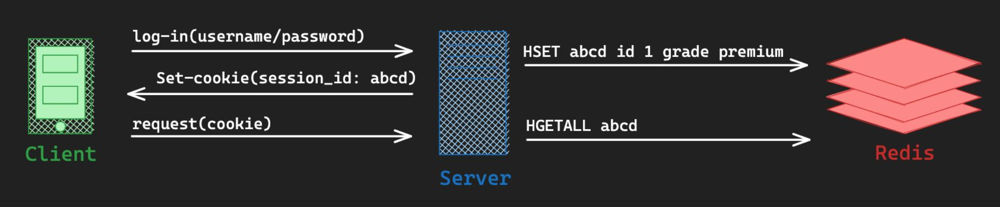

```kotlin
@Service
class LoginService(private val redisTemplate: StringRedisTemplate) {

    private val hashOperations: HashOperations<String, String, String> = redisTemplate.opsForHash()

    fun login(username: String, sessionId: String?): String {
        if (sessionId == null) {
          // UUID를 사용하여 임의의 sessionId를 생성합니다.
        	val sessionId = UUID.randomUUID().toString()
        	hashOperations.put("user_sessions", username, sessionId)

        	// 생성된 sessionId를 반환합니다.
        	return sessionId
        }

        val currentUserSession = hashOperations.get("user_sessions", username)

        // 이미 로그인 중인지 확인합니다.
        if (currentUserSession != null) {
            throw RuntimeException("이미 로그인 상태입니다.")
        }

        return sessionId
    }

    fun isUserLoggedIn(username: String): Boolean {
        return hashOperations.hasKey("user_sessions", username)
    }

    fun logout(username: String) {
        hashOperations.delete("user_sessions", username)
    }
}

```

추가 고려사항

1. **세션 만료 처리**: Redis에서는 TTL(Time-To-Live) 기능을 사용하여 세션의 만료 시간을 설정할 수 있습니다. 사용자가 로그인 상태에서 일정 시간 동안 활동이 없으면 세션을 자동으로 만료시켜야 할 수도 있습니다.
2. **비밀번호 암호화**: 사용자의 패스워드는 평문으로 저장해서는 안 됩니다. 패스워드는 암호화하여 저장하고, 로그인 시 암호화된 값으로 비교해야 합니다.
3. **다중 장치 로그인 관리**: 사용자가 다른 장치 또는 브라우저에서 로그인하는 경우, 기존 세션을 종료할 것인지, 여러 세션을 동시에 유지할 것인지 등의 정책을 결정해야 합니다.
4. **비정상적인 로그인 시도 감지**: 로그인 시도가 반복적으로 실패하는 경우, 이를 감지하여 일정 시간 동안 해당 IP 또는 계정의 로그인을 제한할 수 있습니다.
5. **세션 활동 로깅**: 사용자의 세션 활동을 로깅하여 이상한 활동을 감지하거나, 추후 분석을 위해 사용할 수 있습니다.
6. **Two-Factor Authentication**: 보안 강화를 위해 2단계 인증을 추가로 구현할 수 있습니다.
7. **로그아웃시 세션 삭제**: 로그아웃할 때 Redis에서 해당 사용자의 세션 정보를 삭제하여 자원을 효율적으로 관리합니다.
8. **세션 갱신**: 사용자가 활동을 계속하는 경우, 세션의 만료 시간을 연장할 수 있습니다.
9. **스케일링과 복제**: 높은 트래픽을 처리하기 위해 Redis 클러스터를 구성하거나, 주/종 복제를 통해 데이터 복구 및 높은 가용성을 확보해야 할 수도 있습니다.


## Sliding Window Rate Limiter - Sorted Set

Sliding Window Rate Limiter :  시간에 따라 Window를 이동시켜 동적으로 요청수를 조절하는 기술

* vs. Fixed Window Fixed Window는 window 시간마다 허용량이 초기화 되지만,
  Sliding Window는 시간이 경과함에 따라 window가 같이 움직인다

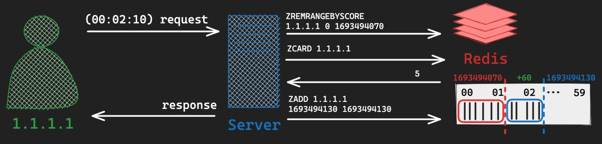


## Geofencing - Geospatial

Geofencing  : 위치를 활용하여 지도 상의 가상의 경계 또는 지리적 영역을 정의하는 기술

```sh
$ GEOADD gang-nam:burgers
127.025705 37.501272 five-guys
127.025699 37.502775 shake-shack
127.028747 37.498668 mc-donalds
127.027531 37.498847 burger-king

$ GEORADIUS gang-nam:burgers
127.027583 37.497928 0.5 km
결과 : 반경내에 나옴
```


## Online Status - 사용자의 현태 상태를 표시하는 기능 : Bitmap

사용자의 현재 상태를 표시하는 기능

특징 실시간성을 완벽히 보장하지는 않는다. 수시로 변경되는 값이다

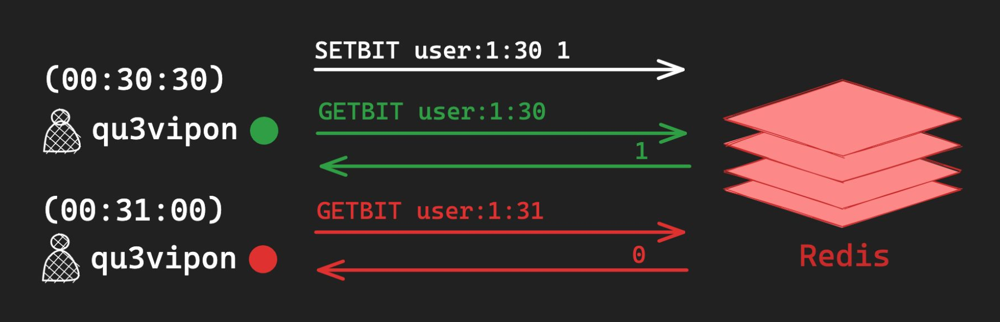

```kotlin
@Service
class OnlineStatusService(private val redisTemplate: RedisTemplate<String, Any>) {

    companion object {
        const val ONLINE_STATUS_KEY = "users:online"
    }

    // Set user online status as online
    fun setUserOnline(userId: Long) {
        redisTemplate.opsForValue().setBit(ONLINE_STATUS_KEY, userId, true)
    }

    // Set user online status as offline
    fun setUserOffline(userId: Long) {
        redisTemplate.opsForValue().setBit(ONLINE_STATUS_KEY, userId, false)
    }

    // Check if user is online
    fun isUserOnline(userId: Long): Boolean {
        return redisTemplate.opsForValue().getBit(ONLINE_STATUS_KEY, userId) ?: false
    }
}

```


## HyperLogLog - 방문자 수 계산 

Visitors Count Approximation :  방문자 수(또는 특정 횟수)를 대략적으로 추정하는 경우

정확한 횟수를 셀 필요 없이 대략적인 어림치만 알고자 하는 경우

* 대규모 데이터 집합의 고유한 요소 수를 정확하게 세기 위한 작업은 비효율적이므로, HyperLogLog는 정확도를 조금 포기하고 메모리 사용량을 최적화한 방법을 제공합니다.

```sh
$ PFADD today:users
user:1:1693494070
user:1:1693494071
user:2:1693494071

$ PFCOUNT today:users
```

```kotlin
@Service
class VisitorService(private val redisTemplate: RedisTemplate<String, Any>) {

    fun addVisitor(userId: String) {
        redisTemplate.opsForHyperLogLog().add("today:users", userId)
    }

    fun getUniqueVisitorsCount(): Long {
        return redisTemplate.opsForHyperLogLog().size("today:users") ?: 0L
    }
}

@RestController
@RequestMapping("/visitors")
class VisitorController(private val visitorService: VisitorService) {

    @GetMapping("/count")
    fun getUniqueVisitorsCount(): ResponseEntity<String> {
        val count = visitorService.getUniqueVisitorsCount()
        return ResponseEntity.ok("Today's unique visitors: $count")
    }
}
```

## BloomFilter - 중복 이벤트 제거 

Unique Events : 동일 요청이 중복으로 처리되지 않기 위해 빠르게 해당 item이 중복인지 확인하는 방법

> 블룸 필터는 확률적 자료구조로, 어떤 요소가 집합 내에 있는지 아닌지를 빠르게 확인할 수 있게 해줍니다. 블룸 필터의 주요 특징은 특정 요소가 집합 내에 없다는 것을 100% 확신시켜주지만, 요소가 집합 내에 있다는 것을 100% 확신시켜주지는 않는다는 것입니다. 즉, 거짓 긍정(false positive)이 발생할 수 있습니다.
>
> 이런 특성 때문에 블룸 필터는 중복 검사나 캐시 전에 데이터의 존재 여부를 빠르게 확인하는 데 유용합니다.

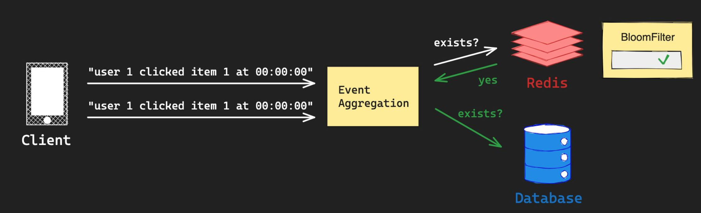

```kotlin
import io.lettuce.core.api.sync.RedisCommands
import java.time.Instant

class DuplicateRequestFilter(
    private val redisCommands: RedisCommands<String, String>,
    private val bloomFilterKey: String
) {
    companion object {
        // "따닥" 요청을 판별하기 위한 유효 시간 (예: 100ms)
        private const val DUPLICATE_TIME_WINDOW_IN_MILLIS = 100L
        private const val PREFIX = "req:"
    }

    /**
     * 중복 요청인지 검사합니다.
     * @return 중복이면 true, 아니면 false
     */
    fun isDuplicate(requestId: String, timestampInMilliseconds: Long): Boolean {
        val uniqueId = "$PREFIX$requestId:$timestampInMilliseconds"
        // 블룸 필터에 존재하는지 확인
        val exists = redisCommands.get(bloomFilterKey)?.contains(uniqueId) ?: false
        if (!exists) {
            // 아직 블룸 필터에 존재하지 않는 요청입니다. 이를 블룸 필터에 추가합니다.
            redisCommands.append(bloomFilterKey, uniqueId)
            // "따닥" 요청 판별 시간만큼만 블룸 필터 데이터의 유효 시간을 설정합니다.
            redisCommands.pexpire(bloomFilterKey, DUPLICATE_TIME_WINDOW_IN_MILLIS)
        }
        return exists
    }
}

fun main() {
    val redisClient = /* Redis 연결 설정 */
    val syncCommands = redisClient.connect().sync()

    val filter = DuplicateRequestFilter(syncCommands, "bloom:requests")
    val requestId = "some-request-id"
    val timestamp = Instant.now().toEpochMilli()

    if (filter.isDuplicate(requestId, timestamp)) {
        println("중복 요청입니다.")
    } else {
        println("유효한 요청입니다.")
    }
}

```


# 6. Redis 사용시 주의사항

## O(N) 명령어

대부분의 명령어는 O(1) 시간복잡도를 갖지만, 일부 명령어의 경우 O(N)

* Redis는 Single Thread로 명령어를 순차적으로 수행하기 때문에, 오래 걸리는 O(N) 명령어 수행시, 전체적인 어플리케이션 성능 저하

예시

* KEYS : 지정된 패턴과 일치하는 모든 키 key 조회
  * Production 환경에서 절대 사용 금지 -> SCAN 명령어로 대체
* SMEMBERS :  Set의 모든 member 반환(N = Set Cardinality)
* HGETALL : Hash의 모든 field 반환(N = Size of Hash)
* SORT :  List, Set, ZSet의 item 정렬하여 반환

## Thundering Herd Problem

Thundering Herd : 병렬 요청이 공유 자원에 대해서 접근할 때, 급격한 과부하가 발생하는 문제

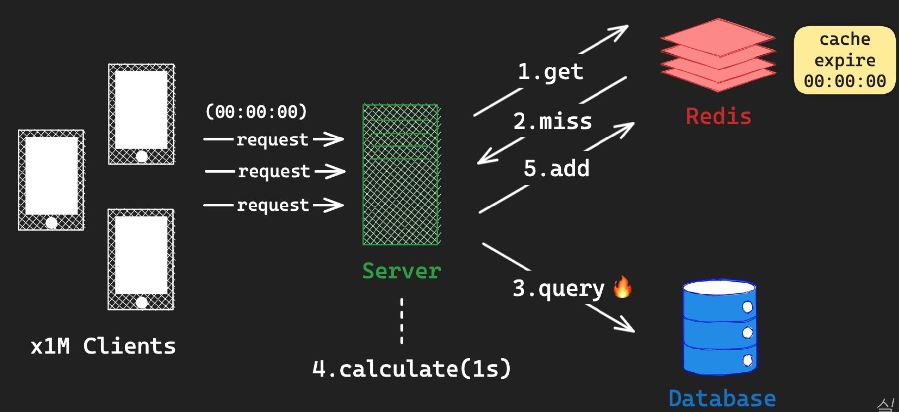

캐시의 만료에 의해 DB가 과부하걸리는 문제


방지방법(해결) : 별도의 cronJob에서 특정 캐시를 주기적으로 초기화 해준다.

캐시 관리도 유의해야 한다.


## Stale Cache Invalidation

Cache Invalidation :  캐시의 유효성이 손실되었거나 변경되었을 때, 캐시를 변경하거나 삭제하는 기술

Two Hard Things :  컴퓨터 과학과 소프트웨어 개발에서 마주칠 수 있는 두 가지 주요한 어려움에 관한 것입니다. 

> There are only two hard things in Computer Science: cache invalidation and naming things

1. **Cache Invalidation**:
   - 캐시는 종종 빠른 데이터 접근을 위해 사용됩니다. 어떤 정보나 데이터를 반복적으로 빠르게 가져와야 할 때, 이를 메인 저장소에서 직접 가져오는 것보다 캐시에서 가져오는 것이 훨씬 빠르기 때문입니다.
   - 그러나 어떤 시점에서 캐시의 데이터가 더 이상 유효하지 않게 되면, 이를 언제 그리고 어떻게 갱신할지 결정하는 것은 매우 복잡한 문제가 될 수 있습니다. 캐시된 데이터의 유효성을 언제까지 유지할 것인지, 언제 그 데이터를 갱신할 것인지 등을 결정하는 것이 '캐시 무효화' 문제입니다.
2. **Naming Things**:
   - 프로그래밍에서 변수, 함수, 클래스, 모듈 등의 이름을 정하는 것은 중요한 작업입니다. 적절한 이름은 코드의 가독성과 유지 보수성을 크게 향상시킬 수 있습니다.
   - 하지만, 특히 복잡한 시스템이나 큰 프로젝트에서 적절한 이름을 지어주는 것은 생각보다 어려운 일입니다. 이름은 해당 요소의 기능과 목적을 정확하게 반영해야 하며, 혼동을 줄이고, 나중에 코드를 읽는 사람에게도 명확한 의미를 전달해야 합니다.

### 해결 방법

- **Time-to-Live (TTL)**: 캐시된 항목에 유효 시간을 지정합니다. 지정된 시간이 지나면 캐시된 데이터는 자동으로 삭제됩니다. 이 방법은 데이터의 신선도를 유지하는데 도움이 됩니다.
- **Event-driven invalidation**: 데이터 변경을 감지하고 관련 캐시를 즉시 무효화하는 시스템을 구현합니다.
- **Write-through cache**: 데이터베이스에 데이터를 쓸 때 동시에 캐시를 업데이트하여 캐시와 데이터베이스 간의 일관성을 유지합니다.
- **Versioning**: 데이터에 버전 번호나 타임스탬프를 포함시켜 최신 버전의 데이터만 캐시에 저장하도록 합니다.


# 7. 마무리


# 번외 - Redis Paging과 fcm token idea

Redis의 자료구조(Lists, Sets 등)는 전통적인 RDBMS의 테이블과는 다르게 설계되어 있기 때문에 RDBMS의 OFFSET과 LIMIT처럼 페이징을 직접 지원하는 내장 명령어는 없습니다. 그러나 Redis의 자료구조를 활용하면 페이징과 유사한 작업을 수행할 수 있습니다.

1. **Lists**:

   - `LRANGE` 명령어를 사용하여 특정 범위의 항목들을 조회할 수 있습니다. 이를 통해 페이징과 유사한 작업을 수행할 수 있습니다.

   ```bash
   LRANGE mylist 0 9       # 첫 페이지의 10개 항목
   LRANGE mylist 10 19     # 두 번째 페이지의 10개 항목
   ```

2. **Sets**:

   - Sets는 정렬되지 않은 구조이므로 페이징이 의미가 없습니다. 하지만 Sorted Sets를 사용한다면 `ZRANGE` 또는 `ZREVRANGE` 명령어를 사용하여 페이징과 유사한 작업을 수행할 수 있습니다.

3. **Sorted Sets**:

   - `ZRANGE` 또는 `ZREVRANGE` 명령어를 사용하여 특정 범위의 항목들을 조회할 수 있습니다.

   ```bash
   ZRANGE mysortedset 0 9   # 첫 페이지의 10개 항목
   ZRANGE mysortedset 10 19 # 두 번째 페이지의 10개 항목
   ```

그러나 이러한 방법은 큰 데이터셋에서 효율적이지 않을 수 있으므로, 실제 운영 환경에서는 적절한 전략을 고려해야 합니다. 페이징이 필요한 상황에서는 Redis를 주 저장소로 사용하기 보다는 RDBMS와 같은 시스템과 함께 사용하는 것이 더 적합할 수 있습니다.


FCM을 사용하여 알림을 전송하려면 토큰을 천 개씩 꺼내서 전송해야 하는데, 이 작업을 Redis에서 효과적으로 수행하는 방법은 여러 가지가 있습니다.

1. **List 사용**:
   - Redis의 List 데이터 구조를 사용하여 FCM 토큰들을 저장할 수 있습니다.
   - `RPOP` 또는 `LPOP`과 같은 명령을 사용하여 List에서 토큰들을 천 개씩 꺼낼 수 있습니다. 이 방법은 토큰이 꺼내지면서 원래의 List에서 제거된다는 점을 주의해야 합니다. 따라서 전송이 성공적으로 완료된 후에 토큰을 제거하는 것이 좋습니다.
   - 천 개씩 꺼내진 토큰들로 FCM 알림을 전송하고, 전송이 완료되면 다음 천 개를 꺼내서 전송하는 방식으로 계속합니다.
2. **Sorted Sets 사용**:
   - FCM 토큰을 저장할 때 각 토큰에 고유한 점수(예: 시간스탬프)를 부여하여 Sorted Set에 저장합니다.
   - `ZRANGE` 명령을 사용하여 점수가 가장 낮은 천 개의 토큰들을 꺼냅니다.
   - 토큰들로 FCM 알림을 전송하고, 전송이 완료되면 해당 토큰들을 Sorted Set에서 제거합니다.
3. **페이징 사용하지 않기**:
   - FCM 토큰 전체를 한 번에 꺼내어 메모리에 저장합니다.
   - 메모리에서 천 개씩 분할하여 FCM 알림을 전송합니다.
   - 이 방법은 메모리 사용이 높을 수 있지만, FCM 토큰의 총 개수가 수백만 개 정도라면 대부분의 환경에서는 문제 없이 작동할 수 있습니다.

개인적으로는 **Sorted Sets**를 사용하는 방법을 추천합니다. 이 방법은 토큰을 천 개씩 꺼내면서도 원본 데이터를 보존하며, 필요한 토큰만을 효율적으로 꺼내서 사용할 수 있기 때문입니다. 또한 실패한 전송을 다시 시도하는 등의 추가 작업을 수행하기에도 좋습니다.


## 예제

**FCMService.java**

```java
@Service
public class FCMService {

    @Value("${firebase.config.path}")
    private String firebaseConfigPath;

    @PostConstruct
    public void initialize() {
        try {
            FileInputStream serviceAccount = new FileInputStream(firebaseConfigPath);
            FirebaseOptions options = FirebaseOptions.builder()
                .setCredentials(GoogleCredentials.fromStream(serviceAccount))
                .build();
            FirebaseApp.initializeApp(options);
        } catch (IOException e) {
            e.printStackTrace();
        }
    }

    public void sendMessage(List<String> tokens) {
        MulticastMessage message = MulticastMessage.builder()
            .putData("key", "value")
            .addAllTokens(tokens)
            .build();
        try {
            BatchResponse response = FirebaseMessaging.getInstance().sendMulticast(message);
            System.out.println("Successfully sent message: " + response);
        } catch (FirebaseMessagingException e) {
            e.printStackTrace();
        }
    }
}
```

**RedisService.java**

```kotlin
@Service
class RedisService(
    private val redisTemplate: RedisTemplate<String, String>
) {

    fun addTokensToSortedSet(tokens: List<String>) {
        val opsForZSet = redisTemplate.opsForZSet()
        val tokenScoreMap = tokens.associateWith { System.currentTimeMillis().toDouble() }
        opsForZSet.add("fcmTokens", tokenScoreMap)
    }

    fun getTokensFromSortedSet(limit: Long): Set<String> {
        val opsForZSet = redisTemplate.opsForZSet()
        return opsForZSet.range("fcmTokens", 0, limit - 1) ?: emptySet()
    }

    fun removeTokensFromSortedSet(tokens: Set<String>) {
        val opsForZSet = redisTemplate.opsForZSet()
        opsForZSet.remove("fcmTokens", *tokens.toTypedArray())
    }
}
```

**NotificationService.java**

```kotlin
@Service
class NotificationService(
    private val fcmService: FCMService,
    private val redisService: RedisService
) {

    fun sendNotifications() {
        val limit = 1000L
        val tokens = redisService.getTokensFromSortedSet(limit)

        if (tokens.isNotEmpty()) {
            fcmService.sendMessage(tokens.toList())
            redisService.removeTokensFromSortedSet(tokens)
        }
    }
}
```

이렇게 서비스들을 설정한 후, 필요한 시점에 `NotificationService`의 `sendNotifications` 메소드를 호출하여 FCM 토큰을 가져와 알림을 전송할 수 있습니다.

이 예제는 간략하게 Sorted Sets와 FCM을 함께 사용하는 방법을 보여줍니다. 실제 프로덕션 환경에서는 예외 처리, 로깅, 재시도 메커니즘 등 추가적인 작업이 필요할 수 있습니다.


1. @Async를 사용한 비동기 처리

   :

   - `@EnableAsync`를 메인 클래스나 설정 클래스에 추가합니다.
   - `sendNotifications` 메서드에 `@Async` 어노테이션을 추가하여 비동기로 실행되도록 합니다.

```
kotlinCopy code
@Service
class NotificationService(
    private val fcmService: FCMService,
    private val redisService: RedisService
) {

    @Async
    fun sendNotifications() {
        val limit = 1000L
        val tokens = redisService.getTokensFromSortedSet(limit)

        while (tokens.isNotEmpty()) {
            fcmService.sendMessage(tokens.toList())
            redisService.removeTokensFromSortedSet(tokens)
        }
    }
}
```

1. ThreadPoolTaskExecutor를 사용한 병렬 처리

   :

   - 병렬 처리를 위해 `ThreadPoolTaskExecutor`를 설정하고 구성합니다.

```
@Configuration
@EnableAsync
class AsyncConfig : AsyncConfigurer {

    override fun getAsyncExecutor(): Executor {
        val executor = ThreadPoolTaskExecutor()
        executor.corePoolSize = 10
        executor.maxPoolSize = 50
        executor.setQueueCapacity(1000)
        executor.setThreadNamePrefix("Notification-")
        executor.initialize()
        return executor
    }
}
```


## 또다른 알림 서비스의 대략적인 설계안과 구현 방법

요구사항이야.  

1. 알림 서비스는 메인 애플리케이션이랑 분리되어 있다. 다른 애플리케이션들로부터 요청을 받는다. 
2. 전체 전송 요청이 들어오면 늦어도 1분 이내에 100만명 ~ 1000만명의 유저에게 보내고, 전송 기록을 남겨야 한다 
3. 전체 전송도 보내야 하지만, 1건, 또는 다건의 요청이 들어와도 전송할 수 있어야 한다.


