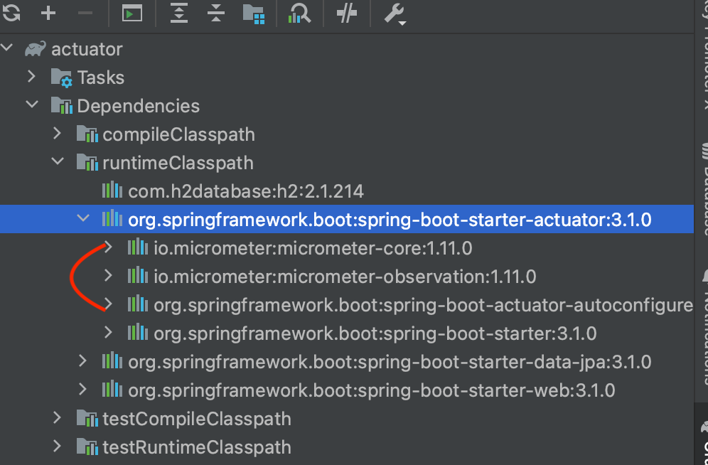

# 인프런 스프링부트 액츄에이터

* docs : https://docs.spring.io/spring-boot/docs/current/actuator-api/htmlsingle/
* https://docs.spring.io/spring-boot/docs/current/reference/html/actuator.html#actuator

* 강의자료 : https://semtul79.tistory.com/11

* 영상 : https://www.inflearn.com/course/lecture?courseSlug=spring-boot-actuator-%ED%8C%8C%ED%97%A4%EC%B9%98%EA%B8%B0&unitId=161076

* 밸덩 : https://www.baeldung.com/spring-boot-actuators

* nhn : http://forward.nhnent.com/hands-on-labs/java.spring-boot-actuator/04-endpoint.html

* 우형 : https://techblog.woowahan.com/9232/


### 의존성

```groovy
implementation 'org.springframework.boot:spring-boot-starter-actuator'
```


## 엔드포인트 접속

http://localhost:8080/actuator

```json
{
  "_links": {
    "self": {
      "href": "http://localhost:8080/actuator",
      "templated": false
    },
    "health-path": {
      "href": "http://localhost:8080/actuator/health/{*path}",
      "templated": true
    },
    "health": {
      "href": "http://localhost:8080/actuator/health",
      "templated": false
    }
  }
}	
```

이런식으로 항목별 상세링크를 알려주는 방식을 HATEOAS . 발음은 / 헤이티오스/ 라고 부릅니다. 


actuator의 핵심 라이브러리 : io.micrometer



 micrometer-core 의 내용을 살펴보면 spring boot 가 구동되는 

application 의 health, info, metric 정보들을 수집하는 역할을 하는 binder 클래스들이 아주 많이 구현되어 있는걸 알수 있습니다.

즉 자주 쓰는 대부분의 기능들에 대해 micrometer 에서 정보를 수집하는 binder 를 이미 제공하고 있습니다.


또한, spring boot 는 자동설정을 지원해주기에  

**spring-boot-actuator-autoconfigure 라이브러리**에서 정보를 수집할수 있도록 bean 으로 등록해주는데,

@ConditionalOnClass, @ConditionalOnBean 어노테이션을 통해 특정 클래스가 있을때만 빈으로 등록 하고 있습니다.

```java
package org.springframework.boot.actuate.autoconfigure.elasticsearch;

@AutoConfiguration(after = ElasticsearchRestClientAutoConfiguration.class)
@ConditionalOnClass(RestClient.class)
@ConditionalOnBean(RestClient.class)
@ConditionalOnEnabledHealthIndicator("elasticsearch")
public class ElasticsearchRestHealthContributorAutoConfiguration
		extends CompositeHealthContributorConfiguration<ElasticsearchRestClientHealthIndicator, RestClient> {

	public ElasticsearchRestHealthContributorAutoConfiguration() {
		super(ElasticsearchRestClientHealthIndicator::new);
	}

	@Bean
	@ConditionalOnMissingBean(name = { "elasticsearchHealthIndicator", "elasticsearchHealthContributor" })
	public HealthContributor elasticsearchHealthContributor(Map<String, RestClient> clients) {
		return createContributor(clients);
	}

}
```

* Elasticsearch 라이브러리에 관한 예 


# actuator 기본 설정과 endPoint

tp://localhost:8080/actuator 로 접속시 아래와 같은 json 이 나오고, json 내의 링크들에 들어가면 또 다시 json 이 나오는 구조라고 설명을 했습니다. (HATEOAS)

```json
{
  "_links": {
    "self": {
      "href": "http://localhost:8080/actuator",
      "templated": false
    },
    "health-path": {
      "href": "http://localhost:8080/actuator/health/{*path}",
      "templated": true
    },
    "health": {
      "href": "http://localhost:8080/actuator/health",
      "templated": false
    }
  }
}	
```

ctuator 에서는 java version, OS 버전 과 같은 다양한 정보를 제공해주는데 이런 정보는 누구에게나 open 되면 보안상 좋지 않기에, spring boot 에서는 default 설정으로는 위와 같이 2~3개로 제한되어 있습니다.

# 기본 제공되는 endpoints

https://docs.spring.io/spring-boot/docs/current/reference/html/actuator.html#actuator.endpoints

* https://docs.spring.io/spring-boot/docs/3.1.0/actuator-api/htmlsingle/

| beans      | 등록된 bean 목록 제공                                        |
| ---------- | ------------------------------------------------------------ |
| caches     | cache 사용중이라면 cache 관련 정보 제공                      |
| conditions | spring auto configuration 에 의해 bean으로 등록된것과 그렇지 않은 것의 상세 이유를 제공 |
| health     | application이 구동중인지, application과 연동되는 다른 서비스(DB, message queue)가 구동중인지 여부 제공 |
| info       | application 의 대략적인 정보                                 |
| metrics    | cpu, mem, thread count 등의 모니터링용 메트릭 정보           |
| logger     | 로거 설정 확인 실시간 로그 레벨 변경 제공                    |
| quartz     | quartz 라는 스케줄링 관련 라이브러리를 사용하고 있다면, quartz 관련 정보를 상세히 제공 |

## endpoint 활성화설정, 노출 설정

각 endpoint 는 enable/disable (활성화 여부)과 expose ( 노출 여부 ) 라는 2가지 설정을 할 수 있으며 2가지 모두 켜진 상태여야 외부로 노출이 됩니다.

* 즉 enable/disable 을 통해 spring boot 내부적으로 특정 endpoint 의 정보를 수집하는걸 설정할 수 있으며,
* expose 설정을 통해 최종적으로 web 이나 jmx ( = java 모니터링 관련 프로토콜/스펙) 에 해당 정보가 보이는걸(=노출) 설정할 수 있습니다.

* 둘 중 하나라도 off 이면 노출이 되지 않습니다. 

> **endpoint는 각각의 활성화 관련 설정** 
>
> **endpoints 각각의 노출 관련 설정** 

default 설정으로 활성화된 endpoint 는 shutdown 이라는 endpoint 를 제외하고 모두 활성화 되어 있습니다.

특정 endpoint 를 enable / disable 하는 방법은 

application.yml 에서 아래처럼 managment.endpoint 하위에 endpoint 명을 적고 enabled 에 true, false 를 지정해주면 됩니다

include는 노출에 포함할 endpoint,

exclude 는 노출에 제외할 endpoint 라는 뜻입니다. 

```yml

management:
  endpoints: // 각각의 노출 관련 설정
    web:
      exposure:
        include:
          - health
          - "*"

  endpoint: // 활성화 관련 설정 
    health:
      enabled: true
    beans:
      enabled: false
    caches:
      enabled: true
    heapdump:
      enabled: true
```

* https://docs.spring.io/spring-boot/docs/current/reference/html/actuator.html#actuator.endpoints.exposing
* 만약 include 와 exclude 에 둘다 적으면 exclude 가 우선순위가 높다고 위 가이드에 적혀있습니다

주의할 점은 활성화 설정, 노출 설정을 모두 on 했더라도 추가 설정이 더 필요한 endpoint 들이 종종 있습니다.

아래 auditevents 라는 endpoint 는 AuditEventRepository 타입의 bean이 등록되어 있어야 동작을 한다고 적혀있습니다.

* [각 endpoint별 상세 설정 docs](https://docs.spring.io/spring-boot/docs/current/reference/html/actuator.html#actuator.endpoints)

yml 에서 * 는 특별한 의미를 가지기에 * 라고 적으면 안되고 "*" 와 같이 따옴표로 묶어줘야 에러가 나지 않습니다.


## 보안 문제

actuator 를 통해 application의 다양한 정보를 확인할 수 있고 , 특정 endpoint 에서는 실시간 변경도 가능하게 해줍니다. ( e.g. thread dump ) 따라서 보안상 문제가 있을 수 있으므로 spring security 혹은 이와 유사한 방법으로 보안 위험을 해결하도록 해야합니다.

가장 쉬운 방법은 spring security 를 통해 /actuator url 에 대해 http basic auth 을 적용해서 id, pw 가 맞아야만 pass 되도록 하면 됩니다.


## endpoint cache

http에 etag 와 같은 캐시 방법이 존재하듯이, endpoint 에도 cache 방법이 있습니다.

endpoint 마다 캐시값을 설정해주고 싶다면 아래처럼 management.endpoint.<endpoint명>.cache.time-to-live 에 값을 적어주면 됩니다.

```yml
management:

  endpoint:
    health:
      enabled: true
    beans:
      enabled: false
      cache:
        time-to-live: 1000ms
    caches:
      enabled: true
    heapdump:
      enabled: true
      cache:
        time-to-live: 1d
```

* time-to-live 는 java.time.Duration 타입
* 1s, 1ms, 10h, 20d 와 같이 값과 단위를 함께 적으면 됩니다
  * s -> 초, ms -> 밀리초, h -> 시간, d -> 일

## CORS support

일반적으로는 모니터링 서버에서 endpoint 를 호출합니다. 

* 즉 actuator 입장에서의 client 는 일반적으로는 다른 서버입니다. 

그러나 간혹 web 화면에서 endpoint 를 호출해야 할 수도 있습니다. 

이 경우 client 는 web 이 되며, http 요청은 일반적으로 javascript 를 이용할겁니다. 

웹브라우저에서는 자신의 도메인이 아닌 도메인으로 javascript 가 http 요청을 보내면 CORS 체크를 하게 되며, 서버단에 CORS 허용 설정이 없다면 http 요청이 실패하게 됩니다. 

spring 의 @RestController 를 이용한 클래스라면 @CrossOrigin 어노테이션 한줄 적어주면 끝나는데 cors 설정을 통해 가능합니다

```yml
management:
  endpoints:
    web:
      cors:
        allowed-origins: http://test.com
        allowed-methods: GET
```


# Custom Endpoint

실무에서 사내 정책에 따라 사내 전용 endpoint 가 필요한 경우가 있습니다.

* 공식 가이드 : https://docs.spring.io/spring-boot/docs/current/reference/html/actuator.html#actuator.endpoints.implementing-custom

example로 application에서 참조하는 라이브러리 이름과 버전 정보를 응답으로 내보내는 myLibraryInfo 라는 이름의 endpoint 를 만들어보도록 하겠습니다. 

*  **HTTP GET 요청에 대한 endpoint**

```java
@Component // config에서 bean 등록 대신 component도 사용 가능
@Endpoint(id = "myLibraryInfo") // endpoint id 지정
public class MyLibraryInfoEndpoint {

	@ReadOperation // read 요청에 대한 메서드 라는 의미
	public List<LibraryInfo> getLibraryInfos() {
		LibraryInfo libraryInfo1 = new LibraryInfo();
		libraryInfo1.setName("logback");
		libraryInfo1.setVersion("1.0.0");

		LibraryInfo libraryInfo2 = new LibraryInfo();
		libraryInfo2.setName("jackson");
		libraryInfo2.setVersion("2.0.0");

		return Arrays.asList(libraryInfo1, libraryInfo2);
	}


	@Data
	public static class LibraryInfo { // 정보를 리턴할 dto 클래스 
		private String name;
		private String version;
	}
}
```

위 EndPoint 클래스 Bean으로 등록되야 동작합니다. 

* config 클래스를 통한 Bean 등록이나 @Component 사용하면 된다. 

```java
@Endpoint(id = "myLibraryInfo")
```

rest controller 구현시의 아래 코드 정도의 역할이라고 보면 됩니다.

```java
@RestController
@RequestMapping("/api/myLibraryInfo")
```

@Endpoint 어노테이션에서 중요한 부분만 아래에 표시했습니다.

```java
@Target(ElementType.TYPE)   <-- type 즉 클래스 위에 지정 가능한 어노테이션
@Retention(RetentionPolicy.RUNTIME)
public @interface Endpoint {	
	String id() default "";       <-- value()가 없고 id()만 있음. 
}
```

* @Target 에 Type : class 에만 지정이 가능한 어노테이션

*  @Endpoint 는 value() 필드가 없으므로 @Endpoint("myLibraryInfo") 라고 적으면 오류.
* 따라서 반드시 @Endpoint(id = "myLibraryInfo") 와 같이 필드명을 명확히 지정해줘야 합니다.

```java
@ReadOperation

// 아래 어노테이션과 유사
@GetMapping 
```

* 즉 HTTP GET 요청, 즉 읽기 요청을 뜻합니다. 


http://127.0.0.1:8080/actuator 에 접근시,  해당 커스텀 엔드포인트가 보이며

```json
{
  "_links": {
    "self": {
      "href": "http://localhost:8080/actuator",
      "templated": false
    },
    "myLibraryInfo": {
      "href": "http://localhost:8080/actuator/myLibraryInfo",
      "templated": false
    },
    ... 생략
}
```

http://127.0.0.1:8080/actuator/myLibraryInfo에 접근시 지정한 정보들이 보이게 됩니다.

```json
[
  {
    "name": "logback",
    "version": "1.0.0"
  },
  {
    "name": "jackson",
    "version": "2.0.0"
  }
]
```

### HTTP Method

 thread dump 를 수행하라, logger level 을 debug 나 info 레벨로 변경하라. 와 같이 조회가 아닌 뭔가 수행하라는 명령을 actuator 를 통해 수행할수도 있는데 이때는 HTTP GET 이 적절해보이지 않습니다.

actuator 에서는 이런 문제를 해결하기 위해 아래처럼 @WriteOperation, @DeleteOperation 이라는 추가 어노테이션이 제공되며, 각 어노테이션별 매핑되는 HTTP Method 는 아래와 같습니다. 상식적이기에 외울것도 없어보입니다.

* https://docs.spring.io/spring-boot/docs/current/reference/html/actuator.html#actuator.endpoints.implementing-custom.web.method-predicates

| Operation          | HTTP method |
| :----------------- | :---------- |
| `@ReadOperation`   | `GET`       |
| `@WriteOperation`  | `POST`      |
| `@DeleteOperation` | `DELETE`    |

## 파라미터 수신방법

endpoint에서도 파라미터들을 수신할 수 있습니다.

* query string으로 수신하는 방법

* body 수신방법

* path 파라미터 수신방법


### query string으로 수신하는 방법

기존 메서드에 수신하고 싶은 파라미터를 적어주면 됩니다. 필수값이 아니라면 @Nullable 을 함께 적어줍니다.

* @Nullable 이 아닌 필드를 채우지 않는다면, 400 에러가 발생합니다.

```java
import org.springframework.lang.Nullable;

@ReadOperation
public List<LibraryInfo> getLibraryInfos(@Nullable String name, boolean includeVersion) {
		// TODO: 라이브러리 정보를 읽어서 name, version을 가져오는 코드가 있어야 하나 하드코딩으로 대체함.
		LibraryInfo libraryInfo1 = new LibraryInfo();
		libraryInfo1.setName("logback");
		libraryInfo1.setVersion("1.0.0");

		LibraryInfo libraryInfo2 = new LibraryInfo();
		libraryInfo2.setName("jackson");
		libraryInfo2.setVersion("2.0.0");

		List<LibraryInfo> resultList = Arrays.asList(libraryInfo1, libraryInfo2);

		if (name != null) {
			resultList = resultList.stream()
				.filter(libraryInfo -> libraryInfo.getName().equals(name))
				.toList();
		}

		if (!includeVersion) {
			resultList = resultList.stream()
				.map(libraryInfo -> {
					LibraryInfo simpleInfo = new LibraryInfo();
					simpleInfo.setName(libraryInfo.getName());
					// version 정보는 포함하지 않음.
					return simpleInfo;
				}).toList();
		}

		return resultList;
}
```

http://localhost:8080/actuator/myLibraryInfo?includeVersion=true&name=logback 호출시

```json
[
  {
    "name": "logback",
    "version": "1.0.0"
  }
]
```


### body 수신방법

HTTP POST 방식으로 매핑되기 위해 @WriteOperation 을 사용해야 하며, 수신하고 싶은 파라미터명을 적어주면 됩니다.

```java
@WriteOperation
public void changeSomething(String name, boolean enableSomething) {
		log.info("name: {}, enableSomething: {}", name, enableSomething);
}
```

단순한 파라미터 타입만 지원되기에 DTO와 같이 여러 멤버변수를 가진 객체를 파라미터로 지정해주는건 지원되지 않는다고 가이드 되고 있습니다. 

* https://docs.spring.io/spring-boot/docs/current/reference/html/actuator.html#actuator.endpoints.implementing-custom.input


spring mvc로 비유하자면, 입력값을 java DTO 타입으로 변환이 안되므로 simple 한 argument resolver 가 지원된다고 볼 수 있습니다.


### path 파라미터 수신방법

@Selector 라는 path 파라미터 수신용 어노테이션을 사용하면 됩니다.

```java
@ReadOperation
public String getPathVariable(@Selector String path1) {
	log.info("path1: {}", path1);
	return path1;
}
```

Selector 어노테이션을 내부를 보면 아래처럼 match 라는 필드가 있으며, 해당 필드는 SINGLE, ALL_REMAINING 중 하나를 넣을 수 있습니다. 하이라이트한 부분을 읽어보면 알 수 있듯이 모든 path 부분을 캡쳐하고, path 구분을 위해 String[] 형태로 변환된다고 적혀있습니다.

```java
@Target(ElementType.PARAMETER)
@Retention(RetentionPolicy.RUNTIME)
@Documented
public @interface Selector {


     //선택에 사용할 매치 유형입니다.
     // @return 매치 유형
    Match match() default Match.SINGLE;

    // {@code @Selector}와 함께 사용할 수 있는 매치 유형입니다.   
    enum Match {

        /**
         * 단일 항목을 캡처합니다. 예를 들어, 웹 애플리케이션의 경우 단일 경로 세그먼트입니다.
         * 매개변수 값은 {@code String} 소스에서 변환됩니다.
         */
        SINGLE,

        /**
         * 남은 모든 항목을 캡처합니다. 예를 들어, 웹 애플리케이션의 경우 모든 남은 경로 세그먼트입니다.
         * 매개변수 값은 {@code String[]} 소스에서 변환됩니다.
         */
        ALL_REMAINING

    }
}
```

/actuator/myLibraryInfo/path1/path2/path3 와 같이 path가 여러개일때도 처리가 가능합니다.

```java
@ReadOperation
public String getMultiPathVariable(@Selector(match = Selector.Match.ALL_REMAINING) String[] path) {
  log.info("path: {}", Arrays.asList(path));	
  return Arrays.asList(path).toString();
}
```

ALL_REMAINING 과 SINGLE 를 사용한 메서드를 각각 생성해 버리면, path 갯수에 상관없이 ALL_REMAINING 메서드만 호출됩니다.

 어느 메서드가 호출되는지 애매하고 외우기도 어려우니 Endpoint 당 @Selector 는 한개만 사용하는게 좋아 보입니다.


## web , jmx 선택

@Endpoint는 web 과 jmx 둘다 지원해주는 endpoint 입니다. 

만약 web 용으로만 endpoint 를 만들고 싶다면 

@WebEndpoint 를 이용하면 됩니다. 아래처럼 오직 HTTP 에만 노출되게 해줍니다.

```java
@WebEndpoint(id = "myLibraryInfo")
public class MyLibraryInfoEndpoint {
...
}
```

jmx 용으로만 endpoint 를 만들고 싶다면 당연히 @JmxEndpoint 를 이용하면 됩니다.

```java
@JmxEndpoint(id = "myLibraryInfo")
public class MyLibraryInfoEndpoint {
}
```


JMX(Java Management Extensions)는 자바 애플리케이션의 관리와 모니터링을 위한 표준화된 API(응용 프로그래밍 인터페이스)와 아키텍처입니다. JMX는 Java 애플리케이션의 다양한 관리 기능을 제공하여 애플리케이션의 상태, 성능, 리소스 사용 등을 모니터링하고 관리할 수 있도록 합니다.

JMX를 사용하면 다음과 같은 작업을 수행할 수 있습니다:

1. **애플리케이션 모니터링**: JMX를 사용하여 애플리케이션의 상태 및 동작을 실시간으로 모니터링할 수 있습니다. 예를 들어, CPU 사용량, 메모리 사용량, 스레드 개수 등의 지표를 확인하고 추적할 수 있습니다.
2. **애플리케이션 관리**: JMX를 사용하여 애플리케이션의 관리 작업을 수행할 수 있습니다. 예를 들어, 애플리케이션을 시작하거나 중지하고, 구성 속성을 동적으로 변경하고, 로깅 수준을 조정할 수 있습니다.
3. **알림 및 이벤트 처리**: JMX는 애플리케이션에서 발생하는 이벤트와 알림을 수신하고 처리할 수 있는 메커니즘을 제공합니다. 예를 들어, 특정 임계값을 초과하는 경우 경고를 생성하거나 이벤트를 트리거할 수 있습니다.

JMX는 자바 플랫폼의 일부로 제공되며, JDK(Java Development Kit)에 포함되어 있습니다. JMX를 사용하려면 애플리케이션 코드에 JMX 인터페이스를 구현하고, JMX 에이전트를 시작하여 애플리케이션을 모니터링 및 관리할 수 있도록 설정해야 합니다. JMX는 원격으로 애플리케이션을 관리할 수 있는 기능도 제공하여 분산 환경에서 애플리케이션을 모니터링하고 관리할 수 있습니다.

Spring Framework 및 Spring Boot와 함께 JMX를 사용하면 Spring 애플리케이션의 관리와 모니터링을 위한 다양한 기능을 활용할 수 있습니다. Spring Actuator는 JMX를 지원하여 애플리케이션의 상태 및 엔드포인트를 JMX를 통해 노출


### RestController랑 다른게 없다. 그러나

가만히 생각해보면 endpoint 들은 @RestController 어노테이션을 이용해서 우리가 자주 만들던 rest controller 와 다를게 없습니다. url 에 맞게 메서드 매핑을 해주고 json을 리턴하면 되니까요

* https://docs.spring.io/spring-boot/docs/current/reference/html/actuator.html#actuator.endpoints.implementing-custom.controller

DispatcherServlet -> controller 순으로 http 요청이 흘러가니 controller 앞단인 서블릿으로도 구현할 수 있습니다만. 

@ServletEndpoint 를 이용해서 구현할 수 있으나 동일하게 호환성을 위한 비용이 발생할 수 있으니 가급적 @Endpoint 를 이용하라고 권장하고 있습니다.

* https://docs.spring.io/spring-boot/docs/current/reference/html/actuator.html#actuator.endpoints.implementing-custom.servlet

actuator 가 아닌 직접 rest controller 만들면 되지 않나? " 라고 생각할 수도 있습니다. 그러나 직접 rest controller 로 만들어버리면, prometheus 와 같은 actuator 와 호환이 되는 여러 라이브러리와 연동이 될수 없습니다. 즉 actuator 가 일종의 인터페이스 역할이므로 다른 라이브러리와의 연동을 위해 actuator 를 이용하는게 좋습니다.  


# health endpoint

## default health endpoint

application.yml 에 아래 설정만 한 상태에서 spring boot 를 구동해봅시다.

```yml
management:
  endpoints:
    web:
      exposure:
        include: "*"
```

http://localhost:8080/actuator/health - 엔드포인트.

### show-components , show-details 

```yml
management:
  endpoints:
    web:
      exposure:
        include: "*"
  endpoint:
    health:
      show-components: ALWAYS
```

show-components 설정을 했더니 아래처럼 components 필드에 disk 와 ping 의 health 상태가 추가되었습니다. 

```json
{
  "status": "UP",
  "components": {
    "db": {
      "status": "UP"
    },
    "diskSpace": {
      "status": "UP"
    },
    "ping": {
      "status": "UP"
    }
  }
}
```

show-details 는 details 필드에 상세 정보를 보여주는 설정입니다.

```yml
management:
  endpoints:
    web:
      exposure:
        include: "*"
  endpoint:
    health:
      show-details: ALWAYS
```

```json
{
  "status": "UP",
  "components": {
    "diskSpace": {
      "status": "UP",
      "details": {
        "total": 994662584320,
        "free": 633907961856,
        "threshold": 10485760,
        "path": "/Users/ysk/study/study_repo/inf-spring-actuator/actuator/.",
        "exists": true
      }
    },
    "ping": {
      "status": "UP"
    }
  }
}
```

## 기본 제공해주는 health 정보들 

https://docs.spring.io/spring-boot/docs/current/reference/html/actuator.html#actuator.endpoints.health.auto-configured-health-indicators

 Spring Boot에서 자동 구성되는 HealthIndicator 목록과 각각의 기능을 나타냅니다. 

또한, 관리 기능의 `management.health.key.enabled`을 구성하여 선택한 HealthIndicator를 활성화 또는 비활성화할 수도 있습니다. 표에는 키(Key), 이름(Name), 설명(Description)이 포함되어 있습니다.

| Key           | Class Name                       | Description                                   |
| ------------- | -------------------------------- | --------------------------------------------- |
| cassandra     | CassandraDriverHealthIndicator   | Cassandra 데이터베이스의 가용성을 확인합니다. |
| couchbase     | CouchbaseHealthIndicator         | Couchbase 클러스터의 가용성을 확인합니다.     |
| db            | DataSourceHealthIndicator        | DataSource와의 연결을 확인합니다.             |
| diskspace     | DiskSpaceHealthIndicator         | 디스크 공간이 부족한지 확인합니다.            |
| elasticsearch | ElasticsearchRestHealthIndicator | Elasticsearch 클러스터의 가용성을 확인합니다. |
| hazelcast     | HazelcastHealthIndicator         | Hazelcast 서버의 가용성을 확인합니다.         |
| influxdb      | InfluxDbHealthIndicator          | InfluxDB 서버의 가용성을 확인합니다.          |
| jms           | JmsHealthIndicator               | JMS 브로커의 가용성을 확인합니다.             |
| ldap          | LdapHealthIndicator              | LDAP 서버의 가용성을 확인합니다.              |
| mail          | MailHealthIndicator              | 메일 서버의 가용성을 확인합니다.              |
| mongo         | MongoHealthIndicator             | MongoDB 데이터베이스의 가용성을 확인합니다.   |
| neo4j         | Neo4jHealthIndicator             | Neo4j 데이터베이스의 가용성을 확인합니다.     |
| ping          | PingHealthIndicator              | 항상 "UP"으로 응답합니다.                     |
| rabbit        | RabbitHealthIndicator            | RabbitMQ 서버의 가용성을 확인합니다.          |
| redis         | RedisHealthIndicator             | Redis 서버의 가용성을 확인합니다.             |

위의 표는 Spring Boot에서 자동 구성되는 HealthIndicator 목록을 보여주며, 애플리케이션의 다양한 시스템 및 서비스의 상태를 모니터링할 수 있도록 도와줍니다. 이러한 HealthIndicator는 Spring Actuator를 통해 노출되어 애플리케이션의 `/actuator/health` 엔드포인트를 통해 확인할 수 있습니다.

## 기본 제공되는 health 정보가 활성화 되기 위한 조건

DB health 정보가 보이기 위해서는 DB를 사용해야 합니다. 그래서 간단히 아래처럼 Database 설정을 해보겠습니다.

pom.xml 에 아래처럼 h2 DB 및 JPA 의존성을 넣어줍니다. 

DB관련 의존성만 넣으면 되는것이니 mysql, oracle 의존성을 넣어도 되며, JPA 대신 mybatis 를 넣어도 됩니다. 

```json
// http://localhost:8080/actuator/health
{
  "status": "UP",
  "components": {
    "db": {
      "status": "UP",
      "details": {
        "database": "H2",
        "validationQuery": "isValid()"
      }
    },
   
    "ping": {
      "status": "UP"
    }
  }
}
```

만약 redis, mongo 등의 다른 Database 를 추가로 연결해서 사용한다면 redis, mongo 등의 health 정보도 함께 보이게 됩니다.

## HealthIndicator , custom HealthIndicator 만들기

spring boot 에서는 기본 제공해주는 health 정보들이 많이 있습니다.

health 정보 제공하는 실제 클래스명입니다.

| Key           | Class Name                       | Description                                   |
| ------------- | -------------------------------- | --------------------------------------------- |
| cassandra     | CassandraDriverHealthIndicator   | Cassandra 데이터베이스의 가용성을 확인합니다. |
| couchbase     | CouchbaseHealthIndicator         | Couchbase 클러스터의 가용성을 확인합니다.     |
| db            | DataSourceHealthIndicator        | DataSource와의 연결을 확인합니다.             |
| diskspace     | DiskSpaceHealthIndicator         | 디스크 공간이 부족한지 확인합니다.            |
| elasticsearch | ElasticsearchRestHealthIndicator | Elasticsearch 클러스터의 가용성을 확인합니다. |
| hazelcast     | HazelcastHealthIndicator         | Hazelcast 서버의 가용성을 확인합니다.         |
| influxdb      | InfluxDbHealthIndicator          | InfluxDB 서버의 가용성을 확인합니다.          |
| jms           | JmsHealthIndicator               | JMS 브로커의 가용성을 확인합니다.             |
| ldap          | LdapHealthIndicator              | LDAP 서버의 가용성을 확인합니다.              |
| mail          | MailHealthIndicator              | 메일 서버의 가용성을 확인합니다.              |
| mongo         | MongoHealthIndicator             | MongoDB 데이터베이스의 가용성을 확인합니다.   |
| neo4j         | Neo4jHealthIndicator             | Neo4j 데이터베이스의 가용성을 확인합니다.     |
| ping          | PingHealthIndicator              | 항상 "UP"으로 응답합니다.                     |
| rabbit        | RabbitHealthIndicator            | RabbitMQ 서버의 가용성을 확인합니다.          |
| redis         | RedisHealthIndicator             | Redis 서버의 가용성을 확인합니다.             |

기본 제공되는 클래스중 하나인 [DataSourceHealthIndicator](https://github.com/spring-projects/spring-boot/tree/v3.0.5/spring-boot-project/spring-boot-actuator/src/main/java/org/springframework/boot/actuate/jdbc/DataSourceHealthIndicator.java) 의 내부구조를 살펴보겠습니다.

상속을 하고 있어 다소 복잡해보이나 결국 HealthIndicator 라는 인터페이스를 구현한 클래스입니다.

HealthIndicator 인터페이스의 중요한 부분만 발췌하면 아래와 같습니다.

health() 라는 메서드를 각자 구현해야 하고, getHealth() 메서드는 details 정보를 응답에 포함할지 여부만 제공하는 default 메서드 입니다.

```java
public interface HealthIndicator extends HealthContributor {
	
	default Health getHealth(boolean includeDetails) {
		Health health = health();
		return includeDetails ? health : health.withoutDetails();  <-- details 정보 포함여부 기능 제공
	}

	Health health();  <-- 여길 각 클래스에서 구현해야함.
}
```

### custom health indicator 

```java
@Component
public class MyCustomHealthIndicator implements HealthIndicator {
	@Override
	public Health health() {
		boolean status = getStatus();
		if (status) {
			return Health.up()
				.withDetail("key1", "value1")
				.withDetail("key2", "value2")
				.build();
		}

		return Health.down()
			.withDetail("key3", "value3")
			.withDetail("key4", "value4")
			.build();
	}

	boolean getStatus() {
		// 현재시각이 짝수,홀수인지에 따라 up, down을 판단하는 것으로 대체
		return System.currentTimeMillis() % 2 == 0;
	}
}
```

호출 결과

```json
// http://localhost:8080/actuator/health

{
  "status": "DOWN",
  "components": {
    "db": {
      "status": "UP",
      "details": {
        "database": "H2",
        "validationQuery": "isValid()"
      }
    },
    "myCustom": {
      "status": "DOWN",
      "details": {
        "key3": "value3",
        "key4": "value4"
      }
    },
    "ping": {
      "status": "UP"
    }
  }
}
```

클래스명을 MyCustomHealthIndicator 라고 만들었기에 HealthIndicator 를 제외한 앞쪽 부분이 json에 표시된다고 공식가이드에 적혀있습니다.

> The identifier for a given HealthIndicator  is the name of the bean `without the HealthIndicator  suffix`, if it exists. In the preceding example, the health information is available in an entry named my.

< 출처: https://docs.spring.io/spring-boot/docs/current/reference/html/actuator.html#actuator.endpoints.health.writing-custom-health-indicators >

만약 특정 상황일때만 bean 으로 등록하고 싶다면 어떻게 해야할까요? 

AutoConfiguration 관련 클래스에서 컨디션을 체크한 후 모두 만족되면 그때 HealthIndicator 관련 클래스들을 bean으로 등록해주는 겁니다. 

* DataSourceHealthContributorAutoConfiguration 클래스 확인

@ConditionalOnXXX 어노테이션이 익숙하지 않은 분들은 아래 공식 가이드를 참고해주세요.

* https://docs.spring.io/spring-boot/docs/current/reference/html/features.html#features.developing-auto-configuration.condition-annotations.class-conditions

## status 종류

* https://docs.spring.io/spring-boot/docs/current/reference/html/actuator.html#actuator.endpoints.health.writing-custom-health-indicators

| 상태 (Status)  | 매핑 (Mapping)                                    |
| -------------- | ------------------------------------------------- |
| DOWN           | SERVICE_UNAVAILABLE (503)                         |
| OUT_OF_SERVICE | SERVICE_UNAVAILABLE (503)                         |
| UP             | 기본적으로 매핑이 없으므로 HTTP 상태는 200입니다. |
| UNKNOWN        | 기본적으로 매핑이 없으므로 HTTP 상태는 200입니다. |

위의 표에서 볼 수 있듯이, DOWN 상태는 SERVICE_UNAVAILABLE (503)로 매핑됩니다. OUT_OF_SERVICE 상태도 SERVICE_UNAVAILABLE (503)로 매핑됩니다. UP 상태는 기본적으로 매핑이 없으므로 HTTP 상태는 200입니다. 마지막으로, UNKNOWN 상태도 기본적으로 매핑이 없으므로 HTTP 상태는 200입니다. 이러한 상태 매핑은 Spring Actuator의 `/actuator/health` 엔드포인트를 통해 확인할 수 있습니다.

* 특별한 이유가 없다면 http response status 는 default 값을 써야 서로가 편하지 않을까 싶습니다. 공부할것도 많은데 사내에서만 적용되는 코딩 규칙이 너무 많아지면 힘드니까요.

 더 확실하게 알고 싶다면 아래 링크를 정독하면 됩니다.

 https://docs.spring.io/spring-boot/docs/current/reference/html/actuator.html#actuator.endpoints.health

# info endpoint

이름 그대로 정보성 endpoint 인데, spring boot 에서는 아래 5가지를 기본 제공해주고 있습니다.

* https://docs.spring.io/spring-boot/docs/current/reference/html/actuator.html#actuator.endpoints.info.auto-configured-info-contributors

다음 표는 Spring이 적절한 경우 자동으로 구성하는 InfoContributor 빈들을 보여줍니다.

| ID    | Name                       | Description                                             | Prerequisites                                       |
| ----- | -------------------------- | ------------------------------------------------------- | --------------------------------------------------- |
| build | BuildInfoContributor       | 빌드 정보를 노출합니다.                                 | META-INF/build-info.properties 리소스가 필요합니다. |
| env   | EnvironmentInfoContributor | Environment의 info..로 시작하는 모든 속성을 노출합니다. | 없음                                                |
| git   | GitInfoContributor         | Git 정보를 노출합니다.                                  | git.properties 리소스가 필요합니다.                 |
| java  | JavaInfoContributor        | Java 실행환경 정보를 노출합니다.                        | 없음                                                |
| os    | OsInfoContributor          | 운영 체제 정보를 노출합니다.                            | 없음                                                |

위의 표에서 볼 수 있듯이, Spring은 적절한 경우 위의 InfoContributor 빈들을 자동으로 구성합니다. 

예를 들어, build 빈은 `META-INF/build-info.properties` 리소스가 존재할 때 빌드 정보를 노출하고, 

git 빈은 `git.properties` 리소스가 존재할 때 Git 정보를 노출합니다. 

env 빈은 Environment의 속성 중 이름이 `info..`로 시작하는 모든 속성을 노출합니다.

 java 빈은 Java 실행환경 정보를, os 빈은 운영 체제 정보를 노출합니다.

이러한 InfoContributor 빈들은 Spring Actuator의 `/actuator/info` 엔드포인트를 통해 확인할 수 있습니다.

```yml
management:
  endpoints:
    web:
      exposure:
        include: "*"
  info:
    os:
      enabled: true
    java:
      enabled: true
    env:
      enabled: true
```

build, git 은 enable 되어 있고 나머지는 disable 이 기본 값.

즉 별도 설정을 하지 않으면 해당 디폴트값으로 동작을 합니다.

http://localhost:8080/actuator/info 로 접속

```json
// http://localhost:8080/actuator/info
{
  "build": {
    "artifact": "actuator",
    "name": "actuator",
    "time": "2023-05-28T11:47:53.238Z",
    "version": "0.0.1-SNAPSHOT",
    "group": "com.ys"
  },
  "java": {
    "version": "17.0.5",
    "vendor": {
      "name": "Amazon.com Inc.",
      "version": "Corretto-17.0.5.8.1"
    },
    "runtime": {
      "name": "OpenJDK Runtime Environment",
      "version": "17.0.5+8-LTS"
    },
    "jvm": {
      "name": "OpenJDK 64-Bit Server VM",
      "vendor": "Amazon.com Inc.",
      "version": "17.0.5+8-LTS"
    }
  },
  "os": {
    "name": "Mac OS X",
    "version": "13.0.1",
    "arch": "aarch64"
  }
}
```

## info endpoint 내의 env 설정

그런데 env 는 왜 보이지 않을까요? 

아래처럼 info. 으로 시작하는 환경변수를 노출해준다고 가이드에 적혀있습니다.

아래처럼 application.yml 파일에 key: value 형태로 값을 적어주면 spring 에서는 환경변수로 인식을 합니다.

따라서 기존 application.yml 에 아래 내용을 추가로 넣어보겠습니다. 

```yml
// in gradle
info:
  my-app:
    any-value: someValue
    group-id: ${project.groupId}
    artifact-id: ${project.artifactId}
    encoding: ${project.build.sourceEncoding}
    java:
      version: ${java.version}
  made-by: ysk
  
// in maven
```

*  maven 의 경우 @xxx.xxx@ 와 같이 사용 ("@project.groupId@") 처럼
  * https://docs.spring.io/spring-boot/docs/current/reference/html/howto.html#howto.properties-and-configuration.expand-properties.maven
* gradle 의 경우 ${xxx.xxx} 와 같이 사용 
  * https://docs.spring.io/spring-boot/docs/current/reference/html/howto.html#howto.properties-and-configuration.expand-properties.gradle

@xx.xx@ 형식은 actuator 전용이 아닙니다. 

그래서 build time 에 maven 이나 gradle 의 속성값을 application.yml 에 넣어줄 수 있습니다. 

application.yml에 넣어주면 환경변수로 인식이 되므로 결국, maven , gradle 속성값을 환경변수로 사용할 수있다는 뜻입니다.

## env endpoint ( /actuator/env  VS /actuator/info )

심할 부분은 아래처럼 actuator 에 env 라는 endpoint 가 제공되고 있으며, 

여기에는 Environment 클래스(=환경변수 저장 클래스)내의 정보 즉 모든 환경변수값을 노출해 주고 있습니다.

http://localhost:8080/actuator/env

```json
// http://localhost:8080/actuator/env
{
  "activeProfiles": [
    
  ],
  "propertySources": [
    {
      "name": "server.ports",
      "properties": {
        "local.server.port": {
          "value": "******"
        }
      }
    },
    {
      "name": "systemProperties",
      "properties": {
        "java.specification.version": {
          "value": "******"
        },
        "sun.jnu.encoding": {
          "value": "******"
        },
        "java.class.path": {
          "value": "******"
        },
       ... 생략
```

즉 info. 로 시작하는 환경변수는 /actuator/env 에도 보여지며, /actuator/info 에도 보여집니다.

그러나 *** 와 같이 실제로 필요한 value 부분이 안보이도록 되어 있습니다. 민감정보이니 디폴트가 hidden 입니다.

다음과 같이 변경할 수 있습니다.

```yml
management:
	endpoint:
    env:
      show-values: always

```


```yml
management:
  endpoints:
    web:
      exposure:
        include: "*"
  info:
    os:
      enabled: true
    java:
      enabled: true
    env:
      enabled: true
		...
  endpoint: // here
    env:
      show-values: always
```

```json
// http://localhost:8080/actuator/env
{
  "activeProfiles": [
    
  ],
  "propertySources": [
    {
      "name": "server.ports",
      "properties": {
        "local.server.port": {
          "value": 8080
        }
      }
    },
    {
      "name": "servletContextInitParams",
      "properties": {
        
      }
    },
    {
      "name": "systemProperties",
      "properties": {
        "java.specification.version": {
          "value": "17"
        },
```


## git info 

prerequisites 즉 선결조건이 있습니다. git.properties 파일이 있어야합니다.

* https://docs.spring.io/spring-boot/docs/current/reference/html/howto.html#howto.build.generate-git-info

maven과 gradle의 조건이 다릅니다. 공식문서를 살펴보세요

```groovy
// gradle
plugins {
    id "com.gorylenko.gradle-git-properties" version "2.4.1"
}
```

maven

```xml
<build>
    <plugins>
        <plugin>
            <groupId>io.github.git-commit-id</groupId>
            <artifactId>git-commit-id-maven-plugin</artifactId>
        </plugin>
    </plugins>
</build>
```

* plugin 이 git.properties 파일을 빌드시 생성해주는 역할을 합니다

git 정보 설정:

```yml
management:
  info:
    git:
      mode: "full"
```

yml 설정

```yml
management:
  endpoints:
    web:
      exposure:
        include: "*"
  info:
    os:
      enabled: true
    java:
      enabled: true
    env:
      enabled: true
    git:
      enabled: true
      mode: "full" << here 
    build:
      enabled: true
  endpoint:
    env:
      show-values: always
```


git설정을 보니 mode 가 있고 기본값이 simple 로 되어 있습니다. full 로 설정한 후 다시 info endpoint 를 확인해보면 git 관련 상세정보가 보입니다.

## build info


* https://docs.spring.io/spring-boot/docs/3.0.4/reference/html/howto.html#howto.build.generate-info

gradle 기준

```groovy
// in build.gradle
springBoot {
    buildInfo()
}
```

maven

```xml
<build>
    <plugins>
        <plugin>
            <groupId>org.springframework.boot</groupId>
            <artifactId>spring-boot-maven-plugin</artifactId>
            <version>3.0.4</version>    
          <-- 자신의 spring boot 버전에 맞게 설정 필요. 
              spring-boot-starter-parent 에 의해 version을 상속받기에 version을 적지 않는걸 권장
            <executions>
                <execution>
                    <goals>
                        <goal>build-info</goal>
                    </goals>
                </execution>
            </executions>
        </plugin>
    </plugins>
</build>
```

이 후 maven install 등을 수행하면 META-INF 디렉토리 밑에 build-info.properties 가 생성된걸 알 수 있습니다.

* build/resources/main/META-INF/build-info.properties

```json
/ http://localhost:8080/actuator/info

{
	...
  "made-by": "ysk",
  "git": {
    "branch": "main",
    "commit": {
      "time": "2023-05-28T08:05:48Z",
      "message": {
        "full": "add : 로깅\n",
        "short": "add : 로깅"
      },
      "id": {
        "describe": "",
        "abbrev": "d546130",
        "full": "d54613086ff106a4e4dd92d5307a5da655f956ad"
      },
      "user": {
        "email": "kim206gh@naver.com",
        "name": "ysk"
      }
    },
    "build": {
      "version": "0.0.1-SNAPSHOT",
      "user": {
        "name": "ysk",
        "email": "kim206gh@naver.com"
      },
      "host": "MacBook-Pro-4.local"
    },
    ...
```


## custom info endpoint

InfoContributor 인터페이스를 구현한걸 bean 으로 등록하면 된다고 가이드 되고 있습니다. 

* https://docs.spring.io/spring-boot/docs/current/reference/html/actuator.html#actuator.endpoints.info.writing-custom-info-contributors

```java
package org.springframework.boot.actuate.info;

// 추가적인 정보 세부 내용을 기여하는 인터페이스입니다.
@FunctionalInterface
public interface InfoContributor {


	// 지정된 {@link Info.Builder Builder}를 사용하여 추가적인 세부 내용을 기여합니다.
	// @param builder 사용할 빌더
	void contribute(Info.Builder builder);
}
```

가장 중요한 contribute 메서드부분을 보면 아래처럼 

builder.withDetail 메서드에 string 타입의 이름, Map 타입으로 value 를 넣어주고 있습니다.

커스텀하기

```java
import org.springframework.boot.actuate.info.Info;
import org.springframework.boot.actuate.info.InfoContributor;
import org.springframework.stereotype.Component;

@Component
public class MyCustomInfoContributor implements InfoContributor {
	@Override
	public void contribute(Info.Builder builder) {
		HashMap<String, String> map = new HashMap<>();
		map.put("key1", "value1");
		map.put("key2", "value2");

		builder.withDetail("myCustomInfo", map);
	}
}
```

http://localhost:8080/actuator/info 접속

```json
// 20230528221902
// http://localhost:8080/actuator/info

{
	// ... 생략 

  "myCustomInfo": {
    "key1": "value1",
    "key2": "value2"
  }
}
```

## 동작 방식

InfoEndPoint 클래스에서 확인이 가능합니다.

```java
package org.springframework.boot.actuate.info;
@Endpoint(id = "info")
public class InfoEndpoint {

	private final List<InfoContributor> infoContributors;

	public InfoEndpoint(List<InfoContributor> infoContributors) { // 주입 
		Assert.notNull(infoContributors, "Info contributors must not be null");
		this.infoContributors = infoContributors;
	}

	@ReadOperation
	public Map<String, Object> info() {
		Info.Builder builder = new Info.Builder();
		for (InfoContributor contributor : this.infoContributors) {
			contributor.contribute(builder);
		}
		return OperationResponseBody.of(builder.build().getDetails());
	}

}
```

생성자에서 **InfoContributor** 를 구현한 bean들을 주입받고,

실제 제공해야할 시점에 for loop 로 bean들의 contribute() 메서드를 호출해서 info 정보를 구성해주고 있습니다.

또한 InfoContributorAutoConfiguration 클래스에서 

* env, git, build, java, os 5가지 InfoContributor 를 bean 으로 등록해 주는 코드가 있는걸 알 수 있습니다 