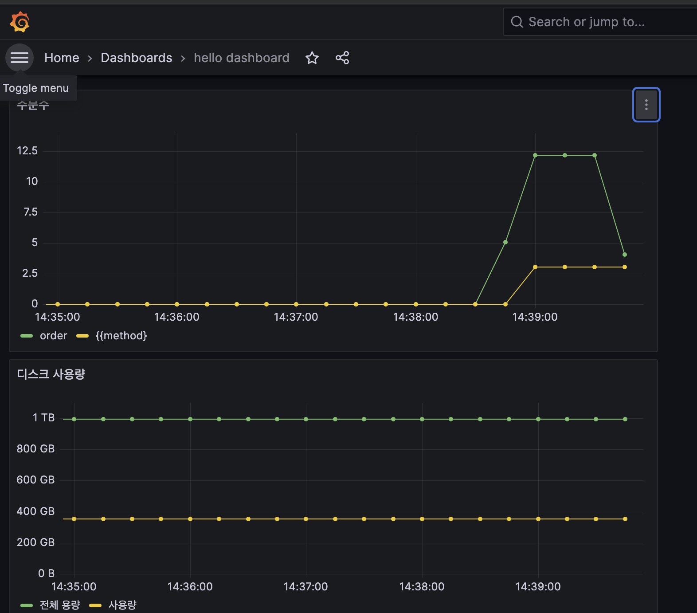

# 메트릭 등록 - 예제 만들기


예를 들어서 택배회사에 문제가 생겨서 고객들이 많이 기다리다가 지쳐서 취소수가 증가해도 CPU, 메모리
사용량 같은 시스템 메트릭에는 아무런 문제가 발생하지 않는다. 

* 이럴 때 비즈니스 메트릭이 있으면 이런 문제를 빠르게 인지할 수 있다


**여기서는 우리 비즈니스의 실시간 주문수, 취소수 또 실시간 재고 수량을 메트릭으로 등록하고 확인해보자**

각각의 메트릭은 다음과 같이 정의했다.

**주문수, 취소수**

* 상품을 주문하면 주문수가 증가한다.
* 상품을 취소해도 주문수는 유지한다. 대신에 취소수를 증가한다.

**재고 수량**

* 상품을 주문하면 재고 수량이 감소한다.
* 상품을 취소하면 재고 수량이 증가한다.
* 재고 물량이 들어오면 재고 수량이 증가한다.


주문수, 취소수는 계속 증가하므로 **카운터**를 사용하자.

재고 수량은 증가하거나 감소하므로 **게이지**를 사용하자.

```java
@RestController
public class OrderController {
	private final OrderService orderService;

	public OrderController(OrderService orderService) {
		this.orderService = orderService;
	}

	@GetMapping("/order")
	public String order() {
		log.info("order");
		orderService.order();
		return "order";
	}

	@GetMapping("/cancel")
	public String cancel() {
		log.info("cancel");
		orderService.cancel();
		return "cancel";
	}

	@GetMapping("/stock")
	public int stock() {
		log.info("stock");
		return orderService.getStock().get();
	}
}
//

@Service
public class OrderServiceV0 implements OrderService {

	private AtomicInteger stock = new AtomicInteger(100);

	@Override
	public void order() {
		log.info("주문");
		stock.decrementAndGet();
	}

	@Override
	public void cancel() {
		log.info("취소");
		stock.incrementAndGet();
	}

	@Override
	public AtomicInteger getStock() {
		return stock;
	}
}

```


# 메트릭 등록1 - 카운터

마이크로미터를 사용해서 메트릭을 직접 등록하는 방법

* 주문수, 취소수를 대상으로 카운터 메트릭을 등록하는 예제


## Counter(카운터)

* https://prometheus.io/docs/concepts/metric_types/#counter

단조롭게 증가하는 단일 `누적` 측정항목

* 단일 값
* 보통 하나씩 증가
* 누적이므로 전체 값을 포함(total)
* 프로메테우스에서는 일반적으로 카운터의 이름 마지막에 _total 을 붙여서 my_order_total 과 같이 표현함

* 값을 증가하거나 0으로 초기화 하는 것만 가능
* **예 ) HTTP 요청 수** 

주문수 취소수 서비스에 카운터 메트릭을 적용

```java
import io.micrometer.core.instrument.Counter;
import io.micrometer.core.instrument.MeterRegistry;

public class OrderServiceV1 implements OrderService {

	private final MeterRegistry registry;

	private AtomicInteger stock = new AtomicInteger(100);

	public OrderServiceV1(MeterRegistry meterRegistry) {
		this.registry = meterRegistry;
	}

	@Override
	public void order() {
		log.info("주문");
		stock.decrementAndGet();
		Counter.builder("my.order")
			.tag("class", this.getClass().getName())
			.tag("method", "order")
			.description("order")
			.register(registry).increment();
	}

	@Override
	public void cancel() {
		log.info("취소");
		stock.incrementAndGet();
		Counter.builder("my.order")
			.tag("class", this.getClass().getName())
			.tag("method", "cancel")
			.description("order")
			.register(registry).increment();
	}

	@Override
	public AtomicInteger getStock() {
		return stock;
	}
}

```

* `Counter.builder(name) `를 통해서 카운터를 생성한다. `name` 에는 메트릭 이름을 지정한다.
* `tag` 를 사용했는데, 프로메테우스에서 필터할 수 있는 `레이블로` 사용된다.
* 주문과 취소는 메트릭 이름은 같고 `tag` 를 통해서 구분하도록 했다.
* `register(registry)` : 만든 카운터를 `MeterRegistry` 에 등록한다. 이렇게 등록해야 실제 동작한다.
* `increment()` : 카운터의 값을 하나 증가한다.

### 액츄에이터 메트릭 확인

http://localhost:8080/actuator/metrics/my.order

* my.order는 MeterRegistry에 등록한 이름이다.

```java
Counter.builder("my.order")
			.tag("class", this.getClass().getName())
			.tag("method", "order")
			.description("order")
			.register(registry).increment();
```

결과

```json
// http://localhost:8080/actuator/metrics/my.order

{
  "name": "my.order",
  "description": "order",
  "measurements": [
    {
      "statistic": "COUNT",
      "value": 2.0
    }
  ],
  "availableTags": [
    {
      "tag": "method",
      "values": [
        "cancel",
        "order"
      ]
    },
    {
      "tag": "class",
      "values": [
        "hello.order.v1.OrderServiceV1"
      ]
    }
  ]
}
```

### 프로메테우스 포멧 메트릭 확인

http://localhost:8080/actuator/prometheus

```
... 너무많아서 생략

# HELP my_order_total order
# TYPE my_order_total counter
my_order_total{class="hello.order.v1.OrderServiceV1",method="order",} 1.0
my_order_total{class="hello.order.v1.OrderServiceV1",method="cancel",} 1.0

... 너무많아서 생략
```

메트릭 이름이 my.order my_order_total 로 변경된 것을 확인할 수 있다.

* 프로메테우스는 `.` -> `_` 로 변경한다.
  카운터는 마지막에 `_total` 을 붙인다. 프로메테우스는 관례상 카운터 이름의 끝에 _total 을 붙인다
* method 라는 tag , 레이블을 기준으로 데이터가 분류되어 있다.


## 그라파나 등록 - 주문수, 취소수 - 대시보드에 그래프 추가

http://localhost:3000/dashboards 

에서 대시보드 선택

add -> visualization

* Panel options -> title : 주문수 
* PromQL에 metric : `increase(my_order_total{method="order"}[1m])`
  * Options  -> Legend -> Custom -> `{{method}}`

* increase(my_order_total{method="cancel"}[1m])
  * Options  -> Legend -> Custom -> `{{method}}`

카운터는 계속 증가하기 때문에 특정 시간에 얼마나 증가했는지 확인하려면 increase() , rate() 같은 함수와 함께 사용하는 것이 좋다




# 메트릭 등록2 - @Counted

앞서 만든 OrderServiceV1 의 가장 큰 단점은 메트릭을 관리하는 로직이 핵심 비즈니스 개발 로직에
침투했다는 점이다. 이런 부분을 분리하려면 어떻게 해야할까? 바로 스프링 AOP를 사용하면 된다

직접 필요한 AOP를 만들어서 적용해도 되지만, 마이크로미터는 이런 상황에 맞추어 필요한 AOP
구성요소를 이미 다 만들어두었다

```java
@Slf4j
public class OrderServiceV2 implements OrderService {
	private AtomicInteger stock = new AtomicInteger(100);

	@Counted("my.order")
	@Override
	public void order() {
		log.info("주문");
		stock.decrementAndGet();
	}

	@Counted("my.order")
	@Override
	public void cancel() {
		log.info("취소");
		stock.incrementAndGet();
	}

	@Override
	public AtomicInteger getStock() {
		return stock;
	}
}
```

* @Counted 애노테이션을 측정을 원하는 메서드에 적용한다. 주문과 취소 메서드에 적용했다.
* 메트릭 이름을 지정하면 된다. (`@Counted("name")`) 여기서는 이전과 같은 my.order 를 적용했다.
* 위처럼 사용하면 tag 에 method 를 기준으로 분류해서 적용한다

```java
@Configuration
public class OrderConfigV2 {
	@Bean
	public OrderService orderService() {
		return new OrderServiceV2();
	}
	@Bean
	public CountedAspect countedAspect(MeterRegistry registry) {
		return new CountedAspect(registry);
	}
}
```

CountedAspect 를 등록하면 @Counted 를 인지해서 Counter 를 사용하는 AOP를 적용한다.

`CountedAspect를 빈으로 등록하지 않으면 @Counted 관련 AOP가 동작하지 않는다`

### 액츄에이터 메트릭 확인
http://localhost:8080/actuator/metrics/my.order

* 최소 매트릭이 1번은 찍혀야 동작한다.

```json
/ http://localhost:8080/actuator/metrics/my.order

{
  "name": "my.order",
  "measurements": [
    {
      "statistic": "COUNT",
      "value": 2.0
    }
  ],
  "availableTags": [
    {
      "tag": "result",
      "values": [
        "success"
      ]
    },
    {
      "tag": "exception",
      "values": [
        "none"
      ]
    },
    {
      "tag": "method",
      "values": [
        "cancel",
        "order"
      ]
    },
    {
      "tag": "class",
      "values": [
        "hello.order.v2.OrderServiceV2"
      ]
    }
  ]
}
```

* @Counted 를 사용하면 result , exception , method , class 같은 다양한 tag 를 자동으로 적용한다


# 메트릭 등록3 - Timer

Timer는 좀 특별한 메트릭 측정 도구인데, 시간을 측정하는데 사용된다

* 카운터와 유사한데, Timer 를 사용하면 실행 시간도 함께 측정할 수 있다.
* Timer 는 다음과 같은 내용을 한번에 측정해준다.
  * seconds_count : 누적 실행 수 - `카운터`
  * seconds_sum : 실행 시간의 합 -` sum`
  * seconds_max : 최대 실행 시간(가장 오래걸린 실행 시간) - `게이지`
  * 내부에 타임 윈도우라는 개념이 있어서 1~3분 마다 최대 실행 시간이 다시 계산(갱신)된다

```java
@Slf4j
public class OrderServiceV3 implements OrderService {
	private final MeterRegistry registry;
	private AtomicInteger stock = new AtomicInteger(100);

	public OrderServiceV3(MeterRegistry registry) {
		this.registry = registry;
	}

	@Override
	public void order() {
		Timer timer = Timer.builder("my.order")
			.tag("class", this.getClass().getName())
			.tag("method", "order")
			.description("order")
			.register(registry);
		timer.record(() -> {
			log.info("주문");
			stock.decrementAndGet();
			sleep(500);
		});
	}

	@Override
	public void cancel() {
		Timer timer = Timer.builder("my.order")
			.tag("class", this.getClass().getName()).tag("method", "cancel")
			.description("order")
			.register(registry);
		timer.record(() -> {
			log.info("취소");
			stock.incrementAndGet();
			sleep(200);
		});
	}

	private static void sleep(int l) {
		try {
			Thread.sleep(l + new Random().nextInt(200));
		} catch (InterruptedException e) {
			throw new RuntimeException(e);
		}
	}

	@Override
	public AtomicInteger getStock() {
		return stock;
	}
}
```

* Timer.builder(name) 를 통해서 타이머를 생성한다. name 에는 메트릭 이름을 지정한다.
* tag 를 사용했는데, 프로메테우스에서 필터할 수 있는 레이블로 사용된다.
* 주문과 취소는 메트릭 이름은 같고 tag 를 통해서 구분하도록 했다.
* register(registry) : 만든 타이머를 MeterRegistry 에 등록한다. 이렇게 등록해야 실제 동작한다.
* 타이머를 사용할 때는 timer.record() 를 사용하면 된다. 그 안에 시간을 측정할 내용을 함수로 포함하면 된다.

### 액츄에이터 메트릭 확인
http://localhost:8080/actuator/metrics/my.order

```json
// http://localhost:8080/actuator/metrics/my.order

{
  "name": "my.order",
  "description": "order",
  "baseUnit": "seconds",
  "measurements": [
    {
      "statistic": "COUNT",
      "value": 2.0
    },
    {
      "statistic": "TOTAL_TIME",
      "value": 0.906461999
    },
    {
      "statistic": "MAX",
      "value": 0.557823583
    }
  ],
  "availableTags": [
    {
      "tag": "method",
      "values": [
        "cancel",
        "order"
      ]
    },
    {
      "tag": "class",
      "values": [
        "hello.order.v3.OrderServiceV3"
      ]
    }
  ]
}
```

measurements 항목을 보면 COUNT , TOTAL_TIME , MAX 이렇게 총 3가지 측정 항목을 확인할 수 있다.

* COUNT : 누적 실행 수(카운터와 같다)
* TOTAL_TIME : 실행 시간의 합(각각의 실행 시간의 누적 합이다)
* MAX : 최대 실행 시간(가장 오래 걸린 실행시간이다)


평균 실행 시간도 계산할 수 있다.

* seconds_sum / seconds_count = 평균 실행시간


### 그라파나 패널 등록

패널 옵션

* Title : 주문수 v3

PromQL

* increase(my_order_seconds_count{method="order"}[1m])
  * Legend : {{method}}

* increase(my_order_seconds_count{method="cancel"}[1m])
  * Legend : {{method}}
* 참고: 카운터는 계속 증가하기 때문에 특정 시간에 얼마나 증가했는지 확인하려면 increase() , rate() 같은 함수와 함께 사용하는 것이 좋다.


평균 실행시간

* increase(my_order_seconds_sum[1m]) / increase(my_order_seconds_count[1m])


# 메트릭 등록4 - @Timed

타이머는 @Timed 라는 애노테이션을 통해 AOP를 적용할 수 있다

```java

import io.micrometer.core.annotation.Timed;

@Timed("my.order")
@Slf4j
public class OrderServiceV4 implements OrderService {
	private AtomicInteger stock = new AtomicInteger(100);

	@Override
	public void order() {
		log.info("주문");
		stock.decrementAndGet();
		sleep(500);
	}

	@Override
	public void cancel() {
		log.info("취소");
		stock.incrementAndGet();
		sleep(200);
	}

	private static void sleep(int l) {
		try {
			Thread.sleep(l + new Random().nextInt(200));
		} catch (InterruptedException e) {
			throw new RuntimeException(e);
		}
	}

	@Override
	public AtomicInteger getStock() {
		return stock;
	}
}
```

* @Timed("my.order") 타입이나 메서드 중에 적용할 수 있다. 

* 타입에 적용하면 해당 타입의 모든 public메서드에 타이머가 적용된다. 

* 참고로 이 경우 getStock() 에도 타이머가 적용된다


# 메트릭 등록5 - 게이지

Gauge(게이지)
https://prometheus.io/docs/concepts/metric_types/#gauge

게이지는 임의로 오르내릴 수 있는 단일 숫자 값을 나타내는 메트릭

* 값의 현재 상태를 보는데 사용
* **값이 증가하거나 감소할 수 있음**
* 예) 차량의 속도, CPU 사용량, 메모리 사용량
* **`카운터와 게이지를 구분할 때는 값이 감소할 수 있는가를 고민해보면 도움이 된다`**


재고 수량을 통해 게이지를 등록하는 방법

```java
@Configuration
public class StockConfigV1 {
	@Bean
	public MyStockMetric myStockMetric(
		OrderService orderService,
		MeterRegistry registry) {
		return new MyStockMetric(orderService, registry);
	}

	@Slf4j
	static class MyStockMetric {
		private OrderService orderService;
		private MeterRegistry registry;

		public MyStockMetric(OrderService orderService, MeterRegistry registry) {
			this.orderService = orderService;
			this.registry = registry;
		}

		@PostConstruct
		public void init() {
			Gauge.builder("my.stock", orderService, service -> {
				log.info("stock gauge call");
				return service.getStock().get();
			}).register(registry);
		}
	}
	
}
```

my.stock 이라는 이름으로 게이지를 등록

* Gauge.builder("my.stock"

게이지를 만들 때 함수(람다)를 전달했는데, 이 함수는 외부에서 메트릭을 확인할 때 마다 호출된다. 

이 함수의 반환 값이 게이지의 값이다

```java
Gauge.builder("my.stock", 
              orderService, 
              service -> {
                log.info("stock gauge call");
                return service.getStock().get();			
}).register(registry);
```


플리케이션을 실행하면 stock gauge call 로그가 주기적으로 남는다. 

게이지를 확인하는 함수는 외부에서 메트릭을 확인할 때 호출 된다. 

**현재 프로메테우스가 다음 경로를 통해 주기적으로 메트릭을 확인하기 때문이다.**

* http://localhost:8080/actuator/prometheus

카운터와 다르게 게이지는 무언가를 누적할 필요도 없고, 딱 현재 시점의 값을 보여주면 된다. 

따라서 측정 시점에 현재 값을 반환한다.


### 액츄에이터 메트릭 확인
http://localhost:8080/actuator/metrics/my.stock

```json
// http://localhost:8080/actuator/metrics/my.stock

{
  "name": "my.stock",
  "measurements": [
    {
      "statistic": "VALUE",
      "value": 100.0
    }
  ],
  "availableTags": [
    
  ]
}
```

* 게이지는 현재 값을 그대로 보여주면 되므로 단순하다

프로메테우스 포멧 메트릭 확인
http://localhost:8080/actuator/prometheus

```
# HELP my_stock
# TYPE my_stock gauge
my_stock 101.0
```


### 그라파나 등록 - 재고

패널 옵션

* Title : 재고

promQL : my_stock


## 게이지 단순하게 등록하기

```java
@Slf4j
@Configuration
public class StockConfigV2 {
	
	@Bean
	public MeterBinder stockSize(OrderService orderService) {
		return registry -> Gauge.builder("my.stock", orderService, service -> {
			log.info("stock gauge call");
			return service.getStock().get();
		}).register(registry);
	}
	
}
```

* `MeterBinder` 타입을 바로 반환해도 된다.
  * 이름과 람다를 지정해줘야 한다.


# 정리

Micrometer 사용법 이해
메트릭은 100% 정확한 숫자를 보는데 사용하는 것이 아니다. 약간의 오차를 감안하고 실시간으로 대략의
데이터를 보는 목적으로 사용한다.

**마이크로미터 핵심 기능**
Counter, Gauge, Timer, Tags

**MeterRegistry**
마이크로미터 기능을 제공하는 핵심 컴포넌트
스프링을 통해서 주입 받아서 사용하고, 이곳을 통해서 카운터, 게이지 등을 등록한다.

**Counter(카운터)**
https://prometheus.io/docs/concepts/metric_types/#counter
단조롭게 증가하는 단일 누적 측정항목
단일 값
보통 하나씩 증가
누적이므로 전체 값을 포함(total)
프로메테우스에서는 일반적으로 카운터의 이름 마지막에 _total 을 붙여서 my_order_total 과
같이 표현함
값을 증가하거나 0으로 초기화 하는 것만 가능
마이크로미터에서 값을 감소하는 기능도 지원하지만, 목적에 맞지 않음
예) HTTP 요청수

**Gauge(게이지)**
https://prometheus.io/docs/concepts/metric_types/#gauge
게이지는 임의로 오르내릴 수 있는 단일 숫자 값을 나타내는 메트릭
값의 현재 상태를 보는데 사용
값이 증가하거나 감소할 수 있음
예) 차량의 속도, CPU 사용량, 메모리 사용량
참고: 카운터와 게이지를 구분할 때는 값이 감소할 수 있는가를 고민해보면 도움이 된다.

**Timer**

Timer는 좀 특별한 메트릭 측정 도구인데, 시간을 측정하는데 사용된다.
카운터와 유사한데, Timer 를 사용하면 실행 시간도 함께 측정할 수 있다.
Timer 는 다음과 같은 내용을 한번에 측정해준다.
seconds_count : 누적 실행 수 - 카운터
seconds_sum : 실행 시간의 합 - sum
seconds_max : 최대 실행 시간(가장 오래걸린 실행 시간) - 게이지
내부에 타임 윈도우라는 개념이 있어서 1~3분 마다 최대 실행 시간이 다시 계산된다.
seconds_sum / seconds_count = 평균 실행시간

**Tag, 레이블**
Tag를 사용하면 데이터를 나누어서 확인할 수 있다.
Tag는 카디널리티가 낮으면서 그룹화 할 수 있는 단위에 사용해야 한다.
예) 성별, 주문 상태, 결제 수단[신용카드, 현금] 등등
카디널리티가 높으면 안된다. 예) 주문번호, PK 같은 것


# 실무 모니터링 환경 구성 팁

모니터링 3단계

* 대시보드
* 애플리케이션 추적 - 핀포인트
* 로그


## 대시보드


마이크로미터, 프로메테우스, 그라파나 등등 으로 구성

**모니터링 대상**

* 시스템 메트릭(CPU, 메모리)
* 애플리케이션 메트릭(톰캣 쓰레드 풀, DB 커넥션 풀, 애플리케이션 호출 수)
* 비즈니스 메트릭(주문수, 취소수)


## 애플리케이션 추적

주로 각각의 HTTP 요청을 추적, 일부는 마이크로서비스 환경에서 분산 추적

**제품**

핀포인트(오픈소스), 스카우트(오픈소스), 와탭(상용), 제니퍼(상용) 중 골라서 구성 

* https://github.com/pinpoint-apm/pinpoint


## 로그

가장 자세한 추적, 원하는데로 커스텀 가능

같은 HTTP 요청을 묶어서 확인할 수 있는 방법이 중요, MDC 적용

* MDC(Mapped Diagnostic Context)는 현재 실행중인 쓰레드에 메타 정보를 넣고 관리하는 공간이다. MDC는 내부적으로 Map을 관리하고 있어 (Key, Value) 형태로 값을 저장할 수 있다. 메티 정보를 쓰레드 별로 관리하기 위해 내부적으로는 쓰레드 로컬을 사용하고 있다.


**파일로 직접 로그를 남기는 경우**

일반 로그와 에러 로그는 파일을 구분해서 남기자

에러 로그만 확인해서 문제를 바로 정리할 수 있음


**클라우드에 로그를 저장하는 경우**

검색이 잘 되도록 구분


## 모니터링 정리

각각 용도가 다르다.

관찰을 할 때는 전체 점점 좁게

**핀포인트는 정말 좋다. 강추** 

마이크로 서비스 분산 모니터링도 가능, 대용량 트래픽에 대응


## 알람

알람은 2가지 종류로 꼭 구분해서 관리

* 경고, 심각

경고는 하루 1번 정도 사람이 직접 확인해도 되는 수준(사람이 들어가서 확인)

심각은 즉시 확인해야 함, 슬랙 알림(앱을 통해 알림을 받도록), 문자, 전화


예)

* 디스크 사용량 70% 경고
* 디스크 사용량 80% 심각
* CPU 사용량 40% 경고
* CPU 사용량 50% 심각


