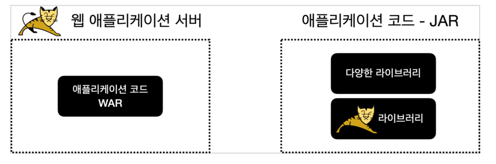
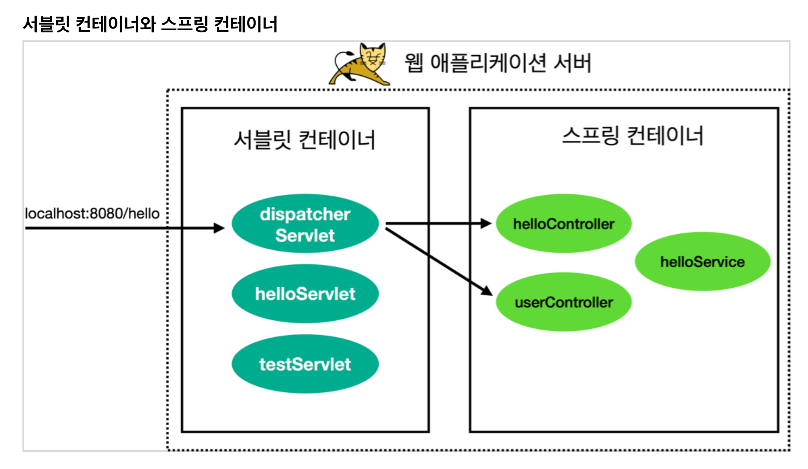
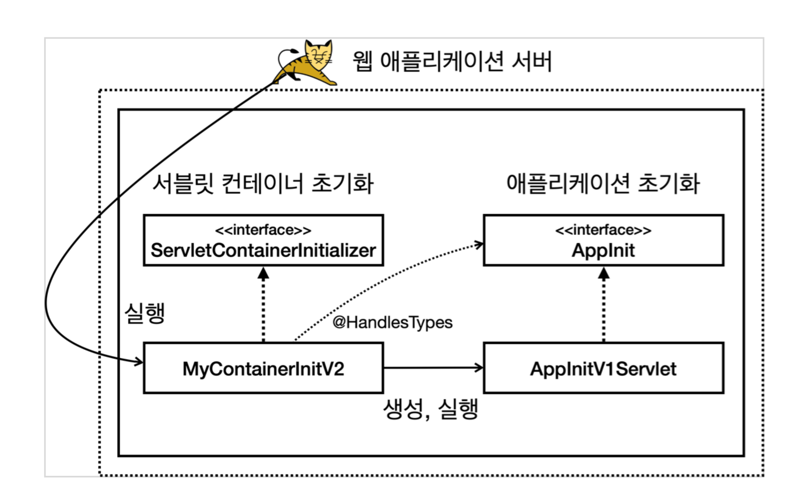

# 웹 서버와 스프링 부트 소개


외장 서버 VS 내장 서버



과거에 자바로 웹 애플리케이션을 개발할 때는 먼저 서버에 톰캣 같은 WAS(웹 애플리케이션 서버)를
설치했다. 그리고 WAS에서 동작하도록 서블릿 스펙에 맞추어 코드를 작성하고 WAR 형식으로 빌드해서
war 파일을 만들었다. 이렇게 만들어진 war 파일을 WAS에 전달해서 배포하는 방식으로 전체 개발 주기가
동작했다.
이런 방식은 WAS 기반 위에서 개발하고 실행해야 한다. IDE 같은 개발 환경에서도 WAS와 연동해서
실행되도록 복잡한 추가 설정이 필요하다


web.xml 대신에 자바 코드로 서블릿을 초기화 한다.


톰캣 설치
> 자바 버전 주의!
> 자바 17 버전 또는 그 이상을 설치하고 사용해주세요. 강의에서는 스프링 3.0을 사용하는데 자바 17이
> 최소 요구 버전입니다.

톰캣 다운로드

* https://tomcat.apache.org/download-10.cgi
* Download 메뉴에서 Apache Tomcat 10 버전의 톰캣 다운로드
* Core에 있는 zip 을 선택
* 다운로드 후 압축 풀기
  

톰캣 실행 설정

* MAC, 리눅스 사용자
* 톰캣폴더/bin 폴더로 이동
* 권한 주기: chmod 755 *
* 실행: ./startup.sh
* 종료: ./shutdown.sh


참고 - 실행 로그 확인
> 톰캣의 실행 로그는 톰캣폴더/logs/catalina.out 파일로 확인할 수 있다


### build.gradle

```groovy
plugins {
    id 'java'
    id 'war'
}

group = 'hello'
version = '0.0.1-SNAPSHOT'
sourceCompatibility = '17'

repositories {
    mavenCentral()
}

dependencies {
    //서블릿
    implementation 'jakarta.servlet:jakarta.servlet-api:6.0.0'
}

tasks.named('test') {
    useJUnitPlatform()
}

```

* id 'war' : 톰캣 같은 웹 애플리케이션 서버(WAS) 위에서 동작하는 WAR 파일을 만들어주는
  플러그인이다.
* jakarta.servlet-api : 서블릿을 사용할 때 필요한 라이브러리이다.


### TestServlet 등록

```java
package hello.servlet;

import java.io.IOException;

import jakarta.servlet.annotation.WebServlet;
import jakarta.servlet.http.HttpServlet;
import jakarta.servlet.http.HttpServletRequest;
import jakarta.servlet.http.HttpServletResponse;

/**
 * http://localhost:8080/test
 */
@WebServlet(urlPatterns = "/test")
public class TestServlet extends HttpServlet {
	@Override
	protected void service(HttpServletRequest req, HttpServletResponse resp)
		throws IOException {
		System.out.println("TestServlet.service");
		resp.getWriter().println("test");
	}
}

```


## WAR 빌드와 배포

프로젝트 빌드

```sh
./gradlew build
```

* WAR 파일 생성 확인
* build/libs/server-0.0.1-SNAPSHOT.war


### WAR 압축 풀기

```sh
jar -xvf ./build/libs/server-0.0.1-SNAPSHOT.war
```


# JAR, WAR 간단 소개

## JAR 소개

자바는 여러 클래스와 리소스를 묶어서 JAR (Java Archive)라고 하는 압축 파일을 만들 수 있다.
이 파일은 JVM 위에서 직접 실행되거나 또는 다른 곳에서 사용하는 라이브러리로 제공된다.
직접 실행하는 경우 main() 메서드가 필요하고, MANIFEST.MF 파일에 실행할 메인 메서드가 있는
클래스를 지정해두어야 한다.

실행 예) java -jar abc.jar

Jar는 쉽게 이야기해서 클래스와 관련 리소스를 압축한 단순한 파일이다. 필요한 경우 이 파일을 직접
실행할 수도 있고, 다른 곳에서 라이브러리로 사용할 수도 있다.


## WAR 소개

WAR(Web Application Archive)라는 이름에서 알 수 있듯 WAR 파일은 웹 애플리케이션 서버(WAS)에 배포할 때 사용하는 파일이다.
JAR 파일이 JVM 위에서 실행된다면, WAR는 웹 애플리케이션 서버 위에서 실행된다.

웹 애플리케이션 서버 위에서 실행되고, HTML 같은 정적 리소스와 클래스 파일을 모두 함께 포함하기
때문에 JAR와 비교해서 구조가 더 복잡하다.

그리고 WAR 구조를 지켜야 한다

### WAR 구조

* WEB-INF
  * classes : 실행 클래스 모음
  * lib : 라이브러리 모음
  * web.xml : 웹 서버 배치 설정 파일(생략 가능)
* index.html : 정적 리소스
* WEB-INF 폴더 하위는 자바 클래스와 라이브러리, 그리고 설정 정보가 들어가는 곳이다.
* WEB-INF 를 제외한 나머지 영역은 HTML, CSS 같은 정적 리소스가 사용되는 영역이다

### WAR 배포

1. 톰캣 서버를 종료한다. ./shutdown.sh
2. 톰캣폴더/webapps 하위를 모두 삭제한다.
3. 빌드된 server-0.0.1-SNAPSHOT.war 를 복사한다.
4. 톰캣폴더/webapps 하위에 붙여넣는다.
  * 톰캣폴더/webapps/server-0.0.1-SNAPSHOT.war
5. 이름을 변경한다.
  * 톰캣폴더/webapps/ROOT.war
6. 톰캣 서버를 실행한다. ./startup.sh

> ROOT.war 에서 ROOT 는 대문자를 사용해야 한다.

* 실행: ./startup.sh
* 종료: ./shutdown.sh


# 서블릿 컨테이너 초기화1

* WAS를 실행하는 시점에 필요한 초기화 작업들이 있다. 서비스에 필요한 필터와 서블릿을 등록하고, 여기에
  스프링을 사용한다면 스프링 컨테이너를 만들고, 서블릿과 스프링을 연결하는 디스페처 서블릿도 등록해야
  한다.

* WAS가 제공하는 초기화 기능을 사용하면, WAS 실행 시점에 이러한 초기화 과정을 진행할 수 있다.
* 과거에는 web.xml 을 사용해서 초기화했지만, 지금은 서블릿 스펙에서 자바 코드를 사용한 초기화도
  지원한다




## 서블릿 컨테이너 초기화 개발

서블릿은 **ServletContainerInitializer** 라는 초기화 인터페이스를 제공한다. 

이름 그대로 서블릿 컨테이너를 초기화 하는 기능을 제공한다.
서블릿 컨테이너는 실행 시점에 초기화 메서드인 **onStartup()** 을 호출해준다. 

여기서 애플리케이션에필요한 기능들을 초기화 하거나 등록할 수 있다.

```java
public interface ServletContainerInitializer {
	public void onStartup(Set<Class<?>> c, ServletContext ctx) throws ServletException;
}
```

* Set<Class<?>> c : 조금 더 유연한 초기화를 기능을 제공한다. @HandlesTypes 애노테이션과 함께
  사용한다. 이후에 코드로 설명한다.
* ServletContext ctx : 서블릿 컨테이너 자체의 기능을 제공한다. 이 객체를 통해 필터나 서블릿을 등록할
  수 있다

```java
public class MyContainerInitV1 implements ServletContainerInitializer {
	@Override
	public void onStartup(Set<Class<?>> c, ServletContext ctx) throws ServletException {
		System.out.println("MyContainerInitV1.onStartup");
		System.out.println("MyContainerInitV1 c = " + c);
		System.out.println("MyContainerInitV1 ctx = " + ctx);
	}
}
```

실행 결과

```
Connected to server
[2023-05-29 02:51:51,132] Artifact Gradle : hello : server-0.0.1-SNAPSHOT.war (exploded): Artifact is being deployed, please wait...
29-May-2023 02:51:51.346 정보 [RMI TCP Connection(2)-127.0.0.1] 
MyContainerInitV1.onStartup
MyContainerInitV1 c = null
MyContainerInitV1 ctx = org.apache.catalina.core.ApplicationContextFacade@37dabc9d
[2023-05-29 02:51:51,374] Artifact Gradle : hello : server-0.0.1-SNAPSHOT.war (exploded): Artifact is deployed successfully
[2023-05-29 02:51:51,374] Artifact Gradle : hello : server-0.0.1-SNAPSHOT.war (exploded): Deploy took 242 milliseconds
```


## 서블릿 컨테이너 초기화2

HelloServlet 이라는 서블릿을 서블릿 컨테이너 초기화 시점에 프로그래밍 방식으로 직접등록

서블릿을 등록하는 2가지 방법

* @WebServlet 애노테이션
* 프로그래밍 방식

참고 - 프로그래밍 방식을 사용하는 이유

@WebServlet 을 사용하면 애노테이션 하나로 서블릿을 편리하게 등록할 수 있다. 

하지만 애노테이션 방식을 사용하면 유연하게 변경하는 것이 어렵다. 마치 하드코딩 된 것 처럼 동작한다. 

 /test 경로를 변경하고 싶으면 코드를 직접 변경해야 바꿀 수 있다.
반면에 프로그래밍 방식은 코딩을 더 많이 해야하고 불편하지만 무한한 유연성을 제공한다.

예를 들어

* /hello-servlet 경로를 상황에 따라서 바꾸어 외부 설정을 읽어서 등록할 수 있다.
* 서블릿 자체도 특정 조건에 따라서 if 문으로 분기해서 등록하거나 뺄 수 있다.
* 서블릿을 내가 직접 생성하기 때문에 생성자에 필요한 정보를 넘길 수 있다

```java
@WebServlet(urlPatterns = "/test") // 불편
public class TestServlet extends HttpServlet {}
```


프로그래밍 방식 초기화가 더 유연하다! 

##  프로그래밍 방식 초기화

인터페이스 작성 및 클래스 작성

```java
// 우리가 작성한 인터페이스 
public interface AppInit {
	void onStartup(ServletContext servletContext);
}

// 
```

우리가 작성한 클래스 작성

```java
public class AppInitV1Servlet implements AppInit {

	@Override
	public void onStartup(ServletContext servletContext) {
		System.out.println("AppInitV1Servlet.onStartup");
		//순수 서블릿 코드 등록
		ServletRegistration.Dynamic helloServlet =
			servletContext.addServlet("helloServlet", new HelloServlet());
		helloServlet.addMapping("/hello-servlet");
	}

}
```


ServletContainerInitializer를 상속받는 클래스 생성

```java
@HandlesTypes(AppInit.class)
public class MyContainerInitV2 implements ServletContainerInitializer {

	@Override
	public void onStartup(Set<Class<?>> c, ServletContext ctx) throws
		ServletException {
		System.out.println("MyContainerInitV2.onStartup");
		System.out.println("MyContainerInitV2 c = " + c);
		System.out.println("MyContainerInitV2 container = " + ctx);
		for (Class<?> appInitClass : c) {
			try {
				//new AppInitV1Servlet()과 같은 코드
				AppInit appInit = (AppInit)
					appInitClass.getDeclaredConstructor().newInstance();
				appInit.onStartup(ctx);
			} catch (Exception e) {
				throw new RuntimeException(e);
			}
		}
	}

}
```

resources/META-INF/services/jakarta.servlet.ServletContainerInitializer에 아래 파일 작성

* MyContainerInitV2 를 실행하려면 서블릿 컨테이너에게 알려주어야 한다

```
hello.container.MyContainerInitV1
hello.container.MyContainerInitV2
```

* 패키지명 / 컨테이너 이름 
* 반드시 등록해야 실행된다. 

### 애플리케이션 초기화 과정

1. @HandlesTypes 애노테이션에 애플리케이션 초기화 인터페이스를 지정한다.
  * 여기서는 앞서 만든 AppInit.class 인터페이스를 지정했다.
2. 서블릿 컨테이너 초기화( ServletContainerInitializer )는 파라미터로 넘어오는 Set<Class<?>>
  c 에 애플리케이션 초기화 인터페이스의 구현체들을 모두 찾아서 클래스 정보로 전달한다.
  * 여기서는 @HandlesTypes(AppInit.class) 를 지정했으므로 AppInit.class 의 구현체인 AppInitV1Servlet.class 정보가 전달된다.
  * 참고로 객체 인스턴스가 아니라 클래스 정보를 전달하기 때문에 실행하려면 객체를 생성해서 사용해야 한다.
3. appInitClass.getDeclaredConstructor().newInstance()
  * 리플렉션을 사용해서 객체를 생성한다. 
  * 참고로 이 코드는 new AppInitV1Servlet() 과 같다 생각하면 된다.
4. appInit.onStartup(ctx)
  * 애플리케이션 초기화 코드를 직접 실행하면서 서블릿 컨테이너 정보가 담긴 ctx 도 함께 전달한다.



초기화는 다음 순서로 진행된다.
1. 서블릿 컨테이너 초기화 실행
  * resources/META-INF/services/jakarta.servlet.ServletContainerInitializer
2. 애플리케이션 초기화 실행
  * @HandlesTypes(AppInit.class)

서블릿 컨테이너 초기화만 있어도 될 것 같은데, 왜 이렇게 **복잡하게 애플리케이션 초기화라는 개념**을 만들었을까?

* 편리함
  * 서블릿 컨테이너를 초기화 하려면 ServletContainerInitializer 인터페이스를 구현한 코드를
    만들어야 한다. 
  * 여기에 추가로 META-INF/services/jakarta.servlet.ServletContainerInitializer 파일에 해당 코드를 직접 지정해주어야 한다.
  * 애플리케이션 초기화는 특정 인터페이스만 구현하면 된다.
* 의존성
  * 애플리케이션 초기화는 서블릿 컨테이너에 상관없이 원하는 모양으로 인터페이스를 만들 수 있다.
  * 이를 통해 애플리케이션 초기화 코드가 서블릿 컨테이너에 대한 의존을 줄일 수 있다. 
  * 특히 ServletContext ctx 가 필요없는 애플리케이션 초기화 코드라면 의존을 완전히 제거할 수도 있다.

## 스프링 컨테이너 등록

서블릿 컨테이너 초기화와 애플리케이션 초기화를 활용하면 된다.

다음과 같은 과정이 필요할 것이다.

* 스프링 컨테이너 만들기
* 스프링MVC 컨트롤러를 스프링 컨테이너에 빈으로 등록하기
* 스프링MVC를 사용하는데 필요한 디스패처 서블릿을 서블릿 컨테이너 등록하기


스프링 관련 라이브러리를 추가

```groovy
dependencies {
	//서블릿
	implementation 'jakarta.servlet:jakarta.servlet-api:6.0.0'
	//스프링 MVC 추가
	implementation 'org.springframework:spring-webmvc:6.0.4'
}
```

* spring-webmvc 라이브러리를 추가하면 스프링 MVC 뿐만 아니라 spring-core 를 포함한 스프링 핵심
  라이브러리들도 함께 포함된다.

간단한 컨트롤러를 생성하고, Configuration 클래스를 통해 컨트롤러를 Bean으로 등록한다.

* 컨트롤러를 스프링 빈으로 직접 등록한다. 참고로 여기서는 컴포넌트 스캔을 사용하지 않고 빈을 직접등록했다

```java
// controller
@RestController
public class HelloController {
  
	@GetMapping("/hello-spring")
	public String hello() {
		System.out.println("HelloController.hello");
		return "hello spring!";
	}
  
}

// config
@Configuration
public class HelloConfig {
	@Bean
	public HelloController helloController() {
		return new HelloController();
	}
}
```

다음으로 애플리케이션 초기화를 사용해서 서블릿 컨테이너에 스프링 컨테이너를 생성하고 등록

```java
public class AppInitV2Spring implements AppInit {
	
	@Override
	public void onStartup(ServletContext servletContext) {
		System.out.println("AppInitV2Spring.onStartup");

		//스프링 컨테이너 생성
		AnnotationConfigWebApplicationContext appContext
			= new AnnotationConfigWebApplicationContext();
		
		appContext.register(HelloConfig.class);
		//스프링 MVC 디스패처 서블릿 생성, 스프링 컨테이너 연결
		DispatcherServlet dispatcher = new DispatcherServlet(appContext);

		//디스패처 서블릿을 서블릿 컨테이너에 등록 (이름 주의! dispatcherV2)
		ServletRegistration.Dynamic servlet =
			servletContext.addServlet("dispatcherV2", dispatcher);

		// /spring/* 요청이 디스패처 서블릿을 통하도록 설정
		servlet.addMapping("/spring/*");
	}
	
}

```

* AppInitV2Spring 는 AppInit 을 구현했다. 
* AppInit 을 구현하면 애플리케이션 초기화 코드가 자동으로 실행된다. 앞서 MyContainerInitV2 에 관련 작업을 이미 해두었다

### 스프링 컨테이너 생성

* AnnotationConfigWebApplicationContext 가 바로 스프링 컨테이너이다.
  * AnnotationConfigWebApplicationContext 부모를 따라가 보면 ApplicationContext 인터페이스를 확인할 수 있다.
  * 이 구현체는 이름 그대로 애노테이션 기반 설정과 웹 기능을 지원하는 스프링 컨테이너로 이해하면 된다.

* appContext.register(HelloConfig.class)
  * 컨테이너에 스프링 설정을 추가한다

### 스프링 MVC 디스패처 서블릿 생성, 스프링 컨테이너 연결

* new DispatcherServlet(appContext)
* 코드를 보면 스프링 MVC가 제공하는 디스패처 서블릿을 생성하고, 생성자에 앞서 만든 스프링 컨테이너를
  전달하는 것을 확인할 수 있다. 이렇게 하면 디스패처 서블릿에 스프링 컨테이너가 연결된다.
* 이 디스패처 서블릿에 HTTP 요청이 오면 디스패처 서블릿은 해당 스프링 컨테이너에 들어있는 컨트롤러 빈들을 호출한다

### 디스패처 서블릿을 서블릿 컨테이너에 등록

* servletContext.addServlet("dispatcherV2", dispatcher)
  * 디스패처 서블릿을 서블릿 컨테이너에 등록한다.
* /spring/* 요청이 디스패처 서블릿을 통하도록 설정
  * /spring/* 이렇게 경로를 지정하면 /spring 과 그 하위 요청은 모두 해당 서블릿을 통하게 된다.
  * /spring/hello-spring
  * /spring/hello/go

> 서블릿을 등록할 때 이름은 원하는 이름을 등록하면 되지만 같은 이름으로 중복 등록하면 오류가 발생한다.

### 실행 과정 정리

/spring/hello-spring 실행을 /spring/* 패턴으로 호출했기 때문에 다음과 같이 동작한다.

```java
//스프링 MVC 디스패처 서블릿 생성, 스프링 컨테이너 연결		
DispatcherServlet dispatcher = new DispatcherServlet(appContext);

//디스패처 서블릿을 서블릿 컨테이너에 등록 (이름 주의! dispatcherV2)
ServletRegistration.Dynamic servlet = 
  servletContext.addServlet("dispatcherV2", dispatcher);

// /spring/* 요청이 디스패처 서블릿을 통하도록 설정
servlet.addMapping("/spring/*");
```


* dispatcherV2 디스패처 서블릿이 실행된다. ( /spring)
* dispatcherV2 디스패처 서블릿은 스프링 컨트롤러를 찾아서 실행한다. ( /hello-spring )
  * 이때 서블릿을 찾아서 호출하는데 사용된 /spring 을 제외한 /hello-spring 가 매핑된 컨트롤러
    HelloController )의 메서드를 찾아서 실행한다. 뒤에 * 부분으로 스프링 컨트롤러를 찾는다


## 스프링 MVC 서블릿 컨테이너 초기화 지원

서블릿 컨테이너 초기화 과정은 상당히 번거롭고 반복되는 작업이다.
스프링 MVC는 이러한 서블릿 컨테이너 초기화 작업을 이미 만들어두었다. 

덕분에 개발자는 서블릿 컨테이너 초기화 과정은 생략하고, 애플리케이션 초기화 코드만 작성하면 된다.
스프링이 지원하는 애플리케이션 초기화를 사용하려면 다음 인터페이스를 구현하면 된다.

```java
package org.springframework.web;

public interface WebApplicationInitializer {
	void onStartup(ServletContext servletContext) throws ServletException;
}
```

스프링이 지원하는 애플리케이션 초기화 코드를 사용해보자

META-INF/services/jakarta.servlet.ServletContainerInitializer 파일에 아래 추가

```
org.springframework.web.SpringServletContainerInitializer
```

코드 작성

```java
public class AppInitV3SpringMvc implements WebApplicationInitializer {
  
	@Override
	public void onStartup(ServletContext servletContext) throws
		ServletException {
		System.out.println("AppInitV3SpringMvc.onStartup");

		//스프링 컨테이너 생성
		AnnotationConfigWebApplicationContext appContext = new
			AnnotationConfigWebApplicationContext();
		appContext.register(HelloConfig.class);

		//스프링 MVC 디스패처 서블릿 생성, 스프링 컨테이너 연결
		DispatcherServlet dispatcher = new DispatcherServlet(appContext);

		//디스패처 서블릿을 서블릿 컨테이너에 등록 (이름 주의! dispatcherV3)
		ServletRegistration.Dynamic servlet =
			servletContext.addServlet("dispatcherV3", dispatcher);

		//모든 요청이 디스패처 서블릿을 통하도록 설정
		servlet.addMapping("/");
	}
}
```

* WebApplicationInitializer 는 스프링이 이미 만들어둔 애플리케이션 초기화 인터페이스이다
* servlet.addMapping("/") 코드를 통해 모든 요청이 해당 서블릿을 타도록 했다.
* 따라서 다음과 같이 요청하면 해당 디스패처 서블릿을 통해 /hello-spring 이 매핑된 컨트롤러메서드가 호출된다.


### 스프링 MVC가 제공하는 서블릿 컨테이너 초기화 분석 - SpringServletContainerInitializer

```java
@HandlesTypes(WebApplicationInitializer.class)
public class SpringServletContainerInitializer implements ServletContainerInitializer {}
```

@HandlesTypes 의 대상이 WebApplicationInitializer 이다. 그리고 이 인터페이스의 구현체를 생성하고 실행하는 것을 확인할 수 있다


지금까지 알아본 내용은 모두 서블릿 컨테이너 위에서 동작하는 방법이다. 

따라서 항상 톰캣 같은 서블릿 컨테이너에 배포를 해야만 동작하는 방식이다.
과거에는 서블릿 컨테이너 위에서 모든 것이 동작했지만, 스프링 부트와 내장 톰캣을 사용하면서 이런 부분이 바뀌기 시작했다.